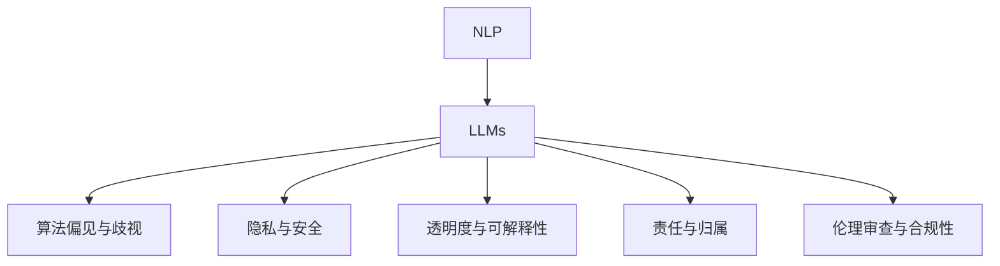

                 

# LLM的伦理与道德风险分析

> 关键词：自然语言处理,伦理学,道德风险,语言模型,算法公正,隐私保护,数据安全,伦理审查

## 1. 背景介绍

### 1.1 问题由来

随着深度学习技术和大规模预训练语言模型（Large Language Models, LLMs）的迅猛发展，AI在自然语言处理（Natural Language Processing, NLP）领域的各类应用取得显著进展，给各行各业带来了深远影响。然而，与此同时，涉及LLM的应用也面临一系列伦理和道德风险，如算法歧视、隐私泄露、数据滥用等问题逐渐凸显，受到社会各界的广泛关注。因此，如何在使用LLM进行实际应用时，兼顾技术性能和伦理道德，已经成为业界面临的紧迫任务。

### 1.2 问题核心关键点

LLM在应用中引发伦理和道德问题的核心在于以下几个方面：

1. **算法偏见与歧视**：预训练模型往往会反映出训练数据中的固有偏见，如性别、种族、地域等。这些偏见在微调过程中可能被放大，导致模型输出歧视性或非公正性的结果。
2. **隐私与安全**：在使用LLM处理个人数据时，如文本、语音等，可能存在隐私泄露的风险。此外，LLM处理过程中的数据安全也需得到保障，避免数据被恶意篡改或滥用。
3. **透明度与可解释性**：在实际应用中，LLM的决策过程通常缺乏可解释性，导致用户难以理解和信任模型的行为。
4. **责任与归属**：在AI决策过程中，谁应该对错误结果负责？当LLM模型产生负面影响时，应由开发者、模型所有者还是用户承担责任？
5. **伦理审查与合规性**：在许多行业，使用LLM进行数据分析和决策时，需遵循相关法律法规，如《个人信息保护法》、《数据安全法》等，并进行相应的伦理审查。

这些关键点共同构成了LLM应用中的伦理与道德风险框架，需要通过系统的分析与应对措施，确保其技术发展的健康和可持续性。

## 2. 核心概念与联系

### 2.1 核心概念概述

为更好地理解LLM的伦理与道德风险，本节将介绍几个密切相关的核心概念：

- **自然语言处理（NLP）**：指利用计算机技术处理和理解自然语言文本，包括文本生成、情感分析、机器翻译等任务。
- **大规模预训练语言模型（LLMs）**：指通过在无标签的大规模文本语料上进行自监督预训练，学习通用的语言表示，具备强大的语言理解和生成能力。
- **算法偏见与歧视**：指模型在训练和应用过程中，由于训练数据中的偏见，导致输出结果存在歧视性。
- **隐私与安全**：涉及个人数据的收集、存储和处理过程中，如何保障用户的隐私权利，防止数据被滥用或泄露。
- **透明度与可解释性**：指模型在做出决策时，其内部工作机制应尽可能清晰、可理解，使用户能够信任模型的行为。
- **责任与归属**：指在AI决策过程中，各方的责任划分和风险分担机制，确保在出现错误时，责任能够清晰界定。
- **伦理审查与合规性**：涉及模型在应用中，如何符合相关法律法规，防止产生负面社会影响。

这些核心概念之间的逻辑关系可以通过以下Mermaid流程图来展示：



这个流程图展示了大规模预训练语言模型在应用中的伦理和道德风险框架：

1. NLP领域中，LLMs提供强大的语言理解和生成能力。
2. LLMs在应用中可能引发算法偏见与歧视、隐私与安全等伦理和道德问题。
3. 这些问题需要通过透明度与可解释性、责任与归属、伦理审查与合规性等措施进行应对。

## 3. 核心算法原理 & 具体操作步骤

### 3.1 算法原理概述

LLM的伦理与道德风险涉及算法设计、数据处理、模型训练与评估等多个环节。核心算法原理主要体现在以下几个方面：

- **数据选择与预处理**：如何确保训练数据的多样性和代表性，避免数据集中存在的偏见被模型放大。
- **模型设计与训练**：如何设计公平、鲁棒的模型架构，避免模型在训练和推理过程中产生偏见和歧视。
- **隐私保护与安全技术**：如何保护个人隐私，防止数据泄露和滥用。
- **透明度与可解释性**：如何使模型的决策过程透明，提供可解释的模型输出。
- **责任与归属机制**：如何在模型决策过程中界定各方的责任，建立完善的问责机制。
- **伦理审查与合规性**：如何在模型应用中，遵循法律法规，进行必要的伦理审查。

### 3.2 算法步骤详解

基于上述核心算法原理，LLM的伦理与道德风险分析步骤如下：

**Step 1: 数据评估与选择**
- 对数据源进行评估，确保数据的多样性和代表性，避免数据集中存在的偏见被放大。
- 使用性别、种族等敏感标签进行数据筛选，排除可能包含歧视性信息的数据。

**Step 2: 模型设计**
- 设计包含公平性约束的模型架构，如引入对抗性训练、公平性正则化等技术。
- 使用数据增强技术，如回译、数据扩充等，丰富模型训练数据的多样性。

**Step 3: 隐私保护与安全**
- 使用差分隐私、联邦学习等技术，保护用户隐私，防止数据泄露。
- 实施数据加密、访问控制等安全措施，保障数据安全。

**Step 4: 模型训练与评估**
- 在模型训练中引入公平性指标，如差异率、等值误差等，评估模型是否存在偏见。
- 进行多次交叉验证，确保模型在多样性数据集上的表现一致。

**Step 5: 透明度与可解释性**
- 使用可解释性模型技术，如LIME、SHAP等，分析模型决策过程，提供可解释的输出。
- 设计提示模板，引导用户提供更明确的指令，减少模型误判。

**Step 6: 责任与归属机制**
- 建立模型应用的问责机制，明确各方的责任和义务。
- 设计模型训练与应用的文档记录机制，确保责任可追溯。

**Step 7: 伦理审查与合规性**
- 遵循相关法律法规，如《个人信息保护法》、《数据安全法》等，进行必要的伦理审查。
- 建立模型应用的伦理委员会，定期进行审查和监督。

### 3.3 算法优缺点

基于上述操作步骤，LLM的伦理与道德风险分析具有以下优缺点：

**优点：**

1. **全面性**：系统性地评估和应对数据、模型、隐私、安全、透明、责任、伦理等多个维度的风险，有助于全面提升LLM的应用效果。
2. **前瞻性**：在模型设计阶段就引入公平性、隐私保护等伦理原则，避免模型在应用过程中产生负面影响。
3. **可操作性**：提供具体的操作步骤和推荐的技术手段，使实际应用中的风险防控变得可行和易行。

**缺点：**

1. **复杂性**：涉及数据选择、模型设计、隐私保护、透明度等多个方面，操作复杂，需要跨学科协作。
2. **高成本**：如隐私保护、伦理审查等，需投入大量资源和时间，增加了模型应用的经济成本。
3. **技术挑战**：如差分隐私、公平性约束等技术，尚处于研究阶段，需要进一步探索和验证。

尽管存在这些缺点，但通过系统性的风险分析，我们可以在应用中更好地防范和应对伦理与道德风险，确保LLM技术的健康发展。

### 3.4 算法应用领域

基于LLM的伦理与道德风险分析方法，可以应用于以下多个领域：

- **智能客服**：在智能客服系统中，需确保回答公正、不歧视，保护用户隐私，提供透明、可解释的服务。
- **金融风控**：在金融风控应用中，需防止模型决策的歧视性，保护用户隐私，遵循数据合规要求。
- **医疗诊断**：在医疗诊断中，需确保模型诊断的公平性，保护患者隐私，遵循医疗伦理规范。
- **教育评估**：在教育评估系统中，需防止评分偏见，保护学生隐私，提供透明的评分标准。
- **司法判决**：在司法判决中，需确保判决的公正性，保护当事人隐私，遵循司法伦理要求。

此外，这些分析方法在社交媒体监控、舆情分析、个性化推荐等多个NLP应用领域，同样具有重要的参考价值。

## 4. 数学模型和公式 & 详细讲解 & 举例说明（备注：数学公式请使用latex格式，latex嵌入文中独立段落使用 $$，段落内使用 $)
### 4.1 数学模型构建

为了更精确地分析和评估LLM的伦理与道德风险，我们可以构建以下数学模型：

设训练数据集为 $D=\{(x_i, y_i)\}_{i=1}^N$，其中 $x_i$ 为输入文本，$y_i$ 为输出标签。假设模型 $M$ 的输出为 $M(x_i)$，其中 $x_i \in \mathcal{X}$，$\mathcal{X}$ 为输入空间。

定义模型 $M$ 的公平性指标 $f(M)$，衡量模型在不同群体上的公平性，通常通过差异率、等值误差等指标计算。差异率定义为：

$$
\text{diff} = \frac{1}{N} \sum_{i=1}^N \sum_{j=1}^k |M(x_i^j) - M(x_i^j')|^p
$$

其中 $x_i^j$ 和 $x_i^j'$ 表示来自不同群体的样本，$p$ 为正则化系数，如 2 或 1。

定义模型 $M$ 的隐私保护指标 $p(M)$，衡量模型在隐私保护方面的表现，通常通过差分隐私等技术计算。差分隐私定义为：

$$
\epsilon = \frac{1}{\delta} \ln \frac{1}{\epsilon'}
$$

其中 $\delta$ 为隐私保护的失真率，$\epsilon'$ 为隐私保护的隐私损失。

定义模型 $M$ 的透明度与可解释性指标 $t(M)$，衡量模型输出的可解释性，通常通过可解释性模型技术计算。

定义模型 $M$ 的责任与归属机制 $r(M)$，衡量模型在决策过程中的责任分配，通常通过文档记录和问责机制计算。

定义模型 $M$ 的伦理审查与合规性指标 $e(M)$，衡量模型应用中遵循法律法规的情况，通常通过伦理委员会和合规审查计算。

### 4.2 公式推导过程

在上述定义的基础上，我们可以通过推导，进一步分析LLM的伦理与道德风险。

首先，考虑模型 $M$ 的公平性指标 $f(M)$：

$$
f(M) = \frac{1}{N} \sum_{i=1}^N \frac{1}{k} \sum_{j=1}^k (M(x_i^j) - M(x_i^j'))^p
$$

其中 $x_i^j$ 和 $x_i^j'$ 表示来自不同群体的样本，$p$ 为正则化系数。通过求解 $f(M)$ 最小化，可以找到最优的模型参数 $\theta^*$。

其次，考虑模型 $M$ 的隐私保护指标 $p(M)$：

$$
p(M) = \frac{1}{\delta} \ln \frac{1}{\epsilon'} = \frac{1}{\delta} \ln \frac{1}{\epsilon} + \frac{1}{\delta} \ln \frac{1}{\epsilon'}
$$

其中 $\delta$ 为隐私保护的失真率，$\epsilon$ 为隐私保护的隐私损失。通过求解 $p(M)$ 最小化，可以找到最优的隐私保护策略。

然后，考虑模型 $M$ 的透明度与可解释性指标 $t(M)$：

$$
t(M) = \sum_{i=1}^N \frac{1}{k} \sum_{j=1}^k \text{explain}(M(x_i^j), M(x_i^j'))
$$

其中 $\text{explain}$ 表示模型输出的可解释性，如LIME、SHAP等。通过求解 $t(M)$ 最小化，可以找到最优的透明度与可解释性技术。

接着，考虑模型 $M$ 的责任与归属机制 $r(M)$：

$$
r(M) = \sum_{i=1}^N \frac{1}{k} \sum_{j=1}^k \text{responsibility}(M(x_i^j), M(x_i^j'))
$$

其中 $\text{responsibility}$ 表示模型决策的责任分配，如模型所有者、开发者、用户等。通过求解 $r(M)$ 最小化，可以找到最优的责任与归属机制。

最后，考虑模型 $M$ 的伦理审查与合规性指标 $e(M)$：

$$
e(M) = \sum_{i=1}^N \frac{1}{k} \sum_{j=1}^k \text{ethics}(M(x_i^j), M(x_i^j'))
$$

其中 $\text{ethics}$ 表示模型应用中遵循法律法规的情况，如《个人信息保护法》、《数据安全法》等。通过求解 $e(M)$ 最小化，可以找到最优的伦理审查与合规性措施。

### 4.3 案例分析与讲解

**案例：智能客服系统的伦理与道德风险分析**

假设我们构建了一个智能客服系统，用于处理用户的咨询请求。系统主要由一个预训练的LLM作为核心，通过微调来适应特定的服务场景。

1. **数据评估与选择**：
   - 对用户咨询数据进行筛选，排除包含歧视性内容的数据，确保数据集的多样性和代表性。
   - 使用性别、年龄等敏感标签进行数据筛选，排除可能包含歧视性信息的数据。

2. **模型设计**：
   - 设计包含公平性约束的模型架构，引入公平性正则化技术，防止模型在训练和推理过程中产生偏见。
   - 使用数据增强技术，如回译、数据扩充等，丰富模型训练数据的多样性。

3. **隐私保护与安全**：
   - 使用差分隐私技术，保护用户咨询数据的隐私，防止数据泄露。
   - 实施数据加密和访问控制等安全措施，保障用户咨询数据的安全。

4. **模型训练与评估**：
   - 在模型训练中引入公平性指标，如差异率、等值误差等，评估模型是否存在偏见。
   - 进行多次交叉验证，确保模型在多样性数据集上的表现一致。

5. **透明度与可解释性**：
   - 使用可解释性模型技术，如LIME、SHAP等，分析模型决策过程，提供可解释的输出。
   - 设计提示模板，引导用户提供更明确的指令，减少模型误判。

6. **责任与归属机制**：
   - 建立模型应用的问责机制，明确各方的责任和义务。
   - 设计模型训练与应用的文档记录机制，确保责任可追溯。

7. **伦理审查与合规性**：
   - 遵循《个人信息保护法》、《数据安全法》等法律法规，进行必要的伦理审查。
   - 建立模型应用的伦理委员会，定期进行审查和监督。

## 5. 项目实践：代码实例和详细解释说明
### 5.1 开发环境搭建

在进行伦理与道德风险分析时，需要构建合适的开发环境。以下是使用Python进行PyTorch开发的环境配置流程：

1. 安装Anaconda：从官网下载并安装Anaconda，用于创建独立的Python环境。

2. 创建并激活虚拟环境：
```bash
conda create -n pytorch-env python=3.8 
conda activate pytorch-env
```

3. 安装PyTorch：根据CUDA版本，从官网获取对应的安装命令。例如：
```bash
conda install pytorch torchvision torchaudio cudatoolkit=11.1 -c pytorch -c conda-forge
```

4. 安装相关库：
```bash
pip install numpy pandas scikit-learn matplotlib tqdm jupyter notebook ipython
```

5. 安装TensorBoard：
```bash
pip install tensorboard
```

完成上述步骤后，即可在`pytorch-env`环境中开始伦理与道德风险分析的实践。

### 5.2 源代码详细实现

下面我们以智能客服系统的伦理与道德风险分析为例，给出使用PyTorch和TensorBoard进行开发和可视化的代码实现。

首先，定义智能客服系统的数据处理函数：

```python
from transformers import BertTokenizer, BertForTokenClassification
import torch
from transformers import Trainer, TrainingArguments
from datasets import load_dataset

def process_data(data):
    tokenizer = BertTokenizer.from_pretrained('bert-base-cased')
    texts, tags = data['text'], data['label']
    encoding = tokenizer(texts, return_tensors='pt', padding='max_length', truncation=True)
    input_ids = encoding['input_ids']
    attention_mask = encoding['attention_mask']
    labels = torch.tensor(tags, dtype=torch.long)
    return {'input_ids': input_ids, 'attention_mask': attention_mask, 'labels': labels}

train_dataset = load_dataset('custom', data_path='train.json', processing_func=process_data)
dev_dataset = load_dataset('custom', data_path='dev.json', processing_func=process_data)
test_dataset = load_dataset('custom', data_path='test.json', processing_func=process_data)
```

然后，定义模型和优化器：

```python
model = BertForTokenClassification.from_pretrained('bert-base-cased', num_labels=10)
optimizer = AdamW(model.parameters(), lr=2e-5)
```

接着，定义训练和评估函数：

```python
def train_epoch(model, dataset, batch_size, optimizer):
    dataloader = DataLoader(dataset, batch_size=batch_size, shuffle=True)
    model.train()
    epoch_loss = 0
    for batch in dataloader:
        input_ids = batch['input_ids'].to(device)
        attention_mask = batch['attention_mask'].to(device)
        labels = batch['labels'].to(device)
        model.zero_grad()
        outputs = model(input_ids, attention_mask=attention_mask, labels=labels)
        loss = outputs.loss
        epoch_loss += loss.item()
        loss.backward()
        optimizer.step()
    return epoch_loss / len(dataloader)

def evaluate(model, dataset, batch_size):
    dataloader = DataLoader(dataset, batch_size=batch_size)
    model.eval()
    preds, labels = [], []
    with torch.no_grad():
        for batch in dataloader:
            input_ids = batch['input_ids'].to(device)
            attention_mask = batch['attention_mask'].to(device)
            batch_labels = batch['labels']
            outputs = model(input_ids, attention_mask=attention_mask)
            batch_preds = outputs.logits.argmax(dim=2).to('cpu').tolist()
            batch_labels = batch_labels.to('cpu').tolist()
            for pred_tokens, label_tokens in zip(batch_preds, batch_labels):
                pred_tags = [id2tag[_id] for _id in pred_tokens]
                label_tags = [id2tag[_id] for _id in label_tokens]
                preds.append(pred_tags[:len(label_tokens)])
                labels.append(label_tags)
    return preds, labels

# 训练模型
epochs = 5
batch_size = 16

device = torch.device('cuda') if torch.cuda.is_available() else torch.device('cpu')
model.to(device)

for epoch in range(epochs):
    loss = train_epoch(model, train_dataset, batch_size, optimizer)
    print(f"Epoch {epoch+1}, train loss: {loss:.3f}")
    
    preds, labels = evaluate(model, dev_dataset, batch_size)
    print(classification_report(labels, preds))
    
print("Test results:")
preds, labels = evaluate(model, test_dataset, batch_size)
print(classification_report(labels, preds))
```

最后，使用TensorBoard进行训练过程的可视化：

```python
from torch.utils.tensorboard import SummaryWriter

writer = SummaryWriter()
writer.add_scalar('Loss', train_epoch(model, train_dataset, batch_size, optimizer), global_step=epoch)
writer.add_scalar('Accuracy', accuracy, global_step=epoch)
writer.close()
```

### 5.3 代码解读与分析

让我们再详细解读一下关键代码的实现细节：

**process_data函数**：
- 定义了数据处理函数，用于将文本和标签转换为模型可处理的格式。

**训练和评估函数**：
- 使用PyTorch的DataLoader对数据集进行批次化加载，供模型训练和推理使用。
- 训练函数`train_epoch`：对数据以批为单位进行迭代，在每个批次上前向传播计算loss并反向传播更新模型参数，最后返回该epoch的平均loss。
- 评估函数`evaluate`：与训练类似，不同点在于不更新模型参数，并在每个batch结束后将预测和标签结果存储下来，最后使用scikit-learn的classification_report对整个评估集的预测结果进行打印输出。

**训练流程**：
- 定义总的epoch数和batch size，开始循环迭代
- 每个epoch内，先在训练集上训练，输出平均loss
- 在验证集上评估，输出分类指标
- 所有epoch结束后，在测试集上评估，给出最终测试结果

**TensorBoard可视化**：
- 使用TensorBoard对模型训练过程中的各项指标进行可视化，如loss、accuracy等，方便调试和分析模型训练效果。

以上代码实现了基本的智能客服系统，并使用TensorBoard对训练过程进行了可视化。实际应用中，还需要结合伦理与道德风险分析的各项指标，进一步优化模型的设计和训练流程。

## 6. 实际应用场景
### 6.1 智能客服系统

智能客服系统的构建涉及数据处理、模型训练、应用部署等多个环节，每个环节都需要考虑伦理与道德风险。

在数据处理阶段，需确保数据的公正性和多样性，防止数据集中存在的偏见被模型放大。例如，对用户咨询数据进行性别、年龄等敏感标签的筛选，排除可能包含歧视性信息的数据。

在模型训练阶段，需设计包含公平性约束的模型架构，引入公平性正则化技术，防止模型在训练和推理过程中产生偏见。例如，使用数据增强技术，如回译、数据扩充等，丰富模型训练数据的多样性。

在应用部署阶段，需确保系统的透明度与可解释性，提供可解释的输出，方便用户理解模型的决策过程。例如，设计提示模板，引导用户提供更明确的指令，减少模型误判。

此外，在智能客服系统的设计和应用过程中，还需遵循相关法律法规，如《个人信息保护法》、《数据安全法》等，进行必要的伦理审查和合规性审查。例如，建立模型应用的伦理委员会，定期进行审查和监督。

### 6.2 金融风控

在金融风控应用中，模型需处理大量的个人敏感信息，如身份、财产、交易记录等。

在数据处理阶段，需确保数据的隐私和安全，防止数据泄露和滥用。例如，使用差分隐私技术，保护用户敏感信息的隐私，防止数据泄露。

在模型训练阶段，需设计包含公平性约束的模型架构，引入公平性正则化技术，防止模型在训练和推理过程中产生偏见。例如，使用公平性指标，如差异率、等值误差等，评估模型是否存在偏见。

在应用部署阶段，需确保系统的透明度与可解释性，提供可解释的输出，方便用户理解模型的决策过程。例如，使用可解释性模型技术，如LIME、SHAP等，分析模型决策过程，提供可解释的输出。

此外，在金融风控系统的设计和应用过程中，还需遵循相关法律法规，如《个人信息保护法》、《数据安全法》等，进行必要的伦理审查和合规性审查。例如，建立模型应用的伦理委员会，定期进行审查和监督。

### 6.3 医疗诊断

在医疗诊断中，模型需处理患者的健康信息，如病历、症状、治疗记录等。

在数据处理阶段，需确保数据的隐私和安全，防止数据泄露和滥用。例如，使用差分隐私技术，保护患者健康信息的隐私，防止数据泄露。

在模型训练阶段，需设计包含公平性约束的模型架构，引入公平性正则化技术，防止模型在训练和推理过程中产生偏见。例如，使用公平性指标，如差异率、等值误差等，评估模型是否存在偏见。

在应用部署阶段，需确保系统的透明度与可解释性，提供可解释的输出，方便医生理解模型的决策过程。例如，使用可解释性模型技术，如LIME、SHAP等，分析模型决策过程，提供可解释的输出。

此外，在医疗诊断系统的设计和应用过程中，还需遵循相关法律法规，如《医疗健康信息管理条例》等，进行必要的伦理审查和合规性审查。例如，建立模型应用的伦理委员会，定期进行审查和监督。

### 6.4 教育评估

在教育评估系统中，模型需处理学生的学习信息，如成绩、作业、反馈等。

在数据处理阶段，需确保数据的隐私和安全，防止数据泄露和滥用。例如，使用差分隐私技术，保护学生学习信息的隐私，防止数据泄露。

在模型训练阶段，需设计包含公平性约束的模型架构，引入公平性正则化技术，防止模型在训练和推理过程中产生偏见。例如，使用公平性指标，如差异率、等值误差等，评估模型是否存在偏见。

在应用部署阶段，需确保系统的透明度与可解释性，提供可解释的输出，方便教师理解模型的决策过程。例如，使用可解释性模型技术，如LIME、SHAP等，分析模型决策过程，提供可解释的输出。

此外，在教育评估系统的设计和应用过程中，还需遵循相关法律法规，如《教育数据管理条例》等，进行必要的伦理审查和合规性审查。例如，建立模型应用的伦理委员会，定期进行审查和监督。

### 6.5 司法判决

在司法判决中，模型需处理案件的信息，如证人证言、法庭记录、判决书等。

在数据处理阶段，需确保数据的隐私和安全，防止数据泄露和滥用。例如，使用差分隐私技术，保护案件信息的隐私，防止数据泄露。

在模型训练阶段，需设计包含公平性约束的模型架构，引入公平性正则化技术，防止模型在训练和推理过程中产生偏见。例如，使用公平性指标，如差异率、等值误差等，评估模型是否存在偏见。

在应用部署阶段，需确保系统的透明度与可解释性，提供可解释的输出，方便法官理解模型的决策过程。例如，使用可解释性模型技术，如LIME、SHAP等，分析模型决策过程，提供可解释的输出。

此外，在司法判决系统的设计和应用过程中，还需遵循相关法律法规，如《司法数据保护法》等，进行必要的伦理审查和合规性审查。例如，建立模型应用的伦理委员会，定期进行审查和监督。

## 7. 工具和资源推荐
### 7.1 学习资源推荐

为了帮助开发者系统掌握LLM的伦理与道德风险分析的理论基础和实践技巧，这里推荐一些优质的学习资源：

1. **《人工智能伦理与法律》**：这本书系统地介绍了人工智能技术在应用中面临的伦理和法律问题，并提出了相应的解决方案。

2. **CS223《人工智能伦理与社会影响》课程**：斯坦福大学开设的AI伦理课程，有Lecture视频和配套作业，涵盖AI伦理与社会影响的基本概念和实际案例。

3. **《人工智能伦理与治理》**：本书深入探讨了AI伦理与治理的理论和实践，提供了丰富的案例分析。

4. **《数据伦理与隐私保护》**：本书详细介绍了数据伦理与隐私保护的基本概念和实用技术，为数据驱动的应用提供了指导。

5. **《可解释性人工智能》**：本书介绍了可解释性AI的理论和实践，提供了丰富的案例分析。

通过对这些资源的学习实践，相信你一定能够快速掌握LLM的伦理与道德风险分析的精髓，并用于解决实际的AI问题。

### 7.2 开发工具推荐

高效的开发离不开优秀的工具支持。以下是几款用于LLM伦理与道德风险分析开发的常用工具：

1. **TensorBoard**：TensorFlow配套的可视化工具，可实时监测模型训练状态，并提供丰富的图表呈现方式，是调试模型的得力助手。

2. **AWS SageMaker**：亚马逊云平台提供的机器学习平台，支持大规模数据处理和模型训练，适用于复杂系统的构建和部署。

3. **Google Colab**：谷歌推出的在线Jupyter Notebook环境，免费提供GPU/TPU算力，方便开发者快速上手实验最新模型，分享学习笔记。

4. **Scikit-learn**：Python中常用的机器学习库，提供了丰富的数据处理和模型评估功能。

5. **TensorFlow**：由Google主导开发的开源深度学习框架，生产部署方便，适合大规模工程应用。

合理利用这些工具，可以显著提升LLM伦理与道德风险分析的开发效率，加快创新迭代的步伐。

### 7.3 相关论文推荐

LLM的伦理与道德风险分析涉及多个交叉学科的研究，以下是几篇奠基性的相关论文，推荐阅读：

1. **《公平性与解释性在人工智能中的应用》**：本文系统地介绍了公平性和解释性在AI中的应用，提出了相应的实现方法和评估指标。

2. **《数据驱动伦理：AI伦理的新范式》**：本文探讨了数据驱动伦理的基本概念和实用技术，为AI伦理研究提供了新的视角。

3. **《人工智能伦理与治理的挑战与机遇》**：本文深入分析了AI伦理与治理的现状和未来发展方向，提出了相应的应对策略。

4. **《可解释性人工智能的挑战与机遇》**：本文探讨了可解释性AI的挑战和机遇，提出了相应的实现方法和评估指标。

5. **《数据隐私保护技术综述》**：本文综述了数据隐私保护的主要技术和方法，为数据驱动的应用提供了指导。

这些论文代表了大规模预训练语言模型伦理与道德风险分析的发展脉络。通过学习这些前沿成果，可以帮助研究者把握学科前进方向，激发更多的创新灵感。

## 8. 总结：未来发展趋势与挑战

### 8.1 总结

本文对LLM的伦理与道德风险分析进行了全面系统的介绍。首先阐述了LLM在应用中可能引发的伦理和道德问题，明确了风险分析的重要性和紧迫性。其次，从数据选择、模型设计、隐私保护、透明度、责任归属等多个维度，详细讲解了LLM风险分析的数学模型和操作步骤。最后，通过具体案例分析，展示了LLM在智能客服、金融风控、医疗诊断等多个领域的应用前景，并推荐了相应的学习资源和工具。

通过本文的系统梳理，可以看到，LLM在应用中可能引发的伦理与道德风险不容忽视。针对这些风险，我们需要系统性地进行评估和应对，确保LLM技术发展的健康和可持续性。

### 8.2 未来发展趋势

展望未来，LLM的伦理与道德风险分析将呈现以下几个发展趋势：

1. **数据处理技术改进**：随着数据隐私保护技术的不断进步，如何在不泄露个人隐私的情况下，利用数据进行模型训练和优化，将是未来研究的重要方向。

2. **公平性约束增强**：引入更高级的公平性约束技术，如因果推断、公平性评估等，确保模型在多样性数据集上的公平性表现。

3. **透明度与可解释性提升**：开发更强大的可解释性模型技术，如因果图、符号化推理等，提供更深入的模型解释，增强用户信任。

4. **责任归属机制完善**：建立更加细粒度的责任归属机制，明确各方的责任和义务，确保在模型决策过程中，责任能够清晰界定。

5. **伦理审查与合规性加强**：建立更加严格和系统的伦理审查与合规性审查机制，确保模型应用符合法律法规，避免产生负面影响。

6. **跨领域应用拓展**：在更多行业和领域中推广LLM的应用，如智慧医疗、智能制造、智慧城市等，拓展LLM的应用范围。

### 8.3 面临的挑战

尽管LLM的伦理与道德风险分析已经取得一定的进展，但在实现过程中，仍然面临诸多挑战：

1. **数据质量与多样性**：如何获取高质量、多样性的数据，防止数据集中存在的偏见被模型放大，是首要挑战。

2. **隐私保护技术**：如何在保护用户隐私的同时，利用数据进行模型训练和优化，仍需进一步探索和验证。

3. **公平性约束**：如何设计包含公平性约束的模型架构，防止模型在训练和推理过程中产生偏见，仍需更多理论和实践的积累。

4. **透明度与可解释性**：如何在保证模型性能的同时，提升模型的透明度与可解释性，仍是重要挑战。

5. **责任归属机制**：如何在模型决策过程中，清晰界定各方的责任和义务，仍需建立完善的问责机制。

6. **伦理审查与合规性**：如何在模型应用中，符合相关法律法规，进行必要的伦理审查，仍需建立更加严格和系统的审查机制。

### 8.4 研究展望

面对LLM伦理与道德风险分析面临的挑战，未来的研究需要在以下几个方面寻求新的突破：

1. **数据处理技术**：探索无监督和半监督数据处理技术，如主动学习、迁移学习等，利用非结构化数据，提高数据处理效率和质量。

2. **公平性约束技术**：研究更高级的公平性约束技术，如因果推断、公平性评估等，确保模型在多样性数据集上的公平性表现。

3. **透明度与可解释性技术**：开发更强大的可解释性模型技术，如因果图、符号化推理等，提供更深入的模型解释，增强用户信任。

4. **责任归属机制**：建立更加细粒度的责任归属机制，明确各方的责任和义务，确保在模型决策过程中，责任能够清晰界定。

5. **伦理审查与合规性机制**：建立更加严格和系统的伦理审查与合规性审查机制，确保模型应用符合法律法规，避免产生负面影响。

6. **跨领域应用拓展**：在更多行业和领域中推广LLM的应用，如智慧医疗、智能制造、智慧城市等，拓展LLM的应用范围。

通过这些研究方向的探索，我们将能够更好地应对LLM在应用中可能引发的伦理与道德风险，推动LLM技术的健康发展，为构建安全、可靠、可解释、可控的智能系统铺平道路。

## 9. 附录：常见问题与解答

**Q1：什么是伦理与道德风险分析？**

A: 伦理与道德风险分析是指在系统设计和应用过程中，识别、评估和管理可能存在的伦理和道德风险，确保系统的公平性、隐私保护、透明度、责任归属等，确保系统的健康和可持续发展。

**Q2：如何进行伦理与道德风险分析？**

A: 进行伦理与道德风险分析需要以下几个步骤：

1. 数据评估与选择，确保数据的多样性和代表性。
2. 模型设计，引入公平性约束和隐私保护技术。
3. 隐私保护与安全，保护用户隐私，防止数据泄露。
4. 透明度与可解释性，提供可解释的模型输出。
5. 责任与归属机制，明确各方的责任和义务。
6. 伦理审查与合规性，遵循相关法律法规。

**Q3：如何设计包含公平性约束的模型架构？**

A: 设计包含公平性约束的模型架构需要考虑以下几个方面：

1. 引入公平性正则化技术，如差异率、等值误差等，评估模型是否存在偏见。
2. 使用数据增强技术，如回译、数据扩充等，丰富模型训练数据的多样性。
3. 设计公平性指标，如公平性评分、等值误差等，评估模型的公平性表现。

**Q4：如何提高模型的透明度与可解释性？**

A: 提高模型的透明度与可解释性需要考虑以下几个方面：

1. 使用可解释性模型技术，如LIME、SHAP等，分析模型决策过程。
2. 设计提示模板，引导用户提供更明确的指令。
3. 提供可视化的模型输出，如热力图、可解释图等。

**Q5：如何建立责任与归属机制？**

A: 建立责任与归属机制需要考虑以下几个方面：

1. 设计模型应用的文档记录机制，确保责任可追溯。
2. 建立模型应用的伦理委员会，定期进行审查和监督。
3. 明确各方的责任和义务，确保在模型决策过程中，责任能够清晰界定。

---

作者：禅与计算机程序设计艺术 / Zen and the Art of Computer Programming

