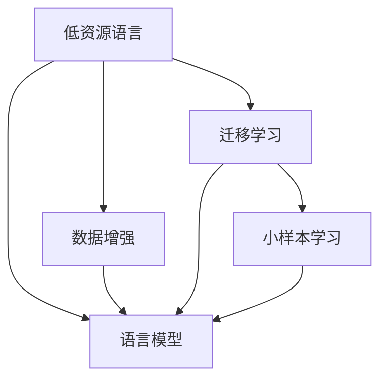

                 

# LLM的低资源语言建模技术突破

## 1. 背景介绍

低资源语言建模长期以来是自然语言处理(NLP)领域的难点问题。由于数据稀缺、计算资源有限、人才短缺等多种因素，许多资源匮乏的语言无法直接应用传统的基于大规模语料库训练的语言模型。然而，低资源语言的语料少且多变，开发高性能的语言模型具有重要意义。近年来，随着预训练语言模型的广泛应用，如BERT、GPT等，语言模型正逐步从高资源语言向低资源语言拓展。本文旨在探讨低资源语言建模中的一些前沿技术突破，为未来的语言模型开发提供参考。

### 1.1 问题由来

低资源语言中缺乏大量标注数据，传统的基于大规模语料训练的语言模型难以直接应用。传统的机器翻译、文本分类、问答等任务在低资源语言上的效果较差。传统的语言模型训练通常需要数亿甚至数十亿级别的训练数据，这对于数据匮乏的地区和语言来说是一个巨大的挑战。因此，开发能够利用有限数据训练的高性能语言模型，成为低资源语言NLP研究的重要方向。

### 1.2 问题核心关键点

低资源语言建模主要面临以下几个问题：
- **数据稀缺**：缺乏足够的标注数据进行训练。
- **计算资源有限**：低资源语言由于经济和政治因素，计算资源可能受到限制。
- **人才短缺**：高水平的数据科学家和模型训练师可能稀缺。
- **语言特性**：低资源语言的语法和词汇结构可能与高资源语言有显著差异。

这些问题共同构成了低资源语言建模的挑战。本文将围绕数据增强、迁移学习、小样本学习等技术突破，系统介绍低资源语言建模的研究进展。

## 2. 核心概念与联系

### 2.1 核心概念概述

低资源语言建模涉及以下核心概念：

- **低资源语言**：数据稀缺、计算资源有限、人才短缺的地区使用的语言。
- **语言模型**：基于大量文本数据训练的预测下一个单词或字符概率的模型。
- **数据增强**：通过多种技术手段扩充训练数据，以提升模型性能。
- **迁移学习**：通过将高资源语言模型应用于低资源语言，以利用已有的知识。
- **小样本学习**：在极少数样本上进行学习，利用已有的大模型知识。

### 2.2 核心概念原理和架构的 Mermaid 流程图



这个流程图展示了低资源语言建模的核心概念及其相互关系：

1. 低资源语言面临数据稀缺、计算资源有限和人才短缺问题。
2. 数据增强、迁移学习和小样本学习等技术可有效缓解数据不足的问题。
3. 语言模型是低资源语言建模的核心，利用已有知识预测语言模型参数。

## 3. 核心算法原理 & 具体操作步骤

### 3.1 算法原理概述

低资源语言建模的核心思想是利用已有知识，通过迁移学习和小样本学习等技术，构建高性能的语言模型。其算法流程一般包括：

1. **数据增强**：收集和构建少量标注数据，并结合无监督和半监督学习技术扩充数据集。
2. **迁移学习**：使用高资源语言预训练模型作为初始化，对低资源语言模型进行微调。
3. **小样本学习**：通过极少数样本和现有大模型的知识，训练低资源语言模型。
4. **模型评估与优化**：使用少量验证数据和测试数据评估模型性能，并根据评估结果对模型进行微调。

### 3.2 算法步骤详解

#### 3.2.1 数据增强

数据增强是低资源语言建模的重要步骤，主要包括：

1. **无标签数据利用**：利用未标注的低资源语言文本数据，进行无监督或半监督学习，提取特征和潜在知识。
2. **跨语言数据增强**：利用高资源语言的数据，进行跨语言的数据增强。
3. **数据生成**：使用数据生成技术，如回译、同义词替换、文本修正等，扩充训练数据。

#### 3.2.2 迁移学习

迁移学习通过将高资源语言模型的知识迁移到低资源语言模型中，主要包括以下步骤：

1. **预训练模型选择**：选择与目标语言语义相似的高资源语言模型作为初始化。
2. **微调**：使用少量标注数据，对预训练模型进行微调，使其适应目标语言。
3. **知识蒸馏**：通过知识蒸馏技术，将预训练模型中的知识蒸馏到低资源语言模型中。

#### 3.2.3 小样本学习

小样本学习通过利用少量样本和现有大模型的知识进行训练，主要包括以下步骤：

1. **提示学习**：通过精心设计提示模板，引导模型输出。
2. **细粒度微调**：在模型的特定层进行微调，只更新少量参数。
3. **模型集成**：集成多个微调模型，提高模型鲁棒性。

### 3.3 算法优缺点

低资源语言建模的算法具有以下优点：

1. **高效利用数据**：利用少量标注数据和无标签数据，即可构建高性能的语言模型。
2. **泛化性强**：通过迁移学习和小样本学习，模型可以泛化到目标语言中。
3. **计算资源节省**：不需要大量计算资源，可快速迭代开发模型。

同时，也存在一些缺点：

1. **数据依赖高**：模型效果高度依赖于标注数据的数量和质量。
2. **模型鲁棒性差**：模型在目标语言上的泛化能力可能受到限制。
3. **语言特性适配难度大**：低资源语言的语法和词汇结构可能与高资源语言差异较大，模型适配难度大。

### 3.4 算法应用领域

低资源语言建模的应用领域包括：

1. **跨语言翻译**：将低资源语言翻译成高资源语言或反之。
2. **信息检索**：在低资源语言文本中检索相关信息。
3. **文本分类**：对低资源语言的文本进行分类。
4. **问答系统**：回答低资源语言的自然语言问题。
5. **情感分析**：分析低资源语言文本的情感倾向。

## 4. 数学模型和公式 & 详细讲解 & 举例说明

### 4.1 数学模型构建

低资源语言建模的数学模型主要基于语言模型和任务特定的损失函数。以序列标注任务为例，定义语言模型 $P(x)$ 为给定输入序列 $x$ 的输出概率分布，常见模型包括 CRF、Transformer 等。任务特定的损失函数 $L$ 用于衡量模型的预测输出与真实标签之间的差异，如交叉熵损失、F1 损失等。

### 4.2 公式推导过程

以序列标注任务为例，假设输入序列为 $x = (x_1, x_2, \ldots, x_n)$，其中 $x_i$ 表示第 $i$ 个词，$y_i$ 表示第 $i$ 个词的标注标签。模型的预测输出为 $\hat{y} = (\hat{y}_1, \hat{y}_2, \ldots, \hat{y}_n)$，任务特定的损失函数为 $L(y, \hat{y})$。

目标是最小化损失函数，即：

$$
\theta^* = \mathop{\arg\min}_{\theta} \mathcal{L}(\theta) = \mathop{\arg\min}_{\theta} \frac{1}{N} \sum_{i=1}^N L(y_i, \hat{y}_i)
$$

其中 $\theta$ 为模型参数，$N$ 为数据集大小。

### 4.3 案例分析与讲解

**案例 1: 无标签数据利用**

假设低资源语言有大量未标注文本 $D = \{x_i\}_{i=1}^N$，使用无监督学习方法，如自编码器，对文本数据进行特征提取，得到特征表示 $Z = \{z_i\}_{i=1}^N$。利用高资源语言的数据 $D_h = \{(x_h, y_h)\}_{i=1}^M$，计算损失函数 $L_h$：

$$
L_h = \frac{1}{M} \sum_{i=1}^M L(y_h, \hat{y}_h)
$$

结合无标签数据的特征表示 $Z$，定义联合损失函数 $L_j$：

$$
L_j = \frac{1}{N} \sum_{i=1}^N L(z_i) + \frac{1}{M} \sum_{i=1}^M L_h
$$

在训练过程中，最小化联合损失函数 $L_j$ 即可利用无标签数据进行特征学习，提升模型性能。

**案例 2: 知识蒸馏**

假设已有一高资源语言模型 $M_h$ 和低资源语言模型 $M_l$，对低资源语言模型进行微调。定义知识蒸馏损失函数 $L_k$：

$$
L_k = -\frac{1}{N} \sum_{i=1}^N \sum_{j=1}^d P(y_j|x_j, M_h) \log P(y_j|x_j, M_l)
$$

其中 $d$ 为输出维度，$P(y_j|x_j, M_h)$ 为高资源语言模型的预测概率分布，$P(y_j|x_j, M_l)$ 为低资源语言模型的预测概率分布。通过最小化知识蒸馏损失函数 $L_k$，将高资源语言模型的知识传递到低资源语言模型中。

## 5. 项目实践：代码实例和详细解释说明

### 5.1 开发环境搭建

在低资源语言建模中，主要使用 PyTorch 和 Transformers 库进行开发。具体步骤如下：

1. 安装 PyTorch 和 Transformers 库：

```bash
pip install torch torchtext transformers
```

2. 准备数据集：将低资源语言的数据集和标注数据进行划分，生成训练集、验证集和测试集。

3. 构建模型：使用 Transformers 库中的预训练模型作为初始化，结合自定义的微调层进行训练。

### 5.2 源代码详细实现

以下是一个简单的低资源语言建模示例，使用 Transformers 库中的 BERT 模型进行微调：

```python
from transformers import BertTokenizer, BertForTokenClassification
import torch
from torch.utils.data import DataLoader

# 准备数据集
tokenizer = BertTokenizer.from_pretrained('bert-base-cased')
train_dataset = ...
dev_dataset = ...
test_dataset = ...

# 构建模型
model = BertForTokenClassification.from_pretrained('bert-base-cased', num_labels=num_labels)
model.train()
optimizer = ...

# 训练模型
for epoch in range(num_epochs):
    train_loss = 0.0
    for batch in train_loader:
        inputs, labels = batch
        model.zero_grad()
        outputs = model(inputs, labels=labels)
        loss = outputs.loss
        train_loss += loss.item()
        loss.backward()
        optimizer.step()

# 评估模型
dev_loss = 0.0
for batch in dev_loader:
    inputs, labels = batch
    model.eval()
    with torch.no_grad():
        outputs = model(inputs)
        loss = outputs.loss
        dev_loss += loss.item()

# 测试模型
test_loss = 0.0
for batch in test_loader:
    inputs, labels = batch
    model.eval()
    with torch.no_grad():
        outputs = model(inputs)
        loss = outputs.loss
        test_loss += loss.item()
```

### 5.3 代码解读与分析

**模型选择**：

选择合适的预训练模型是低资源语言建模的第一步。通常使用 BERT、GPT 等通用语言模型作为初始化，这些模型在高资源语言上已经取得了不错的效果。

**数据预处理**：

低资源语言通常存在字符集大小、语言特性等问题，需要针对性地进行预处理。例如，对于字符集大小不统一的文本，需要进行字符集转换。

**模型微调**：

模型微调过程中，需要根据任务需求，设计合适的输出层和损失函数。对于序列标注任务，通常使用交叉熵损失。

**评估和测试**：

使用验证集和测试集对模型进行评估和测试，监控模型的损失和指标，并进行模型微调。

## 6. 实际应用场景

### 6.1 机器翻译

低资源语言的机器翻译是低资源语言建模的重要应用场景。机器翻译依赖大量双语或多语对照的文本数据，低资源语言的数据稀缺限制了传统的机器翻译方法。

**数据增强**：收集低资源语言的高质量文本数据，结合高资源语言的数据进行跨语言数据增强。

**迁移学习**：使用预训练的多语言模型作为初始化，对低资源语言模型进行微调，提高模型泛化能力。

**小样本学习**：利用少量双语对照的样本，训练低资源语言的翻译模型。

### 6.2 信息检索

信息检索是低资源语言建模的另一重要应用场景。信息检索依赖大量标注的文档数据，低资源语言的数据稀缺限制了传统的信息检索方法。

**数据增强**：利用未标注的文本数据进行无监督学习，提取文档特征。

**迁移学习**：使用预训练的多语言模型作为初始化，对低资源语言模型进行微调，提高模型检索能力。

**小样本学习**：利用少量标注的样本，训练低资源语言的信息检索模型。

### 6.3 文本分类

文本分类是低资源语言建模的典型任务之一。文本分类依赖大量标注数据，低资源语言的数据稀缺限制了传统的文本分类方法。

**数据增强**：利用未标注的文本数据进行无监督学习，提取文本特征。

**迁移学习**：使用预训练的多语言模型作为初始化，对低资源语言模型进行微调，提高模型分类能力。

**小样本学习**：利用少量标注的样本，训练低资源语言的文本分类模型。

## 7. 工具和资源推荐

### 7.1 学习资源推荐

为了帮助开发者系统掌握低资源语言建模的理论基础和实践技巧，这里推荐一些优质的学习资源：

1. **自然语言处理入门教程**：斯坦福大学的自然语言处理课程，涵盖语言模型的基础知识和常见算法。

2. **低资源语言建模综述**：相关领域的综述论文，了解低资源语言建模的研究进展。

3. **低资源语言建模工具包**：开源的 PyTorch 工具包，提供预训练模型和微调样例。

### 7.2 开发工具推荐

在低资源语言建模中，常用的工具包括：

1. **PyTorch**：基于 Python 的开源深度学习框架，灵活动态的计算图，适合快速迭代研究。

2. **Transformers**：Hugging Face 开发的 NLP 工具库，提供预训练模型和微调样例。

3. **TensorBoard**：TensorFlow 配套的可视化工具，实时监测模型训练状态。

### 7.3 相关论文推荐

低资源语言建模的研究涉及多个领域，以下是几篇奠基性的相关论文，推荐阅读：

1. **Leveraging Pretrained Models for Low-Resource Language Processing**：探讨如何利用预训练模型提升低资源语言处理的性能。

2. **Few-shot Learning with Prompt Engineering**：介绍如何通过精心设计的提示模板，利用少量样本训练模型。

3. **Knowledge Distillation for Low-Resource Language Processing**：探讨知识蒸馏技术在低资源语言处理中的应用。

## 8. 总结：未来发展趋势与挑战

### 8.1 研究成果总结

低资源语言建模在近年来取得了显著进展，利用数据增强、迁移学习和小样本学习等技术，开发了多个高性能低资源语言模型。这些模型在机器翻译、信息检索、文本分类等多个任务上取得了不错的效果。

### 8.2 未来发展趋势

未来，低资源语言建模技术将呈现以下几个发展趋势：

1. **多模态数据融合**：结合文本、图像、语音等多模态数据，提高低资源语言模型的理解能力。

2. **多语言模型**：开发多语言模型，减少数据稀缺问题。

3. **主动学习**：利用已有知识，主动学习新数据，提升模型性能。

4. **联邦学习**：在分布式计算环境中，联合多个设备进行模型训练，提高数据利用率。

5. **无监督学习**：利用无监督学习技术，提升模型性能。

### 8.3 面临的挑战

尽管低资源语言建模技术取得了一定的进展，但仍然面临诸多挑战：

1. **数据稀缺**：低资源语言的数据稀缺仍然是一个瓶颈。

2. **计算资源**：低资源语言的计算资源有限，难以支持大规模模型训练。

3. **模型鲁棒性**：模型在目标语言上的泛化能力可能受到限制。

4. **语言特性**：低资源语言的语法和词汇结构可能与高资源语言有显著差异，模型适配难度大。

### 8.4 研究展望

未来的研究需要在以下几个方面寻求新的突破：

1. **数据增强技术**：开发新的数据增强方法，充分利用未标注数据。

2. **迁移学习技术**：探索更多有效的迁移学习方法，提高模型泛化能力。

3. **小样本学习技术**：研究如何利用少量样本和已有知识进行训练。

4. **模型压缩技术**：开发高效压缩算法，提高模型效率。

5. **模型评估技术**：开发新的模型评估指标，全面评估模型性能。

总之，低资源语言建模是NLP领域的重要方向，未来需要在数据、模型、算法、工程等方面持续探索，推动技术进步和应用落地。

## 9. 附录：常见问题与解答

**Q1: 低资源语言建模中，如何处理低资源语言特有的语法和词汇问题？**

A: 低资源语言的语法和词汇问题可以通过以下方法处理：

1. **自定义词典**：构建低资源语言的词典，标注词汇信息，如词性、同义词等。

2. **语言模型适配**：使用高资源语言模型的词向量进行初始化，训练低资源语言模型的词向量。

3. **正则化**：在训练过程中，使用正则化技术，避免模型过拟合。

**Q2: 低资源语言建模中，如何选择预训练模型？**

A: 选择预训练模型需要考虑以下几个因素：

1. **语言相似度**：选择与目标语言语义相似的预训练模型，以提升模型泛化能力。

2. **模型规模**：选择规模适中的模型，以平衡性能和计算资源。

3. **训练数据**：选择有大量标注数据的预训练模型，以提高模型效果。

**Q3: 低资源语言建模中，如何处理计算资源有限的问题？**

A: 处理计算资源有限的问题可以通过以下方法：

1. **模型压缩**：使用模型压缩技术，减小模型尺寸。

2. **分布式训练**：在分布式计算环境中进行模型训练，提高计算效率。

3. **量化加速**：使用量化技术，加速模型推理。

**Q4: 低资源语言建模中，如何处理数据稀缺的问题？**

A: 处理数据稀缺的问题可以通过以下方法：

1. **数据增强**：利用未标注数据进行无监督或半监督学习，扩充训练数据。

2. **跨语言数据增强**：利用高资源语言的数据进行跨语言数据增强。

3. **主动学习**：利用已有知识，主动学习新数据。

总之，低资源语言建模需要综合考虑数据、模型、计算资源等多个因素，开发有效的技术和方法，推动技术进步和应用落地。

---

作者：禅与计算机程序设计艺术 / Zen and the Art of Computer Programming

