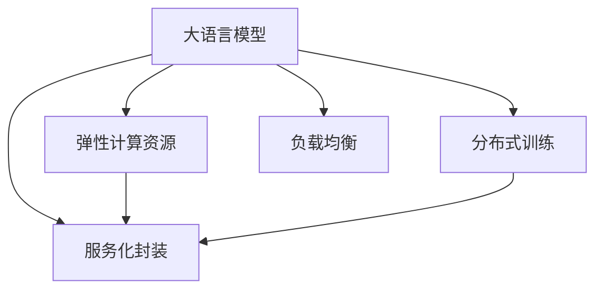

                 

# LLM的分布式部署：AI的云端革命

> 关键词：分布式部署, 云端, 人工智能, 大语言模型, 弹性计算, 分布式训练, 服务化, 云平台

## 1. 背景介绍

### 1.1 问题由来

随着人工智能技术的不断发展，大语言模型（Large Language Model, LLM）如GPT-3、BERT等在各种自然语言处理（Natural Language Processing, NLP）任务中展现出了强大的能力，引起了广泛关注。然而，由于这些模型的参数量庞大，计算需求高，传统的单机部署方式已难以满足大规模应用的需求。因此，如何在云端进行大语言模型的分布式部署，成为当前AI领域的核心问题之一。

### 1.2 问题核心关键点

大语言模型分布式部署的核心在于如何利用云端的弹性计算资源，实现模型的灵活部署、高效训练和快速推理，以支持大规模应用场景。关键点包括：

- **弹性计算资源**：利用云平台提供的弹性计算服务，按需分配和释放资源。
- **分布式训练**：将大规模模型分布在多台计算节点上并行训练，提高训练速度。
- **服务化封装**：将模型封装为标准化的API服务，方便调用和使用。
- **自动扩展和负载均衡**：根据应用负载动态调整资源配置，确保系统的稳定性和性能。

### 1.3 问题研究意义

研究大语言模型的分布式部署，对于推动AI技术的广泛应用、加速AI产业化和提高AI系统的性能和可扩展性具有重要意义：

- **降低成本**：利用云平台的弹性资源，减少硬件采购和维护成本。
- **提升性能**：通过分布式训练，加速模型训练和推理，提高系统效率。
- **增强可扩展性**：支持大规模应用，满足不断增长的计算需求。
- **简化部署**：通过服务化封装，降低应用开发和部署的复杂度。
- **促进创新**：加速AI技术的研发和应用，促进更多的技术创新和商业落地。

## 2. 核心概念与联系

### 2.1 核心概念概述

为更好地理解大语言模型分布式部署，本节将介绍几个关键概念：

- **大语言模型（LLM）**：如GPT-3、BERT等，具有海量参数和复杂结构，适合分布式训练和推理。
- **分布式训练**：将模型参数和训练数据分布在多台计算节点上，并行训练，提高训练效率。
- **弹性计算资源**：云平台提供的按需分配和释放计算资源的能力。
- **服务化封装**：将模型封装为标准API服务，方便外部调用。
- **负载均衡**：动态调整计算资源分配，避免单点故障，确保系统稳定。

这些概念之间的逻辑关系可以通过以下Mermaid流程图来展示：



这个流程图展示了各个概念之间的相互关系：大语言模型通过分布式训练和弹性计算资源进行高效训练和推理；服务化封装简化了外部调用和使用；负载均衡则确保系统稳定性和高性能。

## 3. 核心算法原理 & 具体操作步骤

### 3.1 算法原理概述

大语言模型的分布式部署，本质上是一个利用弹性计算资源进行大规模模型训练和推理的过程。其核心思想是：通过分布式计算和弹性资源管理，将大规模模型分布在多个计算节点上并行训练和推理，从而实现高效、可扩展的AI应用。

形式化地，假设大语言模型为 $M_{\theta}$，其中 $\theta$ 为模型参数。给定分布式计算环境 $\mathcal{C}$，模型在每个节点上的训练和推理过程可以表示为：

$$
M_{\theta}^{(i)} = \mathcal{D}(\theta^{(i)}) \quad \forall i \in \mathcal{N}
$$

其中 $\theta^{(i)}$ 为第 $i$ 个节点的模型参数，$\mathcal{N}$ 为所有计算节点的集合。

分布式部署的目标是通过多节点协同训练，最大化模型性能。通常采用如下策略：

- **数据并行**：将数据划分成多个子集，每个节点独立处理一个子集。
- **模型并行**：将模型划分成多个子模块，每个节点负责一个子模块的训练。
- **混合并行**：同时采用数据并行和模型并行。

### 3.2 算法步骤详解

大语言模型的分布式部署一般包括以下几个关键步骤：

**Step 1: 准备分布式环境**
- 选择合适的云平台，如AWS、Google Cloud、阿里云等，搭建分布式计算环境。
- 配置计算节点，包括CPU/GPU内存、网络带宽、存储设备等。
- 安装必要的软件环境，如Python、TensorFlow、PyTorch等。

**Step 2: 分布式训练**
- 将大语言模型划分成多个子模块，每个子模块分布在不同的计算节点上进行并行训练。
- 在每个节点上运行优化算法，如SGD、Adam等，更新模型参数。
- 采用数据并行、模型并行或混合并行策略，确保数据和模型的一致性。
- 定期在某个中心节点上合并参数，更新全局模型。

**Step 3: 服务化封装**
- 将训练好的大语言模型封装为标准化的API服务，支持HTTP、gRPC等多种接口协议。
- 使用Docker、Kubernetes等容器化技术，简化部署和扩展。
- 采用负载均衡、自动扩展等技术，确保服务的稳定性和性能。

**Step 4: 弹性资源管理**
- 根据应用负载动态调整计算资源，确保系统的性能和成本效益。
- 设置自动扩展策略，当负载超出阈值时，自动增加计算节点。
- 配置负载均衡策略，将请求均匀分配到各个节点上，避免单点故障。

**Step 5: 监控告警**
- 实时监控系统各项指标，如CPU利用率、内存使用、网络带宽等。
- 设置告警阈值，当指标超出预设范围时，自动触发告警和应急处理。
- 定期进行性能测试和压力测试，优化系统性能和稳定性。

以上是基于分布式计算的大语言模型部署的一般流程。在实际应用中，还需要根据具体任务和数据特点进行优化设计，如改进分布式训练算法、优化模型并行策略、选择高效的API接口等。

### 3.3 算法优缺点

大语言模型的分布式部署具有以下优点：

- **高效计算**：利用弹性计算资源，实现大规模模型的快速训练和推理。
- **可扩展性**：根据负载动态调整资源配置，支持更大规模的应用。
- **服务化封装**：简化外部调用，降低开发和部署复杂度。
- **稳定性和鲁棒性**：通过负载均衡和自动扩展，提高系统的稳定性和鲁棒性。

同时，该方法也存在一定的局限性：

- **硬件成本**：初期硬件投资较高，需要大量的计算资源。
- **网络延迟**：分布式计算节点间的网络延迟可能影响训练效率。
- **同步和通信开销**：分布式训练中需要频繁的数据同步和通信，增加计算开销。
- **开发复杂度**：分布式部署和优化需要更高的开发技能和经验。

尽管存在这些局限性，但就目前而言，基于分布式计算的大语言模型部署已成为AI应用的必由之路。未来相关研究的重点在于如何进一步降低硬件成本，提高训练效率，优化分布式部署的策略。

### 3.4 算法应用领域

大语言模型的分布式部署，已经在多个领域得到了广泛应用，包括但不限于：

- **自然语言处理（NLP）**：如情感分析、文本分类、机器翻译等任务。
- **计算机视觉（CV）**：如图像识别、目标检测、语义分割等任务。
- **语音识别**：如语音转文本、语音合成、语音情感分析等任务。
- **推荐系统**：如商品推荐、内容推荐、广告推荐等任务。
- **金融风控**：如信用评分、欺诈检测、市场分析等任务。
- **智能医疗**：如医学影像分析、疾病诊断、健康管理等任务。

除了上述这些经典领域外，大语言模型的分布式部署还在不断拓展应用场景，如智能制造、智慧城市、智能交通等，为各行各业带来新的变革和机遇。

## 4. 数学模型和公式 & 详细讲解 & 举例说明

### 4.1 数学模型构建

大语言模型的分布式部署涉及到多个节点间的协同训练，可以利用分布式梯度下降（Distributed Gradient Descent, DGD）算法进行优化。

假设模型 $M_{\theta}$ 在节点 $i$ 上的训练过程为：

$$
M_{\theta}^{(i)} = \min_{\theta^{(i)}} \sum_{j=1}^{N} \ell(\mathcal{D}_j, M_{\theta}^{(i)})
$$

其中 $\ell$ 为损失函数，$\mathcal{D}_j$ 为节点 $j$ 上的训练数据集。

节点间同步更新模型参数的策略有多种，常见的有同步梯度（Synchronous Gradient, SG）和异步梯度（Asynchronous Gradient, AG）。

**同步梯度**：所有节点在每个训练周期结束时同步更新模型参数，更新公式为：

$$
\theta^{(i)} \leftarrow \theta^{(i)} - \eta \sum_{j=1}^{N} \nabla_{\theta} \ell(\mathcal{D}_j, M_{\theta}^{(i)})
$$

**异步梯度**：每个节点独立更新模型参数，更新公式为：

$$
\theta^{(i)} \leftarrow \theta^{(i)} - \eta \nabla_{\theta} \ell(\mathcal{D}_i, M_{\theta}^{(i)})
$$

异步梯度通常比同步梯度具有更高的效率，但需要额外的同步机制确保参数一致性。

### 4.2 公式推导过程

以下以一个简单的线性回归问题为例，推导分布式梯度下降算法的具体实现过程。

假设节点 $i$ 上的训练数据为 $\mathcal{D}_i = \{(x_i^{(j)}, y_i^{(j)})\}_{j=1}^{N_i}$，其中 $N_i$ 为节点 $i$ 上的训练样本数。

节点 $i$ 上的线性回归模型为 $y_i^{(j)} = \theta^{(i)} \cdot x_i^{(j)} + b^{(i)}$，损失函数为均方误差损失：

$$
\ell(\mathcal{D}_i, M_{\theta}^{(i)}) = \frac{1}{N_i} \sum_{j=1}^{N_i} (y_i^{(j)} - \theta^{(i)} \cdot x_i^{(j)})^2
$$

分布式梯度下降的更新公式为：

$$
\theta^{(i)} \leftarrow \theta^{(i)} - \eta \frac{1}{N_i} \sum_{j=1}^{N_i} (y_i^{(j)} - \theta^{(i)} \cdot x_i^{(j)}) \cdot x_i^{(j)}
$$

其中 $\eta$ 为学习率。

### 4.3 案例分析与讲解

**案例：分布式训练BERT**

BERT模型是一个典型的分布式训练案例。由于其庞大的参数量，单节点训练无法满足需求，需要在多个节点上进行分布式训练。

假设有一个包含32个节点的集群，每个节点有16个GPU。首先，将BERT模型划分成32个子模块，每个子模块包含4个Transformer层。每个节点负责一个子模块的训练。

在每个节点上运行分布式梯度下降算法，更新模型参数。具体步骤如下：

1. **数据划分**：将训练数据 $\mathcal{D}$ 划分成32个子集 $\mathcal{D}_1, \mathcal{D}_2, \ldots, \mathcal{D}_{32}$，每个节点负责一个子集的训练。
2. **同步梯度**：每个节点计算本地子集的梯度，并将梯度发送到中心节点进行汇总。
3. **全局更新**：中心节点将汇总后的梯度进行加权平均，更新全局模型参数。
4. **参数同步**：中心节点将更新后的参数同步到各个节点，完成一次迭代。

通过这种方式，可以高效地进行大规模模型的训练。同时，通过分布式训练，可以充分利用云端的弹性计算资源，加速模型训练和推理。

## 5. 项目实践：代码实例和详细解释说明

### 5.1 开发环境搭建

在进行分布式部署实践前，我们需要准备好开发环境。以下是使用Python进行PyTorch和DistributedTensorFlow开发的分布式部署环境配置流程：

1. 安装Anaconda：从官网下载并安装Anaconda，用于创建独立的Python环境。

2. 创建并激活虚拟环境：
```bash
conda create -n tf-env python=3.8 
conda activate tf-env
```

3. 安装TensorFlow和DistributedTensorFlow：
```bash
pip install tensorflow==2.7.0 tf-nightly
pip install distributedtensorflow==0.3.2
```

4. 安装各类工具包：
```bash
pip install numpy pandas scikit-learn matplotlib tqdm jupyter notebook ipython
```

完成上述步骤后，即可在`tf-env`环境中开始分布式部署实践。

### 5.2 源代码详细实现

这里我们以BERT模型的分布式训练为例，给出使用DistributedTensorFlow进行分布式部署的PyTorch代码实现。

首先，定义分布式训练环境：

```python
from distributedtensorflow.keras import distributed_tpu
from tensorflow.keras import backend as K

# 设置分布式环境
strategy = distributed_tpu.TPUStrategy(tpu='')
K.set_strategy(strategy)
```

然后，定义分布式训练函数：

```python
from tensorflow.keras import layers
from tensorflow.keras.losses import BinaryCrossentropy
from tensorflow.keras.optimizers import Adam

def distributed_train(epochs):
    model.compile(loss=BinaryCrossentropy(), optimizer=Adam(lr=2e-5))
    
    # 在每个TPU设备上训练
    for epoch in range(epochs):
        loss = model.train_on_batch(x_train, y_train)
        print(f'Epoch {epoch+1}, train loss: {loss:.3f}')
        
    # 在测试集上评估
    loss = model.evaluate(x_test, y_test)
    print(f'Test loss: {loss:.3f}')
```

最后，启动分布式训练：

```python
# 设置分布式训练参数
distributed_train(5)
```

以上就是使用DistributedTensorFlow对BERT模型进行分布式训练的完整代码实现。可以看到，DistributedTensorFlow使得分布式部署变得非常简洁和高效。

### 5.3 代码解读与分析

让我们再详细解读一下关键代码的实现细节：

**distributed_tpu.TPUStrategy**：
- 设置分布式TPU环境，将模型分配到多个TPU设备上进行并行训练。

**K.set_strategy**：
- 设置模型的分布式策略，将模型参数更新操作分布到多个TPU设备上。

**distributed_train**函数：
- 定义模型，编译损失函数和优化器。
- 在每个TPU设备上训练模型，输出每个epoch的损失。
- 在测试集上评估模型，输出测试损失。

**x_train, y_train, x_test, y_test**：
- 定义训练集和测试集，用于模型训练和评估。

通过上述代码，我们可以看到，利用DistributedTensorFlow进行分布式部署非常简单，只需简单的代码修改和环境配置，即可实现高效的大规模模型训练。

当然，工业级的系统实现还需考虑更多因素，如模型的保存和部署、超参数的自动搜索、更加灵活的分布式策略等。但核心的分布式部署范式基本与此类似。

## 6. 实际应用场景

### 6.1 智能客服系统

基于大语言模型的分布式部署，可以构建高效的智能客服系统。传统客服往往需要配备大量人力，高峰期响应缓慢，且一致性和专业性难以保证。而使用分布式部署的微调模型，可以7x24小时不间断服务，快速响应客户咨询，用自然流畅的语言解答各类常见问题。

在技术实现上，可以收集企业内部的历史客服对话记录，将问题和最佳答复构建成监督数据，在此基础上对预训练对话模型进行分布式微调。微调后的对话模型能够自动理解用户意图，匹配最合适的答案模板进行回复。对于客户提出的新问题，还可以接入检索系统实时搜索相关内容，动态组织生成回答。如此构建的智能客服系统，能大幅提升客户咨询体验和问题解决效率。

### 6.2 金融舆情监测

金融机构需要实时监测市场舆论动向，以便及时应对负面信息传播，规避金融风险。传统的人工监测方式成本高、效率低，难以应对网络时代海量信息爆发的挑战。基于大语言模型的分布式部署，可以实现实时抓取的网络文本数据，自动监测不同主题下的情感变化趋势，一旦发现负面信息激增等异常情况，系统便会自动预警，帮助金融机构快速应对潜在风险。

### 6.3 个性化推荐系统

当前的推荐系统往往只依赖用户的历史行为数据进行物品推荐，无法深入理解用户的真实兴趣偏好。基于大语言模型的分布式部署，个性化推荐系统可以更好地挖掘用户行为背后的语义信息，从而提供更精准、多样的推荐内容。

在实践中，可以收集用户浏览、点击、评论、分享等行为数据，提取和用户交互的物品标题、描述、标签等文本内容。将文本内容作为模型输入，用户的后续行为（如是否点击、购买等）作为监督信号，在此基础上进行分布式微调。微调后的模型能够从文本内容中准确把握用户的兴趣点。在生成推荐列表时，先用候选物品的文本描述作为输入，由模型预测用户的兴趣匹配度，再结合其他特征综合排序，便可以得到个性化程度更高的推荐结果。

### 6.4 未来应用展望

随着大语言模型和分布式部署技术的不断发展，基于微调的AI应用将在更多领域得到应用，为传统行业带来变革性影响。

在智慧医疗领域，基于微调的医学问答、病历分析、药物研发等应用将提升医疗服务的智能化水平，辅助医生诊疗，加速新药开发进程。

在智能教育领域，微调技术可应用于作业批改、学情分析、知识推荐等方面，因材施教，促进教育公平，提高教学质量。

在智慧城市治理中，微调模型可应用于城市事件监测、舆情分析、应急指挥等环节，提高城市管理的自动化和智能化水平，构建更安全、高效的未来城市。

此外，在企业生产、社会治理、文娱传媒等众多领域，基于大模型微调的人工智能应用也将不断涌现，为经济社会发展注入新的动力。相信随着预训练语言模型和微调方法的不断进步，基于分布式部署的AI技术必将在更广阔的应用领域大放异彩。

## 7. 工具和资源推荐

### 7.1 学习资源推荐

为了帮助开发者系统掌握大语言模型分布式部署的理论基础和实践技巧，这里推荐一些优质的学习资源：

1. 《深度学习实战》系列博文：由大模型技术专家撰写，深入浅出地介绍了深度学习实战、分布式训练等前沿话题。

2. Coursera《深度学习与人工智能》课程：由吴恩达教授讲授，全面介绍了深度学习的基本概念和最新进展。

3. 《分布式深度学习》书籍：深入讲解了分布式深度学习的原理、算法和应用，适合深入学习。

4. Google Cloud AI & ML公开课：由Google专家讲授，涵盖了大语言模型、分布式训练等热门话题，提供了丰富的实践案例。

5. TensorFlow官方文档：提供了丰富的分布式训练API和示例代码，是学习分布式部署的重要资料。

通过对这些资源的学习实践，相信你一定能够快速掌握大语言模型分布式部署的精髓，并用于解决实际的AI问题。

### 7.2 开发工具推荐

高效的开发离不开优秀的工具支持。以下是几款用于大语言模型分布式部署开发的常用工具：

1. PyTorch：基于Python的开源深度学习框架，灵活动态的计算图，适合快速迭代研究。大部分预训练语言模型都有PyTorch版本的实现。

2. TensorFlow：由Google主导开发的开源深度学习框架，生产部署方便，适合大规模工程应用。同样有丰富的预训练语言模型资源。

3. Transformers库：HuggingFace开发的NLP工具库，集成了众多SOTA语言模型，支持PyTorch和TensorFlow，是进行分布式部署开发的利器。

4. Weights & Biases：模型训练的实验跟踪工具，可以记录和可视化模型训练过程中的各项指标，方便对比和调优。与主流深度学习框架无缝集成。

5. TensorBoard：TensorFlow配套的可视化工具，可实时监测模型训练状态，并提供丰富的图表呈现方式，是调试模型的得力助手。

6. Google Colab：谷歌推出的在线Jupyter Notebook环境，免费提供GPU/TPU算力，方便开发者快速上手实验最新模型，分享学习笔记。

合理利用这些工具，可以显著提升大语言模型分布式部署的开发效率，加快创新迭代的步伐。

### 7.3 相关论文推荐

大语言模型分布式部署的发展源于学界的持续研究。以下是几篇奠基性的相关论文，推荐阅读：

1. Distributed Training with Momentum and K-FAC: Training Deep Networks with Sharded Gradients and Allreduce Algorithms（Keras官方文档）：介绍了在Keras中使用DistributedTensorFlow进行分布式训练的方法。

2. Efficient Distributed Deep Learning with TensorFlow: A Tutorial（TensorFlow官方文档）：提供了TensorFlow分布式训练的详细教程，适合初学者学习。

3. Large Language Models are Few-Shot Learners（GPT-3论文）：展示了大规模语言模型的强大zero-shot学习能力，引发了对于通用人工智能的新一轮思考。

4. Model Pruning via TensorFlow Serving: A Scalable Approach（Google官方文档）：介绍了如何使用TensorFlow Serving进行分布式模型的部署和优化。

5. DistBERT: An Ultra-Scale Distributed BERT Pre-training Corpus（DistBERT论文）：介绍了使用超大规模分布式语料进行BERT模型的预训练方法，提升了模型的语言理解能力。

这些论文代表了大语言模型分布式部署技术的发展脉络。通过学习这些前沿成果，可以帮助研究者把握学科前进方向，激发更多的创新灵感。

## 8. 总结：未来发展趋势与挑战

### 8.1 总结

本文对基于分布式计算的大语言模型部署方法进行了全面系统的介绍。首先阐述了分布式部署的背景和意义，明确了分布式部署在大规模应用中的独特价值。其次，从原理到实践，详细讲解了分布式计算和大语言模型的微调方法，给出了分布式部署的完整代码实现。同时，本文还广泛探讨了分布式部署在智能客服、金融舆情、个性化推荐等多个行业领域的应用前景，展示了分布式部署范式的巨大潜力。

通过本文的系统梳理，可以看到，基于分布式计算的大语言模型部署方法已经成为AI应用的重要范式，极大地拓展了预训练语言模型的应用边界，为大规模AI应用提供了可能。未来，伴随分布式计算技术的不断发展，基于分布式部署的AI技术必将在更广阔的领域中得到应用，为社会各行各业带来新的变革和机遇。

### 8.2 未来发展趋势

展望未来，大语言模型的分布式部署技术将呈现以下几个发展趋势：

1. **超大规模分布式训练**：随着硬件设备的不断升级，未来的分布式训练将支持更大规模的模型和数据，进一步提升模型性能和泛化能力。

2. **分布式模型的参数压缩和稀疏化**：通过参数压缩和稀疏化技术，减少模型的存储和计算开销，提高分布式训练和推理的效率。

3. **模型和数据的高效传输和存储**：利用分布式文件系统（如Hadoop、Spark等）进行模型和数据的高效传输和存储，优化分布式部署的资源利用率。

4. **分布式模型的高效推理**：通过分布式推理框架（如TensorFlow Serving、Kubernetes等）进行高效推理，提高系统响应速度和吞吐量。

5. **分布式模型的自动调参和超参数优化**：利用自动调参工具（如Hyperopt、Hyperband等）进行分布式模型的高效调参，加速模型优化进程。

6. **分布式模型的可解释性和鲁棒性**：通过因果推断、对抗训练等技术，增强分布式模型的可解释性和鲁棒性，避免灾难性遗忘和对抗样本攻击。

以上趋势凸显了大语言模型分布式部署技术的广阔前景。这些方向的探索发展，必将进一步提升分布式部署的性能和应用范围，为构建高性能、高鲁棒性的AI系统铺平道路。

### 8.3 面临的挑战

尽管大语言模型的分布式部署技术已经取得了显著进展，但在迈向更加智能化、普适化应用的过程中，它仍面临着诸多挑战：

1. **硬件成本**：初期硬件投资较高，需要大量的计算资源。如何通过优化算法和资源利用率，降低硬件成本，仍然是一个亟待解决的问题。

2. **网络延迟**：分布式计算节点间的网络延迟可能影响训练效率。如何优化网络传输和通信，提高系统性能，是一个重要的研究方向。

3. **同步和通信开销**：分布式训练中需要频繁的数据同步和通信，增加计算开销。如何减少同步和通信开销，提高系统效率，是未来研究的重要方向。

4. **模型复杂性**：大规模模型的训练和推理复杂度较高，需要更高的开发技能和经验。如何降低模型复杂性，简化部署过程，是未来研究的一个重要方向。

5. **系统稳定性**：分布式系统的稳定性和鲁棒性需要进一步提高，避免单点故障和系统崩溃。如何设计高效的系统架构和容错机制，是未来研究的重要课题。

6. **可扩展性**：如何根据应用负载动态调整计算资源，支持更大规模的应用，是一个重要的研究方向。

正视分布式部署面临的这些挑战，积极应对并寻求突破，将是大语言模型分布式部署技术走向成熟的必由之路。相信随着学界和产业界的共同努力，这些挑战终将一一被克服，基于分布式部署的AI技术必将在构建高性能、高鲁棒性的智能系统上发挥更大作用。

### 8.4 研究展望

面对大语言模型分布式部署所面临的挑战，未来的研究需要在以下几个方面寻求新的突破：

1. **优化分布式训练算法**：开发更加高效的分布式训练算法，减少同步和通信开销，提高系统效率。

2. **改进分布式部署策略**：设计更加灵活和高效的分布式部署策略，降低硬件成本和网络延迟。

3. **引入先验知识和外部数据**：将符号化的先验知识，如知识图谱、逻辑规则等，与神经网络模型进行巧妙融合，提升模型的可解释性和鲁棒性。

4. **融合多模态数据**：将视觉、语音等多模态信息与文本信息进行协同建模，提高系统的综合理解和推理能力。

5. **引入因果分析和博弈论工具**：将因果分析方法引入分布式模型，识别出模型决策的关键特征，增强输出解释的因果性和逻辑性。

6. **设计高效的分布式推理框架**：开发高效的分布式推理框架，实现高效的模型部署和推理，提高系统响应速度和吞吐量。

7. **增强系统的稳定性和鲁棒性**：通过故障检测、自适应容错等技术，增强分布式系统的稳定性和鲁棒性，避免单点故障和系统崩溃。

8. **设计自动调参和超参数优化算法**：利用自动调参工具，进行分布式模型的高效调参，加速模型优化进程。

这些研究方向将推动大语言模型分布式部署技术迈向更高的台阶，为构建高性能、高鲁棒性的智能系统提供新的动力。面向未来，大语言模型分布式部署技术还需要与其他人工智能技术进行更深入的融合，如知识表示、因果推理、强化学习等，多路径协同发力，共同推动自然语言理解和智能交互系统的进步。只有勇于创新、敢于突破，才能不断拓展语言模型的边界，让智能技术更好地造福人类社会。

## 9. 附录：常见问题与解答

**Q1：分布式部署是否适用于所有NLP任务？**

A: 分布式部署在大多数NLP任务上都能取得不错的效果，特别是对于数据量较大的任务。但对于一些特定领域的任务，如医学、法律等，预训练模型的泛化能力可能不足，仍需要在特定领域语料上进一步预训练。此外，对于一些需要时效性、个性化很强的任务，如对话、推荐等，分布式部署方法也需要针对性的改进优化。

**Q2：如何选择合适的分布式训练算法？**

A: 选择合适的分布式训练算法，需要根据具体的任务和数据特点进行权衡。常用的算法包括：

- **同步梯度（SG）**：所有节点在每个训练周期结束时同步更新模型参数。适用于数据规模较小、模型复杂度较低的情况。
- **异步梯度（AG）**：每个节点独立更新模型参数，更新公式为：$\theta^{(i)} \leftarrow \theta^{(i)} - \eta \nabla_{\theta} \ell(\mathcal{D}_i, M_{\theta}^{(i)})$。适用于数据规模较大、模型复杂度较高的情况。
- **混合梯度（Hybrid）**：结合同步和异步梯度的优点，提高训练效率。适用于数据规模和模型复杂度适中的情况。

**Q3：分布式部署时如何避免单点故障？**

A: 分布式部署时，单点故障是系统稳定性的一个重大隐患。通常有以下几种策略：

- **负载均衡**：将请求均匀分配到各个节点上，避免单点负载过重。
- **自动扩展**：根据应用负载动态调整计算资源，避免单点故障。
- **故障检测和恢复**：定期检测系统状态，一旦发现故障及时进行恢复。

**Q4：分布式部署时如何优化模型复杂度？**

A: 分布式部署时，模型的复杂度往往会影响系统的性能和效率。可以通过以下几种策略优化模型复杂度：

- **模型压缩**：采用参数压缩和稀疏化技术，减少模型参数量。
- **模块化设计**：将模型划分成多个子模块，独立训练和推理。
- **量化加速**：将浮点模型转为定点模型，压缩存储空间和提高计算效率。

**Q5：分布式部署时如何优化网络传输和通信？**

A: 分布式部署时，网络传输和通信开销是系统效率的重要瓶颈。可以通过以下几种策略优化网络传输和通信：

- **数据划分和同步**：将数据划分成多个子集，同步更新模型参数。
- **异步更新**：每个节点独立更新模型参数，减少同步开销。
- **通信优化**：采用高效的通信协议，减少通信开销。

通过这些策略，可以显著提高分布式部署的效率和性能。

---

作者：禅与计算机程序设计艺术 / Zen and the Art of Computer Programming

