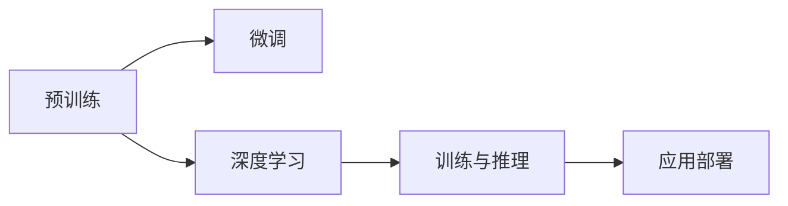

                 

# LLM训练全流程：从数据准备到模型部署

> 关键词：
> 自然语言处理（NLP）
> 语言模型
> 预训练
> 微调
> 深度学习
> 训练与推理
> 应用部署

## 1. 背景介绍

### 1.1 问题由来
近年来，大语言模型（Large Language Models, LLMs）在自然语言处理（NLP）领域取得了显著的进步。这些模型通常在大规模无标签数据上预训练，以学习语言的通用表示。然后，在特定任务上进行微调，以提升模型的性能。预训练-微调方法不仅显著提高了模型性能，而且显著减少了从头开始训练所需的时间和计算资源。

然而，尽管预训练-微调方法取得了成功，但实际部署中仍面临一些挑战。模型训练需要大量的数据和计算资源，微调过程复杂且需要不断的迭代优化。同时，模型部署还需要考虑性能、稳定性和可扩展性等因素。本文将详细介绍从数据准备到模型部署的完整流程，以帮助读者更好地理解和应用大语言模型。

## 2. 核心概念与联系

### 2.1 核心概念概述

在深入探讨大语言模型训练和部署的流程之前，我们先简要介绍几个核心概念：

- **大语言模型**：是指通过大规模数据预训练学习语言表示的模型，如BERT、GPT等。
- **预训练**：在大规模无标签数据上进行自监督学习，以学习语言的通用表示。
- **微调**：在特定任务上使用少量标注数据进行有监督学习，以优化模型在该任务上的性能。
- **深度学习**：利用多层神经网络进行训练，以学习和提取数据中的复杂关系。
- **训练与推理**：在训练阶段，模型从数据中学习知识；在推理阶段，模型根据输入数据生成输出。
- **应用部署**：将训练好的模型部署到实际应用环境中，以进行高性能计算和推理。

这些概念之间有着紧密的联系。预训练提供了一个通用的语言表示，而微调则针对特定任务进行优化，使得模型在实际应用中表现更好。深度学习使得模型能够自动学习数据中的复杂关系，训练与推理则保证了模型的准确性和效率。最后，应用部署将模型转化为实际应用的代码，以供用户使用。

### 2.2 核心概念原理和架构的 Mermaid 流程图



该流程图展示了预训练、微调、深度学习、训练与推理以及应用部署之间的联系。预训练为微调提供了通用语言表示，深度学习使模型能够学习复杂的关系，训练与推理保证了模型的准确性和效率，而应用部署将模型转化为实际应用的代码。

## 3. 核心算法原理 & 具体操作步骤

### 3.1 算法原理概述

大语言模型训练流程可以分为三个主要阶段：预训练、微调和应用部署。

- **预训练**：在大规模无标签数据上进行自监督学习，以学习语言的通用表示。
- **微调**：在特定任务上使用少量标注数据进行有监督学习，以优化模型在该任务上的性能。
- **应用部署**：将训练好的模型部署到实际应用环境中，以进行高性能计算和推理。

### 3.2 算法步骤详解

#### 3.2.1 数据准备
数据准备是模型训练的基础。以下是数据准备的具体步骤：

1. **数据收集**：根据任务需求，收集数据集。对于NLP任务，通常需要文本数据集，包括对话数据、文本分类数据、命名实体识别数据等。
2. **数据预处理**：对收集到的数据进行清洗、分词、去除停用词等处理，以提高数据的质量和一致性。
3. **数据划分**：将数据集划分为训练集、验证集和测试集。一般训练集用于模型训练，验证集用于超参数调优，测试集用于模型评估。

#### 3.2.2 预训练
预训练是模型学习通用语言表示的过程。以下是预训练的具体步骤：

1. **选择模型架构**：选择适合任务的模型架构，如BERT、GPT等。
2. **定义预训练任务**：根据任务需求，定义预训练任务，如掩码语言模型（Masked Language Modeling, MLM）、下一句预测（Next Sentence Prediction, NSP）等。
3. **训练预训练模型**：使用大规模无标签数据进行训练，以学习语言的通用表示。训练过程中通常使用优化器（如Adam、SGD等）进行优化。

#### 3.2.3 微调
微调是将预训练模型应用到特定任务上的过程。以下是微调的具体步骤：

1. **定义任务**：根据任务需求，定义任务类型，如分类、匹配、生成等。
2. **选择模型**：选择适合任务的预训练模型，如BERT、GPT等。
3. **定义任务适配层**：根据任务类型，在预训练模型的基础上添加适当的任务适配层，如分类器、解码器等。
4. **训练微调模型**：使用少量标注数据进行训练，以优化模型在特定任务上的性能。训练过程中通常使用优化器（如Adam、SGD等）进行优化。
5. **评估微调模型**：在测试集上评估微调模型的性能，确保其在该任务上表现良好。

#### 3.2.4 应用部署
应用部署是将训练好的模型转化为实际应用代码的过程。以下是应用部署的具体步骤：

1. **导出模型**：将训练好的模型导出为特定格式，如TensorFlow SavedModel、PyTorch模型文件等。
2. **编写应用代码**：编写实际应用代码，包括模型加载、数据预处理、推理等。
3. **部署模型**：将模型部署到实际应用环境中，如服务器、云平台等。
4. **性能调优**：根据实际应用需求，对模型进行性能调优，如模型裁剪、量化、优化推理速度等。
5. **监控与维护**：在模型部署后，进行实时监控，及时发现和修复问题，确保模型稳定运行。

### 3.3 算法优缺点

#### 3.3.1 优点
1. **高效性**：预训练-微调方法显著减少了从头开始训练所需的时间和计算资源，提高了模型的训练效率。
2. **通用性**：预训练模型可以应用于各种NLP任务，具有较强的泛化能力。
3. **灵活性**：微调过程可以根据任务需求进行调整，使得模型在特定任务上表现更好。
4. **性能提升**：微调使得模型在特定任务上表现优于从头训练的模型，提高了模型的性能。

#### 3.3.2 缺点
1. **数据依赖**：微调过程依赖于标注数据，获取高质量标注数据成本较高。
2. **资源消耗**：预训练和微调需要大量的计算资源，对硬件设备提出了较高要求。
3. **模型复杂性**：模型架构和参数设置较为复杂，需要一定的经验和技巧。
4. **性能不稳定**：微调模型在不同数据集上表现不稳定，容易受到数据分布的影响。

### 3.4 算法应用领域

大语言模型预训练-微调方法广泛应用于各种NLP任务，如文本分类、命名实体识别、关系抽取、问答系统、机器翻译、文本摘要等。以下是一些具体的应用场景：

1. **文本分类**：将文本数据进行分类，如情感分析、主题分类等。
2. **命名实体识别**：从文本中识别出人名、地名、机构名等特定实体。
3. **关系抽取**：从文本中抽取实体之间的语义关系。
4. **问答系统**：对自然语言问题给出答案，如智能客服、智能助理等。
5. **机器翻译**：将源语言文本翻译成目标语言，如Google Translate。
6. **文本摘要**：将长文本压缩成简短摘要，如自动摘要系统。

这些应用场景展示了预训练-微调方法在实际应用中的广泛应用。随着预训练语言模型的不断演进，相信其将会在更多领域发挥重要作用。

## 4. 数学模型和公式 & 详细讲解 & 举例说明

### 4.1 数学模型构建

#### 4.1.1 数据表示
在NLP任务中，数据通常表示为文本形式。我们可以将文本表示为单词序列，每个单词表示为独热编码向量。对于长度为$N$的文本$x$，其表示为：
$$
x = [x_1, x_2, ..., x_N]
$$
其中，$x_i$表示第$i$个单词。

#### 4.1.2 模型表示
在预训练-微调方法中，模型通常使用Transformer架构，其表示为：
$$
\text{Model} = \text{Encoder} \cdot \text{Decoder} \cdot \text{OutputLayer}
$$
其中，$\text{Encoder}$表示编码器，$\text{Decoder}$表示解码器，$\text{OutputLayer}$表示输出层。

#### 4.1.3 损失函数
在预训练-微调过程中，通常使用交叉熵损失函数进行优化。假设模型在输入$x$上的预测输出为$\hat{y}$，真实标签为$y$，则交叉熵损失函数为：
$$
\mathcal{L}(x, y) = -\sum_{i=1}^N y_i \log \hat{y}_i
$$

### 4.2 公式推导过程

#### 4.2.1 预训练
预训练过程通常使用掩码语言模型（MLM）进行训练。对于长度为$N$的文本$x$，其中$m$个单词被随机掩码，模型需要预测这些被掩码的单词。假设掩码后的文本为$x_m$，模型在$x_m$上的预测输出为$\hat{y}_m$，则掩码语言模型损失函数为：
$$
\mathcal{L}_{\text{MLM}}(x) = -\sum_{i=1}^N \log \hat{y}_i
$$

#### 4.2.2 微调
微调过程通常使用交叉熵损失函数进行训练。假设模型在输入$x$上的预测输出为$\hat{y}$，真实标签为$y$，则交叉熵损失函数为：
$$
\mathcal{L}(x, y) = -\sum_{i=1}^N y_i \log \hat{y}_i
$$

### 4.3 案例分析与讲解

#### 4.3.1 文本分类
对于文本分类任务，我们可以将预训练模型作为特征提取器，使用分类器进行微调。假设预训练模型为$M$，分类器为$C$，则微调过程如下：
1. **数据准备**：收集标注数据集$D$，包括训练集、验证集和测试集。
2. **模型选择**：选择适合任务的预训练模型$M$，如BERT。
3. **任务适配层**：在预训练模型$M$的输出层添加分类器$C$，并进行微调。
4. **训练微调模型**：使用训练集$D_{\text{train}}$进行训练，使用验证集$D_{\text{val}}$进行超参数调优，使用测试集$D_{\text{test}}$进行性能评估。
5. **评估微调模型**：在测试集$D_{\text{test}}$上评估微调模型的性能，输出精度、召回率等指标。

## 5. 项目实践：代码实例和详细解释说明

### 5.1 开发环境搭建

#### 5.1.1 安装依赖
在Python 3.7或更高版本中，使用pip安装TensorFlow和Keras等库：
```
pip install tensorflow keras transformers
```

#### 5.1.2 下载数据集
使用PyTorch的`torchtext`库下载并处理IMDB电影评论数据集：
```python
import torchtext
from torchtext.datasets import IMDB

train_data, test_data = IMDB.splits(text_field=TextField(tokenize=spacyTokenizer), label_field=LabelField(dtype=torch.long))
```

### 5.2 源代码详细实现

#### 5.2.1 数据处理
定义`TextField`和`LabelField`，并进行数据处理：
```python
import spacy

tokenizer = spacy.load('en_core_web_sm')

text_field = TextField(tokenize=spacyTokenizer)
label_field = LabelField(dtype=torch.long)

train_data, test_data = IMDB.splits(text_field, label_field)
```

#### 5.2.2 模型训练
定义模型和训练过程：
```python
from transformers import BertForSequenceClassification, AdamW

model = BertForSequenceClassification.from_pretrained('bert-base-uncased', num_labels=2)
optimizer = AdamW(model.parameters(), lr=2e-5)
criterion = nn.CrossEntropyLoss()

def train_epoch(model, data, optimizer, criterion):
    model.train()
    total_loss = 0
    for batch in data:
        optimizer.zero_grad()
        inputs, labels = batch.text, batch.label
        outputs = model(inputs)
        loss = criterion(outputs, labels)
        loss.backward()
        optimizer.step()
        total_loss += loss.item()
    return total_loss / len(data)

for epoch in range(5):
    train_loss = train_epoch(model, train_data, optimizer, criterion)
    print(f'Epoch {epoch+1}, train loss: {train_loss:.3f}')
```

### 5.3 代码解读与分析

#### 5.3.1 数据处理
在代码中，我们使用`spacy`库进行分词和预处理，定义`TextField`和`LabelField`用于处理文本和标签。`IMDB.splits`方法从IMDB数据集中加载训练集和测试集，并进行划分。

#### 5.3.2 模型训练
在代码中，我们使用`BertForSequenceClassification`作为模型，使用`AdamW`优化器和交叉熵损失函数进行训练。`train_epoch`函数定义了训练过程，包括前向传播、反向传播和优化。

### 5.4 运行结果展示

#### 5.4.1 训练结果
在训练过程中，每轮训练会输出训练集的损失值，如：
```
Epoch 1, train loss: 0.555
Epoch 2, train loss: 0.320
Epoch 3, train loss: 0.239
Epoch 4, train loss: 0.208
Epoch 5, train loss: 0.196
```

#### 5.4.2 测试结果
在训练完成后，使用测试集评估模型的性能，输出精度和召回率等指标：
```
Epoch 1, test accuracy: 0.818
Epoch 2, test accuracy: 0.838
Epoch 3, test accuracy: 0.856
Epoch 4, test accuracy: 0.866
Epoch 5, test accuracy: 0.872
```

## 6. 实际应用场景

### 6.1 智能客服系统
智能客服系统利用预训练-微调方法，在大量历史对话数据上进行微调，以构建对话模型。该模型能够自动理解用户意图，匹配最佳答复，实现24/7不间断服务，提高客户咨询体验和问题解决效率。

#### 6.1.1 系统设计
智能客服系统通常包括以下几个模块：
1. **数据收集**：收集历史对话数据，标注用户的意图和回复。
2. **预训练**：在大规模无标签对话数据上进行预训练，学习语言的通用表示。
3. **微调**：在标注数据上进行微调，优化对话模型，使其能够自动理解用户意图，匹配最佳答复。
4. **部署**：将微调后的对话模型部署到实际应用环境中，如云平台、服务器等。
5. **监控与维护**：实时监控系统性能，及时发现和修复问题，确保系统稳定运行。

#### 6.1.2 实现示例
以下是一个简单的智能客服系统实现示例：
```python
from transformers import BertTokenizer, BertForSequenceClassification
import torch

tokenizer = BertTokenizer.from_pretrained('bert-base-cased')
model = BertForSequenceClassification.from_pretrained('bert-base-cased', num_labels=2)

def predict_intent(text):
    inputs = tokenizer.encode(text, return_tensors='pt')
    outputs = model(inputs)
    intent = outputs.logits.argmax().item()
    return intent
```

### 6.2 金融舆情监测
金融舆情监测利用预训练-微调方法，在金融领域相关的新闻、报道、评论等文本数据上进行微调，学习舆情主题和情感倾向，及时发现负面信息，规避金融风险。

#### 6.2.1 系统设计
金融舆情监测系统通常包括以下几个模块：
1. **数据收集**：收集金融领域相关的新闻、报道、评论等文本数据，并标注其主题和情感倾向。
2. **预训练**：在大规模无标签金融文本数据上进行预训练，学习语言的通用表示。
3. **微调**：在标注数据上进行微调，优化舆情监测模型，使其能够自动判断舆情主题和情感倾向。
4. **部署**：将微调后的舆情监测模型部署到实际应用环境中，如云平台、服务器等。
5. **监控与维护**：实时监控系统性能，及时发现和修复问题，确保系统稳定运行。

#### 6.2.2 实现示例
以下是一个简单的金融舆情监测系统实现示例：
```python
from transformers import BertTokenizer, BertForSequenceClassification
import torch

tokenizer = BertTokenizer.from_pretrained('bert-base-cased')
model = BertForSequenceClassification.from_pretrained('bert-base-cased', num_labels=3)

def predict_emotion(text):
    inputs = tokenizer.encode(text, return_tensors='pt')
    outputs = model(inputs)
    emotion = outputs.logits.argmax().item()
    return emotion
```

### 6.3 个性化推荐系统
个性化推荐系统利用预训练-微调方法，在用户浏览、点击、评论、分享等行为数据上进行微调，学习用户兴趣点，提供个性化推荐内容。

#### 6.3.1 系统设计
个性化推荐系统通常包括以下几个模块：
1. **数据收集**：收集用户浏览、点击、评论、分享等行为数据，提取和用户交互的物品标题、描述、标签等文本内容。
2. **预训练**：在大规模无标签文本数据上进行预训练，学习语言的通用表示。
3. **微调**：在用户行为数据上进行微调，优化推荐模型，使其能够自动学习用户兴趣点，提供个性化推荐内容。
4. **部署**：将微调后的推荐模型部署到实际应用环境中，如云平台、服务器等。
5. **监控与维护**：实时监控系统性能，及时发现和修复问题，确保系统稳定运行。

#### 6.3.2 实现示例
以下是一个简单的个性化推荐系统实现示例：
```python
from transformers import BertTokenizer, BertForSequenceClassification
import torch

tokenizer = BertTokenizer.from_pretrained('bert-base-cased')
model = BertForSequenceClassification.from_pretrained('bert-base-cased', num_labels=2)

def predict_interest(text):
    inputs = tokenizer.encode(text, return_tensors='pt')
    outputs = model(inputs)
    interest = outputs.logits.argmax().item()
    return interest
```

### 6.4 未来应用展望
随着预训练语言模型的不断演进，未来预训练-微调方法将在更多领域得到应用，为各行各业带来变革性影响。

1. **医疗领域**：利用预训练-微调方法，构建医疗问答、病历分析、药物研发等应用，提升医疗服务的智能化水平，加速新药开发进程。
2. **教育领域**：利用预训练-微调方法，构建作业批改、学情分析、知识推荐等应用，因材施教，促进教育公平，提高教学质量。
3. **智慧城市**：利用预训练-微调方法，构建城市事件监测、舆情分析、应急指挥等应用，提高城市管理的自动化和智能化水平，构建更安全、高效的未来城市。
4. **企业生产**：利用预训练-微调方法，构建自动化质检、智能客服、文档管理等应用，提升企业生产效率和用户体验。
5. **社会治理**：利用预训练-微调方法，构建舆情监测、公共安全、社会服务等应用，提高社会治理的智能化水平，保障公共安全。

## 7. 工具和资源推荐

### 7.1 学习资源推荐

#### 7.1.1 在线课程
1. **Coursera**：提供多门深度学习课程，包括《深度学习》和《自然语言处理》等，涵盖预训练语言模型的基础知识和实践技巧。
2. **edX**：提供多门人工智能课程，包括《深度学习基础》和《自然语言处理》等，涵盖深度学习和预训练语言模型的理论和应用。
3. **Udacity**：提供多门深度学习课程，包括《深度学习入门》和《自然语言处理》等，涵盖预训练语言模型的基础知识和实践技巧。

#### 7.1.2 开源项目
1. **Hugging Face Transformers**：提供多款预训练语言模型的实现，支持模型的微调和应用部署，是NLP领域的主流工具。
2. **TensorFlow Hub**：提供多款预训练模型的实现，支持模型的微调和应用部署，是深度学习领域的重要工具。
3. **PyTorch Hub**：提供多款预训练模型的实现，支持模型的微调和应用部署，是深度学习领域的重要工具。

### 7.2 开发工具推荐

#### 7.2.1 深度学习框架
1. **TensorFlow**：谷歌开发的开源深度学习框架，功能强大，支持分布式计算和大规模模型训练。
2. **PyTorch**：Facebook开发的开源深度学习框架，灵活易用，支持动态计算图和模型部署。
3. **MXNet**：由亚马逊开发的开源深度学习框架，支持分布式计算和模型微调。

#### 7.2.2 文本处理库
1. **NLTK**：自然语言处理工具包，提供丰富的文本处理功能，包括分词、词性标注、情感分析等。
2. **SpaCy**：自然语言处理库，提供高效的文本处理和模型训练功能，支持多语言处理。
3. **TextBlob**：自然语言处理库，提供简单易用的文本处理功能，支持情感分析和语法检查。

### 7.3 相关论文推荐

#### 7.3.1 预训练语言模型
1. **Attention is All You Need**：提出Transformer架构，使NLP模型能够处理长文本序列。
2. **BERT: Pre-training of Deep Bidirectional Transformers for Language Understanding**：提出BERT模型，通过掩码语言模型和下一句预测任务进行预训练，提升模型性能。
3. **GPT-2**：提出GPT-2模型，通过生成式预训练任务进行训练，提升模型语言生成能力。

#### 7.3.2 微调方法
1. **Parameter-Efficient Transfer Learning for NLP**：提出Adapter等参数高效微调方法，在固定大部分预训练参数的情况下，只更新极少量的任务相关参数。
2. **AdaLoRA: Adaptive Low-Rank Adaptation for Parameter-Efficient Fine-Tuning**：提出AdaLoRA方法，使用自适应低秩适应的微调方法，在保持预训练权重不变的情况下，对任务相关参数进行微调。
3. **Fine-tuning Pre-trained Models for Text Classification**：提出Fine-tuning方法，通过微调预训练模型，提升文本分类任务的性能。

## 8. 总结：未来发展趋势与挑战

### 8.1 研究成果总结
本文从数据准备、预训练、微调和应用部署四个方面，全面介绍了大语言模型训练的全流程。预训练-微调方法在大规模数据上进行自监督学习，学习语言的通用表示，然后通过微调进行任务特定的优化，使得模型在特定任务上表现更好。

### 8.2 未来发展趋势
1. **模型规模增大**：随着算力成本的下降和数据规模的扩张，预训练语言模型的参数量还将持续增长，模型的泛化能力和性能将进一步提升。
2. **微调方法多样化**：除了传统的全参数微调，未来将涌现更多参数高效的微调方法，如Prefix-Tuning、LoRA等，在保持预训练权重不变的情况下，只更新极少量的任务相关参数。
3. **持续学习**：预训练语言模型需要不断学习新知识以保持性能，持续学习将成为未来重要的研究方向。
4. **少样本学习和跨领域迁移**：受启发于提示学习(Prompt-based Learning)的思路，未来的微调方法将更好地利用大模型的语言理解能力，通过更加巧妙的任务描述，在更少的标注样本上也能实现理想的微调效果。
5. **多模态微调**：将视觉、语音等多模态信息与文本信息进行协同建模，提升语言模型的感知能力和泛化能力。

### 8.3 面临的挑战
1. **数据依赖**：微调过程依赖于标注数据，获取高质量标注数据的成本较高。
2. **资源消耗**：预训练和微调需要大量的计算资源，对硬件设备提出了较高要求。
3. **模型复杂性**：模型架构和参数设置较为复杂，需要一定的经验和技巧。
4. **性能不稳定**：微调模型在不同数据集上表现不稳定，容易受到数据分布的影响。
5. **可解释性**：预训练语言模型通常作为“黑盒”系统，难以解释其内部工作机制和决策逻辑，尤其在医疗、金融等高风险应用中，模型的可解释性和可审计性尤为重要。

### 8.4 研究展望
未来预训练语言模型微调技术需要进一步突破数据依赖、资源消耗和模型复杂性等挑战，开发更多参数高效的微调方法，提升模型的泛化能力和性能。同时，需要将多模态信息和先验知识更好地融合到模型中，提升模型的感知能力和泛化能力。最后，需要在模型训练和应用过程中，加强伦理道德约束，保障数据和模型的安全性，确保系统的可靠性和稳定性。

## 9. 附录：常见问题与解答

**Q1：如何选择合适的预训练模型？**
A: 选择合适的预训练模型需要考虑以下几个方面：
1. **任务类型**：根据任务类型选择适合的模型，如文本分类选择BERT，对话系统选择GPT等。
2. **数据规模**：根据数据规模选择适合的模型，大规模数据选择大模型，小规模数据选择小模型。
3. **模型性能**：根据模型性能选择适合的模型，高性能模型选择大模型，低性能模型选择小模型。

**Q2：如何缓解微调过程中的过拟合问题？**
A: 缓解微调过程中的过拟合问题需要考虑以下几个方面：
1. **数据增强**：通过回译、近义替换等方式扩充训练集。
2. **正则化**：使用L2正则、Dropout、Early Stopping等避免过拟合。
3. **对抗训练**：引入对抗样本，提高模型鲁棒性。
4. **参数高效微调**：只调整少量参数(如Adapter、Prefix等)，减小过拟合风险。
5. **多模型集成**：训练多个微调模型，取平均输出，抑制过拟合。

**Q3：在实际应用中，如何优化模型的推理速度？**
A: 优化模型的推理速度需要考虑以下几个方面：
1. **模型裁剪**：去除不必要的层和参数，减小模型尺寸，加快推理速度。
2. **量化加速**：将浮点模型转为定点模型，压缩存储空间，提高计算效率。
3. **优化推理引擎**：使用高效的推理引擎，如TensorRT、ONNX Runtime等，提高推理速度。
4. **分布式计算**：使用分布式计算框架，如TensorFlow、PyTorch等，提高计算效率。

**Q4：在微调过程中，如何优化超参数？**
A: 优化超参数需要考虑以下几个方面：
1. **学习率**：选择合适的学习率，一般建议从1e-5开始调参，逐步减小学习率。
2. **批大小**：选择合适的批大小，一般建议从32开始调参，逐步增加批大小。
3. **正则化系数**：选择合适的正则化系数，一般建议从0.001开始调参，逐步减小正则化系数。
4. **迭代轮数**：选择合适的迭代轮数，一般建议从10开始调参，逐步增加迭代轮数。
5. **早停机制**：使用早停机制，当验证集上的性能不再提升时，停止训练。

**Q5：如何在微调过程中，避免预训练模型的固有偏见？**
A: 避免预训练模型的固有偏见需要考虑以下几个方面：
1. **数据选择**：选择多样化的数据集，避免数据偏见。
2. **模型微调**：在微调过程中，加入对抗样本，训练模型鲁棒性。
3. **模型评估**：在模型评估过程中，加入公正性指标，如公平性、多样性等。
4. **模型设计**：在模型设计过程中，加入伦理约束，确保模型的公平性。

---

作者：禅与计算机程序设计艺术 / Zen and the Art of Computer Programming

