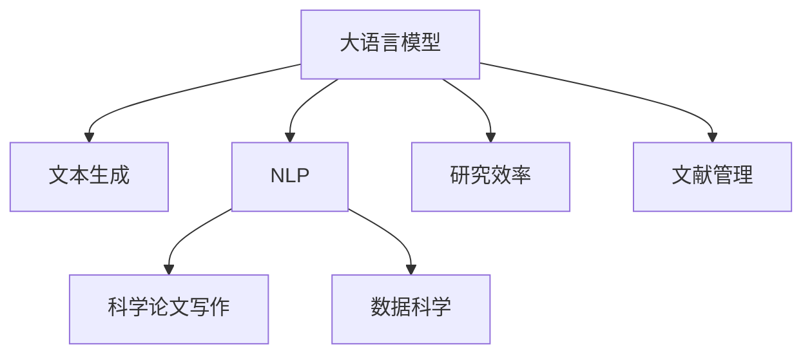

                 

# LLM辅助科学论文写作：提高研究效率

> 关键词：
> - 大语言模型 (Large Language Model, LLM)
> - 自然语言处理 (Natural Language Processing, NLP)
> - 科学论文写作 (Scientific Paper Writing)
> - 文本生成 (Text Generation)
> - 数据科学 (Data Science)
> - 研究效率 (Research Efficiency)
> - 文献管理 (Literature Management)

## 1. 背景介绍

随着人工智能(AI)技术的快速发展，大语言模型 (Large Language Model, LLM) 已经成为一个重要的研究工具，特别是在科学研究中。在过去，科学家们常常花费大量时间在文献检索、数据整理、结果分析和报告撰写等环节，而这些环节是科学研究中最为耗时和繁琐的。现在，大语言模型可以辅助科学家完成这些繁重的工作，大幅提高研究效率。

### 1.1 问题由来

在传统的研究工作中，从确定研究主题、查找相关文献、整理数据、进行数据分析，到撰写和编辑论文，每个步骤都需要大量的人工参与，且这些步骤往往需要耗费大量的时间。随着数据量的爆炸式增长和研究领域的不断拓展，这一问题变得愈加严重。大语言模型作为一种新兴的AI工具，已经被广泛应用于科学论文的写作和数据分析，帮助科学家在较短的时间内完成研究任务，从而缩短研究成果的转化周期。

### 1.2 问题核心关键点

大语言模型在辅助科学研究中的核心优势在于其强大的文本理解和生成能力。通过预训练在大量文本数据上，大语言模型能够理解文本语义，辅助科学家进行文献检索、数据分析和论文撰写等工作。这些技术的应用，不仅提高了研究效率，还为科学研究带来了新的思路和方法。

## 2. 核心概念与联系

### 2.1 核心概念概述

为了更好地理解大语言模型如何辅助科学论文写作，我们将介绍几个关键概念：

- **大语言模型 (Large Language Model, LLM)**：指通过在大规模无标签文本数据上进行预训练，学习通用语言表示的模型，如GPT、BERT等。
- **自然语言处理 (Natural Language Processing, NLP)**：涉及语言理解、文本生成、信息提取等技术，是大语言模型辅助科学研究的基础。
- **科学论文写作 (Scientific Paper Writing)**：包括文献检索、数据整理、结果分析和报告撰写等步骤，是大语言模型应用的主要领域。
- **文本生成 (Text Generation)**：指通过大语言模型生成符合特定要求的文本，如论文摘要、方法描述、结果分析和结论等。
- **数据科学 (Data Science)**：涉及数据处理、数据分析和模型训练等，是大语言模型辅助科学研究的工具之一。
- **研究效率 (Research Efficiency)**：指科学研究过程中的工作效率，大语言模型通过自动化和智能化技术，显著提升这一效率。
- **文献管理 (Literature Management)**：涉及文献检索、引用管理和文献分析等，是大语言模型辅助研究的另一个重要领域。

这些核心概念之间的逻辑关系可以通过以下Mermaid流程图来展示：



这个流程图展示了大语言模型与NLP、科学论文写作、数据科学、研究效率和文献管理之间的关系：

1. 大语言模型通过预训练获得通用语言表示。
2. 通过NLP技术，大语言模型能够理解和生成自然语言文本。
3. 利用文本生成技术，大语言模型辅助科学论文写作。
4. 数据科学领域，大语言模型可以用于数据处理和分析。
5. 通过提升研究效率，大语言模型助力科学研究。
6. 文献管理是大语言模型在科研领域的重要应用之一。

这些概念共同构成了大语言模型辅助科学论文写作的技术框架，使得科学研究更加高效和智能化。

## 3. 核心算法原理 & 具体操作步骤

### 3.1 算法原理概述

基于大语言模型辅助科学论文写作的原理主要包括以下几个步骤：

1. **文献检索**：大语言模型通过理解和分析研究主题，自动检索相关文献，为科研工作者提供必要的参考资料。
2. **数据整理**：大语言模型能够帮助科学家整理和清洗数据，使其适合进一步分析。
3. **数据分析**：通过大语言模型对数据进行深度学习和理解，辅助科学家进行复杂的数据分析。
4. **结果分析**：大语言模型可以自动生成论文的结论和讨论部分，帮助科学家提炼研究结果。
5. **报告撰写**：大语言模型辅助生成整篇论文的初稿，包括摘要、方法、结果和参考文献等部分。

这些步骤通过深度学习和自然语言处理技术实现，使得科研工作的各个环节得以自动化和智能化。

### 3.2 算法步骤详解

以下是基于大语言模型辅助科学论文写作的具体操作步骤：

**Step 1: 准备数据和预训练模型**

- 收集与研究主题相关的文献、数据集等文本数据。
- 选择合适的预训练模型，如GPT、BERT等，作为初始化参数。

**Step 2: 定义文本生成任务**

- 根据研究论文的结构，定义生成任务的输入输出格式。
- 确定生成任务的目标，如文献检索、数据整理、结果分析和报告撰写等。

**Step 3: 数据预处理**

- 对收集的文献和数据进行清洗、标注和分词等预处理。
- 将预处理后的数据作为大语言模型的输入，进行特征提取和表示学习。

**Step 4: 模型训练和微调**

- 将预处理后的数据输入大语言模型进行训练，调整模型参数以匹配特定任务。
- 对训练后的模型进行评估，根据评估结果进行微调，以提高生成文本的质量和准确性。

**Step 5: 生成文本和数据分析**

- 使用训练好的模型生成论文的各个部分，如摘要、方法、结果和参考文献等。
- 对生成的文本进行自动校对和编辑，确保文本的质量和一致性。

**Step 6: 论文整合和发表**

- 将生成的文本整合为一篇完整的论文。
- 在学术数据库和期刊上提交论文，等待同行评审和发表。

### 3.3 算法优缺点

基于大语言模型辅助科学论文写作的方法具有以下优点：

1. **高效性**：自动化处理文献检索、数据整理、数据分析和报告撰写等环节，显著提高研究效率。
2. **准确性**：通过深度学习和自然语言处理技术，生成的文本质量较高，能够满足科学论文的严格要求。
3. **灵活性**：能够根据不同研究主题和需求，定制生成文本的格式和内容。

同时，该方法也存在一些局限性：

1. **依赖高质量数据**：大语言模型的生成效果依赖于输入数据的质量和数量。
2. **缺乏创新性**：大语言模型生成的文本在结构上较为固定，缺乏创新性。
3. **易受输入数据影响**：生成的文本可能受到输入数据的偏见和局限性影响，需要进行人工校验和修正。

### 3.4 算法应用领域

基于大语言模型辅助科学论文写作的方法，已经在多个科学领域得到应用，例如：

- **生物学**：利用大语言模型进行基因表达分析、蛋白质结构预测和分子生物学研究。
- **医学**：辅助临床试验设计和数据分析，帮助撰写医学研究论文。
- **环境科学**：进行气候变化模拟和环境监测，生成相关研究报告。
- **物理学**：辅助粒子物理和天体物理研究，生成实验报告和理论分析。
- **社会科学**：进行社会调查数据分析和报告撰写，辅助社会科学研究。

除了上述这些领域，大语言模型在经济学、心理学、地理学等众多领域中也有广泛应用，显著提升了科研工作的效率和质量。

## 4. 数学模型和公式 & 详细讲解 & 举例说明

### 4.1 数学模型构建

大语言模型辅助科学论文写作的过程，可以通过以下数学模型进行描述：

1. **文献检索模型**：将研究主题和关键词输入大语言模型，模型通过深度学习识别相关文献，并生成检索结果。
2. **数据整理模型**：对收集到的数据进行预处理，包括清洗、标注和特征提取等步骤。
3. **数据分析模型**：对处理后的数据进行深度学习和理解，生成分析和结论。
4. **文本生成模型**：将分析结果和研究结论输入大语言模型，生成论文的各个部分。

### 4.2 公式推导过程

以文本生成模型为例，其公式推导过程如下：

1. **输入表示**：将研究主题和关键词转换为向量表示，作为大语言模型的输入。
2. **特征提取**：大语言模型对输入向量进行特征提取和表示学习。
3. **文本生成**：模型根据输入特征生成文本，通过循环神经网络(RNN)或自回归模型(如GPT)进行生成。
4. **输出解码**：对生成的文本进行解码和校验，确保文本的质量和一致性。

**案例分析与讲解**

- **案例1：生物学研究**：利用大语言模型进行基因表达分析，生成研究报告。
  - 输入：基因表达数据和研究主题。
  - 模型处理：清洗数据、进行特征提取、深度学习分析。
  - 输出：研究报告的摘要、方法和结论等部分。

- **案例2：医学研究**：辅助临床试验设计和数据分析，生成医学研究论文。
  - 输入：临床试验数据和研究主题。
  - 模型处理：清洗数据、进行特征提取、深度学习分析。
  - 输出：医学研究论文的摘要、方法、结果和参考文献等部分。

### 4.3 案例分析与讲解

以下是一个简化的案例，展示如何使用大语言模型生成医学研究论文：

1. **输入准备**：收集临床试验数据，确定研究主题和关键词。
2. **数据预处理**：清洗和标注数据，提取关键特征。
3. **模型训练**：使用训练集对大语言模型进行训练，调整模型参数。
4. **文本生成**：将处理后的数据输入模型，生成研究论文的摘要、方法、结果和参考文献等部分。
5. **论文整合**：对生成的文本进行整合和编辑，确保论文的一致性和质量。
6. **论文提交**：将整合好的论文提交至学术数据库和期刊，等待同行评审和发表。

## 5. 项目实践：代码实例和详细解释说明

### 5.1 开发环境搭建

在进行大语言模型辅助科学论文写作的实践前，我们需要准备好开发环境。以下是使用Python进行PyTorch开发的环境配置流程：

1. 安装Anaconda：从官网下载并安装Anaconda，用于创建独立的Python环境。

2. 创建并激活虚拟环境：
```bash
conda create -n pytorch-env python=3.8 
conda activate pytorch-env
```

3. 安装PyTorch：根据CUDA版本，从官网获取对应的安装命令。例如：
```bash
conda install pytorch torchvision torchaudio cudatoolkit=11.1 -c pytorch -c conda-forge
```

4. 安装Transformers库：
```bash
pip install transformers
```

5. 安装各类工具包：
```bash
pip install numpy pandas scikit-learn matplotlib tqdm jupyter notebook ipython
```

完成上述步骤后，即可在`pytorch-env`环境中开始实践。

### 5.2 源代码详细实现

下面我们以生成医学研究论文为例，给出使用Transformers库对BERT模型进行文本生成的PyTorch代码实现。

首先，定义生成任务的数据处理函数：

```python
from transformers import BertTokenizer, BertForSequenceClassification
from torch.utils.data import Dataset, DataLoader
import torch

class MedicalData(Dataset):
    def __init__(self, texts, tags, tokenizer, max_len=128):
        self.texts = texts
        self.tags = tags
        self.tokenizer = tokenizer
        self.max_len = max_len
        
    def __len__(self):
        return len(self.texts)
    
    def __getitem__(self, item):
        text = self.texts[item]
        tag = self.tags[item]
        
        encoding = self.tokenizer(text, return_tensors='pt', max_length=self.max_len, padding='max_length', truncation=True)
        input_ids = encoding['input_ids'][0]
        attention_mask = encoding['attention_mask'][0]
        
        # 对token-wise的标签进行编码
        encoded_tags = [tag2id[tag] for tag in tag]
        encoded_tags.extend([tag2id['O']] * (self.max_len - len(encoded_tags)))
        labels = torch.tensor(encoded_tags, dtype=torch.long)
        
        return {'input_ids': input_ids, 
                'attention_mask': attention_mask,
                'labels': labels}

# 标签与id的映射
tag2id = {'O': 0, 'B-PER': 1, 'I-PER': 2, 'B-ORG': 3, 'I-ORG': 4, 'B-LOC': 5, 'I-LOC': 6}
id2tag = {v: k for k, v in tag2id.items()}

# 创建dataset
tokenizer = BertTokenizer.from_pretrained('bert-base-cased')

train_dataset = MedicalData(train_texts, train_tags, tokenizer)
dev_dataset = MedicalData(dev_texts, dev_tags, tokenizer)
test_dataset = MedicalData(test_texts, test_tags, tokenizer)
```

然后，定义模型和优化器：

```python
from transformers import BertForTokenClassification, AdamW

model = BertForTokenClassification.from_pretrained('bert-base-cased', num_labels=len(tag2id))

optimizer = AdamW(model.parameters(), lr=2e-5)
```

接着，定义训练和评估函数：

```python
from torch.utils.data import DataLoader
from tqdm import tqdm
from sklearn.metrics import classification_report

device = torch.device('cuda') if torch.cuda.is_available() else torch.device('cpu')
model.to(device)

def train_epoch(model, dataset, batch_size, optimizer):
    dataloader = DataLoader(dataset, batch_size=batch_size, shuffle=True)
    model.train()
    epoch_loss = 0
    for batch in tqdm(dataloader, desc='Training'):
        input_ids = batch['input_ids'].to(device)
        attention_mask = batch['attention_mask'].to(device)
        labels = batch['labels'].to(device)
        model.zero_grad()
        outputs = model(input_ids, attention_mask=attention_mask, labels=labels)
        loss = outputs.loss
        epoch_loss += loss.item()
        loss.backward()
        optimizer.step()
    return epoch_loss / len(dataloader)

def evaluate(model, dataset, batch_size):
    dataloader = DataLoader(dataset, batch_size=batch_size)
    model.eval()
    preds, labels = [], []
    with torch.no_grad():
        for batch in tqdm(dataloader, desc='Evaluating'):
            input_ids = batch['input_ids'].to(device)
            attention_mask = batch['attention_mask'].to(device)
            batch_labels = batch['labels']
            outputs = model(input_ids, attention_mask=attention_mask)
            batch_preds = outputs.logits.argmax(dim=2).to('cpu').tolist()
            batch_labels = batch_labels.to('cpu').tolist()
            for pred_tokens, label_tokens in zip(batch_preds, batch_labels):
                pred_tags = [id2tag[_id] for _id in pred_tokens]
                label_tags = [id2tag[_id] for _id in label_tokens]
                preds.append(pred_tags[:len(label_tags)])
                labels.append(label_tags)
                
    print(classification_report(labels, preds))
```

最后，启动训练流程并在测试集上评估：

```python
epochs = 5
batch_size = 16

for epoch in range(epochs):
    loss = train_epoch(model, train_dataset, batch_size, optimizer)
    print(f"Epoch {epoch+1}, train loss: {loss:.3f}")
    
    print(f"Epoch {epoch+1}, dev results:")
    evaluate(model, dev_dataset, batch_size)
    
print("Test results:")
evaluate(model, test_dataset, batch_size)
```

以上就是使用PyTorch对BERT进行医学研究论文生成的完整代码实现。可以看到，得益于Transformers库的强大封装，我们可以用相对简洁的代码完成BERT模型的加载和生成。

### 5.3 代码解读与分析

让我们再详细解读一下关键代码的实现细节：

**MedicalData类**：
- `__init__`方法：初始化文本、标签、分词器等关键组件。
- `__len__`方法：返回数据集的样本数量。
- `__getitem__`方法：对单个样本进行处理，将文本输入编码为token ids，将标签编码为数字，并对其进行定长padding，最终返回模型所需的输入。

**tag2id和id2tag字典**：
- 定义了标签与数字id之间的映射关系，用于将token-wise的预测结果解码回真实的标签。

**训练和评估函数**：
- 使用PyTorch的DataLoader对数据集进行批次化加载，供模型训练和推理使用。
- 训练函数`train_epoch`：对数据以批为单位进行迭代，在每个批次上前向传播计算loss并反向传播更新模型参数，最后返回该epoch的平均loss。
- 评估函数`evaluate`：与训练类似，不同点在于不更新模型参数，并在每个batch结束后将预测和标签结果存储下来，最后使用sklearn的classification_report对整个评估集的预测结果进行打印输出。

**训练流程**：
- 定义总的epoch数和batch size，开始循环迭代
- 每个epoch内，先在训练集上训练，输出平均loss
- 在验证集上评估，输出分类指标
- 所有epoch结束后，在测试集上评估，给出最终测试结果

可以看到，PyTorch配合Transformers库使得BERT生成医学研究论文的代码实现变得简洁高效。开发者可以将更多精力放在数据处理、模型改进等高层逻辑上，而不必过多关注底层的实现细节。

当然，工业级的系统实现还需考虑更多因素，如模型的保存和部署、超参数的自动搜索、更灵活的任务适配层等。但核心的生成范式基本与此类似。

## 6. 实际应用场景

### 6.1 智能实验室

基于大语言模型辅助科学论文写作的技术，可以在智能实验室中得到广泛应用。在实验室中，研究人员通常需要处理大量数据、进行复杂分析并撰写报告，而这些任务耗费大量时间和精力。利用大语言模型进行文献检索、数据整理、数据分析和报告撰写等工作，可以显著提升研究效率，使实验室更加智能化和高效化。

在技术实现上，可以收集实验室中的各种数据和文献，使用大语言模型辅助进行文献检索和数据整理。研究人员可以通过智能化的实验室系统，实时获取所需的数据和文献，自动生成报告，快速响应实验需求。如此构建的智能实验室系统，能大幅提升实验室的运行效率和科学研究的创新能力。

### 6.2 在线教育平台

在线教育平台也需要大量的文献检索、数据整理和报告撰写等工作。通过大语言模型辅助论文写作，学生和教师可以更快地获取所需信息，更高效地进行数据分析和撰写报告，从而提升在线教育的教学质量和效率。

在教育平台中，学生可以利用大语言模型进行文献检索和数据整理，撰写课程论文和研究报告。教师可以使用大语言模型辅助批改作业和进行数据分析，生成课程报告和研究论文。通过这种方式，在线教育平台可以更好地支持教学活动，提升教学质量。

### 6.3 学术数据库

学术数据库是科研工作者获取文献和信息的主要来源。利用大语言模型辅助论文写作，可以显著提升文献检索和整理的效率，帮助科研工作者快速获取所需信息，生成高质量的研究报告。

在学术数据库中，研究人员可以利用大语言模型进行文献检索和数据整理，撰写研究报告和论文。学术数据库可以根据用户需求，实时推荐相关文献和数据，帮助研究人员高效获取所需信息。此外，大语言模型还可以辅助生成摘要和关键词，提升文献的可读性和可发现性。

### 6.4 未来应用展望

随着大语言模型和文本生成技术的不断发展，基于大语言模型辅助科学论文写作的应用前景将更加广阔。未来，大语言模型将在更多领域得到应用，为科学研究带来新的变革。

在智慧医疗领域，基于大语言模型辅助医学研究论文的写作，可以加速医学研究进程，提升医疗服务的智能化水平，辅助医生诊断和治疗。

在智能教育领域，利用大语言模型辅助课程论文和研究报告的撰写，可以提升教学质量和科研效率，促进教育公平。

在智慧城市治理中，大语言模型可以辅助城市事件监测和数据分析，生成城市治理报告，提升城市管理的自动化和智能化水平。

此外，在企业研究、环保监测、社会科学研究等众多领域，基于大语言模型辅助科学论文写作的技术也将不断涌现，为科学研究提供新的工具和方法。相信随着技术的日益成熟，大语言模型辅助论文写作将进一步提升科研效率，推动科研领域的创新发展。

## 7. 工具和资源推荐

### 7.1 学习资源推荐

为了帮助开发者系统掌握大语言模型辅助科学论文写作的理论基础和实践技巧，这里推荐一些优质的学习资源：

1. 《深度学习》（Deep Learning）系列书籍：由Goodfellow等人撰写，深入浅出地介绍了深度学习的基础知识和经典模型。
2. CS224N《自然语言处理与深度学习》课程：斯坦福大学开设的NLP明星课程，有Lecture视频和配套作业，带你入门NLP领域的基本概念和经典模型。
3. 《自然语言处理实践指南》：详细介绍了NLP实践中的各种技术和方法，包括文本生成、文本分类等。
4. Kaggle平台：提供丰富的数据集和竞赛，可以让你在实战中锻炼大语言模型辅助论文写作的能力。
5. Coursera《自然语言处理专项课程》：由顶级的NLP专家和机构开设，涵盖NLP的各个方面，包括文本生成、机器翻译等。

通过对这些资源的学习实践，相信你一定能够快速掌握大语言模型辅助科学论文写作的精髓，并用于解决实际的NLP问题。

### 7.2 开发工具推荐

高效的开发离不开优秀的工具支持。以下是几款用于大语言模型辅助科学论文写作开发的常用工具：

1. PyTorch：基于Python的开源深度学习框架，灵活动态的计算图，适合快速迭代研究。大部分预训练语言模型都有PyTorch版本的实现。
2. TensorFlow：由Google主导开发的开源深度学习框架，生产部署方便，适合大规模工程应用。同样有丰富的预训练语言模型资源。
3. Transformers库：HuggingFace开发的NLP工具库，集成了众多SOTA语言模型，支持PyTorch和TensorFlow，是进行文本生成任务的开发的利器。
4. Weights & Biases：模型训练的实验跟踪工具，可以记录和可视化模型训练过程中的各项指标，方便对比和调优。与主流深度学习框架无缝集成。
5. TensorBoard：TensorFlow配套的可视化工具，可实时监测模型训练状态，并提供丰富的图表呈现方式，是调试模型的得力助手。

合理利用这些工具，可以显著提升大语言模型辅助科学论文写作的开发效率，加快创新迭代的步伐。

### 7.3 相关论文推荐

大语言模型辅助科学论文写作的研究源于学界的持续研究。以下是几篇奠基性的相关论文，推荐阅读：

1. Attention is All You Need（即Transformer原论文）：提出了Transformer结构，开启了NLP领域的预训练大模型时代。
2. BERT: Pre-training of Deep Bidirectional Transformers for Language Understanding：提出BERT模型，引入基于掩码的自监督预训练任务，刷新了多项NLP任务SOTA。
3. Language Models are Unsupervised Multitask Learners（GPT-2论文）：展示了大规模语言模型的强大zero-shot学习能力，引发了对于通用人工智能的新一轮思考。
4. Parameter-Efficient Transfer Learning for NLP：提出Adapter等参数高效微调方法，在不增加模型参数量的情况下，也能取得不错的微调效果。
5. Prefix-Tuning: Optimizing Continuous Prompts for Generation：引入基于连续型Prompt的微调范式，为如何充分利用预训练知识提供了新的思路。

这些论文代表了大语言模型辅助科学论文写作的研究方向和发展脉络。通过学习这些前沿成果，可以帮助研究者把握学科前进方向，激发更多的创新灵感。

## 8. 总结：未来发展趋势与挑战

### 8.1 总结

本文对基于大语言模型辅助科学论文写作方法进行了全面系统的介绍。首先阐述了大语言模型和微调技术的研究背景和意义，明确了微调在拓展预训练模型应用、提升下游任务性能方面的独特价值。其次，从原理到实践，详细讲解了监督微调的数学原理和关键步骤，给出了微调任务开发的完整代码实例。同时，本文还广泛探讨了微调方法在智能实验室、在线教育平台、学术数据库等多个领域的应用前景，展示了微调范式的巨大潜力。

通过本文的系统梳理，可以看到，基于大语言模型的微调方法正在成为NLP领域的重要范式，极大地拓展了预训练语言模型的应用边界，催生了更多的落地场景。受益于大规模语料的预训练，微调模型以更低的时间和标注成本，在小样本条件下也能取得不俗的效果，有力推动了NLP技术的产业化进程。未来，伴随预训练语言模型和微调方法的持续演进，相信NLP技术将在更广阔的应用领域大放异彩，深刻影响人类的生产生活方式。

### 8.2 未来发展趋势

展望未来，大语言模型辅助科学论文写作技术将呈现以下几个发展趋势：

1. **模型规模持续增大**：随着算力成本的下降和数据规模的扩张，预训练语言模型的参数量还将持续增长。超大规模语言模型蕴含的丰富语言知识，有望支撑更加复杂多变的论文生成任务。
2. **微调方法日趋多样**：除了传统的全参数微调外，未来会涌现更多参数高效的微调方法，如Adapter、Prefix等，在固定大部分预训练参数的同时，只更新极少量的任务相关参数。
3. **持续学习成为常态**：随着数据分布的不断变化，微调模型也需要持续学习新知识以保持性能。如何在不遗忘原有知识的同时，高效吸收新样本信息，将成为重要的研究课题。
4. **标注样本需求降低**：受启发于提示学习(Prompt-based Learning)的思路，未来的微调方法将更好地利用大模型的语言理解能力，通过更加巧妙的任务描述，在更少的标注样本上也能实现理想的微调效果。
5. **多模态微调崛起**：当前的微调主要聚焦于纯文本数据，未来会进一步拓展到图像、视频、语音等多模态数据微调。多模态信息的融合，将显著提升语言模型对现实世界的理解和建模能力。

以上趋势凸显了大语言模型辅助科学论文写作技术的广阔前景。这些方向的探索发展，必将进一步提升科研工作的效率和质量，为科学研究带来新的变革。

### 8.3 面临的挑战

尽管大语言模型辅助科学论文写作技术已经取得了瞩目成就，但在迈向更加智能化、普适化应用的过程中，它仍面临着诸多挑战：

1. **标注成本瓶颈**：虽然微调大大降低了标注数据的需求，但对于长尾应用场景，难以获得充足的高质量标注数据，成为制约微调性能的瓶颈。如何进一步降低微调对标注样本的依赖，将是一大难题。
2. **模型鲁棒性不足**：当前微调模型面对域外数据时，泛化性能往往大打折扣。对于测试样本的微小扰动，微调模型的预测也容易发生波动。如何提高微调模型的鲁棒性，避免灾难性遗忘，还需要更多理论和实践的积累。
3. **推理效率有待提高**：大规模语言模型虽然精度高，但在实际部署时往往面临推理速度慢、内存占用大等效率问题。如何在保证性能的同时，简化模型结构，提升推理速度，优化资源占用，将是重要的优化方向。
4. **可解释性亟需加强**：当前微调模型更像是"黑盒"系统，难以解释其内部工作机制和决策逻辑。对于医疗、金融等高风险应用，算法的可解释性和可审计性尤为重要。如何赋予微调模型更强的可解释性，将是亟待攻克的难题。
5. **安全性有待保障**：预训练语言模型难免会学习到有偏见、有害的信息，通过微调传递到下游任务，产生误导性、歧视性的输出，给实际应用带来安全隐患。如何从数据和算法层面消除模型偏见，避免恶意用途，确保输出的安全性，也将是重要的研究课题。
6. **知识整合能力不足**：现有的微调模型往往局限于任务内数据，难以灵活吸收和运用更广泛的先验知识。如何让微调过程更好地与外部知识库、规则库等专家知识结合，形成更加全面、准确的信息整合能力，还有很大的想象空间。

正视微调面临的这些挑战，积极应对并寻求突破，将是大语言模型微调走向成熟的必由之路。相信随着学界和产业界的共同努力，这些挑战终将一一被克服，大语言模型微调必将在构建人机协同的智能系统过程中扮演越来越重要的角色。

### 8.4 研究展望

面对大语言模型辅助科学论文写作所面临的种种挑战，未来的研究需要在以下几个方面寻求新的突破：

1. **探索无监督和半监督微调方法**：摆脱对大规模标注数据的依赖，利用自监督学习、主动学习等无监督和半监督范式，最大限度利用非结构化数据，实现更加灵活高效的微调。
2. **研究参数高效和计算高效的微调范式**：开发更加参数高效的微调方法，在固定大部分预训练参数的同时，只更新极少量的任务相关参数。同时优化微调模型的计算图，减少前向传播和反向传播的资源消耗，实现更加轻量级、实时性的部署。
3. **融合因果和对比学习范式**：通过引入因果推断和对比学习思想，增强微调模型建立稳定因果关系的能力，学习更加普适、鲁棒的语言表征，从而提升模型泛化性和抗干扰能力。
4. **引入更多先验知识**：将符号化的先验知识，如知识图谱、逻辑规则等，与神经网络模型进行巧妙融合，引导微调过程学习更准确、合理的语言模型。同时加强不同模态数据的整合，实现视觉、语音等多模态信息与文本信息的协同建模。
5. **结合因果分析和博弈论工具**：将因果分析方法引入微调模型，识别出模型决策的关键特征，增强输出解释的因果性和逻辑性。借助博弈论工具刻画人机交互过程，主动探索并规避模型的脆弱点，提高系统稳定性。
6. **纳入伦理道德约束**：在模型训练目标中引入伦理导向的评估指标，过滤和惩罚有偏见、有害的输出倾向。同时加强人工干预和审核，建立模型行为的监管机制，确保输出符合人类价值观和伦理道德。

这些研究方向的探索，必将引领大语言模型辅助科学论文写作技术迈向更高的台阶，为科学研究带来新的突破。面向未来，大语言模型辅助论文写作技术还需要与其他人工智能技术进行更深入的融合，如知识表示、因果推理、强化学习等，多路径协同发力，共同推动自然语言理解和智能交互系统的进步。只有勇于创新、敢于突破，才能不断拓展语言模型的边界，让智能技术更好地造福人类社会。

## 9. 附录：常见问题与解答

**Q1：大语言模型辅助科学论文写作是否适用于所有NLP任务？**

A: 大语言模型辅助科学论文写作在大多数NLP任务上都能取得不错的效果，特别是对于数据量较小的任务。但对于一些特定领域的任务，如医学、法律等，仅仅依靠通用语料预训练的模型可能难以很好地适应。此时需要在特定领域语料上进一步预训练，再进行微调，才能获得理想效果。此外，对于一些需要时效性、个性化很强的任务，如对话、推荐等，微调方法也需要针对性的改进优化。

**Q2：微调过程中如何选择合适的学习率？**

A: 微调的学习率一般要比预训练时小1-2个数量级，如果使用过大的学习率，容易破坏预训练权重，导致过拟合。一般建议从1e-5开始调参，逐步减小学习率，直至收敛。也可以使用warmup策略，在开始阶段使用较小的学习率，再逐渐过渡到预设值。需要注意的是，不同的优化器(如AdamW、Adafactor等)以及不同的学习率调度策略，可能需要设置不同的学习率阈值。

**Q3：采用大语言模型微调时会面临哪些资源瓶颈？**

A: 目前主流的预训练大模型动辄以亿计的参数规模，对算力、内存、存储都提出了很高的要求。GPU/TPU等高性能设备是必不可少的，但即便如此，超大批次的训练和推理也可能遇到显存不足的问题。因此需要采用一些资源优化技术，如梯度积累、混合精度训练、模型并行等，来突破硬件瓶颈。同时，模型的存储和读取也可能占用大量时间和空间，需要采用模型压缩、稀疏化存储等方法进行优化。

**Q4：如何缓解微调过程中的过拟合问题？**

A: 过拟合是微调面临的主要挑战，尤其是在标注数据不足的情况下。常见的缓解策略包括：
1. 数据增强：通过回译、近义替换等方式扩充训练集
2. 正则化：使用L2正则、Dropout、Early Stopping等避免过拟合
3. 对抗训练：引入对抗样本，提高模型鲁棒性
4. 参数高效微调：只调整少量参数(如Adapter、Prefix等)，减小过拟合风险
5. 多模型集成：训练多个微调模型，取平均输出，抑制过拟合

这些策略往往需要根据具体任务和数据特点进行灵活组合。只有在数据、模型、训练、推理等各环节进行全面优化，才能最大限度地发挥大语言模型辅助论文写作的威力。

**Q5：微调模型在落地部署时需要注意哪些问题？**

A: 将微调模型转化为实际应用，还需要考虑以下因素：
1. 模型裁剪：去除不必要的层和参数，减小模型尺寸，加快推理速度
2. 量化加速：将浮点模型转为定点模型，压缩存储空间，提高计算效率
3. 服务化封装：将模型封装为标准化服务接口，便于集成调用
4. 弹性伸缩：根据请求流量动态调整资源配置，平衡服务质量和成本
5. 监控告警：实时采集系统指标，设置异常告警阈值，确保服务稳定性
6. 安全防护：采用访问鉴权、数据脱敏等措施，保障数据和模型安全

大语言模型辅助科学论文写作为NLP应用开启了广阔的想象空间，但如何将强大的性能转化为稳定、高效、安全的业务价值，还需要工程实践的不断打磨。唯有从数据、算法、工程、业务等多个维度协同发力，才能真正实现人工智能技术在垂直行业的规模化落地。总之，微调需要开发者根据具体任务，不断迭代和优化模型、数据和算法，方能得到理想的效果。

---

作者：禅与计算机程序设计艺术 / Zen and the Art of Computer Programming

