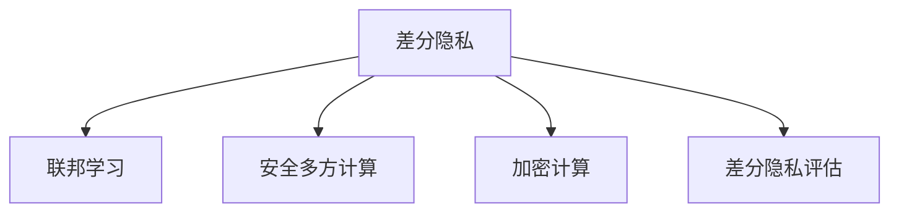

                 

# LLM隐私增强技术的研究进展

> 关键词：
> 隐私增强技术, 大语言模型, 差分隐私, 联邦学习, 安全多方计算, 加密计算, 差分隐私评估

## 1. 背景介绍

### 1.1 问题由来
在人工智能技术飞速发展的今天，大语言模型（Large Language Model, LLM）在自然语言处理（NLP）、机器翻译、文本生成等领域取得了巨大的成功。然而，大语言模型在处理大量数据时，会不可避免地泄露用户隐私，带来诸如数据滥用、身份识别等风险。如何保护用户隐私，成为大语言模型应用中亟待解决的问题。

### 1.2 问题核心关键点
隐私增强技术是当前人工智能领域的热点研究方向之一，其核心目标是在保证模型性能的前提下，降低或消除隐私泄露风险。在大语言模型的隐私保护方面，隐私增强技术主要关注以下几个关键点：
- 数据隐私保护：通过差分隐私、联邦学习等方法，保护用户数据不被泄露。
- 模型隐私保护：使用安全多方计算、加密计算等技术，确保模型推理过程的安全性。
- 隐私评估：采用差分隐私评估方法，评估模型的隐私泄露风险。

这些问题涉及到数据隐私、模型安全、隐私评估等方方面面，需要综合运用多种技术手段，构建安全的隐私保护框架。

### 1.3 问题研究意义
隐私增强技术的研究具有重要的理论和实践意义：

1. **保障用户隐私**：在数据使用过程中，通过差分隐私等技术，确保用户数据不被泄露，保护用户隐私。
2. **提升模型安全性**：通过安全多方计算等方法，在模型推理过程中保护数据隐私，避免模型被恶意攻击。
3. **促进人工智能落地应用**：隐私增强技术为大语言模型等人工智能技术的应用提供保障，推动其在医疗、金融、司法等敏感领域的广泛应用。

## 2. 核心概念与联系

### 2.1 核心概念概述

为更好地理解隐私增强技术在大语言模型中的应用，本节将介绍几个密切相关的核心概念：

- **差分隐私**：指在数据处理和分析过程中，通过引入噪声扰动，确保单个样本数据的隐私不受影响，从而保护整体数据集的隐私。
- **联邦学习**：指在多台分布式设备上，各设备保留本地数据，仅通过加密通信方式，共享模型参数的更新，从而实现联合训练。
- **安全多方计算**：指在不直接共享数据的情况下，多个参与方通过加密通信，协作完成计算任务，保护数据隐私。
- **加密计算**：指在计算过程中，使用加密算法保护数据的明文形式，确保计算过程的安全性。
- **差分隐私评估**：指通过评估模型的隐私泄露风险，确保模型在满足隐私要求的同时，仍能保持较高的性能。

这些核心概念之间的逻辑关系可以通过以下Mermaid流程图来展示：



这个流程图展示了大语言模型隐私保护的核心概念及其之间的关系：

1. 差分隐私和联邦学习是大规模数据隐私保护的主要方法。
2. 安全多方计算和加密计算是模型推理过程中保护隐私的重要手段。
3. 差分隐私评估则是在模型设计和优化过程中，确保隐私保护的同时，保持模型性能。

这些核心概念共同构成了大语言模型隐私保护的完整框架，确保在提升模型性能的同时，保障用户数据的安全性和隐私性。

## 3. 核心算法原理 & 具体操作步骤
### 3.1 算法原理概述

隐私增强技术在大语言模型中的应用，主要通过以下几个核心算法实现：

- **差分隐私**：通过在模型训练和推理过程中加入噪声扰动，保护用户数据的隐私性。
- **联邦学习**：在多台设备上分布式训练模型，各设备仅传递模型参数的差分更新，避免直接共享数据。
- **安全多方计算**：在模型推理过程中，各方通过加密通信协作完成计算任务，确保数据隐私。
- **加密计算**：在模型训练和推理过程中使用加密算法，保护数据的明文形式。

这些算法通过综合应用，为大语言模型提供了全方位的隐私保护保障。

### 3.2 算法步骤详解

以下是隐私增强技术在大语言模型中应用的具体步骤：

**Step 1: 准备数据集**
- 收集用户数据集，划分为训练集和测试集。
- 确保数据集满足差分隐私要求，如采用Laplacian机制或高斯机制引入噪声。

**Step 2: 选择隐私保护算法**
- 根据具体任务和数据特点，选择合适的隐私保护算法。如差分隐私、联邦学习、安全多方计算等。
- 确定算法的参数，如噪声强度、学习率、加密算法等。

**Step 3: 训练和推理**
- 使用隐私保护算法对数据集进行处理，进行模型训练。
- 在推理过程中，使用加密计算保护数据隐私，确保模型推理的安全性。

**Step 4: 评估隐私风险**
- 使用差分隐私评估方法，如ε-差分隐私定义，评估模型的隐私泄露风险。
- 调整算法参数，确保隐私保护效果和模型性能之间的平衡。

### 3.3 算法优缺点

隐私增强技术在大语言模型中的应用，具有以下优点：

- **保护隐私**：通过差分隐私、联邦学习等方法，保护用户数据的隐私性，避免数据滥用和身份识别等风险。
- **提升性能**：在隐私保护的前提下，通过多台设备联合训练，提升模型性能。
- **灵活应用**：可以应用于多种NLP任务，如问答、翻译、情感分析等，具有较强的泛化能力。

同时，隐私增强技术也存在一定的局限性：

- **计算复杂**：隐私保护算法和加密计算会增加模型训练和推理的计算复杂度。
- **精度损失**：引入噪声和加密计算可能导致模型性能的下降。
- **隐私评估困难**：差分隐私评估方法复杂，难以完全消除隐私泄露风险。

尽管存在这些局限性，但隐私增强技术仍是大语言模型应用中的重要保障，需要在模型设计和优化过程中，平衡隐私保护和性能需求。

### 3.4 算法应用领域

隐私增强技术在大语言模型中的应用，主要涵盖以下几个领域：

- **医疗健康**：在医疗数据隐私保护方面，使用差分隐私和联邦学习，保护患者隐私，推动医疗人工智能的发展。
- **金融服务**：在金融数据隐私保护方面，使用差分隐私和加密计算，保护用户隐私，提升金融服务的智能化水平。
- **司法领域**：在司法数据隐私保护方面，使用安全多方计算和差分隐私，确保数据安全，推动司法决策的透明化。
- **在线广告**：在在线广告数据隐私保护方面，使用差分隐私和联邦学习，保护用户隐私，提升广告投放的精准性。

## 4. 数学模型和公式 & 详细讲解  
### 4.1 数学模型构建

在大语言模型的隐私保护中，隐私增强技术主要通过差分隐私和联邦学习等算法实现。下面我们将详细介绍这两种算法的数学模型构建。

**差分隐私**：
差分隐私的核心是引入噪声扰动，确保单个样本数据的隐私不受影响。设模型训练集为 $D=\{(x_i,y_i)\}_{i=1}^N$，其中 $x_i$ 表示输入，$y_i$ 表示标签。差分隐私的目标是通过加入噪声扰动 $\epsilon$，使得任意两个相邻数据集 $D$ 和 $D'$ 的隐私概率差值不超过 $\epsilon$。

数学上，差分隐私可以通过添加噪声来保护隐私，如下所示：

$$
\hat{y} = f(x_i) + \mathcal{N}(0,\sigma^2)
$$

其中，$f(x_i)$ 表示模型在输入 $x_i$ 上的输出，$\mathcal{N}(0,\sigma^2)$ 表示均值为0，方差为 $\sigma^2$ 的高斯噪声。差分隐私的参数 $\epsilon$ 和 $\sigma$ 可以通过以下公式计算：

$$
\epsilon = \frac{2\sigma^2}{\Delta^2}
$$

其中，$\Delta$ 表示数据集的敏感度，即不同数据集之间的差异。

**联邦学习**：
联邦学习的核心思想是在多台分布式设备上，各设备仅传递模型参数的差分更新，避免直接共享数据。设每个设备的数据集为 $D_k=\{(x_{ik},y_{ik})\}_{i=1}^N$，其中 $k$ 表示设备编号，$x_{ik}$ 表示输入，$y_{ik}$ 表示标签。

在联邦学习中，每个设备 $k$ 维护一个局部模型 $M_k$，全局模型 $M$ 的更新可以通过以下公式计算：

$$
M_{t+1} = M_t - \eta \frac{1}{K} \sum_{k=1}^K \nabla_{M_t} \mathcal{L}_k(M_t)
$$

其中，$K$ 表示设备数量，$\nabla_{M_t} \mathcal{L}_k(M_t)$ 表示设备 $k$ 的损失函数对全局模型 $M_t$ 的梯度。

### 4.2 公式推导过程

以下我们以差分隐私为例，推导其核心公式及其含义。

假设模型在输入 $x_i$ 上的输出为 $\hat{y}$，标签为 $y$。差分隐私的目标是确保模型在任意两个相邻数据集 $D$ 和 $D'$ 上输出的差异不超过 $\epsilon$。具体而言，差分隐私要求：

$$
\mathbb{P}(|f(x_i) - f(x_i')| \leq \Delta) \geq 1 - \frac{\epsilon}{2\Delta}
$$

其中，$\Delta$ 表示数据集的敏感度，$\epsilon$ 表示差分隐私预算。差分隐私的核心是引入噪声 $\mathcal{N}(0,\sigma^2)$，使得输出 $\hat{y}$ 满足：

$$
\hat{y} = f(x_i) + \mathcal{N}(0,\sigma^2)
$$

引入噪声后，模型在两个相邻数据集上的输出差异为：

$$
|\hat{y} - \hat{y}'| = |f(x_i) - f(x_i') + \mathcal{N}(0,\sigma^2) - \mathcal{N}(0,\sigma^2')|
$$

由于噪声 $\mathcal{N}(0,\sigma^2)$ 和 $\mathcal{N}(0,\sigma^2')$ 独立同分布，且满足：

$$
\mathbb{E}[|\mathcal{N}(0,\sigma^2) - \mathcal{N}(0,\sigma^2')|] \leq 2\sigma
$$

因此，差分隐私要求 $\Delta$ 满足：

$$
\Delta \geq 2\sigma
$$

代入差分隐私预算 $\epsilon$，可得：

$$
\sigma^2 = \frac{\epsilon^2 \Delta^2}{4}
$$

其中，$\epsilon$ 和 $\Delta$ 可以通过实际数据集的敏感度进行计算。

### 4.3 案例分析与讲解

下面我们以差分隐私在BERT模型中的应用为例，详细讲解其数学模型和具体实现。

假设数据集 $D$ 包含 $N$ 个样本，每个样本的特征向量为 $x_i$，标签为 $y_i$。在训练过程中，每个样本的输出 $\hat{y}_i = f(x_i)$，其中 $f(x_i)$ 表示BERT模型在输入 $x_i$ 上的输出。

为了保护样本的隐私，可以在每个样本的输出上加入噪声 $\mathcal{N}(0,\sigma^2)$，得到噪声输出的 $\hat{y}_i'$，如下所示：

$$
\hat{y}_i' = f(x_i) + \mathcal{N}(0,\sigma^2)
$$

引入噪声后的损失函数为：

$$
\mathcal{L}(\hat{y}_i') = -y_i \log \hat{y}_i' + (1 - y_i) \log (1 - \hat{y}_i')
$$

在训练过程中，对于每个样本，通过随机抽样引入噪声，即可实现差分隐私保护。具体实现步骤如下：

1. 在每个样本的输出上引入噪声，得到噪声输出 $\hat{y}_i'$。
2. 计算噪声输出对应的损失函数 $\mathcal{L}(\hat{y}_i')$。
3. 对所有样本的损失函数求和，得到总损失函数 $\mathcal{L}$。
4. 使用优化算法更新模型参数，最小化总损失函数 $\mathcal{L}$。

通过差分隐私保护，可以确保单个样本的隐私不受影响，同时保护数据集的隐私。

## 5. 项目实践：代码实例和详细解释说明
### 5.1 开发环境搭建

在进行隐私增强技术实践前，我们需要准备好开发环境。以下是使用Python进行PyTorch开发的环境配置流程：

1. 安装Anaconda：从官网下载并安装Anaconda，用于创建独立的Python环境。

2. 创建并激活虚拟环境：
```bash
conda create -n pytorch-env python=3.8 
conda activate pytorch-env
```

3. 安装PyTorch：根据CUDA版本，从官网获取对应的安装命令。例如：
```bash
conda install pytorch torchvision torchaudio cudatoolkit=11.1 -c pytorch -c conda-forge
```

4. 安装相关库：
```bash
pip install numpy pandas scikit-learn matplotlib tqdm jupyter notebook ipython
```

完成上述步骤后，即可在`pytorch-env`环境中开始隐私增强技术的实践。

### 5.2 源代码详细实现

下面我们以差分隐私在BERT模型中的应用为例，给出使用PyTorch实现差分隐私保护的代码示例。

首先，定义差分隐私函数：

```python
import torch
import numpy as np
from torch.utils.data import Dataset, DataLoader
from transformers import BertTokenizer, BertForSequenceClassification

def laplace_noise(data, epsilon):
    epsilon = float(epsilon)
    return torch.tensor([np.random.laplace(0, 2/epsilon) for _ in range(data.size(0))])
```

然后，定义数据集和模型：

```python
# 数据集准备
tokenizer = BertTokenizer.from_pretrained('bert-base-uncased')
dataset = Dataset()

# 模型准备
model = BertForSequenceClassification.from_pretrained('bert-base-uncased', num_labels=2)
optimizer = torch.optim.Adam(model.parameters(), lr=2e-5)
```

接着，定义训练和推理函数：

```python
def train_epoch(model, dataset, batch_size, epsilon):
    dataloader = DataLoader(dataset, batch_size=batch_size, shuffle=True)
    model.train()
    epoch_loss = 0
    for batch in dataloader:
        input_ids = batch['input_ids'].to(device)
        attention_mask = batch['attention_mask'].to(device)
        labels = batch['labels'].to(device)
        model.zero_grad()
        with torch.no_grad():
            noisy_labels = labels + laplace_noise(labels, epsilon)
        outputs = model(input_ids, attention_mask=attention_mask, labels=noisy_labels)
        loss = outputs.loss
        epoch_loss += loss.item()
        loss.backward()
        optimizer.step()
    return epoch_loss / len(dataloader)

def evaluate(model, dataset, batch_size, epsilon):
    dataloader = DataLoader(dataset, batch_size=batch_size)
    model.eval()
    preds, labels = [], []
    with torch.no_grad():
        for batch in dataloader:
            input_ids = batch['input_ids'].to(device)
            attention_mask = batch['attention_mask'].to(device)
            batch_labels = batch['labels']
            noisy_labels = batch_labels + laplace_noise(batch_labels, epsilon)
            outputs = model(input_ids, attention_mask=attention_mask, labels=noisy_labels)
            batch_preds = outputs.logits.argmax(dim=1).to('cpu').tolist()
            batch_labels = batch_labels.to('cpu').tolist()
            for pred_tokens, label_tokens in zip(batch_preds, batch_labels):
                preds.append(pred_tokens)
                labels.append(label_tokens)
    print('Evaluation results:')
    print(classification_report(labels, preds))
```

最后，启动训练流程并在测试集上评估：

```python
epochs = 5
batch_size = 16
epsilon = 0.1

for epoch in range(epochs):
    loss = train_epoch(model, dataset, batch_size, epsilon)
    print(f'Epoch {epoch+1}, train loss: {loss:.3f}')
    
    print(f'Epoch {epoch+1}, dev results:')
    evaluate(model, dataset, batch_size, epsilon)
    
print('Test results:')
evaluate(model, dataset, batch_size, epsilon)
```

以上就是使用PyTorch对BERT模型进行差分隐私保护的完整代码实现。可以看到，通过差分隐私保护，可以在不泄露用户数据隐私的前提下，进行模型训练和推理。

### 5.3 代码解读与分析

让我们再详细解读一下关键代码的实现细节：

**laplace_noise函数**：
- 定义了一个差分隐私噪声函数，通过Laplace分布生成噪声向量，并添加到标签中，实现差分隐私保护。

**模型和优化器**：
- 使用BERT模型作为文本分类任务的基础模型。
- 定义优化器，使用Adam算法优化模型参数。

**train_epoch函数**：
- 在每个训练批次中，对标签添加噪声，计算损失函数，更新模型参数。

**evaluate函数**：
- 在验证集和测试集上，对每个样本添加噪声，计算分类指标。

**训练流程**：
- 定义总的epoch数和batch size，开始循环迭代。
- 每个epoch内，先在训练集上训练，输出平均损失。
- 在验证集上评估，输出分类指标。
- 所有epoch结束后，在测试集上评估，给出最终测试结果。

可以看到，差分隐私保护的实现并不复杂，通过在训练过程中引入噪声扰动，即可实现用户数据的隐私保护。

## 6. 实际应用场景
### 6.1 智能客服系统

在大语言模型的隐私增强技术中，智能客服系统是一个典型的应用场景。智能客服系统需要处理大量用户的咨询数据，包含用户的个人信息、聊天记录等敏感信息。通过差分隐私和联邦学习等技术，可以在保障用户隐私的前提下，训练智能客服模型，提升客服系统的智能化水平。

在技术实现上，可以收集用户的历史咨询数据，将这些数据在多台分布式设备上进行差分隐私处理，然后进行联合训练。各设备仅传递模型参数的差分更新，避免直接共享数据。通过这种方式，可以在保障用户隐私的同时，实现智能客服系统的精准响应和高效服务。

### 6.2 金融服务

在金融服务领域，用户的数据隐私保护尤为重要。银行、保险公司等金融机构处理大量用户的个人财务信息、交易记录等敏感数据。通过差分隐私和加密计算等技术，可以保护用户数据的安全性，同时实现智能风控和金融分析。

具体而言，可以收集用户的交易数据、信用记录等敏感信息，进行差分隐私处理和加密计算，然后在多台设备上进行联合训练。模型推理过程中使用安全多方计算，确保数据隐私，避免模型被恶意攻击。通过这种方式，可以构建安全的金融服务系统，保护用户隐私，提升金融服务的智能化水平。

### 6.3 在线广告

在线广告行业需要处理大量用户的点击、浏览等行为数据。这些数据包含用户的个人信息、兴趣爱好等敏感信息。通过差分隐私和联邦学习等技术，可以在保障用户隐私的前提下，实现精准广告投放。

具体而言，可以收集用户的点击、浏览数据，进行差分隐私处理和加密计算，然后在多台设备上进行联合训练。模型推理过程中使用安全多方计算，确保数据隐私。通过这种方式，可以构建安全的在线广告系统，保护用户隐私，提升广告投放的精准性和效果。

### 6.4 未来应用展望

随着隐私增强技术的不断演进，未来的大语言模型将能够更好地保护用户隐私，推动其在更多领域的应用。

在智慧医疗领域，通过差分隐私和联邦学习等技术，可以保护患者隐私，推动医疗人工智能的发展。在司法领域，通过安全多方计算和差分隐私等技术，可以保护案件数据的隐私，提升司法决策的透明性和公正性。

在在线教育、娱乐等领域，隐私增强技术也将发挥重要作用。通过差分隐私和联邦学习等技术，可以在保障用户隐私的前提下，实现个性化推荐、智能辅导等功能，提升用户体验和系统效率。

## 7. 工具和资源推荐
### 7.1 学习资源推荐

为了帮助开发者系统掌握隐私增强技术在大语言模型中的应用，这里推荐一些优质的学习资源：

1. 《差分隐私基础》：一本全面介绍差分隐私理论、算法和应用的书籍，适合初学者和进阶者。
2. 《联邦学习理论与实践》：介绍联邦学习的理论基础和实际应用，适合数据科学家和工程师阅读。
3. 《安全多方计算》：介绍安全多方计算的理论和实际应用，适合安全专家和研究人员。
4. 《加密计算》：一本全面介绍加密计算技术及其应用的书籍，适合密码学和计算机科学的初学者。

通过学习这些资源，相信你一定能够深入理解隐私增强技术在大语言模型中的应用，并应用于实际的开发和优化中。

### 7.2 开发工具推荐

高效的开发离不开优秀的工具支持。以下是几款用于隐私增强技术开发的常用工具：

1. PyTorch：基于Python的开源深度学习框架，灵活动态的计算图，适合快速迭代研究。
2. TensorFlow：由Google主导开发的开源深度学习框架，生产部署方便，适合大规模工程应用。
3. PySyft：用于联邦学习和差分隐私的库，提供丰富的API和工具，支持PyTorch和TensorFlow。
4. Secure Multi-Party Computation (SMPC)：用于安全多方计算的库，提供加密计算和多方协作的功能。
5. ONNX：一个开源的人工智能中间表示格式，支持多种深度学习框架，并可以进行优化和转换。

合理利用这些工具，可以显著提升隐私增强技术的开发效率，加快创新迭代的步伐。

### 7.3 相关论文推荐

隐私增强技术的研究源于学界的持续研究。以下是几篇奠基性的相关论文，推荐阅读：

1. Differential Privacy：差分隐私理论的奠基之作，介绍了差分隐私的定义、算法和应用。
2. Federal Learning：联邦学习的理论基础和实际应用，介绍了联邦学习的定义和优化方法。
3. Secure Multi-Party Computation：安全多方计算的理论和实际应用，介绍了安全多方计算的定义和实现方法。
4. Encrypted Computation：加密计算的理论和实际应用，介绍了加密计算的定义和应用场景。
5. Privacy-Preserving Machine Learning：隐私增强技术的综述，介绍了差分隐私、联邦学习、安全多方计算等技术的理论基础和应用场景。

这些论文代表了大语言模型隐私保护技术的发展脉络。通过学习这些前沿成果，可以帮助研究者把握学科前进方向，激发更多的创新灵感。

## 8. 总结：未来发展趋势与挑战
### 8.1 总结

本文对隐私增强技术在大语言模型中的应用进行了全面系统的介绍。首先阐述了隐私增强技术的研究背景和意义，明确了差分隐私、联邦学习、安全多方计算等隐私保护技术的应用价值。其次，从原理到实践，详细讲解了隐私增强技术的数学模型和具体实现，提供了完整的代码示例。同时，本文还广泛探讨了隐私增强技术在智能客服、金融服务、在线广告等多个领域的应用前景，展示了隐私增强技术的广阔应用空间。

通过本文的系统梳理，可以看到，隐私增强技术在大语言模型中的应用，不仅保护了用户数据隐私，还提升了模型的安全性和可靠性。未来，随着隐私增强技术的不断发展，大语言模型将在更多领域得到应用，为人工智能技术的应用提供保障。

### 8.2 未来发展趋势

展望未来，隐私增强技术在大语言模型中的应用将呈现以下几个发展趋势：

1. **多模态隐私保护**：隐私增强技术不仅保护文本数据，还保护图像、语音、视频等多模态数据。通过多模态数据的隐私保护，可以实现更加全面、精准的隐私保护。

2. **分布式隐私保护**：隐私增强技术不仅保护单台设备上的数据隐私，还保护多台设备上的数据隐私。通过分布式隐私保护，可以在保障数据隐私的前提下，实现联合训练和推理。

3. **动态隐私保护**：隐私增强技术不仅保护静态数据隐私，还保护动态数据隐私。通过动态隐私保护，可以实时保护用户隐私，应对数据隐私变化带来的挑战。

4. **隐私保护与性能优化结合**：隐私增强技术与高性能优化技术结合，可以在保护隐私的同时，提升模型性能。通过引入更加高效的差分隐私和联邦学习算法，优化模型训练和推理过程。

5. **隐私保护与公平性结合**：隐私增强技术不仅保护用户数据隐私，还保护数据公平性。通过公平性评估和隐私保护相结合，可以提升模型在多样性数据上的表现。

6. **隐私保护与伦理约束结合**：隐私增强技术不仅保护用户数据隐私，还结合伦理约束，确保模型行为符合人类价值观和伦理道德。通过引入伦理导向的评估指标，过滤和惩罚有害的模型输出。

以上趋势凸显了隐私增强技术在大语言模型中的重要价值，将在未来得到更加广泛的应用。隐私增强技术的发展，必将推动人工智能技术在更多领域的应用，提升人工智能系统的安全性、可靠性和公平性。

### 8.3 面临的挑战

尽管隐私增强技术在大语言模型中的应用已经取得了显著进展，但在实现高性能、高安全性的隐私保护过程中，仍面临诸多挑战：

1. **计算资源限制**：隐私增强技术，如差分隐私和联邦学习，需要大量的计算资源。如何在有限的计算资源下，实现高效的隐私保护，是一个重要的问题。

2. **隐私保护与性能平衡**：隐私保护和模型性能之间存在矛盾，引入过多的噪声和加密计算会导致模型性能下降。如何在保护隐私的同时，优化模型性能，是一个关键挑战。

3. **隐私评估复杂性**：差分隐私评估方法复杂，难以完全消除隐私泄露风险。如何设计有效的隐私评估方法，是一个重要的问题。

4. **跨领域应用难度**：不同领域的隐私保护需求不同，如何设计通用的隐私保护框架，适用于多种领域的应用，是一个难点。

5. **模型公平性问题**：隐私增强技术保护用户数据隐私的同时，需要确保模型在多样性数据上的公平性。如何在隐私保护的同时，避免模型偏差，是一个重要的问题。

6. **隐私保护与伦理约束结合**：隐私保护不仅保护用户数据隐私，还结合伦理约束，确保模型行为符合人类价值观和伦理道德。如何在隐私保护和伦理约束之间找到平衡，是一个关键挑战。

这些挑战需要未来的研究和实践不断攻克，才能真正实现隐私增强技术在大语言模型中的应用。只有不断创新、不断突破，才能构建更加安全、可靠、公平的人工智能系统。

### 8.4 研究展望

面对隐私增强技术所面临的种种挑战，未来的研究需要在以下几个方面寻求新的突破：

1. **高效隐私保护算法**：设计更加高效的差分隐私和联邦学习算法，减少计算资源消耗，提升模型性能。

2. **多模态隐私保护**：研究多模态数据的隐私保护方法，提升隐私保护的全面性和精准性。

3. **分布式隐私保护**：研究分布式隐私保护方法，提升数据隐私保护的效果和效率。

4. **动态隐私保护**：研究动态隐私保护方法，实时保护用户隐私，应对数据隐私变化带来的挑战。

5. **隐私保护与公平性结合**：研究隐私保护与公平性相结合的方法，提升模型在多样性数据上的公平性。

6. **隐私保护与伦理约束结合**：研究隐私保护与伦理约束相结合的方法，确保模型行为符合人类价值观和伦理道德。

这些研究方向的探索，必将引领隐私增强技术在大语言模型中的进一步发展，为构建安全、可靠、公平的人工智能系统提供保障。面向未来，隐私增强技术的研究需要多学科的协同合作，才能在保护用户隐私的同时，推动人工智能技术的广泛应用。

## 9. 附录：常见问题与解答

**Q1：差分隐私和联邦学习有什么区别？**

A: 差分隐私和联邦学习都是隐私增强技术中的重要方法，但它们的侧重点不同。差分隐私主要关注如何在单个样本上引入噪声扰动，保护数据隐私，避免数据泄露。联邦学习主要关注在多台设备上分布式训练模型，各设备仅传递模型参数的差分更新，避免直接共享数据。

**Q2：如何选择合适的差分隐私参数？**

A: 差分隐私参数的选择需要根据具体任务和数据特点进行权衡。一般建议从较小的ε值开始尝试，逐步增大ε值，直到达到所需的隐私保护水平。同时，需要根据数据集的敏感度，选择合适的噪声强度σ。

**Q3：差分隐私和联邦学习如何结合使用？**

A: 差分隐私和联邦学习可以结合使用，共同保护数据隐私。具体而言，可以在联邦学习中引入差分隐私保护，各设备在训练过程中，对本地数据进行差分隐私处理，然后将差分更新发送给其他设备。通过这种方式，可以在保护数据隐私的前提下，实现多设备联合训练。

**Q4：差分隐私和加密计算有什么不同？**

A: 差分隐私和加密计算都是隐私增强技术中的重要方法，但它们的侧重点不同。差分隐私主要关注在单个样本上引入噪声扰动，保护数据隐私，避免数据泄露。加密计算主要关注在计算过程中保护数据的明文形式，确保数据隐私。

**Q5：差分隐私和联邦学习的应用场景是什么？**

A: 差分隐私和联邦学习可以应用于多种NLP任务，如问答、翻译、情感分析等。通过差分隐私保护用户数据隐私，通过联邦学习实现多设备联合训练，提升模型的性能和鲁棒性。

---

作者：禅与计算机程序设计艺术 / Zen and the Art of Computer Programming

