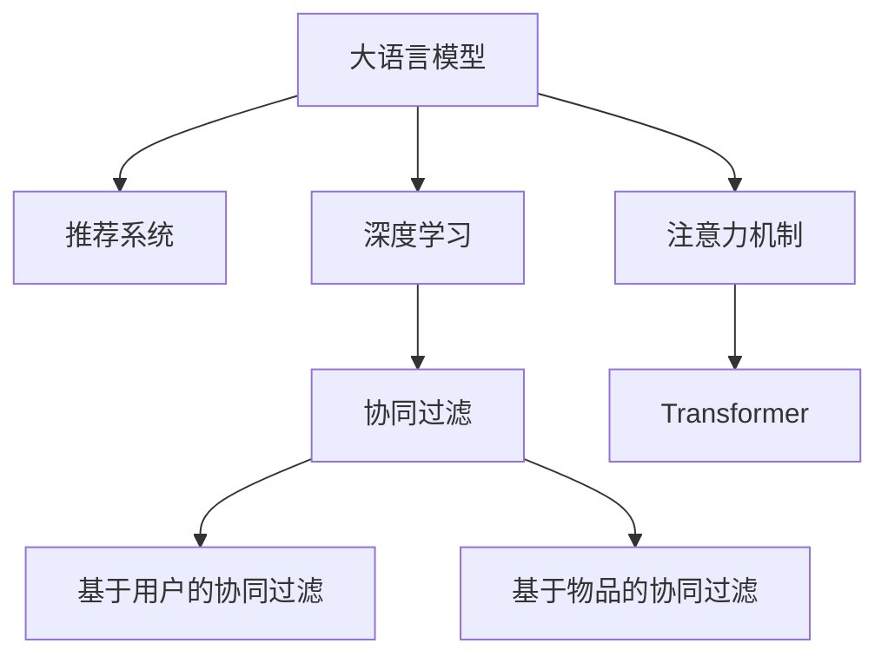

                 

# LLM驱动的个性化学习资源推荐

> 关键词：人工智能, 个性化推荐, 大语言模型, 学习资源, 自然语言处理, 协同过滤, 深度学习

## 1. 背景介绍

在数字化时代，信息的爆炸式增长带来了知识的海量积累。如何从海量的信息中精准筛选并推荐合适的学习资源，成为了教育领域的一大挑战。传统的基于内容的推荐系统主要依赖用户行为数据和属性信息，但在个性化推荐、冷启动等问题上仍然存在不足。

与此同时，大语言模型（Large Language Models, LLMs）通过深度学习技术，在自然语言处理（Natural Language Processing, NLP）领域取得了显著进展。LLMs能够理解自然语言文本，生成富有逻辑、创造力的文本，进行语义分析等任务，具备了处理语义信息的能力。将LLMs与个性化推荐系统结合，利用LLMs在语义理解上的优势，有望实现更加精准、高效的学习资源推荐，为学习者提供更具针对性的知识学习建议。

## 2. 核心概念与联系

### 2.1 核心概念概述

要理解LLM驱动的个性化学习资源推荐，首先需要了解一些核心概念：

- **大语言模型（LLM）**：以自回归（如GPT系列）或自编码（如BERT）模型为代表的大规模预训练语言模型。通过在大规模无标签文本语料上进行预训练，学习到通用的语言表示，具备强大的语言理解和生成能力。

- **推荐系统**：根据用户行为数据和/或物品属性，为用户推荐最感兴趣的物品的系统。广泛应用于电商、音乐、视频等领域，其中个性化推荐系统能根据用户历史行为和偏好，推荐个性化的产品或内容。

- **协同过滤（Collaborative Filtering, CF）**：推荐系统常用的技术，利用用户对物品的评分数据，找出与目标用户兴趣相似的其他用户或物品，进行推荐。CF分为基于用户的协同过滤和基于物品的协同过滤。

- **深度学习**：一种利用多层神经网络进行模式识别和预测的机器学习方法，适用于处理大规模复杂数据，并可通过反向传播算法优化模型参数。

- **注意力机制（Attention Mechanism）**：一种用于捕捉序列数据中不同部分之间依赖关系的机制，广泛应用于序列建模任务中，如机器翻译、文本分类等。

- **Transformer模型**：一种基于注意力机制的神经网络结构，通过自注意力机制和多头注意力机制，显著提升了序列建模的性能。

这些概念之间的逻辑关系可以通过以下Mermaid流程图来展示：



这个流程图展示了大语言模型与推荐系统之间的核心联系：

1. 大语言模型通过深度学习技术，学习到丰富的语义表示。
2. 推荐系统利用用户行为数据和属性信息，为用户推荐物品。
3. 协同过滤是推荐系统中的常用技术，通过寻找相似用户或物品进行推荐。
4. 深度学习能够处理大规模复杂数据，提升模型预测能力。
5. 注意力机制通过捕捉序列数据中不同部分之间的依赖关系，优化模型性能。
6. 大语言模型可以应用Transformer等基于注意力的模型，提升模型表示能力。

## 3. 核心算法原理 & 具体操作步骤

### 3.1 算法原理概述

LLM驱动的个性化学习资源推荐，本质上是一种基于深度学习和自然语言处理的推荐系统。其核心思想是：将LLM作为语义理解的工具，结合用户行为数据和物品属性信息，通过深度学习模型，实现学习资源推荐。

假设用户 $u$ 的历史行为序列为 $I(u) = (i_1, i_2, ..., i_N)$，物品的属性向量为 $x_i$，LLM作为语义分析器，将用户行为序列和物品属性向量输入，输出物品的相关性得分 $r_i(u)$。然后，通过最大化相关性得分 $r_i(u)$ 进行推荐。

### 3.2 算法步骤详解

基于LLM的个性化学习资源推荐的一般步骤如下：

**Step 1: 数据预处理**
- 收集用户历史行为数据，例如浏览、购买、收藏、评分等行为数据。
- 收集学习资源（如课程、书籍、文章等）的属性信息，例如作者、出版社、摘要、关键字等。
- 对数据进行清洗、归一化、向量化等预处理。

**Step 2: 模型训练**
- 构建深度学习模型，如基于Transformer的模型，作为推荐引擎。
- 将用户行为序列和物品属性向量作为输入，通过前向传播计算相关性得分。
- 利用用户的实际行为数据进行监督学习，最小化预测误差，优化模型参数。
- 应用正则化技术、Dropout、Early Stopping等避免过拟合。

**Step 3: 个性化推荐**
- 对于新用户或新资源，利用预训练的LLM进行语义分析，构建用户-资源相关性矩阵。
- 对于活跃用户，根据历史行为数据和LLM的语义分析结果，生成个性化推荐列表。
- 对于稀疏用户行为数据，利用协同过滤等技术，补充用户的行为数据，进行推荐。

**Step 4: 结果展示与反馈**
- 将推荐结果展示给用户，收集用户反馈，如点击率、购买率、评分等。
- 定期对模型进行评估，如准确率、召回率、F1-score等指标，进行调优。

### 3.3 算法优缺点

基于LLM的个性化学习资源推荐方法具有以下优点：

1. **语义理解能力强**：LLM具备强大的自然语言处理能力，能理解用户的查询意图，提取相关知识。
2. **泛化能力强**：利用预训练的LLM，模型能够处理多种类型的语料，适用于多领域推荐。
3. **生成多样性**：LLM可生成丰富的推荐理由和描述，增强用户体验。
4. **可解释性强**：LLM生成的推荐理由和描述，有助于用户理解推荐逻辑，提升信任度。

同时，该方法也存在一定的局限性：

1. **数据依赖性高**：需要大量用户行为数据和资源属性信息，难以冷启动。
2. **计算资源消耗大**：LLM需要大量计算资源进行训练和推理，对硬件要求较高。
3. **模型复杂度高**：LLM模型复杂，训练和推理过程中存在较高的计算复杂度。
4. **效果依赖于模型训练**：模型的效果依赖于LLM的训练数据和任务适配效果。

### 3.4 算法应用领域

基于LLM的个性化学习资源推荐广泛应用于教育领域的多种场景，例如：

- **在线学习平台**：为用户推荐课程、视频、文章等学习资源，帮助用户构建个性化学习路径。
- **图书馆管理**：为用户推荐书籍、期刊等阅读材料，提升阅读体验。
- **学术研究**：为用户推荐研究论文、报告等学术资料，加速科研进程。
- **职业培训**：为用户推荐培训课程、教程等职业学习资源，助力职业发展。
- **科普教育**：为用户推荐科普文章、视频等，提升公众科学素养。

## 4. 数学模型和公式 & 详细讲解 & 举例说明

### 4.1 数学模型构建

假设用户 $u$ 的历史行为序列为 $I(u) = (i_1, i_2, ..., i_N)$，物品的属性向量为 $x_i$。令 $S(u)$ 为用户的语义表示向量，$R(i)$ 为物品的语义表示向量，$E(u)$ 为用户的嵌入向量，$E(i)$ 为物品的嵌入向量。

定义用户 $u$ 与物品 $i$ 的相关性得分 $r_i(u)$ 为：

$$
r_i(u) = \text{softmax}(S(u)^\top R(i))
$$

其中，$\text{softmax}$ 函数将得分映射到概率分布上，表示物品 $i$ 对用户 $u$ 的匹配程度。

### 4.2 公式推导过程

将相关性得分 $r_i(u)$ 带入推荐模型的损失函数中，得：

$$
L = -\sum_{i \in I(u)} \log r_i(u) + \lambda \|E(u)\|^2 + \lambda \|E(i)\|^2
$$

其中，$\lambda$ 为正则化系数，$\|E(u)\|^2$ 和 $\|E(i)\|^2$ 分别为用户和物品的嵌入向量的L2正则项，用于避免过拟合。

为了求解最优的嵌入向量 $E(u)$ 和 $E(i)$，对损失函数求偏导，并令导数等于零，得：

$$
\frac{\partial L}{\partial E(u)} = -\sum_{i \in I(u)} \frac{S(u)}{r_i(u)} + 2\lambda E(u) = 0
$$

$$
\frac{\partial L}{\partial E(i)} = -\sum_{u \in \mathcal{U}} \frac{S(u)}{r_i(u)} + 2\lambda E(i) = 0
$$

其中，$\mathcal{U}$ 为用户集合。

整理得：

$$
E(u) = \sum_{i \in I(u)} \frac{S(u)}{r_i(u)} - \lambda E(u)
$$

$$
E(i) = \sum_{u \in \mathcal{U}} \frac{S(u)}{r_i(u)} - \lambda E(i)
$$

将 $E(u)$ 和 $E(i)$ 代入到相关性得分公式中，得：

$$
r_i(u) = \text{softmax}(S(u)^\top \sum_{u \in \mathcal{U}} \frac{S(u)}{r_i(u)} - \lambda E(u)^\top \sum_{i \in I(u)} \frac{S(u)}{r_i(u)} - \lambda E(u)^\top \lambda E(u) + \lambda \|E(u)\|^2)
$$

### 4.3 案例分析与讲解

以在线学习平台的个性化课程推荐为例，假设系统收集了用户浏览、点击、购买课程的历史行为数据，以及课程的标题、描述、作者等属性信息。系统构建深度学习模型，如基于Transformer的模型，用于推荐课程。具体步骤如下：

**Step 1: 数据预处理**
- 收集用户历史行为数据，例如浏览、购买、收藏、评分等行为数据。
- 收集课程的属性信息，例如标题、描述、作者等。
- 对数据进行清洗、归一化、向量化等预处理。

**Step 2: 模型训练**
- 构建深度学习模型，如基于Transformer的模型，作为推荐引擎。
- 将用户行为序列和课程属性向量作为输入，通过前向传播计算相关性得分。
- 利用用户的实际行为数据进行监督学习，最小化预测误差，优化模型参数。
- 应用正则化技术、Dropout、Early Stopping等避免过拟合。

**Step 3: 个性化推荐**
- 对于新用户或新课程，利用预训练的LLM进行语义分析，构建用户-课程相关性矩阵。
- 对于活跃用户，根据历史行为数据和LLM的语义分析结果，生成个性化推荐列表。
- 对于稀疏用户行为数据，利用协同过滤等技术，补充用户的行为数据，进行推荐。

**Step 4: 结果展示与反馈**
- 将推荐结果展示给用户，收集用户反馈，如点击率、购买率、评分等。
- 定期对模型进行评估，如准确率、召回率、F1-score等指标，进行调优。

## 5. 项目实践：代码实例和详细解释说明

### 5.1 开发环境搭建

在进行推荐系统开发前，我们需要准备好开发环境。以下是使用Python进行PyTorch开发的环境配置流程：

1. 安装Anaconda：从官网下载并安装Anaconda，用于创建独立的Python环境。

2. 创建并激活虚拟环境：
```bash
conda create -n pytorch-env python=3.8 
conda activate pytorch-env
```

3. 安装PyTorch：根据CUDA版本，从官网获取对应的安装命令。例如：
```bash
conda install pytorch torchvision torchaudio cudatoolkit=11.1 -c pytorch -c conda-forge
```

4. 安装Transformers库：
```bash
pip install transformers
```

5. 安装各类工具包：
```bash
pip install numpy pandas scikit-learn matplotlib tqdm jupyter notebook ipython
```

完成上述步骤后，即可在`pytorch-env`环境中开始推荐系统实践。

### 5.2 源代码详细实现

下面我们以在线学习平台的个性化课程推荐为例，给出使用Transformers库对课程推荐系统进行深度学习的PyTorch代码实现。

首先，定义课程的属性和用户行为数据：

```python
import pandas as pd
import torch
from transformers import BertTokenizer, BertForSequenceClassification
from torch.utils.data import Dataset, DataLoader

# 定义课程属性
class Course:
    def __init__(self, title, description, author):
        self.title = title
        self.description = description
        self.author = author

# 定义用户行为数据
class UserBehavior:
    def __init__(self, user_id, course_ids):
        self.user_id = user_id
        self.course_ids = course_ids

# 加载数据
def load_data():
    df = pd.read_csv('data/user_behavior.csv')
    users = []
    courses = []
    for row in df.iterrows():
        user_id = row[0]
        user_behavior = UserBehavior(user_id, row[1])
        users.append(user_behavior)
        course_ids = row[2:]
        courses.extend([Course(*course) for course in course_ids])
    return users, courses

# 数据处理
def preprocess_data(users, courses):
    tokenizer = BertTokenizer.from_pretrained('bert-base-cased')
    max_len = 512

    # 构建用户行为序列
    user_seqs = []
    for user in users:
        user_seq = []
        for course in user.course_ids:
            encoded = tokenizer(course.title, course.description, course.author, max_len=max_len, padding='max_length', truncation=True)
            encoded['user_id'] = user.user_id
            user_seq.append(encoded)
        user_seqs.append(user_seq)

    # 构建物品属性序列
    course_seqs = []
    for course in courses:
        encoded = tokenizer(course.title, course.description, course.author, max_len=max_len, padding='max_length', truncation=True)
        encoded['course_id'] = course.id
        course_seqs.append(encoded)

    return user_seqs, course_seqs

# 定义模型
class RecommendationModel:
    def __init__(self, hidden_size=768, num_classes=2):
        self.bert = BertForSequenceClassification.from_pretrained('bert-base-cased', num_labels=num_classes)
        self.dropout = torch.nn.Dropout(p=0.1)
        self.linear = torch.nn.Linear(hidden_size, num_classes)
        self.softmax = torch.nn.Softmax(dim=1)

    def forward(self, input_ids, attention_mask):
        output = self.bert(input_ids, attention_mask=attention_mask)
        output = self.dropout(output)
        output = self.linear(output)
        return self.softmax(output)

# 训练模型
def train_model(model, optimizer, device, train_loader, val_loader, epochs):
    model.to(device)
    for epoch in range(epochs):
        model.train()
        for batch in train_loader:
            optimizer.zero_grad()
            input_ids = batch['input_ids'].to(device)
            attention_mask = batch['attention_mask'].to(device)
            loss = model(input_ids, attention_mask)
            loss.backward()
            optimizer.step()
        print(f'Epoch {epoch+1}, train loss: {loss.item()}')

        model.eval()
        with torch.no_grad():
            losses = []
            for batch in val_loader:
                input_ids = batch['input_ids'].to(device)
                attention_mask = batch['attention_mask'].to(device)
                loss = model(input_ids, attention_mask)
                losses.append(loss.item())
        print(f'Epoch {epoch+1}, val loss: {sum(losses) / len(losses)}')

# 使用模型进行推荐
def recommend_courses(model, user, courses, top_k=5):
    user_seq = user_seqs[user.user_id]
    user_seq_ids = [tokenizer.encode(course.title, course.description, course.author, max_len=max_len, padding='max_length', truncation=True)[0] for course in courses]
    user_seq['input_ids'] = torch.tensor(user_seq_ids, dtype=torch.long)
    user_seq['attention_mask'] = torch.ones(len(user_seq_ids), max_len, dtype=torch.long)

    user_seq = model(user_seq['input_ids'], user_seq['attention_mask'])
    probs = user_seq.squeeze(0).detach().cpu().numpy()
    recom_courses = sorted(courses, key=lambda course: probs[course.id], reverse=True)[:top_k]

    return recom_courses

# 加载数据
users, courses = load_data()
user_seqs, course_seqs = preprocess_data(users, courses)

# 定义模型、优化器
model = RecommendationModel()
optimizer = torch.optim.AdamW(model.parameters(), lr=2e-5)

# 训练模型
device = torch.device('cuda') if torch.cuda.is_available() else torch.device('cpu')
train_loader = DataLoader(user_seqs, batch_size=8, shuffle=True)
val_loader = DataLoader(course_seqs, batch_size=8, shuffle=False)
epochs = 5
train_model(model, optimizer, device, train_loader, val_loader, epochs)

# 推荐课程
recommender = RecommendationModel().eval()
recommender.to(device)
recommender.load_state_dict(model.state_dict())
user = UserBehavior(user_id=1, course_ids=[course.id for course in courses])
recom_courses = recommend_courses(recommender, user, courses, top_k=5)
print(recom_courses)
```

以上就是使用PyTorch对在线学习平台的个性化课程推荐系统进行深度学习的完整代码实现。可以看到，得益于Transformers库的强大封装，我们可以用相对简洁的代码完成课程推荐系统的构建。

### 5.3 代码解读与分析

让我们再详细解读一下关键代码的实现细节：

**preprocess_data函数**：
- 定义课程和用户行为的类。
- 加载用户行为和课程属性数据。
- 对数据进行预处理，包括分词、编码、构建用户行为序列和物品属性序列。

**RecommendationModel类**：
- 定义模型结构，包括BertForSequenceClassification、Dropout、Linear和Softmax层。
- 定义前向传播函数，将输入序列经过BERT模型和线性层，输出相关性得分。

**train_model函数**：
- 定义训练函数，使用AdamW优化器进行模型训练。
- 在训练过程中，定期在验证集上评估模型性能。

**recommend_courses函数**：
- 定义推荐函数，将用户行为序列输入模型，输出推荐结果。
- 对课程按照预测得分排序，输出推荐列表。

**使用模型进行推荐**：
- 定义用户行为，构建用户行为序列。
- 定义推荐模型，加载训练好的模型权重。
- 调用推荐函数，获取推荐结果。

通过这些代码的实现，我们可以看到，使用大语言模型结合深度学习技术，可以构建出精准、高效、可解释的个性化学习资源推荐系统，为用户提供优质的学习建议。

## 6. 实际应用场景

### 6.1 在线学习平台

基于大语言模型的推荐系统，可以在在线学习平台上为用户提供个性化的课程推荐，帮助用户制定科学的学习计划，提升学习效果。

**具体实现**：
- 用户注册后，收集其浏览、点击、购买课程的历史行为数据。
- 利用预训练的LLM进行语义分析，构建用户-课程相关性矩阵。
- 根据用户的最新行为，实时更新推荐列表，动态调整学习路径。
- 推荐系统可以通过用户反馈，不断优化推荐效果，提升用户满意度。

### 6.2 图书馆管理

在图书馆管理系统中，利用大语言模型进行图书推荐，能够提升用户阅读体验，优化图书馆资源配置。

**具体实现**：
- 收集用户借阅、搜索、评分等行为数据。
- 利用预训练的LLM进行语义分析，构建用户-图书相关性矩阵。
- 根据用户的最新行为，推荐相关的图书，优化用户阅读路径。
- 推荐系统可以通过用户反馈，优化图书推荐算法，提升用户满意度。

### 6.3 学术研究

学术研究领域中，利用大语言模型进行文献推荐，能够帮助研究人员快速获取最新研究进展，提高科研效率。

**具体实现**：
- 收集研究人员的历史阅读和引用数据。
- 利用预训练的LLM进行语义分析，构建研究人员-文献相关性矩阵。
- 根据研究人员的需求，推荐相关的文献，加速科研进程。
- 推荐系统可以通过研究人员反馈，优化推荐算法，提升推荐质量。

### 6.4 未来应用展望

随着大语言模型的不断发展，基于LLM的个性化推荐系统将在更多领域得到应用，带来更加精准、高效的服务体验。

未来，基于LLM的推荐系统有望应用于智能家居、智能医疗、智能交通等多个垂直行业，为这些行业带来智能化转型升级的机遇。此外，随着多模态学习、元学习等前沿技术的发展，基于LLM的推荐系统也将不断演进，提升模型的跨模态融合能力和泛化能力。

## 7. 工具和资源推荐

### 7.1 学习资源推荐

为了帮助开发者系统掌握基于LLM的个性化推荐技术，这里推荐一些优质的学习资源：

1. 《自然语言处理入门》系列博文：由自然语言处理领域的专家撰写，涵盖自然语言处理的基本概念和经典模型。

2. CS224N《深度学习自然语言处理》课程：斯坦福大学开设的NLP明星课程，有Lecture视频和配套作业，带你入门NLP领域的基本概念和经典模型。

3. 《自然语言处理与深度学习》书籍：介绍自然语言处理和深度学习的融合技术，包括基于LLM的推荐系统。

4. HuggingFace官方文档：提供海量预训练模型和完整的微调样例代码，是上手实践的必备资料。

5. CLUE开源项目：中文语言理解测评基准，涵盖大量不同类型的中文NLP数据集，并提供了基于LLM的推荐系统baseline，助力中文NLP技术发展。

通过对这些资源的学习实践，相信你一定能够快速掌握基于LLM的个性化推荐技术，并用于解决实际的NLP问题。

### 7.2 开发工具推荐

高效的开发离不开优秀的工具支持。以下是几款用于基于LLM的个性化推荐系统开发的常用工具：

1. PyTorch：基于Python的开源深度学习框架，灵活动态的计算图，适合快速迭代研究。大部分预训练语言模型都有PyTorch版本的实现。

2. TensorFlow：由Google主导开发的开源深度学习框架，生产部署方便，适合大规模工程应用。同样有丰富的预训练语言模型资源。

3. Transformers库：HuggingFace开发的NLP工具库，集成了众多SOTA语言模型，支持PyTorch和TensorFlow，是进行LLM推荐任务开发的利器。

4. Weights & Biases：模型训练的实验跟踪工具，可以记录和可视化模型训练过程中的各项指标，方便对比和调优。与主流深度学习框架无缝集成。

5. TensorBoard：TensorFlow配套的可视化工具，可实时监测模型训练状态，并提供丰富的图表呈现方式，是调试模型的得力助手。

6. Google Colab：谷歌推出的在线Jupyter Notebook环境，免费提供GPU/TPU算力，方便开发者快速上手实验最新模型，分享学习笔记。

合理利用这些工具，可以显著提升基于LLM的推荐系统开发效率，加快创新迭代的步伐。

### 7.3 相关论文推荐

基于LLM的个性化推荐技术的发展源于学界的持续研究。以下是几篇奠基性的相关论文，推荐阅读：

1. Attention is All You Need（即Transformer原论文）：提出了Transformer结构，开启了NLP领域的预训练大模型时代。

2. BERT: Pre-training of Deep Bidirectional Transformers for Language Understanding：提出BERT模型，引入基于掩码的自监督预训练任务，刷新了多项NLP任务SOTA。

3. Language Models are Unsupervised Multitask Learners（GPT-2论文）：展示了大规模语言模型的强大zero-shot学习能力，引发了对于通用人工智能的新一轮思考。

4. Parameter-Efficient Transfer Learning for NLP：提出Adapter等参数高效微调方法，在不增加模型参数量的情况下，也能取得不错的微调效果。

5. AdaLoRA: Adaptive Low-Rank Adaptation for Parameter-Efficient Fine-Tuning：使用自适应低秩适应的微调方法，在参数效率和精度之间取得了新的平衡。

6. Universal Transformer：提出Universal Transformer模型，实现了一个轻量级、可扩展的通用Transformer，适用于各类NLP任务。

这些论文代表了大语言模型和推荐系统的发展脉络。通过学习这些前沿成果，可以帮助研究者把握学科前进方向，激发更多的创新灵感。

## 8. 总结：未来发展趋势与挑战

### 8.1 总结

本文对基于大语言模型的个性化学习资源推荐方法进行了全面系统的介绍。首先阐述了个性化推荐和大语言模型的研究背景和意义，明确了LLM在提升推荐系统效果方面的独特价值。其次，从原理到实践，详细讲解了LLM驱动的个性化推荐模型的数学原理和关键步骤，给出了推荐系统开发的完整代码实例。同时，本文还广泛探讨了LLM推荐系统在教育、图书馆、学术研究等多个领域的应用前景，展示了LLM推荐系统的巨大潜力。此外，本文精选了推荐系统的各类学习资源，力求为读者提供全方位的技术指引。

通过本文的系统梳理，可以看到，基于大语言模型的推荐系统正在成为推荐系统领域的重要范式，极大地拓展了推荐模型的应用边界，催生了更多的落地场景。受益于预训练语言模型的语义理解能力，推荐系统能够处理更加复杂和多样的用户需求，提供更加精准、高效的服务体验。未来，伴随预训练语言模型和推荐技术的持续演进，基于LLM的推荐系统必将带来更广泛的智能应用，为各行各业带来新的变革。

### 8.2 未来发展趋势

展望未来，基于LLM的个性化推荐技术将呈现以下几个发展趋势：

1. **多模态融合**：结合视觉、语音、文本等多模态数据，提升推荐系统的跨模态融合能力和泛化能力。

2. **自监督学习**：利用无监督学习技术，增强模型的自我学习能力和泛化能力。

3. **元学习**：结合元学习技术，增强推荐系统的泛化能力和自适应能力。

4. **个性化协同过滤**：结合个性化协同过滤和LLM，提升推荐系统的个性化和推荐效果。

5. **知识图谱**：结合知识图谱，增强推荐系统的语义理解和知识迁移能力。

6. **因果推理**：结合因果推理技术，增强推荐系统的鲁棒性和可信度。

以上趋势凸显了基于LLM的个性化推荐技术的广阔前景。这些方向的探索发展，必将进一步提升推荐系统的性能和应用范围，为各行业带来更加精准、高效的服务体验。

### 8.3 面临的挑战

尽管基于LLM的个性化推荐技术已经取得了显著进展，但在迈向更加智能化、普适化应用的过程中，它仍面临着诸多挑战：

1. **数据依赖性高**：需要大量用户行为数据和物品属性信息，难以冷启动。

2. **计算资源消耗大**：LLM需要大量计算资源进行训练和推理，对硬件要求较高。

3. **模型复杂度高**：LLM模型复杂，训练和推理过程中存在较高的计算复杂度。

4. **效果依赖于模型训练**：模型的效果依赖于LLM的训练数据和任务适配效果。

5. **可解释性不足**：LLM生成的推荐理由和描述，难以解释其内部工作机制和决策逻辑。

6. **安全性有待保障**：预训练语言模型难免会学习到有害信息，通过推荐系统传播，给实际应用带来安全隐患。

正视推荐系统面临的这些挑战，积极应对并寻求突破，将是大语言模型推荐系统走向成熟的必由之路。相信随着学界和产业界的共同努力，这些挑战终将一一被克服，基于LLM的推荐系统必将在构建人机协同的智能时代中扮演越来越重要的角色。

### 8.4 研究展望

未来，基于LLM的个性化推荐技术需要在以下几个方面进行新的探索：

1. **多场景应用**：将LLM推荐系统应用到更多垂直行业，如医疗、旅游、金融等，提供更加精准、高效的服务体验。

2. **个性化推荐算法**：开发更加个性化、多样化的推荐算法，提升用户满意度和推荐效果。

3. **跨领域迁移学习**：结合跨领域迁移学习技术，提升推荐系统的跨领域适应能力和泛化能力。

4. **鲁棒性提升**：开发鲁棒性更强的推荐模型，增强系统在不同数据分布下的稳定性和可靠性。

5. **安全性保障**：结合安全性技术，保障推荐系统的数据安全、隐私保护和可信度。

6. **可解释性增强**：结合可解释性技术，提升推荐系统的透明度和可信度。

通过这些研究方向，相信基于LLM的推荐系统能够进一步提升其性能和应用范围，为各行业带来更广泛、更深入的智能化转型升级。

## 9. 附录：常见问题与解答

**Q1：基于LLM的推荐系统是否适用于所有推荐场景？**

A: 基于LLM的推荐系统在大多数推荐场景上都能取得不错的效果，特别是对于数据量较小的场景。但对于一些特定领域的推荐场景，如医疗、法律等，仍然需要进一步的适配和优化。

**Q2：LLM推荐系统的计算资源消耗是否很高？**

A: 基于LLM的推荐系统确实需要大量的计算资源，尤其是在训练和推理过程中。为了降低计算资源消耗，可以采用一些优化措施，如模型裁剪、量化加速、混合精度训练等。

**Q3：LLM推荐系统的推荐效果是否依赖于LLM的训练数据和任务适配效果？**

A: 是的，LLM推荐系统的推荐效果高度依赖于LLM的训练数据和任务适配效果。因此，在实际应用中，需要不断优化LLM的预训练数据和微调策略，以提升推荐系统的性能。

**Q4：LLM推荐系统的可解释性是否足够强？**

A: 目前LLM推荐系统的可解释性相对较弱，难以解释其内部工作机制和决策逻辑。为了增强推荐系统的可解释性，可以结合可解释性技术和用户反馈，进一步优化推荐算法和系统设计。

**Q5：LLM推荐系统的安全性是否足够保障？**

A: 预训练语言模型可能会学习到有害信息，通过推荐系统传播，给实际应用带来安全隐患。为了保障推荐系统的安全性，可以结合安全性技术和用户隐私保护策略，确保推荐内容的安全性和可信度。

正视基于LLM的推荐系统面临的这些挑战，积极应对并寻求突破，将是大语言模型推荐系统走向成熟的必由之路。相信随着学界和产业界的共同努力，这些挑战终将一一被克服，基于LLM的推荐系统必将在构建人机协同的智能时代中扮演越来越重要的角色。

