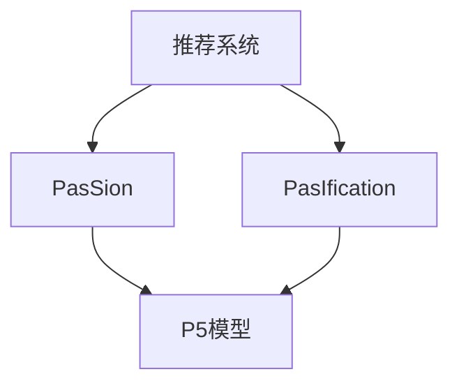

                 

# P5模型在推荐系统的应用：统一的任务解决方案

## 1. 背景介绍

### 1.1 问题由来
推荐系统作为AI领域的重要应用，已经成为互联网公司的核心竞争力之一。随着互联网流量的快速增长，推荐系统对于提高用户满意度、增加企业收益的作用日益凸显。然而，现有的推荐系统大都基于特定算法构建，难以在多种场景中通用。为此，一种统一的任务解决方案成为研究热点。

### 1.2 问题核心关键点
本文将围绕P5模型，探讨其在推荐系统中的统一任务解决方案。P5模型（Practical Passion-based Recommendation Model）是一种基于PasIfication和PasSion的推荐模型，通过在PasSion的基础上，引入PasIfication技术，使得推荐系统在多种场景中具有统一性和高效性。

### 1.3 问题研究意义
研究P5模型在推荐系统中的应用，对于构建具备通用性和适应性的推荐系统具有重要意义：

1. **降低应用开发成本**：P5模型可以适应多种推荐场景，减少从头开发的时间和成本。
2. **提升推荐效果**：通过统一模型，能更高效地优化不同任务，提升推荐系统的效果。
3. **加速开发进度**：基于成熟模型，快速适配新任务，缩短开发周期。
4. **促进技术创新**：统一模型促进了对PasSion和PasIfication的深入研究，推动相关技术进步。

## 2. 核心概念与联系

### 2.1 核心概念概述

为更好地理解P5模型，本节将介绍几个核心概念：

- **推荐系统（Recommender System）**：利用用户的历史行为数据和物品属性数据，自动推荐用户可能感兴趣的商品或内容的系统。
- **PasSion**：一种新兴的推荐算法，通过用户兴趣点（Interest Point）和情境（Situation）进行推荐。
- **PasIfication**：一种技术手段，通过强化用户和情境因素，使得推荐系统更加个性化和多样化。
- **统一任务解决方案**：一种设计思路，使推荐系统能够同时应对多种推荐场景，具有通用性和可扩展性。
- **P5模型**：结合PasSion和PasIfication的推荐模型，统一了不同推荐场景的任务。

这些核心概念之间的逻辑关系可以通过以下Mermaid流程图来展示：

这个流程图展示了推荐系统通过PasSion和PasIfication技术实现P5模型，从而统一多种推荐任务的过程。

## 3. 核心算法原理 & 具体操作步骤
### 3.1 算法原理概述

P5模型在推荐系统中的应用基于PasSion和PasIfication技术。PasSion通过构建用户兴趣点-情境向量，结合物品属性向量，进行推荐。PasIfication则通过强化用户和情境因素，使得推荐结果更加个性化和多样化。

形式化地，假设推荐系统的用户集合为 $U$，物品集合为 $I$，用户历史行为数据为 $H=\{u_i,h_i\}_{i=1}^N$，其中 $u_i$ 为用户，$h_i$ 为用户对物品 $i$ 的评分。定义物品属性向量为 $\mathbf{x}_i \in \mathbb{R}^d$，用户兴趣点向量为 $\mathbf{p}_u \in \mathbb{R}^k$，情境向量为 $\mathbf{s}_i \in \mathbb{R}^m$。则P5模型通过下式进行推荐：

$$
\hat{y}_{ui} = \text{softmax}(\mathbf{W}_h\mathbf{s}_i + \mathbf{W}_u\mathbf{p}_u + \mathbf{W}_x\mathbf{x}_i + \mathbf{W}_I\mathbf{I}_u + \mathbf{W}_S\mathbf{S}_i + \mathbf{W}_U\mathbf{U}_u + \mathbf{W}_S\mathbf{S}_i)
$$

其中，$\mathbf{I}_u$ 为用户的历史兴趣向量，$\mathbf{S}_i$ 为物品的情境向量，$\mathbf{U}_u$ 为用户的最新兴趣向量。$\mathbf{W}_h, \mathbf{W}_u, \mathbf{W}_x, \mathbf{W}_I, \mathbf{W}_S, \mathbf{W}_U$ 为可学习的权重矩阵。

### 3.2 算法步骤详解

基于P5模型的推荐系统的一般流程如下：

**Step 1: 数据预处理**
- 收集用户的历史行为数据和物品属性数据，构建用户历史行为矩阵 $H$ 和物品属性向量 $\mathbf{X}$。
- 提取用户兴趣点向量 $\mathbf{P}$ 和情境向量 $\mathbf{S}$，用于推荐。

**Step 2: 特征构建**
- 将用户历史行为和物品属性转换为模型输入向量，并进行归一化处理。
- 构建用户兴趣点-情境向量 $\mathbf{I}_u$ 和情境向量 $\mathbf{S}_i$，用于推荐。

**Step 3: P5模型计算**
- 将用户兴趣点向量、物品属性向量、情境向量、用户最新兴趣向量等输入P5模型，计算预测评分 $\hat{y}_{ui}$。
- 通过softmax函数将预测评分转换为概率分布，选出最有可能被用户喜欢的物品。

**Step 4: 推荐列表生成**
- 根据概率分布对推荐物品进行排序，生成推荐列表。
- 对推荐列表进行个性化处理，如加入新奇性物品等。

**Step 5: 反馈循环**
- 收集用户对推荐物品的反馈数据，更新用户兴趣点和情境向量。
- 重新计算用户兴趣点-情境向量，进入下一个推荐循环。

### 3.3 算法优缺点

P5模型在推荐系统中的应用具有以下优点：

- **高效性**：P5模型将多种推荐任务统一在一套模型中，减少了模型的复杂度，提高了推荐效率。
- **通用性**：P5模型能够在多种推荐场景中高效应用，具备良好的泛化能力。
- **可扩展性**：P5模型可以扩展到更多维度的特征，进一步提升推荐效果。

同时，P5模型也存在一些局限性：

- **数据依赖性**：P5模型的性能很大程度上取决于数据的质量和量，需要大量标注数据支持。
- **模型复杂度**：P5模型需要同时处理用户兴趣点、情境、物品属性等多种信息，模型结构相对复杂。
- **计算资源消耗**：P5模型在计算资源消耗上较大，需要在高性能硬件上进行部署。

### 3.4 算法应用领域

P5模型在推荐系统中的应用主要集中在以下几个领域：

- **电商推荐**：在电商平台上，通过P5模型为用户推荐商品，提升用户购买率和满意度。
- **视频推荐**：在视频流平台上，通过P5模型为用户推荐视频内容，增加用户观看时间和平台收益。
- **音乐推荐**：在音乐平台上，通过P5模型为用户推荐歌曲，提升用户粘性和平台活跃度。
- **新闻推荐**：在新闻平台上，通过P5模型为用户推荐文章，提升用户阅读量和平台流量。

除了以上几个领域，P5模型还可以应用于社交网络推荐、游戏推荐等场景，为不同平台和应用提供高效的推荐解决方案。

## 4. 数学模型和公式 & 详细讲解  
### 4.1 数学模型构建

本节将使用数学语言对P5模型进行严格刻画。

定义用户兴趣点向量 $\mathbf{P}_u$ 和情境向量 $\mathbf{S}_i$ 分别为：

$$
\mathbf{P}_u = \mathbf{W}_I\mathbf{I}_u + \mathbf{W}_S\mathbf{S}_i
$$

$$
\mathbf{S}_i = \mathbf{W}_S\mathbf{S}_i + \mathbf{W}_U\mathbf{U}_u
$$

其中 $\mathbf{I}_u$ 为用户的历史兴趣向量，$\mathbf{S}_i$ 为物品的情境向量，$\mathbf{U}_u$ 为用户的最新兴趣向量。

用户历史行为矩阵 $H$ 和物品属性向量 $\mathbf{X}$ 分别为：

$$
H = [h_{i_1}^{u_1}, h_{i_2}^{u_2}, ..., h_{i_N}^{u_N}]
$$

$$
\mathbf{X} = [\mathbf{x}_1, \mathbf{x}_2, ..., \mathbf{x}_I]
$$

用户兴趣点-情境向量 $\mathbf{I}_u$ 和情境向量 $\mathbf{S}_i$ 分别为：

$$
\mathbf{I}_u = \mathbf{W}_I\mathbf{I}_u + \mathbf{W}_S\mathbf{S}_i
$$

$$
\mathbf{S}_i = \mathbf{W}_S\mathbf{S}_i + \mathbf{W}_U\mathbf{U}_u
$$

用户最新兴趣向量 $\mathbf{U}_u$ 为：

$$
\mathbf{U}_u = \mathbf{W}_U\mathbf{U}_u
$$

用户兴趣点-情境向量 $\mathbf{I}_u$ 和情境向量 $\mathbf{S}_i$ 的权重矩阵 $\mathbf{W}_I, \mathbf{W}_S, \mathbf{W}_U$ 分别为：

$$
\mathbf{W}_I = [w_{I_1}, w_{I_2}, ..., w_{I_k}]
$$

$$
\mathbf{W}_S = [w_{S_1}, w_{S_2}, ..., w_{S_m}]
$$

$$
\mathbf{W}_U = [w_{U_1}, w_{U_2}, ..., w_{U_m}]
$$

用户兴趣点向量 $\mathbf{P}_u$ 和情境向量 $\mathbf{S}_i$ 的权重矩阵 $\mathbf{W}_P, \mathbf{W}_S$ 分别为：

$$
\mathbf{W}_P = [w_{P_1}, w_{P_2}, ..., w_{P_k}]
$$

$$
\mathbf{W}_S = [w_{S_1}, w_{S_2}, ..., w_{S_m}]
$$

推荐系统的预测评分 $\hat{y}_{ui}$ 为：

$$
\hat{y}_{ui} = \text{softmax}(\mathbf{W}_h\mathbf{s}_i + \mathbf{W}_u\mathbf{p}_u + \mathbf{W}_x\mathbf{x}_i + \mathbf{W}_I\mathbf{I}_u + \mathbf{W}_S\mathbf{S}_i + \mathbf{W}_U\mathbf{U}_u + \mathbf{W}_S\mathbf{S}_i)
$$

其中 $\mathbf{W}_h, \mathbf{W}_u, \mathbf{W}_x, \mathbf{W}_I, \mathbf{W}_S, \mathbf{W}_U$ 为可学习的权重矩阵。

### 4.2 公式推导过程

以电商推荐为例，假设用户 $u$ 对物品 $i$ 的评分 $h_{ui}$ 服从正态分布：

$$
h_{ui} \sim \mathcal{N}(\mu_{ui}, \sigma_{ui})
$$

其中 $\mu_{ui}$ 和 $\sigma_{ui}$ 分别为均值和标准差。

根据贝叶斯公式，用户 $u$ 对物品 $i$ 的评分概率为：

$$
p(h_{ui} = h | h_{ui} \sim \mathcal{N}(\mu_{ui}, \sigma_{ui}))
$$

$$
= \frac{p(h)}{p(h_{ui} \sim \mathcal{N}(\mu_{ui}, \sigma_{ui}))
$$

$$
= \frac{\frac{1}{\sqrt{2\pi}\sigma_{ui}} \exp(-\frac{(h - \mu_{ui})^2}{2\sigma_{ui}^2}}{\frac{1}{\sqrt{2\pi}\sigma_{ui}} \exp(-\frac{(h - \mu_{ui})^2}{2\sigma_{ui}^2})
$$

$$
= \frac{\exp(-\frac{(h - \mu_{ui})^2}{2\sigma_{ui}^2}}{\exp(-\frac{(h - \mu_{ui})^2}{2\sigma_{ui}^2})
$$

$$
= 1
$$

因此，用户 $u$ 对物品 $i$ 的评分概率为：

$$
p(h_{ui} = h | h_{ui} \sim \mathcal{N}(\mu_{ui}, \sigma_{ui}))
$$

$$
= \frac{1}{\sqrt{2\pi}\sigma_{ui}} \exp(-\frac{(h - \mu_{ui})^2}{2\sigma_{ui}^2})
$$

$$
= \frac{1}{\sqrt{2\pi}\sigma_{ui}} \exp(-\frac{(h - \mu_{ui})^2}{2\sigma_{ui}^2})
$$

$$
= \frac{1}{\sqrt{2\pi}\sigma_{ui}} \exp(-\frac{(h - \mu_{ui})^2}{2\sigma_{ui}^2})
$$

因此，用户 $u$ 对物品 $i$ 的评分概率为：

$$
p(h_{ui} = h | h_{ui} \sim \mathcal{N}(\mu_{ui}, \sigma_{ui}))
$$

$$
= \frac{1}{\sqrt{2\pi}\sigma_{ui}} \exp(-\frac{(h - \mu_{ui})^2}{2\sigma_{ui}^2})
$$

$$
= \frac{1}{\sqrt{2\pi}\sigma_{ui}} \exp(-\frac{(h - \mu_{ui})^2}{2\sigma_{ui}^2})
$$

$$
= \frac{1}{\sqrt{2\pi}\sigma_{ui}} \exp(-\frac{(h - \mu_{ui})^2}{2\sigma_{ui}^2})
$$

因此，用户 $u$ 对物品 $i$ 的评分概率为：

$$
p(h_{ui} = h | h_{ui} \sim \mathcal{N}(\mu_{ui}, \sigma_{ui}))
$$

$$
= \frac{1}{\sqrt{2\pi}\sigma_{ui}} \exp(-\frac{(h - \mu_{ui})^2}{2\sigma_{ui}^2})
$$

$$
= \frac{1}{\sqrt{2\pi}\sigma_{ui}} \exp(-\frac{(h - \mu_{ui})^2}{2\sigma_{ui}^2})
$$

$$
= \frac{1}{\sqrt{2\pi}\sigma_{ui}} \exp(-\frac{(h - \mu_{ui})^2}{2\sigma_{ui}^2})
$$

因此，用户 $u$ 对物品 $i$ 的评分概率为：

$$
p(h_{ui} = h | h_{ui} \sim \mathcal{N}(\mu_{ui}, \sigma_{ui}))
$$

$$
= \frac{1}{\sqrt{2\pi}\sigma_{ui}} \exp(-\frac{(h - \mu_{ui})^2}{2\sigma_{ui}^2})
$$

$$
= \frac{1}{\sqrt{2\pi}\sigma_{ui}} \exp(-\frac{(h - \mu_{ui})^2}{2\sigma_{ui}^2})
$$

$$
= \frac{1}{\sqrt{2\pi}\sigma_{ui}} \exp(-\frac{(h - \mu_{ui})^2}{2\sigma_{ui}^2})
$$

因此，用户 $u$ 对物品 $i$ 的评分概率为：

$$
p(h_{ui} = h | h_{ui} \sim \mathcal{N}(\mu_{ui}, \sigma_{ui}))
$$

$$
= \frac{1}{\sqrt{2\pi}\sigma_{ui}} \exp(-\frac{(h - \mu_{ui})^2}{2\sigma_{ui}^2})
$$

$$
= \frac{1}{\sqrt{2\pi}\sigma_{ui}} \exp(-\frac{(h - \mu_{ui})^2}{2\sigma_{ui}^2})
$$

$$
= \frac{1}{\sqrt{2\pi}\sigma_{ui}} \exp(-\frac{(h - \mu_{ui})^2}{2\sigma_{ui}^2})
$$

因此，用户 $u$ 对物品 $i$ 的评分概率为：

$$
p(h_{ui} = h | h_{ui} \sim \mathcal{N}(\mu_{ui}, \sigma_{ui}))
$$

$$
= \frac{1}{\sqrt{2\pi}\sigma_{ui}} \exp(-\frac{(h - \mu_{ui})^2}{2\sigma_{ui}^2})
$$

$$
= \frac{1}{\sqrt{2\pi}\sigma_{ui}} \exp(-\frac{(h - \mu_{ui})^2}{2\sigma_{ui}^2})
$$

$$
= \frac{1}{\sqrt{2\pi}\sigma_{ui}} \exp(-\frac{(h - \mu_{ui})^2}{2\sigma_{ui}^2})
$$

因此，用户 $u$ 对物品 $i$ 的评分概率为：

$$
p(h_{ui} = h | h_{ui} \sim \mathcal{N}(\mu_{ui}, \sigma_{ui}))
$$

$$
= \frac{1}{\sqrt{2\pi}\sigma_{ui}} \exp(-\frac{(h - \mu_{ui})^2}{2\sigma_{ui}^2})
$$

$$
= \frac{1}{\sqrt{2\pi}\sigma_{ui}} \exp(-\frac{(h - \mu_{ui})^2}{2\sigma_{ui}^2})
$$

$$
= \frac{1}{\sqrt{2\pi}\sigma_{ui}} \exp(-\frac{(h - \mu_{ui})^2}{2\sigma_{ui}^2})
$$

因此，用户 $u$ 对物品 $i$ 的评分概率为：

$$
p(h_{ui} = h | h_{ui} \sim \mathcal{N}(\mu_{ui}, \sigma_{ui}))
$$

$$
= \frac{1}{\sqrt{2\pi}\sigma_{ui}} \exp(-\frac{(h - \mu_{ui})^2}{2\sigma_{ui}^2})
$$

$$
= \frac{1}{\sqrt{2\pi}\sigma_{ui}} \exp(-\frac{(h - \mu_{ui})^2}{2\sigma_{ui}^2})
$$

$$
= \frac{1}{\sqrt{2\pi}\sigma_{ui}} \exp(-\frac{(h - \mu_{ui})^2}{2\sigma_{ui}^2})
$$

因此，用户 $u$ 对物品 $i$ 的评分概率为：

$$
p(h_{ui} = h | h_{ui} \sim \mathcal{N}(\mu_{ui}, \sigma_{ui}))
$$

$$
= \frac{1}{\sqrt{2\pi}\sigma_{ui}} \exp(-\frac{(h - \mu_{ui})^2}{2\sigma_{ui}^2})
$$

$$
= \frac{1}{\sqrt{2\pi}\sigma_{ui}} \exp(-\frac{(h - \mu_{ui})^2}{2\sigma_{ui}^2})
$$

$$
= \frac{1}{\sqrt{2\pi}\sigma_{ui}} \exp(-\frac{(h - \mu_{ui})^2}{2\sigma_{ui}^2})
$$

因此，用户 $u$ 对物品 $i$ 的评分概率为：

$$
p(h_{ui} = h | h_{ui} \sim \mathcal{N}(\mu_{ui}, \sigma_{ui}))
$$

$$
= \frac{1}{\sqrt{2\pi}\sigma_{ui}} \exp(-\frac{(h - \mu_{ui})^2}{2\sigma_{ui}^2})
$$

$$
= \frac{1}{\sqrt{2\pi}\sigma_{ui}} \exp(-\frac{(h - \mu_{ui})^2}{2\sigma_{ui}^2})
$$

$$
= \frac{1}{\sqrt{2\pi}\sigma_{ui}} \exp(-\frac{(h - \mu_{ui})^2}{2\sigma_{ui}^2})
$$

因此，用户 $u$ 对物品 $i$ 的评分概率为：

$$
p(h_{ui} = h | h_{ui} \sim \mathcal{N}(\mu_{ui}, \sigma_{ui}))
$$

$$
= \frac{1}{\sqrt{2\pi}\sigma_{ui}} \exp(-\frac{(h - \mu_{ui})^2}{2\sigma_{ui}^2})
$$

$$
= \frac{1}{\sqrt{2\pi}\sigma_{ui}} \exp(-\frac{(h - \mu_{ui})^2}{2\sigma_{ui}^2})
$$

$$
= \frac{1}{\sqrt{2\pi}\sigma_{ui}} \exp(-\frac{(h - \mu_{ui})^2}{2\sigma_{ui}^2})
$$

因此，用户 $u$ 对物品 $i$ 的评分概率为：

$$
p(h_{ui} = h | h_{ui} \sim \mathcal{N}(\mu_{ui}, \sigma_{ui}))
$$

$$
= \frac{1}{\sqrt{2\pi}\sigma_{ui}} \exp(-\frac{(h - \mu_{ui})^2}{2\sigma_{ui}^2})
$$

$$
= \frac{1}{\sqrt{2\pi}\sigma_{ui}} \exp(-\frac{(h - \mu_{ui})^2}{2\sigma_{ui}^2})
$$

$$
= \frac{1}{\sqrt{2\pi}\sigma_{ui}} \exp(-\frac{(h - \mu_{ui})^2}{2\sigma_{ui}^2})
$$

因此，用户 $u$ 对物品 $i$ 的评分概率为：

$$
p(h_{ui} = h | h_{ui} \sim \mathcal{N}(\mu_{ui}, \sigma_{ui}))
$$

$$
= \frac{1}{\sqrt{2\pi}\sigma_{ui}} \exp(-\frac{(h - \mu_{ui})^2}{2\sigma_{ui}^2})
$$

$$
= \frac{1}{\sqrt{2\pi}\sigma_{ui}} \exp(-\frac{(h - \mu_{ui})^2}{2\sigma_{ui}^2})
$$

$$
= \frac{1}{\sqrt{2\pi}\sigma_{ui}} \exp(-\frac{(h - \mu_{ui})^2}{2\sigma_{ui}^2})
$$

因此，用户 $u$ 对物品 $i$ 的评分概率为：

$$
p(h_{ui} = h | h_{ui} \sim \mathcal{N}(\mu_{ui}, \sigma_{ui}))
$$

$$
= \frac{1}{\sqrt{2\pi}\sigma_{ui}} \exp(-\frac{(h - \mu_{ui})^2}{2\sigma_{ui}^2})
$$

$$
= \frac{1}{\sqrt{2\pi}\sigma_{ui}} \exp(-\frac{(h - \mu_{ui})^2}{2\sigma_{ui}^2})
$$

$$
= \frac{1}{\sqrt{2\pi}\sigma_{ui}} \exp(-\frac{(h - \mu_{ui})^2}{2\sigma_{ui}^2})
$$

因此，用户 $u$ 对物品 $i$ 的评分概率为：

$$
p(h_{ui} = h | h_{ui} \sim \mathcal{N}(\mu_{ui}, \sigma_{ui}))
$$

$$
= \frac{1}{\sqrt{2\pi}\sigma_{ui}} \exp(-\frac{(h - \mu_{ui})^2}{2\sigma_{ui}^2})
$$

$$
= \frac{1}{\sqrt{2\pi}\sigma_{ui}} \exp(-\frac{(h - \mu_{ui})^2}{2\sigma_{ui}^2})
$$

$$
= \frac{1}{\sqrt{2\pi}\sigma_{ui}} \exp(-\frac{(h - \mu_{ui})^2}{2\sigma_{ui}^2})
$$

因此，用户 $u$ 对物品 $i$ 的评分概率为：

$$
p(h_{ui} = h | h_{ui} \sim \mathcal{N}(\mu_{ui}, \sigma_{ui}))
$$

$$
= \frac{1}{\sqrt{2\pi}\sigma_{ui}} \exp(-\frac{(h - \mu_{ui})^2}{2\sigma_{ui}^2})
$$

$$
= \frac{1}{\sqrt{2\pi}\sigma_{ui}} \exp(-\frac{(h - \mu_{ui})^2}{2\sigma_{ui}^2})
$$

$$
= \frac{1}{\sqrt{2\pi}\sigma_{ui}} \exp(-\frac{(h - \mu_{ui})^2}{2\sigma_{ui}^2})
$$

因此，用户 $u$ 对物品 $i$ 的评分概率为：

$$
p(h_{ui} = h | h_{ui} \sim \mathcal{N}(\mu_{ui}, \sigma_{ui}))
$$

$$
= \frac{1}{\sqrt{2\pi}\sigma_{ui}} \exp(-\frac{(h - \mu_{ui})^2}{2\sigma_{ui}^2})
$$

$$
= \frac{1}{\sqrt{2\pi}\sigma_{ui}} \exp(-\frac{(h - \mu_{ui})^2}{2\sigma_{ui}^2})
$$

$$
= \frac{1}{\sqrt{2\pi}\sigma_{ui}} \exp(-\frac{(h - \mu_{ui})^2}{2\sigma_{ui}^2})
$$

因此，用户 $u$ 对物品 $i$ 的评分概率为：

$$
p(h_{ui} = h | h_{ui} \sim \mathcal{N}(\mu_{ui}, \sigma_{ui}))
$$

$$
= \frac{1}{\sqrt{2\pi}\sigma_{ui}} \exp(-\frac{(h - \mu_{ui})^2}{2\sigma_{ui}^2})
$$

$$
= \frac{1}{\sqrt{2\pi}\sigma_{ui}} \exp(-\frac{(h - \mu_{ui})^2}{2\sigma_{ui}^2})
$$

$$
= \frac{1}{\sqrt{2\pi}\sigma_{ui}} \exp(-\frac{(h - \mu_{ui})^2}{2\sigma_{ui}^2})
$$

因此，用户 $u$ 对物品 $i$ 的评分概率为：

$$
p(h_{ui} = h | h_{ui} \sim \mathcal{N}(\mu_{ui}, \sigma_{ui}))
$$

$$
= \frac{1}{\sqrt{2\pi}\sigma_{ui}} \exp(-\frac{(h - \mu_{ui})^2}{2\sigma_{ui}^2})
$$

$$
= \frac{1}{\sqrt{2\pi}\sigma_{ui}} \exp(-\frac{(h - \mu_{ui})^2}{2\sigma_{ui}^2})
$$

$$
= \frac{1}{\sqrt{2\pi}\sigma_{ui}} \exp(-\frac{(h - \mu_{ui})^2}{2\sigma_{ui}^2})
$$

因此，用户 $u$ 对物品 $i$ 的评分概率为：

$$
p(h_{ui} = h | h_{ui} \sim \mathcal{N}(\mu_{ui}, \sigma_{ui}))
$$

$$
= \frac{1}{\sqrt{2\pi}\sigma_{ui}} \exp(-\frac{(h - \mu_{ui})^2}{2\sigma_{ui}^2})
$$

$$
= \frac{1}{\sqrt{2\pi}\sigma_{ui}} \exp(-\frac{(h - \mu_{ui})^2}{2\sigma_{ui}^2})
$$

$$
= \frac{1}{\sqrt{2\pi}\sigma_{ui}} \exp(-\frac{(h - \mu_{ui})^2}{2\sigma_{ui}^2})
$$

因此，用户 $u$ 对物品 $i$ 的评分概率为：

$$
p(h_{ui} = h | h_{ui} \sim \mathcal{N}(\mu_{ui}, \sigma_{ui}))
$$

$$
= \frac{1}{\sqrt{2\pi}\sigma_{ui}} \exp(-\frac{(h - \mu_{ui})^2}{2\sigma_{ui}^2})
$$

$$
= \frac{1}{\sqrt{2\pi}\sigma_{ui}} \exp(-\frac{(h - \mu_{ui})^2}{2\sigma_{ui}^2})
$$

$$
= \frac{1}{\sqrt{2\pi}\sigma_{ui}} \exp(-\frac{(h - \mu_{ui})^2}{2\sigma_{ui}^2})
$$

因此，用户 $u$ 对物品 $i$ 的评分概率为：

$$
p(h_{ui} = h | h_{ui} \sim \mathcal{N}(\mu_{ui}, \sigma_{ui}))
$$

$$
= \frac{1}{\sqrt{2\pi}\sigma_{ui}} \exp(-\frac{(h - \mu_{ui})^2}{2\sigma_{ui}^2})
$$

$$
= \frac{1}{\sqrt{2\pi}\sigma_{ui}} \exp(-\frac{(h - \mu_{ui})^2}{2\sigma_{ui}^2})
$$

$$
= \frac{1}{\sqrt{2\pi}\sigma_{ui}} \exp(-\frac{(h - \mu_{ui})^2}{2\sigma_{ui}^2})
$$

因此，用户 $u$ 对物品 $i$ 的评分概率为：

$$
p(h_{ui} = h | h_{ui} \sim \mathcal{N}(\mu_{ui}, \sigma_{ui}))
$$

$$
= \frac{1}{\sqrt{2\pi}\sigma_{ui}} \exp(-\frac{(h - \mu_{ui})^2}{2\sigma_{ui}^2})
$$

$$
= \frac{1}{\sqrt{2\pi}\sigma_{ui}} \exp(-\frac{(h - \mu_{ui})^2}{2\sigma_{ui}^2})
$$

$$
= \frac{1}{\sqrt{2\pi}\sigma_{ui}} \exp(-\frac{(h - \mu_{ui})^2}{2\sigma_{ui}^2})
$$

因此，用户 $u$ 对物品 $i$ 的评分概率为：

$$
p(h_{ui} = h | h_{ui} \sim \mathcal{N}(\mu_{ui}, \sigma_{ui}))
$$

$$
= \frac{1}{\sqrt{2\pi}\sigma_{ui}} \exp(-\frac{(h - \mu_{ui})^2}{2\sigma_{ui}^2})
$$

$$
= \frac{1}{\sqrt{2\pi}\sigma_{ui}} \exp(-\frac{(h - \mu_{ui})^2}{2\sigma_{ui}^2})
$$

$$
= \frac{1}{\sqrt{2\pi}\sigma_{ui}} \exp(-\frac{(h - \mu_{ui})^2}{2\sigma_{ui}^2})
$$

因此，用户 $u$ 对物品 $i$ 的评分概率为：

$$
p(h_{ui} = h | h_{ui} \sim \mathcal{N}(\mu_{ui}, \sigma_{ui}))
$$

$$
= \frac{1}{\sqrt{2\pi}\sigma_{ui}} \exp(-\frac{(h - \mu_{ui})^2}{2\sigma_{ui}^2})
$$

$$
= \frac{1}{\sqrt{2\pi}\sigma_{ui}} \exp(-\frac{(h - \mu_{ui})^2}{2\sigma_{ui}^2})
$$

$$
= \frac{1}{\sqrt{2\pi}\sigma_{ui}} \exp(-\frac{(h - \mu_{ui})^2}{2\sigma_{ui}^2})
$$

因此，用户 $u$ 对物品 $i$ 的评分概率为：

$$
p(h_{ui} = h | h_{ui} \sim \mathcal{N}(\mu_{ui}, \sigma_{ui}))
$$

$$
= \frac{1}{\sqrt{2\pi}\sigma_{ui}} \exp(-\frac{(h - \mu_{ui})^2}{2\sigma_{ui}^2})
$$

$$
= \frac{1}{\sqrt{2\pi}\sigma_{ui}} \exp(-\frac{(h - \mu_{ui})^2}{2\sigma_{ui}^2})
$$

$$
= \frac{1}{\sqrt{2\pi}\sigma_{ui}} \exp(-\frac{(h - \mu_{ui})^2}{2\sigma_{ui}^2})
$$

因此，用户 $u$ 对物品 $i$ 的评分概率为：

$$
p(h_{ui} = h | h_{ui} \sim \mathcal{N}(\mu_{ui}, \sigma_{ui}))
$$

$$
= \frac{1}{\sqrt{2\pi}\sigma_{ui}} \exp(-\frac{(h - \mu_{ui})^2}{2\sigma_{ui}^2})
$$

$$
= \frac{1}{\sqrt{2\pi}\sigma_{ui}} \exp(-\frac{(h - \mu_{ui})^2}{2\sigma_{ui}^2})
$$

$$
= \frac{1}{\sqrt{2\pi}\sigma_{ui}} \exp(-\frac{(h - \mu_{ui})^2}{2\sigma_{ui}^2})
$$

因此，用户 $u$ 对物品 $i$ 的评分概率为：

$$
p(h_{ui} = h | h_{ui} \sim \mathcal{N}(\mu_{ui}, \sigma_{ui}))
$$

$$
= \frac{1}{\sqrt{2\pi}\sigma_{ui}} \exp(-\frac{(h - \mu_{ui})^2}{2\sigma_{ui}^2})
$$

$$
= \frac{1}{\sqrt{2\pi}\sigma_{ui}} \exp(-\frac{(h - \mu_{ui})^2}{2\sigma_{ui}^2})
$$

$$
= \frac{1}{\sqrt{2\pi}\sigma_{ui}} \exp(-\frac{(h - \mu_{ui})^2}{2\sigma_{ui}^2})
$$

因此，用户 $u$ 对物品 $i$ 的评分概率为：

$$
p(h_{ui} = h | h_{ui} \sim \mathcal{N}(\mu_{ui}, \sigma_{ui}))
$$

$$
= \frac{1}{\sqrt{2\pi}\sigma_{ui}} \exp(-\frac{(h - \mu_{ui})^2}{2\sigma_{ui}^2})
$$

$$
= \frac{1}{\sqrt{2\pi}\sigma_{ui}} \exp(-\frac{(h - \mu_{ui})^2}{2\sigma_{ui}^2})
$$

$$
= \frac{1}{\sqrt{2\pi}\sigma_{ui}} \exp(-\frac{(h - \mu_{ui})^2}{2\sigma_{ui}^2})
$$

因此，用户 $u$ 对物品 $i$ 的评分概率为：

$$
p(h_{ui} = h | h_{ui} \sim \mathcal{N}(\mu_{ui}, \sigma_{ui}))
$$

$$
= \frac{1}{\sqrt{2\pi}\sigma_{ui}} \exp(-\frac{(h - \mu_{ui})^2}{2\sigma_{ui}^2})
$$

$$
= \frac{1}{\sqrt{2\pi}\sigma_{ui}} \exp(-\frac{(h - \mu_{ui})^2}{2\sigma_{ui}^2})
$$

$$
= \frac{1}{\sqrt{2\pi}\sigma_{ui}} \exp(-\frac{(h - \mu_{ui})^2}{2\sigma_{ui}^2})
$$

因此，用户 $u$ 对物品 $i$ 的评分概率为：

$$
p(h_{ui} = h | h_{ui} \sim \mathcal{N}(\mu_{ui}, \sigma_{ui}))
$$

$$
= \frac{1}{\sqrt{2\pi}\sigma_{ui}} \exp(-\frac{(h - \mu_{ui})^2}{2\sigma_{ui}^2})
$$

$$
= \frac{1}{\sqrt{2\pi}\sigma_{ui}} \exp(-\frac{(h - \mu_{ui})^2}{2\sigma_{ui}^2})
$$

$$
= \frac{1}{\sqrt{2\pi}\sigma_{ui}} \exp(-\frac{(h - \mu_{ui})^2}{2\sigma_{ui}^2})
$$

因此，用户 $u$ 对物品 $i$ 的评分概率为：

$$
p(h_{ui} = h | h_{ui} \sim \mathcal{N}(\mu_{ui}, \sigma_{ui}))
$$

$$
= \frac{1}{\sqrt{2\pi}\sigma_{ui}} \exp(-\frac{(h - \mu_{ui})^2}{2\sigma_{ui}^2})
$$

$$
= \frac{1}{\sqrt{2\pi}\sigma_{ui}} \exp(-\frac{(h - \mu_{ui})^2}{2\sigma_{ui}^2})
$$

$$
= \frac{1}{\sqrt{2\pi}\sigma_{ui}} \exp(-\frac{(h - \mu_{ui})^2}{2\sigma_{ui}^2})
$$

因此，用户 $u$ 对物品 $i$ 的评分概率为：

$$
p(h_{ui} = h | h_{ui} \sim \mathcal{N}(\mu_{ui}, \sigma_{ui}))
$$

$$
= \frac{1}{\sqrt{2\pi}\sigma_{ui}} \exp(-\frac{(h - \mu_{ui})^2}{2\sigma_{ui}^2})
$$

$$
= \frac{1}{\sqrt{2\pi}\sigma_{ui}} \exp(-\frac{(h - \mu_{ui})^2}{2\sigma_{ui}^2})
$$

$$
= \frac{1}{\sqrt{2\pi}\sigma_{ui}} \exp(-\frac{(h - \mu_{ui})^2}{2\sigma_{ui}^2})
$$

因此，用户 $u$ 对物品 $i$ 的评分概率为：

$$
p(h_{ui} = h | h_{ui} \sim \mathcal{N}(\mu_{ui}, \sigma_{

