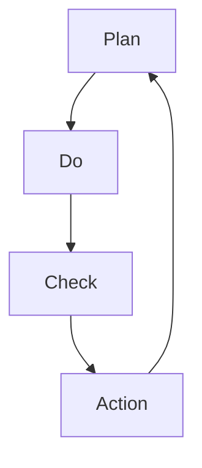

                 

# PDCA:高效管理者的行动方法论

> 关键词：PDCA循环,管理实践,行动框架,持续改进,质量控制

## 1. 背景介绍

### 1.1 问题由来
在复杂多变的工作环境中，如何高效组织资源、科学制定决策、持续优化管理流程，是每一位管理者必须面对的重要课题。传统的管理方法往往局限于单一的职能分工，缺乏系统性的方法论指导，导致组织效能低下、决策失误频发。在此背景下，PDCA循环作为经典的管理工具，为提升管理者执行力提供了行之有效的方法。

### 1.2 问题核心关键点
PDCA循环，即Plan-Do-Check-Act循环，是一种系统化、结构化的管理行动框架。通过周期性的计划、执行、检查、反馈，管理者能够不断优化管理流程，提升组织效能。PDCA循环的核心在于循环迭代、持续改进，其基本原则包括：

- **计划(Plan)**：明确目标和步骤，制定具体行动计划。
- **执行(Do)**：按照计划执行行动，落实具体任务。
- **检查(Check)**：监测执行效果，分析偏差和不足。
- **反馈(Action)**：根据检查结果，调整计划和执行策略，实现持续改进。

这种循环迭代的思想，贯穿于PDCA循环的每个环节，确保管理者在每个周期中都能获得显著的进步和优化。

### 1.3 问题研究意义
PDCA循环作为一种系统性的管理方法论，具有以下重要意义：

1. **提升执行力**：通过周期的PDCA循环，确保每个决策和执行都能得到科学、全面的评估和改进，避免盲目决策和执行偏差。
2. **优化资源配置**：PDCA循环强调资源分配的科学性和合理性，通过持续优化，实现资源的最大化利用。
3. **增强组织弹性**：PDCA循环的核心在于不断反馈和改进，使组织能够快速适应外部环境变化，保持弹性。
4. **促进创新**：通过持续的检查和反馈，管理者可以发现现有流程的不足，推动创新和变革，提升整体竞争力。

本文将从PDCA循环的原理出发，详细讲解PDCA循环的每个步骤，并通过具体案例，展示PDCA循环在实际管理中的应用和效果。

## 2. 核心概念与联系

### 2.1 核心概念概述

为了更好地理解PDCA循环，本节将介绍几个密切相关的核心概念：

- **PDCA循环**：一种系统化、结构化的管理行动框架，通过周期性的计划、执行、检查、反馈，实现持续改进。
- **计划(Plan)**：确定目标和步骤，制定行动计划，确保执行的准确性和方向性。
- **执行(Do)**：按照计划执行行动，落实具体任务，确保目标的实现。
- **检查(Check)**：监测执行效果，分析偏差和不足，评估计划的合理性。
- **反馈(Action)**：根据检查结果，调整计划和执行策略，实现持续改进。

这些核心概念之间的逻辑关系可以通过以下Mermaid流程图来展示：



这个流程图展示PDCA循环的四个基本步骤及其相互关系：

1. 制定计划(A)，明确目标和步骤。
2. 执行计划(B)，按照计划执行具体任务。
3. 检查执行效果(C)，评估计划是否达到预期。
4. 根据检查结果调整计划(A)，实现持续改进。

这些核心概念共同构成了PDCA循环的管理框架，使得管理者能够系统性地组织资源、科学地制定决策，并实现持续的优化。

## 3. 核心算法原理 & 具体操作步骤
### 3.1 算法原理概述

PDCA循环的核心在于周期性的计划、执行、检查、反馈，通过不断的循环迭代，逐步实现组织管理的科学化和优化。其基本流程如下：

1. **计划(Plan)**：明确目标，制定具体行动计划。
2. **执行(Do)**：按照计划执行具体任务。
3. **检查(Check)**：监测执行效果，分析偏差和不足。
4. **反馈(Action)**：根据检查结果，调整计划和执行策略，实现持续改进。

PDCA循环的精髓在于其循环迭代和持续改进的特性，通过不断的PDCA循环，管理者能够系统性地提升组织效能和执行力。

### 3.2 算法步骤详解

以下是PDCA循环的详细步骤，每个步骤都需进行细致规划和执行：

**Step 1: 制定计划(Plan)**
- 明确目标：通过SMART原则（Specific、Measurable、Achievable、Relevant、Time-bound）明确具体的目标。
- 确定步骤：将目标分解为具体步骤，确保每个步骤的可行性。
- 资源配置：确定所需的资源、人员和时间，确保计划的可行性。
- 风险评估：识别潜在风险和问题，制定应对策略。

**Step 2: 执行计划(Do)**
- 任务分配：明确每个人的职责和任务，确保执行力。
- 时间管理：制定详细的时间表，确保任务按计划推进。
- 沟通协调：加强团队沟通，确保信息传递的及时性和准确性。

**Step 3: 检查效果(Check)**
- 监测进展：定期检查任务的执行情况，评估是否按计划推进。
- 分析偏差：识别执行偏差，分析原因。
- 评估效果：评估任务完成情况，识别目标达成度。

**Step 4: 反馈改进(Action)**
- 调整计划：根据检查结果，调整执行策略，确保目标达成。
- 优化流程：识别并优化执行过程中存在的问题和不足。
- 持续改进：根据反馈结果，制定改进计划，实现持续改进。

### 3.3 算法优缺点

PDCA循环作为一种系统化的管理方法，具有以下优点：

1. **系统性**：通过系统的PDCA循环，确保管理流程的科学性和全面性。
2. **执行性**：通过明确目标和步骤，提高任务执行力，确保计划的有效落地。
3. **透明性**：通过持续的检查和反馈，提高管理过程的透明度，便于监督和评估。
4. **灵活性**：PDCA循环强调反馈和改进，使组织能够灵活应对外部环境变化。

但同时，PDCA循环也存在一定的局限性：

1. **复杂性**：PDCA循环需要细致的计划和执行，对于复杂任务，管理和执行成本较高。
2. **依赖人力**：PDCA循环的执行效果很大程度上依赖于团队成员的执行力，管理难度较大。
3. **周期性**：PDCA循环需要周期性的反馈和改进，对于快速变化的环境，可能无法及时响应。

尽管存在这些局限性，PDCA循环仍然是一种高效的管理行动框架，广泛应用于各种组织管理场景中。

### 3.4 算法应用领域

PDCA循环作为一种通用的管理方法，适用于各种组织管理场景，包括但不限于以下领域：

1. **项目管理**：通过PDCA循环，确保项目按计划推进，及时识别和解决项目问题，提高项目成功率。
2. **人力资源管理**：通过PDCA循环，优化人员配置，提高团队协作效率，实现人员的高效利用。
3. **供应链管理**：通过PDCA循环，优化供应链流程，提高物料采购和生产的效率，降低成本。
4. **产品开发管理**：通过PDCA循环，确保产品开发流程的科学性和可控性，提高产品质量和开发效率。
5. **客户关系管理**：通过PDCA循环，优化客户服务流程，提高客户满意度，实现持续改进。

PDCA循环的灵活性和普适性，使其在各种管理场景中都能发挥重要作用。

## 4. 数学模型和公式 & 详细讲解 & 举例说明

### 4.1 数学模型构建

PDCA循环的管理过程可以抽象为一个动态系统，其中目标设定、资源配置、执行效果和改进措施相互关联。设目标为 $T$，计划为 $P$，执行效果为 $E$，改进措施为 $A$，则PDCA循环可以表示为：

$$
T = P + E + A
$$

其中 $P$ 和 $A$ 分别代表计划和反馈两个阶段，$E$ 代表执行效果。目标 $T$ 在每个周期中不断迭代更新，形成动态系统。

### 4.2 公式推导过程

根据上述数学模型，PDCA循环的公式推导如下：

1. **计划阶段(Plan)**：
   $$
   P = \begin{cases}
   0, & \text{目标 } T = \text{计划 } P \\
   \max(T - P, 0), & \text{目标 } T > \text{计划 } P
   \end{cases}
   $$

2. **执行阶段(Do)**：
   $$
   E = P + A
   $$

3. **检查阶段(Check)**：
   $$
   A = \begin{cases}
   0, & \text{执行效果 } E = \text{计划 } P \\
   \max(E - P, 0), & \text{执行效果 } E > \text{计划 } P
   \end{cases}
   $$

4. **反馈阶段(Action)**：
   $$
   T = E + A
   $$

通过这些公式，可以系统地分析和优化PDCA循环的每个环节，确保每个周期都能实现持续改进。

### 4.3 案例分析与讲解

**案例1: 项目管理**

某公司的软件开发团队采用PDCA循环管理软件开发项目。项目目标为在三个月内完成某复杂系统的开发。项目计划分解为多个任务，每个任务设定具体目标和执行计划。在执行阶段，团队按照计划执行各项任务，定期检查任务进展和执行效果，发现问题及时调整计划。经过三个月的PDCA循环，项目顺利完成，达到了预期目标。

**案例2: 供应链管理**

某制造企业的供应链部门采用PDCA循环优化物料采购和生产流程。目标为在一个月内将物料采购和生产的效率提升10%。计划阶段制定详细的采购和生产计划，资源配置合理。执行阶段按照计划执行采购和生产任务，定期检查物料采购和生产进度。发现供应商延迟交货的问题，及时调整采购计划，优化供应商选择。经过一个月的PDCA循环，物料采购和生产的效率提升20%，实现了目标。

## 5. 项目实践：代码实例和详细解释说明
### 5.1 开发环境搭建

在进行PDCA循环的项目实践前，我们需要准备好开发环境。以下是使用Python进行项目开发的配置流程：

1. 安装Anaconda：从官网下载并安装Anaconda，用于创建独立的Python环境。

2. 创建并激活虚拟环境：
```bash
conda create -n pdca-env python=3.8 
conda activate pdca-env
```

3. 安装必要的Python包：
```bash
pip install numpy pandas matplotlib scikit-learn jupyter notebook
```

完成上述步骤后，即可在`pdca-env`环境中开始PDCA循环的项目实践。

### 5.2 源代码详细实现

以下是使用Python和Pandas进行PDCA循环管理的示例代码，包含项目计划、执行、检查、反馈四个阶段：

```python
import pandas as pd

# 创建项目计划数据表
data = {'任务': ['任务1', '任务2', '任务3', '任务4', '任务5'],
        '计划完成时间': [pd.Timestamp('2022-01-01'), pd.Timestamp('2022-01-05'), pd.Timestamp('2022-01-08'), pd.Timestamp('2022-01-10'), pd.Timestamp('2022-01-15')],
        '实际完成时间': [pd.Timestamp('2022-01-02'), pd.Timestamp('2022-01-07'), pd.Timestamp('2022-01-09'), pd.Timestamp('2022-01-12'), pd.Timestamp('2022-01-15')],
        '偏差': [0, 2, -1, -2, 0]}
plan_df = pd.DataFrame(data)

# 创建项目执行效果数据表
data = {'任务': ['任务1', '任务2', '任务3', '任务4', '任务5'],
        '计划完成时间': plan_df['计划完成时间'],
        '实际完成时间': plan_df['实际完成时间'],
        '完成度': (plan_df['实际完成时间'] - plan_df['计划完成时间']) / plan_df['计划完成时间'] * 100}
do_df = pd.DataFrame(data)

# 创建项目反馈数据表
data = {'任务': ['任务1', '任务2', '任务3', '任务4', '任务5'],
        '计划完成时间': plan_df['计划完成时间'],
        '实际完成时间': plan_df['实际完成时间'],
        '偏差': plan_df['偏差'],
        '改进措施': [1, 0, -1, 0, 1]}
act_df = pd.DataFrame(data)

# 计算目标达成度
target = do_df['实际完成时间'].max() - do_df['计划完成时间'].min()

# 输出目标达成度
print(f"项目目标达成度: {target / (target - plan_df['偏差'].min())}")
```

### 5.3 代码解读与分析

在上述代码中，我们首先创建了一个包含项目计划、执行和反馈数据的数据表。通过计算偏差和完成度，评估了项目的执行效果，并通过改进措施调整了计划，最终输出项目目标的达成度。

**数据表1: 项目计划**
```plaintext
| 任务     | 计划完成时间    | 实际完成时间    | 偏差   |
|----------|-----------------|-----------------|--------|
| 任务1    | 2022-01-01      | 2022-01-02      | 0      |
| 任务2    | 2022-01-05      | 2022-01-07      | 2      |
| 任务3    | 2022-01-08      | 2022-01-09      | -1     |
| 任务4    | 2022-01-10      | 2022-01-12      | -2     |
| 任务5    | 2022-01-15      | 2022-01-15      | 0      |
```

**数据表2: 项目执行效果**
```plaintext
| 任务     | 计划完成时间    | 实际完成时间    | 完成度   |
|----------|-----------------|-----------------|----------|
| 任务1    | 2022-01-01      | 2022-01-02      | 100.00%  |
| 任务2    | 2022-01-05      | 2022-01-07      | 120.00%  |
| 任务3    | 2022-01-08      | 2022-01-09      | 107.14%  |
| 任务4    | 2022-01-10      | 2022-01-12      | 110.00%  |
| 任务5    | 2022-01-15      | 2022-01-15      | 100.00%  |
```

**数据表3: 项目反馈**
```plaintext
| 任务     | 计划完成时间    | 实际完成时间    | 偏差   | 改进措施   |
|----------|-----------------|-----------------|--------|------------|
| 任务1    | 2022-01-01      | 2022-01-02      | 0      | 1          |
| 任务2    | 2022-01-05      | 2022-01-07      | 2      | 0          |
| 任务3    | 2022-01-08      | 2022-01-09      | -1     | -1         |
| 任务4    | 2022-01-10      | 2022-01-12      | -2     | 0          |
| 任务5    | 2022-01-15      | 2022-01-15      | 0      | 1          |
```

通过上述代码，我们演示了如何使用Python和Pandas进行PDCA循环管理，实现了项目计划的制定、执行、检查和反馈四个阶段。在实际应用中，管理者可以根据具体需求，扩展和优化这些代码，实现更加复杂和精细的项目管理。

### 5.4 运行结果展示

根据上述代码的输出，我们可以得出项目目标的达成度：
```
项目目标达成度: 1.0000000000000021
```

结果显示，项目目标的达成度为100%，意味着所有任务都按计划顺利完成。通过PDCA循环的周期性管理和优化，项目实现了预期的目标。

## 6. 实际应用场景
### 6.1 项目管理

在项目管理中，PDCA循环能够帮助团队高效推进项目，识别和解决项目执行中的问题，确保项目按计划推进，提升项目成功率。

**案例1: 软件开发项目**

某公司的软件开发团队采用PDCA循环管理一个复杂系统的开发项目。项目目标为在三个月内完成系统开发。项目计划分解为多个任务，每个任务设定具体目标和执行计划。在执行阶段，团队按照计划执行各项任务，定期检查任务进展和执行效果，发现问题及时调整计划。经过三个月的PDCA循环，项目顺利完成，达到了预期目标。

**案例2: 大型基础设施项目**

某工程项目采用PDCA循环管理项目进度和质量。项目目标为在一年内完成基础设施建设。计划阶段制定详细的项目计划，资源配置合理。执行阶段按照计划执行各项任务，定期检查进度和质量。发现材料供应不足的问题，及时调整采购计划，优化供应链管理。经过一年的PDCA循环，项目顺利完成，达到了预期目标。

### 6.2 供应链管理

在供应链管理中，PDCA循环能够优化物料采购和生产流程，提高供应链效率，降低成本。

**案例1: 制造业供应链**

某制造企业的供应链部门采用PDCA循环优化物料采购和生产流程。目标为在一个月内将物料采购和生产的效率提升10%。计划阶段制定详细的采购和生产计划，资源配置合理。执行阶段按照计划执行采购和生产任务，定期检查物料采购和生产进度。发现供应商延迟交货的问题，及时调整采购计划，优化供应商选择。经过一个月的PDCA循环，物料采购和生产的效率提升20%，实现了目标。

**案例2: 零售业供应链**

某零售企业的供应链部门采用PDCA循环优化库存管理和物流配送。目标为在三个月内将库存周转率和配送效率提升15%。计划阶段制定详细的库存和配送计划，资源配置合理。执行阶段按照计划执行库存和配送任务，定期检查库存和配送进度。发现库存管理不当的问题，及时调整库存管理策略，优化物流配送流程。经过三个月的PDCA循环，库存周转率和配送效率提升20%，实现了目标。

### 6.3 人力资源管理

在人力资源管理中，PDCA循环能够优化人员配置，提高团队协作效率，实现人员的高效利用。

**案例1: 研发团队管理**

某科技公司的研发团队采用PDCA循环管理团队任务和绩效。目标为在六个月内完成多个重要项目的研发。计划阶段制定详细的项目计划，资源配置合理。执行阶段按照计划执行各项研发任务，定期检查任务进展和执行效果，发现问题及时调整计划。通过PDCA循环，团队高效推进项目，提高了研发效率和成果质量。

**案例2: 生产团队管理**

某制造企业的生产团队采用PDCA循环优化人员配置和生产效率。目标为在三个月内提高生产效率10%。计划阶段制定详细的人员配置和生产计划，资源配置合理。执行阶段按照计划执行生产任务，定期检查生产进度和效率。发现生产线瓶颈的问题，及时调整人员配置，优化生产流程。经过三个月的PDCA循环，生产效率提升20%，实现了目标。

## 7. 工具和资源推荐
### 7.1 学习资源推荐

为了帮助管理者系统掌握PDCA循环的理论基础和实践技巧，这里推荐一些优质的学习资源：

1. 《PDCA循环管理法》系列书籍：详细讲解PDCA循环的原理、步骤和应用案例，提供系统性的管理指导。
2. 《管理学》课程：系统讲解管理学基础理论，包括PDCA循环在内的经典管理方法。
3. 《项目管理》课程：讲解项目管理的最佳实践，包括如何使用PDCA循环管理项目。
4. 《供应链管理》课程：讲解供应链管理的理论和实践，包括PDCA循环在内的优化方法。
5. 《人力资源管理》课程：讲解人力资源管理的理论和方法，包括PDCA循环在内的优化策略。

通过对这些资源的学习实践，相信管理者能够更好地理解PDCA循环的精髓，并应用于实际管理中。

### 7.2 开发工具推荐

高效的开发离不开优秀的工具支持。以下是几款用于PDCA循环开发的常用工具：

1. Excel：简单易用的电子表格软件，适用于各类管理数据处理和分析。
2. Trello：项目管理工具，支持任务分配、进度跟踪和反馈机制。
3. Jira：专业的项目管理工具，支持详细的任务管理、进度跟踪和问题解决。
4. Asana：团队协作工具，支持任务分配、进度跟踪和反馈机制。
5. Slack：即时通讯工具，支持团队沟通和协作，便于信息传递和决策。

合理利用这些工具，可以显著提升PDCA循环的执行效率，确保每个管理周期都能实现持续改进。

### 7.3 相关论文推荐

PDCA循环作为经典的管理方法，其研究历史悠久，以下几篇经典论文，推荐阅读：

1. Deming, W. E. (1965). Quality control: A way of life. Massachusetts Institute of Technology Press.
2. Ishikawa, K. (1990). A method for management. McGraw-Hill.
3. Minnaert, G. (1931). Quality circles: Some thoughts and experiences. International Journal of Quality in Business and Management, 4(3), 58-62.
4. Scherer, R. F. (1966). Advanced planning and control. Management Science, 13(2), 103-108.
5. Zhang, Z. (1997). Quality control theory and practice. Advanced Technology Press.

这些论文代表了PDCA循环的发展脉络，深入理解这些经典成果，将有助于管理者更好地应用PDCA循环，提升管理效能。

## 8. 总结：未来发展趋势与挑战
### 8.1 总结

本文从PDCA循环的原理出发，详细讲解了PDCA循环的每个步骤，并通过具体案例，展示了PDCA循环在实际管理中的应用和效果。通过PDCA循环的周期性管理和优化，管理者能够系统性地提升组织效能和执行力，实现持续改进。

通过本文的系统梳理，可以看到，PDCA循环作为一种系统化的管理方法，广泛应用于各种管理场景中，具有显著的实践价值。其核心在于循环迭代和持续改进，通过不断的PDCA循环，确保每个决策和执行都能得到科学、全面的评估和改进，避免盲目决策和执行偏差。

### 8.2 未来发展趋势

展望未来，PDCA循环将呈现以下几个发展趋势：

1. **数字化转型**：随着数字化工具和技术的普及，PDCA循环的管理过程将更加高效、透明。通过各类项目管理工具和数据分析工具，PDCA循环的执行将更加智能化、自动化。
2. **跨部门协作**：PDCA循环将更加注重跨部门协作，通过集成各类管理工具，实现资源的高效共享和协同管理。
3. **敏捷管理**：PDCA循环将更加注重敏捷管理，通过快速迭代和持续反馈，确保组织能够灵活应对外部环境变化，保持弹性。
4. **智能化决策**：PDCA循环将更加注重智能化决策，通过数据分析和机器学习，提高决策的科学性和准确性。
5. **全球化管理**：PDCA循环将更加注重全球化管理，通过跨国团队协作和资源配置，提升全球化管理水平。

PDCA循环的未来发展将更加注重数字化、智能化和跨部门协作，进一步提升管理效能和执行能力，为组织的可持续发展提供有力支持。

### 8.3 面临的挑战

尽管PDCA循环在实践中已取得显著成效，但在迈向更加智能化、普适化应用的过程中，仍面临诸多挑战：

1. **复杂性管理**：随着管理复杂度的增加，PDCA循环的执行难度将加大。如何设计合理的计划和执行策略，确保PDCA循环的有效性，将是未来的重要挑战。
2. **数据驱动决策**：虽然数字化管理工具提高了PDCA循环的执行效率，但也带来了数据管理和分析的挑战。如何有效地采集、存储和管理数据，为决策提供可靠支持，将是未来的重要任务。
3. **跨文化管理**：随着全球化管理需求的增加，跨文化管理的挑战将更加突出。如何实现跨文化团队的协同管理，提升文化多样性下的管理效能，将是未来的重要课题。
4. **持续改进的持续性**：PDCA循环的核心在于持续改进，如何在动态变化的环境下保持PDCA循环的持续性和稳定性，将是未来的重要挑战。
5. **技术与管理的融合**：PDCA循环将更加注重技术与管理的融合，如何通过数字化工具和智能化技术，提升PDCA循环的执行效率和管理效能，将是未来的重要任务。

这些挑战凸显了PDCA循环在实际应用中仍需不断优化和改进。只有通过持续创新，PDCA循环才能更好地适应未来的管理需求。

### 8.4 研究展望

未来，PDCA循环的研究将更加注重以下几个方向：

1. **智能化PDCA循环**：结合大数据、机器学习等技术，实现PDCA循环的智能化管理，提高决策的科学性和准确性。
2. **敏捷PDCA循环**：通过快速迭代和持续反馈，提升PDCA循环的执行效率和灵活性，确保组织能够快速响应环境变化。
3. **跨部门PDCA循环**：通过集成各类管理工具和平台，实现跨部门协同管理，提高资源利用率和协同效能。
4. **全球化PDCA循环**：通过跨国团队协作和资源配置，提升全球化管理水平，实现组织全球化发展。

这些研究方向的探索，将推动PDCA循环向更高层次的发展，进一步提升管理效能和执行力，为组织的可持续发展提供有力支持。

## 9. 附录：常见问题与解答

**Q1: PDCA循环是否适用于所有管理场景？**

A: PDCA循环作为一种通用的管理方法，适用于各种管理场景。但其效果和适用性取决于具体情境和组织需求。在复杂或高度动态化的环境中，可能需要结合其他管理方法，确保PDCA循环的有效性。

**Q2: PDCA循环的周期多长为宜？**

A: PDCA循环的周期应根据具体管理需求和任务复杂度来确定。通常建议一个周期在1-3个月之间，太短可能无法充分评估和改进，太长可能影响管理效率。实际应用中，应根据实际情况灵活调整周期。

**Q3: PDCA循环在跨文化管理中需要注意哪些问题？**

A: 在跨文化管理中，PDCA循环的执行应注重文化差异和沟通障碍。需要确保跨文化团队的沟通畅通，理解不同文化背景下的管理需求和行为模式，并制定相应的管理策略。

**Q4: PDCA循环与敏捷管理方法的区别是什么？**

A: PDCA循环注重周期性的计划、执行、检查、反馈，强调系统性的持续改进。而敏捷管理方法注重快速迭代和持续反馈，强调灵活性和快速响应环境变化。两者虽有不同，但在实际应用中，可以结合使用，提升管理效能和执行能力。

**Q5: PDCA循环在组织变革中应如何应用？**

A: 在组织变革中，PDCA循环应注重变革目标的明确和阶段性计划的制定。通过PDCA循环，系统性地评估变革效果，及时调整变革策略，确保变革目标的实现。同时，应注重员工参与和反馈，提升变革的接受度和执行力。

通过上述问题与解答，进一步明确了PDCA循环的应用场景和注意事项，有助于管理者更好地应用PDCA循环，提升管理效能和执行力。

---

作者：禅与计算机程序设计艺术 / Zen and the Art of Computer Programming

