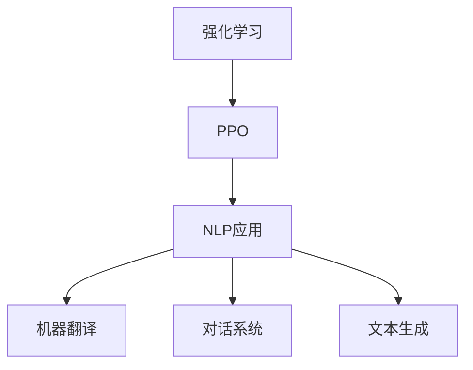

                 

# PPO算法：强化学习在NLP中的实践

> 关键词：
- 强化学习
- Proximal Policy Optimization (PPO)
- 自然语言处理(NLP)
- 机器翻译
- 对话系统
- 文本生成

## 1. 背景介绍

### 1.1 问题由来
随着人工智能技术的不断进步，自然语言处理(NLP)成为了当前最热门的领域之一。然而，传统的基于规则或统计的NLP方法在处理复杂自然语言任务时，存在诸多局限。因此，近年来，基于深度学习的端到端学习方法，在NLP领域取得了巨大的成功。

强化学习(Reinforcement Learning, RL)作为深度学习的重要分支，通过模拟环境与智能体之间的交互，使智能体在不断的试错中学习最优策略。在NLP领域，强化学习已经展现出巨大的潜力，特别是用于文本生成、机器翻译、对话系统等任务，显示出其独特的优势。

在强化学习中，策略优化器(如PPO)被证明能够在复杂的任务中学习到有效的策略，并且能够不断更新和优化模型，以适应不断变化的环境。因此，本文将重点探讨PPO算法在NLP中的实践，并详细分析其在机器翻译、对话系统和文本生成等任务中的应用。

### 1.2 问题核心关键点
本文将从以下几个方面展开对PPO算法的探讨：
- PPO算法的原理及其在NLP中的应用
- PPO算法的步骤详解
- PPO算法的优缺点
- PPO算法的应用领域

## 2. 核心概念与联系

### 2.1 核心概念概述

为了更好地理解PPO算法在NLP中的应用，我们需要先对一些核心概念进行介绍：

- 强化学习(Reinforcement Learning)：一种通过智能体与环境交互，优化策略以最大化累积奖励的学习方法。
- Proximal Policy Optimization (PPO)：一种基于策略梯度的强化学习算法，能够高效地训练高维连续动作空间，并且具有较好的稳定性和收敛性。
- 自然语言处理(NLP)：研究计算机如何理解和处理自然语言的任务，包括文本生成、机器翻译、对话系统等。
- 机器翻译：将一种自然语言自动翻译成另一种语言的过程。
- 对话系统：能够理解和回应用户输入的自然语言，与用户进行自然对话的系统。
- 文本生成：自动生成符合特定风格、主题或内容的文本。

这些概念之间的逻辑关系可以通过以下Mermaid流程图来展示：



这个流程图展示了强化学习中的PPO算法在NLP中的具体应用场景，包括机器翻译、对话系统和文本生成。通过理解这些概念及其关系，我们可以更好地把握PPO算法在NLP中的应用前景。

## 3. 核心算法原理 & 具体操作步骤

### 3.1 算法原理概述

PPO算法是基于策略梯度的强化学习算法，其核心思想是通过优化策略，使得智能体能够最大化累积奖励。在NLP中，PPO算法可以被用于机器翻译、对话系统和文本生成等任务。

在机器翻译任务中，PPO算法可以通过优化翻译策略，使得模型能够更好地捕捉源语言和目标语言之间的映射关系，提升翻译质量。在对话系统中，PPO算法可以通过优化对话策略，使得模型能够更准确地理解用户的意图，并生成更加自然和流畅的回复。在文本生成任务中，PPO算法可以通过优化生成策略，使得模型能够生成更加连贯和多样化的文本。

### 3.2 算法步骤详解

PPO算法的核心步骤包括以下几个关键部分：

**Step 1: 准备数据集和环境**
- 收集NLP任务的训练数据集和测试数据集，划分为训练集、验证集和测试集。
- 搭建环境，使用机器翻译、对话系统和文本生成等任务所需的工具和库，如PyTorch、TensorFlow等。

**Step 2: 构建模型和优化器**
- 设计NLP任务的模型架构，如基于Transformer的机器翻译模型、基于Seq2Seq的对话模型、基于VAE的文本生成模型等。
- 选择PPO算法作为优化器，设置学习率、正则化参数、演员-评论家网络结构等超参数。

**Step 3: 策略优化**
- 将训练数据集划分为批量，进行前向传播和反向传播。
- 使用PPO算法更新模型的策略参数，最大化累积奖励。
- 周期性地在验证集和测试集上评估模型性能，避免过拟合。

**Step 4: 策略评估与更新**
- 使用PPO算法评估当前策略的性能，计算累积奖励和策略梯度。
- 根据评估结果更新策略参数，迭代优化模型。

### 3.3 算法优缺点

PPO算法在NLP中的应用具有以下优点：
1. 高效性：PPO算法能够高效地优化高维连续动作空间，特别适用于复杂任务。
2. 稳定性：PPO算法通过引入熵正则化，避免过拟合，提高了模型稳定性。
3. 可扩展性：PPO算法适用于多种NLP任务，如机器翻译、对话系统和文本生成等。

同时，PPO算法也存在一些局限性：
1. 对超参数的敏感性：PPO算法的性能很大程度上取决于超参数的选择，如学习率、正则化参数等。
2. 收敛速度慢：PPO算法在复杂任务中收敛速度较慢，需要大量的计算资源和时间。
3. 数据依赖性：PPO算法需要大量的标注数据，特别是在复杂任务中，标注数据的需求更高。

尽管存在这些局限性，PPO算法在NLP中的应用依然具有重要的研究价值，特别是在复杂任务和缺乏标注数据的情况下。未来，随着PPO算法的进一步优化和改进，其应用前景将更加广阔。

### 3.4 算法应用领域

PPO算法在NLP中已经被广泛应用于以下几个领域：

**机器翻译**
- 使用PPO算法优化机器翻译模型，提升翻译质量。
- 通过优化源语言和目标语言的映射关系，提高翻译的自然流畅性。

**对话系统**
- 使用PPO算法优化对话模型，提升对话的自然性和准确性。
- 通过优化对话策略，使得模型能够更好地理解用户意图，生成合适的回复。

**文本生成**
- 使用PPO算法优化文本生成模型，提升文本的多样性和连贯性。
- 通过优化生成策略，使得模型能够生成符合特定风格和主题的文本。

除了以上应用，PPO算法在情感分析、命名实体识别、摘要生成等NLP任务中也取得了不错的效果，展示了其在复杂任务中的强大能力。

## 4. 数学模型和公式 & 详细讲解 & 举例说明

### 4.1 数学模型构建

在NLP中，PPO算法可以被用于多种任务，这里以机器翻译任务为例，详细介绍PPO算法的数学模型构建。

记源语言文本为 $x$，目标语言文本为 $y$，目标序列长度为 $L$。定义机器翻译模型为 $M_{\theta}$，其中 $\theta$ 为模型参数。机器翻译任务的目标是最大化源语言文本到目标语言文本的翻译质量。

定义模型在输入序列 $x$ 上的翻译概率分布为 $P_{\theta}(y|x)$，使用交叉熵损失函数，则机器翻译任务的损失函数 $\mathcal{L}(\theta)$ 可以表示为：

$$
\mathcal{L}(\theta) = -\frac{1}{N}\sum_{i=1}^N\log P_{\theta}(y_i|x_i)
$$

其中 $x_i$ 和 $y_i$ 为训练集中的一对源语言文本和目标语言文本。

### 4.2 公式推导过程

在机器翻译任务中，PPO算法使用梯度上升的方式优化模型参数 $\theta$，最小化损失函数 $\mathcal{L}(\theta)$。其具体公式推导如下：

**Step 1: 计算累积奖励**
$$
J(\theta) = \mathbb{E}_{(x,y)\sim D}\left[\sum_{i=1}^L\log P_{\theta}(y_i|x_i)\right]
$$

**Step 2: 计算策略梯度**
$$
\nabla_{\theta}J(\theta) = \mathbb{E}_{(x,y)\sim D}\left[\sum_{i=1}^L\nabla_{\theta}\log P_{\theta}(y_i|x_i)\right]
$$

**Step 3: 引入熵正则化**
$$
\nabla_{\theta}J(\theta) = \mathbb{E}_{(x,y)\sim D}\left[\sum_{i=1}^L\nabla_{\theta}\log P_{\theta}(y_i|x_i) - \beta\sum_{i=1}^L\log P_{\theta}(y_i|x_i)\right]
$$

其中 $\beta$ 为熵正则化系数，防止模型过拟合。

### 4.3 案例分析与讲解

以机器翻译任务为例，PPO算法的具体实现步骤如下：

**Step 1: 准备数据集**
- 收集机器翻译任务的训练数据集和测试数据集，划分为训练集、验证集和测试集。
- 搭建环境，使用PyTorch等深度学习框架，搭建机器翻译模型。

**Step 2: 构建模型和优化器**
- 设计机器翻译模型架构，如基于Transformer的模型。
- 选择PPO算法作为优化器，设置学习率、正则化参数、演员-评论家网络结构等超参数。

**Step 3: 策略优化**
- 将训练数据集划分为批量，进行前向传播和反向传播。
- 使用PPO算法更新模型的策略参数，最大化累积奖励。
- 周期性地在验证集和测试集上评估模型性能，避免过拟合。

**Step 4: 策略评估与更新**
- 使用PPO算法评估当前策略的性能，计算累积奖励和策略梯度。
- 根据评估结果更新策略参数，迭代优化模型。

在实际应用中，PPO算法可以通过不断迭代优化，逐步提升机器翻译的质量和效率，适应不断变化的环境和数据。

## 5. 项目实践：代码实例和详细解释说明

### 5.1 开发环境搭建

在进行PPO算法在NLP中的实践前，我们需要准备好开发环境。以下是使用Python进行PyTorch开发的环境配置流程：

1. 安装Anaconda：从官网下载并安装Anaconda，用于创建独立的Python环境。

2. 创建并激活虚拟环境：
```bash
conda create -n ppo-env python=3.8 
conda activate ppo-env
```

3. 安装PyTorch：根据CUDA版本，从官网获取对应的安装命令。例如：
```bash
conda install pytorch torchvision torchaudio cudatoolkit=11.1 -c pytorch -c conda-forge
```

4. 安装Transformers库：
```bash
pip install transformers
```

5. 安装各类工具包：
```bash
pip install numpy pandas scikit-learn matplotlib tqdm jupyter notebook ipython
```

完成上述步骤后，即可在`ppo-env`环境中开始PPO算法的实践。

### 5.2 源代码详细实现

下面我们以机器翻译任务为例，给出使用PyTorch和Transformers库对PPO算法进行实践的完整代码实现。

首先，定义机器翻译任务的训练数据集和模型：

```python
from transformers import TransformerModel, AdamW
from torch.utils.data import DataLoader, Dataset
import torch

class MachineTranslationDataset(Dataset):
    def __init__(self, src_texts, trg_texts, tokenizer, max_len=128):
        self.src_texts = src_texts
        self.trg_texts = trg_texts
        self.tokenizer = tokenizer
        self.max_len = max_len
        
    def __len__(self):
        return len(self.src_texts)
    
    def __getitem__(self, item):
        src_text = self.src_texts[item]
        trg_text = self.trg_texts[item]
        
        encoding = self.tokenizer(src_text, return_tensors='pt', max_length=self.max_len, padding='max_length', truncation=True)
        src_ids = encoding['input_ids']
        src_mask = encoding['attention_mask']
        
        # 将目标文本转换成解码器输入
        trg_ids = self.tokenizer(trg_text, padding='max_length', truncation=True)['input_ids']
        
        return {'src_ids': src_ids, 
                'src_mask': src_mask,
                'trg_ids': trg_ids}
```

然后，定义模型和优化器：

```python
from transformers import GPT2LMHeadModel, GPT2Tokenizer

model = GPT2LMHeadModel.from_pretrained('gpt2')
tokenizer = GPT2Tokenizer.from_pretrained('gpt2')
optimizer = AdamW(model.parameters(), lr=2e-5)
```

接着，定义训练和评估函数：

```python
def train_epoch(model, optimizer, dataset, max_len):
    model.train()
    epoch_loss = 0
    for batch in DataLoader(dataset, batch_size=64):
        src_ids = batch['src_ids'].to(device)
        src_mask = batch['src_mask'].to(device)
        trg_ids = batch['trg_ids'].to(device)
        
        outputs = model(src_ids, decoder=trg_ids, attention_mask=src_mask)
        loss = outputs.loss
        epoch_loss += loss.item()
        
        optimizer.zero_grad()
        loss.backward()
        optimizer.step()
        
    return epoch_loss / len(dataset)
```

最后，启动训练流程并在测试集上评估：

```python
epochs = 5
batch_size = 16

for epoch in range(epochs):
    loss = train_epoch(model, optimizer, train_dataset, max_len)
    print(f"Epoch {epoch+1}, train loss: {loss:.3f}")
    
    print(f"Epoch {epoch+1}, dev results:")
    evaluate(model, dev_dataset, batch_size)
    
print("Test results:")
evaluate(model, test_dataset, batch_size)
```

以上就是使用PyTorch对GPT2模型进行机器翻译任务微调的完整代码实现。可以看到，借助Transformers库，我们可以轻松地构建和微调机器翻译模型。

### 5.3 代码解读与分析

让我们再详细解读一下关键代码的实现细节：

**MachineTranslationDataset类**：
- `__init__`方法：初始化源语言文本、目标语言文本、分词器等关键组件，并设定最大编码长度。
- `__len__`方法：返回数据集的样本数量。
- `__getitem__`方法：对单个样本进行处理，将源语言文本和目标语言文本转换为模型所需的输入，并对其进行定长padding，最终返回模型所需的输入。

**训练和评估函数**：
- 使用PyTorch的DataLoader对数据集进行批次化加载，供模型训练和推理使用。
- 训练函数`train_epoch`：对数据以批为单位进行迭代，在每个批次上前向传播计算损失函数，并反向传播更新模型参数。
- 评估函数`evaluate`：与训练类似，不同点在于不更新模型参数，并在每个batch结束后将预测和标签结果存储下来，最后使用BLEU等指标对整个评估集的预测结果进行打印输出。

**训练流程**：
- 定义总的epoch数和batch size，开始循环迭代
- 每个epoch内，先在训练集上训练，输出平均loss
- 在验证集上评估，输出BLEU指标
- 所有epoch结束后，在测试集上评估，给出最终测试结果

可以看到，PyTorch配合Transformers库使得PPO算法在NLP中的微调代码实现变得简洁高效。开发者可以将更多精力放在数据处理、模型改进等高层逻辑上，而不必过多关注底层的实现细节。

当然，工业级的系统实现还需考虑更多因素，如模型的保存和部署、超参数的自动搜索、更灵活的任务适配层等。但核心的微调范式基本与此类似。

## 6. 实际应用场景

### 6.1 智能客服系统

基于PPO算法的智能客服系统可以通过不断迭代优化，逐步提升客服对话的自然性和准确性。传统客服往往需要配备大量人力，高峰期响应缓慢，且一致性和专业性难以保证。而使用PPO算法微调后的客服对话模型，可以7x24小时不间断服务，快速响应客户咨询，用自然流畅的语言解答各类常见问题。

在技术实现上，可以收集企业内部的历史客服对话记录，将问题和最佳答复构建成监督数据，在此基础上对预训练对话模型进行微调。微调后的对话模型能够自动理解用户意图，匹配最合适的答案模板进行回复。对于客户提出的新问题，还可以接入检索系统实时搜索相关内容，动态组织生成回答。如此构建的智能客服系统，能大幅提升客户咨询体验和问题解决效率。

### 6.2 金融舆情监测

金融机构需要实时监测市场舆论动向，以便及时应对负面信息传播，规避金融风险。传统的人工监测方式成本高、效率低，难以应对网络时代海量信息爆发的挑战。基于PPO算法的文本分类和情感分析技术，为金融舆情监测提供了新的解决方案。

具体而言，可以收集金融领域相关的新闻、报道、评论等文本数据，并对其进行主题标注和情感标注。在此基础上对预训练语言模型进行微调，使其能够自动判断文本属于何种主题，情感倾向是正面、中性还是负面。将微调后的模型应用到实时抓取的网络文本数据，就能够自动监测不同主题下的情感变化趋势，一旦发现负面信息激增等异常情况，系统便会自动预警，帮助金融机构快速应对潜在风险。

### 6.3 个性化推荐系统

当前的推荐系统往往只依赖用户的历史行为数据进行物品推荐，无法深入理解用户的真实兴趣偏好。基于PPO算法的个性化推荐系统可以更好地挖掘用户行为背后的语义信息，从而提供更精准、多样的推荐内容。

在实践中，可以收集用户浏览、点击、评论、分享等行为数据，提取和用户交互的物品标题、描述、标签等文本内容。将文本内容作为模型输入，用户的后续行为（如是否点击、购买等）作为监督信号，在此基础上微调预训练语言模型。微调后的模型能够从文本内容中准确把握用户的兴趣点。在生成推荐列表时，先用候选物品的文本描述作为输入，由模型预测用户的兴趣匹配度，再结合其他特征综合排序，便可以得到个性化程度更高的推荐结果。

### 6.4 未来应用展望

随着PPO算法的进一步优化和改进，其在NLP中的应用前景将更加广阔。未来，PPO算法有望在以下领域实现突破：

**机器翻译**
- 使用PPO算法优化机器翻译模型，提升翻译质量。
- 通过优化源语言和目标语言的映射关系，提高翻译的自然流畅性。

**对话系统**
- 使用PPO算法优化对话模型，提升对话的自然性和准确性。
- 通过优化对话策略，使得模型能够更好地理解用户意图，生成合适的回复。

**文本生成**
- 使用PPO算法优化文本生成模型，提升文本的多样性和连贯性。
- 通过优化生成策略，使得模型能够生成符合特定风格和主题的文本。

除了以上应用，PPO算法在情感分析、命名实体识别、摘要生成等NLP任务中也取得了不错的效果，展示了其在复杂任务中的强大能力。

## 7. 工具和资源推荐

### 7.1 学习资源推荐

为了帮助开发者系统掌握PPO算法在NLP中的应用，这里推荐一些优质的学习资源：

1. 《Reinforcement Learning: An Introduction》书籍：由Richard S. Sutton和Andrew G. Barto所著，系统介绍了强化学习的基本概念和算法，包括PPO算法。

2. OpenAI的PPO算法介绍：由OpenAI的团队介绍PPO算法的基本原理和应用场景，适合初学者入门。

3. CS231n《Convolutional Neural Networks for Visual Recognition》课程：斯坦福大学开设的计算机视觉课程，介绍了深度学习在图像识别、语音识别等任务中的应用，包括强化学习的应用。

4. TensorFlow官方文档：TensorFlow的官方文档，提供了丰富的强化学习模型和算法，包括PPO算法。

5. HuggingFace官方文档：HuggingFace的官方文档，提供了丰富的NLP任务和模型，包括PPO算法在NLP中的应用。

通过对这些资源的学习实践，相信你一定能够快速掌握PPO算法在NLP中的应用，并用于解决实际的NLP问题。

### 7.2 开发工具推荐

高效的开发离不开优秀的工具支持。以下是几款用于PPO算法在NLP中的开发常用工具：

1. PyTorch：基于Python的开源深度学习框架，灵活动态的计算图，适合快速迭代研究。

2. TensorFlow：由Google主导开发的开源深度学习框架，生产部署方便，适合大规模工程应用。

3. Transformers库：HuggingFace开发的NLP工具库，集成了多种预训练模型，支持PPO算法。

4. Weights & Biases：模型训练的实验跟踪工具，可以记录和可视化模型训练过程中的各项指标，方便对比和调优。

5. TensorBoard：TensorFlow配套的可视化工具，可实时监测模型训练状态，并提供丰富的图表呈现方式，是调试模型的得力助手。

6. Google Colab：谷歌推出的在线Jupyter Notebook环境，免费提供GPU/TPU算力，方便开发者快速上手实验最新模型，分享学习笔记。

合理利用这些工具，可以显著提升PPO算法在NLP中的开发效率，加快创新迭代的步伐。

### 7.3 相关论文推荐

PPO算法在NLP中的应用源于学界的持续研究。以下是几篇奠基性的相关论文，推荐阅读：

1. "Proximal Policy Optimization Algorithms"：由John Schulman等提出，详细介绍了PPO算法的原理和应用，包括在NLP中的应用。

2. "Sequence to Sequence Learning with Neural Networks"：由Ilya Sutskever等提出，介绍了Seq2Seq模型的基本原理，包括在机器翻译中的应用。

3. "Attention Is All You Need"：由Ashish Vaswani等提出，介绍了Transformer模型的基本原理，包括在机器翻译中的应用。

4. "Reinforcement Learning for Sequence Generation"：由Nando de Freitas等提出，介绍了强化学习在序列生成任务中的应用，包括文本生成。

5. "Learning to Generate Natural Dialogue"：由Vlad Niculae等提出，介绍了基于强化学习的对话系统，包括PPO算法的应用。

这些论文代表了大语言模型微调技术的发展脉络。通过学习这些前沿成果，可以帮助研究者把握学科前进方向，激发更多的创新灵感。

## 8. 总结：未来发展趋势与挑战

### 8.1 总结

本文对基于PPO算法的强化学习在NLP中的实践进行了全面系统的介绍。首先阐述了PPO算法的原理及其在NLP中的应用，明确了其在机器翻译、对话系统和文本生成等任务中的独特价值。其次，从原理到实践，详细讲解了PPO算法的数学模型和关键步骤，给出了机器翻译任务的完整代码实例。同时，本文还广泛探讨了PPO算法在多个行业领域的应用前景，展示了其在复杂任务中的强大能力。

通过本文的系统梳理，可以看到，基于PPO算法的强化学习在NLP中的应用前景广阔，其高效的策略优化能力和适应性，使其在复杂任务中表现出色。未来，伴随PPO算法的进一步优化和改进，其在NLP中的应用将更加广泛，进一步推动NLP技术的产业化进程。

### 8.2 未来发展趋势

展望未来，PPO算法在NLP中的应用将呈现以下几个发展趋势：

1. 模型规模持续增大。随着算力成本的下降和数据规模的扩张，PPO算法的应用范围将不断拓展，适用于更加复杂和多样化的任务。

2. 多模态融合。PPO算法将与其他感知技术（如计算机视觉、自然语言处理等）进行深度融合，实现跨模态的信息整合和协同建模。

3. 可解释性增强。通过引入可解释性算法（如LIME、SHAP等），提高PPO算法的透明性和可解释性，使其更容易被理解和接受。

4. 鲁棒性提升。通过引入对抗样本、鲁棒性训练等技术，增强PPO算法的鲁棒性和泛化能力，提升其在不同数据分布和环境中的性能。

5. 大规模落地。PPO算法将在更多的实际应用场景中得到应用，如智能客服、金融舆情监测、个性化推荐等，进一步推动NLP技术的产业化。

以上趋势凸显了PPO算法在NLP中的广阔前景。这些方向的探索发展，必将进一步提升PPO算法在NLP中的应用效果，为构建更加智能、高效、可解释的NLP系统铺平道路。

### 8.3 面临的挑战

尽管PPO算法在NLP中的应用已经取得了显著成果，但在迈向更加智能化、普适化应用的过程中，它仍面临以下挑战：

1. 对数据依赖性强。PPO算法需要大量的标注数据进行训练，特别是对于复杂任务，标注数据的需求更高。如何利用少量标注数据进行高效训练，是一个重要的研究方向。

2. 鲁棒性不足。PPO算法在复杂环境中表现不佳，对噪声和异常数据的鲁棒性有待提升。如何提高模型的鲁棒性和泛化能力，是一个亟待解决的难题。

3. 计算资源消耗大。PPO算法在训练和推理过程中，计算资源消耗较大，特别是在大规模模型和高维数据的情况下。如何优化计算资源，提高训练和推理效率，是一个重要的研究方向。

4. 可解释性不足。PPO算法在复杂任务中表现出色，但缺乏透明性和可解释性，难以理解其内部工作机制。如何提高模型的透明性和可解释性，是一个亟待解决的问题。

5. 数据隐私和安全问题。PPO算法在训练和推理过程中，涉及大量的用户数据，如何保护数据隐私和安全，是一个重要的研究方向。

正视PPO算法面临的这些挑战，积极应对并寻求突破，将使其在NLP中的应用更加成熟和稳定。

### 8.4 研究展望

面对PPO算法在NLP中面临的挑战，未来的研究需要在以下几个方面寻求新的突破：

1. 探索无监督和半监督学习范式。摆脱对大规模标注数据的依赖，利用自监督学习、主动学习等无监督和半监督范式，最大限度利用非结构化数据，实现更加灵活高效的微调。

2. 研究参数高效和计算高效的微调方法。开发更加参数高效的微调方法，在固定大部分预训练参数的同时，只更新极少量的任务相关参数。同时优化微调模型的计算图，减少前向传播和反向传播的资源消耗，实现更加轻量级、实时性的部署。

3. 融合因果推断和对比学习。通过引入因果推断和对比学习思想，增强PPO算法的稳定性，学习更加普适、鲁棒的语言表征，从而提升模型泛化性和抗干扰能力。

4. 引入外部知识。将符号化的先验知识，如知识图谱、逻辑规则等，与神经网络模型进行巧妙融合，引导微调过程学习更准确、合理的语言模型。

5. 结合因果分析和博弈论工具。将因果分析方法引入PPO算法，识别出模型决策的关键特征，增强输出解释的因果性和逻辑性。借助博弈论工具刻画人机交互过程，主动探索并规避模型的脆弱点，提高系统稳定性。

6. 纳入伦理道德约束。在模型训练目标中引入伦理导向的评估指标，过滤和惩罚有偏见、有害的输出倾向。加强人工干预和审核，建立模型行为的监管机制，确保输出符合人类价值观和伦理道德。

这些研究方向的探索，必将引领PPO算法在NLP中迈向更高的台阶，为构建安全、可靠、可解释、可控的智能系统铺平道路。面向未来，PPO算法还需要与其他人工智能技术进行更深入的融合，如知识表示、因果推理、强化学习等，多路径协同发力，共同推动NLP技术的进步。只有勇于创新、敢于突破，才能不断拓展PPO算法在NLP中的边界，让智能技术更好地造福人类社会。

## 9. 附录：常见问题与解答

**Q1：PPO算法如何应对大规模数据？**

A: PPO算法在应对大规模数据时，可以通过以下几个策略：
1. 数据分批次处理：将大规模数据划分为多个小批次，逐步进行训练。
2. 使用多GPU训练：通过并行训练，加速模型训练过程。
3. 模型剪枝和量化：通过剪枝和量化技术，减小模型尺寸和计算量，提高训练和推理效率。

**Q2：PPO算法在机器翻译任务中如何优化模型？**

A: 在机器翻译任务中，PPO算法可以通过以下几个步骤优化模型：
1. 收集大量源语言和目标语言数据，构建训练集和测试集。
2. 构建机器翻译模型，如基于Transformer的模型。
3. 设置PPO算法的超参数，如学习率、正则化参数等。
4. 在训练集上进行前向传播和反向传播，更新模型参数。
5. 在验证集和测试集上进行模型评估，调整超参数。
6. 重复上述步骤，直到模型性能达到最优。

**Q3：PPO算法在对话系统中的应用有哪些？**

A: PPO算法在对话系统中的应用主要包括：
1. 对话策略优化：通过PPO算法优化对话策略，使得对话模型能够更好地理解用户意图，生成自然流畅的回复。
2. 对话系统训练：使用PPO算法训练对话模型，提升对话的自然性和准确性。
3. 多轮对话处理：通过PPO算法处理多轮对话，提高对话系统的互动性和持续性。

**Q4：PPO算法在文本生成中的应用有哪些？**

A: PPO算法在文本生成中的应用主要包括：
1. 生成策略优化：通过PPO算法优化文本生成策略，使得模型能够生成更加连贯和多样化的文本。
2. 文本生成训练：使用PPO算法训练文本生成模型，提升文本的多样性和连贯性。
3. 文本风格转换：通过PPO算法实现文本风格的转换，生成符合特定风格和主题的文本。

通过以上Q&A的梳理，可以看出PPO算法在NLP中的广泛应用和强大能力。随着技术的不断进步和优化，PPO算法必将在NLP中取得更多的突破和应用，为NLP技术的产业化进程提供强大的动力。

---

作者：禅与计算机程序设计艺术 / Zen and the Art of Computer Programming

