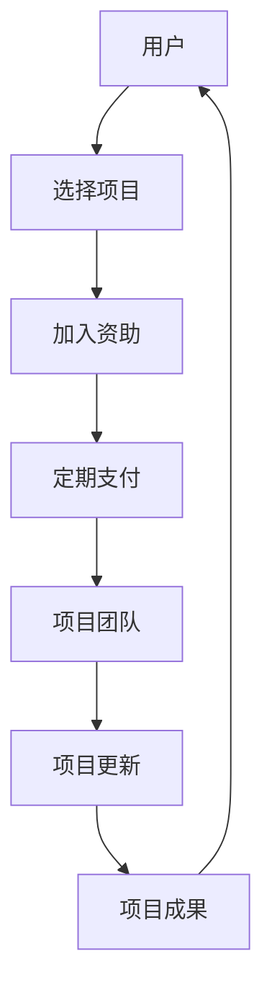

                 

# Patreon平台：开源项目的众筹策略

## 1. 背景介绍

Patreon是一个深受开发者和艺术家欢迎的众筹平台，它允许用户通过小额定期支付来支持他们喜欢的项目，同时获得项目最新的更新和成果。在传统的开源项目资助模式中，开发者通常依赖于偶尔的捐赠或者一次性的大额资金，这使得项目往往无法维持长期稳定发展。Patreon为开源项目的资助提供了另一种模式，即通过小额定期支付的形式，保证项目开发者的稳定收入，使项目能够持续运作。

本文将深入探讨Patreon平台对于开源项目的资助模式，分析其优缺点，并讨论如何将其有效应用于开源项目，帮助项目实现可持续性发展。

## 2. 核心概念与联系

### 2.1 核心概念概述

在探讨Patreon平台的资助模式前，我们先简要介绍一些关键概念：

- **Patreon平台**：一个基于订阅的众筹平台，用户可以为喜欢的项目定期支付小额费用，同时获得项目更新和特权。
- **开源项目**：源代码公开，允许任何人修改和分发，鼓励共享和合作的项目。
- **众筹**：一种通过互联网平台，为创意项目筹集资金的模式，支持者通过购买项目相关的商品或服务来获得回报。
- **订阅模型**：基于定期支付的商业模式，用户定期支付固定费用以获得持续的价值和服务。

这些概念相互联系，共同构成了Patreon平台支持开源项目的资助模式。

### 2.2 核心概念原理和架构的 Mermaid 流程图



**解释**：
- A: 用户通过Patreon平台选择一个开源项目。
- B: 用户决定是否加入项目的资助。
- C: 用户开始定期支付费用。
- D: 项目团队定期收到用户支付的资金。
- E: 项目团队根据资助收入进行开发和更新。
- F: 项目团队发布更新内容。
- G: 用户接收更新内容并继续支持项目。

## 3. 核心算法原理 & 具体操作步骤

### 3.1 算法原理概述

Patreon平台的资助模式基于订阅模型，其核心原理是利用小额定期支付的形式，使开源项目获得稳定的资助收入，从而支持项目持续进行。以下是该模型的算法原理概述：

1. **用户选择项目**：用户登录Patreon平台，浏览不同的开源项目，并选择一个或多个项目进行资助。
2. **定期支付**：用户选择一个支付频率（如每月或每季度）和支付金额。支付费用被转移到开源项目的Patreon账户中。
3. **项目团队资助**：开源项目的Patreon账户收到资金，用于项目的开发和更新。
4. **定期更新**：项目团队根据资助情况进行项目开发，并定期发布更新内容。
5. **用户接收更新**：用户接收项目团队发布的更新内容，并可选择继续支持项目或更换其他项目。

### 3.2 算法步骤详解

以下是Patreon平台资助模式的详细操作步骤：

1. **用户注册和选择项目**：
   - 用户注册Patreon账户。
   - 浏览开源项目列表，选择一个或多个项目。
   - 进入项目页面，阅读项目描述和更新内容。

2. **决定是否加入资助**：
   - 用户决定是否加入项目的资助，加入后选择支付频率和金额。
   - 如果决定加入，用户在Patreon账户中设置支付信息。

3. **定期支付和资金转移**：
   - 用户定期支付费用，资金被转移到开源项目的Patreon账户中。
   - 开源项目团队通过Patreon平台收取资助资金。

4. **项目开发和更新**：
   - 开源项目团队根据收到的资助资金进行开发和更新。
   - 团队定期发布更新内容，更新可以通过Patreon平台发布。

5. **用户接收更新**：
   - 用户通过Patreon平台收到项目更新通知。
   - 用户可以阅读更新内容，并决定是否继续资助项目。

### 3.3 算法优缺点

**优点**：
1. **稳定性**：订阅模型提供稳定的资助，使得开源项目开发团队能够持续进行开发工作。
2. **可预测性**：用户支付的资金量是可预测的，有助于开源项目团队的财务规划。
3. **用户支持**：用户通过定期支付，能够持续获得项目的最新更新和成果。

**缺点**：
1. **长期承诺**：用户必须承诺长期支付，这可能不适合需要一次性资金的项目。
2. **资金流失**：用户可以随时取消资助，导致项目资金流失。
3. **用户保留**：用户可能会更换项目，导致项目的长期用户群不稳定。

### 3.4 算法应用领域

Patreon平台资助模式在开源项目的应用非常广泛，以下是几个典型的应用领域：

1. **Web开发**：资助开源的Web框架、库和应用程序的开发和维护。
2. **游戏开发**：资助开源游戏项目的开发和更新，如游戏引擎和游戏内容。
3. **移动应用开发**：资助开源移动应用和框架的开发和优化。
4. **数据科学**：资助开源数据科学工具和库的开发和改进。
5. **人工智能**：资助开源AI模型和算法的开发和训练。

## 4. 数学模型和公式 & 详细讲解 & 举例说明

### 4.1 数学模型构建

在Patreon平台上，资助金额和资助频次是关键参数。假设用户选择的支付频率为每月一次，支付金额为$P$，资助周期为$T$个月。则用户资助的总金额$F$可以表示为：

$$
F = P \times T
$$

其中$F$表示用户资助的总金额，$P$表示每次支付的金额，$T$表示资助周期（月数）。

### 4.2 公式推导过程

我们假设开源项目有$N$个活跃资助者，每个资助者的资助金额和资助周期相同。则项目团队收到的总资助金额$M$可以表示为：

$$
M = N \times F = N \times P \times T
$$

其中$M$表示项目团队收到的总资助金额，$N$表示活跃资助者的数量。

### 4.3 案例分析与讲解

假设一个开源项目有1000个活跃资助者，每个资助者每月支付$10$美元，资助周期为$12$个月。则该项目的总资助金额为：

$$
M = 1000 \times 10 \times 12 = 120,000
$$

项目团队可以使用这笔资金进行项目开发和更新。

## 5. 项目实践：代码实例和详细解释说明

### 5.1 开发环境搭建

要使用Patreon平台支持开源项目，首先需要搭建开发环境：

1. 注册Patreon账户。
2. 选择一个开源项目进行资助。
3. 设置定期支付的金额和频率。

### 5.2 源代码详细实现

由于Patreon平台对代码没有特殊要求，因此主要关注项目团队如何管理资金和更新。项目团队可以通过Patreon的API和API密钥来管理资助资金，并发布更新内容。以下是一个简化的Patreon资助模型伪代码：

```python
class PatreonSupport:
    def __init__(self, api_key):
        self.api_key = api_key
        self.api = PatreonAPI(api_key)
    
    def collect_fund(self, amount, period):
        # 收集资助金额
        funds = self.api.collect_fund(amount, period)
        return funds
    
    def publish_update(self, update_content):
        # 发布项目更新
        self.api.publish_update(update_content)
```

### 5.3 代码解读与分析

PatreonSupport类定义了与Patreon平台交互的方法，包括收集资助金额和发布项目更新。在实际应用中，可以根据Patreon的API文档进行具体实现。

### 5.4 运行结果展示

由于Patreon平台的数据管理和用户交互是通过API实现的，因此主要关注API调用和资助资金的收集。项目团队可以通过API实时监控资助金额的流入，并进行财务规划。

## 6. 实际应用场景

### 6.1 开源社区的资助

Patreon平台已经在开源社区中广泛应用，许多开源项目的维护者通过Patreon获得了稳定的资助，使得项目能够持续进行。例如，一些流行的开源库和框架，如Vue.js、React等，都通过Patreon平台获得了大量的资助，支持了项目的持续发展和更新。

### 6.2 独立开发者的资助

独立开发者和艺术家也通过Patreon获得了支持。例如，一些独立游戏开发者通过Patreon获得了定期资助，从而能够继续开发和发布新的游戏内容。

### 6.3 教育项目的资助

教育项目和在线课程也通过Patreon获得了资助。例如，一些在线编程课程和教育平台，如Scratch、Khan Academy等，通过Patreon获得了持续的资金支持，帮助它们不断改进和扩展课程内容。

### 6.4 未来应用展望

未来，Patreon平台将在开源项目资助方面发挥更大的作用，支持更多领域的项目。例如，在科学研究、环境保护、社会创新等领域，Patreon可以为这些项目的持续发展和研究提供稳定的资助。

## 7. 工具和资源推荐

### 7.1 学习资源推荐

为了帮助开发者和艺术家充分利用Patreon平台，以下是一些推荐的学习资源：

1. **Patreon官方文档**：详细介绍了如何使用Patreon平台进行资助和项目管理。
2. **Patreon开发者指南**：提供开发者的操作指南，包括资助机制和API调用。
3. **开源项目资助案例分析**：分析和总结了一些成功的开源项目如何利用Patreon进行资助。

### 7.2 开发工具推荐

Patreon平台的资助模式主要依赖于API调用和数据管理，以下是一些推荐的开发工具：

1. **Python和API密钥**：Python是Patreon API的主要语言支持，开发者可以通过Python进行API调用。
2. **GitHub和GitLab**：开发者可以使用GitHub或GitLab管理项目代码和更新。
3. **Jupyter Notebook**：用于编写和测试Patreon资助相关的Python代码。

### 7.3 相关论文推荐

以下是一些关于Patreon平台资助模式的研究论文，推荐阅读：

1. "Patreon: A New Model of Open Source Development Funding"：讨论了Patreon平台的资助模式对开源项目的影响。
2. "The Economics of Patreon"：分析了Patreon平台的经济模型和用户行为。
3. "Patreon and the Crowdfunding of Creative Industries"：探讨了Patreon平台对创意产业的影响。

## 8. 总结：未来发展趋势与挑战

### 8.1 研究成果总结

本文深入探讨了Patreon平台在开源项目资助中的应用，分析了其优缺点和实际应用场景。Patreon平台为开源项目提供了稳定的资助收入，有助于项目的持续发展。

### 8.2 未来发展趋势

未来，Patreon平台将在开源项目资助方面发挥更大的作用，支持更多领域的项目。同时，随着技术的发展，Patreon平台也可能引入更多创新的资助模式和功能，进一步提升其影响力。

### 8.3 面临的挑战

尽管Patreon平台对开源项目资助具有积极作用，但也面临一些挑战：

1. **资助者的流失**：用户可能会取消资助，导致项目资金流失。
2. **项目的可持续性**：项目团队需要不断更新和优化项目，以吸引新的资助者。
3. **资金管理**：项目团队需要合理规划和管理资金，避免资金浪费。

### 8.4 研究展望

未来的研究可以在以下几个方面进行：

1. **资助机制的优化**：优化Patreon平台的资助机制，提高资助的稳定性和可预测性。
2. **多样化资助模式**：引入更多多样化的资助模式，如一次性资助、众筹等，满足不同项目的需求。
3. **用户支持机制**：设计更好的用户支持机制，提高用户满意度和忠诚度。

## 9. 附录：常见问题与解答

**Q1: 什么是Patreon平台？**

A: Patreon是一个基于订阅的众筹平台，用户可以通过小额定期支付支持他们喜欢的项目，获得项目更新和特权。

**Q2: 如何在Patreon上资助开源项目？**

A: 用户登录Patreon账户，选择开源项目，决定是否加入资助，设置支付频率和金额，定期支付费用，资助资金会转移到项目的Patreon账户中。

**Q3: 开源项目如何管理Patreon资助？**

A: 项目团队可以通过Patreon的API和API密钥管理资助资金，并发布项目更新。

**Q4: 开源项目如何吸引更多资助者？**

A: 项目团队可以通过发布高质量的项目更新、公开项目进展和成果，吸引更多用户加入资助。

**Q5: 如何优化Patreon资助模式？**

A: 优化资助机制，引入更多多样化的资助模式，设计更好的用户支持机制，提高资助的稳定性和可预测性。

---

作者：禅与计算机程序设计艺术 / Zen and the Art of Computer Programming

