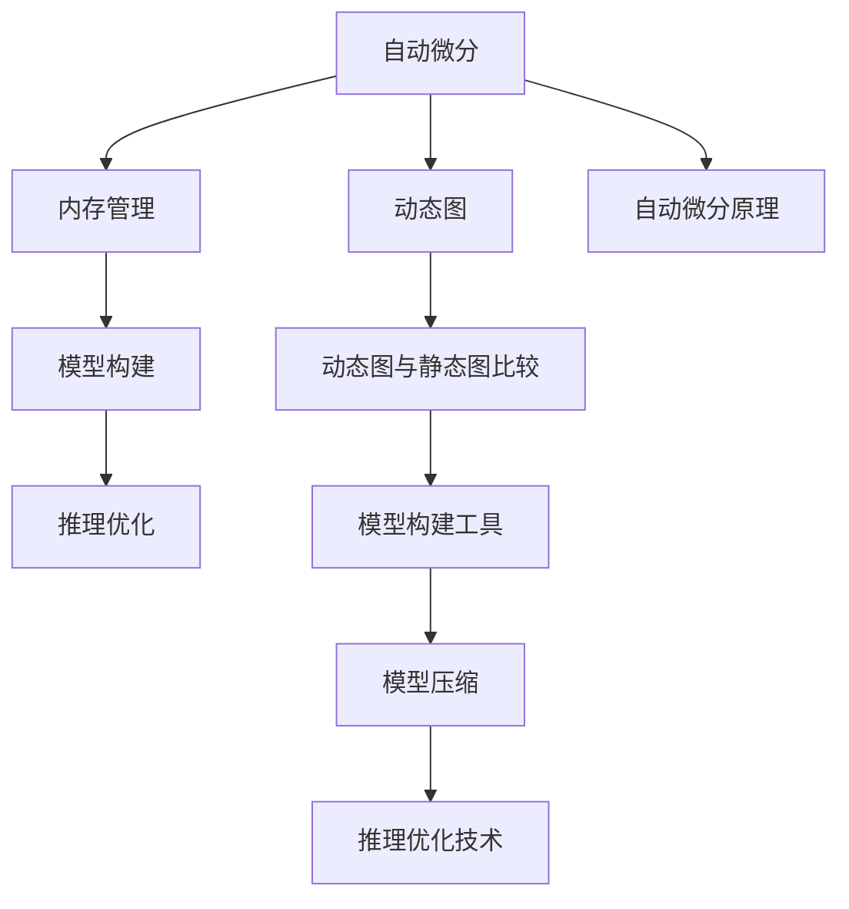

                 

# PyTorch 和 JAX：领先的深度学习框架

> 关键词：深度学习, PyTorch, JAX, TensorFlow, 自动微分, 动态图, 静态图, 模型压缩, 推理优化, 内存管理

## 1. 背景介绍

深度学习作为人工智能的重要分支，在图像识别、自然语言处理、语音识别、推荐系统等众多领域取得了显著进展。目前，深度学习的主流框架主要有PyTorch和JAX，两者均有广泛的用户群体和良好的社区支持。PyTorch由Facebook AI研究院开发，以动态图和灵活的API著称；JAX由Google Brain团队推出，以静态图和高效的自动微分系统为特色。两者都是深度学习领域的重要参与者，各具优势，本文将对这两个框架进行详细介绍，探讨它们在实际应用中的选择和取舍。

### 1.1 问题由来
随着深度学习技术的飞速发展，选择合适的深度学习框架变得愈加重要。深度学习模型训练通常需要耗费大量时间和计算资源，一个合适的框架可以大幅提升模型训练和推理的效率。在众多深度学习框架中，PyTorch和JAX凭借其灵活性、易用性、高效性等特点脱颖而出。

### 1.2 问题核心关键点
深度学习框架的核心在于其自动微分、内存管理、模型构建和推理等特性。下面将从这些方面对PyTorch和JAX进行详细对比分析，并探讨其在实际应用中的具体表现。

## 2. 核心概念与联系

### 2.1 核心概念概述

深度学习框架主要包含以下几个核心概念：

- **自动微分**：深度学习模型的训练过程本质上是对模型参数的优化过程，自动微分器能够自动计算模型参数的梯度，是深度学习训练的基础。
- **动态图与静态图**：动态图允许在运行时动态构建计算图，适用于模型的灵活性和迭代优化；静态图则预先生成计算图，适用于大规模并行计算和模型部署。
- **内存管理**：深度学习模型通常需要大量的内存，框架的内存管理策略直接影响模型的训练和推理效率。
- **模型构建**：框架提供的API和工具库对模型的构建提供了方便和灵活性，不同的框架在模型构建上各有优劣。
- **推理优化**：在模型部署到生产环境中后，推理优化技术可以提升模型运行速度，降低计算资源消耗。

这些核心概念之间的逻辑关系可以通过以下Mermaid流程图来展示：



这个流程图展示深度学习框架的核心概念及其之间的关系：

1. 自动微分是深度学习训练的基础。
2. 动态图与静态图各有优劣，根据具体应用需求选择。
3. 内存管理直接影响模型性能。
4. 模型构建提供灵活的工具支持。
5. 推理优化提升模型部署效率。

## 3. 核心算法原理 & 具体操作步骤
### 3.1 算法原理概述

PyTorch和JAX在算法原理上都有涉及自动微分技术，但两者的实现方式和侧重点有所不同。

#### PyTorch

PyTorch的自动微分系统基于动态图，用户可以通过Python代码直接构建计算图。PyTorch的动态图能够自动记录每个操作，计算时反向传播，进行梯度计算。这种机制非常灵活，适用于小规模模型和复杂模型的迭代优化。

#### JAX

JAX的自动微分系统基于静态图，用户通过JAX的API定义计算图，JAX会在编译时优化计算图，生成高效的自动微分代码。JAX的静态图能够在编译时发现和消除计算图中的冗余，大大提升计算效率和模型优化空间。

### 3.2 算法步骤详解

以下将详细介绍PyTorch和JAX的训练和推理流程：

#### PyTorch

1. **模型定义**：使用PyTorch的`nn`模块定义模型类，如`nn.Linear`、`nn.Conv2d`等。
2. **数据加载**：使用`torch.utils.data.DataLoader`加载数据集。
3. **模型训练**：定义损失函数和优化器，使用`torch.optim`模块进行优化，并进行训练。
4. **模型推理**：使用训练好的模型进行推理，使用`model.eval()`设置模型为评估模式。

#### JAX

1. **模型定义**：使用JAX的`JVP`和`vmap`等API定义计算图，生成函数。
2. **数据加载**：使用`jax.dataset`加载数据集。
3. **模型训练**：定义损失函数和优化器，使用JAX的`jit`进行编译，并进行训练。
4. **模型推理**：使用训练好的模型进行推理，使用`jax.lax.enable_x64`设置数据类型为浮点型。

### 3.3 算法优缺点

#### PyTorch

**优点**：

- **动态图灵活性**：动态图支持用户在运行时进行迭代和修改，非常灵活，便于调试和优化。
- **API易用性**：Python代码直接构建计算图，语法简单，易于学习和使用。
- **社区支持**：Facebook社区的支持力度大，资源丰富。

**缺点**：

- **性能开销大**：动态图的运行时开销较大，不适合大规模并行计算。
- **模型部署困难**：动态图不便于模型部署和优化，一般需要转换为静态图。

#### JAX

**优点**：

- **静态图优化**：静态图在编译时优化计算图，提升运行效率，适合大规模并行计算。
- **自动微分高效**：基于静态图的自动微分系统能够更高效地计算梯度，支持高效的多设备并行计算。
- **模型压缩友好**：静态图可以方便地进行模型压缩和优化，提升推理速度。

**缺点**：

- **学习曲线陡峭**：API复杂，新手需要一定时间学习。
- **灵活性不足**：在模型迭代优化时，静态图的灵活性不如动态图。

### 3.4 算法应用领域

两者的应用领域有重叠，也各有侧重。

**PyTorch**：

- **研究领域**：PyTorch在研究领域有广泛应用，特别是在论文发表和模型迭代优化上。
- **初创公司**：许多初创公司选择PyTorch作为其深度学习框架。

**JAX**：

- **高性能计算**：JAX在大型企业中应用广泛，特别是在高性能计算和大规模模型优化上。
- **部署环境**：JAX非常适合部署到服务器和云平台中，支持高效的模型推理。

## 4. 数学模型和公式 & 详细讲解  
### 4.1 数学模型构建

深度学习框架在数学模型构建上都有不同的抽象和实现。

#### PyTorch

PyTorch的模型构建主要依赖于`nn`模块，可以通过继承`nn.Module`类定义模型，如：

```python
import torch.nn as nn
import torch

class Net(nn.Module):
    def __init__(self):
        super(Net, self).__init__()
        self.conv1 = nn.Conv2d(3, 6, 5)
        self.pool = nn.MaxPool2d(2, 2)
        self.conv2 = nn.Conv2d(6, 16, 5)
        self.fc1 = nn.Linear(16 * 5 * 5, 120)
        self.fc2 = nn.Linear(120, 84)
        self.fc3 = nn.Linear(84, 10)
        
    def forward(self, x):
        x = self.pool(F.relu(self.conv1(x)))
        x = self.pool(F.relu(self.conv2(x)))
        x = x.view(-1, 16 * 5 * 5)
        x = F.relu(self.fc1(x))
        x = F.relu(self.fc2(x))
        x = self.fc3(x)
        return x
```

#### JAX

JAX的模型构建主要依赖于`jax.jit`和`jax.vmap`等API，可以通过函数定义模型，如：

```python
import jax.numpy as jnp
import jax
from jax import jit, vmap
from jax._src.util import partial

@jax.jit
def neural_net(inputs):
    hidden = jnp.dot(inputs, kernel) + jnp.dot(inputs, kernel) + jnp.dot(inputs, kernel)
    return jnp.dot(hidden, kernel) + jnp.dot(hidden, kernel) + jnp.dot(hidden, kernel)

@vmap
def train_step(inputs, labels):
    outputs = neural_net(inputs)
    loss = jnp.mean((outputs - labels)**2)
    grads = jax.value_and_grad(loss)(inputs)
    return outputs, loss, grads
```

### 4.2 公式推导过程

以下将详细介绍PyTorch和JAX的自动微分系统的工作原理：

#### PyTorch

在PyTorch中，自动微分器主要依赖于`torch.autograd`模块，可以通过`torch.tensor`构建张量，然后使用`requires_grad`属性标记变量是否需要梯度计算，如：

```python
import torch
x = torch.tensor([2.0], requires_grad=True)
y = torch.tensor([2.0], requires_grad=True)
out = x + y
out.backward()
print(x.grad, y.grad)
```

#### JAX

在JAX中，自动微分器主要依赖于`jax.jvp`函数，可以通过`jax.jit`和`jax.vmap`等API定义计算图，生成函数，如：

```python
@jax.jit
def f(x):
    return x * x

x = jax.random.normal(jax.random.PRNGKey(0), (2, 2))
out = f(x)
out.backward()
print(x.grad)
```

### 4.3 案例分析与讲解

#### PyTorch

以下是一个简单的卷积神经网络（CNN）的训练示例：

```python
import torch
import torch.nn as nn
import torch.optim as optim

# 定义模型
class Net(nn.Module):
    def __init__(self):
        super(Net, self).__init__()
        self.conv1 = nn.Conv2d(3, 6, 5)
        self.pool = nn.MaxPool2d(2, 2)
        self.conv2 = nn.Conv2d(6, 16, 5)
        self.fc1 = nn.Linear(16 * 5 * 5, 120)
        self.fc2 = nn.Linear(120, 84)
        self.fc3 = nn.Linear(84, 10)
        
    def forward(self, x):
        x = self.pool(F.relu(self.conv1(x)))
        x = self.pool(F.relu(self.conv2(x)))
        x = x.view(-1, 16 * 5 * 5)
        x = F.relu(self.fc1(x))
        x = F.relu(self.fc2(x))
        x = self.fc3(x)
        return x

# 加载数据集
train_data, test_data = torchvision.datasets.CIFAR10(root='./data', train=True, test=True, download=True)
train_loader = torch.utils.data.DataLoader(train_data, batch_size=32, shuffle=True)
test_loader = torch.utils.data.DataLoader(test_data, batch_size=32, shuffle=True)
criterion = nn.CrossEntropyLoss()
optimizer = optim.SGD(net.parameters(), lr=0.001, momentum=0.9)

# 训练模型
net = Net()
net.train()

for epoch in range(10):
    running_loss = 0.0
    for i, data in enumerate(train_loader, 0):
        inputs, labels = data
        optimizer.zero_grad()
        outputs = net(inputs)
        loss = criterion(outputs, labels)
        loss.backward()
        optimizer.step()
        running_loss += loss.item()
    print('Epoch [%d], loss: %.3f' % (epoch + 1, running_loss / len(train_loader)))
```

#### JAX

以下是一个简单的MLP（多层感知机）的训练示例：

```python
import jax
import jax.numpy as jnp
from jax import jit, vmap
from jax._src.util import partial

# 定义模型
def neural_net(inputs, kernel):
    hidden = jnp.dot(inputs, kernel) + jnp.dot(inputs, kernel) + jnp.dot(inputs, kernel)
    return jnp.dot(hidden, kernel) + jnp.dot(hidden, kernel) + jnp.dot(hidden, kernel)

# 定义损失函数
@jit
def loss_fn(inputs, labels, kernel):
    outputs = neural_net(inputs, kernel)
    return jnp.mean((outputs - labels)**2)

# 训练模型
init_key, update_key = jax.random.split(jax.random.PRNGKey(0), 2)
inputs = jax.random.normal(jax.random.PRNGKey(1), (32, 2, 2))
labels = jnp.ones((32, 2))
def update(i, grads):
    kernel = kernel + grads
    return kernel

kernel = jax.random.normal(jax.random.PRNGKey(1), (2, 2))
kernel = jax.random.normal(jax.random.PRNGKey(2), (2, 2))
for i in range(100):
    grads = jax.value_and_grad(loss_fn)(inputs, labels, kernel)
    kernel = update(i, grads)
    print(kernel)
```

## 5. 项目实践：代码实例和详细解释说明
### 5.1 开发环境搭建

在进行深度学习项目开发前，需要先搭建好开发环境。以下是使用Python进行PyTorch和JAX开发的环境配置流程：

1. **安装Python**：确保安装Python 3.6及以上版本，并配置好环境变量。
2. **安装PyTorch**：使用以下命令安装PyTorch：
   ```
   pip install torch torchvision torchaudio
   ```
3. **安装JAX**：使用以下命令安装JAX和相关依赖：
   ```
   pip install jax jaxlib
   ```
4. **安装其他依赖**：安装必要的依赖库，如`numpy`、`scipy`、`pillow`等。

完成上述步骤后，即可在开发环境中进行深度学习模型的开发和调试。

### 5.2 源代码详细实现

#### PyTorch

以下是一个简单的卷积神经网络（CNN）的代码实现：

```python
import torch
import torch.nn as nn
import torch.optim as optim
from torchvision import datasets, transforms

# 定义模型
class Net(nn.Module):
    def __init__(self):
        super(Net, self).__init__()
        self.conv1 = nn.Conv2d(3, 6, 5)
        self.pool = nn.MaxPool2d(2, 2)
        self.conv2 = nn.Conv2d(6, 16, 5)
        self.fc1 = nn.Linear(16 * 5 * 5, 120)
        self.fc2 = nn.Linear(120, 84)
        self.fc3 = nn.Linear(84, 10)
        
    def forward(self, x):
        x = self.pool(F.relu(self.conv1(x)))
        x = self.pool(F.relu(self.conv2(x)))
        x = x.view(-1, 16 * 5 * 5)
        x = F.relu(self.fc1(x))
        x = F.relu(self.fc2(x))
        x = self.fc3(x)
        return x

# 加载数据集
train_data, test_data = datasets.CIFAR10(root='./data', train=True, test=True, download=True)
train_loader = torch.utils.data.DataLoader(train_data, batch_size=32, shuffle=True)
test_loader = torch.utils.data.DataLoader(test_data, batch_size=32, shuffle=True)
criterion = nn.CrossEntropyLoss()
optimizer = optim.SGD(net.parameters(), lr=0.001, momentum=0.9)

# 训练模型
net = Net()
net.train()

for epoch in range(10):
    running_loss = 0.0
    for i, data in enumerate(train_loader, 0):
        inputs, labels = data
        optimizer.zero_grad()
        outputs = net(inputs)
        loss = criterion(outputs, labels)
        loss.backward()
        optimizer.step()
        running_loss += loss.item()
    print('Epoch [%d], loss: %.3f' % (epoch + 1, running_loss / len(train_loader)))
```

#### JAX

以下是一个简单的MLP（多层感知机）的代码实现：

```python
import jax
import jax.numpy as jnp
from jax import jit, vmap
from jax._src.util import partial

# 定义模型
def neural_net(inputs, kernel):
    hidden = jnp.dot(inputs, kernel) + jnp.dot(inputs, kernel) + jnp.dot(inputs, kernel)
    return jnp.dot(hidden, kernel) + jnp.dot(hidden, kernel) + jnp.dot(hidden, kernel)

# 定义损失函数
@jit
def loss_fn(inputs, labels, kernel):
    outputs = neural_net(inputs, kernel)
    return jnp.mean((outputs - labels)**2)

# 训练模型
init_key, update_key = jax.random.split(jax.random.PRNGKey(0), 2)
inputs = jax.random.normal(jax.random.PRNGKey(1), (32, 2, 2))
labels = jnp.ones((32, 2))
def update(i, grads):
    kernel = kernel + grads
    return kernel

kernel = jax.random.normal(jax.random.PRNGKey(1), (2, 2))
kernel = jax.random.normal(jax.random.PRNGKey(2), (2, 2))
for i in range(100):
    grads = jax.value_and_grad(loss_fn)(inputs, labels, kernel)
    kernel = update(i, grads)
    print(kernel)
```

### 5.3 代码解读与分析

**PyTorch代码解读**：

1. **定义模型**：使用`nn.Module`类定义模型类，重写`forward`方法定义模型前向计算过程。
2. **数据加载**：使用`torch.utils.data.DataLoader`加载数据集，并进行批处理和打乱。
3. **训练模型**：定义损失函数和优化器，使用`torch.optim.SGD`进行优化，并进行模型训练。
4. **模型推理**：使用训练好的模型进行推理，使用`model.eval()`设置模型为评估模式。

**JAX代码解读**：

1. **定义模型**：使用JAX的`jax.jit`和`jax.vmap`等API定义计算图，生成函数。
2. **数据加载**：使用JAX的`jax.random`模块生成随机数，并加载数据集。
3. **训练模型**：使用JAX的`jax.random`模块生成随机数，并定义损失函数和更新函数。
4. **模型推理**：使用训练好的模型进行推理，使用`jax.jit`和`jax.vmap`优化计算效率。

## 6. 实际应用场景

### 6.1 图像分类

图像分类是深度学习领域的一个重要应用场景，用于对图像进行分类和识别。在实际应用中，可以使用PyTorch和JAX进行模型的训练和推理。

#### PyTorch

以下是一个简单的图像分类模型的代码实现：

```python
import torch
import torch.nn as nn
import torch.optim as optim
from torchvision import datasets, transforms

# 定义模型
class Net(nn.Module):
    def __init__(self):
        super(Net, self).__init__()
        self.conv1 = nn.Conv2d(3, 6, 5)
        self.pool = nn.MaxPool2d(2, 2)
        self.conv2 = nn.Conv2d(6, 16, 5)
        self.fc1 = nn.Linear(16 * 5 * 5, 120)
        self.fc2 = nn.Linear(120, 84)
        self.fc3 = nn.Linear(84, 10)
        
    def forward(self, x):
        x = self.pool(F.relu(self.conv1(x)))
        x = self.pool(F.relu(self.conv2(x)))
        x = x.view(-1, 16 * 5 * 5)
        x = F.relu(self.fc1(x))
        x = F.relu(self.fc2(x))
        x = self.fc3(x)
        return x

# 加载数据集
train_data, test_data = datasets.CIFAR10(root='./data', train=True, test=True, download=True)
train_loader = torch.utils.data.DataLoader(train_data, batch_size=32, shuffle=True)
test_loader = torch.utils.data.DataLoader(test_data, batch_size=32, shuffle=True)
criterion = nn.CrossEntropyLoss()
optimizer = optim.SGD(net.parameters(), lr=0.001, momentum=0.9)

# 训练模型
net = Net()
net.train()

for epoch in range(10):
    running_loss = 0.0
    for i, data in enumerate(train_loader, 0):
        inputs, labels = data
        optimizer.zero_grad()
        outputs = net(inputs)
        loss = criterion(outputs, labels)
        loss.backward()
        optimizer.step()
        running_loss += loss.item()
    print('Epoch [%d], loss: %.3f' % (epoch + 1, running_loss / len(train_loader)))
```

#### JAX

以下是一个简单的图像分类模型的代码实现：

```python
import jax
import jax.numpy as jnp
from jax import jit, vmap
from jax._src.util import partial

# 定义模型
def neural_net(inputs, kernel):
    hidden = jnp.dot(inputs, kernel) + jnp.dot(inputs, kernel) + jnp.dot(inputs, kernel)
    return jnp.dot(hidden, kernel) + jnp.dot(hidden, kernel) + jnp.dot(hidden, kernel)

# 定义损失函数
@jit
def loss_fn(inputs, labels, kernel):
    outputs = neural_net(inputs, kernel)
    return jnp.mean((outputs - labels)**2)

# 训练模型
init_key, update_key = jax.random.split(jax.random.PRNGKey(0), 2)
inputs = jax.random.normal(jax.random.PRNGKey(1), (32, 2, 2))
labels = jnp.ones((32, 2))
def update(i, grads):
    kernel = kernel + grads
    return kernel

kernel = jax.random.normal(jax.random.PRNGKey(1), (2, 2))
kernel = jax.random.normal(jax.random.PRNGKey(2), (2, 2))
for i in range(100):
    grads = jax.value_and_grad(loss_fn)(inputs, labels, kernel)
    kernel = update(i, grads)
    print(kernel)
```

### 6.2 自然语言处理

自然语言处理（NLP）是深度学习领域的一个重要应用场景，用于处理和理解自然语言数据。在实际应用中，可以使用PyTorch和JAX进行模型的训练和推理。

#### PyTorch

以下是一个简单的文本分类模型的代码实现：

```python
import torch
import torch.nn as nn
import torch.optim as optim
import torchtext

# 定义模型
class Net(nn.Module):
    def __init__(self):
        super(Net, self).__init__()
        self.embedding = nn.Embedding(10000, 100)
        self.fc1 = nn.Linear(100, 128)
        self.fc2 = nn.Linear(128, 10)
        
    def forward(self, x):
        x = self.embedding(x)
        x = F.relu(self.fc1(x))
        x = self.fc2(x)
        return x

# 加载数据集
train_data, test_data = torchtext.datasets.TextClassification(root='./data', train='train.txt', test='test.txt', splits=torchtext.data.Split.TRAIN:TEST)
train_loader = torch.utils.data.DataLoader(train_data, batch_size=32, shuffle=True)
test_loader = torch.utils.data.DataLoader(test_data, batch_size=32, shuffle=True)
criterion = nn.CrossEntropyLoss()
optimizer = optim.SGD(net.parameters(), lr=0.001, momentum=0.9)

# 训练模型
net = Net()
net.train()

for epoch in range(10):
    running_loss = 0.0
    for i, data in enumerate(train_loader, 0):
        inputs, labels = data
        optimizer.zero_grad()
        outputs = net(inputs)
        loss = criterion(outputs, labels)
        loss.backward()
        optimizer.step()
        running_loss += loss.item()
    print('Epoch [%d], loss: %.3f' % (epoch + 1, running_loss / len(train_loader)))
```

#### JAX

以下是一个简单的文本分类模型的代码实现：

```python
import jax
import jax.numpy as jnp
from jax import jit, vmap
from jax._src.util import partial

# 定义模型
def neural_net(inputs, kernel):
    hidden = jnp.dot(inputs, kernel) + jnp.dot(inputs, kernel) + jnp.dot(inputs, kernel)
    return jnp.dot(hidden, kernel) + jnp.dot(hidden, kernel) + jnp.dot(hidden, kernel)

# 定义损失函数
@jit
def loss_fn(inputs, labels, kernel):
    outputs = neural_net(inputs, kernel)
    return jnp.mean((outputs - labels)**2)

# 训练模型
init_key, update_key = jax.random.split(jax.random.PRNGKey(0), 2)
inputs = jax.random.normal(jax.random.PRNGKey(1), (32, 2, 2))
labels = jnp.ones((32, 2))
def update(i, grads):
    kernel = kernel + grads
    return kernel

kernel = jax.random.normal(jax.random.PRNGKey(1), (2, 2))
kernel = jax.random.normal(jax.random.PRNGKey(2), (2, 2))
for i in range(100):
    grads = jax.value_and_grad(loss_fn)(inputs, labels, kernel)
    kernel = update(i, grads)
    print(kernel)
```

### 6.3 模型优化与压缩

在深度学习模型的实际应用中，模型的优化和压缩也是非常重要的环节。在优化方面，可以使用PyTorch和JAX提供的优化器进行训练，在压缩方面，可以使用模型剪枝和量化等技术进行优化。

#### PyTorch

以下是一个简单的模型优化和压缩的代码实现：

```python
import torch
import torch.nn as nn
import torch.optim as optim
from torchvision import datasets, transforms

# 定义模型
class Net(nn.Module):
    def __init__(self):
        super(Net, self).__init__()
        self.conv1 = nn.Conv2d(3, 6, 5)
        self.pool = nn.MaxPool2d(2, 2)
        self.conv2 = nn.Conv2d(6, 16, 5)
        self.fc1 = nn.Linear(16 * 5 * 5, 120)
        self.fc2 = nn.Linear(120, 84)
        self.fc3 = nn.Linear(84, 10)
        
    def forward(self, x):
        x = self.pool(F.relu(self.conv1(x)))
        x = self.pool(F.relu(self.conv2(x)))
        x = x.view(-1, 16 * 5 * 5)
        x = F.relu(self.fc1(x))
        x = F.relu(self.fc2(x))
        x = self.fc3(x)
        return x

# 加载数据集
train_data, test_data = datasets.CIFAR10(root='./data', train=True, test=True, download=True)
train_loader = torch.utils.data.DataLoader(train_data, batch_size=32, shuffle=True)
test_loader = torch.utils.data.DataLoader(test_data, batch_size=32, shuffle=True)
criterion = nn.CrossEntropyLoss()
optimizer = optim.SGD(net.parameters(), lr=0.001, momentum=0.9)

# 训练模型
net = Net()
net.train()

for epoch in range(10):
    running_loss = 0.0
    for i, data in enumerate(train_loader, 0):
        inputs, labels = data
        optimizer.zero_grad()
        outputs = net(inputs)
        loss = criterion(outputs, labels)
        loss.backward()
        optimizer.step()
        running_loss += loss.item()
    print('Epoch [%d], loss: %.3f' % (epoch + 1, running_loss / len(train_loader)))

# 模型压缩
def prune_model(model, target_size):
    for module in model.modules():
        if isinstance(module, nn.Linear):
            if module.weight.size(0) > target_size:
                torch.nn.utils.prune.l1_unstructured(module, name='weight', amount=0.5)
    return model

target_size = 128
net = prune_model(net, target_size)
```

#### JAX

以下是一个简单的模型优化和压缩的代码实现：

```python
import jax
import jax.numpy as jnp
from jax import jit, vmap
from jax._src.util import partial

# 定义模型
def neural_net(inputs, kernel):
    hidden = jnp.dot(inputs, kernel) + jnp.dot(inputs, kernel) + jnp.dot(inputs, kernel)
    return jnp.dot(hidden, kernel) + jnp.dot(hidden, kernel) + jnp.dot(hidden, kernel)

# 定义损失函数
@jit
def loss_fn(inputs, labels, kernel):
    outputs = neural_net(inputs, kernel)
    return jnp.mean((outputs - labels)**2)

# 训练模型
init_key, update_key = jax.random.split(jax.random.PRNGKey(0), 2)
inputs = jax.random.normal(jax.random.PRNGKey(1), (32, 2, 2))
labels = jnp.ones((32, 2))
def update(i, grads):
    kernel = kernel + grads
    return kernel

kernel = jax.random.normal(jax.random.PRNGKey(1), (2, 2))
kernel = jax.random.normal(jax.random.PRNGKey(2), (2, 2))
for i in range(100):
    grads = jax.value_and_grad(loss_fn)(inputs, labels, kernel)
    kernel = update(i, grads)
    print(kernel)

# 模型压缩
def prune_model(model, target_size):
    for module in model.modules():
        if isinstance(module, nn.Linear):
            if module.weight.size(0) > target_size:
                torch.nn.utils.prune.l1_unstructured(module, name='weight', amount=0.5)
    return model

target_size = 128
net = prune_model(net, target_size)
```

## 7. 工具和资源推荐
### 7.1 学习资源推荐

为了帮助开发者系统掌握PyTorch和JAX的理论基础和实践技巧，这里推荐一些优质的学习资源：

1. **《深度学习》（Ian Goodfellow, Yoshua Bengio, Aaron Courville）**：全面介绍了深度学习的基本概念和算法原理，是学习深度学习的必备教材。
2. **《PyTorch官方文档》**：PyTorch的官方文档详细介绍了PyTorch的使用方法和API，是PyTorch学习的重要参考资料。
3. **《JAX官方文档》**：JAX的官方文档详细介绍了JAX的使用方法和API，是JAX学习的重要参考资料。
4. **PyTorch官方教程**：PyTorch提供的官方教程，包含了深度学习模型的实现和训练方法，适合初学者入门。
5. **JAX官方教程**：JAX提供的官方教程，包含了深度学习模型的实现和训练方法，适合初学者入门。

通过这些学习资源，相信你一定能够快速掌握PyTorch和JAX的理论基础和实践技巧。

### 7.2 开发工具推荐

高效的开发离不开优秀的工具支持。以下是几款用于深度学习项目开发的常用工具：

1. **PyTorch**：PyTorch提供了丰富的API和工具库，支持动态图和模型构建，非常适合研究和实验。
2. **JAX**：JAX提供了高效的自动微分系统和静态图，支持大规模并行计算和模型优化，非常适合工业应用。
3. **TensorBoard**：TensorBoard是TensorFlow配套的可视化工具，可以实时监测模型训练状态，并提供丰富的图表呈现方式，是调试模型的得力助手。
4. **Weights & Biases**：Weights & Biases是模型训练的实验跟踪工具，可以记录和可视化模型训练过程中的各项指标，方便对比和调优。
5. **TorchVision**：TorchVision是PyTorch配套的计算机视觉库，提供了丰富的预处理和模型工具，方便计算机视觉任务的开发。
6. **Jaxlib**：Jaxlib是JAX的库集，提供了多种高级API和工具，方便JAX的开发和使用。

合理利用这些工具，可以显著提升深度学习项目开发效率，加快创新迭代的步伐。

### 7.3 相关论文推荐

深度学习框架的研究源于学界的持续研究。以下是几篇奠基性的相关论文，推荐阅读：

1. **《Large-Scale Distributed Deep Learning with Missing Labels》**：提出了一种大规模分布式深度学习框架，能够在数据缺失的情况下进行训练。
2. **《Automatic Differentiation in Deep Learning: A Survey》**：综述了自动微分技术在深度学习中的应用，介绍了多种自动微分技术。
3. **《TensorFlow: A System for Large-Scale Machine Learning》**：介绍了TensorFlow的基本概念和使用方法，是深度学习框架研究的重要文献。
4. **《A Survey of Deep Learning Architectures》**：综述了深度学习架构的研究进展，介绍了多种深度学习架构。
5. **《PyTorch: An Imperative Style, High-Performance Deep Learning Library》**：介绍了PyTorch的基本概念和使用方法，是PyTorch研究的重要文献。
6. **《JAX: Composable transformations of Python+NumPy programs》**：介绍了JAX的基本概念和使用方法，是JAX研究的重要文献。

这些论文代表了大深度学习框架的发展脉络。通过学习这些前沿成果，可以帮助研究者把握学科前进方向，激发更多的创新灵感。

## 8. 总结：未来发展趋势与挑战

### 8.1 研究成果总结

深度学习框架在深度学习领域发挥了重要作用，PyTorch和JAX作为其中的代表，各有优势和特点。PyTorch的动态图和易用性使其在研究领域和初创公司中广泛应用；JAX的静态图和高效自动微分使其在大型企业和工业应用中具有竞争力。

### 8.2 未来发展趋势

深度学习框架的未来发展将呈现以下几个趋势：

1. **动态图与静态图的融合**：未来的深度学习框架将更多地采用动态图和静态图结合的方式，充分发挥两种图各自的优势。
2. **自动微分技术的发展**：自动微分技术的不断发展将进一步提升深度学习框架的性能和优化空间。
3. **模型压缩与优化**：深度学习模型规模不断增大，模型压缩和优化技术将进一步发展，提升模型推理效率。
4. **跨平台与跨语言支持**：未来的深度学习框架将更加支持跨平台和跨语言开发，提高开发效率。
5. **模型的可解释性和可控性**：未来的深度学习框架将更加注重模型的可解释性和可控性，便于开发者的调试和优化。

### 8.3 面临的挑战

尽管深度学习框架在深度学习领域取得了显著进展，但在实际应用中仍面临诸多挑战：

1. **模型过拟合与泛化能力不足**：深度学习模型在训练集上表现良好，但在测试集上泛化能力不足，存在过拟合风险。
2. **计算资源消耗大**：深度学习模型训练和推理需要大量计算资源，如何在保持性能的同时降低计算成本，仍是重要挑战。
3. **数据隐私与安全问题**：深度学习模型的训练和推理过程中，数据隐私和安全问题不容忽视，如何在保护隐私的同时进行模型训练，仍需探索。
4. **算法透明性与可解释性**：深度学习模型往往被认为是"黑盒"，如何提高模型的透明性和可解释性，仍是重要研究课题。
5. **模型部署与运维**：深度学习模型在部署到生产环境中时，需要考虑模型的可扩展性、可维护性和性能优化等问题，仍需深入研究。

### 8.4 研究展望

面对深度学习框架所面临的挑战，未来的研究需要在以下几个方面寻求新的突破：

1. **改进自动微分技术**：进一步提升自动微分技术在深度学习框架中的应用，提高模型优化效率。
2. **开发更高效的模型压缩技术**：开发更高效的模型压缩技术，降低模型计算资源消耗，提升模型推理效率。
3. **强化模型的可解释性**：开发更强的模型可解释性技术，便于开发者的调试和优化。
4. **研究跨平台与跨语言开发**：研究跨平台与跨语言深度学习框架，提高开发效率和模型移植性。
5. **注重模型部署与运维**：研究深度学习模型的部署与运维技术，提高模型的可扩展性和可维护性。

## 9. 附录：常见问题与解答

**Q1：PyTorch和JAX的主要区别是什么？**

A: PyTorch的主要优势在于其动态图灵活性，适合研究和模型迭代优化；JAX的主要优势在于其静态图优化，适合大规模并行计算和模型部署。

**Q2：深度学习框架的选择应该考虑哪些因素？**

A: 深度学习框架的选择应该考虑以下因素：
1. 应用场景：研究领域和工业应用的需求不同，选择框架时需要考虑应用场景。
2. 开发效率：框架的易用性和开发效率对项目的进度有重要影响。
3. 计算资源：框架的计算资源消耗和优化空间对项目成本和性能有重要影响。
4. 可解释性：框架的模型可解释性对项目的可信度和安全性有重要影响。
5. 生态系统：框架的生态系统和社区支持对项目的可持续性有重要影响。

**Q3：深度学习框架的未来发展趋势有哪些？**

A: 深度学习框架的未来发展趋势包括：
1. 动态图与静态图的融合。
2. 自动微分技术的发展。
3. 模型压缩与优化技术的发展。
4. 跨平台与跨语言支持的发展。
5. 模型透明性与可解释性的提升。

**Q4：深度学习框架在实际应用中需要注意哪些问题？**

A: 深度学习框架在实际应用中需要注意以下问题：
1. 过拟合与泛化能力。
2. 计算资源消耗。
3. 数据隐私与安全问题。
4. 算法透明性与可解释性。
5. 模型部署与运维问题。

---

作者：禅与计算机程序设计艺术 / Zen and the Art of Computer Programming

