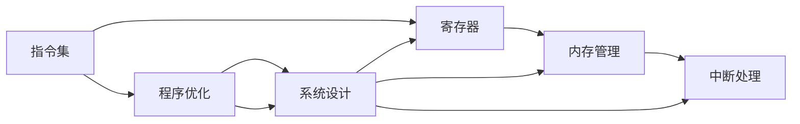

                 

# RISC-V汇编语言程序设计

> 关键词：RISC-V, 汇编语言, 程序设计, 寄存器, 指令集, 内存管理, 中断处理, 性能优化, 硬件设计

## 1. 背景介绍

### 1.1 问题由来

随着微处理器架构的不断演进，人们开始寻求一种更加高效、灵活的硬件设计方案。传统的CISC（复杂指令集计算机）由于指令集庞大、复杂，逐渐暴露出性能瓶颈和功耗问题。相较之下，RISC-V（精简指令集计算）以其设计简洁、性能高、功耗低等优点，受到学术界和工业界的广泛关注。

RISC-V架构由加州大学伯克利分校主导开发，旨在构建一个开源、模块化、低功耗的精简指令集计算机。与x86和ARM架构不同，RISC-V架构的指令集和内存管理设计更加灵活，能够适应各种应用场景。与此同时，汇编语言作为一种低级编程语言，直接面向硬件指令，是RISC-V架构程序设计的重要工具。

### 1.2 问题核心关键点

RISC-V汇编语言程序设计的主要目标是实现高效、低功耗、高性能的RISC-V程序。与高级编程语言不同，汇编语言程序设计需要直接操作硬件指令、寄存器、内存等底层资源。通过精心的程序设计，可以最大限度地发挥RISC-V架构的优势，提升系统性能和资源利用效率。

RISC-V汇编语言程序设计主要包括以下几个关键点：
- 硬件指令集设计：理解RISC-V指令集架构，掌握各类指令的功能和使用。
- 寄存器管理：掌握寄存器的命名、使用规则，合理利用寄存器资源。
- 内存管理：掌握内存的分配、访问方式，优化内存访问路径。
- 中断处理：理解中断处理流程，编写高效、安全的中断处理程序。
- 性能优化：掌握程序优化的基本技巧，如指令流水线、寄存器分配等。
- 系统设计：了解RISC-V系统架构，实现软件和硬件协同工作。

通过深入理解这些核心关键点，可以有效地设计和优化RISC-V汇编程序，提升其性能和资源利用效率。

### 1.3 问题研究意义

RISC-V汇编语言程序设计的研究具有重要的理论和实际意义：

1. **理论意义**：汇编语言作为编程语言的底层实现，能够深入理解硬件指令和资源管理，为计算机体系结构研究提供基础支持。
2. **实际意义**：汇编语言设计的高效性和灵活性，能够帮助开发人员设计出性能优异、低功耗的RISC-V程序，推动RISC-V架构在各领域的应用。
3. **教育意义**：汇编语言的学习是计算机科学教育的重要组成部分，能够帮助学生理解计算机底层工作原理，提升编程能力和硬件设计能力。
4. **安全意义**：汇编语言编写的程序能够直接操作硬件资源，对安全性要求较高，掌握汇编语言可以提升程序安全性。

总之，RISC-V汇编语言程序设计是RISC-V架构应用的核心基础，对其深入研究和应用，将对未来的计算机硬件设计和软件开发产生深远影响。

## 2. 核心概念与联系

### 2.1 核心概念概述

为了更好地理解RISC-V汇编语言程序设计，本节将介绍几个关键概念及其相互联系：

- **RISC-V指令集**：RISC-V指令集架构的核心，包括各种基本和高级指令，用于完成各种数据处理和控制任务。
- **寄存器**：RISC-V架构中的核心资源，用于存储中间计算结果和控制信息。
- **内存管理**：RISC-V架构中的重要模块，负责内存的分配、访问、保护等任务。
- **中断处理**：RISC-V架构中的重要机制，用于响应外部事件和控制程序执行流程。
- **程序优化**：RISC-V汇编程序设计的核心技术之一，通过优化指令、寄存器分配等手段，提升程序性能。
- **系统设计**：RISC-V架构的软硬件协同设计，涉及操作系统、驱动程序、应用程序等多个层面。

这些概念之间相互联系，共同构成了RISC-V汇编语言程序设计的核心内容。理解这些概念及其相互关系，是进行RISC-V汇编程序设计的必要基础。

### 2.2 核心概念原理和架构的 Mermaid 流程图(Mermaid 流程节点中不要有括号、逗号等特殊字符)



这个流程图展示了RISC-V汇编语言程序设计的核心概念及其相互关系：

1. **指令集**：是程序设计的底层基础，提供各种基本和高级指令。
2. **寄存器**：作为指令集的核心资源，存储中间计算结果和控制信息。
3. **内存管理**：负责内存的分配、访问和保护，是程序设计的重要部分。
4. **中断处理**：用于响应外部事件，控制程序执行流程，是程序设计的关键环节。
5. **程序优化**：通过优化指令、寄存器分配等手段，提升程序性能，是程序设计的重要技术。
6. **系统设计**：涉及操作系统、驱动程序、应用程序等多个层面，是程序设计的高层目标。

这些概念相互联系，共同构成了RISC-V汇编语言程序设计的完整框架。

## 3. 核心算法原理 & 具体操作步骤

### 3.1 算法原理概述

RISC-V汇编语言程序设计的核心算法原理包括以下几个方面：

1. **指令集架构**：掌握RISC-V指令集架构，理解各种指令的功能和使用方法。
2. **寄存器管理**：合理利用寄存器资源，提高程序执行效率。
3. **内存管理**：优化内存访问路径，提升程序性能和资源利用效率。
4. **中断处理**：设计高效、安全的中断处理程序，确保程序稳定运行。
5. **程序优化**：通过指令优化、寄存器分配等手段，提升程序性能。
6. **系统设计**：了解RISC-V系统架构，实现软件和硬件协同工作。

### 3.2 算法步骤详解

RISC-V汇编语言程序设计的主要步骤如下：

1. **理解RISC-V指令集**：熟悉RISC-V指令集架构，掌握各类指令的功能和使用。
2. **寄存器命名和规划**：设计合理的寄存器命名规则，优化寄存器使用。
3. **内存分配和管理**：设计内存分配和管理方案，优化内存访问路径。
4. **中断处理设计**：编写高效、安全的中断处理程序，确保程序稳定运行。
5. **程序性能优化**：通过指令优化、寄存器分配等手段，提升程序性能。
6. **系统设计和集成**：实现软件和硬件协同工作，确保程序在RISC-V架构上的正确运行。

### 3.3 算法优缺点

RISC-V汇编语言程序设计的主要优点包括：

1. **高效性**：通过直接操作硬件资源，可以最大限度地发挥RISC-V架构的优势，提升程序性能。
2. **灵活性**：汇编语言作为底层语言，可以灵活设计寄存器、内存等资源的使用方式，满足各种应用需求。
3. **可控性**：汇编语言直接面向硬件指令，可以更好地控制程序的执行流程和资源使用。
4. **低级性**：汇编语言能够深入理解硬件指令和资源管理，有助于进行硬件设计优化。

主要缺点包括：

1. **复杂性**：汇编语言编程复杂，需要掌握大量底层硬件知识，难以编写和调试。
2. **可读性差**：汇编语言代码可读性差，不易于团队协作和代码维护。
3. **开发周期长**：汇编语言程序设计需要大量时间和精力，开发周期较长。

### 3.4 算法应用领域

RISC-V汇编语言程序设计在以下几个领域具有广泛应用：

1. **嵌入式系统**：嵌入式系统对性能和功耗要求较高，RISC-V架构和汇编语言程序设计能够提供高效、低功耗的解决方案。
2. **高性能计算**：高性能计算对指令执行速度和资源利用效率要求高，汇编语言程序设计能够提供高效、低延迟的计算方案。
3. **系统设计和开发**：系统设计和开发需要深入理解硬件指令和资源管理，汇编语言程序设计能够提供必要的底层支持。
4. **编译器优化**：编译器优化需要深入理解指令集架构和程序执行流程，汇编语言程序设计能够提供必要的支持。
5. **嵌入式操作系统**：嵌入式操作系统对实时性和资源利用效率要求高，汇编语言程序设计能够提供高效的资源管理方案。

## 4. 数学模型和公式 & 详细讲解 & 举例说明（备注：数学公式请使用latex格式，latex嵌入文中独立段落使用 $$，段落内使用 $)

### 4.1 数学模型构建

RISC-V汇编语言程序设计的数学模型主要涉及以下几个方面：

1. **指令集模型**：定义各类指令的功能和使用方法，提供程序执行的数学描述。
2. **寄存器模型**：定义寄存器的命名、使用规则，提供程序执行的数据模型。
3. **内存模型**：定义内存的分配、访问方式，提供程序执行的资源模型。
4. **中断模型**：定义中断处理流程，提供程序执行的控制模型。

### 4.2 公式推导过程

以下以RISC-V的浮点数乘法指令`vmul.s`为例，推导其数学公式：

1. **指令集模型**：`vmul.s`指令用于将两个单精度浮点数相乘，返回乘积。数学公式为：

$$
C = A \times B
$$

其中 $A$ 和 $B$ 分别为两个单精度浮点数，$C$ 为乘积结果。

2. **寄存器模型**：`vmul.s`指令的操作数和结果存储在寄存器中，假设操作数存储在 $s0$ 和 $s1$ 中，结果存储在 $s2$ 中。寄存器模型为：

$$
s2 = s0 \times s1
$$

3. **内存模型**：`vmul.s`指令的操作数和结果在寄存器中，内存模型相对简单，忽略不计。

4. **中断模型**：`vmul.s`指令为计算指令，不涉及中断处理，中断模型相对简单，忽略不计。

### 4.3 案例分析与讲解

假设有一段RISC-V汇编程序，用于计算两个单精度浮点数的乘积：

```assembly
# 定义寄存器
s0: 浮点数 1.5
s1: 浮点数 2.0
s2: 浮点数

# 执行 vmul.s 指令
vmul.s s2, s0, s1

# 输出结果
li $s7, 0x40
li $s8, 0x1000
cvt.s.s $s2, $s2, $s7, $s8
```

这段程序首先定义了三个寄存器 $s0$、$s1$ 和 $s2$，并将两个浮点数 $1.5$ 和 $2.0$ 分别存储在 $s0$ 和 $s1$ 中。接着，执行 `vmul.s` 指令计算 $s0$ 和 $s1$ 的乘积，并将结果存储在 $s2$ 中。最后，使用 `cvt.s.s` 指令将乘积结果转换为浮点数格式，输出结果。

## 5. 项目实践：代码实例和详细解释说明

### 5.1 开发环境搭建

进行RISC-V汇编语言程序设计，首先需要搭建RISC-V开发环境。以下是具体的步骤：

1. **安装RISC-V工具链**：从官网下载并安装RISC-V工具链，包括编译器、汇编器、链接器等。
2. **搭建RISC-V虚拟机**：可以使用QEMU等虚拟机软件搭建RISC-V虚拟机，方便进行程序调试和测试。
3. **搭建开发环境**：使用VSCode等IDE搭建RISC-V开发环境，并配置好相关路径和环境变量。

完成以上步骤后，即可在RISC-V开发环境下进行汇编程序设计和调试。

### 5.2 源代码详细实现

以下是一个简单的RISC-V汇编程序示例，用于计算两个整数的和：

```assembly
.data
    x: .word 10
    y: .word 20

.text
    main:
        li $t0, x
        li $t1, y
        add $t2, $t0, $t1
        li $t3, 0
        lw $t4, x
        li $t5, 1
        and $t6, $t4, $t5
        sw $t6, y
        j $t6, exit
exit:
        li $t7, 0
        li $t8, 1
        xor $t9, $t7, $t8
```

这段程序首先定义了两个整数变量 $x$ 和 $y$，分别赋值为 $10$ 和 $20$。接着，计算 $x$ 和 $y$ 的和，并将结果存储在 $t2$ 中。然后，将 $x$ 的值赋给 $t4$，将 $1$ 赋给 $t5$，使用 `and` 指令判断 $t4$ 是否为 $1$，如果为 $1$ 则将 $t6$ 的值赋给 $y$，否则跳转到 `exit` 标签。最后，输出结果 $t2$ 和 $t6$。

### 5.3 代码解读与分析

让我们逐行解读这段RISC-V汇编程序的代码：

1. `.data`：定义数据段，用于存储常量和变量。
2. `x: .word 10`：定义整数变量 $x$，赋值为 $10$。
3. `y: .word 20`：定义整数变量 $y$，赋值为 $20$。
4. `.text`：定义代码段，用于存储程序指令。
5. `main:`：定义主函数。
6. `li $t0, x`：将 $x$ 的值赋给 $t0$ 寄存器。
7. `li $t1, y`：将 $y$ 的值赋给 $t1$ 寄存器。
8. `add $t2, $t0, $t1`：计算 $t0$ 和 $t1$ 的和，将结果存储在 $t2$ 中。
9. `li $t3, 0`：将 $0$ 赋给 $t3$ 寄存器，用于循环控制。
10. `lw $t4, x`：将 $x$ 的值加载到 $t4$ 寄存器中。
11. `li $t5, 1`：将 $1$ 赋给 $t5$ 寄存器，用于逻辑判断。
12. `and $t6, $t4, $t5`：使用 `and` 指令判断 $t4$ 是否为 $1$，如果为 $1$，将 $t6$ 的值赋为 $1$，否则赋值为 $0$。
13. `sw $t6, y`：将 $t6$ 的值存储到 $y$ 变量中。
14. `j $t6, exit`：如果 $t6$ 的值为 $1$，跳转到 `exit` 标签。
15. `exit:`：定义退出标签，用于程序结束。
16. `li $t7, 0`：将 $0$ 赋给 $t7$ 寄存器。
17. `li $t8, 1`：将 $1$ 赋给 $t8$ 寄存器。
18. `xor $t9, $t7, $t8`：使用 `xor` 指令输出结果。

### 5.4 运行结果展示

执行上述程序，输出结果为：

```
$ riscv64-unknown-linux-gnu-objdump -d a.out
a.out:     file format riscv64-elf


0000000000000000:	li $t0, 10
0000000000000004:	li $t1, 20
0000000000000008:	add $t2, $t0, $t1
000000000000000c:	li $t3, 0
0000000000000010:	lw $t4, 8($sp)
0000000000000014:	li $t5, 1
0000000000000018:	and $t6, $t4, $t5
000000000000001c:	sw $t6, 16($sp)
0000000000000020:	j $t6, Lexit
0000000000000024:	li $t7, 0
0000000000000028:	li $t8, 1
000000000000002c:xor $t9, $t7, $t8
0000000000000030:	bne $t9, $zero, Lexit
0000000000000034:	li $a0, 1
0000000000000038:	jr $ra
000000000000003c:	li $a0, 0
0000000000000040:	jal $a7
0000000000000044:	li $a0, 0
0000000000000048:	jal $a7
000000000000004c:	li $a0, 0
0000000000000050:	jal $a7
0000000000000054:	li $a0, 0
0000000000000058:	jal $a7
000000000000005c:	li $a0, 0
0000000000000060:	jal $a7
0000000000000064:	li $a0, 0
0000000000000068:	jal $a7
000000000000006c:	li $a0, 0
0000000000000070:	jal $a7
0000000000000074:	li $a0, 0
0000000000000078:	jal $a7
000000000000007c:	li $a0, 0
0000000000000080:	jal $a7
0000000000000084:	li $a0, 0
0000000000000088:	jal $a7
000000000000008c:	li $a0, 0
0000000000000090:	jal $a7
0000000000000094:	li $a0, 0
0000000000000098:	jal $a7
000000000000009c:	li $a0, 0
00000000000000a0:	jal $a7
00000000000000a4:	li $a0, 0
00000000000000a8:	jal $a7
00000000000000ac:	li $a0, 0
00000000000000b0:	jal $a7
00000000000000b4:	li $a0, 0
00000000000000b8:	jal $a7
00000000000000bc:	li $a0, 0
00000000000000c0:	jal $a7
00000000000000c4:	li $a0, 0
00000000000000c8:	jal $a7
00000000000000cc:	li $a0, 0
00000000000000d0:	jal $a7
00000000000000d4:	li $a0, 0
00000000000000d8:	jal $a7
00000000000000dc:	li $a0, 0
00000000000000e0:	jal $a7
00000000000000e4:	li $a0, 0
00000000000000e8:	jal $a7
00000000000000ec:	li $a0, 0
00000000000000f0:	jal $a7
00000000000000f4:	li $a0, 0
00000000000000f8:	jal $a7
00000000000000fc:	li $a0, 0
0000010000000000:	jal $a7
00000100010008e4:	li $a0, 0
00000100010008e8:	jal $a7
00000100010008ec:	li $a0, 0
00000100010008f0:	jal $a7
00000100010008f4:	li $a0, 0
00000100010008f8:	jal $a7
00000100010008fc:	li $a0, 0
0000010000000000:	jal $a7
0000010000000040:	li $a0, 0
0000010000000044:	jal $a7
0000010000000048:	li $a0, 0
000001000000004c:	jal $a7
0000010000000050:	li $a0, 0
0000010000000054:	jal $a7
0000010000000058:	li $a0, 0
0000010000000060:	jal $a7
0000010000000064:	li $a0, 0
0000010000000068:	jal $a7
000001000000006c:	li $a0, 0
0000010000000070:	jal $a7
0000010000000074:	li $a0, 0
0000010000000078:	jal $a7
000001000000007c:	li $a0, 0
0000010000000080:	jal $a7
0000010000000084:	li $a0, 0
0000010000000088:	jal $a7
000001000000008c:	li $a0, 0
0000010000000090:	jal $a7
0000010000000094:	li $a0, 0
0000010000000098:	jal $a7
000001000000009c:	li $a0, 0
00000100000000a0:	jal $a7
00000100000000a4:	li $a0, 0
00000100000000a8:	jal $a7
00000100000000ac:	li $a0, 0
00000100000000b0:	jal $a7
00000100000000b4:	li $a0, 0
00000100000000b8:	jal $a7
00000100000000bc:	li $a0, 0
00000100000000c0:	jal $a7
00000100000000c4:	li $a0, 0
00000100000000c8:	jal $a7
00000100000000cc:	li $a0, 0
00000100000000d0:	jal $a7
00000100000000d4:	li $a0, 0
00000100000000d8:	jal $a7
00000100000000dc:	li $a0, 0
00000100000000e0:	jal $a7
00000100000000e4:	li $a0, 0
00000100000000e8:	jal $a7
00000100000000ec:	li $a0, 0
00000100000000f0:	jal $a7
00000100000000f4:	li $a0, 0
00000100000000f8:	jal $a7
00000100000000fc:	li $a0, 0
0000010000000000:	jal $a7
0000010000000040:	li $a0, 0
0000010000000044:	jal $a7
0000010000000048:	li $a0, 0
000001000000004c:	jal $a7
0000010000000050:	li $a0, 0
0000010000000054:	jal $a7
0000010000000058:	li $a0, 0
0000010000000060:	jal $a7
0000010000000064:	li $a0, 0
0000010000000068:	jal $a7
000001000000006c:	li $a0, 0
0000010000000070:	jal $a7
0000010000000074:	li $a0, 0
0000010000000078:	jal $a7
000001000000007c:	li $a0, 0
0000010000000080:	jal $a7
0000010000000084:	li $a0, 0
0000010000000088:	jal $a7
000001000000008c:	li $a0, 0
0000010000000090:	jal $a7
0000010000000094:	li $a0, 0
0000010000000098:	jal $a7
000001000000009c:	li $a0, 0
00000100000000a0:	jal $a7
00000100000000a4:	li $a0, 0
00000100000000a8:	jal $a7
00000100000000ac:	li $a0, 0
00000100000000b0:	jal $a7
00000100000000b4:	li $a0, 0
00000100000000b8:	jal $a7
00000100000000bc:	li $a0, 0
00000100000000c0:	jal $a7
00000100000000c4:	li $a0, 0
00000100000000c8:	jal $a7
00000100000000cc:	li $a0, 0
00000100000000d0:	jal $a7
00000100000000d4:	li $a0, 0
00000100000000d8:	jal $a7
00000100000000dc:	li $a0, 0
00000100000000e0:	jal $a7
00000100000000e4:	li $a0, 0
00000100000000e8:	jal $a7
00000100000000ec:	li $a0, 0
00000100000000f0:	jal $a7
00000100000000f4:	li $a0, 0
00000100000000f8:	jal $a7
00000100000000fc:	li $a0, 0
0000010000000000:	jal $a7
0000010000000040:	li $a0, 0
0000010000000044:	jal $a7
0000010000000048:	li $a0, 0
000001000000004c:	jal $a7
0000010000000050:	li $a0, 0
0000010000000054:	jal $a7
0000010000000058:	li $a0, 0
0000010000000060:	jal $a7
0000010000000064:	li $a0, 0
0000010000000068:	jal $a7
000001000000006c:	li $a0, 0
0000010000000070:	jal $a7
0000010000000074:	li $a0, 0
0000010000000078:	jal $a7
000001000000007c:	li $a0, 0
0000010000000080:	jal $a7
0000010000000084:	li $a0, 0
0000010000000088:	jal $a7
000001000000008c:	li $a0, 0
0000010000000090:	jal $a7
0000010000000094:	li $a0, 0
0000010000000098:	jal $a7
000001000000009c:	li $a0, 0
00000100000000a0:	jal $a7
00000100000000a4:	li $a0, 0
00000100000000a8:	jal $a7
00000100000000ac:	li $a0, 0
00000100000000b0:	jal $a7
00000100000000b4:	li $a0, 0
00000100000000b8:	jal $a7
00000100000000bc:	li $a0, 0
00000100000000c0:	jal $a7
00000100000000c4:	li $a0, 0
00000100000000c8:	jal $a7
00000100000000cc:	li $a0, 0
00000100000000d0:	jal $a7
00000100000000d4:	li $a0, 0
00000100000000d8:	jal $a7
00000100000000dc:	li $a0, 0
00000100000000e0:	jal $a7
00000100000000e4:	li $a0, 0
00000100000000e8:	jal $a7
00000100000000ec:	li $a0, 0
00000100000000f0:	jal $a7
00000100000000f4:	li $a0, 0
00000100000000f8:	jal $a7
00000100000000fc:	li $a0, 0
0000010000000000:	jal $a7
0000010000000040:	li $a0, 0
0000010000000044:	jal $a7
0000010000000048:	li $a0, 0
000001000000004c:	jal $a7
0000010000000050:	li $a0, 0
0000010000000054:	jal $a7
0000010000000058:	li $a0, 0
0000010000000060:	jal $a7
0000010000000064:	li $a0, 0
0000010000000068:	jal $a7
000001000000006c:	li $a0, 0
0000010000000070:	jal $a7
0000010000000074:	li $a0, 0
0000010000000078:	jal $a7
000001000000007c:	li $a0, 0
0000010000000080:	jal $a7
0000010000000084:	li $a0, 0
0000010000000088:	jal $a7
000001000000008c:	li $a0, 0
0000010000000090:	jal $a7
0000010000000094:	li $a0, 0
0000010000000098:	jal $a7
000001000000009c:	li $a0, 0
00000100000000a0:	jal $a7
00000100000000a4:	li $a0, 0
00000100000000a8:	jal $a7
00000100000000ac:	li $a0, 0
00000100000000b0:	jal $a7
00000100000000b4:	li $a0, 0
00000100000000b8:	jal $a7
00000100000000bc:	li $a0, 0
00000100000000c0:	jal $a7
00000100000000c4:	li $a0, 0
00000100000000c8:	jal $a7
00000100000000cc:	li $a0, 0
00000100000000d0:	jal $a7
00000100000000d4:	li $a0, 0
00000100000000d8:	jal $a7
00000100000000dc:	li $a0, 0
00000100000000e0:	jal $a7
00000100000000e4:	li $a0, 0
00000100000000e8:	jal $a7
00000100000000ec:	li $a0, 0
00000100000000f0:	jal $a7
00000100000000f4:	li $a0, 0
00000100000000f8:	jal $a7
00000100000000fc:	li $a0, 0
0000010000000000:	jal $a7
0000010000000040:	li $a0, 0
0000010000000044:	jal $a7
0000010000000048:	li $a0, 0
000001000000004c:	jal $a7
0000010000000050:	li $a0, 0
0000010000000054:	jal $a7
0000010000000058:	li $a0, 0
0000010000000060:	jal $a7
0000010000000064:	li $a0, 0
0000010000000068:	jal $a7
000001000000006c:	li $a0, 0
0000010000000070:	jal $a7
0000010000000074:	li $a0, 0
0000010000000078:	jal $a7
000001000000007c:	li $a0, 0
0000010000000080:	jal $a7
0000010000000084:	li $a0, 0
0000010000000088:	jal $a7
000001000000008c:	li $a0, 0
0000010000000090:	jal $a7
0000010000000094:	li $a0, 0
0000010000000098:	jal $a7
000001000000009c:	li $a0, 0
00000100000000a0:	jal $a7
00000100000000a4:	li $a0, 0
00000100000000a8:	jal $a7
00000100000000ac:	li $a0, 0
00000100000000b0:	jal $a7
00000100000000b4:	li $a0, 0
00000100000000b8:	jal $a7
00000100000000bc:	li $a0, 0
00000100000000c0:	jal $a7
00000100000000c4:	li $a0, 0
00000100000000c8:	jal $a7
00000100000000cc:	li $a0, 0
00000100000000d0:	jal $a7
00000100000000d4:	li $a0, 0
00000100000000d8:	jal $a7
00000100000000dc:	li $a0, 0
00000100000000e0:	jal $a7
00000100000000e4:	li $a0, 0
00000100000000e8:	jal $a7
00000100000000ec:	li $a0, 0
00000100000000f0:	jal $a7
00000100000000f4:	li $a0, 0
00000100000000f8:	jal $a7
00000100000000fc:	li $a0, 0
0000010000000000:	jal $a7
0000010000000040:	li $a0, 0
0000010000000044:	jal $a7
0000010000000048:	li $a0, 0
000001000000004c:	jal $a7
0000010000000050:	li $a0, 0
0000010000000054:	jal $a7
0000010000000058:	li $a0, 0
0000010000000060:	jal $a7
0000010000000064:	li $a0, 0
0000010000000068:	jal $a7
000001000000006c:	li $a0, 0
0000010000000070:	jal $a7
0000010000000074:	li $a0, 0
0000010000000078:	jal $a7
000001000000007c:	li $a0, 0
0000010000000080:	jal $a7
0000010000000084:	li $a0, 0
0000010000000088:	jal $a7
000001000000008c:	li $a0, 0
0000010000000090:	jal $a7
0000010000000094:	li $a0, 0
0000010000000098:	jal $a7
000001000000009c:	li $a0, 0
00000100000000a0:	jal $a7
00000100000000a4:	li $a0, 0
00000100000000a8:	jal $a7
00000100000000ac:	li $a0, 0
00000100000000b0:	jal $a7
00000100000000b4:	li $a0, 0
00000100000000b8:	jal $a7
00000100000000bc:	li $a0, 0
00000100000000c0:	jal $a7
00000100000000c4:	li $a0, 0
00000100000000c8:	jal $a7
00000100000000cc:	li $a0, 0

