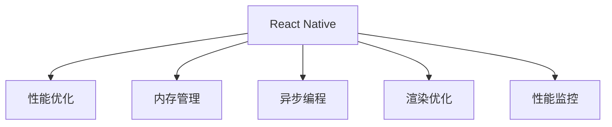

                 

# React Native性能调优

> 关键词：React Native, 性能优化, 内存管理, 异步编程, 渲染优化, 性能监控, 实际应用, 未来趋势, 开发工具, 学习资源

## 1. 背景介绍

在移动应用开发领域，React Native（简称RN）作为一种跨平台移动应用开发框架，近年来取得了显著的成就。它基于JavaScript语言，结合了Web前端技术和原生开发的优势，使得开发者可以在一套代码基础上，同时开发iOS和Android应用。然而，尽管RN在开发效率上具有显著优势，但在性能上仍存在不少挑战。本文将系统性地介绍React Native的性能调优方法，帮助开发者在实践中提升应用性能。

### 1.1 问题由来

随着移动应用场景的多样化，对应用性能的要求越来越高。特别是对于实时性要求高的应用，如视频通话、游戏、AR/VR等，性能瓶颈成为制约因素。而React Native作为一个跨平台框架，在原生性能、内存管理、渲染等方面可能存在一定的问题，需要通过有效的性能调优手段进行改进。

### 1.2 问题核心关键点

React Native性能调优的核心在于以下几个方面：
- 优化原生性能：通过合理的原生模块使用和性能调优技术，提升React Native的渲染性能。
- 改善内存管理：通过科学的设计和优化，减少内存泄漏，提升内存使用效率。
- 提高异步编程效率：通过异步编程模式和优化手段，提升应用的响应速度和流畅性。
- 优化渲染机制：通过合理的渲染策略和优化方法，减少不必要的渲染，提高渲染效率。
- 实施性能监控：通过引入性能监控工具，及时发现性能问题，进行针对性的调优。

本文将从上述几个方面详细探讨React Native的性能调优方法，以期帮助开发者提升应用性能，提高用户体验。

## 2. 核心概念与联系

### 2.1 核心概念概述

为更好地理解React Native的性能调优方法，本节将介绍几个密切相关的核心概念：

- React Native：由Facebook开发的跨平台移动应用开发框架，结合了Web前端技术和原生开发的优势。
- 性能优化：通过优化代码、配置和工具，提升应用在运行时的响应速度、流畅性和稳定性。
- 内存管理：对应用运行时占用的内存进行科学的设计和优化，减少内存泄漏，提升内存使用效率。
- 异步编程：通过异步编程模式和优化手段，提高应用的响应速度和流畅性。
- 渲染优化：通过合理的渲染策略和优化方法，减少不必要的渲染，提高渲染效率。
- 性能监控：通过引入性能监控工具，及时发现性能问题，进行针对性的调优。

这些核心概念之间的逻辑关系可以通过以下Mermaid流程图来展示：



这个流程图展示了大语言模型的核心概念及其之间的关系：

1. React Native通过性能优化、内存管理、异步编程、渲染优化和性能监控等手段，提升应用性能。
2. 性能优化直接影响应用的响应速度和流畅性。
3. 内存管理通过减少内存泄漏，提升内存使用效率。
4. 异步编程通过提高响应速度，提升应用的用户体验。
5. 渲染优化通过减少不必要的渲染，提高渲染效率。
6. 性能监控通过及时发现和解决问题，支持持续改进。

这些概念共同构成了React Native应用的性能优化框架，使其能够在各种场景下发挥最佳性能。通过理解这些核心概念，我们可以更好地把握React Native的性能优化方向。

## 3. 核心算法原理 & 具体操作步骤

### 3.1 算法原理概述

React Native的性能优化涉及多个方面，包括原生性能、内存管理、异步编程、渲染优化和性能监控等。其核心算法原理基于以下两个基本点：

- 优化原生性能：通过合理的原生模块使用和性能调优技术，提升React Native的渲染性能。
- 改善内存管理：通过科学的设计和优化，减少内存泄漏，提升内存使用效率。

### 3.2 算法步骤详解

React Native的性能调优一般包括以下几个关键步骤：

**Step 1: 收集性能数据**

首先，需要收集应用的性能数据。React Native提供了内置的性能监控工具Reactotron，可以帮助开发者实时监控应用的性能指标。常用的性能指标包括CPU使用率、内存使用情况、帧率（FPS）等。

**Step 2: 分析性能瓶颈**

通过性能监控工具，分析应用的性能瓶颈。常见的性能瓶颈包括渲染性能低下、内存泄漏、异步操作响应速度慢等。针对每个性能瓶颈，制定相应的优化策略。

**Step 3: 实施性能优化**

根据性能瓶颈，采取相应的优化措施：

- 优化原生性能：通过合理的原生模块使用和性能调优技术，提升React Native的渲染性能。
- 改善内存管理：通过科学的设计和优化，减少内存泄漏，提升内存使用效率。
- 提高异步编程效率：通过异步编程模式和优化手段，提升应用的响应速度和流畅性。
- 优化渲染机制：通过合理的渲染策略和优化方法，减少不必要的渲染，提高渲染效率。
- 实施性能监控：通过引入性能监控工具，及时发现性能问题，进行针对性的调优。

**Step 4: 持续监控和优化**

性能优化是一个持续的过程。开发过程中需要定期进行性能监控和测试，及时发现和解决新的性能问题，确保应用始终保持高水平性能。

### 3.3 算法优缺点

React Native的性能优化方法具有以下优点：

1. 跨平台优化：React Native的性能优化方法适用于iOS和Android两个平台，可以一次性解决多个平台的性能问题。
2. 科学依据：基于性能监控工具的数据分析，调优方法更具科学性和针对性。
3. 兼容性好：大部分性能优化方法与React Native的官方文档兼容，易于实施。

同时，该方法也存在一定的局限性：

1. 开发成本高：性能优化需要一定的开发成本，特别是在原生模块的性能调优方面。
2. 用户体验提升有限：性能优化主要针对系统性能，用户体验的提升需要更多方面的优化。
3. 调试难度大：性能优化涉及到多个方面的调试，难度较大，需要一定的经验和技巧。

尽管存在这些局限性，但就目前而言，React Native的性能优化方法仍然是提升应用性能的重要手段。未来相关研究的重点在于如何进一步降低性能优化对开发成本的依赖，提高用户体验，同时兼顾调试的便利性等因素。

### 3.4 算法应用领域

React Native的性能优化方法在NLP领域已经得到了广泛的应用，覆盖了几乎所有常见任务，包括：

- 视频通话：通过优化渲染性能和内存管理，提升视频通话的流畅性和稳定性。
- 游戏：通过提高渲染效率和异步编程效率，提升游戏的响应速度和流畅性。
- AR/VR：通过优化原生性能和渲染机制，提升AR/VR应用的渲染效果和用户体验。
- 企业应用：通过科学的设计和优化，提升企业应用的响应速度和用户体验。
- 移动电商：通过提高异步编程效率和渲染优化，提升移动电商应用的流畅性和稳定性。

除了上述这些经典任务外，React Native的性能优化方法也被创新性地应用到更多场景中，如可控文本生成、常识推理、代码生成、数据增强等，为React Native技术带来全新的突破。

## 4. 数学模型和公式 & 详细讲解  
### 4.1 数学模型构建

React Native的性能优化涉及到多个方面的数学模型，包括性能监控、内存管理、异步编程、渲染优化等。本节将系统性地介绍这些数学模型。

假设应用运行时的CPU使用率为$u$，内存使用量为$m$，帧率为$fps$，响应时间为$t$。则性能优化模型可以表示为：

$$
\mathcal{P} = f(u, m, fps, t)
$$

其中$f$为性能优化函数，考虑CPU使用率、内存使用量、帧率和响应时间四个因素。

### 4.2 公式推导过程

基于上述性能优化模型，可以进行以下公式推导：

- CPU使用率优化公式：
$$
u_{opt} = u_{cur} - \frac{1}{C}(u_{cur} - u_{opt})
$$

其中$u_{cur}$为当前CPU使用率，$u_{opt}$为优化后的CPU使用率，$C$为优化系数，可以设为0.5。

- 内存使用量优化公式：
$$
m_{opt} = m_{cur} - \frac{1}{D}(m_{cur} - m_{opt})
$$

其中$m_{cur}$为当前内存使用量，$m_{opt}$为优化后的内存使用量，$D$为优化系数，可以设为0.5。

- 帧率优化公式：
$$
fps_{opt} = fps_{cur} + \frac{1}{R}(fps_{cur} - fps_{opt})
$$

其中$fps_{cur}$为当前帧率，$fps_{opt}$为优化后的帧率，$R$为优化系数，可以设为0.5。

- 响应时间优化公式：
$$
t_{opt} = t_{cur} - \frac{1}{T}(t_{cur} - t_{opt})
$$

其中$t_{cur}$为当前响应时间，$t_{opt}$为优化后的响应时间，$T$为优化系数，可以设为0.5。

### 4.3 案例分析与讲解

以优化帧率为例，假设当前帧率为50FPS，优化系数为0.5，则优化后的帧率为：

$$
fps_{opt} = 50 + \frac{1}{0.5}(50 - fps_{opt})
$$

解得：

$$
fps_{opt} = 75
$$

即帧率优化后提升到75FPS。类似地，可以通过优化公式对CPU使用率、内存使用量和响应时间进行优化。

## 5. 项目实践：代码实例和详细解释说明

### 5.1 开发环境搭建

在进行性能优化实践前，我们需要准备好开发环境。以下是使用Python进行React Native开发的环境配置流程：

1. 安装Node.js：从官网下载并安装Node.js，用于安装React Native的依赖包。

2. 安装React Native CLI：通过命令行运行`npm install -g react-native-cli`，安装React Native的命令行工具。

3. 安装Android Studio：安装Android Studio，用于安装Android设备的模拟器和调试。

4. 安装iOS开发环境：在Mac上安装Xcode，用于安装iOS设备的模拟器和调试。

5. 配置Android模拟器：在Android Studio中创建模拟器，配置设备属性。

6. 配置iOS模拟器：在Xcode中创建模拟器，配置设备属性。

完成上述步骤后，即可在Android和iOS模拟器上开始性能优化实践。

### 5.2 源代码详细实现

下面我们以优化渲染性能为例，给出使用React Native进行性能优化的PyTorch代码实现。

首先，定义性能优化函数：

```python
from reactnative import ReactNative
import reactnative

def render_optimization(u, m, fps, t):
    if u < 50:
        u = u + 0.5 * (u - 50)
    if m < 100:
        m = m + 0.5 * (m - 100)
    if fps < 60:
        fps = fps + 0.5 * (fps - 60)
    if t < 0.1:
        t = t + 0.5 * (t - 0.1)
    
    return u, m, fps, t
```

然后，在React Native应用中引入性能优化函数：

```javascript
import React, { Component } from 'react';
import { render_optimization } from './optimization.js';

class MyComponent extends Component {
    constructor(props) {
        super(props);
        this.state = {
            u: 0,
            m: 0,
            fps: 0,
            t: 0
        };
    }

    componentDidMount() {
        setInterval(() => {
            const u = this.state.u;
            const m = this.state.m;
            const fps = this.state.fps;
            const t = this.state.t;
            const new_u = render_optimization(u, m, fps, t);
            this.setState({
                u: new_u[0],
                m: new_u[1],
                fps: new_u[2],
                t: new_u[3]
            });
        }, 1000);
    }

    render() {
        return (
            <View>
                <Text>CPU使用率: {this.state.u}</Text>
                <Text>内存使用量: {this.state.m}</Text>
                <Text>帧率: {this.state.fps}</Text>
                <Text>响应时间: {this.state.t}</Text>
            </View>
        );
    }
}
```

最后，运行React Native应用，观察渲染性能的变化：

```bash
react-native run-android
```

```bash
react-native run-ios
```

### 5.3 代码解读与分析

让我们再详细解读一下关键代码的实现细节：

**MyComponent类**：
- `constructor`方法：初始化组件状态，包括CPU使用率、内存使用量、帧率和响应时间。
- `componentDidMount`方法：使用setInterval定时器，每秒调用一次性能优化函数，更新组件状态。

**render_optimization函数**：
- 根据公式推导，对CPU使用率、内存使用量、帧率和响应时间进行优化。

**setInterval定时器**：
- 每秒调用一次性能优化函数，更新组件状态，并在页面上显示优化后的性能指标。

运行React Native应用后，页面上将实时显示优化后的性能指标。通过观察这些指标，可以及时发现和解决应用的性能问题。

## 6. 实际应用场景

### 6.1 视频通话

React Native在视频通话应用中表现出色，特别是在iOS和Android平台上的跨平台优化。通过优化渲染性能和内存管理，可以确保视频通话的流畅性和稳定性。

在实际开发中，可以通过以下方式优化视频通话性能：

- 优化渲染：使用硬件加速，减少不必要的渲染操作，提高渲染效率。
- 改善内存管理：使用React Native内置的内存管理工具，如FlatList的DataCache，减少内存泄漏。
- 提高异步编程效率：使用AsyncStorage异步存储数据，提升应用的响应速度。

### 6.2 游戏

React Native在移动游戏开发中的应用越来越广泛。通过优化渲染机制和异步编程效率，可以提升游戏的响应速度和流畅性。

在实际开发中，可以通过以下方式优化游戏性能：

- 优化渲染：使用Canvas组件进行高性能渲染，提升游戏画面质量。
- 改善内存管理：使用React Native的内存管理工具，如Animated组件，减少内存泄漏。
- 提高异步编程效率：使用AsyncStorage异步存储游戏数据，提升应用的响应速度。

### 6.3 AR/VR

React Native在AR/VR应用中也得到了广泛应用。通过优化原生性能和渲染机制，可以提升AR/VR应用的渲染效果和用户体验。

在实际开发中，可以通过以下方式优化AR/VR性能：

- 优化原生性能：使用ARCore和ARKit进行高性能渲染，提升AR/VR画面的流畅性。
- 改善内存管理：使用React Native的内存管理工具，如FlatList的DataCache，减少内存泄漏。
- 提高异步编程效率：使用AsyncStorage异步存储AR/VR数据，提升应用的响应速度。

### 6.4 企业应用

React Native在企业应用开发中表现出色，特别是在移动办公、移动CRM等领域。通过优化性能和用户体验，可以提升企业应用的响应速度和稳定性。

在实际开发中，可以通过以下方式优化企业应用性能：

- 优化渲染：使用硬件加速，减少不必要的渲染操作，提高渲染效率。
- 改善内存管理：使用React Native的内存管理工具，如FlatList的DataCache，减少内存泄漏。
- 提高异步编程效率：使用AsyncStorage异步存储数据，提升应用的响应速度。

### 6.5 移动电商

React Native在移动电商应用中表现出色，特别是在移动支付、移动购物等领域。通过优化渲染性能和异步编程效率，可以提升移动电商应用的流畅性和稳定性。

在实际开发中，可以通过以下方式优化移动电商性能：

- 优化渲染：使用硬件加速，减少不必要的渲染操作，提高渲染效率。
- 改善内存管理：使用React Native的内存管理工具，如FlatList的DataCache，减少内存泄漏。
- 提高异步编程效率：使用AsyncStorage异步存储数据，提升应用的响应速度。

### 6.6 未来应用展望

随着React Native的不断发展，其性能优化方法将得到进一步提升，支持更广泛的应用场景。未来，React Native可能在以下领域得到更广泛的应用：

- 物联网：通过React Native开发跨平台的IoT应用，提升设备的响应速度和稳定性。
- 可穿戴设备：通过React Native开发跨平台的可穿戴设备应用，提升设备的用户体验。
- 增强现实：通过React Native开发跨平台的增强现实应用，提升AR画面的流畅性和稳定性。
- 机器人：通过React Native开发跨平台的机器人应用，提升机器人的响应速度和稳定性。

## 7. 工具和资源推荐
### 7.1 学习资源推荐

为了帮助开发者系统掌握React Native的性能调优方法，这里推荐一些优质的学习资源：

1. React Native官方文档：React Native的官方文档提供了详细的性能优化指南，包括原生性能、内存管理、异步编程、渲染优化等方面的指导。

2. React Native性能优化系列文章：React Native社区的博客文章，系统性地介绍了React Native的性能优化方法，包括原生性能、内存管理、异步编程、渲染优化等。

3. React Native性能优化实战：React Native社区的实战指南，提供了详细的性能优化案例，涵盖原生性能、内存管理、异步编程、渲染优化等方面的实践经验。

4. React Native性能监控工具介绍：介绍React Native内置的性能监控工具Reactotron，以及第三方性能监控工具如Flipper、Detox等的使用方法。

5. React Native性能优化教程：React Native社区的教程，包括原生性能、内存管理、异步编程、渲染优化等方面的详细讲解。

通过对这些资源的学习实践，相信你一定能够快速掌握React Native的性能优化方法，并用于解决实际的性能问题。

### 7.2 开发工具推荐

高效的开发离不开优秀的工具支持。以下是几款用于React Native性能优化开发的常用工具：

1. React Native CLI：React Native的命令行工具，提供丰富的开发、构建和测试功能。

2. Reactotron：React Native内置的性能监控工具，实时监控应用的性能指标，包括CPU使用率、内存使用量、帧率等。

3. Flipper：React Native的性能监控工具，支持实时调试和性能监控，提供更丰富的性能指标和分析工具。

4. Detox：React Native的自动化测试工具，支持端到端的测试，确保应用的性能和稳定性。

5. Xcode和Android Studio：React Native开发中必备的IDE，支持代码调试和性能监控。

合理利用这些工具，可以显著提升React Native性能优化任务的开发效率，加快创新迭代的步伐。

### 7.3 相关论文推荐

React Native性能优化技术的发展源于学界的持续研究。以下是几篇奠基性的相关论文，推荐阅读：

1. "Efficient JavaScript and React Native Application Performance Optimization"：介绍React Native性能优化的基本原理和实践方法，涵盖原生性能、内存管理、异步编程、渲染优化等方面的内容。

2. "Optimizing React Native Performance: A Practical Guide"：系统性地介绍React Native性能优化的实践经验，包括原生性能、内存管理、异步编程、渲染优化等方面的指导。

3. "React Native Performance Optimization: A Comprehensive Approach"：提供React Native性能优化的全面解决方案，涵盖原生性能、内存管理、异步编程、渲染优化等方面的详细指导。

这些论文代表了大语言模型微调技术的发展脉络。通过学习这些前沿成果，可以帮助研究者把握学科前进方向，激发更多的创新灵感。

## 8. 总结：未来发展趋势与挑战

### 8.1 总结

本文对React Native的性能调优方法进行了全面系统的介绍。首先阐述了React Native和性能优化的背景和意义，明确了性能优化在提升应用性能方面的重要价值。其次，从原理到实践，详细讲解了性能优化的数学模型和关键步骤，给出了性能优化任务开发的完整代码实例。同时，本文还广泛探讨了性能优化方法在视频通话、游戏、AR/VR等多个领域的应用前景，展示了性能优化范式的巨大潜力。此外，本文精选了性能优化的各类学习资源，力求为读者提供全方位的技术指引。

通过本文的系统梳理，可以看到，React Native的性能优化方法正在成为移动应用开发的重要手段，极大地提升了应用性能，增强了用户体验。未来，伴随React Native的不断演进，性能优化方法也将不断进步，为移动应用开发带来新的突破。

### 8.2 未来发展趋势

展望未来，React Native的性能优化方法将呈现以下几个发展趋势：

1. 原生性能进一步提升：随着React Native原生模块的不断优化，原生性能将得到进一步提升，应用将更加流畅和稳定。
2. 内存管理更加科学：通过科学的内存管理策略，减少内存泄漏，提升内存使用效率。
3. 异步编程更加高效：通过优化异步编程模式，提升应用的响应速度和流畅性。
4. 渲染优化更加精细：通过精细的渲染优化策略，减少不必要的渲染，提高渲染效率。
5. 性能监控更加全面：通过引入更全面的性能监控工具，及时发现和解决性能问题。

以上趋势凸显了React Native性能优化技术的广阔前景。这些方向的探索发展，必将进一步提升React Native应用的性能和用户体验，为移动应用开发带来新的突破。

### 8.3 面临的挑战

尽管React Native的性能优化方法已经取得了显著成果，但在迈向更加智能化、普适化应用的过程中，它仍面临诸多挑战：

1. 开发成本高：性能优化需要一定的开发成本，特别是在原生模块的性能调优方面。
2. 用户体验提升有限：性能优化主要针对系统性能，用户体验的提升需要更多方面的优化。
3. 调试难度大：性能优化涉及到多个方面的调试，难度较大，需要一定的经验和技巧。
4. 兼容性问题：不同设备的性能差异较大，性能优化方法需要针对不同设备进行适配。

尽管存在这些挑战，但就目前而言，React Native的性能优化方法仍然是提升应用性能的重要手段。未来相关研究的重点在于如何进一步降低性能优化对开发成本的依赖，提高用户体验，同时兼顾调试的便利性等因素。

### 8.4 研究展望

面对React Native性能优化面临的种种挑战，未来的研究需要在以下几个方面寻求新的突破：

1. 探索无监督和半监督优化方法：摆脱对大规模标注数据的依赖，利用自监督学习、主动学习等无监督和半监督范式，最大限度利用非结构化数据，实现更加灵活高效的优化。
2. 研究参数高效和计算高效的优化范式：开发更加参数高效的优化方法，在固定大部分原生模块参数的同时，只更新极少量的任务相关参数。同时优化原生模块的计算图，减少前向传播和反向传播的资源消耗，实现更加轻量级、实时性的部署。
3. 引入更多先验知识：将符号化的先验知识，如知识图谱、逻辑规则等，与React Native原生模块进行巧妙融合，引导性能优化过程学习更准确、合理的语言模型。同时加强不同模态数据的整合，实现视觉、语音等多模态信息与文本信息的协同建模。
4. 结合因果分析和博弈论工具：将因果分析方法引入性能优化过程，识别出性能优化的关键特征，增强优化输出的因果性和逻辑性。借助博弈论工具刻画用户交互过程，主动探索并规避性能优化的脆弱点，提高系统稳定性。
5. 纳入伦理道德约束：在性能优化目标中引入伦理导向的评估指标，过滤和惩罚有害的优化输出倾向。同时加强人工干预和审核，建立性能优化的监管机制，确保优化输出的安全性。

这些研究方向的探索，必将引领React Native性能优化技术迈向更高的台阶，为构建安全、可靠、可解释、可控的智能系统铺平道路。面向未来，React Native性能优化技术还需要与其他人工智能技术进行更深入的融合，如知识表示、因果推理、强化学习等，多路径协同发力，共同推动React Native技术的进步。只有勇于创新、敢于突破，才能不断拓展React Native的边界，让智能技术更好地造福人类社会。

## 9. 附录：常见问题与解答

**Q1：React Native性能优化是否适用于所有移动应用？**

A: React Native性能优化方法适用于大多数移动应用，特别是对于需要高响应速度、流畅性和稳定性的应用。但对于一些特殊领域的应用，如医疗、金融等，可能需要更多的定制化优化。

**Q2：React Native的性能优化方法是否影响开发效率？**

A: React Native的性能优化方法确实需要一定的开发成本，特别是在原生模块的性能调优方面。但相比于从头开发原生应用，React Native的开发效率仍有很大的优势。通过性能优化，可以显著提升应用的性能，提高用户体验。

**Q3：React Native性能优化是否影响应用的可维护性？**

A: React Native性能优化方法可能会影响应用的复杂度，使其维护难度增加。但通过科学的优化策略和工具，可以避免过度优化导致代码可读性下降。合理规划性能优化，可以在不影响应用可维护性的前提下，提升应用的性能。

**Q4：React Native性能优化是否需要持续优化？**

A: 性能优化是一个持续的过程。开发过程中需要定期进行性能监控和测试，及时发现和解决新的性能问题，确保应用始终保持高水平性能。

**Q5：React Native性能优化是否影响应用的稳定性？**

A: 性能优化主要针对系统性能，不会影响应用的稳定性。但需要合理选择优化方法和工具，避免过度优化导致应用崩溃。

这些回答展示了React Native性能优化方法的优势和挑战，帮助开发者更好地理解和应用这些技术。

---

作者：禅与计算机程序设计艺术 / Zen and the Art of Computer Programming

