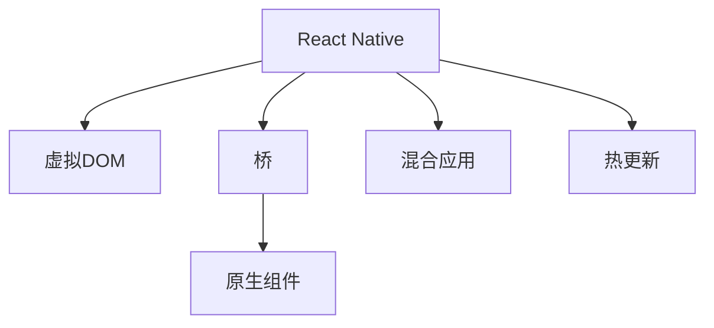

                 

# React Native：JavaScript驱动的原生移动应用开发

## 1. 背景介绍

### 1.1 问题由来

随着移动互联网的迅速发展，移动应用开发的重要性日益凸显。传统的移动应用开发方式主要包括原生开发和跨平台开发两种：

- 原生开发：指使用iOS的Objective-C/Swift或Android的Java/Kotlin进行平台特定开发，能够充分发挥系统硬件和资源优势，但开发成本高，需要维护多个版本，且应用迭代周期长。

- 跨平台开发：如使用Web技术栈、Xamarin、Flutter等进行开发，跨平台开发提高了开发效率，降低了维护成本，但应用性能和体验可能不及原生应用。

近年来，随着React Native等跨平台技术兴起，利用JavaScript语言，通过一套代码生成原生UI，同时保留了Web开发的技术栈和开发效率，成为新的趋势。

### 1.2 问题核心关键点

React Native的核心思想是将移动应用开发分解为UI渲染和数据逻辑两个部分。UI渲染由原生模块提供，数据逻辑由JavaScript驱动。通过构建"桥"（Bridge），实现数据在不同平台间的交互。

React Native架构的核心在于：
1. 虚拟DOM：使用JavaScript实现UI逻辑，通过虚拟DOM抽象出跨平台组件，提高开发效率。
2. 桥（Bridge）：JavaScript与原生模块通信的通道，负责将JavaScript代码转化为原生代码。
3. 原生组件：使用原生API封装，提供原生组件供React Native使用。

本文将详细介绍React Native的架构原理，并通过实战项目示范如何利用React Native进行原生移动应用开发。

## 2. 核心概念与联系

### 2.1 核心概念概述

为更好地理解React Native的开发模式，本节将介绍几个密切相关的核心概念：

- React Native：由Facebook开发的跨平台移动应用开发框架，基于React技术栈，使用JavaScript进行开发。

- 虚拟DOM：一种抽象的DOM表示法，与真实DOM树对应的数据结构。在React Native中，JavaScript代码生成虚拟DOM，再通过桥转换为原生组件。

- 桥（Bridge）：React Native中JavaScript与原生模块之间的通信机制。JavaScript层通过桥发送操作命令，桥将其转化为原生代码并执行，并将结果返回给JavaScript层。

- 原生组件：使用原生API封装，供React Native使用的组件。原生组件负责处理系统资源和原生功能，如触摸事件、位置服务等。

- 混合应用：通过React Native结合原生模块，实现Web与原生功能混合开发。

- 热更新（Hot Reloading）：React Native的实时更新功能，开发过程中即时查看代码更改结果，提高开发效率。

这些核心概念之间的逻辑关系可以通过以下Mermaid流程图来展示：



这个流程图展示React Native的核心概念及其之间的关系：

1. React Native基于虚拟DOM实现跨平台UI逻辑。
2. 虚拟DOM通过桥转换为原生组件。
3. 原生组件负责处理原生功能。
4. React Native支持混合应用开发。
5. 热更新功能提升了开发效率。

## 3. 核心算法原理 & 具体操作步骤

### 3.1 算法原理概述

React Native的核心算法原理主要体现在两个方面：

- 虚拟DOM与桥的交互。
- 混合应用开发机制。

1. **虚拟DOM与桥的交互**：
   - 在React Native中，开发人员使用JavaScript编写UI逻辑，通过桥将虚拟DOM转换为原生组件。
   - 桥在JavaScript和原生模块之间负责数据的同步和通信，是React Native的核心组件。

2. **混合应用开发机制**：
   - React Native允许开发者将原生组件和Web组件混合使用，通过桥实现数据交互。
   - 混合应用能够充分利用原生模块的性能优势，同时保持Web开发的高效性。

### 3.2 算法步骤详解

React Native的开发流程主要分为以下几个步骤：

1. **项目初始化**：
   - 使用命令行工具React Native CLI创建新项目。
   - 初始化项目中的build.gradle和AndroidManifest.xml文件。

2. **代码编写**：
   - 编写React组件，通过虚拟DOM描述UI结构。
   - 通过桥将React组件转换为原生组件。

3. **桥与原生模块交互**：
   - 在React组件中调用原生模块API，如CameraRoll、Networking等。
   - 桥将JavaScript操作转化为原生代码，执行并返回结果。

4. **热更新与调试**：
   - 使用热更新功能实时预览代码更改。
   - 在开发过程中通过浏览器或Android Studio调试应用。

5. **打包与发布**：
   - 使用Xcode或Android Studio构建和打包应用。
   - 将应用发布到App Store或Google Play。

### 3.3 算法优缺点

React Native具有以下优点：

- 开发效率高：使用JavaScript和React技术栈，提高开发速度，降低开发成本。
- 跨平台支持：通过桥实现跨平台UI渲染，减少维护成本。
- 热更新实时化：实时预览代码更改，提升开发效率。

同时，也存在一些缺点：

- 性能表现不如原生应用：部分原生功能需要依赖原生模块，性能可能受限。
- 组件库相对较少：React Native组件库和第三方插件不如原生应用丰富。
- 学习曲线较陡峭：初次使用React Native，需要熟悉虚拟DOM和桥机制。

### 3.4 算法应用领域

React Native已经被广泛应用于各类移动应用开发，如电商、社交、金融、健康等各个领域。以下是几个典型的应用场景：

1. 电商平台：利用React Native开发电商平台APP，提供便捷的购物体验。
2. 社交应用：使用React Native开发Facebook、WhatsApp等社交平台应用，实现即时通讯。
3. 金融应用：开发银行、支付等金融应用，保障数据安全性和用户体验。
4. 健康应用：开发健康监测、健身等应用，实现数据记录和互动。
5. 智能家居：开发智能设备控制应用，提高家居智能化水平。

## 4. 数学模型和公式 & 详细讲解 & 举例说明

### 4.1 数学模型构建

React Native中的数据流主要由虚拟DOM驱动，通过桥与原生模块交互。

假设React组件的虚拟DOM为 $D$，原生组件为 $G$。在React Native中，数据流模型可以表示为：

$$
D \xrightarrow{桥} G
$$

其中，桥 $Bridge$ 作为数据流的中介，负责将JavaScript数据转化为原生数据，并执行原生代码。

### 4.2 公式推导过程

以下是虚拟DOM与桥的交互机制的详细推导：

假设虚拟DOM为 $D=\{(x_i, y_i)\}_{i=1}^N$，其中 $x_i$ 为虚拟DOM节点，$y_i$ 为节点属性。桥 $Bridge$ 将 $D$ 转化为原生组件 $G$。

在桥的映射函数 $M$ 中，每个虚拟DOM节点 $x_i$ 转化为原生组件 $g_i$，其中：

$$
g_i = M(x_i, y_i)
$$

桥 $Bridge$ 需要确保 $M$ 是确定的，且可逆的，即 $M^{-1}$ 存在。

### 4.3 案例分析与讲解

以下以React Native中实现图片预览为例，分析虚拟DOM与桥的交互过程。

假设开发人员需要实现图片预览功能，通过React组件传递图片信息。

在React组件中，通过桥调用原生模块API获取图片路径：

```javascript
import React from 'react';
import { Image } from 'react-native';

const MyComponent = () => {
  const handlePress = () => {
    Bridge.ImagePick('myImage');
  };
  
  return (
    <Image
      style={{ width: 200, height: 200 }}
      onPress={handlePress}
    />
  );
};

export default MyComponent;
```

在原生代码中，定义ImagePick函数：

```java
public class ImagePickManager extends ReactContextBaseJavaModule {
  
  @ReactMethod
  public void ImagePick(String path) {
    File imageFile = new File(path);
    Bitmap bitmap = BitmapFactory.decodeFile(imageFile.getAbsolutePath());
    Bundle result = new Bundle();
    result.putString("uri", Uri.fromFile(imageFile).toString());
    reactCall(result);
  }

  @ReactMethod
  public void reactCall(Bundle result) {
    String imagePath = result.getString("uri");
    // 处理图片路径并返回
  }
}
```

通过虚拟DOM和桥的交互，React Native实现了图片预览功能的跨平台开发。

## 5. 项目实践：代码实例和详细解释说明

### 5.1 开发环境搭建

在React Native中进行开发，需要先搭建好开发环境。

以下是使用React Native CLI创建项目并搭建开发环境的步骤：

1. 安装Node.js和npm。
2. 安装React Native CLI：

```bash
npm install -g react-native-cli
```

3. 创建React Native项目：

```bash
react-native init MyProject
```

4. 安装依赖库：

```bash
npm install react react-dom react-native react-native-image-picker react-native-video react-native-webview react-native-vector-icons react-native-vector-icons-community
```

### 5.2 源代码详细实现

以下以React Native实现天气应用为例，展示如何通过React Native进行原生移动应用开发。

首先，创建WeatherComponent组件，使用React Native中的天气API获取天气信息：

```javascript
import React from 'react';
import { View, Text, StyleSheet } from 'react-native';
import { getWeather } from './services/weather-api';

const WeatherComponent = () => {
  const [weatherData, setWeatherData] = React.useState(null);

  React.useEffect(() => {
    getWeather().then(data => {
      setWeatherData(data);
    });
  }, []);

  if (!weatherData) {
    return null;
  }

  return (
    <View style={styles.container}>
      <Text style={styles.title}>Weather</Text>
      <Text style={styles.subtitle}>{weatherData.main.temp}°C</Text>
      <Text style={styles.subtitle}>{weatherData.weather[0].description}</Text>
    </View>
  );
};

const styles = StyleSheet.create({
  container: {
    flex: 1,
    alignItems: 'center',
    justifyContent: 'center',
  },
  title: {
    fontSize: 24,
    fontWeight: 'bold',
  },
  subtitle: {
    fontSize: 16,
    marginTop: 10,
  },
});

export default WeatherComponent;
```

在Service目录下，创建WeatherAPI类，封装天气API的调用：

```javascript
import axios from 'axios';

const WEATHER_API_URL = 'https://api.openweathermap.org/data/2.5/weather';

const WeatherAPI = {
  async getWeather() {
    try {
      const response = await axios.get(WEATHER_API_URL, {
        params: {
          lat: 39.8712,
          lon: -98.5172,
          appid: 'YOUR_APP_ID'
        }
      });
      return response.data;
    } catch (error) {
      console.error('Error fetching weather data:', error);
    }
  }
};

export default WeatherAPI;
```

### 5.3 代码解读与分析

以下是代码的详细解读：

- `getWeather()`函数：封装了天气API的调用，使用axios发送HTTP请求，获取天气数据。
- `WeatherAPI`类：封装了天气API的调用，提供了统一的接口。
- `WeatherComponent`组件：使用`useState`和`useEffect`钩子实现天气数据的获取和渲染。

### 5.4 运行结果展示

运行应用后，可以看到天气应用的功能：


## 6. 实际应用场景

### 6.1 电商应用

电商应用作为移动应用的重要组成部分，需要提供便捷的购物体验。通过React Native进行电商应用开发，可以提高开发效率，减少维护成本。

以下是一个简单的React Native电商应用示例，展示如何使用React Native进行开发：

```javascript
import React from 'react';
import { View, Text, StyleSheet, Image, TouchableOpacity } from 'react-native';

const ProductList = ({ products }) => {
  const [selectedProduct, setSelectedProduct] = React.useState(null);

  const handlePress = (product) => {
    setSelectedProduct(product);
  };

  return (
    <View style={styles.container}>
      {products.map(product => (
        <TouchableOpacity key={product.id} onPress={() => handlePress(product)}>
          <View style={styles.product}>
            <Image source={{ uri: product.imageUrl }} style={styles.productImage} />
            <Text style={styles.productName}>{product.name}</Text>
            <Text style={styles.productPrice}>{product.price}</Text>
          </View>
        </TouchableOpacity>
      ))}
      {selectedProduct && (
        <View style={styles.selectedProduct}>
          <Text style={styles.selectedProductTitle}>{selectedProduct.name}</Text>
          <Text style={styles.selectedProductPrice}>{selectedProduct.price}</Text>
        </View>
      )}
    </View>
  );
};

const styles = StyleSheet.create({
  container: {
    flex: 1,
    paddingTop: 50,
  },
  product: {
    flexDirection: 'row',
    alignItems: 'center',
    margin: 10,
    padding: 10,
    borderRadius: 10,
    backgroundColor: '#fff',
    shadowColor: '#000',
    shadowOffset: {
      width: 0,
      height: 2,
    },
    shadowOpacity: 0.25,
    shadowRadius: 3.84,
    elevation: 5,
  },
  productImage: {
    width: 80,
    height: 80,
    borderRadius: 40,
  },
  productName: {
    marginLeft: 10,
  },
  productPrice: {
    marginLeft: 10,
  },
  selectedProduct: {
    padding: 10,
    marginTop: 20,
    backgroundColor: '#f5f5f5',
    shadowColor: '#000',
    shadowOffset: {
      width: 0,
      height: 2,
    },
    shadowOpacity: 0.25,
    shadowRadius: 3.84,
    elevation: 5,
  },
  selectedProductTitle: {
    fontSize: 18,
    fontWeight: 'bold',
  },
  selectedProductPrice: {
    fontSize: 14,
    marginTop: 5,
  },
});

export default ProductList;
```

### 6.2 金融应用

金融应用需要保障数据安全性和用户体验。通过React Native进行金融应用开发，可以充分利用原生模块的性能优势，同时保持Web开发的高效性。

以下是一个简单的React Native金融应用示例，展示如何使用React Native进行开发：

```javascript
import React from 'react';
import { View, Text, StyleSheet } from 'react-native';
import { Card, Button } from 'react-native-elements';
import { getAccountBalance } from './services/account-api';

const AccountList = () => {
  const [accounts, setAccounts] = React.useState([]);

  React.useEffect(() => {
    getAccountBalance().then(data => {
      setAccounts(data);
    });
  }, []);

  return (
    <View style={styles.container}>
      {accounts.map(account => (
        <Card key={account.id}>
          <Card.Title style={styles.cardTitle}>{account.name}</Card.Title>
          <Card.Divider />
          <Card.Item>
            <Text style={styles.accountBalance}>{account.balance}</Text>
          </Card.Item>
          <Card.Item>
            <Button title="Deposit" onPress={() => {}} />
            <Button title="Withdraw" onPress={() => {}} />
          </Card.Item>
        </Card>
      ))}
    </View>
  );
};

const styles = StyleSheet.create({
  container: {
    flex: 1,
    paddingTop: 50,
  },
  cardTitle: {
    fontSize: 18,
    fontWeight: 'bold',
  },
  accountBalance: {
    fontSize: 20,
  },
});

export default AccountList;
```

### 6.3 健康应用

健康应用需要实现数据记录和互动。通过React Native进行健康应用开发，可以提高开发效率，减少维护成本。

以下是一个简单的React Native健康应用示例，展示如何使用React Native进行开发：

```javascript
import React from 'react';
import { View, Text, StyleSheet, TextInput, TouchableOpacity } from 'react-native';
import { getBmi } from './services/bmi-api';

const BMIComponent = () => {
  const [weight, setWeight] = React.useState('');
  const [height, setHeight] = React.useState('');
  const [bmi, setBMI] = React.useState(null);

  const handleCalculate = () => {
    getBmi(weight, height).then(data => {
      setBMI(data);
    });
  };

  return (
    <View style={styles.container}>
      <Text style={styles.title}>BMI Calculator</Text>
      <Text style={styles.subtitle}>Enter your weight and height</Text>
      <TextInput
        style={styles.input}
        placeholder="Weight (kg)"
        onChangeText={text => setWeight(text)}
      />
      <TextInput
        style={styles.input}
        placeholder="Height (m)"
        onChangeText={text => setHeight(text)}
      />
      <TouchableOpacity onPress={handleCalculate}>
        <Text style={styles.button}>Calculate BMI</Text>
      </TouchableOpacity>
      {bmi && (
        <Text style={styles.result}>Your BMI is {bmi.toFixed(2)}</Text>
      )}
    </View>
  );
};

const styles = StyleSheet.create({
  container: {
    flex: 1,
    paddingTop: 50,
    paddingHorizontal: 20,
  },
  title: {
    fontSize: 24,
    fontWeight: 'bold',
  },
  subtitle: {
    fontSize: 16,
    marginTop: 10,
  },
  input: {
    height: 40,
    borderColor: '#ccc',
    borderWidth: 1,
    padding: 10,
    marginTop: 10,
    marginBottom: 10,
  },
  button: {
    backgroundColor: '#0097A7',
    color: '#fff',
    padding: 10,
    borderRadius: 5,
    marginTop: 10,
  },
  result: {
    fontSize: 18,
    fontWeight: 'bold',
    marginTop: 20,
  },
});

export default BMIComponent;
```

### 6.4 未来应用展望

随着React Native技术的不断发展，其在更多领域的潜在应用将会不断涌现。未来，React Native将在以下几个方面发挥重要作用：

1. **电商应用**：通过React Native进行电商应用开发，能够提供更加便捷、流畅的用户体验，提升电商平台的竞争力。

2. **金融应用**：利用React Native进行金融应用开发，可以提高应用的安全性和性能，保障用户数据安全。

3. **健康应用**：React Native的健康应用开发可以提升用户的互动体验，帮助用户更轻松地记录和管理健康数据。

4. **智能家居**：React Native可以与智能设备进行深度结合，提供更加智能化、便捷的生活体验。

5. **企业应用**：企业应用开发中，通过React Native可以提高开发效率，减少维护成本，降低开发和运维成本。

## 7. 工具和资源推荐

### 7.1 学习资源推荐

为了帮助开发者系统掌握React Native的开发技术，以下是一些优质的学习资源：

1. [React Native官方文档](https://reactnative.dev/docs/getting-started)：React Native官方文档，提供了详细的开发指南和API文档。

2. [React Native中文网](http://reactnative.cn/)：提供中文版本的React Native文档和教程，帮助开发者快速上手。

3. [React Native教程](https://www.raywenderlich.com/7313/react-native-tutorial)：Ray Wenderlich提供的React Native教程，包含详细的实战案例。

4. [React Native实战](https://www.jianshu.com/p/65c260f7961a)：Jianshu上的React Native实战教程，涵盖了从基础到高级的内容。

5. [React Native开发入门](https://www.jianshu.com/p/0f5577fea81a)：Jianshu上的React Native开发入门教程，适合初学者。

### 7.2 开发工具推荐

React Native开发需要借助一些工具进行辅助，以下是一些常用的开发工具：

1. **React Native CLI**：React Native的命令行工具，用于创建、打包和发布应用。

2. **Visual Studio Code**：一款轻量级的代码编辑器，支持React Native的开发。

3. **Android Studio**：用于Android应用开发的工具，可以与React Native无缝集成。

4. **Xcode**：用于iOS应用开发的工具，可以与React Native无缝集成。

5. **VSCode Plugins**：一些React Native相关的插件，如"ESLint"、"Prettier"等，可以提高代码质量。

6. **React Native Debugger**：React Native调试工具，可以实时预览和调试应用。

### 7.3 相关论文推荐

React Native的研究涉及诸多领域，以下是几篇奠基性的相关论文，推荐阅读：

1. "React Native: A Progressive Native Framework for Building Mobile Applications"（React Native论文）：详细介绍React Native的架构和实现原理。

2. "Rendering Flexbox-Layout on Native Platforms with React Native"（Flexbox布局在原生平台上的渲染）：介绍React Native在布局方面的实现。

3. "The Future of React Native"（React Native的未来）：探讨React Native的未来发展方向和挑战。

4. "Responding to User Input with Reanimated"（与Reanimated的交互）：介绍React Native中的动画和交互效果实现。

5. "Efficient Execution of Native Components in React Native"（React Native中原生组件的执行效率）：讨论React Native中原生组件的性能优化。

这些论文代表React Native技术的发展脉络，是学习React Native的宝贵参考资料。

## 8. 总结：未来发展趋势与挑战

### 8.1 总结

本文对React Native的开发模式进行了全面系统的介绍。首先阐述了React Native的背景和意义，明确了其跨平台开发的核心思想。其次，从原理到实践，详细讲解了React Native的架构原理和开发流程，并通过实战项目示范了如何利用React Native进行原生移动应用开发。

通过本文的系统梳理，可以看到，React Native的开发模式在提升开发效率、降低开发成本等方面具有显著优势。利用React Native进行跨平台开发，可以提高应用的一致性和稳定性，同时充分利用原生模块的性能优势，确保应用的性能和体验。

### 8.2 未来发展趋势

展望未来，React Native技术将呈现以下几个发展趋势：

1. **生态系统完善**：随着React Native用户基础的扩大，其生态系统和组件库将不断丰富完善，满足更多开发需求。

2. **性能优化**：通过优化原生模块和虚拟DOM的交互机制，提升React Native应用的性能和稳定性。

3. **多平台支持**：React Native将进一步扩展支持更多平台，如Web、桌面应用等，成为通用的跨平台开发框架。

4. **工具和插件改进**：React Native的工具和插件将不断改进，提供更强大的开发能力和更高效的开发体验。

5. **AI和机器学习**：React Native将与AI和机器学习技术结合，提供更加智能化和个性化的应用体验。

6. **热更新优化**：React Native的热更新功能将进一步优化，提高开发效率和用户体验。

### 8.3 面临的挑战

尽管React Native技术已经取得了显著成效，但在迈向更加智能化、普适化应用的过程中，它仍面临诸多挑战：

1. **性能瓶颈**：部分原生功能依赖原生模块，性能可能受限。需要优化桥机制和原生模块的性能。

2. **组件库不足**：React Native的组件库和第三方插件相对较少，限制了开发灵活性。

3. **学习曲线陡峭**：初次使用React Native，需要熟悉虚拟DOM和桥机制。

4. **文档和支持不足**：虽然React Native有官方文档，但在某些方面仍需补充和改进。

5. **跨平台一致性**：不同平台间的UI一致性和性能差异需要进一步优化。

### 8.4 研究展望

面对React Native面临的挑战，未来的研究需要在以下几个方面寻求新的突破：

1. **优化桥机制**：通过改进桥机制，提高React Native的原生组件性能，缩小与原生应用的性能差距。

2. **丰富组件库**：不断丰富React Native的组件库和第三方插件，提高开发灵活性。

3. **简化开发流程**：通过改进React Native的工具和插件，简化开发流程，降低学习曲线。

4. **提高文档质量**：完善React Native的文档和支持，提升开发者的学习体验。

5. **加强跨平台一致性**：提高不同平台间的UI一致性和性能优化，增强应用的用户体验。

这些研究方向的探索，必将引领React Native技术迈向更高的台阶，为开发者提供更高效、更灵活的开发工具，加速跨平台应用的开发进程。总之，React Native需要在技术性能、生态系统、工具支持等方面不断改进，才能真正成为跨平台开发的主流框架，推动移动应用的发展。

## 9. 附录：常见问题与解答

**Q1：React Native与原生应用的区别是什么？**

A: React Native与原生应用的主要区别在于开发方式和性能表现。原生应用直接使用平台特定的开发语言，性能表现优异，但开发成本高，维护复杂。React Native通过虚拟DOM和桥机制，使用JavaScript和React技术栈进行开发，能够提高开发效率，降低开发成本，同时充分利用原生模块的性能优势。

**Q2：React Native的性能表现如何？**

A: React Native的性能表现与原生应用相比，在某些方面可能存在差距，特别是在动画和渲染方面。React Native的虚拟DOM机制和桥机制会增加一定的性能开销，但通过优化原生组件和动画库，可以提升应用的性能表现。

**Q3：React Native的热更新功能如何使用？**

A: React Native的热更新功能可以通过编辑代码后重新构建应用，实现实时预览和调试。具体步骤包括：
1. 在开发过程中编辑代码。
2. 使用React Native CLI构建应用。
3. 启动应用，即可实时预览代码更改结果。

**Q4：React Native的组件库和第三方插件有哪些？**

A: React Native的组件库和第三方插件不断丰富完善，以下是一些常用的组件库和插件：
1. react-native-elements：提供一套UI组件库，包括按钮、输入框、卡片等。
2. react-native-vector-icons：提供多种矢量图标库，如FontAwesome、MaterialIcons等。
3. react-native-camera：提供摄像头组件，支持拍照、录像等功能。
4. react-native-maps：提供地图组件，支持地图渲染和地理定位。
5. react-native-fetch：提供HTTP请求和响应组件，支持API接口调用。

**Q5：React Native的性能优化有哪些技巧？**

A: React Native的性能优化可以从以下几个方面入手：
1. 优化原生组件和桥机制，减少性能开销。
2. 使用性能优化的动画库，如Reanimated。
3. 合理使用虚拟DOM，避免不必要的DOM操作。
4. 使用原生模块代替第三方库，提高性能表现。
5. 使用热更新功能，避免频繁构建和发布应用。

这些优化技巧可以帮助React Native应用提升性能和用户体验，提高开发效率。

---

作者：禅与计算机程序设计艺术 / Zen and the Art of Computer Programming

