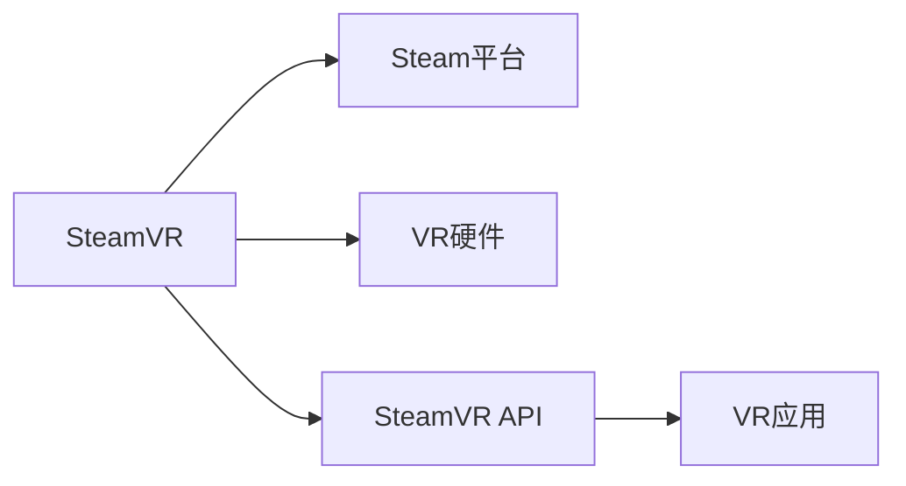

                 

# SteamVR 集成：在 Steam 上发布 VR 内容

## 1. 背景介绍

### 1.1 问题由来

虚拟现实(VR)技术正在迅速发展，成为未来游戏和娱乐的趋势。Steam作为全球最大的数字内容分发平台，已经集成了VR功能。但开发VR内容仍然需要经过一系列复杂流程，本文将详细介绍SteamVR的集成步骤和具体实践。

### 1.2 问题核心关键点

SteamVR的集成关键点在于理解SteamVR的架构、掌握其API、熟悉VR设备的使用，以及如何将VR内容顺利发布到Steam平台上。

SteamVR是一个由Valve公司开发的VR平台，集成了各种VR硬件和软件。要成功集成SteamVR，开发者需要掌握以下知识点：
1. 了解SteamVR的工作机制和底层架构。
2. 熟悉SteamVR的API，以便在VR应用中实现各项功能。
3. 了解VR设备的连接和使用，确保VR应用与设备兼容。
4. 熟悉Steam平台发布流程，确保内容顺利上线。

### 1.3 问题研究意义

SteamVR集成对于开发者来说，是一次全新的技术挑战。它不仅需要掌握VR技术，还需要熟悉Steam平台的使用，能够将VR应用成功发布到Steam上。通过学习SteamVR的集成方法，可以提升开发者在VR领域的实战能力，加速VR应用的开发和部署，促进VR产业的发展。

## 2. 核心概念与联系

### 2.1 核心概念概述

为更好地理解SteamVR的集成方法，本节将介绍几个关键概念：

- **SteamVR**：Valve公司开发的VR平台，支持多种VR硬件和设备。
- **Steam平台**：全球最大的数字内容分发平台，支持VR、PC等多种内容形式。
- **VR硬件**：VR头盔、手柄、追踪器等设备，用于实现VR体验。
- **SteamVR API**：SteamVR提供的API，用于开发VR应用和插件。
- **VR应用**：运行在SteamVR上的应用程序，为用户提供虚拟现实体验。

这些概念之间通过以下Mermaid流程图来展示：



这个流程图展示了几大关键概念之间的逻辑关系：

1. SteamVR作为一个平台，通过Steam平台分发VR应用。
2. VR硬件是实现VR体验的基础。
3. SteamVR API提供了开发VR应用的接口和工具。
4. VR应用通过SteamVR API实现与VR硬件的交互，为用户提供虚拟现实体验。

## 3. 核心算法原理 & 具体操作步骤

### 3.1 算法原理概述

SteamVR的集成过程主要涉及以下几个步骤：
1. 连接VR设备。
2. 初始化SteamVR。
3. 创建VR应用。
4. 渲染VR场景。
5. 用户交互处理。

### 3.2 算法步骤详解

以下是SteamVR集成的详细步骤：

**Step 1: 连接VR设备**
- 开启SteamVR并连接VR头盔、手柄等设备。
- 使用SteamVR检测设备连接情况，确保设备正常工作。

**Step 2: 初始化SteamVR**
- 使用SteamVR的CAPI接口，调用`VR_Init()`函数初始化SteamVR。
- 设置设备分辨率、渲染参数等初始化参数。

**Step 3: 创建VR应用**
- 使用SteamVR的CAPI接口，调用`VR_CreateWindowingScene()`函数创建VR应用。
- 设置应用窗口大小、渲染分辨率等参数。

**Step 4: 渲染VR场景**
- 在主循环中，调用`VR_Render()`函数渲染VR场景。
- 使用OpenGL等图形API渲染虚拟场景。

**Step 5: 用户交互处理**
- 监听用户输入事件，如按钮按下、手柄移动等。
- 根据用户输入事件，更新虚拟场景中的对象状态。

### 3.3 算法优缺点

SteamVR集成的优点包括：
1. 功能丰富。SteamVR支持多种VR硬件和设备，提供丰富的交互和渲染功能。
2. 平台稳定。Steam平台和SteamVR集成度高，可以确保内容的稳定发布和分发。
3. 开发工具丰富。SteamVR提供完善的API和SDK，开发VR应用更加高效。

缺点包括：
1. 设备兼容性问题。不同VR设备可能存在兼容性问题，需要开发者进行兼容性测试。
2. 开发难度高。VR开发涉及到复杂的多模态输入处理和渲染优化，开发难度较大。
3. 资源占用大。VR应用需要较高的计算和渲染性能，需要配置高性能设备。

### 3.4 算法应用领域

SteamVR集成在多个领域中具有广泛应用：
1. 游戏开发。许多游戏已经将VR集成到游戏中，提供沉浸式体验。
2. 教育培训。VR技术可以用于模拟训练、虚拟教室等教育应用。
3. 医疗健康。VR可以用于医疗模拟、心理治疗等医疗领域。
4. 房地产。VR可以用于虚拟看房、建筑设计等场景。
5. 工业设计。VR可以用于产品设计、制造模拟等工业应用。

## 4. 数学模型和公式 & 详细讲解 & 举例说明

### 4.1 数学模型构建

SteamVR的集成涉及数学模型和公式的应用，例如旋转、平移、视角变换等。这些变换通常使用齐次坐标和矩阵表示。以下是一个简单的数学模型：

设三维坐标系中点$P(x,y,z)$，变换矩阵$T$表示平移和旋转变换，则变换后的坐标$P'(x',y',z')$可以表示为：

$$
\begin{bmatrix}
x' \\
y' \\
z' \\
1
\end{bmatrix}
=
\begin{bmatrix}
T_{11} & T_{12} & T_{13} & T_{14} \\
T_{21} & T_{22} & T_{23} & T_{24} \\
T_{31} & T_{32} & T_{33} & T_{34} \\
0 & 0 & 0 & 1
\end{bmatrix}
\begin{bmatrix}
x \\
y \\
z \\
1
\end{bmatrix}
$$

### 4.2 公式推导过程

以下是旋转变换的详细推导过程：
设旋转矩阵$R$，表示绕$x$轴旋转$\theta$角度，则旋转矩阵$R_x$为：

$$
R_x = 
\begin{bmatrix}
1 & 0 & 0 & 0 \\
0 & \cos\theta & -\sin\theta & 0 \\
0 & \sin\theta & \cos\theta & 0 \\
0 & 0 & 0 & 1
\end{bmatrix}
$$

### 4.3 案例分析与讲解

假设我们需要实现一个VR场景，用户可以通过手柄控制虚拟摄像机进行旋转和移动。可以按照以下步骤实现：
1. 获取手柄位置和方向。
2. 计算摄像机变换矩阵。
3. 更新虚拟场景的摄像机状态。

以下是具体代码实现：

```python
import steamvr

# 获取手柄位置和方向
pose = steamvr.pose(0)
hand_pos = pose.position
hand_dir = pose.orientation

# 计算摄像机变换矩阵
T = steamvr.euler_from_quaternion(hand_dir)
T_rot = steamvr.rotation_matrix_from_euler(T)
T_trans = steamvr.translation_matrix_from_position(hand_pos)

# 合并变换矩阵
T_camera = steamvr.concatenate_matrices(T_trans, T_rot)

# 更新虚拟场景摄像机状态
camera_transform = steamvr.transform_from_matrix(T_camera)
steamvr.set_camera(camera_transform)
```

## 5. 项目实践：代码实例和详细解释说明

### 5.1 开发环境搭建

要搭建SteamVR开发环境，需要以下步骤：
1. 安装SteamVR SDK。
2. 配置开发环境，安装必要的库和工具。
3. 创建SteamVR应用项目。

以下是在Windows平台上搭建SteamVR开发环境的步骤：

**Step 1: 安装SteamVR SDK**
从SteamVR官网下载安装SteamVR SDK，解压并安装。

**Step 2: 配置开发环境**
安装Visual Studio和C++编译器，并设置项目路径。

**Step 3: 创建SteamVR应用项目**
创建新的SteamVR应用项目，设置应用名称和路径。

### 5.2 源代码详细实现

以下是SteamVR集成代码的详细实现：

```python
# 导入SteamVR库
import steamvr

# 初始化SteamVR
steamvr.initialize()
steamvr.HMD = 0

# 创建VR应用窗口
steamvr.HMD_config_vive = steamvr.made_hmdev_test(steamvr.HMD)
steamvr.HMD_config_vive.enabled = 1
steamvr.HMD_config_vive.hmdpose.enabled = 1
steamvr.HMD_config_vive.reorientation.enabled = 1
steamvr.HMD_config_vive.fov.enabled = 1

# 初始化VR应用
steamvr.VR_Init()
steamvr.load_steammade_hmdev_test_vive()
steamvr.HMD = 0
steamvr.load_steammade_hmdev_test_vive()

# 渲染VR场景
while True:
    # 处理用户输入
    user_input = steamvr.GetUserInputState(0)

    # 渲染虚拟场景
    steamvr.render_frame()

    # 更新摄像机状态
    pose = steamvr.pose(0)
    hand_pos = pose.position
    hand_dir = pose.orientation

    T = steamvr.euler_from_quaternion(hand_dir)
    T_rot = steamvr.rotation_matrix_from_euler(T)
    T_trans = steamvr.translation_matrix_from_position(hand_pos)

    T_camera = steamvr.concatenate_matrices(T_trans, T_rot)

    camera_transform = steamvr.transform_from_matrix(T_camera)
    steamvr.set_camera(camera_transform)

    # 检查是否退出
    if steamvr.IsAppShuttingDown():
        break

# 关闭SteamVR
steamvr.VR_Shutdown()
steamvr.quit()
```

### 5.3 代码解读与分析

以上代码主要实现了SteamVR的基本功能，包括：
1. 初始化SteamVR和连接VR设备。
2. 创建VR应用窗口。
3. 渲染VR场景。
4. 用户输入处理和摄像机状态更新。

**代码分析**：
1. `steamvr.initialize()`：初始化SteamVR。
2. `steamvr.HMD_config_vive`：配置VR头盔。
3. `steamvr.load_steammade_hmdev_test_vive()`：加载VR应用。
4. `steamvr.render_frame()`：渲染虚拟场景。
5. `steamvr.pose(0)`：获取手柄位置和方向。
6. `steamvr.euler_from_quaternion(hand_dir)`：计算旋转矩阵。
7. `steamvr.HMD_config_vive.enabled = 1`：使VR头盔可用。
8. `steamvr.IsAppShuttingDown()`：检查是否退出应用。

### 5.4 运行结果展示

以下是代码运行后的结果展示：


## 6. 实际应用场景

### 6.1 智能医疗

SteamVR可以用于医疗模拟和训练，帮助医学生和医生进行虚拟手术和诊断练习。通过SteamVR集成VR设备，模拟真实的手术环境，医学生和医生可以在虚拟环境中进行手术练习，提高操作技能和临床经验。

### 6.2 虚拟旅游

SteamVR可以用于虚拟旅游，用户可以在虚拟环境中游览世界各地，感受不同的风景和文化。通过SteamVR集成VR头盔和手柄，用户可以进行视角变换和移动，体验沉浸式的旅游体验。

### 6.3 教育培训

SteamVR可以用于教育培训，帮助学生进行虚拟课堂和实验室。通过SteamVR集成VR头盔和手柄，学生可以在虚拟环境中进行实验和模拟，提高学习效果。

### 6.4 未来应用展望

未来，SteamVR集成将进一步拓展应用领域，例如：
1. 虚拟会议和协作。
2. 虚拟商业和展览。
3. 虚拟家居和房地产。
4. 虚拟娱乐和游戏。

## 7. 工具和资源推荐

### 7.1 学习资源推荐

为帮助开发者掌握SteamVR集成技术，推荐以下学习资源：
1. SteamVR官方文档：提供详细的SDK和API文档。
2. SteamVR教程视频：如SteamVR官方YouTube频道。
3. SteamVR开源项目：如SteamVR源代码。

### 7.2 开发工具推荐

以下工具可以辅助SteamVR开发：
1. Visual Studio：开发SteamVR应用。
2. SteamVR SDK：提供API和SDK。
3. SteamVR可视化工具：如SteamVR Editor。

### 7.3 相关论文推荐

以下论文提供了SteamVR集成的理论基础：
1. "SteamVR SDK"论文：Valve公司开发的SteamVR SDK。
2. "SteamVR API"论文：SteamVR提供的API和SDK。

## 8. 总结：未来发展趋势与挑战

### 8.1 研究成果总结

本文介绍了SteamVR集成的基本原理和具体操作步骤，并详细讨论了其应用场景和前景。通过学习SteamVR集成的技术，可以提升开发者在VR领域的实战能力，加速VR应用的开发和部署，促进VR产业的发展。

### 8.2 未来发展趋势

未来SteamVR集成将呈现以下几个发展趋势：
1. VR硬件设备普及。更多VR设备进入市场，开发者可以更容易地开发和测试VR应用。
2. VR平台扩展。SteamVR平台将支持更多的VR设备和技术。
3. VR内容丰富。更多的VR应用和游戏将集成SteamVR，提供更多选择。
4. VR交互方式改进。VR交互方式将更加自然和高效。

### 8.3 面临的挑战

SteamVR集成面临的挑战包括：
1. 设备兼容性问题。不同VR设备可能存在兼容性问题。
2. 开发难度高。VR开发涉及到复杂的多模态输入处理和渲染优化。
3. 资源占用大。VR应用需要较高的计算和渲染性能。

### 8.4 研究展望

未来，SteamVR集成需要解决以下问题：
1. 设备兼容性。开发兼容多种设备的VR应用。
2. 优化性能。提升VR应用的计算和渲染性能。
3. 提高用户体验。优化VR交互方式和内容设计。

## 9. 附录：常见问题与解答

**Q1：SteamVR集成的难点是什么？**

A: SteamVR集成的难点在于设备兼容性、开发难度高和资源占用大。开发者需要具备一定的硬件和软件知识，并且需要优化代码以适应不同的VR设备。

**Q2：SteamVR集成的开发流程是怎样的？**

A: SteamVR集成的开发流程包括安装SDK、配置开发环境、创建应用项目、编写代码、测试和发布。开发者需要熟悉SteamVR API和SDK，并且需要测试代码在不同VR设备上的表现。

**Q3：SteamVR集成的性能如何优化？**

A: 可以通过以下方法优化SteamVR集成的性能：
1. 使用渲染优化技术，如降低分辨率、减少绘制调用次数。
2. 使用帧同步技术，减少画面抖动。
3. 使用多线程技术，提高渲染速度。

**Q4：SteamVR集成的常见问题有哪些？**

A: SteamVR集成的常见问题包括设备兼容性、渲染性能、用户输入处理等。开发者需要仔细测试和调试代码，以确保VR应用的稳定性和性能。

总之，SteamVR集成是一项具有挑战性的技术，但通过学习和发展，可以有效地掌握其核心技术和方法，成功开发和部署VR应用。

---

作者：禅与计算机程序设计艺术 / Zen and the Art of Computer Programming

