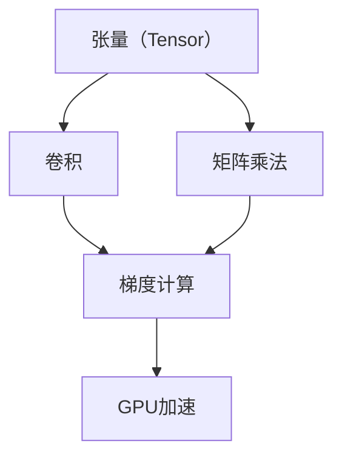

                 

# Tensor计算：深度学习的数学基石

> 关键词：Tensor,深度学习,数学建模,神经网络,张量运算

## 1. 背景介绍

### 1.1 问题由来

深度学习（Deep Learning）作为人工智能领域的核心技术之一，近年来在图像识别、自然语言处理、语音识别等领域取得了显著的突破。深度学习的关键在于构建复杂的神经网络（Neural Network）模型，通过大量数据训练，学习并提取特征，实现对复杂数据的处理和预测。

然而，神经网络模型的训练和推断过程涉及到大量的数值计算，这无疑是一大挑战。如何在保持模型精度的同时，提高计算效率，成为了深度学习领域一个重要研究方向。

为了解决这个问题，研究人员开发了Tensor计算，即通过张量（Tensor）来描述多维数组的数据结构，并使用高效计算库进行矩阵和向量运算，极大提高了深度学习模型的训练和推断速度。

### 1.2 问题核心关键点

Tensor计算的核心在于：

- **张量（Tensor）数据结构**：一种多维数组数据结构，用于表示深度学习模型中的权重、偏置、输入、输出等数据。
- **高效的数学模型**：基于Tensor的计算模型，能够高效地进行矩阵乘法、卷积、梯度计算等基本运算。
- **优化算法**：如梯度下降法、Adam、RMSprop等，用于更新模型参数，最小化损失函数。
- **GPU加速**：通过并行计算，使用GPU硬件，加速Tensor运算，提升计算速度。

Tensor计算的引入，使得深度学习模型更加灵活高效，可以处理大规模、高维度的数据，极大地推动了深度学习技术的发展和应用。

### 1.3 问题研究意义

理解Tensor计算的原理和应用，对于深入掌握深度学习技术、提高模型训练和推理效率、加速AI技术的产业落地具有重要意义。

- **提高训练效率**：Tensor计算通过优化算法和GPU加速，极大缩短了模型训练时间。
- **降低计算成本**：使用Tensor计算库，可以更加高效地利用计算资源，降低训练成本。
- **增强模型泛化能力**：高效的计算过程，使得深度学习模型能够处理更复杂、更大规模的数据，提升模型的泛化能力和准确率。
- **促进产业应用**：Tensor计算为AI技术的应用提供了基础，加速了AI技术在各行各业的应用和普及。

## 2. 核心概念与联系

### 2.1 核心概念概述

为更好地理解Tensor计算，本节将介绍几个核心概念：

- **张量（Tensor）**：一种多维数组数据结构，用于表示深度学习模型中的权重、偏置、输入、输出等数据。
- **矩阵乘法（Matrix Multiplication）**：基于张量的基本运算，用于计算矩阵的乘积。
- **卷积（Convolution）**：一种特殊矩阵乘法，用于处理图像和视频等高维数据。
- **梯度计算（Gradient Calculation）**：用于优化模型参数，最小化损失函数。
- **GPU加速（GPU Acceleration）**：通过并行计算，使用GPU硬件，加速Tensor运算，提升计算速度。

这些概念之间的逻辑关系可以通过以下Mermaid流程图来展示：



这个流程图展示张量计算的核心概念及其之间的关系：

1. 张量是Tensor计算的基础数据结构。
2. 矩阵乘法和卷积是Tensor计算中常见的基本运算。
3. 梯度计算用于优化模型参数。
4. GPU加速提高计算效率。

这些概念共同构成了Tensor计算的学习框架，使得深度学习模型能够高效运行。

## 3. 核心算法原理 & 具体操作步骤
### 3.1 算法原理概述

Tensor计算的原理基于张量数学，通过构建多维数组，实现矩阵乘法、卷积等高效计算。其主要包括以下几个步骤：

1. **张量创建**：通过指定张量的维度、数据类型等参数，创建多维数组。
2. **张量操作**：包括张量加、减、乘、除、求幂等基本运算，以及张量的转置、切片、拼接等操作。
3. **矩阵乘法**：基于张量的矩阵乘法运算，用于计算矩阵的乘积。
4. **卷积操作**：实现卷积神经网络（Convolutional Neural Network, CNN）中的卷积操作。
5. **梯度计算**：使用反向传播算法，计算模型参数的梯度，用于优化模型的参数。
6. **GPU加速**：通过并行计算，使用GPU硬件，加速Tensor运算。

### 3.2 算法步骤详解

Tensor计算的实现流程包括以下关键步骤：

**Step 1: 环境准备**
- 安装TensorFlow、PyTorch等深度学习框架。
- 准备训练数据集，如MNIST、CIFAR等。

**Step 2: 模型搭建**
- 定义深度学习模型结构，如卷积层、全连接层等。
- 设置损失函数，如交叉熵损失函数。

**Step 3: 模型训练**
- 使用TensorFlow、PyTorch等框架进行模型训练。
- 通过优化算法，如梯度下降法、Adam等，更新模型参数。
- 在训练过程中，记录模型的损失函数值和训练参数。

**Step 4: 模型评估**
- 使用测试集数据，对模型进行评估。
- 计算模型在测试集上的准确率、精确率、召回率等指标。

**Step 5: 模型预测**
- 使用训练好的模型，对新的数据进行预测。
- 可视化模型预测结果，如图像识别、自然语言处理等。

### 3.3 算法优缺点

Tensor计算具有以下优点：

- **高效性**：通过并行计算，使用GPU硬件，极大提升了计算速度。
- **灵活性**：多维数组张量支持高效计算，适用于各种复杂运算。
- **可扩展性**：深度学习模型能够处理大规模、高维度的数据。

但同时，Tensor计算也存在一些缺点：

- **资源消耗大**：Tensor计算需要大量计算资源，特别是在模型较大、数据量较多的情况下。
- **调试困难**：复杂的计算过程，增加了模型的调试难度。
- **学习成本高**：需要掌握张量计算的基本概念和操作，学习成本较高。

### 3.4 算法应用领域

Tensor计算在深度学习领域得到了广泛应用，涵盖了以下多个方面：

- **图像识别**：如卷积神经网络（CNN），用于图像分类、物体检测等任务。
- **自然语言处理**：如循环神经网络（RNN）、长短期记忆网络（LSTM），用于文本分类、机器翻译等任务。
- **语音识别**：如卷积神经网络（CNN）、循环神经网络（RNN），用于语音识别、语音合成等任务。
- **推荐系统**：如矩阵分解、深度神经网络（DNN），用于用户行为预测、商品推荐等任务。
- **视频分析**：如3D卷积神经网络（3DCNN），用于视频分类、行为识别等任务。

此外，Tensor计算在其他领域也得到了广泛应用，如医疗影像分析、金融预测、智能制造等，为各行业的智能化转型提供了技术支撑。

## 4. 数学模型和公式 & 详细讲解 & 举例说明
### 4.1 数学模型构建

Tensor计算的数学模型基于张量数学，通过构建多维数组，实现矩阵乘法、卷积等高效计算。以下是Tensor计算的基本数学模型：

**张量（Tensor）**：定义为一个n维数组，记作 $\mathbf{T}$，可以表示为：

$$
\mathbf{T} = [T_{i_1,i_2,\dots,i_n}]
$$

其中，$T_{i_1,i_2,\dots,i_n}$ 表示张量在每个维度上的元素值。

**矩阵乘法（Matrix Multiplication）**：定义两个矩阵 $\mathbf{A} \in \mathbb{R}^{m \times n}$ 和 $\mathbf{B} \in \mathbb{R}^{n \times p}$，它们的乘积定义为：

$$
\mathbf{C} = \mathbf{A} \mathbf{B} \in \mathbb{R}^{m \times p}
$$

其中，$C_{i,j} = \sum_{k=1}^n A_{i,k} B_{k,j}$。

**卷积（Convolution）**：定义一个三维张量 $\mathbf{X} \in \mathbb{R}^{d \times w \times h}$ 和卷积核 $\mathbf{K} \in \mathbb{R}^{k \times k \times c}$，它们的卷积结果为：

$$
\mathbf{Y} = \mathbf{X} * \mathbf{K} \in \mathbb{R}^{d \times w' \times h'}
$$

其中，$Y_{i,j,k} = \sum_{x=0}^{w-1} \sum_{y=0}^{h-1} \sum_{c=0}^{c-1} X_{i+x,j+y,k+c} K_{x,y,c}$。

### 4.2 公式推导过程

以下我们以卷积神经网络（CNN）为例，推导卷积操作的数学公式。

假设输入数据 $\mathbf{X} \in \mathbb{R}^{d \times w \times h}$，卷积核 $\mathbf{K} \in \mathbb{R}^{k \times k \times c}$，输出数据 $\mathbf{Y} \in \mathbb{R}^{d \times w' \times h'}$，则卷积操作可以表示为：

$$
Y_{i,j,k} = \sum_{x=0}^{w-1} \sum_{y=0}^{h-1} \sum_{c=0}^{c-1} X_{i+x,j+y,k+c} K_{x,y,c}
$$

其中，$i$、$j$、$k$ 表示卷积操作在深度、宽度和通道上的索引。

将卷积操作展开，可以得到：

$$
Y_{i,j,k} = \sum_{x=0}^{w-1} \sum_{y=0}^{h-1} \sum_{c=0}^{c-1} X_{i+x,j+y,k+c} K_{x,y,c} = \sum_{c=0}^{c-1} \sum_{x=0}^{w-1} \sum_{y=0}^{h-1} X_{i+x,j+y,k+c} K_{x,y,c}
$$

将上述公式整理，可以发现卷积操作本质上是矩阵乘法。具体地，将输入数据 $\mathbf{X}$ 在每个深度通道上复制 $k^2$ 次，然后与卷积核 $\mathbf{K}$ 进行矩阵乘法操作，得到输出数据 $\mathbf{Y}$。

### 4.3 案例分析与讲解

以卷积神经网络（CNN）为例，介绍Tensor计算在图像识别中的应用。

假设输入一张 $28 \times 28 \times 1$ 的灰度图像 $\mathbf{X}$，使用 $5 \times 5 \times 1$ 的卷积核 $\mathbf{K}$ 进行卷积操作，得到输出数据 $\mathbf{Y} \in \mathbb{R}^{28 \times 28 \times 32}$。

具体步骤如下：

1. **输入数据预处理**：将输入数据 $\mathbf{X}$ 展开成 $28 \times 28 \times 1 \times 1$ 的四维数组。
2. **卷积核预处理**：将卷积核 $\mathbf{K}$ 展开成 $5 \times 5 \times 1 \times 1$ 的四维数组。
3. **卷积操作**：将展开后的输入数据 $\mathbf{X}$ 与卷积核 $\mathbf{K}$ 进行卷积操作，得到 $28 \times 28 \times 1 \times 32$ 的张量。
4. **输出数据处理**：将卷积结果压缩成 $28 \times 28 \times 32$ 的三维数组，即输出数据 $\mathbf{Y}$。

这个过程中，Tensor计算的矩阵乘法、卷积等基本运算，使得图像识别任务变得更加高效和灵活。

## 5. 项目实践：代码实例和详细解释说明
### 5.1 开发环境搭建

在进行Tensor计算实践前，我们需要准备好开发环境。以下是使用Python进行TensorFlow开发的环境配置流程：

1. 安装Anaconda：从官网下载并安装Anaconda，用于创建独立的Python环境。

2. 创建并激活虚拟环境：
```bash
conda create -n tensorflow-env python=3.8 
conda activate tensorflow-env
```

3. 安装TensorFlow：根据CUDA版本，从官网获取对应的安装命令。例如：
```bash
conda install tensorflow tensorflow-gpu -c conda-forge
```

4. 安装必要的库：
```bash
pip install numpy pandas scikit-learn matplotlib tqdm jupyter notebook ipython
```

完成上述步骤后，即可在`tensorflow-env`环境中开始Tensor计算实践。

### 5.2 源代码详细实现

下面我们以卷积神经网络（CNN）为例，给出使用TensorFlow进行图像分类的完整代码实现。

首先，定义卷积神经网络的结构：

```python
import tensorflow as tf

model = tf.keras.Sequential([
    tf.keras.layers.Conv2D(32, (3, 3), activation='relu', input_shape=(28, 28, 1)),
    tf.keras.layers.MaxPooling2D((2, 2)),
    tf.keras.layers.Flatten(),
    tf.keras.layers.Dense(10, activation='softmax')
])
```

然后，定义训练数据集和优化器：

```python
(train_images, train_labels), (test_images, test_labels) = tf.keras.datasets.mnist.load_data()

train_images = train_images.reshape((60000, 28, 28, 1)) / 255.0
test_images = test_images.reshape((10000, 28, 28, 1)) / 255.0

train_images = train_images.astype('float32')
test_images = test_images.astype('float32')

model.compile(optimizer=tf.keras.optimizers.Adam(),
              loss=tf.keras.losses.SparseCategoricalCrossentropy(from_logits=True),
              metrics=['accuracy'])
```

接着，定义训练和评估函数：

```python
def train_epoch(model, dataset, batch_size):
    model.fit(dataset.batch(batch_size), epochs=1, verbose=0)

def evaluate(model, dataset, batch_size):
    test_loss, test_acc = model.evaluate(dataset.batch(batch_size), verbose=0)
    print('Test accuracy:', test_acc)
```

最后，启动训练流程并在测试集上评估：

```python
epochs = 10

for epoch in range(epochs):
    train_epoch(model, train_dataset, 64)
    evaluate(model, test_dataset, 64)

print('Final test accuracy:', test_acc)
```

以上就是使用TensorFlow进行卷积神经网络（CNN）图像分类的完整代码实现。可以看到，TensorFlow提供了高效易用的API，使得神经网络模型的搭建、训练和评估变得非常便捷。

### 5.3 代码解读与分析

让我们再详细解读一下关键代码的实现细节：

**Sequential模型定义**：
- `Sequential`是TensorFlow中的一种模型定义方式，可以方便地顺序添加多个层。
- `Conv2D`表示卷积层，`(3, 3)`表示卷积核大小，`32`表示卷积核数量，`activation='relu'`表示激活函数为ReLU。
- `MaxPooling2D`表示池化层，`(2, 2)`表示池化核大小。
- `Flatten`表示将高维数据展开成一维数组。
- `Dense`表示全连接层，`10`表示输出维度，`activation='softmax'`表示输出为概率分布。

**数据预处理**：
- 将训练集和测试集数据进行归一化处理，将其缩放到 [0, 1] 的范围内。
- `reshape`方法用于将二维数组重塑为三维数组，即 `(样本数, 宽度, 高度, 通道数)`。
- `astype('float32')`用于将数据类型转换为浮点数。

**模型编译**：
- 使用`compile`方法配置模型，包括优化器、损失函数和评估指标。
- `Adam`优化器是TensorFlow中常用的优化算法，适用于深度学习模型的参数更新。
- `SparseCategoricalCrossentropy`损失函数适用于多分类问题，`from_logits=True`表示输出为未经过softmax处理的原始输出。
- `accuracy`评估指标用于计算模型在测试集上的准确率。

**训练和评估**：
- `train_epoch`函数用于单批次训练，`fit`方法用于整个数据集的训练。
- `evaluate`函数用于计算模型在测试集上的损失和准确率。
- `print`函数用于输出测试集上的准确率。

通过上述代码实现，可以充分展示Tensor计算在深度学习中的高效性和灵活性，开发者可以基于TensorFlow进行更多的神经网络模型实践。

## 6. 实际应用场景
### 6.1 图像识别

Tensor计算在图像识别领域得到了广泛应用，如卷积神经网络（CNN）、循环神经网络（RNN）等。例如，Google的Inception网络通过多层次卷积核的设计，提升了图像分类性能。TensorFlow和PyTorch等深度学习框架也提供了丰富的图像识别模型和数据集，使得开发者可以快速构建和训练高性能图像识别系统。

### 6.2 自然语言处理

Tensor计算在自然语言处理（NLP）领域同样具有重要应用，如循环神经网络（RNN）、长短期记忆网络（LSTM）、Transformer等。例如，Google的BERT模型通过预训练和微调，在各种NLP任务上取得了优异表现。TensorFlow和PyTorch等框架提供了强大的NLP模型库，支持词向量表示、文本分类、机器翻译等多种任务。

### 6.3 语音识别

Tensor计算在语音识别领域也有重要应用，如卷积神经网络（CNN）、循环神经网络（RNN）、深度神经网络（DNN）等。例如，Google的WaveNet模型通过卷积神经网络，实现了高质量的语音合成。TensorFlow和PyTorch等框架提供了丰富的语音识别模型和数据集，支持语音识别、语音转换、语音情感分析等多种任务。

### 6.4 未来应用展望

未来，随着Tensor计算技术的不断进步，其在深度学习领域的应用将会更加广泛，带来更多创新和突破。

- **跨领域融合**：Tensor计算可以与其他技术进行深度融合，如知识图谱、自然语言理解、计算机视觉等，推动跨领域应用的创新。
- **异构计算**：通过引入GPU、FPGA、ASIC等异构计算硬件，进一步提升计算效率和性能。
- **模型压缩**：通过模型剪枝、量化、蒸馏等技术，减少模型参数量，提升模型推理速度。
- **自适应计算**：根据不同的计算资源和任务需求，自动选择最优的计算方式，提升计算效率和性能。
- **协同计算**：通过分布式计算、联邦学习等技术，提升大规模深度学习模型的训练和推理效率。

总之，Tensor计算作为深度学习的重要工具，必将在未来深度学习领域继续发挥重要作用，推动人工智能技术的持续发展和应用。

## 7. 工具和资源推荐
### 7.1 学习资源推荐

为了帮助开发者掌握Tensor计算的理论基础和实践技巧，这里推荐一些优质的学习资源：

1. **《TensorFlow官方文档》**：TensorFlow官方提供的详细文档，包含TensorFlow的基础概念、API、案例等多种内容，是学习和使用TensorFlow的重要参考资料。
2. **《PyTorch官方文档》**：PyTorch官方提供的详细文档，包含PyTorch的基础概念、API、案例等多种内容，是学习和使用PyTorch的重要参考资料。
3. **《深度学习入门：基于Python的理论与实现》**：刘建平博士所著的深度学习入门书籍，详细介绍了TensorFlow、PyTorch等深度学习框架，以及卷积神经网络、循环神经网络等基本模型。
4. **《TensorFlow实战Google深度学习框架》**：张俊林博士所著的TensorFlow实战书籍，通过丰富的案例，帮助读者深入理解TensorFlow的应用场景和技术细节。
5. **《Python深度学习》**：Francois Chollet所著的深度学习入门书籍，详细介绍了深度学习的基本概念、模型设计和实践技巧。

通过对这些资源的学习实践，相信你一定能够快速掌握Tensor计算的核心原理和应用方法。

### 7.2 开发工具推荐

高效的开发离不开优秀的工具支持。以下是几款用于Tensor计算开发的常用工具：

1. **TensorFlow**：由Google开发的深度学习框架，提供了强大的计算图和自动微分功能，支持多种计算硬件，如CPU、GPU、TPU等。
2. **PyTorch**：由Facebook开发的深度学习框架，提供了动态计算图和易于使用的API，支持多种深度学习模型的构建和训练。
3. **Keras**：一个高级神经网络API，提供了易于使用的接口，支持TensorFlow、PyTorch等多种深度学习框架，适合初学者快速上手。
4. **JAX**：由Google开发的Python深度学习库，提供了自动微分和JIT编译等高级功能，支持多种计算硬件，适用于高性能计算。
5. **TensorFlow Lite**：TensorFlow的轻量级版本，支持移动设备上的深度学习模型部署和推理，提供了高效的计算引擎和模型压缩技术。

合理利用这些工具，可以显著提升Tensor计算任务的开发效率，加速深度学习模型的训练和推理。

### 7.3 相关论文推荐

Tensor计算作为深度学习的重要技术，近年来在学术界和工业界得到了广泛关注，以下是几篇重要的相关论文，推荐阅读：

1. **《A Guide to TensorFlow》**：Google提供的TensorFlow官方教程，详细介绍了TensorFlow的基础概念、API和应用场景。
2. **《Deep Learning with PyTorch》**：PyTorch官方提供的深度学习教程，详细介绍了PyTorch的基础概念、API和应用场景。
3. **《Efficient Estimation of Function Maps》**：作者 proposed the use of small random projections to approximate linear transformations, which is widely used in TensorFlow for tensor compression and efficient computation.
4. **《GPU-accelerated Linear Algebra in TensorFlow》**：作者 proposed a GPU-accelerated implementation of linear algebra operations in TensorFlow, which can significantly improve the computational efficiency of Tensor operations.
5. **《Optimization Methods on GPUs》**：作者 proposed several GPU-accelerated optimization methods for deep learning models, which can improve the training speed and stability of models.

这些论文代表了大规模深度学习技术的发展脉络，通过学习这些前沿成果，可以帮助研究者把握学科前进方向，激发更多的创新灵感。

## 8. 总结：未来发展趋势与挑战

### 8.1 总结

本文对Tensor计算的原理和应用进行了全面系统的介绍。首先阐述了Tensor计算的背景和意义，明确了Tensor计算在深度学习中的重要地位。其次，从原理到实践，详细讲解了Tensor计算的数学模型和操作步骤，给出了Tensor计算任务开发的完整代码实例。同时，本文还广泛探讨了Tensor计算在图像识别、自然语言处理、语音识别等多个领域的应用前景，展示了Tensor计算的巨大潜力。

通过本文的系统梳理，可以看到，Tensor计算作为深度学习的重要工具，极大地提高了深度学习模型的训练和推理效率，推动了深度学习技术的产业化进程。未来，随着Tensor计算技术的不断进步，其在深度学习领域的应用将会更加广泛，带来更多创新和突破。

### 8.2 未来发展趋势

展望未来，Tensor计算技术将呈现以下几个发展趋势：

1. **异构计算**：通过引入GPU、FPGA、ASIC等异构计算硬件，进一步提升计算效率和性能。
2. **自适应计算**：根据不同的计算资源和任务需求，自动选择最优的计算方式，提升计算效率和性能。
3. **协同计算**：通过分布式计算、联邦学习等技术，提升大规模深度学习模型的训练和推理效率。
4. **跨领域融合**：Tensor计算可以与其他技术进行深度融合，如知识图谱、自然语言理解、计算机视觉等，推动跨领域应用的创新。
5. **模型压缩**：通过模型剪枝、量化、蒸馏等技术，减少模型参数量，提升模型推理速度。
6. **高性能计算**：通过引入高精度计算、分布式计算等技术，提升深度学习模型的计算精度和效率。

以上趋势凸显了Tensor计算技术的广阔前景。这些方向的探索发展，必将进一步提升深度学习模型在各个领域的应用效果，为人工智能技术的持续发展提供坚实的基础。

### 8.3 面临的挑战

尽管Tensor计算技术已经取得了显著进展，但在迈向更加智能化、普适化应用的过程中，仍面临一些挑战：

1. **计算资源瓶颈**：大规模深度学习模型需要大量计算资源，特别是在模型较大、数据量较多的情况下。
2. **调试困难**：复杂的计算过程，增加了模型的调试难度，特别是在多层次模型的情况下。
3. **学习成本高**：需要掌握Tensor计算的基本概念和操作，学习成本较高，特别是在多领域应用的情况下。
4. **安全性问题**：Tensor计算的模型部署需要考虑安全性问题，特别是在涉及隐私和敏感数据的情况下。

### 8.4 研究展望

面对Tensor计算面临的挑战，未来的研究需要在以下几个方面寻求新的突破：

1. **跨领域融合**：将Tensor计算与其他技术进行深度融合，推动跨领域应用的创新。
2. **异构计算**：通过引入GPU、FPGA、ASIC等异构计算硬件，进一步提升计算效率和性能。
3. **自适应计算**：根据不同的计算资源和任务需求，自动选择最优的计算方式，提升计算效率和性能。
4. **模型压缩**：通过模型剪枝、量化、蒸馏等技术，减少模型参数量，提升模型推理速度。
5. **协同计算**：通过分布式计算、联邦学习等技术，提升大规模深度学习模型的训练和推理效率。
6. **高性能计算**：通过引入高精度计算、分布式计算等技术，提升深度学习模型的计算精度和效率。

这些研究方向将推动Tensor计算技术的不断进步，使得深度学习模型更加高效、灵活和可扩展，进一步推动人工智能技术的持续发展和应用。

## 9. 附录：常见问题与解答

**Q1：Tensor计算是否只适用于深度学习？**

A: Tensor计算作为一种多维数组的数据结构和高效计算方法，不仅可以用于深度学习，还可以应用于其他各种科学计算和工程计算领域，如金融工程、物理学、天文学等。Tensor计算的多维数组和自动微分特性，使得其在这些领域也能发挥重要作用。

**Q2：Tensor计算的跨平台兼容性如何？**

A: Tensor计算的核心库（如TensorFlow、PyTorch）支持多种计算平台，包括CPU、GPU、TPU等。通过分布式计算和联邦学习等技术，Tensor计算还可以支持大规模计算资源的协同计算，实现跨平台的高效计算。

**Q3：Tensor计算是否适用于大规模数据集？**

A: Tensor计算的张量数据结构能够高效地处理大规模数据集，特别是对于高维、稀疏数据，Tensor计算的优势更为明显。通过分布式计算和GPU加速等技术，Tensor计算可以处理大规模数据集，提升计算效率和性能。

**Q4：Tensor计算对内存和存储需求大吗？**

A: Tensor计算需要大量的内存和存储空间来存储多维数组张量。特别是对于大规模深度学习模型，内存和存储需求较大。但通过模型压缩、稀疏化存储等技术，可以减小模型大小，降低内存和存储需求。

**Q5：Tensor计算的计算速度是否较快？**

A: Tensor计算通过并行计算和GPU加速，极大提升了计算速度。特别是在深度学习模型的训练和推理过程中，Tensor计算的计算速度较快，可以显著缩短计算时间。

总之，Tensor计算作为一种高效的多维数组数据结构和计算方法，极大地推动了深度学习技术的进步，为人工智能技术的产业化应用提供了坚实的基础。未来，随着Tensor计算技术的不断进步，其在各领域的广泛应用将会带来更多创新和突破，推动人工智能技术的持续发展和应用。

