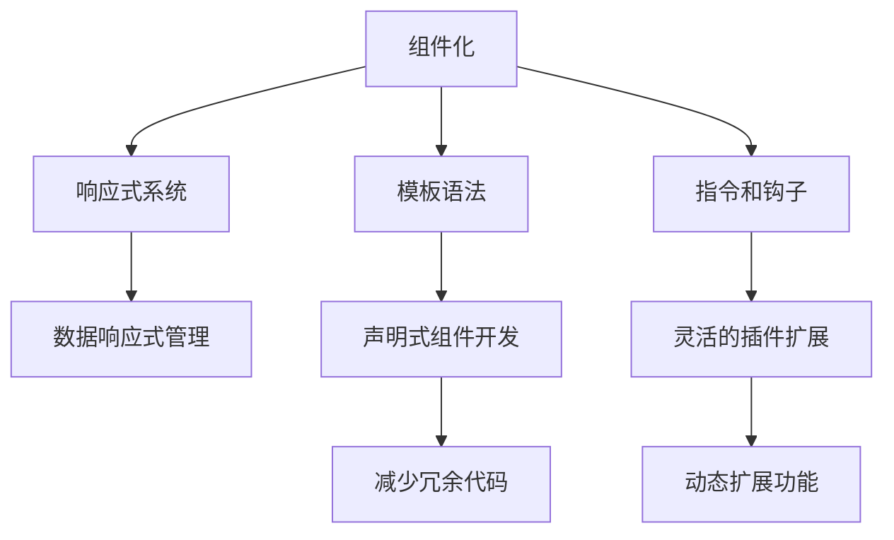
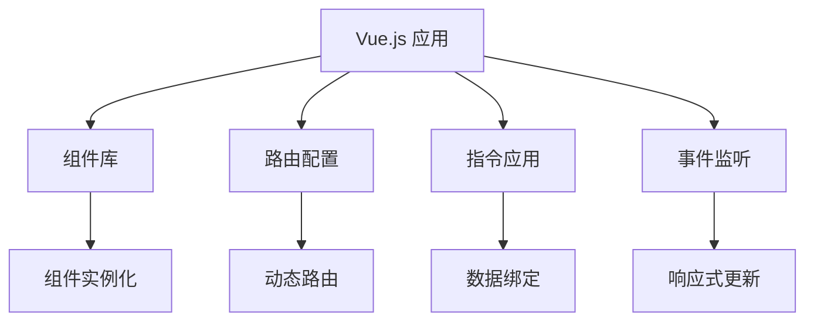

                 

# Vue.js 框架特点：渐进式 JavaScript 框架的选择

## 1. 背景介绍

在当今 Web 开发领域，JavaScript 框架的选择成了一个至关重要的话题。无论是前端开发者还是后端开发者，选择一个合适的框架都能极大地提升开发效率和应用性能。随着 Web 技术的发展，越来越多的框架涌现出来，如何从中做出最佳选择成为了开发者们关注的焦点。在众多框架中，Vue.js 以其渐进式的设计理念和灵活的模块化特性脱颖而出，成为现代 Web 开发的首选。

本文将从背景、核心概念、算法原理、应用实践、实际场景、工具资源、总结与展望等方面，全面解析 Vue.js 框架的特点，帮助开发者深入理解并有效运用这一强大工具。

## 2. 核心概念与联系

### 2.1 核心概念概述

Vue.js 是一个渐进式的 JavaScript 框架，它通过组件化的开发方式，帮助开发者更高效地构建复杂的 Web 应用。Vue.js 的设计理念是“渐进式”，这意味着它不仅适用于小型项目，也适用于大型复杂应用。

Vue.js 的核心概念包括以下几个方面：

- **组件化**：Vue.js 通过组件化的设计，将应用程序拆分为可复用的模块，每个组件只负责展示和管理它所绑定的数据。
- **响应式系统**：Vue.js 通过响应式系统，实现对数据和 DOM 操作的自动化管理，减少手动操作，提高开发效率。
- **模板语法**：Vue.js 提供了一种简洁的模板语法，可以让开发者通过声明式方式编写组件，减少冗余代码。
- **指令和钩子**：Vue.js 提供了丰富的指令和钩子，开发者可以根据需要灵活使用，实现更多功能。

这些核心概念之间相互关联，共同构成了 Vue.js 的开发框架。接下来，我们将进一步阐述这些概念之间的联系，并通过 Mermaid 流程图展示它们的工作原理。



### 2.2 核心概念原理和架构的 Mermaid 流程图



## 3. 核心算法原理 & 具体操作步骤

### 3.1 算法原理概述

Vue.js 的核心算法原理基于响应式系统和组件化设计。它的核心思想是通过观察和响应数据的变化，实现组件的动态更新和交互。这种响应式系统使得 Vue.js 能够自动更新 DOM，减少手动操作，提高开发效率。

Vue.js 的响应式系统主要通过以下两个机制实现：

1. **响应式数据绑定**：Vue.js 使用双向数据绑定，实现了数据的自动更新。开发者只需要定义一个响应式对象，Vue.js 就会自动监听它的变化，并在需要时更新 DOM。

2. **计算属性和 watcher**：Vue.js 提供了计算属性和 watcher 机制，帮助开发者更方便地实现数据计算和响应式更新。通过计算属性，开发者可以将多个变量进行组合计算，而通过 watcher，开发者可以自定义更新逻辑，实现更复杂的功能。

### 3.2 算法步骤详解

Vue.js 的核心算法步骤可以分为以下几个部分：

1. **组件实例化**：通过 Vue.extend() 函数创建组件实例，并调用 Vue.compile() 函数将模板编译成渲染函数。

2. **响应式系统初始化**：Vue.js 对实例化的组件进行响应式系统初始化，包括数据监听和指令解析。

3. **动态路由和组件渲染**：通过动态路由系统，Vue.js 可以实现基于 URL 的组件加载和渲染。

4. **数据绑定和计算属性**：Vue.js 通过双向数据绑定和计算属性，实现数据的自动更新和动态计算。

5. **事件监听和响应式更新**：Vue.js 通过事件监听和 watcher 机制，实现组件的响应式更新和交互。

6. **模板语法解析**：Vue.js 通过编译器将模板语法解析成渲染函数，实现组件的渲染。

### 3.3 算法优缺点

Vue.js 的算法优点包括：

- **组件化**：通过组件化设计，Vue.js 提供了高度可复用的模块，提高了开发效率。
- **响应式系统**：Vue.js 通过响应式系统，实现了自动更新和减少手动操作，提高了开发效率。
- **模板语法**：Vue.js 提供了简洁的模板语法，使得开发者可以更快速地编写组件。
- **指令和钩子**：Vue.js 提供了丰富的指令和钩子，开发者可以根据需要灵活使用，实现更多功能。

Vue.js 的算法缺点包括：

- **学习曲线较陡**：由于 Vue.js 的设计理念较为先进，开发者需要花费一定时间学习其核心概念和原理。
- **性能问题**：虽然 Vue.js 的响应式系统提高了开发效率，但在处理大量数据时，可能会导致性能问题。
- **依赖库多**：Vue.js 的生态系统虽然丰富，但依赖库较多，可能会导致性能问题。

### 3.4 算法应用领域

Vue.js 的应用领域广泛，主要包括以下几个方面：

- **单页面应用 (SPA)**：Vue.js 通过动态路由系统，可以实现基于 URL 的单页面应用，使得用户体验更加流畅。
- **大型复杂应用**：Vue.js 通过组件化和响应式系统，可以高效构建大型复杂应用。
- **前端开发**：Vue.js 不仅适用于前端开发，还可以通过 Vue CLI 进行后端开发，实现全栈开发。
- **移动端应用**：Vue.js 可以通过 Vue Mobile 进行移动端应用开发。

## 4. 数学模型和公式 & 详细讲解 & 举例说明

### 4.1 数学模型构建

Vue.js 的响应式系统主要基于以下数学模型构建：

- **数据模型**：Vue.js 使用对象和数组来存储数据，数据模型中的每个属性都可以设置为响应式属性，被监听其变化的指令。

- **响应式属性**：Vue.js 使用双向数据绑定机制，当数据模型发生变化时，响应式属性也会自动更新。

- **指令和钩子**：Vue.js 通过指令和钩子，实现对数据模型的各种操作，如计算属性、watcher 等。

### 4.2 公式推导过程

假设我们有一个简单的 Vue.js 组件：

```html
<template>
  <div>
    {{ message }}
    <button @click="updateMessage">更新消息</button>
  </div>
</template>

<script>
export default {
  data() {
    return {
      message: 'Hello Vue!'
    }
  },
  methods: {
    updateMessage() {
      this.message = '世界你好!'
    }
  }
}
</script>
```

在这个组件中，我们定义了一个响应式属性 `message` 和一个方法 `updateMessage`，当点击按钮时，`message` 的值会被更新。

```javascript
// 数据模型
const data = {
  message: 'Hello Vue!'
}

// 响应式属性
Object.defineProperty(data, 'message', {
  get() {
    return this._message
  },
  set(value) {
    this._message = value
    this.$emit('update')
  }
})

// 指令和钩子
new Vue({
  el: '#app',
  data,
  created() {
    console.log('组件创建')
  },
  mounted() {
    console.log('组件挂载')
  },
  methods: {
    updateMessage() {
      this.message = '世界你好!'
    }
  },
  watch: {
    message(newVal) {
      console.log('message 变化为', newVal)
    }
  },
  computed: {
    messageLength() {
      return this.message.length
    }
  }
}).$emit('created')
```

在这个例子中，我们使用了 `Object.defineProperty` 方法来实现双向数据绑定，使用了 `$emit` 方法来触发事件，使用了 computed 属性来进行动态计算。

### 4.3 案例分析与讲解

假设我们有一个电商网站，需要展示商品列表和详情页。我们可以使用 Vue.js 的组件化设计来解决这个问题。

```html
<template>
  <div>
    <ul>
      <li v-for="item in products" :key="item.id">
        {{ item.name }}
        <button @click="viewDetail(item.id)">查看详情</button>
      </li>
    </ul>
    <detail :product="product"></detail>
  </div>
</template>

<script>
export default {
  data() {
    return {
      products: [
        { id: 1, name: 'iPhone 13' },
        { id: 2, name: 'MacBook' }
      ],
      product: null
    }
  },
  methods: {
    viewDetail(id) {
      this.product = this.products.find(item => item.id === id)
    }
  }
}
</script>
```

在这个例子中，我们使用了 Vue.js 的 v-for 指令来实现商品列表的渲染，使用了 `viewDetail` 方法来加载商品详情。

## 5. 项目实践：代码实例和详细解释说明

### 5.1 开发环境搭建

Vue.js 的开发环境搭建相对简单，只需要安装 Node.js 和 npm 环境即可。可以通过以下命令进行安装：

```bash
# 安装 Node.js 和 npm
brew install node
```

安装完成后，可以使用 Vue CLI 进行项目初始化：

```bash
# 安装 Vue CLI
npm install -g @vue/cli
# 创建 Vue 项目
vue create my-project
cd my-project
```

### 5.2 源代码详细实现

以下是一个简单的 Vue.js 项目示例：

```html
<template>
  <div>
    <h1>{{ message }}</h1>
    <button @click="updateMessage">更新消息</button>
  </div>
</template>

<script>
export default {
  data() {
    return {
      message: 'Hello Vue!'
    }
  },
  methods: {
    updateMessage() {
      this.message = '世界你好!'
    }
  }
}
</script>
```

在这个项目中，我们创建了一个简单的 Vue 实例，实现了响应式数据绑定和按钮点击事件监听。

### 5.3 代码解读与分析

在 Vue.js 中，数据模型通过对象和数组来存储，每个属性都可以设置为响应式属性。响应式属性通过双向数据绑定机制实现数据的自动更新。指令和钩子则通过 `$emit` 方法触发事件，实现组件的响应式更新和交互。

## 6. 实际应用场景

### 6.1 电商网站

电商网站是 Vue.js 应用的一个典型场景。通过 Vue.js 的组件化设计和动态路由系统，可以实现高效的单页面应用。在电商网站中，可以使用 Vue.js 来构建商品列表、购物车、订单管理等模块，实现更流畅的用户体验。

### 6.2 移动端应用

Vue.js 还可以通过 Vue Mobile 进行移动端应用开发。移动端应用通常需要高效渲染和交互，Vue.js 的响应式系统和组件化设计可以很好地满足这些需求。

### 6.3 大型复杂应用

大型复杂应用可以通过 Vue.js 的组件化和响应式系统高效构建。Vue.js 不仅适用于前端开发，还可以通过 Vue CLI 进行后端开发，实现全栈开发。

### 6.4 未来应用展望

未来，Vue.js 的应用场景还将进一步扩展，以下是一些可能的趋势：

- **增强现实 (AR) 和虚拟现实 (VR)**：Vue.js 可以通过 WebVR 等技术，实现增强现实和虚拟现实应用。
- **人工智能 (AI)**：Vue.js 可以与 AI 技术结合，实现更智能的用户体验。
- **服务器端渲染 (SSR)**：Vue.js 可以通过服务器端渲染技术，实现更快的加载速度和更好的 SEO。

## 7. 工具和资源推荐

### 7.1 学习资源推荐

- **官方文档**：Vue.js 的官方文档是学习 Vue.js 的最佳资源，涵盖了所有核心概念和 API 的使用。
- **Vue.js 教程**：网上有很多 Vue.js 的教程，可以帮助开发者快速上手 Vue.js 的开发。
- **Vue.js 社区**：Vue.js 拥有一个活跃的社区，开发者可以通过社区获取技术支持和经验分享。

### 7.2 开发工具推荐

- **Visual Studio Code**：Visual Studio Code 是一个轻量级的代码编辑器，支持 Vue.js 开发。
- **Chrome 开发者工具**：Chrome 开发者工具可以帮助开发者调试 Vue.js 应用。
- **npm**：npm 是 Node.js 的包管理器，可以方便地安装和管理 Vue.js 的依赖库。

### 7.3 相关论文推荐

- **Vue.js 设计哲学**：这篇文章介绍了 Vue.js 的设计理念和核心概念，是学习 Vue.js 的必备资源。
- **Vue.js 性能优化**：这篇文章介绍了 Vue.js 的性能优化技巧，包括响应式系统和组件化设计的优化。
- **Vue.js 实战**：这篇文章介绍了 Vue.js 的实战技巧，包括路由配置、组件化设计等。

## 8. 总结：未来发展趋势与挑战

### 8.1 研究成果总结

本文全面介绍了 Vue.js 的核心概念、算法原理和应用实践，帮助开发者深入理解 Vue.js 的开发框架。通过学习 Vue.js 的渐进式设计理念，开发者可以更高效地构建复杂的 Web 应用。

### 8.2 未来发展趋势

未来，Vue.js 将继续在 Web 开发领域占据重要地位。以下是一些可能的趋势：

- **更强大的响应式系统**：Vue.js 的响应式系统将进一步优化，实现更高效的数据绑定和响应式更新。
- **更丰富的指令和钩子**：Vue.js 将提供更多的指令和钩子，帮助开发者实现更多功能。
- **更灵活的插件生态**：Vue.js 将通过插件生态，实现更灵活的开发模式。

### 8.3 面临的挑战

虽然 Vue.js 有着诸多优点，但在实际应用中也面临一些挑战：

- **性能问题**：Vue.js 在处理大量数据时，可能会导致性能问题。
- **学习曲线较陡**：Vue.js 的设计理念较为先进，开发者需要花费一定时间学习其核心概念和原理。
- **依赖库多**：Vue.js 的生态系统虽然丰富，但依赖库较多，可能会导致性能问题。

### 8.4 研究展望

为了应对这些挑战，未来的研究需要在以下几个方面寻求新的突破：

- **性能优化**：通过优化响应式系统和组件化设计，提高 Vue.js 的性能。
- **简化学习曲线**：通过提供更简单的开发工具和学习资源，降低 Vue.js 的学习门槛。
- **减少依赖库**：通过优化插件生态，减少依赖库的数量，提高 Vue.js 的性能。

通过不断优化和改进，Vue.js 必将成为一个更加强大的 Web 开发框架，帮助开发者更高效地构建复杂的应用。

## 9. 附录：常见问题与解答

### Q1: Vue.js 和 React 哪个更好？

A: Vue.js 和 React 都是优秀的 JavaScript 框架，选择哪个更好取决于具体的应用场景和开发者的个人喜好。Vue.js 更适合渐进式开发，而 React 更适合大型复杂应用。

### Q2: Vue.js 和 Angular 哪个更好？

A: Vue.js 和 Angular 都是优秀的 Web 框架，选择哪个更好取决于具体的应用场景和开发者的个人喜好。Vue.js 更适合中小型应用，而 Angular 更适合大型复杂应用。

### Q3: Vue.js 有哪些优点和缺点？

A: Vue.js 的优点包括：

- 组件化设计：通过组件化设计，Vue.js 提供了高度可复用的模块，提高了开发效率。
- 响应式系统：Vue.js 通过响应式系统，实现了自动更新和减少手动操作，提高了开发效率。
- 简洁的模板语法：Vue.js 提供了简洁的模板语法，使得开发者可以更快速地编写组件。
- 丰富的指令和钩子：Vue.js 提供了丰富的指令和钩子，开发者可以根据需要灵活使用，实现更多功能。

Vue.js 的缺点包括：

- 学习曲线较陡：由于 Vue.js 的设计理念较为先进，开发者需要花费一定时间学习其核心概念和原理。
- 性能问题：虽然 Vue.js 的响应式系统提高了开发效率，但在处理大量数据时，可能会导致性能问题。
- 依赖库多：Vue.js 的生态系统虽然丰富，但依赖库较多，可能会导致性能问题。

通过全面解析 Vue.js 的核心概念、算法原理和应用实践，本文帮助开发者深入理解 Vue.js 的开发框架，从而更高效地构建复杂的 Web 应用。未来，Vue.js 将继续在 Web 开发领域占据重要地位，帮助开发者更高效地构建应用。

