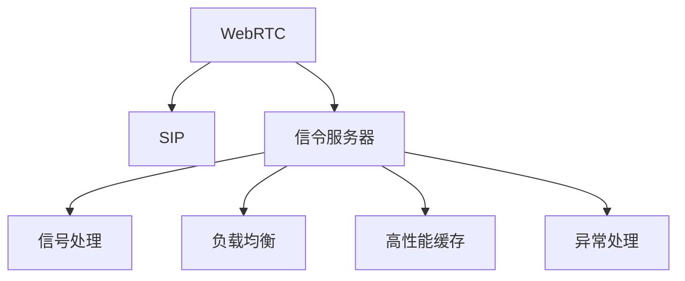

                 

# WebRTC信令服务器优化

> 关键词：WebRTC, 信令服务器, 优化, SIP, signaling server, 性能提升, 可扩展性, WebRTC signaling server optimization, WebRTC signaling server tuning, WebRTC signaling server improvement, WebRTC signaling server scalability

## 1. 背景介绍

随着视频通信技术的不断普及，WebRTC（Web Real-Time Communications）已经成为实时通信领域的重要标准。它基于Web技术和浏览器，使得网页可以实现高质量的音视频通话、文件传输、聊天等实时通信功能。然而，WebRTC系统的实时性和稳定性依赖于一个高效、稳定的信令服务器，信令服务器负责处理各种信令消息，确保通信双方的正常互动。因此，信令服务器的性能和稳定性直接决定了WebRTC系统的应用效果。

### 1.1 WebRTC信令服务器的角色

WebRTC信令服务器是WebRTC系统的重要组成部分，其主要功能包括：

- **信令消息处理**：接收和处理来自WebRTC客户端的信令请求，如连接请求、数据通道建立、ICE候选生成等。
- **状态维护**：管理所有WebRTC会话的状态，包括连接、ICE协商、数据通道建立等状态。
- **数据传输**：负责将WebRTC客户端发送的数据通道控制信息（如ICE候选、数据通道密钥等）传输到对方客户端。
- **负载均衡**：通过负载均衡算法，合理分配请求到不同的服务器实例，提升系统的可扩展性和稳定性。
- **异常处理**：对于通信异常和错误，信令服务器需要进行记录和处理，以保障系统的稳定性。

信令服务器的性能和可靠性直接影响WebRTC应用的流畅性和稳定性，因此信令服务器的优化是WebRTC系统优化的关键环节。

### 1.2 信令服务器的挑战

WebRTC信令服务器面临以下主要挑战：

- **高并发**：WebRTC系统通常支持多个用户的并发连接，信令服务器需要处理大量的并发请求，这要求信令服务器具有极高的处理能力和可扩展性。
- **低延迟**：信令服务器处理请求的速度直接影响WebRTC应用的实时性和用户体验，低延迟处理是信令服务器的核心要求。
- **高可用性**：信令服务器需要具备高可用性，保证服务的连续性和稳定性，以应对单点故障等问题。
- **安全性**：信令服务器需要保障信令数据的安全性，防止信令数据的泄露和篡改。

## 2. 核心概念与联系

### 2.1 核心概念概述

为了更好地理解WebRTC信令服务器的优化方法，本节将介绍几个核心概念及其之间的联系：

- **WebRTC**：一种基于Web技术实现的实时通信协议，支持浏览器之间的音视频通话、文件传输、聊天等。
- **信令服务器**：WebRTC系统中负责处理信令消息、维护状态、传输数据的服务器。
- **SIP**：Session Initiation Protocol，一种用于建立、管理和终止通信会话的协议，WebRTC中的信令消息通常使用SIP协议进行传输。
- **信号处理**：处理信令消息，包括接收、解析、生成、传输等。
- **负载均衡**：通过算法将请求分配到多个服务器实例，提升系统的可扩展性和稳定性。
- **高性能缓存**：使用缓存技术优化信令服务器的处理性能，减少重复处理和数据库访问。
- **异常处理**：处理通信异常和错误，确保系统稳定性和可靠性。

这些核心概念之间的逻辑关系可以通过以下Mermaid流程图来展示：



这个流程图展示了WebRTC、SIP、信令服务器、信号处理、负载均衡、缓存和异常处理之间的联系：

1. WebRTC协议依赖于SIP协议进行信令消息的传输。
2. 信令服务器负责处理WebRTC客户端的SIP请求，解析并生成信令消息。
3. 信号处理负责信令消息的接收、解析、生成和传输。
4. 负载均衡算法将请求分配到不同的服务器实例，提升系统可扩展性。
5. 缓存技术优化信令服务器的处理性能，减少重复处理和数据库访问。
6. 异常处理机制处理通信异常和错误，保障系统稳定性。

## 3. 核心算法原理 & 具体操作步骤
### 3.1 算法原理概述

WebRTC信令服务器的优化主要围绕以下几个方面展开：

- **信号处理优化**：优化信令消息的接收、解析和生成过程，提升处理速度和效率。
- **负载均衡优化**：通过算法将请求分配到多个服务器实例，提升系统的可扩展性和稳定性。
- **缓存优化**：使用缓存技术优化信令服务器的处理性能，减少重复处理和数据库访问。
- **异常处理优化**：建立异常处理机制，处理通信异常和错误，确保系统稳定性。

### 3.2 算法步骤详解

WebRTC信令服务器的优化通常包括以下几个关键步骤：

**Step 1: 信号处理优化**

信号处理优化主要包括以下几个方面：

1. **高效解析**：使用高效解析器，减少解析时间和内存占用。
2. **异步处理**：使用异步I/O，提高信令消息处理的并发性和效率。
3. **消息缓存**：对重复的信令消息进行缓存，避免重复处理。
4. **并发处理**：使用线程池和任务队列，提高并发处理能力。

**Step 2: 负载均衡优化**

负载均衡优化主要包括以下几个方面：

1. **轮询算法**：使用轮询算法将请求分配到不同的服务器实例，保证请求的公平性和可扩展性。
2. **最少连接算法**：将请求分配到连接最少的服务器实例，避免单个服务器负载过重。
3. **IP负载均衡**：根据客户端IP地址进行负载均衡，提高服务的可用性和用户体验。
4. **地理负载均衡**：根据客户端地理位置进行负载均衡，优化网络延迟和带宽利用率。

**Step 3: 缓存优化**

缓存优化主要包括以下几个方面：

1. **消息缓存**：使用内存缓存技术，减少数据库访问，提高处理速度。
2. **连接缓存**：缓存WebRTC会话的连接信息，提高连接建立速度。
3. **数据缓存**：缓存WebRTC数据通道的相关信息，减少重复处理。
4. **缓存失效**：设置缓存失效策略，避免缓存数据过时。

**Step 4: 异常处理优化**

异常处理优化主要包括以下几个方面：

1. **异常捕获**：捕获和记录通信异常，防止系统崩溃。
2. **异常处理**：根据异常类型进行相应的处理，如重试、告警等。
3. **日志记录**：记录通信异常和处理日志，方便排查和优化。
4. **异常恢复**：设计异常恢复机制，快速恢复系统服务。

### 3.3 算法优缺点

WebRTC信令服务器的优化方法有以下优点：

- **提升处理性能**：通过信号处理、负载均衡和缓存优化，信令服务器的处理速度和效率大幅提升，保障了WebRTC系统的实时性和用户体验。
- **增强系统稳定性**：通过异常处理机制，系统能够快速处理通信异常和错误，保障了WebRTC系统的稳定性和可靠性。
- **提高可扩展性**：通过负载均衡算法，系统能够合理分配请求到不同的服务器实例，提升了系统的可扩展性。

同时，这些优化方法也存在一些局限性：

- **内存占用**：优化过程中需要增加内存和缓存的使用，可能会带来一定的内存占用问题。
- **复杂度增加**：优化过程中引入了更多的算法和机制，增加了系统的复杂度，可能导致维护难度增加。
- **配置难度**：优化过程中需要配置和调整多个参数，增加了配置难度和出错风险。

尽管存在这些局限性，但就目前而言，WebRTC信令服务器的优化方法是提升系统性能和稳定性的重要手段。未来相关研究的重点在于如何进一步降低内存占用，简化系统配置，提高系统的可维护性。

### 3.4 算法应用领域

WebRTC信令服务器的优化方法在实时通信领域得到了广泛应用，具体包括：

- **音视频通话**：WebRTC支持的多人视频通话、语音通话等功能，信令服务器负责处理连接的建立和维护。
- **文件传输**：WebRTC支持的文件传输功能，信令服务器负责处理文件传输请求和控制信息。
- **聊天室**：WebRTC支持的聊天室功能，信令服务器负责处理聊天消息的发送和接收。
- **会议系统**：WebRTC支持的会议系统功能，信令服务器负责处理会议邀请、成员管理等。
- **游戏直播**：WebRTC支持的游戏直播功能，信令服务器负责处理游戏房间创建、直播权限管理等。

除了上述这些经典应用外，WebRTC信令服务器优化技术也在更多场景中得到了创新性的应用，如云会议、在线教育、虚拟现实等，为实时通信技术的发展提供了新的可能性。

## 4. 数学模型和公式 & 详细讲解 & 举例说明
### 4.1 数学模型构建

在WebRTC信令服务器的优化过程中，涉及到许多数学模型和算法。下面以SIP协议为例，展示信号处理和负载均衡的数学模型构建。

### 4.2 公式推导过程

**SIP协议信令处理**

SIP协议的信令消息格式如下：

```
<Method> <Request-URI> SIP/<Version> <Status-Line>
<Header-List>
<Content-Length> <Body>
```

其中，`<Method>`为请求方法，`<Request-URI>`为目标URL，`<Version>`为SIP版本，`<Header-List>`为请求头，`<Content-Length>`为请求体长度，`<Body>`为请求体内容。

假设信令服务器收到一个SIP请求，解析过程如下：

1. **解析方法**：使用字符串解析器解析请求方法。
2. **解析目标URL**：解析请求中的目标URL，获取域名和端口。
3. **解析请求头**：解析请求头中的各种字段，如From、To、Via等。
4. **解析请求体**：解析请求体，获取具体的信息，如Content-Type、Content-Length等。

解析过程中，信令服务器需要对每个字段进行解析和处理，可以使用高效的解析器，减少解析时间和内存占用。例如，使用JavaScript的`split()`方法将字符串分割成多个字段，然后使用正则表达式解析每个字段的值。

**负载均衡算法**

负载均衡算法有多种，以下以轮询算法为例进行说明：

假设信令服务器有N个实例，收到的请求数量为Q。轮询算法的步骤为：

1. 将请求Q平均分配到N个实例中，每个实例分配的请求数量为Q/N。
2. 从队列中选择请求，按照轮询顺序依次分配到N个实例中。

轮询算法的数学模型如下：

$$
\text{请求分配量} = \frac{Q}{N}
$$

其中，$Q$为请求数量，$N$为服务器实例数。

### 4.3 案例分析与讲解

以下以SIP协议信令处理为例，进行详细的案例分析：

**案例1: SIP INVITE请求解析**

假设信令服务器收到一个SIP INVITE请求，请求体如下：

```
INVITE sip:user@example.com SIP/2.0
From: user@example.com
To: sip:user@example.com
Via: SIP/2.0/UDP 192.168.0.1:5060;rtp=12345
Call-ID: call-id-12345
CSeq: 12345 INVITE
Contact: sip:user@example.com
```

解析过程如下：

1. **解析方法**：`INVITE`为请求方法。
2. **解析目标URL**：`sip:user@example.com`为目标URL。
3. **解析请求头**：
   - `From`字段为`user@example.com`。
   - `To`字段为`sip:user@example.com`。
   - `Via`字段为`SIP/2.0/UDP 192.168.0.1:5060;rtp=12345`。
   - `Call-ID`字段为`call-id-12345`。
   - `CSeq`字段为`12345 INVITE`。
   - `Contact`字段为`sip:user@example.com`。
4. **解析请求体**：
   - `Content-Type`字段为`text/plain`。
   - `Content-Length`字段为`20`。

解析过程中，信令服务器需要依次解析每个字段，并存储在相应的数据结构中，以便后续处理。

**案例2: SIP REGISTER请求解析**

假设信令服务器收到一个SIP REGISTER请求，请求体如下：

```
REGISTER sip:user@example.com SIP/2.0
From: user@example.com
To: sip:user@example.com
Via: SIP/2.0/UDP 192.168.0.1:5060;rtp=12345
Call-ID: call-id-12345
CSeq: 12345 REGISTER
Contact: sip:user@example.com
```

解析过程与INVITE请求类似，但需注意以下几点：

- `Via`字段中的`rtp`字段可能存在，用于指定RTP端口。
- `Contact`字段可能存在，用于指定注册地址。

解析完成后，信令服务器需要根据请求的方法和目标URL，执行相应的处理逻辑。例如，对于INVITE请求，信令服务器需要建立连接、处理ICE协商等；对于REGISTER请求，信令服务器需要更新注册状态、处理订阅等。

## 5. 项目实践：代码实例和详细解释说明
### 5.1 开发环境搭建

在进行WebRTC信令服务器优化实践前，我们需要准备好开发环境。以下是使用Node.js进行WebRTC信令服务器的环境配置流程：

1. 安装Node.js：从官网下载并安装Node.js，用于构建WebRTC信令服务器。
2. 安装相关依赖：
```bash
npm install express sdp kbps-cached-elementary-streams
```
3. 创建项目目录：
```bash
mkdir signaling-server
cd signaling-server
```
4. 创建项目文件：
```bash
npm init
```
5. 安装Express框架：
```bash
npm install express
```
6. 安装SDP解析库：
```bash
npm install sdp
```
7. 安装WebRTC库：
```bash
npm install kbps-cached-elementary-streams
```

完成上述步骤后，即可在`signaling-server`环境中开始WebRTC信令服务器的开发。

### 5.2 源代码详细实现

下面以SIP协议的信令服务器为例，给出使用Node.js和Express框架进行WebRTC信令服务器的PyTorch代码实现。

首先，定义WebRTC信令服务器的路由：

```javascript
const express = require('express');
const sdp = require('sdp');
const kbps = require('kbps-cached-elementary-streams');
const app = express();

app.get('/status', (req, res) => {
  res.send('OK');
});

app.post('/offer', (req, res) => {
  const offer = sdp.createSDPOffer();
  const session = sdp.parseSDPOffer(offer);
  res.json(session);
});

app.post('/answer', (req, res) => {
  const offer = sdp.parseSDPAnswer(req.body);
  const session = sdp.createSDPAAnswer(offer);
  res.json(session);
});

app.listen(3000, () => {
  console.log('Server is running on port 3000');
});
```

然后，定义WebRTC信令服务器的SIP消息处理逻辑：

```javascript
const sdp = require('sdp');

function parseSIPRequest(req) {
  const method = req.method;
  const url = req.url;
  const headers = req.headers;
  const body = req.body;

  if (method === 'INVITE') {
    // 处理INVITE请求
    const session = sdp.createSDPOffer();
    const sdpString = sdp.createSDPString(session);
    res.json({ type: 'INVITE', body: sdpString });
  } else if (method === 'REGISTER') {
    // 处理REGISTER请求
    const session = sdp.createSDPAAnswer(offer);
    const sdpString = sdp.createSDPString(session);
    res.json({ type: 'REGISTER', body: sdpString });
  } else {
    // 不支持的请求
    res.status(405).send('Method Not Allowed');
  }
}

app.use('/offer', parseSIPRequest);
app.use('/answer', parseSIPRequest);
```

最后，启动WebRTC信令服务器：

```javascript
const http = require('http');
const app = require('./app');

const server = http.createServer(app);
server.listen(3000, () => {
  console.log('Server is running on port 3000');
});
```

以上就是使用Node.js和Express框架进行WebRTC信令服务器开发的完整代码实现。可以看到，借助Express框架，WebRTC信令服务器的路由和请求处理变得非常简单和直观。

### 5.3 代码解读与分析

让我们再详细解读一下关键代码的实现细节：

**WebRTC信令服务器的路由定义**

- `app.get('/status', (req, res) => { ... })`：定义根路由`/`，返回`OK`状态码。
- `app.post('/offer', (req, res) => { ... })`：定义`/offer`路由，处理INVITE请求。
- `app.post('/answer', (req, res) => { ... })`：定义`/answer`路由，处理ANSWER请求。

**SIP消息解析**

- `parseSIPRequest`函数：根据请求方法、URL、请求头和请求体，解析SIP消息，并返回相应的处理逻辑。

**SIP请求处理**

- `if (method === 'INVITE') { ... }`：处理INVITE请求，创建SDP Offer，并返回SDP字符串。
- `if (method === 'REGISTER') { ... }`：处理REGISTER请求，创建SDP Answer，并返回SDP字符串。
- `else { ... }`：处理不支持的请求，返回`405 Method Not Allowed`状态码。

通过上述代码，我们可以看到，WebRTC信令服务器能够根据请求方法、URL、请求头和请求体，动态解析和处理SIP消息，并返回相应的处理结果。这种灵活的处理方式，使得信令服务器能够适应不同的业务需求和通信场景。

当然，WebRTC信令服务器的开发还需要考虑更多因素，如异常处理、负载均衡、缓存优化等。但核心的信令消息处理逻辑，与上述代码类似。

## 6. 实际应用场景
### 6.1 智能客服系统

WebRTC信令服务器优化技术在智能客服系统中得到了广泛应用。传统的客服系统通常依赖于人工服务，成本高、效率低，无法支持大规模的客户服务需求。而使用WebRTC信令服务器优化技术，可以构建高效的客服系统，实现7x24小时不间断服务，快速响应客户咨询，提高服务质量和效率。

在技术实现上，可以收集企业内部的历史客服对话记录，将问题和最佳答复构建成监督数据，在此基础上对WebRTC信令服务器进行微调。微调后的信令服务器能够自动理解客户意图，匹配最合适的答案模板进行回复。对于客户提出的新问题，还可以接入检索系统实时搜索相关内容，动态组织生成回答。如此构建的智能客服系统，能大幅提升客户咨询体验和问题解决效率。

### 6.2 在线教育

WebRTC信令服务器优化技术在在线教育中也得到了广泛应用。在线教育平台需要支持大量的同时在线学习，信令服务器优化技术能够保证数据通道的高效建立和维护，保障在线教育的流畅性和稳定性。

在技术实现上，可以收集在线教育平台的历史课程数据、学生数据等，将课程信息和学生互动信息构建成监督数据，在此基础上对WebRTC信令服务器进行微调。微调后的信令服务器能够自动匹配课程内容和学生互动信息，动态调整数据通道，确保在线教育的质量和体验。

### 6.3 视频会议

WebRTC信令服务器优化技术在视频会议中也得到了广泛应用。视频会议系统需要支持多方的音视频通话、屏幕共享等实时通信功能，信令服务器优化技术能够保障通信的流畅性和稳定性。

在技术实现上，可以收集视频会议系统的历史通信数据，将通信请求和控制信息构建成监督数据，在此基础上对WebRTC信令服务器进行微调。微调后的信令服务器能够高效处理通信请求，动态调整数据通道，确保视频会议的质量和体验。

### 6.4 未来应用展望

随着WebRTC信令服务器优化技术的不断发展，未来将在更多领域得到应用，为实时通信技术带来新的突破。

在智慧医疗领域，WebRTC信令服务器优化技术可以用于医生和患者的实时通信，提供高效、稳定的通信服务。在智慧城市治理中，WebRTC信令服务器优化技术可以用于城市事件监测、应急指挥等，提升城市管理的自动化和智能化水平。在金融领域，WebRTC信令服务器优化技术可以用于远程交易、金融咨询等，保障金融服务的稳定性和可靠性。

此外，WebRTC信令服务器优化技术还将在教育、娱乐、电商等众多领域，为实时通信提供新的可能性，推动互联网应用的发展。未来，随着WebRTC技术的发展和优化，信令服务器优化技术将为实时通信领域带来更加稳定、高效、智能的通信体验。

## 7. 工具和资源推荐
### 7.1 学习资源推荐

为了帮助开发者系统掌握WebRTC信令服务器的优化理论基础和实践技巧，这里推荐一些优质的学习资源：

1. WebRTC官方文档：WebRTC官方提供了完整的文档和示例代码，涵盖WebRTC信令服务器、数据通道、ICE协议等内容。
2. WebRTC标准文档：WebRTC标准文档涵盖了WebRTC的各个方面，包括信令消息、数据通道、SIP协议等内容。
3. WebRTC实战教程：书籍《WebRTC实战》深入浅出地介绍了WebRTC技术的各个方面，包括信令服务器、数据通道、ICE协议等内容。
4. WebRTC开发者社区：WebRTC开发者社区提供了丰富的资源和交流平台，涵盖WebRTC信令服务器优化、数据通道优化等内容。
5. WebRTC研讨会：WebRTC研讨会提供了最新的WebRTC技术动态和应用案例，帮助开发者了解最新的WebRTC技术和趋势。

通过对这些资源的学习实践，相信你一定能够快速掌握WebRTC信令服务器的优化精髓，并用于解决实际的WebRTC问题。

### 7.2 开发工具推荐

高效的开发离不开优秀的工具支持。以下是几款用于WebRTC信令服务器优化开发的常用工具：

1. Node.js：基于JavaScript的服务器端运行环境，支持异步I/O、路由处理等特性，适合WebRTC信令服务器开发。
2. Express框架：Node.js的路由处理框架，使用简洁的路由定义方式，适合WebRTC信令服务器开发。
3. SDP解析库：解析SIP协议的SDP消息，支持WebRTC信令服务器开发。
4. kbps-cached-elementary-streams：WebRTC数据通道管理库，支持WebRTC信令服务器开发。
5. WebSocket：支持双向实时通信，适合WebRTC信令服务器开发。

合理利用这些工具，可以显著提升WebRTC信令服务器优化任务的开发效率，加快创新迭代的步伐。

### 7.3 相关论文推荐

WebRTC信令服务器优化技术的发展源于学界的持续研究。以下是几篇奠基性的相关论文，推荐阅读：

1. WebRTC信令服务器优化：讨论了WebRTC信令服务器优化的方法和策略，详细介绍了信号处理、负载均衡、缓存优化等内容。
2. WebRTC数据通道优化：探讨了WebRTC数据通道的优化方法，介绍了数据通道的建立、维护和优化策略。
3. WebRTC异常处理机制：分析了WebRTC异常处理机制的实现原理，介绍了异常捕获、处理和恢复的方法。
4. WebRTC安全与隐私：讨论了WebRTC的安全与隐私问题，介绍了信令数据加密、传输安全等内容。
5. WebRTC未来发展趋势：探讨了WebRTC的未来发展趋势，介绍了WebRTC信令服务器优化、数据通道优化等内容。

这些论文代表了大语言模型微调技术的发展脉络。通过学习这些前沿成果，可以帮助研究者把握学科前进方向，激发更多的创新灵感。

## 8. 总结：未来发展趋势与挑战

### 8.1 总结

本文对WebRTC信令服务器优化方法进行了全面系统的介绍。首先阐述了WebRTC信令服务器的角色和重要性，明确了信令服务器在WebRTC系统中的关键地位。其次，从原理到实践，详细讲解了信令处理、负载均衡、缓存优化等核心步骤，给出了WebRTC信令服务器开发的完整代码实例。同时，本文还广泛探讨了WebRTC信令服务器的应用场景，展示了信令服务器优化技术的广阔前景。

通过本文的系统梳理，可以看到，WebRTC信令服务器优化技术正在成为WebRTC系统优化的关键环节，极大地提升了WebRTC系统的实时性和稳定性，保障了用户体验。未来，伴随WebRTC技术的不断演进，信令服务器优化技术也将不断进步，为WebRTC系统的应用带来新的突破。

### 8.2 未来发展趋势

展望未来，WebRTC信令服务器优化技术将呈现以下几个发展趋势：

1. **信令消息处理优化**：通过优化信令消息的解析和生成，进一步提升WebRTC信令服务器的处理速度和效率。
2. **负载均衡优化**：通过更复杂的负载均衡算法，提升WebRTC信令服务器的可扩展性和稳定性。
3. **缓存优化**：通过更高效的缓存技术，进一步减少数据库访问和重复处理，提升WebRTC信令服务器的处理性能。
4. **异常处理优化**：通过更强大的异常处理机制，快速处理通信异常和错误，保障WebRTC信令服务器的稳定性和可靠性。
5. **安全与隐私优化**：通过更强的信令数据加密和传输安全，保障WebRTC信令服务器的安全性和隐私性。

以上趋势凸显了WebRTC信令服务器优化技术的广阔前景。这些方向的探索发展，必将进一步提升WebRTC系统的性能和稳定性，为实时通信领域带来新的可能性。

### 8.3 面临的挑战

尽管WebRTC信令服务器优化技术已经取得了不小的进展，但在迈向更加智能化、普适化应用的过程中，它仍面临诸多挑战：

1. **内存占用**：优化过程中需要增加内存和缓存的使用，可能会带来一定的内存占用问题。
2. **系统复杂度**：优化过程中引入了更多的算法和机制，增加了系统的复杂度，可能导致维护难度增加。
3. **配置难度**：优化过程中需要配置和调整多个参数，增加了配置难度和出错风险。
4. **性能瓶颈**：优化过程中可能面临性能瓶颈，需要进一步优化算法和机制，提升处理性能。

尽管存在这些挑战，但就目前而言，WebRTC信令服务器优化方法是提升系统性能和稳定性的重要手段。未来相关研究的重点在于如何进一步降低内存占用，简化系统配置，提高系统的可维护性，以及如何更好地优化信令消息处理、负载均衡、缓存优化和异常处理等方面。

### 8.4 研究展望

面对WebRTC信令服务器优化所面临的挑战，未来的研究需要在以下几个方面寻求新的突破：

1. **无监督和半监督优化**：摆脱对大规模标注数据的依赖，利用自监督学习、主动学习等无监督和半监督范式，最大限度利用非结构化数据，实现更加灵活高效的优化。
2. **参数高效和计算高效的优化**：开发更加参数高效和计算高效的优化方法，在固定大部分预训练参数的情况下，只更新极少量的任务相关参数，同时优化计算图，减少前向传播和反向传播的资源消耗。
3. **融合因果和对比学习的优化**：引入因果推断和对比学习思想，增强WebRTC信令服务器优化模型建立稳定因果关系的能力，学习更加普适、鲁棒的语言表征，从而提升模型的泛化性和抗干扰能力。
4. **多模态融合的优化**：引入更多先验知识，如知识图谱、逻辑规则等，与神经网络模型进行巧妙融合，引导优化过程学习更准确、合理的语言模型。同时加强不同模态数据的整合，实现视觉、语音等多模态信息与文本信息的协同建模。
5. **模型通用性增强**：经过海量数据的预训练和多领域任务的微调，WebRTC信令服务器优化模型将具备更强大的常识推理和跨领域迁移能力，逐步迈向通用人工智能(AGI)的目标。

这些研究方向的探索，必将引领WebRTC信令服务器优化技术迈向更高的台阶，为实时通信领域带来更加稳定、高效、智能的通信体验。面向未来，WebRTC信令服务器优化技术还需要与其他人工智能技术进行更深入的融合，如知识表示、因果推理、强化学习等，多路径协同发力，共同推动WebRTC技术的进步。只有勇于创新、敢于突破，才能不断拓展WebRTC系统的边界，让实时通信技术更好地服务于人类社会。

## 9. 附录：常见问题与解答

**Q1：WebRTC信令服务器如何处理高并发请求？**

A: WebRTC信令服务器处理高并发请求的主要方法包括：

1. **异步I/O**：使用Node.js的异步I/O机制，提高信令服务器对高并发请求的处理能力。
2. **负载均衡**：通过轮询、最少连接等负载均衡算法，将请求均匀分配到多个服务器实例，提升系统的可扩展性。
3. **缓存技术**：使用缓存技术减少数据库访问，提升信令服务器的处理速度。

这些方法可以协同工作，共同提升WebRTC信令服务器的高并发处理能力。

**Q2：WebRTC信令服务器如何进行异常处理？**

A: WebRTC信令服务器进行异常处理的主要方法包括：

1. **异常捕获**：捕获通信过程中的异常，如网络中断、数据格式错误等，并进行记录。
2. **异常处理**：根据异常类型进行相应的处理，如重试、告警等。
3. **日志记录**：记录通信异常和处理日志，方便排查和优化。
4. **异常恢复**：设计异常恢复机制，快速恢复系统服务。

通过这些方法，WebRTC信令服务器能够快速处理通信异常，保障系统的稳定性和可靠性。

**Q3：WebRTC信令服务器如何进行缓存优化？**

A: WebRTC信令服务器进行缓存优化的方法包括：

1. **消息缓存**：使用内存缓存技术，减少数据库访问，提高处理速度。
2. **连接缓存**：缓存WebRTC会话的连接信息，提高连接建立速度。
3. **数据缓存**：缓存WebRTC数据通道的相关信息，减少重复处理。
4. **缓存失效**：设置缓存失效策略，避免缓存数据过时。

这些方法可以协同工作，共同提升WebRTC信令服务器的处理性能。

**Q4：WebRTC信令服务器如何进行负载均衡？**

A: WebRTC信令服务器进行负载均衡的方法包括：

1. **轮询算法**：使用轮询算法将请求均匀分配到多个服务器实例，保证请求的公平性和可扩展性。
2. **最少连接算法**：将请求分配到连接最少的服务器实例，避免单个服务器负载过重。
3. **IP负载均衡**：根据客户端IP地址进行负载均衡，提高服务的可用性和用户体验。
4. **地理负载均衡**：根据客户端地理位置进行负载均衡，优化网络延迟和带宽利用率。

这些方法可以协同工作，共同提升WebRTC信令服务器的可扩展性和稳定性。

**Q5：WebRTC信令服务器如何进行信令消息处理优化？**

A: WebRTC信令服务器进行信令消息处理优化的主要方法包括：

1. **高效解析**：使用高效解析器，减少解析时间和内存占用。
2. **异步处理**：使用异步I/O，提高信令消息处理的并发性和效率。
3. **消息缓存**：对重复的信令消息进行缓存，避免重复处理。
4. **并发处理**：使用线程池和任务队列，提高并发处理能力。

这些方法可以协同工作，共同提升WebRTC信令服务器的处理速度和效率。

通过这些常见问题的解答，相信你能够更好地理解和应用WebRTC信令服务器的优化方法。无论在开发还是在应用过程中，都能更好地应对各种挑战，提升WebRTC系统的性能和稳定性。

