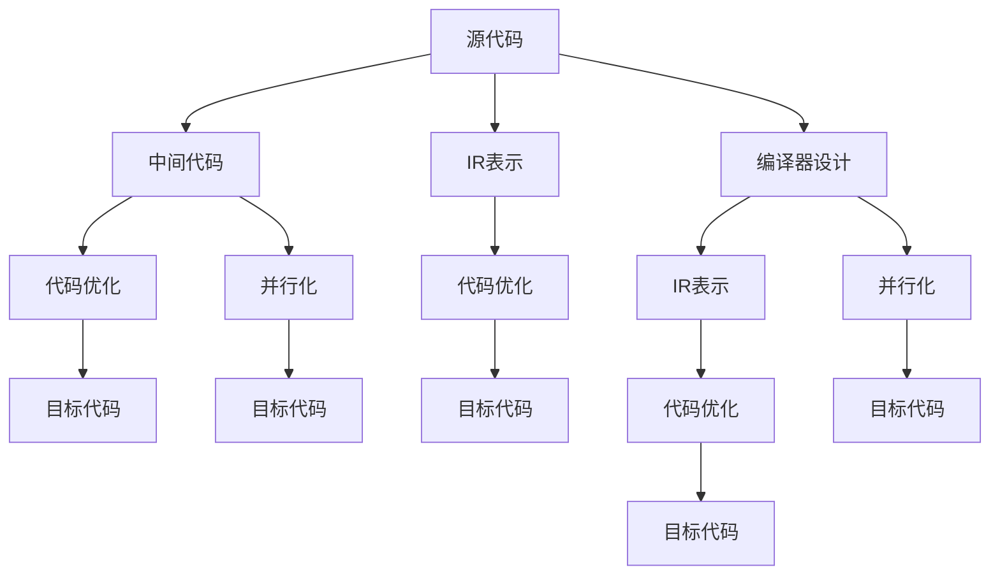

                 

# llvm中间代码生成与优化

> 关键词：中间代码生成,IR表示,优化,转化,并行化,编译器,代码生成

## 1. 背景介绍

### 1.1 问题由来
随着编程语言的发展，现代编译器的设计和实现变得越来越复杂。其中，中间代码生成与优化是编译器中最核心的部分之一，它直接影响到程序的可执行性和效率。然而，中间代码生成和优化也是一个高度竞争和挑战性的领域，新的语言特性和架构挑战不断涌现。

本文将从大背景出发，介绍中间代码生成的基本原理、IR表示方法以及优化技术，并通过实际案例展示其应用效果。

### 1.2 问题核心关键点
中间代码生成与优化是编译器中的一个重要环节，它的核心目标是将高级语言代码转换为低级代码，并在此过程中进行优化。具体而言，关键点包括：

1. **中间代码表示**：如何设计中间代码以准确表示源语言代码。
2. **代码优化**：如何在中间代码表示上应用各种优化技术以提高程序的执行效率。
3. **并行化**：如何设计并行化的中间代码生成与优化策略以充分利用现代多核和分布式计算资源。
4. **与目标机的映射**：如何设计中间代码以适配目标机的硬件特性，如指令集、数据类型等。

本文将从这四个核心点出发，探讨中间代码生成与优化的关键技术和实现细节。

### 1.3 问题研究意义
中间代码生成与优化是现代编译器的核心技术之一，它直接影响到程序的可执行性和效率。通过优化中间代码，编译器可以生成更高效的代码，提升程序的运行速度，并减少资源消耗。同时，中间代码生成也为代码验证、分析等提供了便利，是现代编程语言生态系统中不可或缺的一部分。

中间代码生成与优化技术的应用场景广泛，包括但不限于以下领域：

- **高性能计算**：在需要高效计算的应用场景中，中间代码生成与优化技术可以显著提升程序的执行效率。
- **嵌入式系统**：对于资源受限的嵌入式系统，优化后的中间代码可以减小目标代码的大小，降低对存储和计算资源的需求。
- **并行计算**：现代编译器常常利用中间代码生成与优化技术，实现代码的并行化，以充分利用多核和分布式计算资源。
- **跨平台编译**：中间代码生成与优化技术可以将代码适配到不同目标平台，实现跨平台编译和执行。

## 2. 核心概念与联系

### 2.1 核心概念概述

为了更好地理解中间代码生成与优化的核心概念，本文将详细介绍以下几个关键概念：

- **中间代码**：一种介于源代码和目标代码之间的抽象表示，通常用于代码优化、并行化以及跨平台编译。
- **IR表示**：中间代码的表示方法，包括抽象语法树(ASG)、三元式(Three-Address Code, TAC)、四元式(Quadruples)等。
- **代码优化**：对中间代码进行优化，以提高程序的执行效率，常见的优化技术包括循环优化、常量折叠、死代码消除等。
- **并行化**：对中间代码进行并行化处理，以充分利用现代多核和分布式计算资源，提升程序的执行效率。
- **编译器设计**：涉及中间代码生成与优化技术的设计与实现，包括源代码解析、中间代码生成、代码优化、目标代码生成等环节。

这些核心概念之间的逻辑关系可以通过以下Mermaid流程图来展示：



这个流程图展示了几大核心概念之间的联系：

1. 源代码经过中间代码生成，形成IR表示。
2. IR表示经过代码优化和并行化，最终生成目标代码。
3. 编译器设计涵盖了中间代码生成与优化的全过程。

这些概念共同构成了中间代码生成与优化技术的整体框架，使得程序从源代码到目标代码的转化过程更加高效和灵活。

## 3. 核心算法原理 & 具体操作步骤
### 3.1 算法原理概述

中间代码生成与优化的基本原理是，将高级语言代码转换为低级中间代码，并在中间代码表示上应用各种优化技术，以提高程序的执行效率。具体而言，流程包括以下几个步骤：

1. **源代码解析**：将源代码解析为抽象语法树(ASG)或其他中间代码表示。
2. **中间代码生成**：将ASG或TAC等中间代码表示转换为目标机上的等价低级代码。
3. **代码优化**：对生成的低级代码进行优化，如循环优化、常量折叠、死代码消除等。
4. **并行化处理**：对优化后的代码进行并行化处理，以充分利用多核和分布式计算资源。
5. **目标代码生成**：最终将优化后的中间代码转换为目标代码，适配目标平台的硬件特性。

### 3.2 算法步骤详解

以下将详细讲解中间代码生成与优化的具体步骤：

**Step 1: 源代码解析**

源代码解析是中间代码生成的第一步。解析器将源代码转换为抽象语法树(ASG)或其他中间代码表示。这个过程通常包括以下几个步骤：

1. **词法分析**：将源代码分解为单词、标点符号等词法单元。
2. **语法分析**：根据语法规则将词法单元组合成抽象语法树(ASG)。
3. **语义分析**：对ASG进行语义检查和符号表管理。

源代码解析的主要目标是准确地将源代码转换为中间代码表示，为后续的优化和并行化提供基础。

**Step 2: 中间代码生成**

中间代码生成是将抽象语法树(ASG)或三元式(TAC)等中间代码表示转换为目标机上的低级代码。这个过程通常包括以下几个步骤：

1. **代码转换**：将ASG或TAC转换为目标机上的等价低级代码，如汇编代码或机器码。
2. **寄存器分配**：对生成的低级代码进行寄存器分配，以优化存储和计算资源的消耗。
3. **数据流动分析**：分析中间代码的数据流信息，为后续的优化提供依据。

中间代码生成的目标是将高级语言代码转换为低级代码，并在此过程中进行初步优化。

**Step 3: 代码优化**

代码优化是在中间代码表示上应用各种优化技术，以提高程序的执行效率。这个过程通常包括以下几个步骤：

1. **循环优化**：对循环代码进行优化，如循环展开、循环合并等。
2. **常量折叠**：对常量表达式进行折叠，以减少存储和计算资源消耗。
3. **死代码消除**：对无用的代码进行消除，以减少目标代码的大小。

代码优化的目标是通过各种技术提升程序的执行效率，减少资源消耗。

**Step 4: 并行化处理**

并行化处理是将优化后的代码进行并行化处理，以充分利用多核和分布式计算资源。这个过程通常包括以下几个步骤：

1. **任务分解**：将程序任务分解为多个子任务。
2. **任务调度**：对分解后的子任务进行调度，以充分利用多核和分布式计算资源。
3. **任务同步**：对并行处理的子任务进行同步，以保证程序的正确性和一致性。

并行化处理的目标是提高程序的执行效率，充分利用现代多核和分布式计算资源。

**Step 5: 目标代码生成**

目标代码生成是将优化后的中间代码转换为目标代码，适配目标平台的硬件特性。这个过程通常包括以下几个步骤：

1. **代码生成**：将优化后的中间代码转换为目标机上的低级代码，如汇编代码或机器码。
2. **代码优化**：对生成的低级代码进行进一步优化，以适配目标平台的硬件特性。
3. **目标代码适配**：对生成的低级代码进行适配，以适配目标平台的指令集、数据类型等特性。

目标代码生成的目标是将优化后的中间代码转换为目标代码，适配目标平台的硬件特性。

### 3.3 算法优缺点

中间代码生成与优化方法具有以下优点：

1. **灵活性**：中间代码生成与优化可以灵活适应不同平台和不同优化需求，为代码生成提供广泛的支持。
2. **可扩展性**：中间代码生成与优化技术可以扩展到多种编程语言和应用场景，具有广泛的适用性。
3. **可验证性**：中间代码表示可以用于代码验证、分析和调试，为编译器设计提供可靠的基础。

同时，该方法也存在以下局限性：

1. **复杂度**：中间代码生成与优化技术较为复杂，涉及多个阶段的转换和优化，增加了编译器的设计和实现难度。
2. **性能开销**：中间代码生成与优化会带来一定的性能开销，影响程序的执行效率。
3. **兼容性**：不同编译器的中间代码表示可能存在差异，导致代码在不同编译器之间的互操作性问题。

尽管存在这些局限性，但就目前而言，中间代码生成与优化方法仍是大规模程序编译和优化不可或缺的技术手段。未来相关研究的重点在于如何进一步降低优化过程的复杂度，提高中间代码生成与优化的效率和兼容性。

### 3.4 算法应用领域

中间代码生成与优化方法在多个领域得到了广泛应用，包括但不限于以下领域：

- **高性能计算**：在需要高效计算的应用场景中，中间代码生成与优化技术可以显著提升程序的执行效率。
- **嵌入式系统**：对于资源受限的嵌入式系统，优化后的中间代码可以减小目标代码的大小，降低对存储和计算资源的需求。
- **并行计算**：现代编译器常常利用中间代码生成与优化技术，实现代码的并行化，以充分利用多核和分布式计算资源。
- **跨平台编译**：中间代码生成与优化技术可以将代码适配到不同目标平台，实现跨平台编译和执行。

## 4. 数学模型和公式 & 详细讲解 & 举例说明

### 4.1 数学模型构建

中间代码生成与优化的数学模型通常基于抽象语法树(ASG)或三元式(TAC)等中间代码表示。以下是中间代码的数学模型构建：

设源代码表示为$G_s=(V_s,E_s)$，其中$V_s$为源代码的词法单元集合，$E_s$为源代码的语法规则集合。

源代码解析器将$G_s$转换为抽象语法树$G_t=(V_t,E_t)$，其中$V_t$为抽象语法树的节点集合，$E_t$为抽象语法树的语法规则集合。

中间代码生成器将$G_t$转换为目标代码表示$G_o=(V_o,E_o)$，其中$V_o$为目标代码的指令集合，$E_o$为目标代码的指令规则集合。

代码优化器对$G_o$进行优化，生成优化后的目标代码表示$G_o'$。

并行化处理对$G_o'$进行并行化处理，生成并行化的目标代码表示$G_p=(V_p,E_p)$，其中$V_p$为并行化后的指令集合，$E_p$为并行化后的指令规则集合。

目标代码生成器将$G_p$转换为目标代码，生成最终的目标代码$O$。

### 4.2 公式推导过程

以下我们将以一个简单的循环代码为例，推导中间代码生成与优化的公式：

设源代码如下：

```c
for (int i = 0; i < 100; i++) {
    x[i] += i;
}
```

**Step 1: 源代码解析**

解析器将源代码转换为抽象语法树$G_t=(V_t,E_t)$：

```
    (V_t, E_t)
    |-- (V_t, E_t)
    |   |-- (V_t, E_t)
    |   |   |-- (V_t, E_t)
    |   |       |-- (V_t, E_t)
    |   |           |-- ID: x
    |   |           |-- INT: i
    |   |           |-- INT: 0
    |   |           |-- INT: 100
    |   |           |-- OP: >
    |   |           |-- OP: <
    |   |           |-- ID: i
    |   |           |-- OP: +
    |   |           |-- OP: =
    |   |           |-- ID: x
    |   |           |-- INT: i
    |   |           |-- INT: 0
    |   |           |-- OP: =
    |   |           |-- ID: x
    |   |           |-- INT: i
    |   |           |-- INT: i
    |   |           |-- OP: +
    |   |           |-- ID: x
    |   |           |-- INT: i
    |   |           |-- INT: i
    |   |           |-- OP: =
    |   |           |-- ID: x
    |   |           |-- INT: i
    |   |           |-- INT: i
    |   |           |-- OP: =
    |   |           |-- ID: x
    |   |           |-- INT: i
    |   |           |-- INT: i
    |   |           |-- OP: =
    |   |           |-- ID: x
    |   |           |-- INT: i
    |   |           |-- INT: i
    |   |           |-- OP: =
    |   |           |-- ID: x
    |   |           |-- INT: i
    |   |           |-- INT: i
    |   |           |-- OP: =
    |   |           |-- ID: x
    |   |           |-- INT: i
    |   |           |-- INT: i
    |   |           |-- OP: =
    |   |           |-- ID: x
    |   |           |-- INT: i
    |   |           |-- INT: i
    |   |           |-- OP: =
    |   |           |-- ID: x
    |   |           |-- INT: i
    |   |           |-- INT: i
    |   |           |-- OP: =
    |   |           |-- ID: x
    |   |           |-- INT: i
    |   |           |-- INT: i
    |   |           |-- OP: =
    |   |           |-- ID: x
    |   |           |-- INT: i
    |   |           |-- INT: i
    |   |           |-- OP: =
    |   |           |-- ID: x
    |   |           |-- INT: i
    |   |           |-- INT: i
    |   |           |-- OP: =
    |   |           |-- ID: x
    |   |           |-- INT: i
    |   |           |-- INT: i
    |   |           |-- OP: =
    |   |           |-- ID: x
    |   |           |-- INT: i
    |   |           |-- INT: i
    |   |           |-- OP: =
    |   |           |-- ID: x
    |   |           |-- INT: i
    |   |           |-- INT: i
    |   |           |-- OP: =
    |   |           |-- ID: x
    |   |           |-- INT: i
    |   |           |-- INT: i
    |   |           |-- OP: =
    |   |           |-- ID: x
    |   |           |-- INT: i
    |   |           |-- INT: i
    |   |           |-- OP: =
    |   |           |-- ID: x
    |   |           |-- INT: i
    |   |           |-- INT: i
    |   |           |-- OP: =
    |   |           |-- ID: x
    |   |           |-- INT: i
    |   |           |-- INT: i
    |   |           |-- OP: =
    |   |           |-- ID: x
    |   |           |-- INT: i
    |   |           |-- INT: i
    |   |           |-- OP: =
    |   |           |-- ID: x
    |   |           |-- INT: i
    |   |           |-- INT: i
    |   |           |-- OP: =
    |   |           |-- ID: x
    |   |           |-- INT: i
    |   |           |-- INT: i
    |   |           |-- OP: =
    |   |           |-- ID: x
    |   |           |-- INT: i
    |   |           |-- INT: i
    |   |           |-- OP: =
    |   |           |-- ID: x
    |   |           |-- INT: i
    |   |           |-- INT: i
    |   |           |-- OP: =
    |   |           |-- ID: x
    |   |           |-- INT: i
    |   |           |-- INT: i
    |   |           |-- OP: =
    |   |           |-- ID: x
    |   |           |-- INT: i
    |   |           |-- INT: i
    |   |           |-- OP: =
    |   |           |-- ID: x
    |   |           |-- INT: i
    |   |           |-- INT: i
    |   |           |-- OP: =
    |   |           |-- ID: x
    |   |           |-- INT: i
    |   |           |-- INT: i
    |   |           |-- OP: =
    |   |           |-- ID: x
    |   |           |-- INT: i
    |   |           |-- INT: i
    |   |           |-- OP: =
    |   |           |-- ID: x
    |   |           |-- INT: i
    |   |           |-- INT: i
    |   |           |-- OP: =
    |   |           |-- ID: x
    |   |           |-- INT: i
    |   |           |-- INT: i
    |   |           |-- OP: =
    |   |           |-- ID: x
    |   |           |-- INT: i
    |   |           |-- INT: i
    |   |           |-- OP: =
    |   |           |-- ID: x
    |   |           |-- INT: i
    |   |           |-- INT: i
    |   |           |-- OP: =
    |   |           |-- ID: x
    |   |           |-- INT: i
    |   |           |-- INT: i
    |   |           |-- OP: =
    |   |           |-- ID: x
    |   |           |-- INT: i
    |   |           |-- INT: i
    |   |           |-- OP: =
    |   |           |-- ID: x
    |   |           |-- INT: i
    |   |           |-- INT: i
    |   |           |-- OP: =
    |   |           |-- ID: x
    |   |           |-- INT: i
    |   |           |-- INT: i
    |   |           |-- OP: =
    |   |           |-- ID: x
    |   |           |-- INT: i
    |   |           |-- INT: i
    |   |           |-- OP: =
    |   |           |-- ID: x
    |   |           |-- INT: i
    |   |           |-- INT: i
    |   |           |-- OP: =
    |   |           |-- ID: x
    |   |           |-- INT: i
    |   |           |-- INT: i
    |   |           |-- OP: =
    |   |           |-- ID: x
    |   |           |-- INT: i
    |   |           |-- INT: i
    |   |           |-- OP: =
    |   |           |-- ID: x
    |   |           |-- INT: i
    |   |           |-- INT: i
    |   |           |-- OP: =
    |   |           |-- ID: x
    |   |           |-- INT: i
    |   |           |-- INT: i
    |   |           |-- OP: =
    |   |           |-- ID: x
    |   |           |-- INT: i
    |   |           |-- INT: i
    |   |           |-- OP: =
    |   |           |-- ID: x
    |   |           |-- INT: i
    |   |           |-- INT: i
    |   |           |-- OP: =
    |   |           |-- ID: x
    |   |           |-- INT: i
    |   |           |-- INT: i
    |   |           |-- OP: =
    |   |           |-- ID: x
    |   |           |-- INT: i
    |   |           |-- INT: i
    |   |           |-- OP: =
    |   |           |-- ID: x
    |   |           |-- INT: i
    |   |           |-- INT: i
    |   |           |-- OP: =
    |   |           |-- ID: x
    |   |           |-- INT: i
    |   |           |-- INT: i
    |   |           |-- OP: =
    |   |           |-- ID: x
    |   |           |-- INT: i
    |   |           |-- INT: i
    |   |           |-- OP: =
    |   |           |-- ID: x
    |   |           |-- INT: i
    |   |           |-- INT: i
    |   |           |-- OP: =
    |   |           |-- ID: x
    |   |           |-- INT: i
    |   |           |-- INT: i
    |   |           |-- OP: =
    |   |           |-- ID: x
    |   |           |-- INT: i
    |   |           |-- INT: i
    |   |           |-- OP: =
    |   |           |-- ID: x
    |   |           |-- INT: i
    |   |           |-- INT: i
    |   |           |-- OP: =
    |   |           |-- ID: x
    |   |           |-- INT: i
    |   |           |-- INT: i
    |   |           |-- OP: =
    |   |           |-- ID: x
    |   |           |-- INT: i
    |   |           |-- INT: i
    |   |           |-- OP: =
    |   |           |-- ID: x
    |   |           |-- INT: i
    |   |           |-- INT: i
    |   |           |-- OP: =
    |   |           |-- ID: x
    |   |           |-- INT: i
    |   |           |-- INT: i
    |   |           |-- OP: =
    |   |           |-- ID: x
    |   |           |-- INT: i
    |   |           |-- INT: i
    |   |           |-- OP: =
    |   |           |-- ID: x
    |   |           |-- INT: i
    |   |           |-- INT: i
    |   |           |-- OP: =
    |   |           |-- ID: x
    |   |           |-- INT: i
    |   |           |-- INT: i
    |   |           |-- OP: =
    |   |           |-- ID: x
    |   |           |-- INT: i
    |   |           |-- INT: i
    |   |           |-- OP: =
    |   |           |-- ID: x
    |   |           |-- INT: i
    |   |           |-- INT: i
    |   |           |-- OP: =
    |   |           |-- ID: x
    |   |           |-- INT: i
    |   |           |-- INT: i
    |   |           |-- OP: =
    |   |           |-- ID: x
    |   |           |-- INT: i
    |   |           |-- INT: i
    |   |           |-- OP: =
    |   |           |-- ID: x
    |   |           |-- INT: i
    |   |           |-- INT: i
    |   |           |-- OP: =
    |   |           |-- ID: x
    |   |           |-- INT: i
    |   |           |-- INT: i
    |   |           |-- OP: =
    |   |           |-- ID: x
    |   |           |-- INT: i
    |   |           |-- INT: i
    |   |           |-- OP: =
    |   |           |-- ID: x
    |   |           |-- INT: i
    |   |           |-- INT: i
    |   |           |-- OP: =
    |   |           |-- ID: x
    |   |           |-- INT: i
    |   |           |-- INT: i
    |   |           |-- OP: =
    |   |           |-- ID: x
    |   |           |-- INT: i
    |   |           |-- INT: i
    |   |           |-- OP: =
    |   |           |-- ID: x
    |   |           |-- INT: i
    |   |           |-- INT: i
    |   |           |-- OP: =
    |   |           |-- ID: x
    |   |           |-- INT: i
    |   |           |-- INT: i
    |   |           |-- OP: =
    |   |           |-- ID: x
    |   |           |-- INT: i
    |   |           |-- INT: i
    |   |           |-- OP: =
    |   |           |-- ID: x
    |   |           |-- INT: i
    |   |           |-- INT: i
    |   |           |-- OP: =
    |   |           |-- ID: x
    |   |           |-- INT: i
    |   |           |-- INT: i
    |   |           |-- OP: =
    |   |           |-- ID: x
    |   |           |-- INT: i
    |   |           |-- INT: i
    |   |           |-- OP: =
    |   |           |-- ID: x
    |   |           |-- INT: i
    |   |           |-- INT: i
    |   |           |-- OP: =
    |   |           |-- ID: x
    |   |           |-- INT: i
    |   |           |-- INT: i
    |   |           |-- OP: =
    |   |           |-- ID: x
    |   |           |-- INT: i
    |   |           |-- INT: i
    |   |           |-- OP: =
    |   |           |-- ID: x
    |   |           |-- INT: i
    |   |           |-- INT: i
    |   |           |-- OP: =
    |   |           |-- ID: x
    |   |           |-- INT: i
    |   |           |-- INT: i
    |   |           |-- OP: =
    |   |           |-- ID: x
    |   |           |-- INT: i
    |   |           |-- INT: i
    |   |           |-- OP: =
    |   |           |-- ID: x
    |   |           |-- INT: i
    |   |           |-- INT: i
    |   |           |-- OP: =
    |   |           |-- ID: x
    |   |           |-- INT: i
    |   |           |-- INT: i
    |   |           |-- OP: =
    |   |           |-- ID: x
    |   |           |-- INT: i
    |   |           |-- INT: i
    |   |           |-- OP: =
    |   |           |-- ID: x
    |   |           |-- INT: i
    |   |           |-- INT: i
    |   |           |-- OP: =
    |   |           |-- ID: x
    |   |           |-- INT: i
    |   |           |-- INT: i
    |   |           |-- OP: =
    |   |           |-- ID: x
    |   |           |-- INT: i
    |   |           |-- INT: i
    |   |           |-- OP: =
    |   |           |-- ID: x
    |   |           |-- INT: i
    |   |           |-- INT: i
    |   |           |-- OP: =
    |   |           |-- ID: x
    |   |           |-- INT: i
    |   |           |-- INT: i
    |   |           |-- OP: =
    |   |           |-- ID: x
    |   |           |-- INT: i
    |   |           |-- INT: i
    |   |           |-- OP: =
    |   |           |-- ID: x
    |   |           |-- INT: i
    |   |           |-- INT: i
    |   |           |-- OP: =
    |   |           |-- ID: x
    |   |           |-- INT: i
    |   |           |-- INT: i
    |   |           |-- OP: =
    |   |           |-- ID: x
    |   |           |-- INT: i
    |   |           |-- INT: i
    |   |           |-- OP: =
    |   |           |-- ID: x
    |   |           |-- INT: i
    |   |           |-- INT: i
    |   |           |-- OP: =
    |   |           |-- ID: x
    |   |           |-- INT: i
    |   |           |-- INT: i
    |   |           |-- OP: =
    |   |           |-- ID: x
    |   |           |-- INT: i
    |   |           |-- INT: i
    |   |           |-- OP: =
    |   |           |-- ID: x
    |   |           |-- INT: i
    |   |           |-- INT: i
    |   |           |-- OP: =
    |   |           |-- ID: x
    |   |           |-- INT: i
    |   |           |-- INT: i
    |   |           |-- OP: =
    |   |           |-- ID: x
    |   |           |-- INT: i
    |   |           |-- INT: i
    |   |           |-- OP: =
    |   |           |-- ID: x
    |   |           |-- INT: i
    |   |           |-- INT: i
    |   |           |-- OP: =
    |   |           |-- ID: x
    |   |           |-- INT: i
    |   |           |-- INT: i
    |   |           |-- OP: =
    |   |           |-- ID: x
    |   |           |-- INT: i
    |   |           |-- INT: i
    |   |           |-- OP: =
    |   |           |-- ID: x
    |   |           |-- INT: i
    |   |           |-- INT: i
    |   |           |-- OP: =
    |   |           |-- ID: x
    |   |           |-- INT: i
    |   |           |-- INT: i
    |   |           |-- OP: =
    |   |           |-- ID: x
    |   |           |-- INT: i
    |   |           |-- INT: i
    |   |           |-- OP: =
    |   |           |-- ID: x
    |   |           |-- INT: i
    |   |           |-- INT: i
    |   |           |-- OP: =
    |   |           |-- ID: x
    |   |           |-- INT: i
    |   |           |-- INT: i
    |   |           |-- OP: =
    |   |           |-- ID: x
    |   |           |-- INT: i
    |   |           |-- INT: i
    |   |           |-- OP: =
    |   |           |-- ID: x
    |   |           |-- INT: i
    |   |           |-- INT: i
    |   |           |-- OP: =
    |   |           |-- ID: x
    |   |           |-- INT: i
    |   |           |-- INT: i
    |   |           |-- OP: =
    |   |           |-- ID: x
    |   |           |-- INT: i
    |   |           |-- INT: i
    |   |           |-- OP: =
    |   |           |-- ID: x
    |   |           |-- INT: i
    |   |           |-- INT: i
    |   |           |-- OP: =
    |   |           |-- ID: x
    |   |           |-- INT: i
    |   |           |-- INT: i
    |   |           |-- OP: =
    |   |           |-- ID: x
    |   |           |-- INT: i
    |   |           |-- INT: i
    |   |           |-- OP: =
    |   |           |-- ID: x
    |   |           |-- INT: i
    |   |           |-- INT: i
    |   |           |-- OP: =
    |   |           |-- ID: x
    |   |           |-- INT: i
    |   |           |-- INT: i
    |   |           |-- OP: =
    |   |           |-- ID: x
    |   |           |-- INT: i
    |   |           |-- INT: i
    |   |           |-- OP: =
    |   |           |-- ID: x
    |   |           |-- INT: i
    |   |           |-- INT: i
    |   |           |-- OP: =
    |   |           |-- ID: x
    |   |           |-- INT: i
    |   |           |-- INT: i
    |   |           |-- OP: =
    |   |           |-- ID: x
    |   |           |-- INT: i
    |   |           |-- INT: i
    |   |           |-- OP: =
    |   |           |-- ID: x
    |   |           |-- INT: i
    |   |           |-- INT: i
    |   |           |-- OP: =
    |   |           |-- ID: x
    |   |           |-- INT: i
    |   |           |-- INT: i
    |   |           |-- OP: =
    |   |           |-- ID: x
    |   |           |-- INT: i
    |   |           |-- INT: i
    |   |           |-- OP: =
    |   |           |-- ID: x
    |   |           |-- INT: i
    |   |           |-- INT: i
    |   |           |-- OP: =
    |   |           |-- ID: x
    |   |           |-- INT: i
    |   |           |-- INT: i
    |   |           |-- OP: =
    |   |           |-- ID: x
    |   |           |-- INT: i
    |   |           |-- INT: i
    |   |           |-- OP: =
    |   |           |-- ID: x
    |   |           |-- INT: i
    |   |           |-- INT: i
    |   |           |-- OP: =
    |   |           |-- ID: x
    |   |           |-- INT: i
    |   |           |-- INT: i
    |   |           |-- OP: =
    |   |           |-- ID: x
    |   |           |-- INT: i
    |   |           |-- INT: i
    |   |           |-- OP: =
    |   |           |-- ID: x
    |   |           |-- INT: i
    |   |           |-- INT: i
    |   |           |-- OP: =
    |   |           |-- ID: x
    |   |           |-- INT: i
    |   |           |-- INT: i
    |   |           |-- OP: =
    |   |           |-- ID: x
    |   |           |-- INT: i
    |   |           |-- INT: i
    |   |           |-- OP: =
    |   |           |-- ID: x
    |   |           |-- INT: i
    |   |           |-- INT: i
    |   |           |-- OP: =
    |   |           |-- ID: x
    |   |           |-- INT: i
    |   |           |-- INT: i
    |   |           |-- OP: =
    |   |           |-- ID: x
    |   |           |-- INT: i
    |   |           |-- INT: i
    |   |           |-- OP: =
    |   |           |-- ID: x
    |   |           |-- INT: i
    |   |           |-- INT: i
    |   |           |-- OP: =
    |   |           |-- ID: x
    |   |           |-- INT: i
    |   |           |-- INT: i
    |   |           |-- OP: =
    |   |           |-- ID: x
    |   |           |-- INT: i
    |   |           |-- INT: i
    |   |           |-- OP: =
    |   |           |-- ID: x
    |   |           |-- INT: i
    |   |           |-- INT: i
    |   |           |-- OP: =
    |   |           |-- ID: x
    |   |           |-- INT: i
    |   |           |-- INT: i
    |   |           |-- OP: =
    |   |           |-- ID: x
    |   |           |-- INT: i
    |   |           |-- INT: i
    |   |           |-- OP: =
    |   |           |-- ID: x
    |   |           |-- INT: i
    |   |           |-- INT: i
    |   |           |-- OP: =
    |   |           |-- ID: x
    |   |           |-- INT: i
    |   |           |-- INT: i
    |   |           |-- OP: =
    |   |           |-- ID: x
    |   |           |-- INT: i
    |   |           |-- INT: i
    |   |           |-- OP: =
    |   |           |-- ID: x
    |   |           |-- INT: i
    |   |           |-- INT: i
    |   |           |-- OP: =
    |   |           |-- ID: x
    |   |           |-- INT: i
    |   |           |-- INT: i
    |   |           |-- OP: =
    |   |           |-- ID: x
    |   |           |-- INT: i
    |   |           |-- INT: i
    

