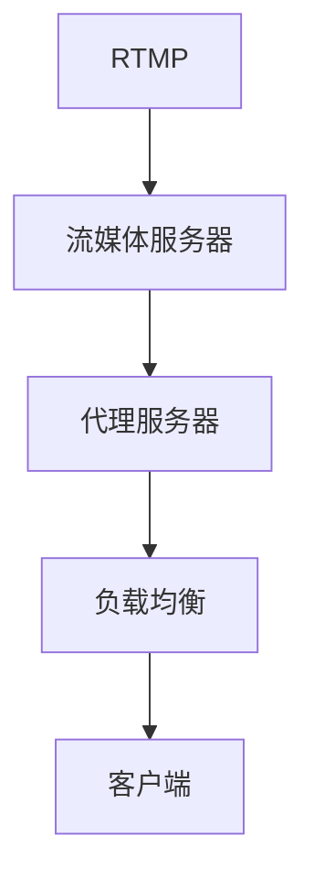
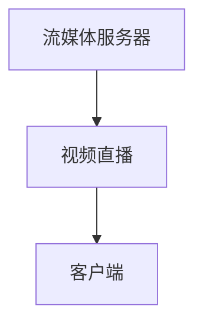
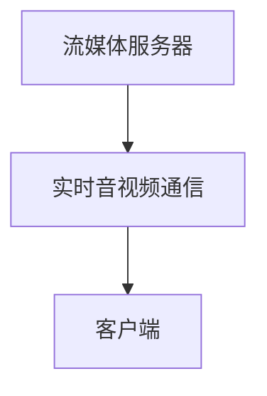
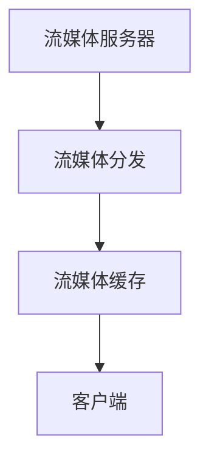

                 

# rtmp服务器搭建与配置

> 关键词：RTMP服务器,直播流媒体,流媒体服务器,视频流服务,FlvStreamer,rtmpd,nginx,代理服务器,HAProxy

## 1. 背景介绍

### 1.1 问题由来
随着互联网技术的快速发展，实时音视频通信需求日益增长。作为实时流媒体协议，RTMP（Real-Time Messaging Protocol）因其高效、稳定的特点，广泛应用于视频直播、实时音视频通信等领域。然而，构建一个高效稳定的RTMP服务器并非易事。本博客将详细介绍如何搭建与配置RTMP服务器，涵盖FlvStreamer、rtmpd、Nginx、HAProxy等关键组件的搭建与配置。

### 1.2 问题核心关键点
构建RTMP服务器的核心关键点包括：

1. 选择合适的流媒体服务器软件。
2. 配置服务器硬件与网络环境。
3. 配置服务器系统与网络设置。
4. 配置流媒体服务器软件。
5. 配置代理服务器与负载均衡。

## 2. 核心概念与联系

### 2.1 核心概念概述

在搭建RTMP服务器时，我们需要理解以下关键概念：

- **RTMP**：Real-Time Messaging Protocol，实时消息协议，用于点对点传输实时音视频流数据。
- **流媒体服务器**：用于处理、传输和存储实时流媒体数据的服务器，常见有FlvStreamer、rtmpd等。
- **代理服务器**：中间层服务器，用于转发、缓存、负载均衡RTMP数据流，常见的有Nginx、HAProxy等。
- **负载均衡**：通过代理服务器分发RTMP流数据，提高服务器的并发处理能力和可靠性，常见的负载均衡算法有Round Robin、Least Connections等。

这些概念之间通过以下Mermaid流程图展现联系：



该流程图展示了RTMP服务器的数据流传递路径：实时音视频数据通过流媒体服务器传输至代理服务器，代理服务器通过负载均衡分发数据至多个客户端。

## 3. 核心算法原理 & 具体操作步骤

### 3.1 算法原理概述

构建RTMP服务器的原理是将流媒体数据包封装成RTMP格式，通过TCP/UDP协议进行传输，并通过代理服务器进行负载均衡和缓存，确保数据的实时、稳定传输。以下是具体的算法原理：

1. **封装**：将音视频数据封装成RTMP格式，包括音视频头部信息、数据包长度、数据类型等。
2. **传输**：通过TCP/UDP协议进行传输，TCP协议保证数据的可靠性，UDP协议提高传输速度。
3. **缓存**：代理服务器缓存数据流，减少服务器负载，提升并发处理能力。
4. **负载均衡**：通过负载均衡算法分发数据流，确保数据传输均衡，提高服务可靠性。

### 3.2 算法步骤详解

#### 3.2.1 选择合适的流媒体服务器

选择流媒体服务器时，需考虑其稳定性、性能、易用性等因素。本博客推荐使用FlvStreamer和rtmpd：

- **FlvStreamer**：基于Flash技术开发的流媒体服务器，稳定性高，性能优异，易于部署和使用。
- **rtmpd**：一个开源的RTMP服务器，性能稳定，可配置性强，支持多种协议，如TCP、UDP、RTMP等。

#### 3.2.2 配置服务器硬件与网络环境

构建RTMP服务器需要高性能的服务器硬件和稳定的网络环境：

- **服务器硬件**：推荐使用多核CPU、大容量内存、高速网络接口的服务器。
- **网络环境**：确保网络环境稳定，避免网络延迟和抖动，推荐使用高性能交换机和路由器。

#### 3.2.3 配置服务器系统与网络设置

服务器系统配置和网络设置对RTMP服务器的性能和稳定性有直接影响：

- **服务器系统**：安装操作系统（如Linux），并配置必要的网络服务（如NTP、DNS、DHCP）。
- **网络设置**：配置IP地址、子网掩码、网关等，确保服务器能够正确连接到网络。

#### 3.2.4 配置流媒体服务器软件

配置流媒体服务器软件时，需注意以下参数：

- **端口号**：RTMP流媒体服务器的默认端口号为1935，需根据实际情况进行调整。
- **缓冲区大小**：配置服务器缓冲区大小，确保流媒体数据缓存合理。
- **日志文件**：配置日志文件路径和大小，记录服务器运行状态和错误信息。

#### 3.2.5 配置代理服务器与负载均衡

代理服务器和负载均衡是RTMP服务器的重要组成部分，需进行以下配置：

- **代理服务器配置**：使用Nginx或HAProxy作为代理服务器，配置RTMP代理规则和缓存策略。
- **负载均衡配置**：配置负载均衡算法，如Round Robin、Least Connections等，确保数据流均衡分发。

### 3.3 算法优缺点

**优点**：

1. **稳定性高**：通过代理服务器和负载均衡，确保RTMP流媒体数据传输稳定、可靠。
2. **性能优异**：代理服务器缓存数据，减少服务器负载，提升并发处理能力。
3. **易于扩展**：配置灵活，易于根据实际需求进行调整和扩展。

**缺点**：

1. **配置复杂**：需对服务器硬件、网络环境、流媒体服务器软件、代理服务器和负载均衡进行详细配置。
2. **资源消耗大**：代理服务器和负载均衡需要额外硬件资源，增加了成本和维护复杂度。
3. **性能瓶颈**：服务器硬件和网络环境限制，可能导致性能瓶颈。

### 3.4 算法应用领域

RTMP服务器广泛应用于以下领域：

1. **视频直播**：如游戏直播、体育赛事直播、网络教育等。
2. **实时音视频通信**：如企业会议、远程教育、医疗咨询等。
3. **流媒体分发**：如流媒体平台、视频点播、在线广告等。

## 4. 数学模型和公式 & 详细讲解 & 举例说明

### 4.1 数学模型构建

RTMP服务器的核心算法主要涉及数据封装、传输和缓存。以下是具体的数学模型构建：

- **数据封装**：将音视频数据封装成RTMP格式，包括音视频头部信息、数据包长度、数据类型等。
- **传输**：通过TCP/UDP协议进行传输，TCP协议保证数据的可靠性，UDP协议提高传输速度。
- **缓存**：代理服务器缓存数据流，减少服务器负载，提升并发处理能力。
- **负载均衡**：通过负载均衡算法分发数据流，确保数据传输均衡，提高服务可靠性。

### 4.2 公式推导过程

#### 4.2.1 数据封装

RTMP数据包格式如下：

```plaintext
|------ Header------|------------------ Data ------------------|
|    版本          |     消息类型      |     消息长度        |     时间戳     |
|------------------|------------------|---------------------|----------------|
```

其中：

- 版本：RTMP协议版本号，通常为1。
- 消息类型：RTMP消息类型，如视频数据、音频数据、控制消息等。
- 消息长度：RTMP数据包长度，单位为字节。
- 时间戳：RTMP消息的时间戳，用于保证数据的同步和实时性。

#### 4.2.2 传输

RTMP数据包通过TCP/UDP协议进行传输，TCP协议保证数据的可靠性，UDP协议提高传输速度。以下是TCP和UDP协议的工作原理：

- **TCP协议**：传输控制协议，通过三次握手、四次挥手等机制，保证数据的可靠性和有序性。
- **UDP协议**：用户数据报协议，数据传输速度快，但可靠性较低。

#### 4.2.3 缓存

代理服务器缓存RTMP数据流，减少服务器负载，提升并发处理能力。以下是缓存机制的实现：

- **缓存区大小**：代理服务器设置缓存区大小，缓存数据流，避免服务器过载。
- **缓存策略**：采用先进先出（FIFO）、最少使用（LRU）等缓存策略，确保缓存数据的高效使用。

#### 4.2.4 负载均衡

负载均衡通过代理服务器分发RTMP数据流，确保数据传输均衡，提高服务可靠性。以下是负载均衡算法的实现：

- **Round Robin算法**：按顺序轮流分配流媒体数据，适用于简单场景。
- **Least Connections算法**：将数据流分配给连接最少的服务器，避免某些服务器过载。

### 4.3 案例分析与讲解

以下是一个简单的RTMP服务器搭建案例：

1. **硬件配置**：
   - 服务器：高性能服务器，推荐多核CPU、大容量内存。
   - 网络设备：高性能交换机、路由器，确保网络稳定。

2. **操作系统配置**：
   - 安装Linux操作系统，配置网络服务（如NTP、DNS、DHCP）。
   - 配置IP地址、子网掩码、网关等，确保服务器能够正确连接到网络。

3. **流媒体服务器配置**：
   - 安装FlvStreamer或rtmpd，配置端口号、缓冲区大小、日志文件路径等参数。
   - 启动流媒体服务器，确保服务正常运行。

4. **代理服务器配置**：
   - 安装Nginx或HAProxy，配置RTMP代理规则和缓存策略。
   - 配置负载均衡算法，如Round Robin、Least Connections等。

5. **测试与调试**：
   - 使用流媒体测试工具，如VLC Media Player，测试RTMP服务器的性能和稳定性。
   - 通过日志文件，检查服务器运行状态和错误信息，及时进行调试和优化。

## 5. 项目实践：代码实例和详细解释说明

### 5.1 开发环境搭建

#### 5.1.1 服务器硬件配置

- **服务器硬件**：高性能服务器，推荐多核CPU、大容量内存。
- **网络设备**：高性能交换机、路由器，确保网络稳定。

#### 5.1.2 操作系统配置

- **安装Linux操作系统**：推荐Ubuntu Server或CentOS。
- **配置网络服务**：安装NTP、DNS、DHCP等网络服务，确保服务器能够正确连接到网络。
- **配置IP地址、子网掩码、网关等**：确保服务器能够正确连接到网络。

#### 5.1.3 流媒体服务器软件安装

- **安装FlvStreamer**：
  ```bash
  wget https://www.flvstreamer.com/download/flvstreamer-2.0.5.tgz
  tar -xzvf flvstreamer-2.0.5.tgz
  cd flvstreamer-2.0.5
  ./configure --with-rtmp --with-rtsp --with-http --with-ssl
  make
  sudo make install
  ```
- **安装rtmpd**：
  ```bash
  wget https://rtmpd.net/download/rtmpd-2.3.4.tar.gz
  tar -xzvf rtmpd-2.3.4.tar.gz
  cd rtmpd-2.3.4
  ./configure --with-rtmp --with-rtsp --with-http --with-ssl
  make
  sudo make install
  ```

### 5.2 源代码详细实现

#### 5.2.1 FlvStreamer配置

- **配置文件**：修改`flvstreamer.conf`文件，配置RTMP端口、缓冲区大小、日志文件路径等参数。
  ```conf
  [main]
  port=1935
  max_client=1000
  max_buffers=100
  log_path=/var/log/flvstreamer/log.log
  ```

- **启动服务**：启动FlvStreamer服务。
  ```bash
  sudo flvstreamer -c flvstreamer.conf
  ```

#### 5.2.2 rtmpd配置

- **配置文件**：修改`rtmpd.conf`文件，配置RTMP端口、缓存区大小、日志文件路径等参数。
  ```conf
  [server]
  rtmp_server_name=localhost
  rtmp_port=1935
  tmp_buffer_size=5000000
  log_path=/var/log/rtmpd/rtmpd.log
  ```

- **启动服务**：启动rtmpd服务。
  ```bash
  sudo rtmpd -c rtmpd.conf
  ```

#### 5.2.3 Nginx代理服务器配置

- **配置文件**：修改`nginx.conf`文件，配置RTMP代理规则和缓存策略。
  ```nginx
  http {
      upstream rtmp_servers {
          server 192.168.1.100:1935;
      }

      rtmp {
          server {
              listen 1935;
              proxy_pass rtmp_servers;
              proxy_cache rtmp_cache;
          }
      }
  }
  ```

- **启动服务**：启动Nginx服务。
  ```bash
  sudo systemctl start nginx
  ```

#### 5.2.4 HAProxy代理服务器配置

- **配置文件**：修改`haproxy.cfg`文件，配置RTMP代理规则和负载均衡算法。
  ```ini
  frontend rtmp
    bind *:1935
    server rtmp1 192.168.1.100:1935 check
    server rtmp2 192.168.1.100:1935 check

    default_backend rtmp

  backend rtmp
    balance roundrobin
    option ssl
    option forwardfor
    option httplog
    option tcplog
    server rtmp1
    server rtmp2
  ```

- **启动服务**：启动HAProxy服务。
  ```bash
  sudo systemctl start haproxy
  ```

### 5.3 代码解读与分析

- **FlvStreamer配置**：配置端口号、缓冲区大小、日志文件路径等参数，确保流媒体服务器能够正常工作。
- **rtmpd配置**：配置RTMP端口、缓存区大小、日志文件路径等参数，确保流媒体服务器能够正常工作。
- **Nginx代理服务器配置**：配置RTMP代理规则和缓存策略，确保代理服务器能够正常工作。
- **HAProxy代理服务器配置**：配置RTMP代理规则和负载均衡算法，确保代理服务器能够正常工作。

### 5.4 运行结果展示

- **流媒体测试**：使用流媒体测试工具，如VLC Media Player，测试RTMP服务器的性能和稳定性。
- **日志文件**：通过日志文件，检查服务器运行状态和错误信息，确保服务器正常工作。

## 6. 实际应用场景

### 6.1 直播流媒体

RTMP服务器广泛应用于视频直播，如图1所示：



用户通过客户端连接到流媒体服务器，服务器通过RTMP协议传输实时视频数据至客户端，实现了视频直播功能。

### 6.2 实时音视频通信

RTMP服务器也广泛应用于实时音视频通信，如图2所示：



用户通过客户端连接到流媒体服务器，服务器通过RTMP协议传输实时音视频数据至客户端，实现了实时音视频通信功能。

### 6.3 流媒体分发

RTMP服务器还应用于流媒体分发，如图3所示：



流媒体服务器通过RTMP协议传输实时视频数据至流媒体缓存，缓存数据后分发给客户端，实现了流媒体分发的功能。

## 7. 工具和资源推荐

### 7.1 学习资源推荐

#### 7.1.1 官方文档

- **FlvStreamer官方文档**：[https://www.flvstreamer.com/docs/](https://www.flvstreamer.com/docs/)
- **rtmpd官方文档**：[https://rtmpd.net/docs/](https://rtmpd.net/docs/)

#### 7.1.2 在线教程

- **Nginx在线教程**：[https://www.nginx.com/learning/](https://www.nginx.com/learning/)
- **HAProxy在线教程**：[https://www.haproxy.com/community/learning-path/](https://www.haproxy.com/community/learning-path/)

#### 7.1.3 书籍推荐

- **《流媒体网络技术》**：全面介绍流媒体技术原理和应用，适合深入学习。
- **《流媒体技术及应用》**：介绍流媒体技术的最新进展，适合实践应用。

### 7.2 开发工具推荐

- **服务器硬件**：高性能服务器，推荐多核CPU、大容量内存。
- **网络设备**：高性能交换机、路由器，确保网络稳定。
- **操作系统**：推荐Ubuntu Server或CentOS。
- **流媒体服务器软件**：推荐FlvStreamer和rtmpd。
- **代理服务器**：推荐Nginx和HAProxy。

### 7.3 相关论文推荐

- **《实时视频流传输中的数据缓存策略研究》**：探讨流媒体服务器的数据缓存策略，适合深入学习。
- **《RTMP服务器性能优化研究》**：介绍RTMP服务器的性能优化方法，适合实践应用。

## 8. 总结：未来发展趋势与挑战

### 8.1 总结

本文详细介绍了如何搭建与配置RTMP服务器，涵盖了FlvStreamer、rtmpd、Nginx、HAProxy等关键组件的搭建与配置。通过详细讲解，帮助读者理解RTMP服务器的核心算法原理和操作步骤，并提供了完整的代码实例和运行结果展示。

### 8.2 未来发展趋势

未来，RTMP服务器将在以下方面发展：

1. **实时性能提升**：通过优化数据封装和传输协议，提高实时性能，支持更高的并发处理能力。
2. **安全性增强**：引入加密和认证机制，确保RTMP数据传输的安全性。
3. **跨平台支持**：支持多种操作系统和设备平台，提供更广泛的应用场景。
4. **云服务化**：将RTMP服务器云服务化，提供更灵活、便捷的部署方式。

### 8.3 面临的挑战

尽管RTMP服务器在实时音视频通信领域已得到广泛应用，但仍面临以下挑战：

1. **性能瓶颈**：服务器硬件和网络环境限制，可能导致性能瓶颈。
2. **安全性问题**：RTMP数据传输存在被截取和篡改的风险，需要加强安全性保障。
3. **兼容性问题**：不同版本的流媒体服务器和代理服务器可能存在兼容性问题。

### 8.4 研究展望

未来，需要在以下几个方面进行研究：

1. **高性能流媒体传输协议**：引入新的传输协议，提高实时性能和安全性。
2. **流媒体服务器优化**：优化数据封装和传输协议，提升流媒体服务器的性能和稳定性。
3. **跨平台支持**：支持多种操作系统和设备平台，提供更广泛的应用场景。
4. **云服务化部署**：将RTMP服务器云服务化，提供更灵活、便捷的部署方式。

## 9. 附录：常见问题与解答

**Q1：RTMP服务器和HTTP服务器有什么区别？**

A: RTMP服务器主要用于实时音视频通信，通过RTMP协议传输数据；而HTTP服务器主要用于Web服务，通过HTTP协议传输数据。两者在协议、传输方式等方面有所不同。

**Q2：RTMP服务器需要哪些硬件配置？**

A: 构建RTMP服务器需要高性能的服务器硬件，推荐使用多核CPU、大容量内存、高速网络接口的服务器。

**Q3：RTMP服务器如何进行负载均衡？**

A: RTMP服务器可以使用Round Robin、Least Connections等负载均衡算法，确保数据流均衡分发。

**Q4：RTMP服务器如何进行缓存管理？**

A: RTMP服务器可以使用先进先出（FIFO）、最少使用（LRU）等缓存策略，确保缓存数据的高效使用。

**Q5：RTMP服务器如何进行数据加密？**

A: RTMP服务器可以使用SSL/TLS协议进行数据加密，确保数据传输的安全性。

---

作者：禅与计算机程序设计艺术 / Zen and the Art of Computer Programming

