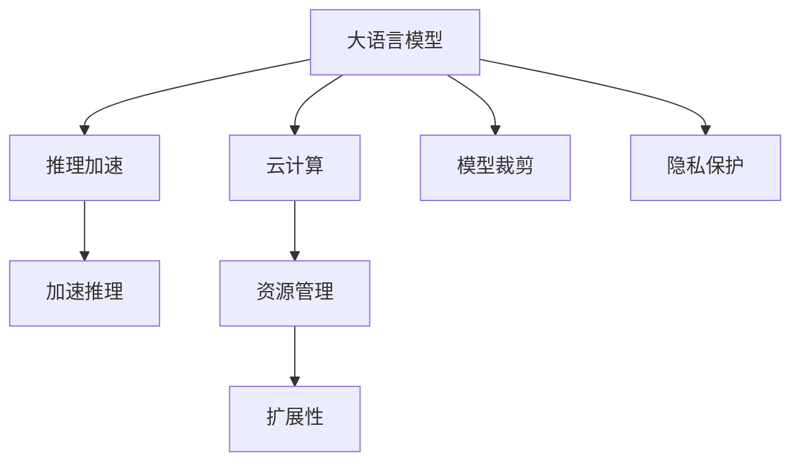

                 

# 云端推理：高效、便捷的 LLM 访问

> 关键词：云计算,推理加速,大语言模型,API接口,加速库,模型裁剪,隐私保护

## 1. 背景介绍

### 1.1 问题由来

随着大语言模型(Large Language Models, LLMs)如GPT、BERT等在自然语言处理(NLP)领域取得突破性进展，其应用范围逐渐从研究实验室扩展到产业实际场景。然而，这些大模型的参数量级通常以亿计，训练和推理所需的计算资源巨大。单台服务器难以支持其高吞吐量和高并发性需求。因此，为了将大语言模型更广泛地应用于实际生产环境，需要在云端部署模型，利用云计算平台提供的弹性资源实现高性能推理服务。

### 1.2 问题核心关键点

实现云端推理的主要挑战包括：

- 如何高效地将大语言模型部署到云端，并快速响应服务请求。
- 如何在推理过程中有效管理模型资源，避免计算资源浪费。
- 如何保护模型的隐私和安全，防止敏感信息泄露。
- 如何快速地对大模型进行优化，提高推理速度和资源利用率。
- 如何在云端环境中实现模型的扩展性和伸缩性，支持高并发处理。

解决这些问题，需要合理设计云端推理架构，引入先进的推理加速技术，并在实践中不断优化性能。

### 1.3 问题研究意义

实现云端推理，不仅能够大幅提升大语言模型的应用普及度和用户体验，还能为NLP技术带来新的应用范式，加速产业升级和技术创新。具体意义如下：

1. **降低资源成本**：云计算平台提供了弹性资源，可以根据需求动态调整计算资源，减少固定成本投入。
2. **提升服务响应速度**：云端推理可以并行处理多个请求，大大缩短用户等待时间，提高用户体验。
3. **增强模型泛化能力**：云计算环境可以支持模型更新，实时获取新数据和新知识，提升模型的泛化能力和适应性。
4. **促进技术落地**：云计算提供了完善的开发和部署工具，有助于NLP技术在更多行业场景中的应用。
5. **推动AI标准化**：云端推理的规范化和标准化有助于建立统一的API接口，促进大语言模型的互通和协作。

## 2. 核心概念与联系

### 2.1 核心概念概述

为更好地理解云端推理的原理和架构，本节将介绍几个密切相关的核心概念：

- 大语言模型(Large Language Models, LLMs)：通过自监督学习在海量文本数据上训练得到的强大语言模型，具备广泛的语义理解和生成能力。
- 云计算(Cloud Computing)：利用网络提供计算和存储资源，按需支付使用费用的计算模式，实现弹性资源管理和服务提供。
- 推理加速库(Acceleration Library)：为优化模型推理速度而设计的优化库，如ONNX Runtime、TensorFlow Lite等，通过硬件加速和优化算法提高推理效率。
- 模型裁剪(Model Pruning)：通过剪枝技术去除冗余参数，减小模型尺寸，提高推理速度和资源利用率。
- 隐私保护(Privacy Protection)：通过加密、匿名化等手段，保护模型在云端推理过程中的数据安全。

这些核心概念之间的逻辑关系可以通过以下Mermaid流程图来展示：



这个流程图展示了大语言模型云端推理的核心概念及其之间的关系：

1. 大语言模型通过推理加速库在云端实现高效推理。
2. 云计算提供弹性和资源管理，支持模型扩展和高并发处理。
3. 模型裁剪减小模型尺寸，提高推理速度和资源利用率。
4. 隐私保护技术保障模型和数据安全，防止信息泄露。

这些概念共同构成了大语言模型云端推理的实施框架，使得大语言模型能够以高效、便捷的方式服务于更广泛的场景。

## 3. 核心算法原理 & 具体操作步骤

### 3.1 算法原理概述

基于云计算的大语言模型推理过程，本质上是一个高效、便捷的服务化计算过程。其核心思想是：通过云计算平台提供的弹性资源，将大语言模型封装为可调用的API服务，对外部请求快速响应，实现高效的推理计算。

形式化地，假设云端推理服务为 $S:\mathcal{X} \rightarrow \mathcal{Y}$，其中 $\mathcal{X}$ 为输入空间，$\mathcal{Y}$ 为输出空间。推理过程为：

1. 将用户输入数据 $x$ 转换为模型所需格式。
2. 调用云端推理服务 $S$ 进行推理计算，得到输出结果 $y$。
3. 将输出结果 $y$ 返回给用户。

优化目标在于：

1. 最小化推理延迟，提升服务响应速度。
2. 最大化资源利用率，避免计算资源浪费。
3. 保护模型隐私，防止数据泄露。

### 3.2 算法步骤详解

基于云计算的大语言模型推理主要包括以下几个关键步骤：

**Step 1: 模型部署与接口设计**

- 选择合适的云平台，如AWS、Google Cloud、阿里云等，创建虚拟机实例或容器服务。
- 将大语言模型及其推理代码部署到云平台，完成模型资源的初始化。
- 设计API接口，定义输入输出格式和请求处理逻辑。

**Step 2: 推理加速与性能优化**

- 引入推理加速库如ONNX Runtime、TensorFlow Lite等，优化模型推理性能。
- 应用模型裁剪技术，去除冗余参数，减小模型尺寸，降低计算量。
- 优化模型网络结构，使用剪枝、量化等手段提升推理速度。

**Step 3: 服务化封装与调用**

- 将模型推理代码封装为RESTful API服务，通过HTTP协议接受请求。
- 设置并发处理机制，支持高并发处理多个请求。
- 实现请求超时、负载均衡等特性，提升服务可靠性。

**Step 4: 监控与运维**

- 部署监控系统，实时监测服务性能，如响应时间、吞吐量等。
- 配置报警机制，及时发现并处理系统异常。
- 定期更新模型和推理代码，提升系统稳定性。

### 3.3 算法优缺点

基于云计算的大语言模型推理方法具有以下优点：

1. 高效性：利用云计算弹性资源，快速响应服务请求，提升推理效率。
2. 便捷性：API接口简单易用，用户无需安装部署即可使用服务。
3. 扩展性：支持高并发处理，轻松扩展系统容量。
4. 灵活性：动态调整资源配置，支持模型更新和优化。

同时，该方法也存在一定的局限性：

1. 依赖云平台：云服务费用较高，依赖云平台的稳定性和安全性。
2. 部署复杂度：模型部署和接口设计需要一定的技术积累，对开发人员有较高要求。
3. 隐私风险：模型和数据存储在云端，存在隐私泄露的风险。
4. 依赖网络环境：网络延迟和带宽限制会影响服务响应速度。
5. 成本压力：大模型推理所需计算资源较多，对计算成本有一定压力。

尽管存在这些局限性，但就目前而言，基于云计算的推理服务仍是实现大语言模型高效服务的重要手段。未来相关研究的重点在于如何进一步优化性能，降低成本，提升隐私保护，以及探索新的部署模式。

### 3.4 算法应用领域

基于云计算的大语言模型推理方法在多个领域得到了广泛应用，包括：

- 智能客服：利用云端推理提供实时的对话问答服务，提高客户满意度。
- 金融风控：对用户申请和交易进行实时分析，降低风险。
- 医疗诊断：利用大语言模型辅助医生进行疾病诊断和推荐。
- 自动翻译：提供实时翻译服务，促进国际交流。
- 内容生成：对用户输入进行自动生成文本，提高内容创作的效率和质量。
- 推荐系统：实时分析用户行为，推荐个性化的内容或商品。

除了上述这些典型应用外，大语言模型云端推理还在更多场景中得到了应用，为各行各业带来了新的技术突破。

## 4. 数学模型和公式 & 详细讲解 & 举例说明

### 4.1 数学模型构建

本节将使用数学语言对基于云计算的大语言模型推理过程进行更加严格的刻画。

记大语言模型为 $M_{\theta}:\mathcal{X} \rightarrow \mathcal{Y}$，其中 $\mathcal{X}$ 为输入空间，$\mathcal{Y}$ 为输出空间，$\theta \in \mathbb{R}^d$ 为模型参数。假设推理服务为 $S:\mathcal{X} \rightarrow \mathcal{Y}$。

推理过程的定义为：
$$
y = S(x)
$$

其中 $x$ 为输入，$y$ 为输出。

推理服务的性能优化目标为：
$$
\mathcal{L}(S) = \frac{1}{N}\sum_{i=1}^N \ell(S(x_i), y_i)
$$

其中 $\ell$ 为损失函数，$N$ 为样本数量。

### 4.2 公式推导过程

以下我们以二分类任务为例，推导推理过程的损失函数及其梯度计算公式。

假设模型 $M_{\theta}$ 在输入 $x$ 上的输出为 $\hat{y}=M_{\theta}(x) \in [0,1]$，表示样本属于正类的概率。

推理服务的输出 $y$ 为 $\hat{y}$ 经过 sigmoid 函数映射后的二分类标签：

$$
y = \sigma(\hat{y})
$$

其中 $\sigma(t) = \frac{1}{1+\exp(-t)}$。

推理服务的损失函数为交叉熵损失：

$$
\ell(y, \hat{y}) = -[y\log \hat{y} + (1-y)\log(1-\hat{y})]
$$

将其代入推理服务性能优化目标：

$$
\mathcal{L}(S) = -\frac{1}{N}\sum_{i=1}^N [y_i\log \sigma(\hat{y}_i)+(1-y_i)\log(1-\sigma(\hat{y}_i))]
$$

推理服务的梯度计算公式为：

$$
\frac{\partial \mathcal{L}(S)}{\partial \theta_k} = -\frac{1}{N}\sum_{i=1}^N \left[\frac{y_i}{\sigma(\hat{y}_i)} - \frac{1-y_i}{1-\sigma(\hat{y}_i)}\right] \frac{\partial M_{\theta}(x_i)}{\partial \theta_k}
$$

其中 $\frac{\partial M_{\theta}(x_i)}{\partial \theta_k}$ 为模型参数 $\theta_k$ 对输入 $x_i$ 的梯度，可通过反向传播算法高效计算。

### 4.3 案例分析与讲解

假设使用TensorFlow实现模型 $M_{\theta}$，并部署到Google Cloud上。代码如下：

```python
import tensorflow as tf

# 定义模型
model = tf.keras.Sequential([
    tf.keras.layers.Dense(256, activation='relu', input_shape=(input_dim,)),
    tf.keras.layers.Dense(1, activation='sigmoid')
])

# 编译模型
model.compile(optimizer='adam', loss='binary_crossentropy')

# 训练模型
model.fit(train_data, train_labels, epochs=10, batch_size=32)

# 推理服务定义
@app.route('/predict', methods=['POST'])
def predict():
    data = request.get_json()
    input_data = np.array([data['input']])
    output = model.predict(input_data)
    predicted_label = np.round(output).astype(int)[0]
    return jsonify({'predicted_label': predicted_label})
```

在模型训练完成后，将其部署为Google Cloud上的API服务：

```python
import google.cloud.functions as functions

@app.functions.HttpFunction()
def predict(request):
    data = request.get_json()
    input_data = np.array([data['input']])
    output = model.predict(input_data)
    predicted_label = np.round(output).astype(int)[0]
    return jsonify({'predicted_label': predicted_label})
```

在云平台中部署后，可以使用API接口进行推理请求：

```python
import requests

data = {'input': 'Hello, world!'}
response = requests.post('https://REGION-PROJECT_ID.cloudfunctions.net/predict', json=data)
predicted_label = response.json()['predicted_label']
print(predicted_label)
```

这里，模型在推理服务中被调用，利用Google Cloud的弹性计算资源快速响应推理请求。通过API接口，用户可以方便地调用模型进行推理计算，无需关注底层部署细节。

## 5. 项目实践：代码实例和详细解释说明

### 5.1 开发环境搭建

在进行云端推理实践前，我们需要准备好开发环境。以下是使用Python进行TensorFlow开发的环境配置流程：

1. 安装Anaconda：从官网下载并安装Anaconda，用于创建独立的Python环境。

2. 创建并激活虚拟环境：
```bash
conda create -n tf-env python=3.8 
conda activate tf-env
```

3. 安装TensorFlow：根据CUDA版本，从官网获取对应的安装命令。例如：
```bash
pip install tensorflow
```

4. 安装Flask等工具包：
```bash
pip install flask google-cloud-functions flask-cors
```

完成上述步骤后，即可在`tf-env`环境中开始云端推理实践。

### 5.2 源代码详细实现

下面我们以二分类任务为例，给出使用TensorFlow和Google Cloud Functions实现大语言模型推理的代码实现。

首先，定义模型：

```python
import tensorflow as tf

# 定义模型
model = tf.keras.Sequential([
    tf.keras.layers.Dense(256, activation='relu', input_shape=(input_dim,)),
    tf.keras.layers.Dense(1, activation='sigmoid')
])

# 编译模型
model.compile(optimizer='adam', loss='binary_crossentropy')
```

然后，定义API接口：

```python
from flask import Flask, request, jsonify

app = Flask(__name__)

@app.route('/predict', methods=['POST'])
def predict():
    data = request.get_json()
    input_data = np.array([data['input']])
    output = model.predict(input_data)
    predicted_label = np.round(output).astype(int)[0]
    return jsonify({'predicted_label': predicted_label})
```

最后，将模型部署到Google Cloud Functions：

```python
import google.cloud.functions as functions

@app.functions.HttpFunction()
def predict(request):
    data = request.get_json()
    input_data = np.array([data['input']])
    output = model.predict(input_data)
    predicted_label = np.round(output).astype(int)[0]
    return jsonify({'predicted_label': predicted_label})
```

在完成上述步骤后，使用Google Cloud Console进行模型部署：

1. 登录Google Cloud Console。
2. 进入Compute -> Functions。
3. 点击Create function。
4. 填写Function名称、触发器为HTTP、选择Region、选择Source code。
5. 粘贴代码并保存。

部署完成后，可以在Google Cloud Console中查看Function状态，并在浏览器中访问其API接口：

1. 进入Compute -> Functions。
2. 点击Your functions。
3. 查看Function状态为Deployed。
4. 点击Run。
5. 在浏览器中访问Function URL。

这样，大语言模型推理的API服务就搭建完成了。用户可以通过API接口快速访问模型进行推理计算。

### 5.3 代码解读与分析

让我们再详细解读一下关键代码的实现细节：

**模型定义**：
- 使用TensorFlow的Sequential模型，定义了一个两层的全连接神经网络，最后一层使用sigmoid激活函数输出二分类结果。

**API接口定义**：
- 使用Flask框架定义了一个POST请求的路由，接收JSON格式的数据作为输入，调用模型进行推理计算，并返回预测结果。

**部署代码**：
- 使用Google Cloud Functions将模型代码部署为HTTP服务，支持API接口调用。

通过以上步骤，我们完成了大语言模型推理的完整代码实现。可以看到，使用TensorFlow和Google Cloud Functions，可以将模型快速部署为API服务，实现高效、便捷的推理计算。

## 6. 实际应用场景

### 6.1 智能客服系统

基于大语言模型推理的智能客服系统，可以应用于各种客户服务场景，提供实时的对话问答服务。通过云平台，客户可以通过网页、手机App等渠道快速访问客服服务，大大提升客户满意度。

在技术实现上，可以收集企业内部的历史客服对话记录，将其作为监督数据，在Google Cloud上训练和部署模型。模型接收到客户请求后，通过API接口进行推理计算，自动生成符合语境的回复，提升客户体验。

### 6.2 金融风控

金融行业需要实时监测用户申请和交易行为，以降低风险。基于大语言模型推理的金融风控系统，可以实时分析用户行为，生成风控报告，防止欺诈和风险。

在技术实现上，可以收集用户的交易记录和行为数据，训练大语言模型进行风险分析。部署到云平台后，系统可以实时处理新数据，生成风控报告，快速响应风险预警。

### 6.3 医疗诊断

医疗行业对大语言模型的需求日益增长，利用推理服务可以快速获取疾病诊断和推荐结果。基于大语言模型推理的诊断系统，可以辅助医生进行疾病诊断和治疗。

在技术实现上，可以收集医生的诊断记录和病历数据，训练大语言模型进行疾病诊断和推荐。部署到云平台后，医生可以通过API接口快速访问模型进行诊断和推荐。

### 6.4 自动翻译

自动翻译是语言处理的重要应用之一，利用大语言模型推理可以提供实时翻译服务。基于云平台的自动翻译系统，可以快速处理用户输入的文本，生成目标语言的翻译结果。

在技术实现上，可以收集多语言数据，训练大语言模型进行翻译。部署到云平台后，用户可以通过API接口快速访问模型进行翻译。

### 6.5 内容生成

内容生成是NLP领域的重要应用，利用大语言模型推理可以快速生成文本内容。基于云平台的内容生成系统，可以快速生成新闻摘要、技术文档、广告文案等内容，提升内容创作效率。

在技术实现上，可以收集用户的生成请求和输入，训练大语言模型进行内容生成。部署到云平台后，用户可以通过API接口快速访问模型进行内容生成。

### 6.6 推荐系统

推荐系统是电商、视频等行业的核心应用，利用大语言模型推理可以生成个性化的推荐内容。基于云平台的推荐系统，可以快速处理用户行为数据，生成推荐结果，提升用户体验。

在技术实现上，可以收集用户的浏览、点击、购买等行为数据，训练大语言模型进行推荐。部署到云平台后，用户可以通过API接口快速访问模型进行推荐。

## 7. 工具和资源推荐

### 7.1 学习资源推荐

为了帮助开发者系统掌握大语言模型推理的理论基础和实践技巧，这里推荐一些优质的学习资源：

1. TensorFlow官方文档：提供完整的TensorFlow教程和示例代码，涵盖从入门到进阶的各个阶段。

2. Google Cloud Functions官方文档：详细介绍Google Cloud Functions的使用方法和API接口。

3. ONNX Runtime官方文档：提供ONNX Runtime的安装和使用方法，优化模型推理性能。

4. TensorFlow Lite官方文档：提供TensorFlow Lite的安装和使用方法，优化模型推理性能。

5. NLP基础教程：涵盖NLP领域的经典模型和算法，帮助理解NLP任务的基础知识。

通过学习这些资源，相信你一定能够快速掌握大语言模型推理的精髓，并用于解决实际的NLP问题。

### 7.2 开发工具推荐

高效的开发离不开优秀的工具支持。以下是几款用于大语言模型推理开发的常用工具：

1. TensorFlow：基于Python的开源深度学习框架，灵活动态的计算图，适合快速迭代研究。大部分预训练语言模型都有TensorFlow版本的实现。

2. Google Cloud Functions：Google提供的云函数服务，方便部署模型API，实现高性能推理。

3. ONNX Runtime：加速推理计算的优化库，支持多种硬件平台。

4. TensorFlow Lite：优化移动设备上的模型推理，支持移动端应用。

5. Flask：Python的轻量级Web框架，方便开发API接口。

6. NGINX：高性能Web服务器，支持高并发处理API请求。

合理利用这些工具，可以显著提升大语言模型推理的开发效率，加快创新迭代的步伐。

### 7.3 相关论文推荐

大语言模型推理技术的发展源于学界的持续研究。以下是几篇奠基性的相关论文，推荐阅读：

1. TensorFlow论文：介绍TensorFlow的计算图和自动微分技术，优化模型推理性能。

2. ONNX Runtime论文：介绍ONNX Runtime的优化算法和硬件支持，提高模型推理速度。

3. Google Cloud Functions论文：详细介绍Google Cloud Functions的部署和调用方法，优化模型服务。

4. TensorFlow Lite论文：介绍TensorFlow Lite的模型压缩和优化技术，优化移动设备推理性能。

这些论文代表了大语言模型推理技术的发展脉络。通过学习这些前沿成果，可以帮助研究者把握学科前进方向，激发更多的创新灵感。

## 8. 总结：未来发展趋势与挑战

### 8.1 总结

本文对基于云计算的大语言模型推理方法进行了全面系统的介绍。首先阐述了推理技术的研究背景和意义，明确了推理在提升大语言模型应用普及度、用户体验等方面的独特价值。其次，从原理到实践，详细讲解了推理过程的数学原理和关键步骤，给出了完整的推理代码实例。同时，本文还广泛探讨了推理方法在智能客服、金融风控、医疗诊断等多个行业领域的应用前景，展示了推理技术的广泛应用潜力。此外，本文精选了推理技术的各类学习资源，力求为读者提供全方位的技术指引。

通过本文的系统梳理，可以看到，基于云计算的大语言模型推理方法正在成为NLP领域的重要范式，极大地拓展了预训练语言模型的应用边界，催生了更多的落地场景。得益于云计算平台的弹性资源和高性能计算能力，推理技术能够以高效、便捷的方式服务于更广泛的场景，极大地提升了NLP技术的落地效果。

### 8.2 未来发展趋势

展望未来，大语言模型推理技术将呈现以下几个发展趋势：

1. 推理加速技术的不断提升。引入更多硬件加速技术如TPU、GPU，优化推理计算图，提升模型推理速度。
2. 推理过程的可解释性增强。引入因果分析、符号推理等技术，提升模型的可解释性。
3. 推理过程的隐私保护强化。引入差分隐私、同态加密等技术，保护模型在云端推理过程中的数据安全。
4. 推理过程的弹性资源管理。引入弹性调度、动态扩缩容等技术，优化资源利用率。
5. 推理过程的模型优化技术不断演进。引入剪枝、量化、模型裁剪等技术，减小模型尺寸，提高推理效率。
6. 推理过程的多模态融合。引入图像、语音等多模态数据，提升模型的泛化能力和适应性。

以上趋势凸显了大语言模型推理技术的广阔前景。这些方向的探索发展，必将进一步提升NLP系统的性能和应用范围，为人类认知智能的进化带来深远影响。

### 8.3 面临的挑战

尽管大语言模型推理技术已经取得了瞩目成就，但在迈向更加智能化、普适化应用的过程中，它仍面临着诸多挑战：

1. 推理延迟和计算资源。推理过程需要计算大量模型参数，可能遇到计算资源不足和推理延迟大的问题。如何优化推理计算图，提升资源利用率，是急需解决的问题。
2. 推理过程的可解释性。推理过程通常缺乏可解释性，难以对其决策逻辑进行分析和调试。如何赋予推理模型更强的可解释性，是未来的一大挑战。
3. 推理过程的隐私保护。模型和数据存储在云端，存在隐私泄露的风险。如何保护模型在推理过程中的数据安全，是必须面对的难题。
4. 推理过程的模型裁剪。剪枝技术虽然减小了模型尺寸，但可能引入精度损失。如何优化模型裁剪策略，提高推理效果，是关键问题。
5. 推理过程的实时性要求。实时推理服务需要高效、稳定、可靠的计算和网络环境，如何优化系统架构，提升实时性，是重要的研究课题。

尽管存在这些挑战，但通过持续的技术创新和工程优化，相信这些挑战终将逐一被克服，大语言模型推理必将在构建安全、可靠、高效、可解释的智能系统中发挥更大的作用。

### 8.4 研究展望

面对大语言模型推理所面临的种种挑战，未来的研究需要在以下几个方面寻求新的突破：

1. 探索多模态推理方法。引入图像、语音、视频等多模态数据，提升模型的泛化能力和适应性。
2. 研究因果推理技术。通过引入因果分析，增强模型的推理能力和可解释性。
3. 引入差分隐私技术。保护模型在推理过程中的数据隐私，防止信息泄露。
4. 应用符号推理方法。通过引入符号推理，增强模型的逻辑推理能力和可解释性。
5. 探索硬件加速技术。引入TPU、GPU等硬件加速设备，提升推理速度和资源利用率。
6. 研究模型优化策略。通过剪枝、量化、模型裁剪等技术，减小模型尺寸，提高推理效率。

这些研究方向的探索，必将引领大语言模型推理技术迈向更高的台阶，为构建安全、可靠、高效、可解释的智能系统铺平道路。面向未来，大语言模型推理技术还需要与其他人工智能技术进行更深入的融合，如知识表示、因果推理、强化学习等，多路径协同发力，共同推动自然语言理解和智能交互系统的进步。只有勇于创新、敢于突破，才能不断拓展语言模型的边界，让智能技术更好地造福人类社会。

## 9. 附录：常见问题与解答

**Q1：大语言模型推理是否适用于所有NLP任务？**

A: 大语言模型推理在大多数NLP任务上都能取得不错的效果，特别是对于数据量较小的任务。但对于一些特定领域的任务，如医学、法律等，仅靠通用语料预训练的模型可能难以很好地适应。此时需要在特定领域语料上进一步预训练，再进行推理，才能获得理想效果。此外，对于一些需要时效性、个性化很强的任务，如对话、推荐等，推理方法也需要针对性的改进优化。

**Q2：推理过程中如何选择合适的学习率？**

A: 推理的学习率一般要比预训练时小1-2个数量级，如果使用过大的学习率，容易破坏预训练权重，导致过拟合。一般建议从1e-5开始调参，逐步减小学习率，直至收敛。也可以使用warmup策略，在开始阶段使用较小的学习率，再逐渐过渡到预设值。需要注意的是，不同的优化器(如AdamW、Adafactor等)以及不同的学习率调度策略，可能需要设置不同的学习率阈值。

**Q3：部署云端推理时需要考虑哪些因素？**

A: 部署云端推理需要考虑以下几个因素：

1. 选择云平台：根据实际需求选择合适的云平台，如AWS、Google Cloud、阿里云等。
2. 模型裁剪：应用剪枝、量化等技术，减小模型尺寸，提高推理速度。
3. 推理加速：引入ONNX Runtime、TensorFlow Lite等加速库，优化推理性能。
4. 服务化封装：将模型推理代码封装为RESTful API服务，方便用户调用。
5. 监控运维：部署监控系统，实时监测服务性能，及时发现并处理系统异常。
6. 负载均衡：设置负载均衡机制，支持高并发处理。

合理利用这些因素，可以显著提升大语言模型推理的部署效率和系统稳定性。

**Q4：推理过程中如何保护模型隐私？**

A: 推理过程中保护模型隐私，通常采用以下几种方式：

1. 数据匿名化：对用户输入进行匿名化处理，防止敏感信息泄露。
2. 差分隐私：在推理计算中添加噪声，保护数据隐私。
3. 同态加密：在加密状态下进行推理计算，保护模型安全性。
4. 访问控制：限制模型API的访问权限，防止未授权访问。

通过以上方式，可以有效保护模型在推理过程中的数据隐私，确保系统安全。

**Q5：推理过程中如何优化模型资源利用率？**

A: 优化模型资源利用率，通常采用以下几种方式：

1. 模型裁剪：通过剪枝技术去除冗余参数，减小模型尺寸，提高推理速度。
2. 推理加速：引入加速库如ONNX Runtime、TensorFlow Lite，优化推理计算。
3. 动态扩展：根据请求流量动态调整计算资源，提升资源利用率。
4. 异构计算：利用GPU、TPU等硬件加速推理计算。
5. 批量推理：对多个请求进行批量处理，提升推理效率。

通过以上方式，可以有效提升大语言模型推理的资源利用率，降低计算成本。

---

作者：禅与计算机程序设计艺术 / Zen and the Art of Computer Programming

