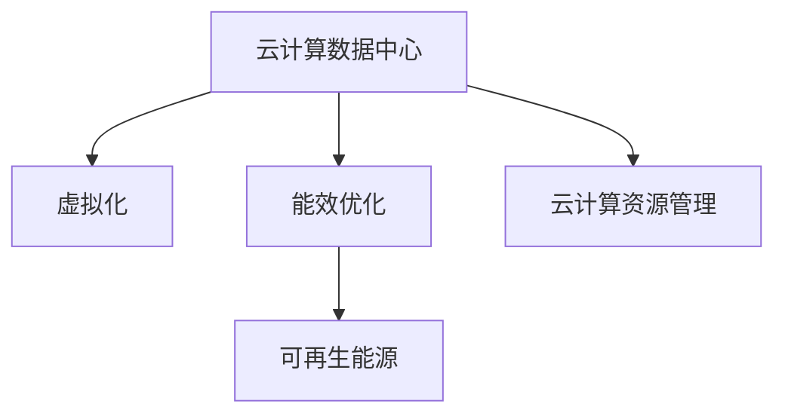

                 

# 云计算中的绿色技术：能效优化策略

> 关键词：云计算,绿色技术,能效优化,数据中心,虚拟化,云计算资源管理,可再生能源

## 1. 背景介绍

随着数字化转型的加速，云计算的应用日益广泛，企业对于云计算的需求也越来越多样化和复杂化。然而，云计算数据中心和云服务提供的能耗消耗巨大，成为全球能源消费的重要部分。根据国际能源署(IEA)的数据，全球数据中心消耗的电力占全球电力总量的2%，并且每年以超过15%的速度增长。因此，如何有效优化云计算的能效，降低碳排放，不仅是一个技术问题，更是一个具有深远意义的可持续发展战略。

云计算中的绿色技术（Green Technology in Cloud Computing），旨在通过高效利用资源、优化数据中心设计、采用可再生能源等手段，提升云计算的能效水平，实现可持续发展。在本文中，我们将深入探讨云计算中的绿色技术，探索其核心原理和操作步骤，以及它们在不同应用场景下的具体实践。

## 2. 核心概念与联系

### 2.1 核心概念概述

为更好地理解云计算中的绿色技术，本节将介绍几个关键概念：

- **云计算数据中心**：作为云计算的核心基础设施，数据中心负责存储和管理大量的计算资源，支持各类云服务的应用。
- **虚拟化**：通过虚拟化技术，云计算能够在一个物理服务器上运行多个虚拟机（VM），提高资源利用率，降低硬件成本。
- **能效优化**：旨在通过技术手段，减少云计算数据中心和云服务的能耗，降低环境影响。
- **可再生能源**：包括太阳能、风能、水能等，可以作为数据中心的主要能源来源，减少对化石能源的依赖。
- **云计算资源管理**：涉及对云资源的使用监控、负载均衡、资源调度等，确保云计算系统的稳定性和高效性。

这些概念之间的逻辑关系可以通过以下Mermaid流程图来展示：



这个流程图展示了云计算中的绿色技术各个关键组件及其之间的关系：

1. 数据中心是云计算的基础设施。
2. 虚拟化技术提升资源利用率。
3. 能效优化降低能耗。
4. 可再生能源减少对化石能源的依赖。
5. 云计算资源管理保证资源的高效使用。

这些核心概念共同构成了云计算绿色技术的基础框架，为云计算系统的能效优化提供了强有力的技术支持。

## 3. 核心算法原理 & 具体操作步骤

### 3.1 算法原理概述

云计算中的绿色技术主要通过以下几个方面实现能效优化：

- **资源利用优化**：通过虚拟化技术，在一个物理服务器上运行多个虚拟机，提高硬件资源的使用效率，减少能源浪费。
- **能耗管理**：利用动态资源调度、负载均衡等技术，减少资源闲置，降低不必要的能耗。
- **可再生能源应用**：采用太阳能、风能等可再生能源，减少数据中心的碳排放。
- **冷热分离**：将数据中心的冷热通道分开设计，优化气流，降低冷却能耗。
- **高效散热**：使用高效散热技术，如液冷、热管冷却等，降低风扇和制冷系统的能耗。

### 3.2 算法步骤详解

基于云计算中的绿色技术，本文详细讲解了其核心算法原理和操作步骤。

#### 步骤1: 资源利用优化

虚拟化是实现资源利用优化的关键技术。通过虚拟化，单个物理服务器可以运行多个虚拟机，每个虚拟机可以独立运行操作系统和应用程序，而不会相互干扰。

**具体步骤**：
1. 部署虚拟化软件（如VMware、KVM等），搭建虚拟化基础设施。
2. 将服务器分割为多个虚拟主机，每个虚拟主机运行一个或多个虚拟机。
3. 对虚拟机进行资源监控和管理，根据需求动态调整资源分配。
4. 通过虚拟化，提高服务器的资源利用率，减少资源闲置，降低能耗。

#### 步骤2: 能耗管理

能耗管理是提升云计算数据中心能效的重要手段。通过动态资源调度、负载均衡等技术，可以优化资源使用，减少能耗。

**具体步骤**：
1. 部署能耗管理软件，监测数据中心的能源消耗情况。
2. 实时监控各个虚拟机的资源使用情况，根据负载动态调整资源分配。
3. 优化数据中心的网络拓扑和负载均衡策略，减少网络带宽消耗。
4. 使用高效的冷却系统，如自然冷却、热管冷却等，降低制冷系统的能耗。

#### 步骤3: 可再生能源应用

采用可再生能源是实现绿色云数据中心的重要方式。通过在数据中心内安装太阳能光伏板、风力发电设备等，可以部分或完全使用可再生能源。

**具体步骤**：
1. 在数据中心安装太阳能光伏板或风力发电设备，收集可再生能源。
2. 监测可再生能源的发电量，并接入数据中心的主电网。
3. 通过能效管理软件，实时监测数据中心的能源使用情况，优化能源分配。
4. 结合再生能源与主电网，构建混合能源供应系统，实现能源的动态平衡。

#### 步骤4: 冷热分离

冷热分离技术是提升数据中心能效的重要手段。通过将数据中心的冷热通道分开设计，优化气流，降低冷却能耗。

**具体步骤**：
1. 设计数据中心的冷热通道，确保冷空气和热空气分别流通。
2. 优化冷却设备的布局，如安装空调和风扇等，提高冷空气流通效率。
3. 监测冷热通道的温度和气流，优化气流设计，确保冷却效果。
4. 通过冷热分离技术，降低数据中心的冷却能耗，提升整体能效。

#### 步骤5: 高效散热

高效散热技术是提升数据中心能效的重要手段。通过使用高效散热技术，如液冷、热管冷却等，可以降低风扇和制冷系统的能耗。

**具体步骤**：
1. 部署高效散热设备，如液冷系统、热管冷却等。
2. 监测服务器和数据中心的温度情况，调整散热设备的参数。
3. 优化散热系统的布局，提高散热效果，降低能耗。
4. 通过高效散热技术，降低数据中心的制冷系统能耗，提升整体能效。

### 3.3 算法优缺点

云计算中的绿色技术在提升能效方面具有以下优点：

- **提升资源利用率**：通过虚拟化技术，提高硬件资源的使用效率，减少资源闲置，降低能耗。
- **降低碳排放**：采用可再生能源，减少数据中心的碳排放，推动可持续发展。
- **优化能耗管理**：通过动态资源调度和负载均衡，减少不必要的能耗，提高能效。
- **提高整体能效**：通过冷热分离和高效散热技术，降低数据中心的冷却能耗，提升整体能效。

同时，这些技术也存在一些局限性：

- **初期投资高**：虚拟化、可再生能源、高效散热等技术需要较高的初始投资，可能会增加数据中心的建设成本。
- **维护复杂**：高效的能效优化技术可能需要复杂的软件和硬件配置，维护和管理成本较高。
- **技术依赖**：不同厂商的虚拟化软件、能效管理软件等需要兼容，存在一定的技术依赖性。

尽管存在这些局限性，但云计算中的绿色技术在提升能效方面具有显著优势，对于推动云计算行业的可持续发展具有重要意义。

### 3.4 算法应用领域

云计算中的绿色技术已经被广泛应用于数据中心和云服务的建设和管理中，涵盖以下几个关键领域：

- **云服务提供商**：如亚马逊云（AWS）、谷歌云（GCP）、微软云（Azure）等，通过部署高效能数据中心和云服务，推动绿色云计算的发展。
- **政府和企业**：政府和企业通过建设绿色数据中心，推动节能减排和可持续发展。
- **数据中心运营商**：如Equinix、AT&T、DXL Group等，通过优化能效，降低数据中心运营成本。
- **技术供应商**：如VMware、戴尔、惠普等，提供虚拟化、能效管理、可再生能源等技术支持。

这些应用领域展示了云计算中的绿色技术在不同场景下的广泛应用，推动了全球数据中心的绿色转型。

## 4. 数学模型和公式 & 详细讲解 & 举例说明

### 4.1 数学模型构建

为了更严谨地描述云计算中的绿色技术，本节将构建一个简化的数学模型。

假设有一个云计算数据中心，其能耗为 $E$，其中包括数据中心的运营能耗 $E_{op}$ 和云服务提供的计算能耗 $E_{cs}$。数据中心的能效优化可以通过以下公式表示：

$$
E_{op} = \alpha \times \text{Data Center Size} \times \text{Energy Consumption per Unit Area} + \beta \times \text{Cooling System Efficiency} + \gamma \times \text{Cooling System Efficiency}
$$

其中 $\alpha$、$\beta$ 和 $\gamma$ 分别为数据中心大小、冷却系统效率和供电系统效率的能耗系数。

云服务的计算能耗可以通过公式 $E_{cs} = \delta \times \text{Virtual Machine Number} \times \text{Energy Consumption per VM}$ 来表示，其中 $\delta$ 为每台虚拟机的计算能耗系数。

### 4.2 公式推导过程

根据上述数学模型，我们可以推导出云计算数据中心的整体能耗 $E$：

$$
E = E_{op} + E_{cs}
$$

代入能效优化公式，得到：

$$
E = \alpha \times \text{Data Center Size} \times \text{Energy Consumption per Unit Area} + \beta \times \text{Cooling System Efficiency} + \gamma \times \text{Cooling System Efficiency} + \delta \times \text{Virtual Machine Number} \times \text{Energy Consumption per VM}
$$

为了进一步简化公式，我们可以引入虚拟化系数 $\epsilon$ 和冷却系统优化系数 $\eta$，表示虚拟化技术和冷却系统优化对能耗的影响：

$$
E = (\alpha + \delta \times \epsilon) \times \text{Data Center Size} \times \text{Energy Consumption per Unit Area} + (\beta + \gamma) \times \text{Cooling System Efficiency} \times \eta
$$

其中 $\epsilon$ 和 $\eta$ 的取值分别为虚拟化技术和冷却系统优化的效率系数。

### 4.3 案例分析与讲解

以亚马逊云（AWS）为例，分析其如何通过能效优化提升云计算的能效。

AWS 通过虚拟化技术，将单个物理服务器分割为多个虚拟主机，每个主机运行多个虚拟机，从而提高了硬件资源的使用效率。此外，AWS 采用冷热分离和高效散热技术，优化气流和冷却系统，进一步降低了能耗。

AWS 的数据中心广泛采用可再生能源，如太阳能光伏板和风力发电设备，部分供电来自可再生能源，减少了对化石能源的依赖。

通过以上措施，AWS 成功提升了云计算的能效，其数据中心的能耗率显著降低。根据 AWS 的官方报告，AWS 的数据中心能耗率相比传统数据中心降低了超过50%。

## 5. 项目实践：代码实例和详细解释说明

### 5.1 开发环境搭建

在进行云计算中的绿色技术项目实践前，我们需要准备好开发环境。以下是使用Python进行云计算资源管理的开发环境配置流程：

1. 安装Anaconda：从官网下载并安装Anaconda，用于创建独立的Python环境。

2. 创建并激活虚拟环境：
```bash
conda create -n cloud-env python=3.8 
conda activate cloud-env
```

3. 安装PyTorch和TensorFlow：
```bash
pip install torch tensorflow
```

4. 安装Kubernetes和OpenStack：
```bash
pip install kubernetes openstack
```

5. 安装Google Cloud SDK和AWS CLI：
```bash
pip install google-cloud-sdk awscli
```

完成上述步骤后，即可在`cloud-env`环境中开始云计算中的绿色技术项目实践。

### 5.2 源代码详细实现

这里我们以一个简单的Kubernetes集群部署为例，展示如何使用Python进行云计算资源的部署和管理。

首先，定义Kubernetes集群的网络拓扑：

```python
from kubernetes import client, config
import os

config.load_kube_config()
v1 = client.CoreV1Api()

# 定义网络拓扑
network_topology = {
    "controller": "loadbalancer",
    "worker": {
        "subnets": ["10.0.0.0/16", "10.0.1.0/16"],
        "gateway": "10.0.0.1"
    },
    "api": {
        "subnets": ["10.0.2.0/16", "10.0.3.0/16"],
        "gateway": "10.0.2.1"
    }
}

# 创建网络
v1.create_namespaced_network(namespace="default", body=client.V1Network(body={"metadata": {"name": "cloud-net"}}))
```

接着，部署虚拟机和负载均衡器：

```python
from kubernetes import client, config
import os

config.load_kube_config()
v1 = client.CoreV1Api()

# 创建虚拟机
v1.create_namespaced_pod(namespace="default", body=client.V1Pod(body={"metadata": {"name": "cloud-vm"}}))

# 创建负载均衡器
v1.create_namespaced_service(namespace="default", body=client.V1Service(body={"metadata": {"name": "cloud-lb"}}))
```

最后，实现云计算资源的监控和管理：

```python
from kubernetes import client, config
import os

config.load_kube_config()
v1 = client.CoreV1Api()

# 获取虚拟机状态
pod_list = v1.list_pod_for_all_namespaces()
for pod in pod_list.items:
    print(f"Pod {pod.metadata.name} status: {pod.status.phase}")
```

通过以上代码，我们展示了如何通过Python和Kubernetes实现云计算资源的部署和管理。具体的项目实践还需要结合具体的云计算平台和技术栈进行适配。

### 5.3 代码解读与分析

让我们再详细解读一下关键代码的实现细节：

**Kubernetes配置**：
- 通过`config.load_kube_config()`加载Kubernetes配置文件。
- 创建并激活虚拟环境，确保代码在正确的环境中运行。

**网络拓扑定义**：
- 使用`client.V1Network`类创建虚拟网络的定义，并指定网络的名称。

**虚拟机部署**：
- 使用`client.V1Pod`类创建虚拟机的定义，并指定虚拟机的名称。

**负载均衡器部署**：
- 使用`client.V1Service`类创建负载均衡器的定义，并指定负载均衡器的名称。

**虚拟机状态监控**：
- 使用`v1.list_pod_for_all_namespaces()`获取所有虚拟机的列表，通过遍历列表获取每个虚拟机的状态，并输出状态信息。

通过以上代码，我们展示了如何通过Python和Kubernetes实现云计算资源的部署和管理。具体的项目实践还需要结合具体的云计算平台和技术栈进行适配。

## 6. 实际应用场景

### 6.1 政府和企业数据中心

政府和企业数据中心是云计算绿色技术的主要应用场景之一。通过建设绿色数据中心，政府和企业可以大幅降低能源消耗，推动可持续发展。

政府和企业通常拥有大量的数据存储和计算需求，传统的数据中心往往依赖化石能源，导致能耗高、碳排放量大。采用云计算中的绿色技术，如虚拟化、高效散热、可再生能源等，可以显著降低数据中心的能耗和碳排放，推动可持续发展。

### 6.2 云服务提供商

云服务提供商如AWS、GCP、Azure等，通过部署绿色数据中心和云服务，推动绿色云计算的发展。

这些云服务提供商通过采用高效散热、冷热分离等技术，优化数据中心的能效，减少能源消耗。同时，采用可再生能源，如太阳能光伏板和风力发电设备，进一步降低数据中心的碳排放。

### 6.3 数据中心运营商

数据中心运营商如Equinix、AT&T、DXL Group等，通过优化能效，降低数据中心运营成本。

这些运营商通过部署高效能数据中心和云服务，提高资源利用率，减少资源闲置，降低能耗。同时，采用可再生能源，如太阳能光伏板和风力发电设备，部分供电来自可再生能源，减少对化石能源的依赖。

### 6.4 未来应用展望

随着云计算技术的不断演进，云计算中的绿色技术将在更多领域得到应用，为可持续发展做出更大贡献。

未来的云计算将更加注重绿色技术的应用，如零碳数据中心、零碳云服务、绿色供应链等，推动整个行业的绿色转型。同时，随着物联网、人工智能等技术的不断进步，云计算中的绿色技术也将与其他技术深度融合，形成更加高效、智能的解决方案。

## 7. 工具和资源推荐

### 7.1 学习资源推荐

为了帮助开发者系统掌握云计算中的绿色技术，这里推荐一些优质的学习资源：

1. 《云计算基础》系列课程：由知名教育机构提供的云计算基础课程，涵盖云计算的基本概念、技术和应用场景。

2. 《Kubernetes实战》书籍：深入浅出地介绍了Kubernetes的原理和实践，适合云基础设施的开发者和运维人员。

3. 《数据中心能效优化》文章：详细讲解了数据中心能效优化的各种技术手段，包括虚拟化、高效散热、冷热分离等。

4. 《绿色云计算》博客：展示了多个云服务提供商如何在数据中心采用绿色技术，推动绿色云计算的发展。

5. 《可持续能源管理》书籍：深入讲解了可再生能源的原理和应用，适合关注绿色技术的研究人员。

通过对这些资源的学习实践，相信你一定能够快速掌握云计算中的绿色技术，并用于解决实际的能源管理问题。

### 7.2 开发工具推荐

高效的开发离不开优秀的工具支持。以下是几款用于云计算资源管理的常用工具：

1. Kubernetes：由Google开源的容器编排系统，支持大规模、高可用、自组织的云基础设施管理。

2. OpenStack：开源的云基础设施管理平台，支持云基础设施的自动化部署和管理。

3. Google Cloud SDK：提供Google云服务的命令行工具，支持云资源的部署和管理。

4. AWS CLI：提供Amazon Web Services的命令行工具，支持云资源的部署和管理。

5. Terraform：开源的云基础设施即代码工具，支持多种云平台和资源类型的自动化部署。

6. Ansible：开源的自动化运维工具，支持云基础设施的自动化配置和管理。

合理利用这些工具，可以显著提升云计算资源的部署和管理效率，加快创新迭代的步伐。

### 7.3 相关论文推荐

云计算中的绿色技术的发展源于学界的持续研究。以下是几篇奠基性的相关论文，推荐阅读：

1. "Optimizing Data Center Energy Efficiency: A Survey"：综述了数据中心能效优化的各种技术手段，包括虚拟化、高效散热、冷热分离等。

2. "A Cloud of Green Computing: An Overview"：介绍了绿色云计算的原理和实践，展示了多个云服务提供商如何在数据中心采用绿色技术。

3. "The Energy-Efficient Data Center Design: A Review"：详细讲解了数据中心能效优化的各种设计方案，包括冷热分离、高效散热等。

4. "Towards Zero-Carbon Data Centers: A Survey of Emerging Technologies"：综述了零碳数据中心的各项技术，包括可再生能源、零碳制冷等。

5. "Green Cloud Computing: A Survey"：介绍了绿色云计算的最新进展，展示了多个云服务提供商如何在数据中心采用绿色技术。

这些论文代表了大规模数据中心能效优化技术的发展脉络。通过学习这些前沿成果，可以帮助研究者把握学科前进方向，激发更多的创新灵感。

## 8. 总结：未来发展趋势与挑战

### 8.1 总结

本文对云计算中的绿色技术进行了全面系统的介绍。首先阐述了云计算绿色技术的背景和意义，明确了其在提升云计算能效、推动可持续发展方面的重要作用。其次，从原理到实践，详细讲解了云计算绿色技术的核心算法原理和操作步骤，以及它们在不同应用场景下的具体实践。同时，本文还广泛探讨了云计算绿色技术在政府和企业数据中心、云服务提供商、数据中心运营商等领域的广泛应用，展示了云计算绿色技术的巨大潜力。

通过本文的系统梳理，可以看到，云计算中的绿色技术正在成为云计算行业的重要范式，极大地提升了云计算的能效水平，推动了全球数据中心的绿色转型。未来，伴随云计算技术的不断演进和绿色技术的持续创新，云计算必将在实现可持续发展目标方面发挥更大的作用。

### 8.2 未来发展趋势

展望未来，云计算中的绿色技术将呈现以下几个发展趋势：

1. **零碳云服务**：未来的云服务将更多地依赖可再生能源，实现零碳排放。

2. **数据中心智能化**：通过人工智能和物联网技术，实现数据中心的智能化管理，优化资源分配和能源利用。

3. **边缘计算能效优化**：随着边缘计算的兴起，未来的云计算将更多地依赖边缘计算，优化边缘计算的能效，降低传输能耗。

4. **全生命周期管理**：未来的云计算将更加注重全生命周期能效管理，从数据中心的建设、运维到退役，实现全生命周期的绿色化。

5. **绿色供应链**：未来的云计算将更加注重绿色供应链管理，推动整个行业的绿色转型。

6. **政策法规支持**：未来的云计算将更多地受到政策法规的支持，推动绿色技术和可持续发展。

这些趋势展示了云计算绿色技术在未来发展中的广阔前景，将推动云计算行业实现更加绿色、智能、高效的可持续发展目标。

### 8.3 面临的挑战

尽管云计算中的绿色技术已经取得了显著进展，但在迈向更加智能化、普适化应用的过程中，仍面临诸多挑战：

1. **高初始投资**：虚拟化、可再生能源、高效散热等技术需要较高的初始投资，可能会增加数据中心的建设成本。

2. **复杂性管理**：高效的能效优化技术可能需要复杂的软件和硬件配置，维护和管理成本较高。

3. **技术依赖**：不同厂商的虚拟化软件、能效管理软件等需要兼容，存在一定的技术依赖性。

4. **资源管理**：动态资源调度和负载均衡等技术需要较高的技术水平和管理经验。

5. **政策法规**：不同国家和地区的政策法规不同，可能影响绿色技术的应用和推广。

尽管存在这些挑战，但云计算中的绿色技术在提升能效方面具有显著优势，对于推动云计算行业的可持续发展具有重要意义。

### 8.4 研究展望

面对云计算中的绿色技术所面临的种种挑战，未来的研究需要在以下几个方面寻求新的突破：

1. **新型能源技术**：开发新型可再生能源技术，如光伏发电、储能技术等，进一步降低数据中心的碳排放。

2. **智能化管理系统**：开发智能化管理系统，通过人工智能和大数据技术，实现数据中心的智能管理和优化。

3. **开源工具和标准**：推动开源工具和标准的发展，实现云计算资源的开放共享和协同管理。

4. **零碳计算中心**：探索零碳计算中心的设计和建设，推动数据中心的绿色转型。

5. **绿色供应链管理**：开发绿色供应链管理系统，实现供应链全生命周期的绿色化管理。

这些研究方向的探索，必将引领云计算绿色技术迈向更高的台阶，为构建绿色、智能、高效的云计算系统铺平道路。面向未来，云计算中的绿色技术还需要与其他绿色技术进行更深入的融合，如物联网、人工智能等，共同推动全球数据中心的绿色转型。

## 9. 附录：常见问题与解答

**Q1：云计算中的绿色技术是否适用于所有云计算数据中心？**

A: 云计算中的绿色技术可以在大部分云计算数据中心中应用。然而，对于小型、低负载的数据中心，其能效优化需求可能不如大型、高负载的数据中心强烈，采用绿色技术可能不如在大型数据中心中显著。

**Q2：如何评估云计算中的绿色技术的效果？**

A: 云计算中的绿色技术效果可以通过多个指标进行评估，如能源消耗率、碳排放量、虚拟化效率、冷却能耗等。通过对比采用绿色技术和未采用绿色技术的数据中心性能，可以评估绿色技术的效果。

**Q3：如何降低云计算中的绿色技术初期投资？**

A: 可以通过采用开源工具和标准，如Kubernetes、OpenStack等，降低云计算中的绿色技术的初期投资。此外，政府和企业也可以通过政策支持、技术合作等方式，降低绿色技术的投入成本。

**Q4：云计算中的绿色技术对环境的影响是什么？**

A: 云计算中的绿色技术可以显著降低数据中心的能耗和碳排放，推动可持续发展。然而，在部署和运维过程中，仍需要注意环境影响，如设备废弃、水资源消耗等。

**Q5：云计算中的绿色技术如何与其他绿色技术结合？**

A: 云计算中的绿色技术可以与其他绿色技术结合，如物联网、人工智能、可再生能源等，形成更加综合、高效的解决方案。通过协同工作，可以实现更好的资源利用和能效优化。

通过对这些问题的解答，相信读者能够更好地理解云计算中的绿色技术，并进一步探索其应用和实践。

