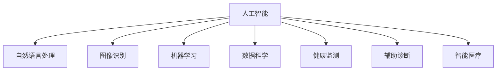

                 

# 人工智能在医疗保健中的应用

> 关键词：人工智能,医疗保健,自然语言处理,图像识别,机器学习,数据科学,健康监测,辅助诊断,智能医疗

## 1. 背景介绍

### 1.1 问题由来

医疗保健行业一直是技术进步的前沿阵地之一，但长期以来面临诸多挑战。包括但不限于资源分配不均、诊断效率低下、治疗决策失误等问题。近年来，随着人工智能(AI)技术的快速发展，特别是机器学习(ML)、自然语言处理(NLP)、图像识别等技术在医疗保健领域的应用，为解决这些问题带来了新的希望。

人工智能在医疗保健中的应用覆盖了从疾病预测、智能诊断到个性化治疗的广泛领域，提升了医疗服务的质量和效率。本文将从核心概念与联系、核心算法原理、操作步骤等方面，深入探讨人工智能在医疗保健中的应用。

## 2. 核心概念与联系

### 2.1 核心概念概述

为更好地理解人工智能在医疗保健中的应用，本节将介绍几个密切相关的核心概念：

- **人工智能**：以机器学习、深度学习为代表的智能技术，通过学习大量数据，实现对复杂问题的预测、决策和自动化。
- **自然语言处理**：利用计算机处理、理解、生成人类语言的技术，广泛应用于医疗文本分析、智能问答等任务。
- **图像识别**：通过训练深度神经网络模型，自动识别和分类医疗图像，如X光片、CT扫描等。
- **机器学习**：通过算法使机器从数据中学习，并应用到新的数据中，实现模式识别、分类预测等功能。
- **数据科学**：运用统计学、数据挖掘等方法，从大规模数据中提取有价值的信息和知识，支持决策和优化。
- **健康监测**：通过传感器、移动设备等，实时监测个体的健康状态和生理参数，提供个性化的健康管理建议。
- **辅助诊断**：利用AI模型，协助医生进行疾病诊断和治疗方案选择，提高诊断准确率和效率。
- **智能医疗**：将AI技术与医疗服务整合，实现从疾病预防到治疗管理的全面智能化，提升医疗服务的普惠性和质量。

这些核心概念之间的逻辑关系可以通过以下Mermaid流程图来展示：



这个流程图展示了一些核心概念及其之间的关系：

1. 人工智能是所有相关技术的基础，包括自然语言处理、图像识别、机器学习和数据科学等。
2. 这些技术的应用场景涵盖了健康监测、辅助诊断和智能医疗等多个方面。
3. 健康监测和辅助诊断为智能医疗提供了重要的数据支持和技术手段。
4. 智能医疗通过整合多方面的AI技术，提升医疗服务的整体质量和效率。

## 3. 核心算法原理 & 具体操作步骤

### 3.1 算法原理概述

人工智能在医疗保健中的应用通常依赖于机器学习和深度学习技术。这些算法通过训练大量的医疗数据，学习到疾病与症状之间的复杂关系，从而实现对疾病的预测、分类和诊断。具体来说，以下算法被广泛应用：

- **监督学习**：利用有标注的数据，训练模型进行分类或回归预测。如基于标签的图像分类和自然语言处理的文本分类任务。
- **非监督学习**：无需标注数据，通过聚类、降维等方法，发现数据的内在结构。如患者群体的聚类分析，用于个性化健康管理。
- **强化学习**：通过与环境的交互，学习最优策略以实现某个目标。如机器人手术中的动作优化。
- **迁移学习**：将在一个领域学到的知识迁移到另一个领域，提高在新任务上的性能。如利用通用模型对特定疾病的图像分类任务进行微调。
- **无监督学习**：利用未标注数据进行学习，发现数据的潜在结构和特征。如自动文本摘要，通过统计语言模型生成简洁的文本摘要。

### 3.2 算法步骤详解

人工智能在医疗保健中的应用流程通常包括以下几个关键步骤：

**Step 1: 数据收集与预处理**

- **收集数据**：从医院、诊所、公共卫生机构等收集医疗数据，包括电子病历、影像数据、实验室结果等。
- **数据清洗**：对数据进行去重、去噪、填补缺失值等处理，确保数据的质量和一致性。
- **特征提取**：从数据中提取有意义的特征，如患者的基本信息、症状描述、检验结果等。

**Step 2: 模型选择与训练**

- **模型选择**：根据任务类型选择合适的机器学习或深度学习模型，如卷积神经网络(CNN)用于图像识别，循环神经网络(RNN)用于序列数据处理。
- **模型训练**：利用收集到的数据对模型进行训练，通过交叉验证等方法评估模型的性能。
- **超参数调优**：对模型的超参数进行优化，如学习率、批量大小、正则化系数等，以提升模型效果。

**Step 3: 模型评估与验证**

- **评估指标**：根据任务类型选择合适的评估指标，如准确率、召回率、F1分数等。
- **验证集测试**：利用独立的验证集数据对模型进行测试，评估其在未见过的数据上的表现。
- **调整与优化**：根据验证集测试结果，对模型进行调整和优化，提高模型泛化能力。

**Step 4: 部署与应用**

- **模型部署**：将训练好的模型部署到生产环境中，如医院信息系统(HIS)、电子健康记录系统(EHR)等。
- **用户交互**：通过界面或API提供交互接口，方便医生、患者和研究人员使用。
- **持续更新**：根据新数据和反馈，定期更新模型，保持其在实际应用中的有效性。

### 3.3 算法优缺点

人工智能在医疗保健中的应用具有以下优点：

1. **提高诊断准确性**：通过学习大量医疗数据，AI模型能够识别出细微的疾病特征，提升诊断准确率。
2. **降低医疗成本**：自动化处理重复性工作，减少人力成本，同时提高工作效率。
3. **个性化医疗**：利用患者历史数据，提供个性化的治疗方案，优化治疗效果。
4. **促进数据共享**：跨机构、跨地域的数据共享，提升医疗资源的配置效率。
5. **早期预警**：通过健康监测设备，实现疾病早期预警，降低死亡率和发病率。

同时，这些技术也存在一些局限性：

1. **数据隐私和安全**：医疗数据涉及个人隐私，数据的收集、存储和传输需要严格遵守隐私保护法规。
2. **模型解释性不足**：许多AI模型如深度神经网络，具有"黑箱"特性，难以解释其内部决策过程。
3. **数据质量问题**：医疗数据质量参差不齐，数据缺失、噪声等问题对模型训练有较大影响。
4. **依赖高质量标注**：一些AI任务如辅助诊断，需要高质量的标注数据，获取标注成本高且复杂。
5. **医疗知识缺乏**：AI模型缺乏对复杂医学知识和临床经验的理解，难以应对复杂的医疗问题。

尽管存在这些局限性，但随着技术的不断进步和标准化，人工智能在医疗保健中的应用前景依然广阔。

### 3.4 算法应用领域

人工智能在医疗保健中的应用领域广泛，主要包括以下几个方面：

1. **疾病预测**：利用机器学习模型对大规模医疗数据进行分析，预测个体患病风险。
2. **图像识别**：通过训练深度神经网络，自动识别和分类医疗影像，如X光片、CT扫描等。
3. **自然语言处理**：处理电子病历、医学文献等文本数据，提取有用信息，支持医学研究和临床决策。
4. **智能问答系统**：通过自然语言处理技术，自动回答患者和医生的常见问题，提升医疗服务质量。
5. **健康监测**：利用传感器、移动设备等，实时监测个体的健康状态和生理参数，提供个性化的健康管理建议。
6. **辅助诊断**：利用AI模型，协助医生进行疾病诊断和治疗方案选择，提高诊断准确率和效率。
7. **药物研发**：利用机器学习和大数据分析，加速药物研发过程，减少研发时间和成本。

这些应用领域涵盖了从疾病预防到治疗管理的全过程，为医疗保健的智能化和个性化提供了强有力的支持。

## 4. 数学模型和公式 & 详细讲解 & 举例说明

### 4.1 数学模型构建

在人工智能在医疗保健中的应用中，数学模型构建是关键步骤之一。以下将以疾病预测为例，介绍常见模型的构建和训练过程。

假设我们有N个患者的电子病历数据，每个病历包含若干特征x_i和目标标签y_i。我们的目标是利用这些数据训练一个线性回归模型，预测患者的患病风险。

设线性回归模型为 $y=f(x)=w^T\varphi(x)+b$，其中 $\varphi(x)$ 为特征映射函数，$w$ 为模型参数，$b$ 为截距。我们的目标是最小化均方误差：

$$
\min_{w,b} \frac{1}{N}\sum_{i=1}^N (y_i - f(x_i))^2
$$

利用梯度下降等优化算法，对模型参数进行迭代更新，直至收敛。

### 4.2 公式推导过程

在线性回归模型的公式推导过程中，我们主要利用最小二乘法求解最优参数 $w$ 和 $b$。

设损失函数为 $J(w,b) = \frac{1}{2N}\sum_{i=1}^N (y_i - w^T\varphi(x_i) - b)^2$。其梯度为：

$$
\nabla J(w,b) = \frac{1}{N}\sum_{i=1}^N (\varphi(x_i) - y_i)^Tw
$$

通过迭代更新 $w$ 和 $b$，使得 $\nabla J(w,b) = 0$。最终得到模型参数的估计值为：

$$
w = \frac{1}{N}\sum_{i=1}^N (y_i - \hat{y}_i)\varphi(x_i) \quad b = \hat{y} - w^T\varphi(x)
$$

其中 $\hat{y}_i$ 为样本 $x_i$ 的预测值。

### 4.3 案例分析与讲解

假设我们有一份包含病人基本信息和化验结果的数据集，目标是预测该病人是否患有某种疾病。我们的数据集包含100个样本，每个样本有10个特征。

通过选择合适的特征进行特征映射，我们得到一个10维的特征向量 $x$。设定疾病标签 $y \in \{0, 1\}$，其中1表示患病。

利用上述线性回归模型，我们可以得到每个病人的患病风险预测值 $\hat{y} = w^T\varphi(x) + b$。通过对模型进行训练和验证，最终得到最优的模型参数 $w$ 和 $b$。

通过这个例子，我们可以看到，数学模型构建和推导是人工智能在医疗保健中应用的重要基础，通过选择合适的模型和算法，能够有效地处理医疗数据，实现疾病预测等任务。

## 5. 项目实践：代码实例和详细解释说明

### 5.1 开发环境搭建

在进行人工智能在医疗保健中的应用实践前，我们需要准备好开发环境。以下是使用Python进行机器学习开发的环境配置流程：

1. 安装Anaconda：从官网下载并安装Anaconda，用于创建独立的Python环境。

2. 创建并激活虚拟环境：
```bash
conda create -n ml-env python=3.8 
conda activate ml-env
```

3. 安装必要的库：
```bash
conda install numpy pandas scikit-learn matplotlib
```

4. 安装TensorFlow和Keras：
```bash
conda install tensorflow==2.7.0
conda install keras==2.6.0
```

5. 安装必要的深度学习库：
```bash
pip install torch torchvision torchaudio
```

完成上述步骤后，即可在`ml-env`环境中开始项目实践。

### 5.2 源代码详细实现

下面我们以图像识别为例，给出使用TensorFlow和Keras进行图像分类的PyTorch代码实现。

首先，定义模型结构：

```python
import tensorflow as tf
from tensorflow.keras import layers

model = tf.keras.Sequential([
    layers.Conv2D(32, (3,3), activation='relu', input_shape=(28, 28, 1)),
    layers.MaxPooling2D((2,2)),
    layers.Conv2D(64, (3,3), activation='relu'),
    layers.MaxPooling2D((2,2)),
    layers.Flatten(),
    layers.Dense(64, activation='relu'),
    layers.Dense(10, activation='softmax')
])
```

然后，定义损失函数和优化器：

```python
model.compile(optimizer='adam',
              loss=tf.keras.losses.SparseCategoricalCrossentropy(from_logits=True),
              metrics=['accuracy'])
```

接着，加载并预处理数据集：

```python
(x_train, y_train), (x_test, y_test) = tf.keras.datasets.mnist.load_data()
x_train = x_train.reshape(x_train.shape[0], 28, 28, 1)
x_test = x_test.reshape(x_test.shape[0], 28, 28, 1)
x_train, x_test = x_train / 255.0, x_test / 255.0
```

最后，训练模型并进行评估：

```python
model.fit(x_train, y_train, epochs=5, validation_data=(x_test, y_test))
model.evaluate(x_test, y_test)
```

以上就是使用TensorFlow和Keras进行图像分类的完整代码实现。可以看到，利用深度学习框架，可以非常方便地构建和训练复杂的神经网络模型，实现图像识别的任务。

### 5.3 代码解读与分析

让我们再详细解读一下关键代码的实现细节：

**模型定义**：
- 通过Sequential模型，依次添加卷积层、池化层、全连接层等组件，构建深度卷积神经网络模型。
- 每个卷积层后面添加最大池化层，减小特征图尺寸，提升模型计算效率。
- 最后通过Flatten层将特征图展开，接入全连接层和softmax输出层，完成分类任务。

**损失函数和优化器**：
- 使用Adam优化器，结合SparseCategoricalCrossentropy损失函数，计算模型的预测损失。
- 优化器的设置将学习率设为默认值，适用于大多数深度学习模型。

**数据加载和预处理**：
- 使用MNIST数据集，加载手写数字图像和相应的标签。
- 将数据集的维度调整为网络期望的输入格式。
- 对图像像素值进行归一化处理，保证模型输入的一致性。

**模型训练与评估**：
- 使用fit函数，对模型进行训练，设置训练轮数和验证集。
- 通过evaluate函数，评估模型在测试集上的性能，输出损失和准确率。

在实际应用中，还需要根据具体任务的特点，对模型进行调参和优化。但核心的模型构建和训练流程基本与此类似。

## 6. 实际应用场景

### 6.1 智能问答系统

智能问答系统在医疗保健中具有重要应用价值，能够快速回答医生和患者的常见问题，提供即时支持。

在技术实现上，可以收集医疗机构的历史问答数据，利用NLP技术进行文本分析，训练模型识别问题和生成答案。微调后的问答模型能够在输入问题后，快速提供相应的答案。同时，系统可以集成知识库，实时更新问题答案，保持知识的时效性和准确性。

### 6.2 疾病预测

利用机器学习模型，可以从电子病历、实验室结果等数据中提取特征，预测患者患病的概率。这有助于早期发现潜在疾病，提高治疗效果。

在具体实现上，可以选择支持向量机(SVM)、随机森林(Random Forest)等算法，对患者数据进行建模。通过训练和验证，模型可以输出每个患者的患病风险评分。医生可以根据评分结果，采取相应的预防措施或进行进一步的检查。

### 6.3 智能诊断

利用深度学习模型，对医学影像进行分类和标注，提供智能诊断支持。如CT扫描图像的自动分类，有助于提高诊断速度和准确性。

在技术实现上，可以选择卷积神经网络(CNN)模型，对医学影像进行特征提取和分类。通过训练和验证，模型可以对不同类型的影像进行自动标注，帮助医生快速识别异常影像。

### 6.4 健康监测

利用可穿戴设备，实时监测患者的生理参数，如心率、血压等。通过数据分析，预测潜在健康风险，提供个性化的健康管理建议。

在具体实现上，可以使用物联网设备，实时采集患者的生理数据。利用机器学习模型，分析数据模式，预测健康风险。系统可以根据风险评估，生成个性化的健康建议，指导患者进行日常管理和定期检查。

### 6.5 药物研发

利用机器学习模型，对药物分子进行筛选和预测，加速药物研发过程。

在具体实现上，可以选择分子机器学习模型，如深度学习模型，对药物分子进行表示和分类。通过训练和验证，模型可以预测分子的生物活性，筛选出潜在的药物候选分子。这有助于减少药物研发的时间和成本。

## 7. 工具和资源推荐

### 7.1 学习资源推荐

为了帮助开发者系统掌握人工智能在医疗保健中的应用，这里推荐一些优质的学习资源：

1. 《机器学习实战》系列博文：由数据科学家撰写，详细介绍了机器学习的基本概念和常用算法，适合初学者入门。
2. CS224N《深度学习自然语言处理》课程：斯坦福大学开设的NLP明星课程，涵盖NLP的基本概念和经典模型。
3. 《TensorFlow实战Google深度学习》书籍：Google官方书籍，介绍了TensorFlow的基本用法和深度学习模型的实现。
4. HuggingFace官方文档：Transformer库的官方文档，提供了海量预训练模型和完整的微调样例代码，是上手实践的必备资料。
5. Kaggle数据科学竞赛：提供了丰富的医疗数据集和挑战任务，适合实践和竞赛使用。

通过对这些资源的学习实践，相信你一定能够快速掌握人工智能在医疗保健中的应用精髓，并用于解决实际的医疗问题。

### 7.2 开发工具推荐

高效的开发离不开优秀的工具支持。以下是几款用于人工智能在医疗保健中应用开发的常用工具：

1. Python：Python语言以其简洁易用、库丰富等特点，成为AI开发的首选语言。
2. TensorFlow和Keras：由Google主导开发的深度学习框架，生产部署方便，适合大规模工程应用。
3. PyTorch：由Facebook开发的深度学习框架，灵活性高，适合快速迭代研究。
4. Weights & Biases：模型训练的实验跟踪工具，可以记录和可视化模型训练过程中的各项指标，方便对比和调优。
5. Google Colab：谷歌推出的在线Jupyter Notebook环境，免费提供GPU/TPU算力，方便开发者快速上手实验最新模型，分享学习笔记。

合理利用这些工具，可以显著提升人工智能在医疗保健中应用的开发效率，加快创新迭代的步伐。

### 7.3 相关论文推荐

人工智能在医疗保健中的应用源于学界的持续研究。以下是几篇奠基性的相关论文，推荐阅读：

1. "Deep Learning for Medical Image Analysis"：探讨了深度学习在医学影像分析中的应用，展示了其在图像分类、分割等任务上的效果。
2. "Natural Language Processing in Clinical Medicine"：综述了NLP在临床医学中的应用，如电子病历分析、智能问答等。
3. "Predictive Analytics in Healthcare"：介绍了机器学习在医疗预测中的应用，如疾病预测、资源分配等。
4. "Convolutional Neural Networks for Deep Learning in Medicine"：探讨了CNN在医学图像识别中的应用，展示了其在CT扫描、X光片分类等任务上的效果。
5. "Health Monitoring and Management with Wearable Devices"：介绍了物联网在健康监测中的应用，展示了其在生理参数监测、健康管理等方面的潜力。

这些论文代表了大数据在医疗保健中的应用前景，通过学习这些前沿成果，可以帮助研究者把握学科前进方向，激发更多的创新灵感。

## 8. 总结：未来发展趋势与挑战

### 8.1 总结

本文对人工智能在医疗保健中的应用进行了全面系统的介绍。首先阐述了人工智能在医疗保健中的重要性，明确了其在疾病预测、智能诊断、健康监测等方面的独特价值。其次，从原理到实践，详细讲解了人工智能在医疗保健中的应用流程和核心算法。同时，本文还广泛探讨了人工智能在医疗保健中的实际应用场景，展示了其广泛的应用前景。

通过本文的系统梳理，可以看到，人工智能在医疗保健中的应用前景广阔，已经在疾病预测、智能诊断、健康监测等多个方面展现出巨大的潜力。未来，伴随技术的不断进步和标准化，人工智能必将在医疗保健中发挥更大的作用，为人类健康带来更多的福祉。

### 8.2 未来发展趋势

展望未来，人工智能在医疗保健中的应用将呈现以下几个发展趋势：

1. **深度学习应用的普及**：深度学习技术将进一步普及，应用于更广泛的医疗任务，如诊断、治疗、预防等。深度学习模型的性能和泛化能力将不断提升，成为医疗决策的重要依据。
2. **跨模态融合**：跨模态信息融合技术将更加成熟，结合医疗影像、生理数据、基因信息等多种数据源，提供更全面、准确的诊断和预测。
3. **个性化医疗**：基于患者历史数据和基因信息，提供个性化的治疗方案，优化治疗效果，提升医疗服务的质量和效率。
4. **智能辅助系统**：智能辅助系统将进一步完善，结合自然语言处理、知识图谱等技术，提升智能问答和辅助诊断的准确性和实用性。
5. **远程医疗**：通过互联网和移动设备，提供远程医疗服务，提升医疗资源的可及性和效率。
6. **医疗数据共享**：医疗数据的共享和开放将进一步推动，促进跨机构、跨地域的合作与创新。

这些趋势凸显了人工智能在医疗保健中的广阔前景，为医疗行业的智能化和普惠化提供了强有力的支持。

### 8.3 面临的挑战

尽管人工智能在医疗保健中的应用取得了显著成果，但在迈向更加智能化、普惠化应用的过程中，仍面临诸多挑战：

1. **数据隐私和安全**：医疗数据涉及个人隐私，数据的收集、存储和传输需要严格遵守隐私保护法规。如何保护患者隐私，防止数据泄露和滥用，是一个重要问题。
2. **模型解释性不足**：许多AI模型如深度神经网络，具有"黑箱"特性，难以解释其内部决策过程。如何增强模型的可解释性，提高医生和患者对AI系统的信任，是一个亟待解决的问题。
3. **数据质量问题**：医疗数据质量参差不齐，数据缺失、噪声等问题对模型训练有较大影响。如何提高数据质量，确保模型训练的有效性，是一个需要不断改进的问题。
4. **计算资源限制**：深度学习模型往往需要大量的计算资源，如何降低计算成本，提升模型训练和推理的效率，是一个需要不断优化的方向。
5. **跨领域知识整合**：不同领域的知识整合是一个复杂问题，如何将符号化的先验知识，如知识图谱、逻辑规则等，与神经网络模型进行巧妙融合，是一个值得深入探索的方向。

尽管存在这些挑战，但随着技术的不断进步和标准化，人工智能在医疗保健中的应用前景依然广阔。

### 8.4 研究展望

面向未来，人工智能在医疗保健中的应用需要在以下几个方面寻求新的突破：

1. **跨模态学习**：结合不同模态的数据，如影像、基因、文本等，提供更全面、准确的诊断和治疗方案。
2. **可解释性**：引入因果分析和博弈论工具，增强模型的可解释性，帮助医生和患者理解AI系统的决策过程。
3. **知识图谱整合**：将知识图谱与AI模型进行整合，提高模型的推理能力和泛化能力。
4. **隐私保护**：引入差分隐私、联邦学习等技术，保护患者隐私，防止数据泄露和滥用。
5. **模型压缩**：利用模型压缩技术，减小模型的存储和计算开销，提升模型部署的效率和可扩展性。
6. **持续学习**：通过持续学习，模型能够不断从新数据中学习，保持其性能和适应性。

这些研究方向将进一步推动人工智能在医疗保健中的应用，提升医疗服务的质量和效率，为人类健康带来更多的福祉。

## 9. 附录：常见问题与解答

**Q1：人工智能在医疗保健中的应用存在哪些挑战？**

A: 人工智能在医疗保健中的应用存在以下挑战：

1. **数据隐私和安全**：医疗数据涉及个人隐私，数据的收集、存储和传输需要严格遵守隐私保护法规。如何保护患者隐私，防止数据泄露和滥用，是一个重要问题。
2. **模型解释性不足**：许多AI模型如深度神经网络，具有"黑箱"特性，难以解释其内部决策过程。如何增强模型的可解释性，提高医生和患者对AI系统的信任，是一个亟待解决的问题。
3. **数据质量问题**：医疗数据质量参差不齐，数据缺失、噪声等问题对模型训练有较大影响。如何提高数据质量，确保模型训练的有效性，是一个需要不断改进的问题。
4. **计算资源限制**：深度学习模型往往需要大量的计算资源，如何降低计算成本，提升模型训练和推理的效率，是一个需要不断优化的方向。
5. **跨领域知识整合**：不同领域的知识整合是一个复杂问题，如何将符号化的先验知识，如知识图谱、逻辑规则等，与神经网络模型进行巧妙融合，是一个值得深入探索的方向。

尽管存在这些挑战，但随着技术的不断进步和标准化，人工智能在医疗保健中的应用前景依然广阔。

**Q2：人工智能在医疗保健中的应用如何提高诊断准确性？**

A: 人工智能在医疗保健中的应用可以通过以下几个方面提高诊断准确性：

1. **数据驱动**：利用大规模医疗数据进行模型训练，学习到疾病与症状之间的复杂关系。
2. **深度学习**：利用深度学习模型，如图卷积网络(CNN)和循环神经网络(RNN)，提取图像和序列数据的特征。
3. **特征工程**：选择和组合有意义的特征，提高模型的识别能力。
4. **模型集成**：通过集成多个模型的预测结果，提高诊断准确性和鲁棒性。
5. **持续学习**：利用新数据和反馈，不断更新模型，保持其在实际应用中的有效性。

通过这些方法，人工智能在医疗保健中的应用能够显著提高诊断准确性，帮助医生做出更加准确的诊断。

**Q3：人工智能在医疗保健中的应用有哪些实际应用场景？**

A: 人工智能在医疗保健中的应用涵盖多个领域，主要包括以下几个方面：

1. **智能问答系统**：通过NLP技术，快速回答医生和患者的常见问题，提供即时支持。
2. **疾病预测**：利用机器学习模型，从电子病历、实验室结果等数据中提取特征，预测患者患病的概率。
3. **智能诊断**：利用深度学习模型，对医学影像进行分类和标注，提供智能诊断支持。
4. **健康监测**：利用可穿戴设备，实时监测患者的生理参数，提供个性化的健康管理建议。
5. **药物研发**：利用机器学习模型，对药物分子进行筛选和预测，加速药物研发过程。
6. **远程医疗**：通过互联网和移动设备，提供远程医疗服务，提升医疗资源的可及性和效率。
7. **医疗数据共享**：通过数据共享和开放，促进跨机构、跨地域的合作与创新。

这些应用场景展示了人工智能在医疗保健中的广泛应用前景。

**Q4：人工智能在医疗保健中的应用如何保护患者隐私？**

A: 人工智能在医疗保健中的应用可以通过以下几个方面保护患者隐私：

1. **数据匿名化**：对医疗数据进行匿名化处理，去除可以识别个人身份的信息。
2. **数据加密**：对医疗数据进行加密处理，防止数据泄露和滥用。
3. **差分隐私**：引入差分隐私技术，限制单个患者数据的泄露风险。
4. **联邦学习**：利用联邦学习技术，在本地设备上进行模型训练，防止数据集中存储。
5. **访问控制**：对数据进行严格的访问控制，确保只有授权人员可以访问敏感数据。

通过这些措施，可以在保护患者隐私的同时，充分利用医疗数据进行AI模型的训练和应用。

**Q5：人工智能在医疗保健中的应用如何提高个性化医疗的实现？**

A: 人工智能在医疗保健中的应用可以通过以下几个方面提高个性化医疗的实现：

1. **患者数据整合**：整合患者的电子病历、基因信息、生活习惯等数据，提供全面的健康画像。
2. **模型训练**：利用患者的历史数据，训练个性化的预测模型，提供个性化的治疗方案。
3. **持续学习**：通过持续学习，模型能够不断从新数据中学习，保持其性能和适应性。
4. **知识图谱整合**：将知识图谱与AI模型进行整合，提高模型的推理能力和泛化能力。
5. **个性化干预**：根据患者的具体情况，提供个性化的健康建议和干预措施。

通过这些方法，人工智能在医疗保健中的应用能够显著提高个性化医疗的实现，提升医疗服务的质量和效率。

---

作者：禅与计算机程序设计艺术 / Zen and the Art of Computer Programming

