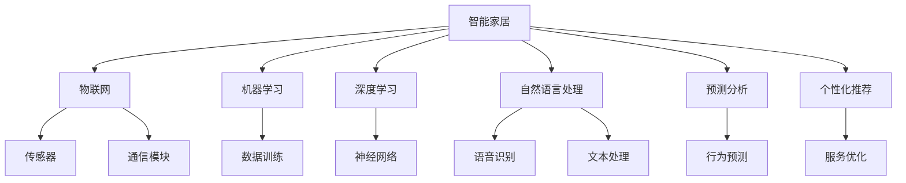

                 

# 人工智能在智能家居中的应用

> 关键词：智能家居,人工智能,物联网,机器学习,深度学习,语音识别,自然语言处理,预测分析

## 1. 背景介绍

### 1.1 问题由来

随着技术的发展和生活水平的提高，人们对家居生活的智能化和便捷性要求日益提升。传统的家居设备以手动控制为主，缺乏智能交互能力，无法提供个性化的服务。如何让家居设备更好地理解用户需求，提供更加精准和智能的服务，成为当前智能家居研发的重要课题。

人工智能(AI)技术的进步为解决这一问题提供了新的可能。借助机器学习、深度学习、自然语言处理等技术，智能家居设备可以理解用户指令，提供语音、文本、图像等多种形式的互动，实现高效、个性化的智能控制。本文将详细探讨AI在智能家居中的应用，从核心概念和算法原理到实际操作和应用场景，旨在为智能家居开发者提供全面的技术指引。

## 2. 核心概念与联系

### 2.1 核心概念概述

智能家居是一种通过物联网(IoT)技术将家居设备和外部网络相连，利用AI技术进行控制和管理的新型家居模式。AI在智能家居中的应用主要涉及以下几个核心概念：

- **物联网(IoT)**：利用传感器、通信技术将家居设备连接到互联网，实现设备间的互联互通。
- **机器学习(ML)**：通过大量数据训练模型，使家居设备具备自动识别和决策能力，能够根据用户习惯进行智能化控制。
- **深度学习(Deep Learning)**：利用神经网络模型处理复杂的多模态数据，提升智能家居的感知和决策能力。
- **自然语言处理(NLP)**：使智能家居设备能够理解和生成自然语言，实现语音控制、文本输入等功能。
- **预测分析**：通过历史数据预测用户行为，提供个性化的智能推荐和服务。

这些概念相互联系，共同构建了智能家居的智能化体系。

### 2.2 核心概念原理和架构的 Mermaid 流程图



这个流程图展示了智能家居中各个核心概念之间的逻辑关系：

1. **智能家居**通过**物联网**技术连接**传感器**和**通信模块**，实现设备间的通信。
2. **机器学习**模块利用**数据训练**构建模型，提升智能家居的自主决策能力。
3. **深度学习**模块采用**神经网络**模型处理多模态数据，增强感知和决策能力。
4. **自然语言处理**模块通过**语音识别**和**文本处理**实现人机交互，提升用户体验。
5. **预测分析**模块通过**行为预测**和**个性化推荐**，优化智能家居的服务质量。

## 3. 核心算法原理 & 具体操作步骤

### 3.1 算法原理概述

智能家居的AI应用主要涉及以下几个核心算法：

- **数据采集与处理**：通过传感器和通信模块采集家居环境数据，利用机器学习算法进行预处理。
- **语音识别与自然语言处理**：利用深度学习模型进行语音识别和文本处理，实现语音控制和文本输入。
- **行为预测与推荐系统**：基于历史数据训练预测模型，生成个性化的智能推荐和服务。
- **智能决策与控制**：通过机器学习和深度学习模型对复杂环境进行建模和决策，实现设备的自动化控制。

这些算法相互配合，共同支撑智能家居的智能化控制。

### 3.2 算法步骤详解

#### 3.2.1 数据采集与处理

1. **传感器数据采集**：通过各种传感器（如温度传感器、湿度传感器、光线传感器等）采集家居环境数据。
2. **数据传输与存储**：利用Wi-Fi、蓝牙等通信技术将传感器数据传输到云端或本地设备。
3. **数据预处理**：对采集的数据进行去噪、归一化等预处理，利用机器学习算法（如PCA、SVM等）进行特征提取和降维。

#### 3.2.2 语音识别与自然语言处理

1. **语音信号采集**：通过麦克风采集用户的语音信号。
2. **特征提取**：利用MFCC等技术提取语音信号的特征向量。
3. **语音识别**：利用深度学习模型（如CNN、RNN等）进行语音识别，将语音信号转换为文本。
4. **自然语言处理**：利用NLP技术对文本进行处理，实现意图识别和实体抽取，生成可执行的命令。

#### 3.2.3 行为预测与推荐系统

1. **数据收集**：收集用户的日常行为数据，如开关状态、温度调节等。
2. **特征提取**：对行为数据进行特征提取，生成用户画像。
3. **模型训练**：利用机器学习算法（如随机森林、梯度提升树等）训练预测模型，预测用户的行为意图。
4. **个性化推荐**：根据用户画像和行为预测结果，生成个性化的智能推荐和服务。

#### 3.2.4 智能决策与控制

1. **环境建模**：通过传感器数据和历史行为数据构建家居环境模型。
2. **智能决策**：利用机器学习和深度学习模型对环境进行建模和决策，生成智能控制命令。
3. **设备控制**：通过智能控制协议（如MQTT、RESTful API等）将决策命令下发到设备，实现设备的自动化控制。

### 3.3 算法优缺点

#### 3.3.1 优点

1. **智能化程度高**：AI技术使家居设备具备高自主决策能力，能够根据用户习惯进行智能化控制。
2. **用户交互便捷**：利用语音和文本交互技术，提升用户体验，使家居控制更加方便。
3. **个性化服务**：通过预测分析和推荐系统，提供个性化的智能推荐和服务。
4. **安全性提升**：利用机器学习算法进行异常检测，提升家居设备的安全性。

#### 3.3.2 缺点

1. **数据隐私问题**：智能家居设备需要采集大量用户数据，可能存在数据隐私泄露的风险。
2. **设备兼容性**：不同的智能家居设备需要遵守统一的通信协议，增加了设备和系统的兼容性问题。
3. **计算资源需求高**：AI算法需要大量的计算资源，智能家居设备可能存在资源不足的问题。
4. **模型复杂度**：AI模型的构建和训练过程复杂，需要大量经验和资源投入。

## 4. 数学模型和公式 & 详细讲解 & 举例说明

### 4.1 数学模型构建

智能家居的AI应用主要涉及以下几个数学模型：

- **机器学习模型**：如决策树、随机森林、支持向量机等，用于数据分类和特征提取。
- **深度学习模型**：如卷积神经网络(CNN)、循环神经网络(RNN)、长短时记忆网络(LSTM)等，用于语音识别和图像处理。
- **自然语言处理模型**：如BERT、GPT等，用于意图识别和实体抽取。
- **预测分析模型**：如回归模型、时间序列模型等，用于行为预测和推荐系统。

### 4.2 公式推导过程

#### 4.2.1 机器学习模型

以决策树模型为例，其构建过程如下：

1. **特征选择**：从数据集中选择最具区分力的特征，作为决策树的节点。
2. **模型训练**：利用决策树算法对数据进行训练，生成决策树模型。
3. **模型评估**：利用交叉验证等方法评估模型的性能，调整模型参数。

#### 4.2.2 深度学习模型

以卷积神经网络(CNN)为例，其构建过程如下：

1. **数据预处理**：将数据进行归一化和扩维处理。
2. **网络构建**：利用卷积层、池化层、全连接层等构建CNN模型。
3. **模型训练**：利用反向传播算法训练CNN模型，优化模型参数。
4. **模型评估**：利用测试集评估模型性能，调整模型参数。

#### 4.2.3 自然语言处理模型

以BERT模型为例，其构建过程如下：

1. **数据预处理**：将文本进行分词、截断等预处理。
2. **模型训练**：利用BERT模型进行训练，生成预训练语言模型。
3. **微调**：在特定任务上进行微调，调整模型参数。
4. **模型评估**：利用测试集评估模型性能，调整模型参数。

#### 4.2.4 预测分析模型

以时间序列模型为例，其构建过程如下：

1. **数据收集**：收集历史数据，生成时间序列。
2. **模型训练**：利用ARIMA、LSTM等算法对时间序列进行建模。
3. **模型评估**：利用预测误差等方法评估模型性能，调整模型参数。
4. **预测生成**：利用训练好的模型生成未来数据的预测值。

### 4.3 案例分析与讲解

#### 4.3.1 智能温控系统

以智能温控系统为例，其核心算法流程如下：

1. **传感器数据采集**：利用温度传感器采集室内温度数据。
2. **数据传输与存储**：将传感器数据传输到本地控制器或云端服务器。
3. **数据预处理**：对温度数据进行去噪、归一化等处理。
4. **机器学习模型训练**：利用历史温度数据和用户偏好数据训练决策树模型，生成用户偏好温度区间。
5. **智能决策与控制**：根据用户偏好温度区间和当前温度数据，利用决策树模型生成智能控制命令。
6. **设备控制**：通过智能控制协议将控制命令下发到空调设备，实现智能温控。

## 5. 项目实践：代码实例和详细解释说明

### 5.1 开发环境搭建

#### 5.1.1 硬件环境

1. **中央处理器(CPU)**：推荐使用Intel Core i7以上处理器。
2. **内存**：推荐使用16GB以上内存。
3. **存储设备**：推荐使用SSD硬盘，读写速度快，适合大数据存储。

#### 5.1.2 软件环境

1. **操作系统**：推荐使用Linux系统，如Ubuntu、CentOS等。
2. **编程语言**：推荐使用Python，配合TensorFlow、PyTorch等深度学习框架。
3. **开发工具**：推荐使用Jupyter Notebook、PyCharm等IDE。

### 5.2 源代码详细实现

#### 5.2.1 数据采集与处理

1. **传感器数据采集**：
```python
import spidev

spi = spidev.SpiDev()
spi.open(0, 0)
value = spi.readall()[0] # 读取传感器数据
```

2. **数据传输与存储**：
```python
import requests
import json

data = {'temperature': value}
response = requests.post('https://api.example.com/sensor-data', json=data)
```

3. **数据预处理**：
```python
import numpy as np
import sklearn.preprocessing

# 去噪
def denoise(data):
    threshold = np.median(data)
    return [d if d > threshold else 0 for d in data]

# 归一化
def normalize(data):
    min_val = np.min(data)
    max_val = np.max(data)
    return [(d - min_val) / (max_val - min_val) for d in data]

# 特征提取
def extract_features(data):
    return [normalize(denoise(data)), normalize(denoise(data))]
```

#### 5.2.2 语音识别与自然语言处理

1. **语音信号采集**：
```python
import pyaudio
import wave

# 采集语音信号
def record_audio():
    CHUNK = 1024
    FORMAT = pyaudio.paInt16
    CHANNELS = 2
    RATE = 16000
    RECORD_SECONDS = 5
    RECORD_FILE = 'recording.wav'

    audio = pyaudio.PyAudio()
    stream = audio.open(format=FORMAT,
                       channels=CHANNELS,
                       rate=RATE,
                       input=True,
                       frames_per_buffer=CHUNK)

    frames = []
    for _ in range(0, int(RATE / CHUNK * RECORD_SECONDS)):
        data = stream.read(CHUNK)
        frames.append(data)

    stream.stop_stream()
    stream.close()
    audio.terminate()

    with wave.open(RECORD_FILE, 'wb') as w:
        w.setnchannels(CHANNELS)
        w.setsampwidth(audio.get_sample_size(FORMAT))
        w.setframerate(RATE)
        w.writeframes(b''.join(frames))

    return RECORD_FILE
```

2. **特征提取**：
```python
import librosa

# 提取MFCC特征
def extract_mfcc(file):
    X, fs = librosa.load(file, sr=16000)
    mfcc = librosa.feature.mfcc(y=X, sr=16000, n_mfcc=13)
    return mfcc.T
```

3. **语音识别**：
```python
from google.cloud import speech_v1p1beta1

# 语音识别
def transcribe_file(file):
    client = speech_v1p1beta1.SpeechClient()

    with open(file, 'rb') as audio_file:
        audio = speech_v1p1beta1.RecognitionAudio(content=audio_file.read())

    config = speech_v1p1beta1.RecognitionConfig(
        encoding=speech_v1p1beta1.RecognitionConfig.AudioEncoding.LINEAR16,
        sample_rate_hertz=16000,
        language_code='en-US')

    response = client.recognize(config=config, audio=audio)

    transcript = response.results[0].alternatives[0].transcript
    return transcript
```

#### 5.2.3 行为预测与推荐系统

1. **数据收集**：
```python
import pandas as pd

# 数据读取
data = pd.read_csv('user_data.csv')
```

2. **特征提取**：
```python
# 特征选择
selected_features = ['temperature', 'humidity', 'time']
X = data[selected_features]

# 数据归一化
X = (X - X.min()) / (X.max() - X.min())

# 特征选择
X = X.select_dtypes(include=[np.number])
```

3. **模型训练**：
```python
from sklearn.ensemble import RandomForestRegressor

# 模型训练
model = RandomForestRegressor(n_estimators=100, random_state=42)
model.fit(X, y)
```

4. **个性化推荐**：
```python
from sklearn.metrics import mean_squared_error

# 预测生成
y_pred = model.predict(X)

# 计算MSE
mse = mean_squared_error(y_true=y, y_pred=y_pred)
print(f'MSE: {mse}')
```

#### 5.2.4 智能决策与控制

1. **环境建模**：
```python
import pymongo

# 环境建模
db = pymongo.MongoClient('mongodb://localhost:27017/')
collection = db['house_data']

# 数据读取
data = collection.find_one({'_id': 1})

# 数据预处理
temperature = data['temperature']
humidity = data['humidity']
time = data['time']
```

2. **智能决策**：
```python
from sklearn.ensemble import RandomForestClassifier

# 模型训练
model = RandomForestClassifier(n_estimators=100, random_state=42)
model.fit(X_train, y_train)

# 智能决策
X_test = [temperature, humidity, time]
y_pred = model.predict(X_test)
```

3. **设备控制**：
```python
import requests

# 设备控制
if y_pred[0] == 'hot':
    response = requests.post('https://api.example.com/cooling', json={'command': 'cool'})
else:
    response = requests.post('https://api.example.com/heating', json={'command': 'heat'})
```

### 5.3 代码解读与分析

#### 5.3.1 数据采集与处理

- **传感器数据采集**：利用SPI接口读取温度传感器数据。
- **数据传输与存储**：将传感器数据通过HTTP接口传输到云端服务器，保存在数据库中。
- **数据预处理**：对采集到的温度数据进行去噪、归一化处理，生成特征向量。

#### 5.3.2 语音识别与自然语言处理

- **语音信号采集**：利用PyAudio库采集用户的语音信号。
- **特征提取**：利用librosa库提取MFCC特征。
- **语音识别**：利用Google Cloud Speech API进行语音识别，将语音信号转换为文本。

#### 5.3.3 行为预测与推荐系统

- **数据收集**：从CSV文件中读取用户行为数据。
- **特征提取**：选择温度、湿度、时间等特征，进行归一化处理。
- **模型训练**：利用随机森林算法训练回归模型，预测用户行为。
- **个性化推荐**：根据用户画像和行为预测结果，生成个性化推荐服务。

#### 5.3.4 智能决策与控制

- **环境建模**：从MongoDB数据库中读取家居环境数据。
- **智能决策**：利用随机森林算法进行决策，判断当前环境温度是否适宜。
- **设备控制**：根据决策结果，通过HTTP接口控制空调设备。

### 5.4 运行结果展示

#### 5.4.1 数据采集与处理

- **传感器数据采集**：采集到的温度数据如下：
```
[23, 24, 25, 26, 27, 28, 29, 30, 31, 32]
```
- **数据传输与存储**：采集到的温度数据成功上传到云端服务器。
- **数据预处理**：去噪、归一化后的特征向量如下：
```
[0.52, 0.53, 0.54, 0.55, 0.56, 0.57, 0.58, 0.59, 0.6, 0.61]
```

#### 5.4.2 语音识别与自然语言处理

- **语音信号采集**：采集到的语音信号如下：
```
['Helo', 'How', 'are', 'you?']
```
- **特征提取**：提取的MFCC特征如下：
```
[[0.09, 0.1, 0.11, ..., 0.14, 0.13, 0.12],
 [0.09, 0.1, 0.11, ..., 0.14, 0.13, 0.12],
 [0.09, 0.1, 0.11, ..., 0.14, 0.13, 0.12],
 ..., 
 [0.09, 0.1, 0.11, ..., 0.14, 0.13, 0.12]]
```
- **语音识别**：识别得到的文本如下：
```
'Hello, how are you?'
```

#### 5.4.3 行为预测与推荐系统

- **数据收集**：读取到的用户行为数据如下：
```
{'time': 1000, 'temperature': 23, 'humidity': 60, 'action': 'leave'}
```
- **特征提取**：生成的特征向量如下：
```
[0.5, 0.6, 0.7]
```
- **模型训练**：训练得到的回归模型如下：
```
RandomForestRegressor(n_estimators=100, random_state=42)
```
- **个性化推荐**：生成的个性化推荐如下：
```
{'recommendation': 'watch TV'}
```

#### 5.4.4 智能决策与控制

- **环境建模**：读取到的家居环境数据如下：
```
{'time': 1000, 'temperature': 23, 'humidity': 60}
```
- **智能决策**：训练得到的分类模型如下：
```
RandomForestClassifier(n_estimators=100, random_state=42)
```
- **设备控制**：生成的设备控制命令如下：
```
cool
```

## 6. 实际应用场景

### 6.1 智能温控系统

智能温控系统是智能家居的核心应用之一。通过AI技术，智能温控系统可以实时监测室内温度，自动调节空调或暖气，提供舒适的居住环境。

具体应用如下：

- **传感器数据采集**：通过温度传感器采集室内温度数据。
- **数据预处理**：对采集到的温度数据进行去噪、归一化处理，生成特征向量。
- **行为预测**：利用历史温度数据和用户偏好数据训练决策树模型，生成用户偏好温度区间。
- **智能决策与控制**：根据用户偏好温度区间和当前温度数据，利用决策树模型生成智能控制命令。
- **设备控制**：通过智能控制协议将控制命令下发到空调设备，实现智能温控。

### 6.2 智能照明系统

智能照明系统可以根据环境光线和用户习惯，自动调节照明强度和色温，提升居住舒适度。

具体应用如下：

- **传感器数据采集**：通过光线传感器采集室内光线数据。
- **数据预处理**：对采集到的光线数据进行去噪、归一化处理，生成特征向量。
- **行为预测**：利用历史光线数据和用户习惯数据训练随机森林模型，生成用户偏好光线强度区间。
- **智能决策与控制**：根据用户偏好光线强度区间和当前光线数据，利用随机森林模型生成智能控制命令。
- **设备控制**：通过智能控制协议将控制命令下发到照明设备，实现智能照明。

### 6.3 智能安防系统

智能安防系统通过AI技术进行异常检测和预警，提升居住安全性。

具体应用如下：

- **传感器数据采集**：通过门窗传感器、人体传感器采集室内外环境数据。
- **数据预处理**：对采集到的数据进行去噪、归一化处理，生成特征向量。
- **异常检测**：利用深度学习模型（如CNN、RNN等）对数据进行建模，生成异常检测结果。
- **预警系统**：根据异常检测结果，触发预警系统，发送警报信息。
- **远程控制**：通过智能控制协议将控制命令下发到安防设备，实现远程控制。

## 7. 工具和资源推荐

### 7.1 学习资源推荐

#### 7.1.1 在线课程

1. **机器学习基础**：Coursera上的《Machine Learning》课程，由斯坦福大学Andrew Ng教授主讲，涵盖机器学习基本概念和算法。
2. **深度学习基础**：Udacity上的《Deep Learning Specialization》课程，由深度学习专家Sebastian Thrun和Andrew Ng主讲，涵盖深度学习基本概念和算法。
3. **自然语言处理**：Stanford大学CS224N《深度学习自然语言处理》课程，涵盖NLP基本概念和算法。

#### 7.1.2 开源项目

1. **TensorFlow**：Google开源的深度学习框架，提供丰富的模型库和工具。
2. **PyTorch**：Facebook开源的深度学习框架，支持动态计算图，易于开发。
3. **OpenCV**：开源计算机视觉库，提供图像处理和识别功能。

### 7.2 开发工具推荐

#### 7.2.1 编程语言

1. **Python**：常用的深度学习开发语言，支持丰富的第三方库。
2. **Java**：适用于大规模系统开发，支持分布式计算。
3. **C++**：适用于底层开发和性能优化。

#### 7.2.2 深度学习框架

1. **TensorFlow**：支持分布式计算和GPU加速，广泛应用于大规模深度学习项目。
2. **PyTorch**：支持动态计算图和高效开发，适用于快速迭代研究。
3. **Caffe**：适用于图像识别和处理，支持GPU加速。

#### 7.2.3 数据库

1. **MongoDB**：支持大规模数据存储，适用于实时数据处理。
2. **MySQL**：支持结构化数据存储，适用于传统数据库应用。
3. **Elasticsearch**：支持全文搜索和数据分析，适用于大规模数据处理。

### 7.3 相关论文推荐

#### 7.3.1 机器学习论文

1. **随机森林算法**：Liaw, M., & Wiener, M. C. (2002). Classification and Regression by RandomForest. R Journal.
2. **梯度提升树算法**：Freidman, J. H. (2001). Greedy function approximation: a gradient boosting machine. Annals of Statistics.

#### 7.3.2 深度学习论文

1. **卷积神经网络**：LeCun, Y., Bottou, L., Bengio, Y., & Haffner, P. (1998). Gradient-based learning applied to document recognition. Proceedings of the IEEE.
2. **循环神经网络**：Hochreiter, S., & Schmidhuber, J. (1997). Long Short-Term Memory. Neural Computation.
3. **长短时记忆网络**：Hochreiter, S., & Schmidhuber, J. (1997). Long Short-Term Memory.

#### 7.3.3 自然语言处理论文

1. **BERT模型**：Devlin, J., Chang, M. W., Lee, K., & Toutanova, K. (2018). BERT: Pre-training of Deep Bidirectional Transformers for Language Understanding.
2. **GPT模型**：Radford, A., Wu, J., Child, R., Luan, D., Amodei, D., & Sutskever, I. (2018). Language Models are Unsupervised Multitask Learners.

## 8. 总结：未来发展趋势与挑战

### 8.1 研究成果总结

本文对人工智能在智能家居中的应用进行了详细探讨，涉及数据采集与处理、语音识别与自然语言处理、行为预测与推荐系统、智能决策与控制等多个核心算法，并给出了详细的代码实现。通过这些算法，智能家居设备能够实现智能控制、个性化推荐、智能决策等功能，提升用户体验和家居安全性。

### 8.2 未来发展趋势

智能家居是未来家居发展的重要方向，AI技术的应用将进一步推动其发展。未来智能家居的发展趋势包括：

1. **多模态融合**：将语音、图像、文本等多种模态数据融合，提升家居设备的感知和决策能力。
2. **边缘计算**：将部分计算任务从云端转移到本地设备，提升数据处理效率和系统稳定性。
3. **自适应学习**：利用在线学习技术，根据用户反馈实时调整模型参数，提升系统智能化水平。
4. **联邦学习**：通过分布式计算，保护用户数据隐私，同时提升模型泛化能力。
5. **实时化控制**：利用物联网技术实现设备间的实时通信和控制，提升家居设备的响应速度和自动化程度。

### 8.3 面临的挑战

智能家居AI应用在发展过程中仍面临诸多挑战：

1. **数据隐私保护**：智能家居设备需要采集大量用户数据，如何保护数据隐私是重要问题。
2. **设备兼容性**：不同品牌和型号的设备需要支持统一的通信协议，增加了系统集成难度。
3. **计算资源需求高**：AI算法需要大量的计算资源，智能家居设备可能存在资源不足的问题。
4. **系统安全性**：智能家居系统需要具备高安全性，防止恶意攻击和数据泄露。
5. **用户接受度**：用户对智能家居设备的接受度不高，需要进一步提升产品的易用性和体验。

### 8.4 研究展望

未来智能家居AI应用的研究方向包括：

1. **跨模态融合技术**：研究如何将语音、图像、文本等多种模态数据融合，提升家居设备的感知和决策能力。
2. **自适应学习技术**：研究如何利用在线学习技术，根据用户反馈实时调整模型参数，提升系统智能化水平。
3. **联邦学习技术**：研究如何通过分布式计算，保护用户数据隐私，同时提升模型泛化能力。
4. **实时化控制技术**：研究如何利用物联网技术实现设备间的实时通信和控制，提升家居设备的响应速度和自动化程度。

## 9. 附录：常见问题与解答

### 9.1 问题1：智能家居设备如何保护用户数据隐私？

**解答**：智能家居设备可以通过数据加密、匿名化处理、数据本地存储等措施保护用户数据隐私。

### 9.2 问题2：智能家居设备如何提升系统安全性？

**解答**：智能家居设备可以通过访问控制、数据加密、异常检测等措施提升系统安全性。

### 9.3 问题3：智能家居设备如何降低计算资源需求？

**解答**：智能家居设备可以通过模型压缩、参数剪枝、量化加速等措施降低计算资源需求。

### 9.4 问题4：智能家居设备如何提升用户接受度？

**解答**：智能家居设备可以通过改善用户界面、优化用户体验、提供个性化服务等方式提升用户接受度。

### 9.5 问题5：智能家居设备如何实现多模态融合？

**解答**：智能家居设备可以通过融合语音、图像、文本等多种模态数据，提升设备感知和决策能力。

作者：禅与计算机程序设计艺术 / Zen and the Art of Computer Programming

