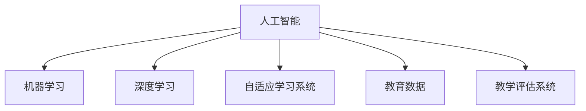

                 

# 人工智能：教育变革的催化剂

> 关键词：人工智能,教育技术,个性化学习,自适应学习,教育数据,教学评估

## 1. 背景介绍

### 1.1 问题由来

随着信息技术的迅猛发展，教育领域正经历着前所未有的变革。传统的教室+板书的教学模式逐渐被在线学习平台、虚拟课堂、智能导师等新兴技术所取代。人工智能(AI)技术作为这场变革的重要推动力，正为教育领域带来深远的影响。

### 1.2 问题核心关键点

人工智能在教育中的应用，主要体现在以下几个方面：

- 个性化学习：通过智能推荐系统，为每个学生量身定制学习路径，提升学习效果。
- 自适应学习：利用机器学习技术，实时调整教学内容和方法，以适应学生的学习进度和理解程度。
- 教育数据应用：运用大数据技术，收集和分析学习行为数据，为教学决策提供科学依据。
- 教学评估：通过AI辅助，实现对学生学习成效的精准评估和反馈，指导后续教学改进。

人工智能技术的应用，极大地提升了教育的可访问性、可个性化和可衡量性，为教育公平、效率和质量提供了新的解决方案。但同时，如何合理应用AI技术，避免技术滥用，保障教育伦理，也成为当前亟待解决的问题。

## 2. 核心概念与联系

### 2.1 核心概念概述

为更好地理解AI在教育中的应用，本节将介绍几个密切相关的核心概念：

- 人工智能(AI)：利用计算机算法和数据处理技术，模拟人类智能行为，解决复杂问题。
- 机器学习(ML)：通过数据分析和学习算法，使机器具备自我改进能力，从而提升决策效率。
- 深度学习(DL)：以神经网络为核心的机器学习技术，能够处理大规模数据，捕捉数据中的非线性关系。
- 自适应学习系统(Adaptive Learning System)：根据学生学习情况动态调整教学内容的智能学习系统。
- 教育数据(EdTech Data)：包括学习行为数据、评估数据、教师反馈等，用于分析和优化教学过程。
- 教学评估系统(Educational Assessment System)：利用AI技术进行自动化测评，提升评估效率和精准度。

这些概念之间的逻辑关系可以通过以下Mermaid流程图来展示：



这个流程图展示了大语言模型的工作原理和优化方向。

## 3. 核心算法原理 & 具体操作步骤
### 3.1 算法原理概述

基于AI的教育技术，主要利用机器学习、深度学习和自然语言处理等技术，为教育过程提供智能化的支持。其核心算法原理如下：

1. 数据预处理：收集和清洗教育数据，进行特征提取和数据增强，为模型训练做准备。
2. 模型训练：选择合适的深度学习模型，如卷积神经网络(CNN)、循环神经网络(RNN)、Transformer等，在教育数据集上进行训练。
3. 模型评估：使用验证集评估模型性能，调整模型参数，优化模型结构。
4. 模型应用：将训练好的模型部署到在线学习平台、智能导师等教育应用中，实时处理用户输入，提供个性化学习建议。

### 3.2 算法步骤详解

基于AI的教育技术主要分为以下几个关键步骤：

**Step 1: 数据收集与预处理**
- 收集教育数据，包括学生成绩、学习行为、教师反馈等。
- 清洗和标注数据，确保数据质量和一致性。
- 进行特征工程，提取和选择关键特征。

**Step 2: 模型选择与训练**
- 选择合适的深度学习模型，如卷积神经网络(CNN)、循环神经网络(RNN)、Transformer等。
- 在教育数据集上进行模型训练，调整超参数，优化模型结构。
- 使用验证集评估模型性能，选择最优模型。

**Step 3: 模型集成与应用**
- 将训练好的模型集成到在线学习平台、智能导师等教育应用中。
- 实时处理用户输入，根据学生学习情况提供个性化推荐和建议。
- 定期更新模型，根据最新数据进行迭代优化。

**Step 4: 评估与反馈**
- 使用测试集评估模型性能，衡量其对学生的学习效果和满意度。
- 收集用户反馈，优化模型和应用。
- 持续改进教学方法，提升教育质量。

### 3.3 算法优缺点

基于AI的教育技术具有以下优点：
1. 个性化推荐：能够根据学生的学习习惯、兴趣和水平，提供量身定制的学习路径和资源。
2. 实时反馈：通过实时分析学习数据，及时发现问题并给出改进建议。
3. 数据驱动：基于大量学习数据，实现精准的教学评估和决策支持。
4. 灵活应用：适用于各类教育场景，如在线学习、虚拟课堂、智能导师等。

同时，该方法也存在以下局限性：
1. 数据隐私：大量教育数据的收集和使用，涉及学生隐私，需要严格的数据保护措施。
2. 技术门槛：实现和维护高性能AI系统，需要专业的技术团队和硬件支持。
3. 教育公平：AI技术可能加剧教育资源的不均衡分配，需注意公平性问题。
4. 技术滥用：滥用AI技术可能导致过度干预学习过程，影响学生自主性。
5. 伦理争议：AI系统的决策过程和结果，需具备可解释性和透明性，避免偏见和歧视。

尽管存在这些局限性，但就目前而言，基于AI的教育技术仍是大教育变革的重要手段。未来相关研究的重点在于如何进一步降低技术门槛，提高AI系统的普适性和伦理安全性，同时兼顾教育质量和公平性等因素。

### 3.4 算法应用领域

基于AI的教育技术已经在诸多领域得到广泛应用，例如：

- 在线学习平台：如Coursera、edX、Khan Academy等，通过AI技术推荐课程和学习资源，优化学习路径。
- 虚拟课堂：如Zoom、Teams等，利用AI技术识别学生情绪，调整教学策略。
- 智能导师：如Duolingo、Quizlet等，通过AI技术提供实时反馈和个性化建议，提升学习效果。
- 教学评估系统：如Gradescope、Turnitin等，通过AI技术自动评分和分析，提高评估效率和精准度。
- 教育数据分析：如IBM Watson Education、Google Classroom等，利用大数据技术分析学习行为，指导教学改进。

除了上述这些经典应用外，AI技术还被创新性地应用到更多场景中，如虚拟实验、游戏化学习、情感识别等，为教育带来了全新的突破。

## 4. 数学模型和公式 & 详细讲解 & 举例说明
### 4.1 数学模型构建

本节将使用数学语言对基于AI的教育技术进行更加严格的刻画。

设教育数据集为 $D=\{(x_i,y_i)\}_{i=1}^N$，其中 $x_i$ 为学生学习行为数据， $y_i$ 为相应的学习成效评价。定义模型 $M_{\theta}:\mathcal{X} \rightarrow \mathcal{Y}$，其中 $\mathcal{X}$ 为学习行为特征空间，$\mathcal{Y}$ 为学习成效评价空间，$\theta \in \mathbb{R}^d$ 为模型参数。

定义模型 $M_{\theta}$ 在数据样本 $(x,y)$ 上的损失函数为 $\ell(M_{\theta}(x),y)$，则在数据集 $D$ 上的经验风险为：

$$
\mathcal{L}(\theta) = \frac{1}{N} \sum_{i=1}^N \ell(M_{\theta}(x_i),y_i)
$$

其中 $\ell$ 为损失函数，用于衡量模型预测输出与真实标签之间的差异。常见的损失函数包括交叉熵损失、均方误差损失等。

在实践中，我们通常使用基于梯度的优化算法（如SGD、Adam等）来近似求解上述最优化问题。设 $\eta$ 为学习率，$\lambda$ 为正则化系数，则参数的更新公式为：

$$
\theta \leftarrow \theta - \eta \nabla_{\theta}\mathcal{L}(\theta) - \eta\lambda\theta
$$

其中 $\nabla_{\theta}\mathcal{L}(\theta)$ 为损失函数对参数 $\theta$ 的梯度，可通过反向传播算法高效计算。

### 4.2 公式推导过程

以下我们以个性化推荐系统为例，推导交叉熵损失函数及其梯度的计算公式。

假设模型 $M_{\theta}$ 在输入 $x$ 上的输出为 $\hat{y}=M_{\theta}(x) \in [0,1]$，表示学生是否完成某一课程的概率。真实标签 $y \in \{0,1\}$。则交叉熵损失函数定义为：

$$
\ell(M_{\theta}(x),y) = -[y\log \hat{y} + (1-y)\log (1-\hat{y})]
$$

将其代入经验风险公式，得：

$$
\mathcal{L}(\theta) = -\frac{1}{N}\sum_{i=1}^N [y_i\log M_{\theta}(x_i)+(1-y_i)\log(1-M_{\theta}(x_i))]
$$

根据链式法则，损失函数对参数 $\theta_k$ 的梯度为：

$$
\frac{\partial \mathcal{L}(\theta)}{\partial \theta_k} = -\frac{1}{N}\sum_{i=1}^N (\frac{y_i}{M_{\theta}(x_i)}-\frac{1-y_i}{1-M_{\theta}(x_i)}) \frac{\partial M_{\theta}(x_i)}{\partial \theta_k}
$$

其中 $\frac{\partial M_{\theta}(x_i)}{\partial \theta_k}$ 可进一步递归展开，利用自动微分技术完成计算。

在得到损失函数的梯度后，即可带入参数更新公式，完成模型的迭代优化。重复上述过程直至收敛，最终得到适应个性化推荐的任务的最优模型参数 $\theta^*$。

## 5. 项目实践：代码实例和详细解释说明
### 5.1 开发环境搭建

在进行教育技术开发前，我们需要准备好开发环境。以下是使用Python进行PyTorch开发的环境配置流程：

1. 安装Anaconda：从官网下载并安装Anaconda，用于创建独立的Python环境。

2. 创建并激活虚拟环境：
```bash
conda create -n pytorch-env python=3.8 
conda activate pytorch-env
```

3. 安装PyTorch：根据CUDA版本，从官网获取对应的安装命令。例如：
```bash
conda install pytorch torchvision torchaudio cudatoolkit=11.1 -c pytorch -c conda-forge
```

4. 安装TensorFlow：由Google主导开发的开源深度学习框架，生产部署方便，适合大规模工程应用。同样有丰富的预训练语言模型资源。

5. 安装各类工具包：
```bash
pip install numpy pandas scikit-learn matplotlib tqdm jupyter notebook ipython
```

完成上述步骤后，即可在`pytorch-env`环境中开始教育技术开发。

### 5.2 源代码详细实现

下面我们以推荐系统为例，给出使用Transformers库对BERT模型进行个性化推荐开发的PyTorch代码实现。

首先，定义推荐任务的数据处理函数：

```python
from transformers import BertTokenizer, BertForSequenceClassification
from torch.utils.data import Dataset, DataLoader
import torch

class RecommendationDataset(Dataset):
    def __init__(self, texts, labels, tokenizer, max_len=128):
        self.texts = texts
        self.labels = labels
        self.tokenizer = tokenizer
        self.max_len = max_len
        
    def __len__(self):
        return len(self.texts)
    
    def __getitem__(self, item):
        text = self.texts[item]
        label = self.labels[item]
        
        encoding = self.tokenizer(text, return_tensors='pt', max_length=self.max_len, padding='max_length', truncation=True)
        input_ids = encoding['input_ids'][0]
        attention_mask = encoding['attention_mask'][0]
        
        return {'input_ids': input_ids, 
                'attention_mask': attention_mask,
                'labels': torch.tensor(label, dtype=torch.long)}
```

然后，定义模型和优化器：

```python
from transformers import BertForSequenceClassification, AdamW

model = BertForSequenceClassification.from_pretrained('bert-base-cased', num_labels=2)

optimizer = AdamW(model.parameters(), lr=2e-5)
```

接着，定义训练和评估函数：

```python
from sklearn.metrics import accuracy_score

device = torch.device('cuda') if torch.cuda.is_available() else torch.device('cpu')
model.to(device)

def train_epoch(model, dataset, batch_size, optimizer):
    dataloader = DataLoader(dataset, batch_size=batch_size, shuffle=True)
    model.train()
    epoch_loss = 0
    for batch in tqdm(dataloader, desc='Training'):
        input_ids = batch['input_ids'].to(device)
        attention_mask = batch['attention_mask'].to(device)
        labels = batch['labels'].to(device)
        model.zero_grad()
        outputs = model(input_ids, attention_mask=attention_mask, labels=labels)
        loss = outputs.loss
        epoch_loss += loss.item()
        loss.backward()
        optimizer.step()
    return epoch_loss / len(dataloader)

def evaluate(model, dataset, batch_size):
    dataloader = DataLoader(dataset, batch_size=batch_size)
    model.eval()
    preds, labels = [], []
    with torch.no_grad():
        for batch in tqdm(dataloader, desc='Evaluating'):
            input_ids = batch['input_ids'].to(device)
            attention_mask = batch['attention_mask'].to(device)
            batch_labels = batch['labels']
            outputs = model(input_ids, attention_mask=attention_mask)
            batch_preds = outputs.logits.argmax(dim=1).to('cpu').tolist()
            batch_labels = batch_labels.to('cpu').tolist()
            for pred, label in zip(batch_preds, batch_labels):
                preds.append(pred)
                labels.append(label)
                
    return accuracy_score(labels, preds)
```

最后，启动训练流程并在测试集上评估：

```python
epochs = 5
batch_size = 16

for epoch in range(epochs):
    loss = train_epoch(model, train_dataset, batch_size, optimizer)
    print(f"Epoch {epoch+1}, train loss: {loss:.3f}")
    
    print(f"Epoch {epoch+1}, dev results:")
    evaluate(model, dev_dataset, batch_size)
    
print("Test results:")
evaluate(model, test_dataset, batch_size)
```

以上就是使用PyTorch对BERT进行个性化推荐任务开发的完整代码实现。可以看到，得益于Transformers库的强大封装，我们可以用相对简洁的代码完成BERT模型的加载和推荐任务微调。

### 5.3 代码解读与分析

让我们再详细解读一下关键代码的实现细节：

**RecommendationDataset类**：
- `__init__`方法：初始化文本、标签、分词器等关键组件。
- `__len__`方法：返回数据集的样本数量。
- `__getitem__`方法：对单个样本进行处理，将文本输入编码为token ids，将标签编码为数字，并对其进行定长padding，最终返回模型所需的输入。

**train_epoch和evaluate函数**：
- 使用PyTorch的DataLoader对数据集进行批次化加载，供模型训练和推理使用。
- 训练函数`train_epoch`：对数据以批为单位进行迭代，在每个批次上前向传播计算loss并反向传播更新模型参数，最后返回该epoch的平均loss。
- 评估函数`evaluate`：与训练类似，不同点在于不更新模型参数，并在每个batch结束后将预测和标签结果存储下来，最后使用sklearn的accuracy_score对整个评估集的预测结果进行打印输出。

**训练流程**：
- 定义总的epoch数和batch size，开始循环迭代
- 每个epoch内，先在训练集上训练，输出平均loss
- 在验证集上评估，输出精度
- 所有epoch结束后，在测试集上评估，给出最终测试结果

可以看到，PyTorch配合Transformers库使得BERT微调的代码实现变得简洁高效。开发者可以将更多精力放在数据处理、模型改进等高层逻辑上，而不必过多关注底层的实现细节。

当然，工业级的系统实现还需考虑更多因素，如模型的保存和部署、超参数的自动搜索、更灵活的任务适配层等。但核心的微调范式基本与此类似。

## 6. 实际应用场景
### 6.1 智能课堂

基于AI的教育技术可以广泛应用于智能课堂的建设。传统的课堂教学往往以教师为中心，难以实时捕捉学生的学习状态和反馈。通过智能课堂系统，AI技术可以实时监控学生的注意力、参与度和理解情况，调整教学策略。

在技术实现上，可以采集学生的语音、面部表情、作业数据等，输入到基于深度学习模型的智能课堂系统中。系统通过分析这些数据，实时给出教学建议，如调整教学内容、提醒学生集中注意力等，从而提升课堂教学效果。

### 6.2 在线教育平台

在线教育平台如Coursera、edX等，已经成为全球数亿学生的重要学习工具。通过AI技术，在线教育平台可以实现以下功能：

- 个性化推荐：根据学生的学习历史和兴趣，推荐相关课程和资源，提升学习效率。
- 智能辅导：利用自然语言处理技术，对学生提问进行智能回答和反馈，解答学习疑问。
- 学习分析：收集和分析学生的学习行为数据，帮助教师和学生了解学习效果，优化教学策略。

### 6.3 虚拟实验

虚拟实验是一种通过计算机模拟实验过程，进行科学探究和验证的方法。通过AI技术，虚拟实验可以更加生动、直观地呈现实验过程和结果，提升学生的学习体验和理解深度。

在技术实现上，可以利用深度学习模型对实验数据进行处理和分析，生成虚拟实验场景和结果。通过虚拟现实(VR)技术，学生可以在虚拟环境中进行实验操作和观察，实现更深入的科学探究。

### 6.4 未来应用展望

随着AI技术的不断进步，基于教育技术的智能应用也将迎来更多创新。未来的教育将更加注重个性化、互动性和实时性，AI技术将在以下领域发挥重要作用：

- 自适应学习：利用AI技术实时调整教学内容和难度，适应每个学生的学习进度和能力。
- 游戏化学习：通过游戏化设计，增强学习的趣味性和参与度，提升学生的学习兴趣。
- 情感识别：利用情感分析技术，识别学生的情绪状态，及时调整教学策略。
- 智能导师：构建智能导师系统，提供实时学习辅导和反馈，帮助学生自主学习。
- 学习分析：利用大数据和机器学习技术，分析学生的学习行为数据，指导教学改进。

未来，随着AI技术的普及和应用，教育将变得更加智能化、个性化和可访问化，为每个学生提供公平、高效、愉悦的学习体验。

## 7. 工具和资源推荐
### 7.1 学习资源推荐

为了帮助开发者系统掌握AI在教育中的应用理论基础和实践技巧，这里推荐一些优质的学习资源：

1. 《深度学习在教育中的应用》系列博文：由大模型技术专家撰写，深入浅出地介绍了深度学习在教育领域的各类应用，如推荐系统、情感分析、游戏化学习等。

2. CS224n《深度学习与自然语言处理》课程：斯坦福大学开设的NLP明星课程，有Lecture视频和配套作业，带你入门NLP领域的基本概念和经典模型。

3. 《自然语言处理与教育技术》书籍：全面介绍了NLP技术在教育领域的应用，包括智能推荐、自适应学习、情感分析等。

4. IBM Watson Education官方文档：IBM Watson在教育领域的应用实践，包括个性化推荐、学习分析、智能导师等，提供了丰富的样例代码和应用场景。

5. Google Classroom官方文档：Google Classroom的AI应用实践，包括智能评分、智能辅导、学习分析等，提供了详细的API文档和开发指南。

通过对这些资源的学习实践，相信你一定能够快速掌握AI在教育中的应用精髓，并用于解决实际的教育问题。

### 7.2 开发工具推荐

高效的开发离不开优秀的工具支持。以下是几款用于AI教育技术开发的常用工具：

1. PyTorch：基于Python的开源深度学习框架，灵活动态的计算图，适合快速迭代研究。大部分深度学习模型都有PyTorch版本的实现。

2. TensorFlow：由Google主导开发的开源深度学习框架，生产部署方便，适合大规模工程应用。同样有丰富的深度学习模型资源。

3. Transformers库：HuggingFace开发的NLP工具库，集成了众多SOTA语言模型，支持PyTorch和TensorFlow，是进行教育技术开发的利器。

4. Weights & Biases：模型训练的实验跟踪工具，可以记录和可视化模型训练过程中的各项指标，方便对比和调优。与主流深度学习框架无缝集成。

5. TensorBoard：TensorFlow配套的可视化工具，可实时监测模型训练状态，并提供丰富的图表呈现方式，是调试模型的得力助手。

6. Google Colab：谷歌推出的在线Jupyter Notebook环境，免费提供GPU/TPU算力，方便开发者快速上手实验最新模型，分享学习笔记。

合理利用这些工具，可以显著提升AI教育技术开发效率，加快创新迭代的步伐。

### 7.3 相关论文推荐

AI在教育中的应用源于学界的持续研究。以下是几篇奠基性的相关论文，推荐阅读：

1. Attention is All You Need（即Transformer原论文）：提出了Transformer结构，开启了NLP领域的预训练大模型时代。

2. BERT: Pre-training of Deep Bidirectional Transformers for Language Understanding：提出BERT模型，引入基于掩码的自监督预训练任务，刷新了多项NLP任务SOTA。

3. Deep Learning in Education: A Survey and Analysis of the State of the Art：总结了深度学习在教育领域的应用现状和未来方向，提出了若干关键技术和应用场景。

4. Adaptive Learning Systems: A Comprehensive Review：对自适应学习系统的研究进展进行了全面综述，探讨了各种自适应学习方法和技术。

5. Learning Analytics: Development and Trends：总结了学习分析的研究进展和未来趋势，探讨了如何利用大数据技术优化教学过程。

这些论文代表了大语言模型微调技术的发展脉络。通过学习这些前沿成果，可以帮助研究者把握学科前进方向，激发更多的创新灵感。

## 8. 总结：未来发展趋势与挑战

### 8.1 总结

本文对基于AI的教育技术进行了全面系统的介绍。首先阐述了AI在教育中的应用背景和意义，明确了个性化学习、自适应学习、教育数据应用、教学评估等核心概念。其次，从原理到实践，详细讲解了AI技术在教育领域的应用过程，给出了推荐系统的PyTorch代码实例。同时，本文还探讨了AI技术在智能课堂、在线教育、虚拟实验等实际应用场景中的应用前景，展示了AI技术在教育领域的巨大潜力。最后，本文精选了AI教育技术的学习资源、开发工具和相关论文，力求为开发者提供全方位的技术指引。

通过本文的系统梳理，可以看到，基于AI的教育技术正在成为教育变革的重要手段，极大地提升了教育的可访问性、可个性化和可衡量性，为教育公平、效率和质量提供了新的解决方案。未来，伴随AI技术的不断演进，教育技术将更加智能化、个性化和普适化，为教育公平、效率和质量提供更加坚实的保障。

### 8.2 未来发展趋势

展望未来，AI教育技术将呈现以下几个发展趋势：

1. 个性化推荐系统将更加普及。通过深度学习模型，可以实时捕捉学生的学习行为和偏好，提供更加个性化和精准的推荐。
2. 自适应学习系统将更加智能。利用机器学习技术，系统将能够实时调整教学内容和方法，更好地适应学生的学习进度和理解程度。
3. 教育数据分析将更加深入。通过大数据和机器学习技术，可以深入分析学生的学习行为数据，指导教学改进和评估优化。
4. 智能导师系统将更加完善。结合自然语言处理和机器学习技术，智能导师将能够提供更加智能化的学习辅导和反馈。
5. 虚拟实验系统将更加逼真。通过虚拟现实和深度学习技术，可以创建更加逼真、生动的虚拟实验场景，提升学生的学习体验和理解深度。
6. 教育伦理和安全将更加重要。随着AI技术的普及，教育伦理和安全问题将越来越受到重视，需加强数据保护、模型透明性和可解释性等方面的研究。

以上趋势凸显了AI教育技术的广阔前景。这些方向的探索发展，必将进一步提升教育质量、效率和公平性，为教育公平、效率和质量提供更加坚实的保障。

### 8.3 面临的挑战

尽管AI教育技术已经取得了瞩目成就，但在迈向更加智能化、普适化应用的过程中，它仍面临诸多挑战：

1. 数据隐私：大量教育数据的收集和使用，涉及学生隐私，需要严格的数据保护措施。
2. 技术门槛：实现和维护高性能AI系统，需要专业的技术团队和硬件支持。
3. 教育公平：AI技术可能加剧教育资源的不均衡分配，需注意公平性问题。
4. 技术滥用：滥用AI技术可能导致过度干预学习过程，影响学生自主性。
5. 伦理争议：AI系统的决策过程和结果，需具备可解释性和透明性，避免偏见和歧视。
6. 学习评估：如何科学地评估AI系统的教育效果，还需要更多的实证研究和理论探讨。

尽管存在这些挑战，但伴随AI技术的不断演进，教育技术的智能化水平将不断提升，为教育公平、效率和质量提供更加坚实的保障。

### 8.4 研究展望

面对AI教育技术所面临的挑战，未来的研究需要在以下几个方面寻求新的突破：

1. 探索无监督和半监督学习算法。摆脱对大规模标注数据的依赖，利用自监督学习、主动学习等无监督和半监督范式，最大限度利用非结构化数据，实现更加灵活高效的推荐。
2. 研究参数高效和计算高效的推荐算法。开发更加参数高效的推荐方法，在固定大部分预训练参数的同时，只更新极少量的任务相关参数。同时优化推荐模型的计算图，减少前向传播和反向传播的资源消耗，实现更加轻量级、实时性的部署。
3. 引入更多先验知识。将符号化的先验知识，如知识图谱、逻辑规则等，与神经网络模型进行巧妙融合，引导推荐过程学习更准确、合理的推荐模型。同时加强不同模态数据的整合，实现视觉、语音等多模态信息与文本信息的协同建模。
4. 结合因果分析和博弈论工具。将因果分析方法引入推荐系统，识别出推荐模型决策的关键特征，增强推荐系统的鲁棒性和稳定性。借助博弈论工具刻画用户行为和系统反馈，主动探索并规避推荐系统的脆弱点，提高系统稳定性。
5. 纳入伦理道德约束。在推荐系统的训练目标中引入伦理导向的评估指标，过滤和惩罚有偏见、有害的输出倾向。同时加强人工干预和审核，建立推荐系统的监管机制，确保输出符合人类价值观和伦理道德。

这些研究方向的探索，必将引领AI教育技术的不断进步，为教育公平、效率和质量提供更加坚实的保障。面向未来，AI教育技术还需要与其他人工智能技术进行更深入的融合，如知识表示、因果推理、强化学习等，多路径协同发力，共同推动教育技术的发展。只有勇于创新、敢于突破，才能不断拓展教育技术的边界，让智能技术更好地造福教育事业。

## 9. 附录：常见问题与解答

**Q1：AI在教育中的应用主要有哪些？**

A: AI在教育中的应用主要包括以下几个方面：
1. 个性化推荐：通过智能推荐系统，为每个学生量身定制学习路径，提升学习效果。
2. 自适应学习：利用机器学习技术，实时调整教学内容和方法，以适应学生的学习进度和理解程度。
3. 教育数据应用：运用大数据技术，收集和分析学习行为数据，为教学决策提供科学依据。
4. 教学评估系统：利用AI技术进行自动化测评，提升评估效率和精准度。

**Q2：AI技术在教育中面临的主要挑战是什么？**

A: AI技术在教育中面临的主要挑战包括：
1. 数据隐私：大量教育数据的收集和使用，涉及学生隐私，需要严格的数据保护措施。
2. 技术门槛：实现和维护高性能AI系统，需要专业的技术团队和硬件支持。
3. 教育公平：AI技术可能加剧教育资源的不均衡分配，需注意公平性问题。
4. 技术滥用：滥用AI技术可能导致过度干预学习过程，影响学生自主性。
5. 伦理争议：AI系统的决策过程和结果，需具备可解释性和透明性，避免偏见和歧视。

**Q3：如何选择合适的AI教育技术应用场景？**

A: 选择合适的AI教育技术应用场景，主要需要考虑以下几个因素：
1. 教学需求：根据教学目标和需求，选择合适的AI技术应用。如个性化推荐适用于泛化性强、知识跨度大的课程，自适应学习适用于知识难度高、个体差异大的课程。
2. 数据可用性：评估应用场景中可获取的教育数据类型和数量，选择合适的AI技术。如推荐系统需要大量用户行为数据，自适应学习需要实时采集学习数据。
3. 技术可行性：考虑学校和教育机构的硬件设施和技术支持情况，选择合适的AI技术。如推荐系统需要高性能计算资源，自适应学习需要智能化的教学平台。
4. 用户接受度：评估学生和教师对AI技术的接受度和认可度，选择合适的AI技术。如推荐系统需要用户对推荐结果的信任和认可，自适应学习需要教师对系统输出的信任和支持。

**Q4：如何提高AI教育技术的可解释性和透明性？**

A: 提高AI教育技术的可解释性和透明性，主要需要考虑以下几个方面：
1. 模型选择：选择可解释性强的AI模型，如决策树、逻辑回归等，避免过于复杂的黑盒模型。
2. 特征工程：提取和选择关键特征，避免模型过度依赖噪声数据。
3. 模型解释：提供模型决策的可视化解释，如特征重要性、模型预测路径等，增强用户对AI技术的理解。
4. 数据透明：公开数据收集和处理流程，增强用户对数据隐私和安全的信任。
5. 人工干预：引入人工干预和审核机制，确保AI系统的决策符合人类价值观和伦理道德。

这些措施可以显著提高AI教育技术的可解释性和透明性，增强用户对AI技术的信任和接受度。

---

作者：禅与计算机程序设计艺术 / Zen and the Art of Computer Programming

