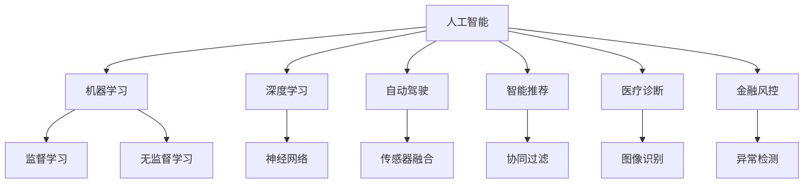

                 

# 人工智能：社会影响与思考

> 关键词：人工智能,社会影响,伦理道德,算法透明性,数据隐私,就业变革,人工智能与政府治理

## 1. 背景介绍

### 1.1 问题由来
人工智能（AI）作为现代科技发展的热点之一，正以前所未有的速度改变着社会的各个方面。从自动驾驶汽车到智能推荐系统，从医疗诊断到金融风控，AI已经深入到人类生活的方方面面。但同时，AI也引发了伦理道德、就业、隐私保护等诸多社会问题。如何在享受AI带来的便利的同时，避免其潜在的风险，是我们必须面对的挑战。

### 1.2 问题核心关键点
AI的社会影响问题，主要集中在以下几个方面：

- **伦理道德**：AI的决策是否符合道德规范，避免偏见和歧视。
- **算法透明性**：AI模型的决策过程是否透明，能否被理解和解释。
- **数据隐私**：AI如何处理和保护用户隐私，避免数据滥用。
- **就业变革**：AI技术的应用是否会引发大规模失业，如何缓解就业冲击。
- **政府治理**：AI如何辅助政府决策，提升治理效率，同时避免权力滥用。

这些核心问题涉及技术、经济、法律、伦理等多个领域，需要跨学科的协作和深入研究。本文将从这几个维度出发，探讨AI的社会影响，并提出相应的思考和建议。

## 2. 核心概念与联系

### 2.1 核心概念概述

为了更好地理解AI的社会影响问题，本节将介绍几个关键概念：

- **人工智能（AI）**：指通过算法和计算，让机器能够执行人类智能任务的技术。
- **机器学习（ML）**：一种基于数据驱动的学习方法，使机器能够从经验中自动改进性能。
- **深度学习（DL）**：一种特殊的机器学习方法，使用神经网络模型进行复杂模式识别和决策。
- **自动驾驶**：一种使用AI进行车辆控制的高级驾驶辅助技术。
- **智能推荐**：利用AI分析用户行为和偏好，提供个性化推荐服务。
- **医疗诊断**：使用AI技术辅助医生进行疾病诊断和治疗。
- **金融风控**：利用AI进行风险评估和管理。

这些概念之间的逻辑关系可以通过以下Mermaid流程图来展示：



这个流程图展示了一些关键概念及其之间的关系：

1. 人工智能通过机器学习和深度学习实现，深度学习使用神经网络模型进行复杂任务。
2. 自动驾驶、智能推荐、医疗诊断、金融风控等应用，都是AI技术的典型应用。
3. 监督学习和无监督学习是机器学习的两种主要方法。

## 3. 核心算法原理 & 具体操作步骤

### 3.1 算法原理概述

AI的社会影响问题，涉及算法原理和操作步骤的多个方面。本节将详细讲解这些原理和步骤。

- **监督学习**：通过标注数据训练模型，使其能够对新数据进行预测。
- **无监督学习**：不使用标注数据，通过数据的内在模式进行学习。
- **深度学习框架**：如TensorFlow、PyTorch等，提供模型训练和推理的API。
- **模型评估**：使用准确率、召回率、F1-score等指标评估模型性能。
- **超参数优化**：通过网格搜索、贝叶斯优化等方法找到最优超参数组合。

这些算法和步骤在实践中需要综合考虑，以确保模型在实际应用中的高效性和可靠性。

### 3.2 算法步骤详解

AI的社会影响问题，需要经过以下关键步骤：

**Step 1: 数据收集和处理**

- 收集相关领域的数据，如医疗图像、金融交易数据等。
- 清洗数据，去除噪音和不完整数据。
- 划分为训练集、验证集和测试集。

**Step 2: 模型训练和验证**

- 选择合适的模型和算法，如CNN、RNN、GAN等。
- 设置超参数，如学习率、批量大小、迭代次数等。
- 使用训练集训练模型，使用验证集评估模型性能。
- 调整超参数，重新训练模型，直至达到最佳性能。

**Step 3: 模型评估和应用**

- 在测试集上评估模型性能，计算指标。
- 应用模型于实际场景，进行预测或决策。
- 定期更新数据和模型，保持模型性能。

### 3.3 算法优缺点

AI的社会影响问题，涉及算法的优缺点：

- **优点**：
  - **高效性**：通过自动化学习和决策，大大提高了效率。
  - **准确性**：在大规模数据和复杂任务上，表现出较高的准确性。
  - **可扩展性**：适用于多种任务和场景，能够灵活扩展。

- **缺点**：
  - **可解释性**：一些算法如深度学习，缺乏透明的决策过程。
  - **偏见和歧视**：数据偏差和算法设计可能引入偏见和歧视。
  - **隐私和安全**：数据收集和处理过程中存在隐私和安全问题。

## 4. 数学模型和公式 & 详细讲解 & 举例说明

### 4.1 数学模型构建

AI的社会影响问题，涉及多个数学模型。本节将详细讲解这些模型的构建方法。

- **监督学习模型**：如线性回归、逻辑回归、支持向量机等。
- **深度学习模型**：如卷积神经网络（CNN）、循环神经网络（RNN）、生成对抗网络（GAN）等。
- **强化学习模型**：如Q-learning、策略梯度等。

这些模型在实际应用中需要根据具体问题进行选择和优化。

### 4.2 公式推导过程

以监督学习中的线性回归为例，其公式推导过程如下：

假设训练数据集为$(x_i, y_i)$，其中$x_i \in \mathbb{R}^d$，$y_i \in \mathbb{R}$。线性回归的目标是找到最优的线性关系：

$$
y_i = w^T x_i + b
$$

其中$w \in \mathbb{R}^d$，$b \in \mathbb{R}$。最小化平方误差损失函数：

$$
\mathcal{L} = \frac{1}{2N} \sum_{i=1}^N (y_i - w^T x_i - b)^2
$$

通过梯度下降等优化算法，最小化损失函数，即可得到最优参数$w$和$b$。

### 4.3 案例分析与讲解

以医疗诊断中的深度学习模型为例，进行详细讲解。

假设使用卷积神经网络（CNN）进行肺部结节检测。收集大量带有标签的肺部X光图像数据，将其划分为训练集、验证集和测试集。使用CNN模型对图像进行特征提取，并在顶部添加全连接层进行分类。通过反向传播更新模型参数，直至模型在测试集上取得理想准确率。

## 5. 项目实践：代码实例和详细解释说明

### 5.1 开发环境搭建

在进行AI项目实践前，我们需要准备好开发环境。以下是使用Python进行TensorFlow开发的环境配置流程：

1. 安装Anaconda：从官网下载并安装Anaconda，用于创建独立的Python环境。

2. 创建并激活虚拟环境：
```bash
conda create -n tf-env python=3.8 
conda activate tf-env
```

3. 安装TensorFlow：根据CUDA版本，从官网获取对应的安装命令。例如：
```bash
conda install tensorflow -c pytorch -c conda-forge
```

4. 安装各类工具包：
```bash
pip install numpy pandas scikit-learn matplotlib tqdm jupyter notebook ipython
```

完成上述步骤后，即可在`tf-env`环境中开始AI项目实践。

### 5.2 源代码详细实现

这里我们以医疗图像分类为例，给出使用TensorFlow进行卷积神经网络（CNN）模型训练的PyTorch代码实现。

首先，定义CNN模型和损失函数：

```python
import tensorflow as tf
from tensorflow.keras import layers

class CNNModel(tf.keras.Model):
    def __init__(self, input_shape, num_classes):
        super(CNNModel, self).__init__()
        self.conv1 = layers.Conv2D(32, kernel_size=(3, 3), activation='relu', input_shape=input_shape)
        self.pool1 = layers.MaxPooling2D(pool_size=(2, 2))
        self.conv2 = layers.Conv2D(64, kernel_size=(3, 3), activation='relu')
        self.pool2 = layers.MaxPooling2D(pool_size=(2, 2))
        self.flatten = layers.Flatten()
        self.fc1 = layers.Dense(128, activation='relu')
        self.fc2 = layers.Dense(num_classes, activation='softmax')
        
    def call(self, inputs):
        x = self.conv1(inputs)
        x = self.pool1(x)
        x = self.conv2(x)
        x = self.pool2(x)
        x = self.flatten(x)
        x = self.fc1(x)
        x = self.fc2(x)
        return x

model = CNNModel(input_shape=(32, 32, 3), num_classes=2)

loss_object = tf.keras.losses.SparseCategoricalCrossentropy(from_logits=True)

def train_step(images, labels):
    with tf.GradientTape() as tape:
        predictions = model(images, training=True)
        loss = loss_object(labels, predictions)
    gradients = tape.gradient(loss, model.trainable_variables)
    optimizer.apply_gradients(zip(gradients, model.trainable_variables))
    return loss

def test_step(images, labels):
    predictions = model(images, training=False)
    predicted_labels = tf.argmax(predictions, axis=1)
    return tf.reduce_mean(tf.cast(tf.equal(predicted_labels, labels), tf.float32))
```

然后，定义训练和评估函数：

```python
def train_epoch(model, dataset, batch_size, optimizer):
    model.compile(optimizer=optimizer, loss=loss_object, metrics=['accuracy'])
    model.fit(dataset, epochs=10, batch_size=batch_size)

def evaluate(model, dataset, batch_size):
    model.evaluate(dataset, batch_size=batch_size)
```

最后，启动训练流程并在测试集上评估：

```python
epochs = 10
batch_size = 32

optimizer = tf.keras.optimizers.Adam()

train_dataset = ...
test_dataset = ...

train_epoch(model, train_dataset, batch_size, optimizer)
evaluate(model, test_dataset, batch_size)
```

以上就是使用TensorFlow对医疗图像分类任务进行CNN模型微调的完整代码实现。可以看到，得益于TensorFlow的强大封装，我们可以用相对简洁的代码完成模型的训练和评估。

### 5.3 代码解读与分析

让我们再详细解读一下关键代码的实现细节：

**CNNModel类**：
- `__init__`方法：初始化模型各层组件。
- `call`方法：定义模型的前向传播过程。

**损失函数和优化器**：
- 使用SparseCategoricalCrossentropy作为分类任务的损失函数。
- 使用Adam优化器进行参数更新。

**train_step和test_step函数**：
- `train_step`方法：定义训练步，使用梯度下降更新模型参数。
- `test_step`方法：定义评估步，计算模型的准确率。

**训练流程**：
- 定义总的epoch数和batch size，开始循环迭代
- 每个epoch内，先在训练集上训练，输出损失和准确率
- 在测试集上评估，输出模型性能

可以看到，TensorFlow配合Keras等封装库使得模型训练的代码实现变得简洁高效。开发者可以将更多精力放在数据处理、模型改进等高层逻辑上，而不必过多关注底层的实现细节。

## 6. 实际应用场景

### 6.1 智能推荐系统

基于AI的智能推荐系统，已经在电商、视频、音乐等领域广泛应用。通过分析用户的历史行为数据，AI可以个性化地推荐商品、视频和音乐，提升用户体验和满意度。

在技术实现上，可以收集用户浏览、点击、购买等行为数据，提取和商品、视频、音乐相关特征，训练深度神经网络模型进行推荐。通过微调模型，可以提高推荐的效果和多样性，同时减少冷启动问题。

### 6.2 金融风控

AI在金融风控中的应用，包括信用评估、欺诈检测、风险管理等。通过分析用户交易数据和信用记录，AI可以预测用户的还款能力，识别潜在的欺诈行为，评估贷款风险。

在实际应用中，可以采用深度学习模型对用户数据进行特征提取和分类，通过微调模型，提高模型的泛化能力和鲁棒性，确保风控决策的准确性和可靠性。

### 6.3 自动驾驶

自动驾驶是AI技术的另一大应用场景，涉及传感器数据处理、图像识别、路径规划等多个环节。通过AI技术，车辆可以实现自主驾驶，提高行车安全，缓解交通拥堵。

在技术实现上，可以采用卷积神经网络（CNN）和循环神经网络（RNN）进行图像和时序数据的处理，通过微调模型，提高识别和决策的准确性。同时，引入强化学习技术，使车辆能够自主学习最优驾驶策略，进一步提升自动驾驶能力。

### 6.4 未来应用展望

随着AI技术的不断进步，未来的应用场景将更加丰富和多样。以下是几个未来可能的方向：

- **健康医疗**：AI可以辅助医生进行疾病诊断和治疗，提供个性化的医疗方案，提升医疗服务质量。
- **智慧城市**：AI可以用于城市管理，如交通调度、环境监测、公共安全等，提升城市治理效率。
- **教育培训**：AI可以个性化地为学生提供学习内容和辅导，提升教育效果。
- **社交娱乐**：AI可以用于智能客服、聊天机器人、游戏AI等，提升用户体验和互动性。
- **工业制造**：AI可以用于智能制造、质量检测、设备维护等，提升生产效率和产品品质。

## 7. 工具和资源推荐

### 7.1 学习资源推荐

为了帮助开发者系统掌握AI技术的理论基础和实践技巧，这里推荐一些优质的学习资源：

1. **《深度学习》课程**：斯坦福大学的在线课程，系统讲解深度学习的基本原理和算法。
2. **《机器学习》书籍**：周志华的《机器学习》，详细介绍机器学习的基本概念和算法。
3. **《Python深度学习》书籍**：弗朗索瓦·切勒斯布的《Python深度学习》，讲解深度学习的实战应用。
4. **TensorFlow官方文档**：提供TensorFlow的详细API文档和开发指南。
5. **Kaggle数据科学竞赛**：提供海量数据集和模型训练平台，有助于实际项目的实践。

通过对这些资源的学习实践，相信你一定能够快速掌握AI技术的精髓，并用于解决实际的业务问题。

### 7.2 开发工具推荐

高效的开发离不开优秀的工具支持。以下是几款用于AI项目开发的常用工具：

1. **TensorFlow**：由Google主导开发的开源深度学习框架，提供丰富的API和模型库。
2. **PyTorch**：Facebook开发的深度学习框架，灵活高效的计算图，适合研究和实验。
3. **Jupyter Notebook**：提供交互式编程环境，便于实验和分享学习笔记。
4. **GitHub**：提供版本控制和代码托管服务，方便团队协作和代码管理。
5. **ModelScope**：提供丰富的预训练模型和工具，助力AI模型的开发和应用。

合理利用这些工具，可以显著提升AI项目开发和实验的效率，加快创新迭代的步伐。

### 7.3 相关论文推荐

AI技术的发展得益于学界的持续研究。以下是几篇奠基性的相关论文，推荐阅读：

1. **ImageNet大规模视觉识别挑战赛**：提出大规模图像识别任务和数据集，推动深度学习技术的发展。
2. **AlphaGo与围棋**：通过深度强化学习实现AI在复杂游戏领域取得突破。
3. **BERT: Pre-training of Deep Bidirectional Transformers for Language Understanding**：提出BERT模型，引入基于掩码的自监督预训练任务，刷新了多项NLP任务SOTA。
4. **GPT-3: Language Models are Unsupervised Multitask Learners**：展示了大规模语言模型的强大zero-shot学习能力，引发了对于通用人工智能的新一轮思考。
5. **BERT-Robust**：通过对抗样本训练，提高模型的鲁棒性和泛化能力。

这些论文代表了大AI技术的最新进展，通过学习这些前沿成果，可以帮助研究者把握学科前进方向，激发更多的创新灵感。

## 8. 总结：未来发展趋势与挑战

### 8.1 总结

本文对AI的社会影响问题进行了全面系统的介绍。首先阐述了AI技术在实际应用中的广泛影响，明确了其带来的伦理道德、就业、隐私保护等社会问题。其次，从算法原理和操作步骤，详细讲解了AI技术在实际应用中的关键技术和方法。同时，本文还探讨了AI技术在多个领域的应用前景，展示了其广阔的发展空间。此外，本文精选了AI技术的各类学习资源，力求为读者提供全方位的技术指引。

通过本文的系统梳理，可以看到，AI技术正以惊人的速度改变着社会各个方面，带来了巨大的机遇和挑战。未来，伴随技术的不断进步和应用的深入，AI将更加广泛地渗透到人类生活的方方面面，深刻影响社会的进步和发展。

### 8.2 未来发展趋势

展望未来，AI技术将呈现以下几个发展趋势：

1. **AI伦理和社会责任**：随着AI技术在各个领域的广泛应用，伦理和社会责任问题将更加凸显。如何建立透明、公平、可解释的AI系统，是未来AI发展的重要方向。
2. **跨学科融合**：AI技术将与更多学科进行融合，如医学、法律、教育等，推动跨领域研究的进展。
3. **个性化和定制化**：AI技术将更加注重个性化和定制化，提供更加精准、高效的服务。
4. **自动化和智能化**：AI技术将推动更多领域的自动化和智能化，提升生产效率和生活质量。
5. **数据驱动和计算优化**：AI技术将更多依赖于数据驱动和计算优化，推动算法和模型的高效演进。
6. **人机协同**：AI技术将更多地与人类进行协同工作，提升人机交互的体验和效率。

这些趋势凸显了AI技术在未来的发展潜力和应用前景。伴随技术的不断进步和社会的持续发展，AI必将在更广泛的领域发挥重要作用，深刻影响人类的生产生活方式。

### 8.3 面临的挑战

尽管AI技术已经取得了瞩目成就，但在迈向更加智能化、普适化应用的过程中，它仍面临诸多挑战：

1. **伦理和道德**：AI技术可能引发一系列伦理和道德问题，如算法偏见、隐私泄露等。如何确保AI系统的公平性和透明度，是一个重要的研究方向。
2. **数据隐私和安全**：AI技术需要大量的数据进行训练和优化，如何在保护数据隐私的前提下，提高AI系统的性能，是一个亟待解决的问题。
3. **模型复杂性**：AI模型的复杂性不断提高，如何简化模型结构，提高模型的可解释性和可维护性，是一个重要的研究方向。
4. **计算资源**：AI模型的训练和推理需要大量的计算资源，如何优化算力，提高AI系统的效率，是一个重要的研究方向。
5. **应用落地**：如何将AI技术成功地应用到实际场景中，解决具体的业务问题，是一个重要的研究方向。
6. **长期影响**：AI技术的长期影响尚未明确，如何确保AI系统的长期稳定性和可控性，是一个重要的研究方向。

这些挑战需要学界和产业界的共同努力，通过多方协作，推动AI技术的健康发展。

### 8.4 研究展望

面对AI技术面临的挑战，未来的研究需要在以下几个方面寻求新的突破：

1. **伦理和道德研究**：开展AI伦理和社会责任的研究，建立透明、公平、可解释的AI系统。
2. **数据隐私保护**：研究如何保护数据隐私和安全，设计隐私保护的AI系统。
3. **模型简化和优化**：研究如何简化模型结构，提高模型的可解释性和可维护性。
4. **计算优化**：研究如何优化计算资源，提高AI系统的效率和性能。
5. **应用落地**：研究如何将AI技术成功地应用到实际场景中，解决具体的业务问题。
6. **长期影响研究**：开展AI技术的长期影响研究，确保AI系统的长期稳定性和可控性。

这些研究方向的探索，必将引领AI技术的健康发展，推动其在各个领域的广泛应用。只有勇于创新、敢于突破，才能不断拓展AI技术的边界，让人工智能更好地造福人类社会。

## 9. 附录：常见问题与解答

**Q1: AI技术是否会对就业产生负面影响？**

A: AI技术在提升生产效率的同时，也可能对一些职业产生冲击。但同时，AI技术也会创造出新的就业机会，如数据标注、模型训练等。通过职业培训和教育，可以帮助劳动者适应AI技术带来的变化，实现就业转型。

**Q2: AI技术是否会引发隐私泄露问题？**

A: AI技术需要大量的数据进行训练和优化，如何保护用户隐私是一个重要问题。可以通过数据匿名化、加密、隐私保护算法等措施，保护用户数据隐私。

**Q3: AI技术是否会带来偏见和歧视？**

A: AI模型可能从训练数据中学习到偏见和歧视，导致决策不公平。可以通过数据清洗、算法优化、公平性评估等措施，减少AI模型的偏见和歧视。

**Q4: AI技术是否会失去控制？**

A: 随着AI技术的发展，确保AI系统的控制和可解释性是一个重要问题。可以通过透明性评估、解释性模型、监管机制等措施，确保AI系统的控制和可解释性。

**Q5: AI技术是否会带来社会不稳定？**

A: AI技术的应用可能引发社会不稳定问题，如就业冲击、数据隐私等。需要通过政策制定、伦理监管、公众教育等措施，确保AI技术的健康发展。

---

作者：禅与计算机程序设计艺术 / Zen and the Art of Computer Programming

