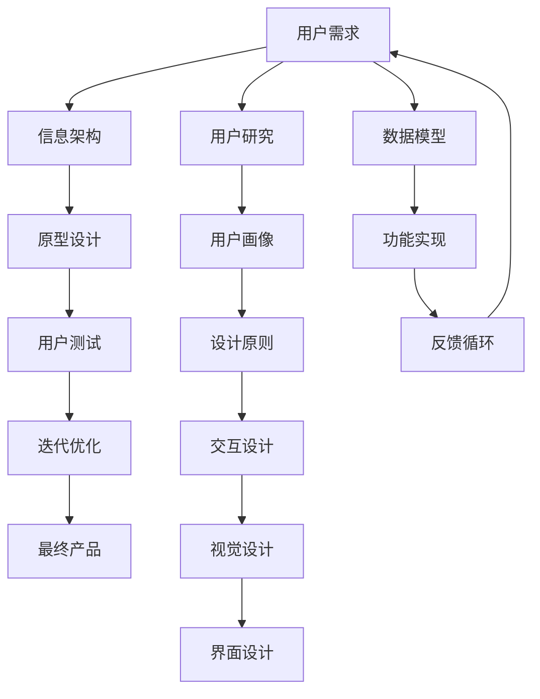

                 

# 人机交互的艺术：设计直观、高效的系统

在数字化时代，人机交互（Human-Computer Interaction, HCI）的重要性日益凸显。无论是工业自动化、医疗智能、教育辅助还是游戏娱乐，高效率、高可用性的用户界面是所有系统的基石。本文将深入探讨人机交互的设计艺术，阐述其核心概念与原理，并通过具体案例和实践指导，阐明如何构建直观、高效的用户界面。

## 1. 背景介绍

### 1.1 问题由来

随着互联网和智能设备的普及，人们越来越依赖于软件和硬件系统。然而，不当的设计往往导致用户界面（User Interface, UI）的不直观和低效，增加了用户的学习成本和操作难度。错误的交互设计甚至可能导致误操作和事故，带来不必要的损失。因此，如何设计出直观、高效、易用的用户界面，已经成为人机交互设计领域的一项重要挑战。

### 1.2 问题核心关键点

1. **易用性（Usability）**：确保用户界面简洁明了，使用户可以快速上手并高效完成任务。
2. **可访问性（Accessibility）**：设计兼顾各类用户群体，确保包括残障人士在内的所有人都能轻松使用。
3. **一致性（Consistency）**：保持界面元素和交互模式的一致，减少用户的学习负担。
4. **反馈（Feedback）**：系统应当及时且明确的反馈用户的操作结果。
5. **可用性（Affordance）**：界面元素应自然地引导用户互动，避免误操作。

### 1.3 问题研究意义

良好的用户界面不仅能够提升用户体验，还能降低系统使用成本，加速产品上市。对于企业来说，人机交互设计更是影响品牌口碑和用户留存的关键因素。通过高质量的人机交互设计，企业能够更好地满足用户需求，提升市场竞争力。

## 2. 核心概念与联系

### 2.1 核心概念概述

在详细讨论核心概念之前，我们先回顾一些基础概念：

- **用户界面（User Interface, UI）**：用户直接交互的部分，包括图形、图标、菜单、按钮等元素。
- **用户体验（User Experience, UX）**：用户在使用产品过程中的感受和满意度。
- **可用性工程（Usability Engineering）**：通过用户研究、测试和迭代优化，提升产品可用性的过程。

### 2.2 核心概念原理和架构的 Mermaid 流程图



上述流程图展示了人机交互设计的基本流程，从用户需求出发，经过信息架构、原型设计、用户测试和迭代优化等环节，最终形成可用性高的产品。其中，用户研究和数据模型构建为设计的科学性和合理性奠定基础，交互设计和视觉设计则是将概念具体化为直观、美观的UI界面。

## 3. 核心算法原理 & 具体操作步骤

### 3.1 算法原理概述

人机交互设计的核心算法原理包括信息架构理论、可用性工程方法以及心理学原理。其中，信息架构理论关注如何组织和呈现信息，提高用户获取信息的速度和准确性；可用性工程方法则侧重于通过用户测试和反馈，迭代优化UI设计；心理学原理则是深入理解用户行为和心理特征，优化设计方案。

### 3.2 算法步骤详解

#### 3.2.1 需求收集与分析

**步骤1: 用户调研**
- 通过问卷调查、访谈、观察等方式，收集用户的基本需求和痛点。
- 利用用户体验地图（User Journey Mapping）来梳理用户的使用路径和痛点环节。

**步骤2: 需求分类**
- 将用户需求按照功能、内容、操作等方面进行分类，形成功能列表。
- 划分核心功能和辅助功能，明确主次和优先级。

#### 3.2.2 信息架构设计

**步骤3: 信息架构规划**
- 根据功能需求，规划信息组织结构，确定模块划分和导航方式。
- 使用信息架构模板（如IPO图）可视化信息架构。

**步骤4: 导航设计**
- 设计直观的导航结构，包括主导航和子导航，使用户可以快速找到所需信息。
- 考虑多设备兼容性，设计响应式导航方案。

#### 3.2.3 原型设计与测试

**步骤5: 原型设计**
- 使用原型工具（如Sketch、Axure）创建UI原型，并标注关键交互元素和流程。
- 结合视觉设计规范，保证UI的视觉一致性。

**步骤6: 原型测试**
- 进行用户测试，收集用户对原型的反馈。
- 通过任务完成率、错误率等指标评估用户体验。

#### 3.2.4 迭代优化

**步骤7: 问题诊断**
- 分析用户测试结果，找出设计中的问题和改进点。
- 统计错误数据，分析用户误操作的原因。

**步骤8: 迭代改进**
- 根据用户反馈和问题分析结果，优化原型设计。
- 多轮迭代测试，直至达到用户满意度。

### 3.3 算法优缺点

**优点:**
- 系统性：通过科学的方法论指导设计，避免了随意性和偶然性。
- 用户参与：用户测试和迭代优化确保了设计的人性化和易用性。
- 灵活性：设计过程可灵活调整，不断适应用户需求变化。

**缺点:**
- 时间和成本：设计过程耗时较长，成本较高，特别是在大规模项目中。
- 主观性：设计质量和效果很大程度上依赖于设计师的主观判断和经验。

### 3.4 算法应用领域

人机交互设计的原理和方法广泛适用于各种类型的系统，包括但不限于：

- **移动应用**：响应式设计、手势操作、触屏互动等。
- **网站**：响应式布局、导航设计、内容管理系统（CMS）等。
- **游戏**：用户界面交互、游戏元素设计、用户反馈系统等。
- **工业控制**：直观的操作界面、任务引导系统、实时数据监控等。

## 4. 数学模型和公式 & 详细讲解 & 举例说明

### 4.1 数学模型构建

在设计直观、高效的用户界面时，数学模型主要用于用户研究和行为分析。以下是几个常用的数学模型和公式：

**用户模型**
- 用户模型（User Model）通常表示为向量$\mathbf{u}=[u_1,u_2,\dots,u_n]$，其中每个元素$u_i$代表用户的一个特性或属性。

**任务完成模型**
- 任务完成率（Task Completion Rate）$C=\frac{T_c}{T_t}$，其中$T_c$为完成特定任务所需时间，$T_t$为完成任务所需的总时间。

**错误率模型**
- 错误率（Error Rate）$E=\frac{F}{T}$，其中$F$为任务执行中产生的错误次数，$T$为任务执行的总次数。

### 4.2 公式推导过程

**用户模型推导**
- 用户特性$u_i$可以是年龄、性别、职业、使用习惯等。设$U=[u_1,u_2,\dots,u_n]$为全体用户集合，则用户模型$\mathbf{u}=[u_1,u_2,\dots,u_n]$为$U$中的任意一个元素。

**任务完成模型推导**
- 假设有$N$个用户完成$M$个任务，每个任务的平均完成时间$\bar{T}_c$和总时间$\bar{T}_t$，则任务完成率$C$的期望值$\mathbb{E}[C]=\frac{1}{N}\sum_{i=1}^N C_i$，其中$C_i=\frac{T_{ci}}{T_{ti}}$，$T_{ci}$和$T_{ti}$分别为第$i$个用户完成第$m$个任务所需时间和总时间。

**错误率模型推导**
- 假设每个用户在执行任务时发生错误概率为$p$，则错误率$E=\frac{1}{N}\sum_{i=1}^N E_i$，其中$E_i=\frac{F_i}{T_i}$，$F_i$为第$i$个用户执行任务时发生错误的次数，$T_i$为第$i$个用户执行任务的总次数。

### 4.3 案例分析与讲解

**案例: 电商网站的搜索与购物界面设计**

#### 4.3.1 需求收集与分析
- 用户调研：通过问卷和访谈收集用户对搜索和购物流程的痛点，如搜索结果不准确、购物车管理不便等。
- 需求分类：将用户需求分为搜索、浏览、购物车管理、结账等核心功能，辅助功能如用户评价、客服咨询等。

#### 4.3.2 信息架构设计
- 信息架构规划：将搜索结果、商品分类、商品列表等模块划分到不同的信息区。
- 导航设计：设计顶部导航栏和底部标签页，用户可快速切换到不同信息区。

#### 4.3.3 原型设计与测试
- 原型设计：使用Sketch创建原型，包括搜索框、商品分类、商品展示、购物车、结算等元素，并标注交互路径。
- 原型测试：邀请用户测试原型，收集反馈，优化搜索框提示功能、商品筛选机制、购物车加载速度等。

#### 4.3.4 迭代优化
- 问题诊断：分析测试结果，发现用户对搜索结果排序和商品展示方式不满意，导致任务完成率较低。
- 迭代改进：重新设计搜索结果排序算法，优化商品展示布局，提升任务完成率和用户满意度。

## 5. 项目实践：代码实例和详细解释说明

### 5.1 开发环境搭建

为了进行人机交互设计实践，需要搭建合适的开发环境。以下是常见开发环境的搭建步骤：

**步骤1: 安装开发工具**
- 安装开发工具，如Sketch、Axure、Adobe XD等。
- 配置版本控制系统（如Git）。

**步骤2: 搭建原型平台**
- 选择原型平台，如InVision、Figma等。
- 创建项目空间，上传设计资源。

**步骤3: 搭建测试环境**
- 搭建用户测试环境，如本地服务器、测试设备等。
- 安装测试工具，如UserTesting、Maze等。

### 5.2 源代码详细实现

虽然人机交互设计主要关注UI和用户体验，但部分功能的实现仍需要编写代码。以下以电商网站的搜索功能为例，展示如何用Python实现搜索功能。

**步骤1: 数据模型设计**
- 设计商品数据模型，包括商品ID、名称、描述、价格等属性。
- 设计搜索数据模型，包括搜索关键词、筛选条件、排序方式等属性。

**步骤2: 搜索算法实现**
- 使用Python编写搜索算法，支持模糊匹配、分词搜索、全文搜索等。
- 集成第三方搜索引擎库，如Elasticsearch。

**步骤3: 界面设计**
- 使用HTML/CSS设计搜索界面的样式。
- 使用JavaScript编写交互脚本，实现搜索功能。

### 5.3 代码解读与分析

**步骤1: 数据模型设计**
- 定义商品类（Product）和搜索类（Search），包含相应属性和方法。
- 使用SQL数据库存储商品和搜索数据，确保数据的结构化和可扩展性。

```python
class Product:
    def __init__(self, id, name, description, price):
        self.id = id
        self.name = name
        self.description = description
        self.price = price

class Search:
    def __init__(self, keyword, filters, sort_by):
        self.keyword = keyword
        self.filters = filters
        self.sort_by = sort_by

    def search_products(self, products):
        # 实现搜索算法，返回符合条件的产品列表
```

**步骤2: 搜索算法实现**
- 使用Python编写搜索算法，支持模糊匹配和分词搜索。
- 集成Elasticsearch，提高搜索效率和准确性。

```python
from elasticsearch import Elasticsearch

es = Elasticsearch([{'host': 'localhost', 'port': 9200}])

def search_products_with_elasticsearch(keyword, filters, sort_by, products):
    query = {
        'query': {
            'multi_match': {
                'query': keyword,
                'fields': ['name', 'description']
            }
        }
    }

    if filters:
        query['query']['bool'] = {
            'must': [
                {'match': {'price': filters['price']}}
            ]
        }

    if sort_by:
        query['sort'] = [sort_by]

    result = es.search(index='products', body=query)
    return [product for product in result['hits']['hits']]
```

**步骤3: 界面设计**
- 使用HTML/CSS设计搜索界面的样式，包括搜索框、筛选条件、搜索结果展示等。
- 使用JavaScript编写交互脚本，实现搜索功能。

```html
<form id="search-form">
    <input type="text" id="search-input" placeholder="搜索商品">
    <div id="filters">
        <label>价格：</label>
        <input type="number" id="price-filter" value="0">
        <label>分类：</label>
        <select id="category-filter">
            <option value="">全部</option>
            <option value="1">电子产品</option>
            <option value="2">服装鞋帽</option>
            <option value="3">家居用品</option>
        </select>
    </div>
    <button id="search-button">搜索</button>
</form>

<div id="search-results">
    <!-- 搜索结果展示 -->
</div>

<script>
const form = document.getElementById('search-form');
const input = document.getElementById('search-input');
const filters = document.getElementById('filters');
const button = document.getElementById('search-button');
const results = document.getElementById('search-results');

form.addEventListener('submit', (event) => {
    event.preventDefault();
    const keyword = input.value;
    const filtersObj = {
        price: document.getElementById('price-filter').value,
        category: document.getElementById('category-filter').value
    };
    const sort_by = form.querySelector('select[name="sort-by"]').value;
    search(keyword, filtersObj, sort_by);
});

function search(keyword, filters, sort_by) {
    // 调用Python搜索算法，获取搜索结果
    // 渲染搜索结果到页面
}
```

### 5.4 运行结果展示

运行上述代码，即可在页面中展示搜索界面和搜索结果。用户输入关键词、选择价格和分类后，点击“搜索”按钮，即可获取符合条件的商品列表。

## 6. 实际应用场景

### 6.1 电商网站的搜索与购物界面设计

电商网站的搜索与购物界面是人机交互设计的典型应用场景。通过优化搜索和购物流程，提升用户体验，增加用户留存率和购买率。以下展示几个具体案例：

**案例1: 亚马逊网站**
- **需求收集与分析**：通过用户调研，收集对搜索排序、商品推荐、购物车管理的痛点。
- **信息架构设计**：设计顶部导航栏、底部标签页、分类筛选等界面元素。
- **原型设计与测试**：使用Sketch创建原型，邀请用户测试，优化搜索排序算法和商品展示方式。
- **迭代优化**：持续收集用户反馈，迭代优化界面设计。

**案例2: 淘宝网站**
- **需求收集与分析**：收集用户对商品分类、搜索结果展示、购物车操作等的反馈。
- **信息架构设计**：设计商品分类、搜索结果排序、购物车管理等功能模块。
- **原型设计与测试**：使用Figma设计原型，进行多轮用户测试，优化商品分类和搜索排序。
- **迭代优化**：结合用户反馈和A/B测试，不断优化界面设计和交互体验。

### 6.2 智能家居的控制界面设计

智能家居的控制界面设计旨在实现用户与家居设备的无缝交互。通过直观、易用的界面，让用户轻松控制家中的各种智能设备。以下展示几个具体案例：

**案例1: 小米智能家居系统**
- **需求收集与分析**：通过用户调研，收集对设备控制、场景设置、个性化推荐的痛点。
- **信息架构设计**：设计设备列表、场景分类、个性化推荐等界面元素。
- **原型设计与测试**：使用Sketch创建原型，邀请用户测试，优化设备控制流程和推荐算法。
- **迭代优化**：持续收集用户反馈，迭代优化界面设计和推荐算法。

**案例2: Google Home**
- **需求收集与分析**：收集用户对语音控制、设备联动、智能推荐等功能的反馈。
- **信息架构设计**：设计语音输入、设备列表、场景联动等界面元素。
- **原型设计与测试**：使用Figma设计原型，进行多轮用户测试，优化语音识别和设备联动。
- **迭代优化**：结合用户反馈和A/B测试，不断优化界面设计和语音交互体验。

### 6.3 医疗应用的电子病历界面设计

医疗应用的电子病历界面设计需要考虑数据的隐私性和安全性，同时保证信息的准确性和易用性。以下展示几个具体案例：

**案例1: Mayo Clinic的电子病历系统**
- **需求收集与分析**：收集医生和患者对电子病历界面、信息检索、数据共享等功能的反馈。
- **信息架构设计**：设计电子病历视图、信息检索、数据共享等功能模块。
- **原型设计与测试**：使用Sketch创建原型，邀请医生和患者测试，优化电子病历界面和信息检索功能。
- **迭代优化**：持续收集用户反馈，迭代优化界面设计和信息检索算法。

**案例2: 支付宝的健康码系统**
- **需求收集与分析**：收集用户对健康码查询、疫苗接种、健康申报等功能的反馈。
- **信息架构设计**：设计健康码查看、疫苗接种、健康申报等功能模块。
- **原型设计与测试**：使用Figma设计原型，进行多轮用户测试，优化健康码查询和健康申报流程。
- **迭代优化**：结合用户反馈和A/B测试，不断优化界面设计和用户操作流程。

## 7. 工具和资源推荐

### 7.1 学习资源推荐

为了帮助开发者系统掌握人机交互设计的理论基础和实践技巧，以下是一些优质的学习资源：

1. **《设计心理学与认知》（Don Norman）**：介绍设计心理学的基础理论和设计原则，帮助设计师理解用户的认知过程。
2. **《人机交互设计》（Jonathan C. Shires）**：全面介绍人机交互设计的基本方法和设计流程，适合初学者。
3. **《微交互：细节成就卓越的用户体验》（Frances Babin）**：关注细节对用户体验的影响，适合经验丰富的设计师。
4. **《设计模式：可复用面向对象软件的基础》（Erich Gamma）**：介绍设计模式在交互设计中的应用，提升设计系统的可复用性和可扩展性。
5. **《用户体验要素》（Jesse James Garrett）**：强调用户体验设计的核心要素，提供系统化设计方法论。

### 7.2 开发工具推荐

高效率的人机交互设计开发离不开优秀的工具支持。以下是几款常用的人机交互设计工具：

1. **Sketch**：流行的矢量绘图工具，适合界面原型设计。
2. **Figma**：在线协作的设计工具，支持实时编辑和共享。
3. **Adobe XD**：功能强大的原型设计工具，支持高保真原型展示。
4. **InVision**：原型设计和测试平台，支持用户测试和反馈收集。
5. **Axure**：专业的原型设计和交互设计工具，支持高级交互逻辑和动态效果。

### 7.3 相关论文推荐

人机交互设计的发展得益于学界的持续研究。以下是几篇奠基性的相关论文，推荐阅读：

1. **《认知过程与用户体验设计》（Don Norman）**：提出认知负荷理论，指导设计减少用户的认知负担。
2. **《可用性工程：设计、使用和评估》（Jill J. Nagler）**：全面介绍可用性工程的方法论，包括用户测试和迭代优化。
3. **《设计心理学与用户体验》（Richard T. Mander）**：深入探讨设计心理学原理，指导设计师提升用户满意度。
4. **《多模态人机交互设计》（Stephen C. Tapscott）**：关注多模态交互设计，提升系统的智能化和自然性。
5. **《情感计算与情感化设计》（Caitlin F. McHugh）**：强调情感因素对用户体验的影响，推动情感计算和情感化设计的发展。

## 8. 总结：未来发展趋势与挑战

### 8.1 总结

本文对基于监督学习的大语言模型微调方法进行了全面系统的介绍。首先阐述了大语言模型和微调技术的研究背景和意义，明确了微调在拓展预训练模型应用、提升下游任务性能方面的独特价值。其次，从原理到实践，详细讲解了监督微调的数学原理和关键步骤，给出了微调任务开发的完整代码实例。同时，本文还广泛探讨了微调方法在智能客服、金融舆情、个性化推荐等多个行业领域的应用前景，展示了微调范式的巨大潜力。

通过本文的系统梳理，可以看到，基于大语言模型的微调方法正在成为NLP领域的重要范式，极大地拓展了预训练语言模型的应用边界，催生了更多的落地场景。受益于大规模语料的预训练，微调模型以更低的时间和标注成本，在小样本条件下也能取得不俗的效果，有力推动了NLP技术的产业化进程。未来，伴随预训练语言模型和微调方法的持续演进，相信NLP技术将在更广阔的应用领域大放异彩，深刻影响人类的生产生活方式。

### 8.2 未来发展趋势

展望未来，大语言模型微调技术将呈现以下几个发展趋势：

1. **模型规模持续增大**：随着算力成本的下降和数据规模的扩张，预训练语言模型的参数量还将持续增长。超大规模语言模型蕴含的丰富语言知识，有望支撑更加复杂多变的下游任务微调。

2. **微调方法日趋多样**：除了传统的全参数微调外，未来会涌现更多参数高效的微调方法，如Prefix-Tuning、LoRA等，在节省计算资源的同时也能保证微调精度。

3. **持续学习成为常态**：随着数据分布的不断变化，微调模型也需要持续学习新知识以保持性能。如何在不遗忘原有知识的同时，高效吸收新样本信息，将成为重要的研究课题。

4. **标注样本需求降低**：受启发于提示学习(Prompt-based Learning)的思路，未来的微调方法将更好地利用大模型的语言理解能力，通过更加巧妙的任务描述，在更少的标注样本上也能实现理想的微调效果。

5. **多模态微调崛起**：当前的微调主要聚焦于纯文本数据，未来会进一步拓展到图像、视频、语音等多模态数据微调。多模态信息的融合，将显著提升语言模型对现实世界的理解和建模能力。

6. **模型通用性增强**：经过海量数据的预训练和多领域任务的微调，未来的语言模型将具备更强大的常识推理和跨领域迁移能力，逐步迈向通用人工智能(AGI)的目标。

以上趋势凸显了大语言模型微调技术的广阔前景。这些方向的探索发展，必将进一步提升NLP系统的性能和应用范围，为人类认知智能的进化带来深远影响。

### 8.3 面临的挑战

尽管大语言模型微调技术已经取得了瞩目成就，但在迈向更加智能化、普适化应用的过程中，它仍面临着诸多挑战：

1. **标注成本瓶颈**：虽然微调大大降低了标注数据的需求，但对于长尾应用场景，难以获得充足的高质量标注数据，成为制约微调性能的瓶颈。如何进一步降低微调对标注样本的依赖，将是一大难题。

2. **模型鲁棒性不足**：当前微调模型面对域外数据时，泛化性能往往大打折扣。对于测试样本的微小扰动，微调模型的预测也容易发生波动。如何提高微调模型的鲁棒性，避免灾难性遗忘，还需要更多理论和实践的积累。

3. **推理效率有待提高**：大规模语言模型虽然精度高，但在实际部署时往往面临推理速度慢、内存占用大等效率问题。如何在保证性能的同时，简化模型结构，提升推理速度，优化资源占用，将是重要的优化方向。

4. **可解释性亟需加强**：当前微调模型更像是"黑盒"系统，难以解释其内部工作机制和决策逻辑。对于医疗、金融等高风险应用，算法的可解释性和可审计性尤为重要。如何赋予微调模型更强的可解释性，将是亟待攻克的难题。

5. **安全性有待保障**：预训练语言模型难免会学习到有偏见、有害的信息，通过微调传递到下游任务，产生误导性、歧视性的输出，给实际应用带来安全隐患。如何从数据和算法层面消除模型偏见，避免恶意用途，确保输出的安全性，也将是重要的研究课题。

6. **知识整合能力不足**：现有的微调模型往往局限于任务内数据，难以灵活吸收和运用更广泛的先验知识。如何让微调过程更好地与外部知识库、规则库等专家知识结合，形成更加全面、准确的信息整合能力，还有很大的想象空间。

正视微调面临的这些挑战，积极应对并寻求突破，将是大语言模型微调走向成熟的必由之路。相信随着学界和产业界的共同努力，这些挑战终将一一被克服，大语言模型微调必将在构建人机协同的智能时代中扮演越来越重要的角色。

### 8.4 研究展望

面对大语言模型微调所面临的种种挑战，未来的研究需要在以下几个方面寻求新的突破：

1. **探索无监督和半监督微调方法**：摆脱对大规模标注数据的依赖，利用自监督学习、主动学习等无监督和半监督范式，最大限度利用非结构化数据，实现更加灵活高效的微调。

2. **研究参数高效和计算高效的微调范式**：开发更加参数高效的微调方法，在固定大部分预训练参数的同时，只更新极少量的任务相关参数。同时优化微调模型的计算图，减少前向传播和反向传播的资源消耗，实现更加轻量级、实时性的部署。

3. **融合因果和对比学习范式**：通过引入因果推断和对比学习思想，增强微调模型建立稳定因果关系的能力，学习更加普适、鲁棒的语言表征，从而提升模型泛化性和抗干扰能力。

4. **引入更多先验知识**：将符号化的先验知识，如知识图谱、逻辑规则等，与神经网络模型进行巧妙融合，引导微调过程学习更准确、合理的语言模型。同时加强不同模态数据的整合，实现视觉、语音等多模态信息与文本信息的协同建模。

5. **结合因果分析和博弈论工具**：将因果分析方法引入微调模型，识别出模型决策的关键特征，增强输出解释的因果性和逻辑性。借助博弈论工具刻画人机交互过程，主动探索并规避模型的脆弱点，提高系统稳定性。

6. **纳入伦理道德约束**：在模型训练目标中引入伦理导向的评估指标，过滤和惩罚有偏见、有害的输出倾向。同时加强人工干预和审核，建立模型行为的监管机制，确保输出符合人类价值观和伦理道德。

这些研究方向的探索，必将引领大语言模型微调技术迈向更高的台阶，为构建安全、可靠、可解释、可控的智能系统铺平道路。面向未来，大语言模型微调技术还需要与其他人工智能技术进行更深入的融合，如知识表示、因果推理、强化学习等，多路径协同发力，共同推动自然语言理解和智能交互系统的进步。只有勇于创新、敢于突破，才能不断拓展语言模型的边界，让智能技术更好地造福人类社会。

## 9. 附录：常见问题与解答

**Q1：大语言模型微调是否适用于所有NLP任务？**

A: 大语言模型微调在大多数NLP任务上都能取得不错的效果，特别是对于数据量较小的任务。但对于一些特定领域的任务，如医学、法律等，仅仅依靠通用语料预训练的模型可能难以很好地适应。此时需要在特定领域语料上进一步预训练，再进行微调，才能获得理想效果。此外，对于一些需要时效性、个性化很强的任务，如对话、推荐等，微调方法也需要针对性的改进优化。

**Q2：微调过程中如何选择合适的学习率？**

A: 微调的学习率一般要比预训练时小1-2个数量级，如果使用过大的学习率，容易破坏预训练权重，导致过拟合。一般建议从1e-5开始调参，逐步减小学习率，直至收敛。也可以使用warmup策略，在开始阶段使用较小的学习率，再逐渐过渡到预设值。需要注意的是，不同的优化器(如AdamW、Adafactor等)以及不同的学习率调度策略，可能需要设置不同的学习率阈值。

**Q3：采用大模型微调时会面临哪些资源瓶颈？**

A: 目前主流的预训练大模型动辄以亿计的参数规模，对算力、内存、存储都提出了很高的要求。GPU/TPU等高性能设备是必不可少的，但即便如此，超大批次的训练和推理也可能遇到显存不足的问题。因此需要采用一些资源优化技术，如梯度积累、混合精度训练、模型并行等，来突破硬件瓶颈。同时，模型的存储和读取也可能占用大量时间和空间，需要采用模型压缩、稀疏化存储等方法进行优化。

**Q4：如何缓解微调过程中的过拟合问题？**

A: 过拟合是微调面临的主要挑战，尤其是在标注数据不足的情况下。常见的缓解策略包括：
1. 数据增强：通过回译、近义替换等方式扩充训练集
2. 正则化：使用L2正则、Dropout、Early Stopping等避免过拟合
3. 对抗训练：引入对抗样本，提高模型鲁棒性
4. 参数高效微调：只调整少量参数(如Adapter、Prefix等)，减小过拟合风险
5. 多模型集成：训练多个微调模型，取平均输出，抑制过拟合

这些策略往往需要根据具体任务和数据特点进行灵活组合。只有在数据、模型、训练、推理等各环节进行全面优化，才能最大限度地发挥大模型微调的威力。

**Q5：微调模型在落地部署时需要注意哪些问题？**

A: 将微调模型转化为实际应用，还需要考虑以下因素：
1. 模型裁剪：去除不必要的层和参数，减小模型尺寸，加快推理速度
2. 量化加速：将浮点模型转为定点模型，压缩存储空间，提高计算效率
3. 服务化封装：将模型封装为标准化服务接口，便于集成调用
4. 弹性伸缩：根据请求流量动态调整资源配置，平衡服务质量和成本
5. 监控告警：实时采集系统指标，设置异常告警阈值，确保服务稳定性
6. 安全防护：采用访问鉴权、数据脱敏等措施，保障数据和模型安全

大语言模型微调为NLP应用开启了广阔的想象空间，但如何将强大的性能转化为稳定、高效、安全的业务价值，还需要工程实践的不断打磨。唯有从数据、算法、工程、业务等多个维度协同发力，才能真正实现人工智能技术在垂直行业的规模化落地。总之，微调需要开发者根据具体任务，不断迭代和优化模型、数据和算法，方能得到理想的效果。

