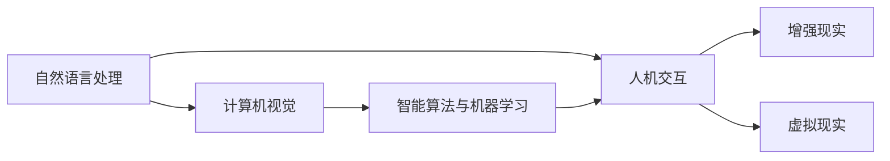

                 

## 1. 背景介绍

### 1.1 问题由来

随着技术的进步和用户需求的增长，人机交互方式经历了从单一的命令行交互、图形界面交互到更加智能、自然、无缝的交互过程。在信息爆炸和互联网普及的背景下，如何提供高效、便捷、适应性强的人机交互方式，成为当前技术研究的焦点。

人机交互的演进由早期的文本界面发展至图形用户界面（GUI），再过渡到如今的声音、图像、自然语言等多元化的交互手段。例如，语音助手通过自然语言理解与用户进行对话；手势识别技术通过动作捕捉实现无接触交互；虚拟现实（VR）和增强现实（AR）技术提供了沉浸式的交互体验。这些技术的进步，为人机交互带来了革命性的变革。

然而，现有的交互方式仍存在诸多挑战。例如，交互体验的不一致性和适应性较差，设备之间互联互通不足，缺乏对真实世界的深度理解和反馈机制等。因此，未来的人机交互研究必须着眼于如何进一步提升交互的自然性、智能性和泛用性，以应对日益复杂多变的使用场景。

### 1.2 问题核心关键点

人机交互技术的研究核心在于：

1. **自然性**：人机交互的自然性，即模拟真实世界的交互过程，让用户无需学习新的操作方式即可高效使用。自然语言理解（NLU）、语音识别（ASR）等技术的应用，是提升自然性的关键。

2. **智能性**：在人机交互中引入智能算法和机器学习，提升交互系统的理解和决策能力，使其能自适应复杂多变的使用环境。例如，通过上下文感知、用户行为预测等技术提升系统智能性。

3. **泛用性**：使交互系统在不同场景、不同设备和不同用户间实现通用性，满足不同用户的需求和使用习惯。跨平台、多设备协同等技术的应用，是提升泛用性的关键。

4. **适配性**：使交互系统能根据用户的个性化需求，进行动态调整和优化，提供个性化的服务。用户行为分析、个性化推荐等技术的应用，是提升适配性的关键。

5. **安全性**：在交互过程中保障用户数据和交互信息的安全，防止隐私泄露和恶意攻击。数据加密、隐私保护等技术的应用，是提升安全性的关键。

6. **效率性**：在保证交互质量的前提下，尽可能提升系统的响应速度和处理能力。分布式计算、并行处理等技术的应用，是提升效率性的关键。

### 1.3 问题研究意义

人机交互技术的不断进步，将深刻影响人类的生产生活方式。通过提升交互的自然性、智能性、泛用性和安全性，未来的人机交互将为社会的各个领域带来变革性的影响：

1. **智能家居**：交互系统能够理解和处理用户的指令，实现设备间的无缝互联和智能控制，提供更加便捷、个性化的家居环境。
2. **健康医疗**：通过交互技术，实现远程诊疗、健康监测、个性化健康管理等应用，提升医疗服务的可及性和效率。
3. **教育培训**：交互系统能够适应学生的学习习惯，提供个性化的学习资源和指导，提升教育效果。
4. **企业办公**：交互系统能够理解员工的指令和需求，实现无纸化办公、协作效率提升等，优化企业运营。
5. **休闲娱乐**：交互系统能够提供沉浸式体验，增强互动性和趣味性，丰富人们的休闲生活。
6. **城市治理**：交互系统能够获取市民的需求和反馈，提升城市管理水平和服务质量，构建智慧城市。

总之，人机交互技术的发展，将使人类进入更加智能、便捷和互联的数字化时代，带来生产力的提升和人类生活的深刻变革。

## 2. 核心概念与联系

### 2.1 核心概念概述

以下是几个核心概念：

- **人机交互（Human-Computer Interaction, HCI）**：用户与计算机系统的信息交流方式，包括文本、图像、声音、手势等多种形式。
- **自然语言处理（Natural Language Processing, NLP）**：使计算机能够理解、处理人类自然语言的技术，如语音识别、自然语言理解、机器翻译等。
- **计算机视觉（Computer Vision, CV）**：使计算机能够通过图像、视频等视觉信号获取和理解信息的技术，如目标检测、图像识别、场景理解等。
- **增强现实（Augmented Reality, AR）**：通过将虚拟信息叠加在真实世界中，提升用户的交互体验。
- **虚拟现实（Virtual Reality, VR）**：创建一个完全由计算机生成的虚拟世界，让用户沉浸其中。
- **智能算法与机器学习（Machine Learning, ML）**：利用算法和机器学习模型，提升人机交互系统的智能化程度。

这些概念之间的逻辑关系可以通过以下Mermaid流程图展示：



该图展示了几大核心概念之间的联系：

1. **人机交互**：作为整个交互过程的入口，提供多种形式的输入和输出方式。
2. **自然语言处理**：作为人机交互的核心部分，使计算机能够理解和处理自然语言。
3. **计算机视觉**：作为人机交互的辅助手段，使计算机能够通过图像和视频理解真实世界的信息。
4. **增强现实和虚拟现实**：作为交互环境的拓展，提供沉浸式的交互体验。
5. **智能算法与机器学习**：作为人机交互的底层技术，提升系统的智能化和自适应能力。

这些概念相互依存、相互促进，共同构成了未来人机交互的发展框架。

## 3. 核心算法原理 & 具体操作步骤

### 3.1 算法原理概述

人机交互的核心算法原理可以概括为：

1. **自然语言理解（NLU）**：通过机器学习模型，将自然语言文本转换为计算机可以理解的形式，如实体识别、情感分析、语义理解等。
2. **语音识别（ASR）**：通过机器学习模型，将语音信号转换为文本形式，如隐马尔可夫模型（HMM）、深度神经网络（DNN）等。
3. **计算机视觉（CV）**：通过机器学习模型，从图像和视频中提取信息，如目标检测、物体识别、场景理解等。
4. **智能决策（MDP）**：通过模型决策过程，提升系统的智能性和自适应能力，如强化学习（RL）、深度强化学习（DRL）等。
5. **用户行为分析（UBA）**：通过数据分析技术，理解用户的行为模式和需求，如序列分析、聚类分析等。

这些算法共同构建了人机交互系统的核心能力，使得系统能够理解用户的意图、提供智能化的反馈和建议、优化用户体验。

### 3.2 算法步骤详解

以下以自然语言处理（NLP）为例，详细讲解基于监督学习的NLP微调步骤：

1. **数据准备**：收集和标注大量的训练数据，分为训练集、验证集和测试集。
2. **模型选择**：选择适合任务的预训练模型，如BERT、GPT等。
3. **任务适配**：根据任务类型，设计合适的输出层和损失函数。
4. **模型微调**：使用训练数据对模型进行微调，更新部分或全部参数。
5. **性能评估**：在验证集上评估模型性能，根据结果调整超参数。
6. **测试部署**：在测试集上评估微调后的模型性能，部署到实际应用中。

### 3.3 算法优缺点

基于监督学习的NLP微调方法具有以下优点：

1. **简单高效**：只需少量标注数据，即可对预训练模型进行微调，提升特定任务性能。
2. **通用适用**：适用于各种NLP任务，如文本分类、命名实体识别、情感分析等。
3. **效果显著**：在小样本条件下，仍能取得较理想的微调效果。

同时，该方法也存在一些缺点：

1. **依赖标注数据**：微调效果依赖于标注数据的质量和数量，标注数据获取成本较高。
2. **过拟合风险**：模型可能过度适应训练数据，导致泛化能力不足。
3. **计算资源消耗大**：大规模微调模型的计算和存储资源消耗较大。

### 3.4 算法应用领域

基于监督学习的NLP微调方法在多个领域有广泛应用，包括：

1. **智能客服**：通过微调模型，实现智能客服系统的对话生成和问题解决。
2. **舆情监测**：通过微调模型，进行文本分类和情感分析，监测社交媒体和新闻网站上的舆情动态。
3. **信息检索**：通过微调模型，实现文本匹配和查询优化，提升信息检索的准确性和效率。
4. **机器翻译**：通过微调模型，进行语言翻译，促进多语言交流。
5. **文本摘要**：通过微调模型，进行文本压缩和摘要生成，简化信息获取过程。

这些应用场景展示了NLP微调方法的广泛适用性和深远影响。

## 4. 数学模型和公式 & 详细讲解 & 举例说明

### 4.1 数学模型构建

以文本分类任务为例，构建数学模型：

1. **输入**：文本数据 $x$，输入向量 $x_v \in \mathbb{R}^d$。
2. **预训练模型**：选择预训练模型 $M_{\theta}$，其中 $\theta$ 为模型参数。
3. **任务适配**：输出层 $y$，分类任务中 $y \in \{1,2,\dots,K\}$，输出层大小 $K$。
4. **损失函数**：交叉熵损失函数 $\ell(y,\hat{y}) = -\frac{1}{N}\sum_{i=1}^N[y_i \log \hat{y}_i + (1-y_i) \log (1-\hat{y}_i)]$，其中 $N$ 为样本数，$\hat{y}_i$ 为模型预测结果。
5. **优化目标**：最小化损失函数 $\mathcal{L}(\theta) = \frac{1}{N}\sum_{i=1}^N\ell(y_i,\hat{y}_i)$。

### 4.2 公式推导过程

推导交叉熵损失函数的梯度：

$$
\frac{\partial \mathcal{L}}{\partial \theta} = -\frac{1}{N}\sum_{i=1}^N \frac{y_i}{\hat{y}_i} - \frac{1}{N}\sum_{i=1}^N \frac{1-y_i}{1-\hat{y}_i}
$$

其中 $\hat{y}_i = \sigma(Wx_v + b)$，$\sigma$ 为激活函数。

### 4.3 案例分析与讲解

以情感分类任务为例，使用BERT模型进行微调：

1. **模型选择**：选择预训练模型BERT。
2. **任务适配**：输出层为分类器，输出大小为情感类别数。
3. **微调过程**：使用少量标注数据对BERT进行微调，更新分类器权重。
4. **性能评估**：在验证集上评估微调后模型性能，优化学习率和正则化参数。
5. **测试部署**：在测试集上评估微调后模型性能，部署到实际应用中。

## 5. 项目实践：代码实例和详细解释说明

### 5.1 开发环境搭建

1. **安装Python**：
```bash
sudo apt-get install python3
```

2. **安装PyTorch**：
```bash
pip install torch torchvision torchaudio
```

3. **安装Transformers库**：
```bash
pip install transformers
```

4. **安装TensorBoard**：
```bash
pip install tensorboard
```

### 5.2 源代码详细实现

以下是以情感分类任务为例的微调代码实现：

```python
import torch
import torch.nn as nn
import torch.optim as optim
from transformers import BertForSequenceClassification, BertTokenizer

class SentimentClassifier(nn.Module):
    def __init__(self, num_labels):
        super(SentimentClassifier, self).__init__()
        self.bert = BertForSequenceClassification.from_pretrained('bert-base-uncased', num_labels=num_labels)

    def forward(self, input_ids, attention_mask):
        return self.bert(input_ids, attention_mask=attention_mask)

# 数据处理函数
def prepare_data(texts, labels):
    tokenizer = BertTokenizer.from_pretrained('bert-base-uncased')
    input_ids, attention_masks, labels = [], [], []
    for text, label in zip(texts, labels):
        encoding = tokenizer(text, return_tensors='pt', padding=True, truncation=True)
        input_ids.append(encoding['input_ids'])
        attention_masks.append(encoding['attention_mask'])
        labels.append(torch.tensor(label, dtype=torch.long))
    return input_ids, attention_masks, labels

# 模型训练函数
def train_model(model, train_data, epochs=5, batch_size=16):
    device = torch.device('cuda' if torch.cuda.is_available() else 'cpu')
    model.to(device)

    optimizer = optim.AdamW(model.parameters(), lr=2e-5)
    total_steps = len(train_data) // batch_size * epochs

    for epoch in range(epochs):
        model.train()
        total_loss = 0
        for input_ids, attention_masks, labels in train_data:
            input_ids = input_ids.to(device)
            attention_masks = attention_masks.to(device)
            labels = labels.to(device)
            optimizer.zero_grad()
            outputs = model(input_ids, attention_mask=attention_masks)
            loss = outputs.loss
            total_loss += loss.item()
            loss.backward()
            optimizer.step()
        print(f'Epoch {epoch+1}, loss: {total_loss / len(train_data)}')

    return model

# 加载数据集
train_texts = ['I love this product!', 'This is not what I expected.', 'I hate this product.']
train_labels = [1, 0, 1]

train_data = prepare_data(train_texts, train_labels)

# 训练模型
model = SentimentClassifier(num_labels=2)
model = train_model(model, train_data)

# 评估模型
test_texts = ['This product is amazing!', 'I do not like this product at all.']
test_labels = [1, 0]

test_data = prepare_data(test_texts, test_labels)

test_loss = model(input_ids=test_data[0], attention_mask=test_data[1]).loss.item()
print(f'Test loss: {test_loss:.3f}')
```

### 5.3 代码解读与分析

1. **数据处理函数**：将文本数据转换为模型所需的输入格式，使用BERTTokenizer进行分词和编码。
2. **模型训练函数**：定义模型、优化器、训练过程。
3. **训练模型**：选择模型、训练数据、训练轮数、批大小，使用AdamW优化器进行梯度下降。
4. **模型评估**：使用测试数据集评估模型性能，输出测试损失。

通过这些代码实现，可以高效地训练和评估情感分类模型，提升人机交互系统的自然性和智能性。

## 6. 实际应用场景

### 6.1 智能客服

智能客服系统通过自然语言理解技术，将用户的自然语言输入转换为计算机可理解的形式，通过对话生成技术，提供个性化、智能化的服务。

以语音助手为例，通过微调模型，语音助手可以理解用户的语音指令，进行语义分析，回答用户的问题，或执行相应的操作。智能客服系统还可以实现跨平台、多设备间的无缝切换，提升用户体验。

### 6.2 健康医疗

健康医疗领域的人机交互涉及医疗咨询、健康监测、疾病诊断等方面。通过自然语言处理技术，医疗系统可以理解患者的症状描述，推荐相应的治疗方案或就医建议。通过计算机视觉技术，医疗系统可以自动识别医学影像，提供诊断支持。通过智能决策技术，医疗系统可以预测患者的健康风险，提供个性化的健康管理建议。

以智能诊疗系统为例，通过微调模型，系统可以理解患者的症状描述，自动推荐相应的检查和治疗方案，提升医疗服务的效率和质量。

### 6.3 教育培训

教育培训领域的人机交互涉及智能教育、在线学习、考试评估等方面。通过自然语言处理技术，教育系统可以理解学生的学习需求，提供个性化的学习资源和指导。通过智能决策技术，教育系统可以预测学生的学习进度，提供针对性的学习建议。

以智能教育系统为例，通过微调模型，系统可以理解学生的学习问题，提供相应的解答和辅导，提升教育效果。

### 6.4 未来应用展望

未来的人机交互将更加智能化、自然化和多样化。以下列举了几个未来发展的方向：

1. **自然语言生成（NLG）**：通过自然语言生成技术，自动生成高质量的自然语言文本，提升人机交互的自然性和智能性。
2. **多模态交互**：结合语音、图像、手势等多种交互方式，提供更为丰富和多样的交互体验。
3. **隐私保护**：在交互过程中，保护用户的隐私和数据安全，防止数据泄露和滥用。
4. **个性化推荐**：通过数据分析和机器学习，提供个性化的交互建议和反馈，提升用户体验。
5. **智能辅助**：通过智能算法和机器学习，提供情境感知、决策支持等辅助功能，增强交互系统的智能性。
6. **跨平台协同**：实现不同设备和平台间的无缝协作，提供统一的交互体验。

## 7. 工具和资源推荐

### 7.1 学习资源推荐

1. **《人机交互设计》（Interaction Design Foundation）**：提供人机交互设计的基础知识和最新趋势。
2. **《人机交互技术》（Human-Computer Interaction）**：介绍人机交互技术的基本原理和应用实例。
3. **《自然语言处理与计算》（Natural Language Processing and Computation）**：深入介绍自然语言处理的基本概念和技术。
4. **《增强现实与虚拟现实》（Augmented Reality and Virtual Reality）**：介绍增强现实和虚拟现实技术的基本原理和应用实例。
5. **《机器学习与数据科学》（Machine Learning and Data Science）**：介绍机器学习的基本原理和技术。

### 7.2 开发工具推荐

1. **PyTorch**：灵活、高效的深度学习框架，支持自然语言处理、计算机视觉等多种任务。
2. **TensorFlow**：强大的深度学习框架，支持分布式计算、模型优化等高级功能。
3. **Transformers**：预训练语言模型的重要工具，支持多种模型的微调和训练。
4. **TensorBoard**：可视化工具，帮助开发者实时监测模型训练状态。
5. **Weights & Biases**：实验跟踪工具，记录和分析模型训练过程，提供丰富的图表和分析报告。

### 7.3 相关论文推荐

1. **《自然语言理解与生成》（Natural Language Understanding and Generation）**：介绍自然语言处理的基本原理和技术。
2. **《深度强化学习与智能决策》（Deep Reinforcement Learning and Intelligent Decision）**：介绍深度强化学习的基本原理和技术。
3. **《多模态交互系统》（Multimodal Interaction Systems）**：介绍多模态人机交互系统的设计和实现。

## 8. 总结：未来发展趋势与挑战

### 8.1 总结

人机交互技术的研究方向和应用领域不断拓展，未来将面临更多机遇和挑战。以下总结了未来发展的关键趋势和挑战：

1. **自然性**：提升人机交互的自然性，使其更加符合用户的语言习惯和行为模式。
2. **智能性**：通过智能算法和机器学习，提升人机交互系统的智能性和自适应能力。
3. **泛用性**：实现不同设备和平台间的无缝协作，提供统一的交互体验。
4. **适配性**：通过数据分析和用户行为分析，提供个性化的交互建议和反馈。
5. **安全性**：在交互过程中，保护用户的隐私和数据安全，防止数据泄露和滥用。
6. **效率性**：提升人机交互系统的响应速度和处理能力，满足用户的高效需求。

### 8.2 未来发展趋势

1. **自然语言生成**：通过自然语言生成技术，自动生成高质量的自然语言文本，提升人机交互的自然性和智能性。
2. **多模态交互**：结合语音、图像、手势等多种交互方式，提供更为丰富和多样的交互体验。
3. **隐私保护**：在交互过程中，保护用户的隐私和数据安全，防止数据泄露和滥用。
4. **个性化推荐**：通过数据分析和机器学习，提供个性化的交互建议和反馈，提升用户体验。
5. **智能辅助**：通过智能算法和机器学习，提供情境感知、决策支持等辅助功能，增强交互系统的智能性。
6. **跨平台协同**：实现不同设备和平台间的无缝协作，提供统一的交互体验。

### 8.3 面临的挑战

1. **数据隐私问题**：在交互过程中，如何保护用户的隐私和数据安全，防止数据泄露和滥用，是一个重要挑战。
2. **技术融合问题**：如何将自然语言处理、计算机视觉、智能决策等多种技术进行有效融合，实现协同工作，是一个技术挑战。
3. **用户体验问题**：如何提升交互的自然性和智能性，提供更好的用户体验，是一个用户体验挑战。
4. **系统效率问题**：如何在保证交互质量的前提下，提升系统的响应速度和处理能力，是一个系统效率挑战。

### 8.4 研究展望

未来的人机交互研究需要解决以下几个关键问题：

1. **隐私保护**：开发更安全、更隐私保护的人机交互系统，保护用户数据的安全。
2. **技术融合**：探索将自然语言处理、计算机视觉、智能决策等多种技术进行有效融合的方法，提升系统性能。
3. **用户体验**：提升人机交互的自然性和智能性，提供更好的用户体验。
4. **系统效率**：提升人机交互系统的响应速度和处理能力，提高系统效率。

总之，人机交互技术的研究和应用将不断拓展，未来将面临更多机遇和挑战。通过多方协作，不断创新，人机交互技术必将在未来的数字化时代中发挥更大作用，提升人类生产力和生活质量。

## 9. 附录：常见问题与解答

**Q1: 人机交互的未来发展方向有哪些？**

A: 人机交互的未来发展方向包括自然语言生成、多模态交互、隐私保护、个性化推荐、智能辅助和跨平台协同等多个方面。通过技术融合和创新，提升人机交互的自然性、智能性和用户体验。

**Q2: 如何提升人机交互的智能性？**

A: 通过引入智能算法和机器学习，提升交互系统的理解和决策能力。例如，使用深度强化学习技术，实现情境感知和决策支持。

**Q3: 如何保护用户隐私？**

A: 在交互过程中，采用数据加密、隐私保护等技术，防止用户数据泄露和滥用。例如，使用差分隐私技术，保护用户隐私的同时，提供有价值的数据分析结果。

**Q4: 如何提升系统效率？**

A: 通过分布式计算、并行处理等技术，提升系统的响应速度和处理能力。例如，使用分布式深度学习框架，实现大规模模型的并行训练。

**Q5: 如何提升系统适配性？**

A: 通过数据分析和用户行为分析，提供个性化的交互建议和反馈。例如，使用用户行为预测模型，推荐用户可能感兴趣的内容。

作者：禅与计算机程序设计艺术 / Zen and the Art of Computer Programming

