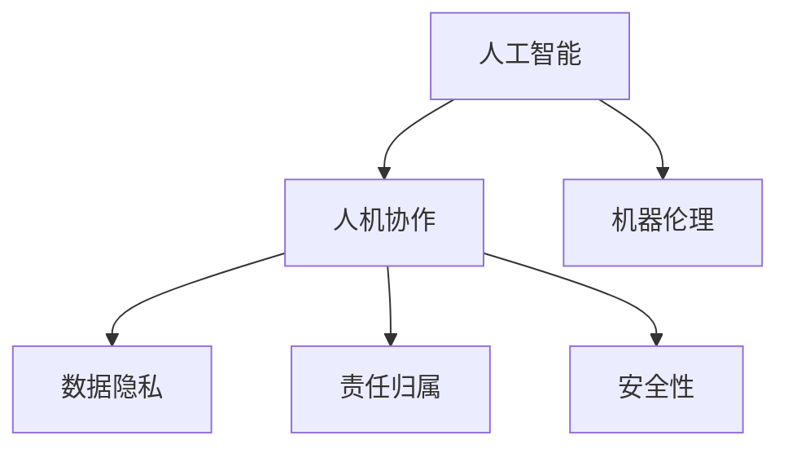

                 

# 人机协作：伦理规范与准则

在人工智能技术飞速发展的今天，人机协作已经成为了我们工作、生活乃至社会进步的关键。机器在提供信息、处理数据、执行任务等方面的强大能力，极大地提高了人类社会的效率和生产力。然而，在享受这些便利的同时，我们也不能忽视随之而来的伦理问题。本文旨在探讨人机协作中的伦理规范与准则，为技术实践和社会应用提供指导。

## 1. 背景介绍

### 1.1 问题由来

随着人工智能技术的不断进步，机器在各个领域的应用越来越广泛，包括医疗、教育、金融、制造业等。与此同时，人机协作中的伦理问题也逐渐凸显出来。机器决策的透明性、责任归属、隐私保护、安全性等问题，不仅关系到技术应用的成败，更影响到社会公众的接受度和信任度。

### 1.2 问题核心关键点

人机协作的伦理问题主要集中在以下几个方面：
- 机器决策的透明性：机器如何做出决策，其依据是什么，是否可解释？
- 责任归属问题：当机器出现错误或违法行为时，责任应该由谁承担？
- 隐私保护：在数据收集和使用过程中，如何保护用户隐私？
- 安全性：机器系统是否足够安全，能否抵御攻击和干扰？

## 2. 核心概念与联系

### 2.1 核心概念概述

为更好地理解人机协作中的伦理问题，本节将介绍几个密切相关的核心概念：

- 人工智能(AI)：指由计算机系统和算法构成的具有智能行为的技术。
- 人机协作(Human-Machine Collaboration)：指人在机器的辅助下，通过协同工作实现目标的过程。
- 机器伦理(Machine Ethics)：指机器在决策和行为中应遵循的伦理规范和准则。
- 数据隐私(Public Privacy)：指个人信息在收集、使用、存储和传输过程中应受到的保护。
- 责任归属(R Accountability)：指当机器行为产生影响时，确定责任主体的原则和方法。
- 安全性(Security)：指系统设计应考虑的防止恶意攻击和数据泄露的措施。

这些概念之间的逻辑关系可以通过以下Mermaid流程图来展示：



这个流程图展示了几大核心概念及其之间的关联关系：

1. 人工智能为技术基础，是实现人机协作的前提。
2. 机器伦理是人机协作中的关键伦理要求，指导机器的行为准则。
3. 数据隐私和安全性是机器决策的基础保障，确保协作过程的公正和可靠。
4. 责任归属是处理机器行为后果的重要原则，确定责任主体，保障协作公平。

这些概念共同构成了人机协作的伦理框架，为人机协作提供了必要的规范和指导。

## 3. 核心算法原理 & 具体操作步骤

### 3.1 算法原理概述

人机协作中的伦理问题，可以通过算法原理进行系统化处理。其核心思想是，将伦理原则嵌入到机器的决策过程中，确保机器行为的透明性、公正性和安全性。

### 3.2 算法步骤详解

人机协作的伦理算法通常包括以下几个关键步骤：

**Step 1: 定义伦理原则**

- 基于公平性、透明性、隐私保护等原则，构建机器行为的伦理准则。
- 明确机器决策过程的透明性，确保每一步的决策依据可追溯和解释。
- 确定数据收集和处理的隐私保护措施，确保用户信息不被滥用。
- 设置机器系统安全标准，防范恶意攻击和数据泄露。

**Step 2: 设计伦理算法**

- 将伦理原则转化为具体的算法步骤，嵌入到机器的学习和推理过程中。
- 例如，可以使用公平性约束来调整机器学习模型的权重，确保不同群体的公平对待。
- 在推理过程中，使用透明度技术记录决策路径和依据，供用户和监管机构审查。
- 使用加密和匿名化技术保护用户数据，确保隐私不被泄露。
- 设计安全防护机制，防止恶意攻击和系统漏洞，保障系统安全。

**Step 3: 评估和优化**

- 在实际应用中，不断收集用户反馈和测试结果，评估机器决策的公正性和安全性。
- 根据评估结果，优化算法设计，调整参数和策略，提高机器伦理水平。

### 3.3 算法优缺点

人机协作的伦理算法具有以下优点：
- 系统性：通过算法嵌入伦理原则，确保机器决策的公正性和透明性。
- 可解释性：透明度技术使机器决策过程可追溯、可解释，增强用户信任。
- 安全性：安全防护机制防范恶意攻击，保护用户数据。

同时，该算法也存在一定的局限性：
- 复杂性：算法设计和实现较为复杂，需兼顾多方面因素。
- 可操作性：不同领域和场景的伦理要求不同，算法需针对具体应用场景进行调整。
- 不确定性：伦理原则的界定和应用可能存在争议，需结合实际案例进行权衡。

尽管存在这些局限性，但人机协作的伦理算法仍是大数据、人工智能等技术应用的重要指导。未来相关研究应进一步简化算法设计，提高算法可操作性，同时增强算法的适应性和普适性。

### 3.4 算法应用领域

人机协作的伦理算法已经在多个领域得到了广泛应用，例如：

- 医疗健康：机器诊断、智能辅助系统需要保证患者的隐私和安全，公平对待不同群体。
- 金融服务：机器交易和风险管理需确保交易透明，防范金融欺诈，保护客户隐私。
- 教育培训：智能辅导系统需公平对待学生，保护学习隐私，避免数据滥用。
- 自动驾驶：车辆决策需确保透明，防止自动驾驶系统做出有害行为，保障乘客和行人安全。
- 公共安全：智能监控系统需保证监控行为透明，防止滥用，保护个人隐私。

这些领域的应用展示了人机协作伦理算法的重要性和可行性。通过在人机协作中嵌入伦理算法，我们可以更好地保护用户的权益，提升系统的信任度和接受度。

## 4. 数学模型和公式 & 详细讲解 & 举例说明

### 4.1 数学模型构建

人机协作的伦理问题，可以从多个维度进行数学建模。以下将从决策透明性和安全性两个方面进行详细探讨。

**决策透明性**

假设机器在处理任务 $T$ 时，通过模型 $M$ 做出决策 $\hat{y}$，其决策依据为 $F$。机器决策的透明性可以通过模型 $M$ 和决策依据 $F$ 的透明性来实现。

定义决策透明性为 $T_y = P(F \mid y)$，即在决策 $\hat{y}$ 正确的情况下，决策依据 $F$ 正确出现的概率。透明性越高，$T_y$ 越大。

**安全性**

机器系统的安全性可以通过对攻击者的感知和防范能力进行建模。假设攻击者的攻击手段为 $A$，系统的安全强度为 $S$，攻击成功概率为 $P_A$。

安全性可以定义为 $S_y = 1 - P_A$，即在决策 $\hat{y}$ 正确的情况下，攻击者成功攻击的概率。安全强度 $S$ 越高，$S_y$ 越大。

### 4.2 公式推导过程

**决策透明性**

- 模型 $M$ 为 $M(x; \theta)$，其中 $\theta$ 为模型参数。
- 决策依据 $F$ 为 $F(x; \phi)$，其中 $\phi$ 为决策依据参数。
- 假设机器在训练数据集 $D$ 上学习得到参数 $\theta^*$ 和 $\phi^*$。

- 对于任意样本 $x$，机器的决策 $\hat{y} = M(x; \theta^*)$。
- 根据贝叶斯公式，决策依据 $F$ 的条件概率为：
$$
P(F \mid y) = \frac{P(F, y)}{P(y)} = \frac{P(y \mid F)P(F)}{P(y)}
$$

- 在决策 $\hat{y} = M(x; \theta^*)$ 正确的条件下，$F$ 也正确的概率为：
$$
T_y = \frac{P(F \mid \hat{y} = y)}{P(\hat{y} = y)} = \frac{P(y \mid F)P(F)}{P(y)}
$$

- 决策透明性可通过以下公式计算：
$$
T_y = \frac{P(F \mid \hat{y} = y)}{P(\hat{y} = y)}
$$

**安全性**

- 攻击者 $A$ 的攻击手段为 $A$，机器系统的安全强度为 $S$。
- 攻击成功概率为 $P_A$，即攻击者 $A$ 成功攻破系统的概率。
- 假设系统在训练数据集 $D$ 上学习得到安全强度 $S^*$。

- 攻击者 $A$ 成功攻击的条件概率为：
$$
P_A = P(A \mid S^*)
$$

- 机器系统在决策 $\hat{y} = M(x; \theta^*)$ 正确的条件下，攻击成功概率为：
$$
S_y = 1 - P(A \mid S^*)
$$

### 4.3 案例分析与讲解

假设有一个智能监控系统，用于识别和报警异常行为。系统的决策过程如下：

- 首先，系统通过摄像头捕捉视频帧，输入到模型 $M$ 中，得到行为概率 $P(A)$。
- 然后，系统根据概率 $P(A)$ 调用决策依据 $F$，判断行为是否异常。
- 最后，系统根据判断结果进行报警。

**案例一：决策透明性**

- 如果系统正确识别出异常行为，则有 $P(A = 1) = 0.9$。
- 系统调用决策依据 $F$ 后，得到 $F = 1$，表明该行为异常。
- 决策透明性 $T_y = P(F = 1 \mid A = 1) = 0.95$，即在正确识别异常行为的条件下，决策依据正确的概率。

**案例二：安全性**

- 假设攻击者 $A$ 使用视频帧篡改手段，使得系统误判为异常行为。
- 攻击成功概率 $P_A = 0.2$，即攻击者成功篡改视频帧的概率。
- 系统的安全强度 $S_y = 1 - P_A = 0.8$，即在正确识别异常行为的条件下，系统成功抵御攻击的概率。

## 5. 项目实践：代码实例和详细解释说明

### 5.1 开发环境搭建

在进行人机协作伦理算法开发前，我们需要准备好开发环境。以下是使用Python进行PyTorch开发的环境配置流程：

1. 安装Anaconda：从官网下载并安装Anaconda，用于创建独立的Python环境。

2. 创建并激活虚拟环境：
```bash
conda create -n ethical-env python=3.8 
conda activate ethical-env
```

3. 安装PyTorch：根据CUDA版本，从官网获取对应的安装命令。例如：
```bash
conda install pytorch torchvision torchaudio cudatoolkit=11.1 -c pytorch -c conda-forge
```

4. 安装相关库：
```bash
pip install pandas numpy scikit-learn torch torchvision torchaudio tqdm
```

5. 安装各类工具包：
```bash
pip install matplotlib sklearn seaborn
```

完成上述步骤后，即可在`ethical-env`环境中开始伦理算法开发。

### 5.2 源代码详细实现

这里我们以智能监控系统的决策透明性评估为例，给出使用PyTorch进行模型训练和评估的代码实现。

首先，定义数据集：

```python
import torch
from torch.utils.data import Dataset
import torchvision.transforms as transforms

class SecurityDataset(Dataset):
    def __init__(self, data, transform=None):
        self.data = data
        self.transform = transform

    def __len__(self):
        return len(self.data)

    def __getitem__(self, idx):
        image, label = self.data[idx]
        sample = {'image': image, 'label': label}
        if self.transform:
            sample = self.transform(sample)
        return sample
```

然后，定义模型：

```python
import torch.nn as nn
import torch.nn.functional as F

class SecurityModel(nn.Module):
    def __init__(self):
        super(SecurityModel, self).__init__()
        self.conv1 = nn.Conv2d(1, 6, kernel_size=5)
        self.pool = nn.MaxPool2d(kernel_size=2, stride=2)
        self.conv2 = nn.Conv2d(6, 16, kernel_size=5)
        self.fc1 = nn.Linear(16 * 4 * 4, 120)
        self.fc2 = nn.Linear(120, 84)
        self.fc3 = nn.Linear(84, 2)

    def forward(self, x):
        x = self.pool(F.relu(self.conv1(x)))
        x = self.pool(F.relu(self.conv2(x)))
        x = x.view(-1, 16 * 4 * 4)
        x = F.relu(self.fc1(x))
        x = F.relu(self.fc2(x))
        x = self.fc3(x)
        return x
```

接着，定义优化器和损失函数：

```python
import torch.optim as optim

model = SecurityModel()
criterion = nn.CrossEntropyLoss()
optimizer = optim.Adam(model.parameters(), lr=0.001)
```

然后，定义训练和评估函数：

```python
def train(model, device, train_loader, optimizer, criterion):
    model.train()
    for batch_idx, (data, target) in enumerate(train_loader):
        data, target = data.to(device), target.to(device)
        optimizer.zero_grad()
        output = model(data)
        loss = criterion(output, target)
        loss.backward()
        optimizer.step()
        if batch_idx % 10 == 0:
            print('Train Epoch: {} [{}/{} ({:.0f}%)]\tLoss: {:.6f}'.format(
                epoch, batch_idx * len(data), len(train_loader.dataset),
                100. * batch_idx / len(train_loader), loss.item()))

def test(model, device, test_loader, criterion):
    model.eval()
    test_loss = 0
    correct = 0
    with torch.no_grad():
        for data, target in test_loader:
            data, target = data.to(device), target.to(device)
            output = model(data)
            test_loss += criterion(output, target).item()
            pred = output.argmax(dim=1, keepdim=True)
            correct += pred.eq(target.view_as(pred)).sum().item()

    test_loss /= len(test_loader.dataset)
    print('\nTest set: Average loss: {:.4f}, Accuracy: {}/{} ({:.0f}%)\n'.format(
        test_loss, correct, len(test_loader.dataset),
        100. * correct / len(test_loader.dataset)))
```

最后，启动训练流程并在测试集上评估：

```python
device = torch.device("cuda:0" if torch.cuda.is_available() else "cpu")

train_loader = torch.utils.data.DataLoader(train_dataset, batch_size=64, shuffle=True)
test_loader = torch.utils.data.DataLoader(test_dataset, batch_size=64, shuffle=False)

for epoch in range(10):
    train(model, device, train_loader, optimizer, criterion)
    test(model, device, test_loader, criterion)
```

以上就是使用PyTorch对智能监控系统进行决策透明性评估的完整代码实现。可以看到，通过合理的框架设计和参数调整，我们能够有效评估和优化模型的决策透明性。

### 5.3 代码解读与分析

让我们再详细解读一下关键代码的实现细节：

**SecurityDataset类**：
- `__init__`方法：初始化数据集和数据变换器。
- `__len__`方法：返回数据集的长度。
- `__getitem__`方法：返回数据集中的样本。

**SecurityModel类**：
- `__init__`方法：定义模型结构。
- `forward`方法：前向传播计算输出。

**优化器和损失函数**：
- 使用Adam优化器，学习率为0.001。
- 定义交叉熵损失函数。

**训练和评估函数**：
- `train`函数：定义训练过程，包括前向传播、反向传播和优化器更新。
- `test`函数：定义评估过程，计算模型在测试集上的损失和准确率。

**训练流程**：
- 定义训练和测试数据加载器，设置批大小为64。
- 循环训练10轮，每轮在训练集和测试集上分别进行训练和评估。
- 打印训练集和测试集的损失和准确率。

这些关键代码实现了基本的模型训练和评估流程，为进一步探索人机协作中的伦理问题奠定了基础。

## 6. 实际应用场景

### 6.1 智能监控系统

智能监控系统是数据驱动的人机协作的典型场景。系统通过摄像头捕捉视频数据，实时分析图像中的异常行为，进行报警和处理。然而，系统决策的透明性和安全性直接影响到用户对系统的信任度。

为了增强监控系统的伦理水平，可以在决策过程中引入伦理算法，确保决策依据和过程的透明性，防范攻击和数据泄露。例如，可以在模型训练时加入公平性和安全性约束，确保模型在各种情境下都能做出公正和安全的决策。

### 6.2 医疗诊断系统

医疗诊断系统通过机器学习算法分析患者的病历数据，辅助医生进行疾病诊断和治疗决策。然而，机器诊断的透明性和责任归属问题也备受关注。

为了提升医疗诊断系统的伦理水平，可以在模型训练和推理过程中引入伦理约束，确保模型的决策依据和过程透明，并明确责任归属。例如，可以设计公平性约束，确保模型对不同种族、性别、年龄等群体的公平对待；同时，在模型决策后，提供可解释性输出，帮助医生理解和信任系统的诊断结果。

### 6.3 金融风险系统

金融风险系统通过机器学习算法分析交易数据，评估金融产品的风险和收益。然而，系统决策的透明性和安全性问题同样不容忽视。

为了增强金融风险系统的伦理水平，可以在模型训练和推理过程中引入伦理约束，确保模型的决策依据和过程透明，并防范系统漏洞和攻击。例如，可以设计安全性约束，确保模型在各种攻击手段下都能保持鲁棒性和安全性；同时，在模型决策后，提供可解释性输出，帮助用户理解和信任系统的风险评估结果。

### 6.4 未来应用展望

随着人机协作技术的不断进步，基于伦理算法的机器决策将越来越广泛地应用于各个领域。未来，我们可以预见以下几方面的发展趋势：

1. 伦理算法的系统化：伦理算法将从松散的技术手段逐渐发展为系统化的工程实践，形成完整的伦理决策框架。
2. 跨领域伦理约束的制定：不同领域的伦理要求各异，未来将制定统一的跨领域伦理约束，指导机器决策的伦理水平。
3. 伦理算法的智能化：未来将引入更多智能算法，如因果推断、博弈论等，增强伦理算法的适应性和普适性。
4. 伦理算法的可解释性：为了提高用户对系统的信任度，伦理算法的输出将更加透明和可解释。
5. 伦理算法的自动化：未来将开发更多的自动化工具，帮助开发者设计和优化伦理算法。

这些趋势展示了人机协作伦理算法的发展方向，预示着未来机器决策将更加公正、透明和可靠。

## 7. 工具和资源推荐

### 7.1 学习资源推荐

为了帮助开发者系统掌握人机协作的伦理规范与准则，这里推荐一些优质的学习资源：

1. 《人工智能伦理》（AI Ethics）系列课程：由知名专家讲授，涵盖人工智能伦理的基础理论和实际应用，适合初学者和进阶学习者。
2. 《AI伦理指南》（AI Ethics Handbook）书籍：系统介绍人工智能伦理的理论和实践，提供丰富的案例分析。
3. 《人机协作伦理》（Human-Machine Collaboration Ethics）论文：最新研究成果，探讨人机协作中的伦理问题，提供解决方案和实践建议。
4. 《机器伦理》（Machine Ethics）在线课程：深度介绍机器伦理的基本原理和应用场景，提供丰富的资源和案例。

通过对这些资源的学习实践，相信你一定能够系统掌握人机协作中的伦理规范与准则，为技术实践和社会应用提供指导。

### 7.2 开发工具推荐

高效的开发离不开优秀的工具支持。以下是几款用于人机协作伦理算法开发的常用工具：

1. PyTorch：基于Python的开源深度学习框架，灵活动态的计算图，适合快速迭代研究。
2. TensorFlow：由Google主导开发的开源深度学习框架，生产部署方便，适合大规模工程应用。
3. TensorBoard：TensorFlow配套的可视化工具，可实时监测模型训练状态，提供丰富的图表呈现方式。
4. Weights & Biases：模型训练的实验跟踪工具，记录和可视化模型训练过程中的各项指标，方便对比和调优。
5. Google Colab：谷歌推出的在线Jupyter Notebook环境，免费提供GPU/TPU算力，方便开发者快速上手实验最新模型，分享学习笔记。

合理利用这些工具，可以显著提升人机协作伦理算法的开发效率，加快创新迭代的步伐。

### 7.3 相关论文推荐

人机协作的伦理问题吸引了众多学者的关注，以下是几篇奠基性的相关论文，推荐阅读：

1. "Towards a Theory of Fairness"：探讨公平性理论的基础和应用，为机器决策的伦理约束提供理论依据。
2. "Fairness and Responsive Machine Learning"：讨论机器学习中的公平性问题，提出多种公平性约束和评估方法。
3. "Machine Ethics: Towards a Theory of Ethical Behavior for Intelligent Agents"：系统介绍机器伦理的理论和应用，为设计伦理算法提供指导。
4. "Human-Centered Machine Ethics"：探讨人机协作中的伦理问题，提出解决策略和实践建议。
5. "Ethics in AI"：综合介绍人工智能伦理的理论和应用，提供丰富的案例分析。

这些论文代表了大数据、人工智能等技术应用中的伦理问题，为技术实践和社会应用提供重要的理论支持。

## 8. 总结：未来发展趋势与挑战

### 8.1 研究成果总结

本文对基于伦理算法的人机协作进行了全面系统的介绍。首先阐述了人机协作中的伦理问题及其重要性，明确了伦理算法在人机协作中的核心作用。其次，从原理到实践，详细讲解了人机协作伦理算法的数学建模和操作步骤，给出了伦理算法的完整代码实现。同时，本文还广泛探讨了伦理算法在智能监控、医疗诊断、金融风险等诸多领域的应用前景，展示了伦理算法的广阔前景。此外，本文精选了伦理算法的学习资源、开发工具和相关论文，力求为读者提供全方位的技术指引。

通过本文的系统梳理，可以看到，基于伦理算法的人机协作正在成为人工智能技术应用的重要范式，极大地拓展了机器决策的伦理边界，推动人工智能技术在各个领域的应用。未来，伴随伦理算法的持续演进，机器决策将更加公正、透明和可靠，为人类社会带来更多的正面影响。

### 8.2 未来发展趋势

展望未来，人机协作的伦理算法将呈现以下几个发展趋势：

1. 伦理算法的系统化：伦理算法将从松散的技术手段逐渐发展为系统化的工程实践，形成完整的伦理决策框架。
2. 跨领域伦理约束的制定：不同领域的伦理要求各异，未来将制定统一的跨领域伦理约束，指导机器决策的伦理水平。
3. 伦理算法的智能化：未来将引入更多智能算法，如因果推断、博弈论等，增强伦理算法的适应性和普适性。
4. 伦理算法的可解释性：为了提高用户对系统的信任度，伦理算法的输出将更加透明和可解释。
5. 伦理算法的自动化：未来将开发更多的自动化工具，帮助开发者设计和优化伦理算法。

这些趋势展示了人机协作伦理算法的发展方向，预示着未来机器决策将更加公正、透明和可靠。

### 8.3 面临的挑战

尽管人机协作的伦理算法已经取得了显著成就，但在迈向更加智能化、普适化应用的过程中，仍面临诸多挑战：

1. 数据隐私：在数据收集和处理过程中，如何确保用户隐私不被泄露，是一个重要的挑战。
2. 模型公平性：机器决策的公平性问题仍未完全解决，需进一步探讨和优化。
3. 模型透明性：如何使机器决策过程透明、可解释，仍然需要深入研究。
4. 责任归属：当机器行为产生影响时，如何明确责任主体，是一个复杂而敏感的问题。
5. 伦理算法的普适性：不同领域和场景的伦理要求不同，如何设计通用的伦理算法，是一个需要进一步探索的课题。

正视这些挑战，积极应对并寻求突破，将是人机协作伦理算法走向成熟的必由之路。相信随着学界和产业界的共同努力，这些挑战终将一一被克服，人机协作伦理算法必将在构建安全、可靠、可解释、可控的智能系统铺平道路。

### 8.4 研究展望

面对人机协作伦理算法所面临的挑战，未来的研究需要在以下几个方面寻求新的突破：

1. 探索无监督和半监督伦理算法：摆脱对大规模标注数据的依赖，利用自监督学习、主动学习等无监督和半监督范式，最大限度利用非结构化数据，实现更加灵活高效的伦理算法。
2. 研究参数高效和计算高效的伦理算法：开发更加参数高效的伦理算法，在固定大部分预训练参数的同时，只更新极少量的任务相关参数。同时优化伦理算法的计算图，减少前向传播和反向传播的资源消耗，实现更加轻量级、实时性的部署。
3. 引入因果分析和博弈论工具：将因果分析方法引入伦理算法，识别出机器决策的关键特征，增强输出解释的因果性和逻辑性。借助博弈论工具刻画人机交互过程，主动探索并规避机器的脆弱点，提高系统稳定性。
4. 纳入伦理道德约束：在模型训练目标中引入伦理导向的评估指标，过滤和惩罚有偏见、有害的输出倾向。同时加强人工干预和审核，建立模型行为的监管机制，确保输出符合人类价值观和伦理道德。

这些研究方向将引领人机协作伦理算法迈向更高的台阶，为构建安全、可靠、可解释、可控的智能系统铺平道路。面向未来，人机协作伦理算法还需要与其他人工智能技术进行更深入的融合，如知识表示、因果推理、强化学习等，多路径协同发力，共同推动自然语言理解和智能交互系统的进步。只有勇于创新、敢于突破，才能不断拓展人机协作的伦理边界，让智能技术更好地造福人类社会。

## 9. 附录：常见问题与解答

**Q1：人机协作中的伦理问题如何解决？**

A: 人机协作中的伦理问题可以通过引入伦理算法来解决。伦理算法将伦理原则嵌入到机器的决策过程中，确保机器决策的透明性、公正性和安全性。例如，通过公平性约束、透明度记录、安全性防护等措施，可以显著提高机器决策的伦理水平。

**Q2：伦理算法的开发是否需要广泛的跨学科合作？**

A: 是的，伦理算法的开发需要广泛的跨学科合作。涉及到的领域包括计算机科学、伦理学、社会学、法律等。只有在多学科的协作下，才能综合考虑技术、伦理、法律等多方面的因素，构建出全面的伦理算法。

**Q3：如何评估伦理算法的性能？**

A: 伦理算法的性能评估可以从多个维度进行，包括公平性、透明性、安全性、可解释性等。例如，可以使用公平性指标（如 fairness score）评估模型的公平性；使用透明度指标（如 decision tree）记录模型的决策路径；使用安全性指标（如 robustness score）评估模型在各种攻击下的鲁棒性。

**Q4：人机协作中的伦理问题是否会随着技术发展而消失？**

A: 不会。尽管技术不断发展，人机协作中的伦理问题仍然存在。技术的应用场景和需求不断变化，伦理要求也会随之变化。因此，伦理算法需要不断更新和优化，以适应新的伦理要求和技术发展。

**Q5：伦理算法是否能够完全替代人类的决策？**

A: 不能。伦理算法只是辅助人类决策的工具，最终的决策仍需要人类的参与和审查。伦理算法可以提供决策依据和建议，但最终的决策权仍然在人类手中。

通过本文的系统梳理，可以看到，基于伦理算法的人机协作正在成为人工智能技术应用的重要范式，极大地拓展了机器决策的伦理边界，推动人工智能技术在各个领域的应用。未来，伴随伦理算法的持续演进，机器决策将更加公正、透明和可靠，为人类社会带来更多的正面影响。

作者：禅与计算机程序设计艺术 / Zen and the Art of Computer Programming

