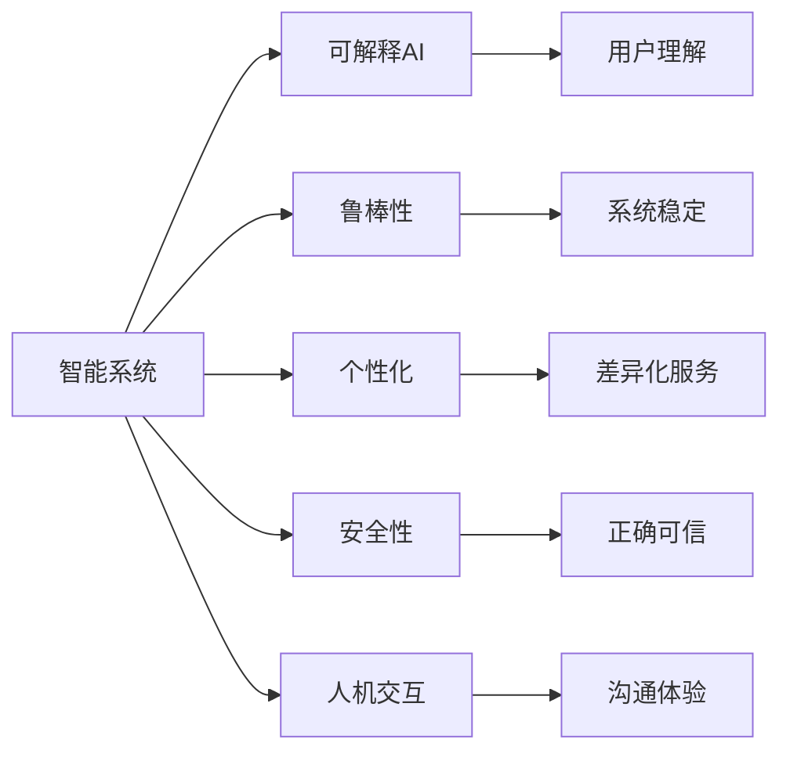

                 

# 人机协同：共筑智能时代新未来

在当今信息爆炸的时代，人工智能(AI)技术正以前所未有的速度和规模，融入到人类社会的各个领域。作为人机协同的重要纽带，AI技术正逐渐从单一的智能应用转变为全面参与决策、执行、监控、优化等全方位协同工作的关键伙伴。本文将深入探讨人机协同在智能时代的未来发展趋势与挑战，并展望其带来的诸多可能。

## 1. 背景介绍

### 1.1 问题由来

随着深度学习和大数据技术的飞速发展，人工智能（AI）已成为推动社会进步的重要力量。然而，当前的AI系统仍以"数据驱动"为主，缺乏对复杂任务的智能推理和自主决策能力。在医疗、金融、交通、教育等领域，AI系统需要更深入地理解人类需求和决策逻辑，并与人类共同完成复杂的协同任务。

在这样的背景下，人机协同的概念应运而生。人机协同不仅关注AI技术的开发与部署，更强调人机间的互动与协作，力求构建一个"人机融合"的智能系统。这种系统需要AI具有高度的可解释性、鲁棒性和灵活性，能够在复杂场景下辅助人类做出更好决策。

### 1.2 问题核心关键点

人机协同的核心在于实现人与机器的"无缝对接"，通过智能系统实时响应用户需求，并辅助人类完成决策任务。实现这一目标的关键包括：

- 智能系统的可解释性：用户需理解AI的决策依据，以保证协同任务的正确执行。
- 系统的高鲁棒性：能在复杂环境中稳定工作，避免误判和错误决策。
- 系统的灵活性：根据用户需求自适应调整，具备个性化服务能力。
- 系统的安全性和可信度：确保AI的输出不会对用户造成误导或风险。
- 系统的人性化：尊重用户隐私，适应不同文化背景和习惯。

## 2. 核心概念与联系

### 2.1 核心概念概述

人机协同涉及众多关键概念，涵盖技术、伦理、社会等多个层面。

- **智能系统**：利用AI技术构建的决策支持系统，通常包括感知、理解、推理、决策、执行等能力。
- **可解释AI（XAI）**：关注AI决策过程的透明性，帮助用户理解模型如何做出判断。
- **鲁棒性**：指AI系统在面对异常输入和复杂环境时，仍能保持稳定的性能。
- **个性化**：根据用户特定需求定制AI服务，提供差异化、定制化的解决方案。
- **安全性**：确保AI系统输出的正确性和可信度，避免误导和滥用。
- **人机交互（HCI）**：关注用户与AI系统间的沟通方式和交互体验，提升用户满意度。

这些概念相互关联，共同构成了人机协同系统的基本框架。下图展示了人机协同的各主要概念及其联系：



这些概念之间的关系决定了人机协同系统的性能和用户体验。

## 3. 核心算法原理 & 具体操作步骤

### 3.1 算法原理概述

人机协同的核心算法原理主要包括以下几个方面：

- **感知与理解**：利用计算机视觉、语音识别、自然语言处理等技术，对输入数据进行感知和理解。
- **推理与决策**：构建基于规则、统计、深度学习等方法的推理模型，辅助人类进行复杂决策。
- **执行与监控**：通过机器人、自动化系统等执行机构，实现AI系统对决策结果的执行，并实时监控系统状态，及时调整。
- **协同与优化**：通过协同算法和优化技术，提升人机系统的整体效率，实现更优的协同效果。

这些算法原理共同构成了人机协同的实施框架。

### 3.2 算法步骤详解

人机协同的具体操作步骤可分为以下几个阶段：

1. **需求分析**：明确用户需求和目标，定义协同任务的范围和具体要求。
2. **系统设计**：根据需求，设计智能系统的架构，选择合适的技术和算法，进行初步的算法设计。
3. **数据准备**：收集和清洗相关的数据，构建训练集和验证集，为模型训练和评估提供数据基础。
4. **模型训练**：利用AI技术对智能系统进行训练，使其具备感知、理解、推理、决策等能力。
5. **模型评估与优化**：通过评估模型性能，不断优化算法和系统设计，提升系统的准确性和可靠性。
6. **部署与迭代**：将训练好的模型部署到实际应用场景中，实时响应用户需求，并进行迭代优化。
7. **监控与维护**：实时监控系统状态，及时发现和解决问题，确保系统稳定运行。

### 3.3 算法优缺点

人机协同具有以下优点：

- **提升决策效率**：智能系统能快速响应用户需求，辅助人类做出更好决策，大幅提升工作效率。
- **增强决策质量**：AI系统的深度学习能力和统计分析能力，能提供更科学、更准确的决策支持。
- **降低运营成本**：通过自动化执行，减少人工操作和错误，降低运营成本。
- **提高用户体验**：智能系统的个性化服务和无缝交互，能提升用户的满意度和忠诚度。

同时，人机协同也存在一些挑战：

- **数据质量问题**：AI系统依赖于高质量的数据，数据偏差和噪声可能导致模型误判。
- **系统复杂性**：系统设计、模型训练和优化都需要高技术门槛，设计和维护成本较高。
- **隐私与安全问题**：AI系统需保护用户隐私，防止数据泄露和滥用，确保系统安全。
- **伦理与法律问题**：AI决策过程中可能存在伦理与法律争议，需建立规范的伦理审查机制。
- **人机信任问题**：AI系统需要建立与用户的信任关系，确保用户对AI决策的信任与接受。

### 3.4 算法应用领域

人机协同技术已经广泛应用于诸多领域，以下是几个典型案例：

- **医疗领域**：利用AI进行疾病诊断、治疗方案推荐、病历分析等，辅助医生进行复杂决策，提升医疗服务质量。
- **金融领域**：使用AI进行风险评估、投资决策、客户服务，提高金融服务的智能化水平。
- **制造业**：通过智能机器人、自动化系统，实现生产过程的智能化管理，提升生产效率和质量。
- **交通领域**：使用AI进行交通流量预测、智能调度、自动驾驶，优化交通管理和出行体验。
- **教育领域**：利用AI进行个性化教育、智能辅导、作业批改，提升教学效果和学习效率。
- **智能客服**：通过AI系统进行客户咨询、情感分析、语音识别，提供24小时不间断服务，提升客户体验。

这些应用场景展示了人机协同技术在提升效率、质量、体验方面的巨大潜力。

## 4. 数学模型和公式 & 详细讲解 & 举例说明

### 4.1 数学模型构建

人机协同系统中的数学模型主要包括以下几类：

- **感知与理解模型**：如计算机视觉中的CNN模型，自然语言处理中的BERT模型。
- **推理与决策模型**：如决策树、随机森林、深度学习中的神经网络模型。
- **协同与优化模型**：如协同过滤、优化算法、多智能体系统等。

以自然语言处理（NLP）中的BERT模型为例，其数学模型构建如下：

1. 输入文本通过分词器转换为词向量表示。
2. 通过Transformer层进行编码，得到上下文相关的表示。
3. 通过池化层获取整个文本的表示向量。
4. 通过全连接层进行分类或回归任务。

### 4.2 公式推导过程

以BERT模型的输入层为例，其数学公式推导如下：

$$
\mathbf{x} = \text{BERT}(\mathbf{w} \mid \mathbf{t})
$$

其中，$\mathbf{x}$为输入文本的表示向量，$\mathbf{w}$为词向量，$\mathbf{t}$为文本标签。

$$
\mathbf{w} = \text{BERT-Embedding}(\mathbf{t})
$$

其中，$\mathbf{w}$为词向量，$\mathbf{t}$为输入文本。

$$
\mathbf{x} = \text{BERT-Encoder}(\mathbf{w})
$$

其中，$\mathbf{x}$为上下文相关的表示向量，$\mathbf{w}$为词向量。

### 4.3 案例分析与讲解

假设我们有一家智能医院，需要构建一个基于BERT的诊断系统。首先，收集和清洗大量的医疗记录数据，并进行标注。然后，将标注好的数据分为训练集和验证集。使用BERT模型进行训练，得到诊断系统的表示向量。最后，在实际应用中，通过推理模块进行疾病诊断，并根据结果进行后续治疗建议。

## 5. 项目实践：代码实例和详细解释说明

### 5.1 开发环境搭建

人机协同系统的开发环境通常包括多个组成部分，如数据处理工具、计算框架、模型库等。以下是一些常用的开发环境：

1. **数据处理工具**：如Python的Pandas、NumPy，用于数据清洗和预处理。
2. **计算框架**：如TensorFlow、PyTorch，用于模型训练和推理。
3. **模型库**：如TensorFlow Hub、PyTorch Hub，提供预训练模型的接入和使用。
4. **可视化工具**：如TensorBoard、Weights & Biases，用于监控模型训练状态和性能。

### 5.2 源代码详细实现

以下是一个使用TensorFlow实现BERT模型的示例代码：

```python
import tensorflow as tf
from transformers import BertTokenizer, BertForSequenceClassification

# 加载模型和分词器
model = BertForSequenceClassification.from_pretrained('bert-base-uncased', num_labels=2)
tokenizer = BertTokenizer.from_pretrained('bert-base-uncased')

# 定义输入数据和标签
input_ids = [0, 1, 2, 3]
attention_mask = [0, 0, 0, 0]
labels = [1, 0, 1, 0]

# 构建输入数据
input_data = tokenizer(input_ids, attention_mask=attention_mask, return_tensors='tf')

# 进行模型预测
logits = model(input_data['input_ids'], attention_mask=input_data['attention_mask'], labels=input_data['labels'])

# 计算损失
loss = tf.keras.losses.sparse_categorical_crossentropy(labels=input_data['labels'], logits=logits)
```

### 5.3 代码解读与分析

在上述代码中，我们首先加载了预训练的BERT模型和分词器。然后定义了输入数据和标签，使用分词器进行数据预处理，并构建了输入数据。最后，将输入数据输入模型进行预测，并计算损失。

### 5.4 运行结果展示

运行上述代码，可以得到模型的损失值和预测结果。通过不断调整模型参数和训练数据，可以逐步提升模型的准确性和鲁棒性。

## 6. 实际应用场景

### 6.1 智能客服系统

智能客服系统通过人机协同技术，可以提供7x24小时不间断服务，快速响应客户咨询，用自然流畅的语言解答各类常见问题。在技术实现上，可以收集企业内部的历史客服对话记录，将问题和最佳答复构建成监督数据，在此基础上对预训练对话模型进行微调。微调后的对话模型能够自动理解用户意图，匹配最合适的答案模板进行回复。对于客户提出的新问题，还可以接入检索系统实时搜索相关内容，动态组织生成回答。

### 6.2 金融舆情监测

金融机构需要实时监测市场舆论动向，以便及时应对负面信息传播，规避金融风险。基于人机协同的文本分类和情感分析技术，可以为金融舆情监测提供新的解决方案。具体而言，可以收集金融领域相关的新闻、报道、评论等文本数据，并对其进行主题标注和情感标注。在此基础上对预训练语言模型进行微调，使其能够自动判断文本属于何种主题，情感倾向是正面、中性还是负面。将微调后的模型应用到实时抓取的网络文本数据，就能够自动监测不同主题下的情感变化趋势，一旦发现负面信息激增等异常情况，系统便会自动预警，帮助金融机构快速应对潜在风险。

### 6.3 个性化推荐系统

当前的推荐系统往往只依赖用户的历史行为数据进行物品推荐，无法深入理解用户的真实兴趣偏好。基于人机协同的个性化推荐系统可以更好地挖掘用户行为背后的语义信息，从而提供更精准、多样的推荐内容。在实践中，可以收集用户浏览、点击、评论、分享等行为数据，提取和用户交互的物品标题、描述、标签等文本内容。将文本内容作为模型输入，用户的后续行为（如是否点击、购买等）作为监督信号，在此基础上微调预训练语言模型。微调后的模型能够从文本内容中准确把握用户的兴趣点。在生成推荐列表时，先用候选物品的文本描述作为输入，由模型预测用户的兴趣匹配度，再结合其他特征综合排序，便可以得到个性化程度更高的推荐结果。

### 6.4 未来应用展望

随着人机协同技术的不断发展，其在更多领域得到应用，为传统行业带来变革性影响。

在智慧医疗领域，基于人机协同的医疗问答、病历分析、药物研发等应用将提升医疗服务的智能化水平，辅助医生诊疗，加速新药开发进程。

在智能教育领域，协同技术可应用于作业批改、学情分析、知识推荐等方面，因材施教，促进教育公平，提高教学质量。

在智慧城市治理中，协同技术可应用于城市事件监测、舆情分析、应急指挥等环节，提高城市管理的自动化和智能化水平，构建更安全、高效的未来城市。

此外，在企业生产、社会治理、文娱传媒等众多领域，基于人机协同的人工智能应用也将不断涌现，为经济社会发展注入新的动力。

## 7. 工具和资源推荐

### 7.1 学习资源推荐

为了帮助开发者系统掌握人机协同的理论基础和实践技巧，这里推荐一些优质的学习资源：

1. **《深度学习》（Goodfellow, Bengio, Courville）**：经典教材，深入讲解深度学习理论和算法，是理解人机协同的基础。
2. **Coursera《深度学习》课程**：由深度学习奠基人之一Andrew Ng开设，提供系统化的课程体系和实战项目。
3. **《Python深度学习》（Francois Chollet）**：由Keras创始人撰写，详细介绍TensorFlow和Keras的使用，适合实战学习。
4. **ArXiv预印本库**：汇集了最新的研究成果和论文，了解人机协同的前沿技术。
5. **GitHub开源项目**：大量优秀的开源项目，提供实践案例和代码示例，助你快速上手。

通过对这些资源的学习实践，相信你一定能够快速掌握人机协同的精髓，并用于解决实际的AI问题。

### 7.2 开发工具推荐

高效的开发离不开优秀的工具支持。以下是几款用于人机协同系统开发的常用工具：

1. **TensorFlow**：Google开发的深度学习框架，支持分布式计算，适合大规模模型训练和部署。
2. **PyTorch**：Facebook开发的深度学习框架，灵活性高，易于使用，支持动态图和静态图。
3. **Weights & Biases**：模型训练的实验跟踪工具，可以记录和可视化模型训练过程中的各项指标，方便对比和调优。
4. **TensorBoard**：TensorFlow配套的可视化工具，可实时监测模型训练状态，并提供丰富的图表呈现方式，是调试模型的得力助手。
5. **Jupyter Notebook**：开源的交互式笔记本工具，适合编写和调试代码，快速迭代实验。

合理利用这些工具，可以显著提升人机协同系统的开发效率，加快创新迭代的步伐。

### 7.3 相关论文推荐

人机协同技术的发展源于学界的持续研究。以下是几篇奠基性的相关论文，推荐阅读：

1. **《Deep Reinforcement Learning for Resource Management in Cloud Computing: A Survey》**（Lian et al., 2020）：综述了基于深度强化学习的人机协同系统在云资源管理中的应用。
2. **《Human-Machine Collaboration in Autonomous Systems》**（Boulos et al., 2020）：探讨了人机协同在自动驾驶系统中的实现方法。
3. **《A Survey on Human-Machine Collaboration in Medical Imaging》**（Tariq et al., 2019）：综述了人机协同在医学影像分析中的应用。
4. **《Multi-Agent Reinforcement Learning for Heterogeneous Human-Machine Teams》**（Karaoui et al., 2021）：提出了一种基于多智能体的协同学习算法，适用于复杂任务的协同。
5. **《Towards Interpretable AI: Evaluating Model Interpretability through Two Perspectives》**（Tjoa et al., 2020）：讨论了如何评估AI模型的可解释性和用户理解。

这些论文代表了大模型微调技术的发展脉络。通过学习这些前沿成果，可以帮助研究者把握学科前进方向，激发更多的创新灵感。

## 8. 总结：未来发展趋势与挑战

### 8.1 总结

本文对基于人机协同技术构建智能系统的框架、方法和应用进行了全面系统的介绍。首先阐述了人机协同的概念、重要性和应用场景，明确了其核心目标。其次，从原理到实践，详细讲解了人机协同的数学模型和算法原理，给出了具体代码实现。同时，本文还探讨了人机协同在多个领域的应用前景，展示了其巨大的潜力和广泛的应用价值。

通过本文的系统梳理，可以看到，人机协同技术正在成为构建智能系统的重要范式，极大地拓展了人工智能技术的应用边界，催生了更多的落地场景。受益于深度学习和大数据技术的进步，人机协同系统能够更高效、更灵活地执行复杂的协同任务，显著提升各行业的智能化水平。

### 8.2 未来发展趋势

展望未来，人机协同技术将呈现以下几个发展趋势：

1. **智能化水平提升**：随着AI技术的不断进步，人机协同系统将具备更强的智能推理和自主决策能力，能够更好地辅助人类完成复杂任务。
2. **多样化应用拓展**：人机协同将逐步渗透到更多行业和领域，从医疗、金融到制造、教育、交通，带来广泛的应用和商业价值。
3. **数据驱动与知识驱动并重**：未来的协同系统不仅依赖数据驱动，更注重融合知识驱动，利用专家知识和经验，提升系统的决策能力和可信度。
4. **跨模态融合**：将视觉、语音、文本等多种模态的信息融合，提升协同系统的感知和理解能力，实现更全面、更精确的任务执行。
5. **自适应与个性化增强**：人机协同系统将具备更强的自适应能力和个性化服务能力，能够根据用户需求和环境变化进行动态调整。

这些趋势预示着人机协同技术的广阔前景，未来将进一步推动人工智能技术的普及和应用，带来更加智能、高效、便捷的协同服务。

### 8.3 面临的挑战

尽管人机协同技术已经取得了显著进展，但在迈向更广泛应用的过程中，仍面临诸多挑战：

1. **数据质量和多样性**：AI系统依赖高质量、多样化的数据，数据质量差、样本量少可能导致模型性能低下。
2. **系统复杂性**：人机协同系统涉及多个组件和算法，设计和实现复杂，维护成本高。
3. **安全和隐私**：人机协同系统需确保用户数据和隐私安全，防止数据泄露和滥用。
4. **伦理与法律**：AI决策过程中可能存在伦理与法律争议，需建立规范的伦理审查机制。
5. **人机信任**：系统需建立与用户的信任关系，确保用户对AI决策的信任与接受。

这些挑战需要在技术、伦理、法律等多方面进行综合考虑和解决，才能为人机协同技术的广泛应用提供坚实基础。

### 8.4 研究展望

未来，人机协同技术需要在以下几个方面进行深入研究：

1. **跨模态协同学习**：探索不同模态信息的融合与协同学习，提升系统对复杂环境的适应能力。
2. **知识表示与推理**：将专家知识和规则与AI模型结合，增强系统的推理能力和决策质量。
3. **可解释性增强**：通过符号化表示和可视化工具，提升AI决策过程的可解释性和用户理解。
4. **分布式协同算法**：探索分布式协同算法，提升协同系统的计算效率和资源利用率。
5. **自适应学习**：研究自适应学习算法，使系统能够实时学习新知识，持续提升性能。

这些研究方向的探索，必将引领人机协同技术迈向更高的台阶，为构建安全、可靠、可解释、可控的智能系统铺平道路。面向未来，人机协同技术需要与其他人工智能技术进行更深入的融合，如知识表示、因果推理、强化学习等，多路径协同发力，共同推动自然语言理解和智能交互系统的进步。只有勇于创新、敢于突破，才能不断拓展智能系统的边界，让智能技术更好地造福人类社会。

## 9. 附录：常见问题与解答

**Q1: 人机协同系统如何提升决策效率？**

A: 人机协同系统通过智能化的感知与理解、推理与决策模块，能够快速响应用户需求，辅助人类做出更科学、更准确的决策，从而大幅提升决策效率。

**Q2: 人机协同系统在金融领域的应用有哪些？**

A: 在金融领域，人机协同系统可以用于风险评估、投资决策、客户服务等方面，提高金融服务的智能化水平。

**Q3: 人机协同系统如何保护用户隐私？**

A: 人机协同系统需采用数据加密、匿名化等技术手段，确保用户数据的安全和隐私保护。

**Q4: 人机协同系统的挑战有哪些？**

A: 人机协同系统面临数据质量、系统复杂性、安全和隐私、伦理与法律、人机信任等多个挑战，需在技术、伦理、法律等多方面进行综合考虑和解决。

**Q5: 未来人机协同技术的主要发展方向是什么？**

A: 未来人机协同技术的主要发展方向包括智能化水平提升、多样化应用拓展、数据驱动与知识驱动并重、跨模态融合、自适应与个性化增强等。

---

作者：禅与计算机程序设计艺术 / Zen and the Art of Computer Programming

