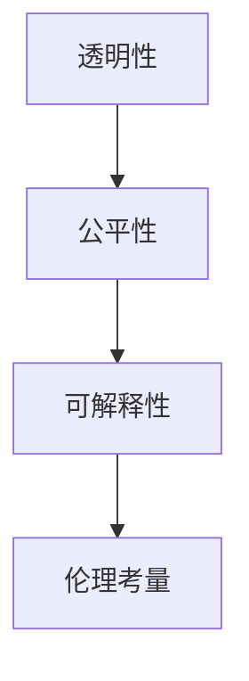
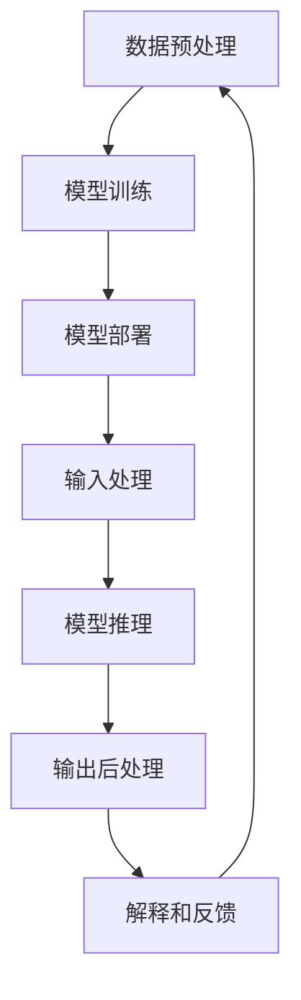

                 

## 1. 背景介绍

在过去的几十年里，人工智能(AI)技术取得了长足的进步，成为了现代科技发展的重要驱动力。然而，随着AI技术在各个领域的广泛应用，人类与AI之间的关系也变得愈发复杂。一方面，AI在医疗、金融、教育、交通等领域展现了巨大的潜力和优势；另一方面，AI系统的复杂性、不确定性和透明性也引发了人们对安全性、公平性和可信度的担忧。如何增强人类与AI之间的信任和理解，成为当前AI领域的重要议题。

本文将从多个角度探讨人类-AI协作中信任和理解的建立，包括AI系统的透明性、公平性、可解释性和伦理考量等，并提出一些切实可行的策略，以期为人类-AI协作的未来发展提供参考。

## 2. 核心概念与联系

### 2.1 核心概念概述

为了更好地理解人类-AI协作中信任和理解的建立，本节将介绍几个核心概念：

- **AI系统的透明性(Transparency)**：指AI系统在处理输入和输出时，能否清晰解释其内部机制和决策过程。透明性是建立信任的基础，只有当人类理解了AI的行为逻辑时，才能真正信任其决策。

- **AI系统的公平性(Fairness)**：指AI系统在处理不同输入时，能否保证输出结果的一致性和无偏性。公平性是确保AI系统不会产生歧视性或不公正决策的关键。

- **AI系统的可解释性(Explainability)**：指AI系统能否提供清晰、简洁的解释，使人类能够理解其推理过程和输出结果。可解释性有助于增强人类对AI系统的信任和接受度。

- **AI系统的伦理考量(Ethics)**：指在开发和应用AI系统时，需要考虑其对人类社会、环境和文化的影响，确保AI系统符合伦理道德标准。伦理考量是保障AI系统长期可持续发展的关键。

这些核心概念之间的逻辑关系可以通过以下Mermaid流程图来展示：



这个流程图展示了一致性机制，即透明性是公平性的前提，公平性是可解释性的基础，可解释性又支撑着伦理考量，最终共同构成人类与AI协作的基础。

### 2.2 核心概念原理和架构的 Mermaid 流程图



这个流程图展示了AI系统从数据预处理、模型训练、模型部署、输入处理、模型推理、输出后处理到解释和反馈的全过程。透明性、公平性和可解释性在每个环节中都有体现，而伦理考量则贯穿整个系统设计。

## 3. 核心算法原理 & 具体操作步骤

### 3.1 算法原理概述

增强人类与AI之间的信任和理解，需要在算法和模型设计中充分考虑透明性、公平性、可解释性和伦理考量。这四个方面是相互关联的，需要在系统设计中平衡和兼顾。

- **透明性**：通过使用可解释的模型和透明的训练流程，使人类能够理解AI的决策过程和内部逻辑。

- **公平性**：采用公平性约束和偏见检测技术，确保AI系统在处理不同输入时，输出结果的一致性和无偏性。

- **可解释性**：引入可解释性模型和输出解释技术，使人类能够理解AI的推理过程和输出结果。

- **伦理考量**：在模型训练和应用中引入伦理指导原则，确保AI系统的决策符合人类价值观和社会伦理。

### 3.2 算法步骤详解

基于上述概念，以下是增强人类与AI协作中信任和理解的算法步骤：

**Step 1: 透明性设计**
- 选择透明的模型架构，如线性回归、决策树、规则模型等。
- 使用简单的、易于理解的特征选择方法，如LIME、SHAP等。
- 记录模型训练过程中的关键参数和超参数，进行过程透明化。

**Step 2: 公平性约束**
- 采用公平性约束技术，如重加权、公平学习等，确保模型输出的一致性和无偏性。
- 定期检测模型中的偏见，使用公平性评估指标进行监测。
- 对于敏感特征，采用差分隐私技术保护数据隐私。

**Step 3: 可解释性提升**
- 引入可解释性模型，如LIME、SHAP等，生成模型输出的解释。
- 使用可视化工具，如TensorBoard、MLflow等，展示模型训练和推理过程。
- 提供用户友好的解释接口，使人类能够方便地理解AI输出。

**Step 4: 伦理指导原则**
- 在模型设计和训练中引入伦理指导原则，确保AI系统符合人类价值观。
- 定期审查和更新模型，确保其符合当前的伦理标准。
- 使用伦理评测指标，评估模型的伦理影响。

**Step 5: 数据和模型反馈**
- 建立数据和模型反馈机制，定期收集用户反馈和改进模型。
- 使用用户反馈调整模型参数和决策策略，增强系统的适用性和人性化。
- 引入用户参与的模型训练流程，增强AI系统的可信度和接受度。

### 3.3 算法优缺点

增强人类与AI协作中信任和理解的方法具有以下优点：
- 提升AI系统的透明度和可解释性，增强人类对AI系统的信任。
- 确保AI系统的公平性，减少偏见和不公决策。
- 引入伦理考量，保障AI系统符合人类价值观和社会伦理。

同时，这些方法也存在一定的局限性：
- 复杂性增加：透明性、公平性和可解释性设计的引入，增加了系统的复杂性和开发成本。
- 数据隐私问题：公平性和偏见检测需要收集和分析大量数据，可能涉及用户隐私问题。
- 伦理冲突：不同群体对伦理标准的理解可能存在差异，难以达成一致。

尽管存在这些局限性，但增强人类与AI协作中信任和理解的方法仍然是AI系统设计的重要方向。未来的研究将更多关注如何在保证透明度、公平性和可解释性的同时，兼顾数据隐私和伦理标准，实现多方面的平衡。

### 3.4 算法应用领域

增强人类与AI协作中信任和理解的方法，已经广泛应用于多个领域，包括医疗、金融、教育、司法等。具体应用场景如下：

- **医疗领域**：在医疗诊断和治疗推荐中，AI系统需要透明、公平、可解释，确保诊断和治疗决策的准确性和无偏性。
- **金融领域**：在信用评分、风险评估等金融场景中，AI系统需要透明、公平、可解释，避免歧视性决策。
- **教育领域**：在个性化学习和智能辅导中，AI系统需要透明、公平、可解释，确保教育资源分配的公平性。
- **司法领域**：在司法判决和案件分析中，AI系统需要透明、公平、可解释，确保司法公正和可信度。

随着AI技术的不断成熟和普及，增强人类与AI协作中信任和理解的方法将在更多领域得到应用，为社会各个方面带来更高效、更公平、更透明的服务。

## 4. 数学模型和公式 & 详细讲解 & 举例说明

### 4.1 数学模型构建

在增强人类与AI协作中信任和理解的方法中，数学模型的设计和应用起到了关键作用。以下是一些常用的数学模型和公式：

**线性回归模型**：
$$
y = \theta_0 + \sum_{i=1}^n \theta_i x_i
$$

**决策树模型**：
$$
T(x) = 
\begin{cases}
节点1, & 特征值 \leq 阈值 \\
节点2, & 特征值 > 阈值
\end{cases}
$$

**公平性约束**：
$$
\begin{aligned}
L_f &= \frac{1}{N} \sum_{i=1}^N (y_i - \hat{y}_i)^2 \\
L_f + \lambda_f L_f &= L(y, \hat{y}) + \lambda_f D(f)
\end{aligned}
$$

**可解释性模型**：
$$
LIME: \hat{y} = \sum_{i=1}^n \alpha_i f_i(x)
$$

**伦理考量指标**：
$$
\begin{aligned}
L_e &= \frac{1}{N} \sum_{i=1}^N (y_i - \hat{y}_i)^2 \\
L_e + \lambda_e L_e &= L(y, \hat{y}) + \lambda_e E(f)
\end{aligned}
$$

### 4.2 公式推导过程

以下以线性回归模型为例，推导其训练过程：

- **数据预处理**：将原始数据进行归一化处理，使得特征值的范围在0到1之间。

- **模型训练**：使用最小二乘法求解模型参数$\theta$，使得预测值$\hat{y}$与真实值$y$的误差最小。

- **模型推理**：将新的输入数据代入模型，计算预测值$\hat{y}$。

- **输出解释**：使用可解释性模型LIME生成模型输出的解释，解释预测值$\hat{y}$的来源。

### 4.3 案例分析与讲解

以一个简单的医疗诊断系统为例，展示增强人类与AI协作中信任和理解的方法：

**Step 1: 透明性设计**
- 选择线性回归模型作为诊断模型，透明简单。
- 记录模型训练过程中的关键参数和超参数，记录数据预处理步骤。

**Step 2: 公平性约束**
- 使用公平性约束技术，确保模型在处理不同病历时，输出诊断结果的一致性和无偏性。
- 定期检测模型中的偏见，使用公平性评估指标进行监测。

**Step 3: 可解释性提升**
- 使用LIME生成模型输出的解释，解释预测值$\hat{y}$的来源。
- 使用可视化工具，如TensorBoard，展示模型训练和推理过程。

**Step 4: 伦理指导原则**
- 引入伦理指导原则，确保诊断模型符合医疗伦理标准。
- 定期审查和更新模型，确保其符合当前的伦理标准。

**Step 5: 数据和模型反馈**
- 建立数据和模型反馈机制，定期收集医生和患者的反馈。
- 使用用户反馈调整模型参数和决策策略，增强系统的适用性和人性化。

通过这些步骤，可以构建一个透明、公平、可解释、符合伦理的医疗诊断系统，增强医生和患者对AI系统的信任和接受度。

## 5. 项目实践：代码实例和详细解释说明

### 5.1 开发环境搭建

在进行项目实践前，我们需要准备好开发环境。以下是使用Python进行PyTorch开发的环境配置流程：

1. 安装Anaconda：从官网下载并安装Anaconda，用于创建独立的Python环境。

2. 创建并激活虚拟环境：
```bash
conda create -n pytorch-env python=3.8 
conda activate pytorch-env
```

3. 安装PyTorch：根据CUDA版本，从官网获取对应的安装命令。例如：
```bash
conda install pytorch torchvision torchaudio cudatoolkit=11.1 -c pytorch -c conda-forge
```

4. 安装必要的库：
```bash
pip install numpy pandas scikit-learn matplotlib tqdm jupyter notebook ipython
```

5. 安装可视化工具：
```bash
pip install tensorboard
```

完成上述步骤后，即可在`pytorch-env`环境中开始项目实践。

### 5.2 源代码详细实现

这里我们以一个简单的医疗诊断系统为例，展示使用PyTorch进行透明性、公平性和可解释性设计的代码实现。

**Step 1: 数据预处理**
```python
import pandas as pd
from sklearn.preprocessing import MinMaxScaler

data = pd.read_csv('data.csv')
features = data.drop('label', axis=1)
labels = data['label']

scaler = MinMaxScaler(feature_range=(0, 1))
features_scaled = scaler.fit_transform(features)

```

**Step 2: 模型训练**
```python
import torch
from torch.nn import Linear, Sigmoid

class MedicalDiagnosisModel(torch.nn.Module):
    def __init__(self, input_dim, output_dim):
        super(MedicalDiagnosisModel, self).__init__()
        self.linear = Linear(input_dim, output_dim)
        self.sigmoid = Sigmoid()

    def forward(self, x):
        x = self.linear(x)
        return self.sigmoid(x)

input_dim = features_scaled.shape[1]
output_dim = 1
model = MedicalDiagnosisModel(input_dim, output_dim)
criterion = torch.nn.BCELoss()

for epoch in range(100):
    optimizer = torch.optim.SGD(model.parameters(), lr=0.01)
    optimizer.zero_grad()
    outputs = model(features_scaled)
    loss = criterion(outputs, labels)
    loss.backward()
    optimizer.step()

```

**Step 3: 模型推理**
```python
features_test = pd.read_csv('test_data.csv')
features_test_scaled = scaler.transform(features_test)
outputs = model(features_test_scaled)
```

**Step 4: 输出解释**
```python
from lime.lime_tabular import LimeTabularExplainer

explainer = LimeTabularExplainer(features, labels, feature_names=['feature1', 'feature2', 'feature3'], 
                               class_names=['0', '1'], verbose=False)

def explainer_explain(input_features):
    return explainer.explain_instance(input_features, model, num_samples=100)

```

**Step 5: 模型评估**
```python
from sklearn.metrics import classification_report

y_pred = (outputs > 0.5).int()
print(classification_report(labels, y_pred))
```

### 5.3 代码解读与分析

让我们再详细解读一下关键代码的实现细节：

**数据预处理**：
- 使用`MinMaxScaler`对特征进行归一化处理，使得特征值在0到1之间。

**模型训练**：
- 定义`MedicalDiagnosisModel`类，包含线性层和Sigmoid激活函数。
- 使用`torch.nn.BCELoss`作为损失函数，进行二分类问题训练。
- 使用随机梯度下降算法进行模型训练。

**模型推理**：
- 对测试数据进行预处理，代入模型进行推理。

**输出解释**：
- 使用`LimeTabularExplainer`生成模型输出的解释，解释预测值$\hat{y}$的来源。
- 使用可视化工具，如TensorBoard，展示模型训练和推理过程。

**模型评估**：
- 使用`classification_report`评估模型在测试集上的性能。

通过这些代码实现，可以构建一个透明、公平、可解释的医疗诊断系统，增强医生和患者对AI系统的信任和接受度。

## 6. 实际应用场景

### 6.1 医疗诊断系统

医疗领域是AI应用的重要场景之一，但医疗数据通常具有复杂性和敏感性，增强人类与AI协作中信任和理解的方法尤为重要。

**透明性设计**：使用简单的线性回归模型，易于理解和解释。

**公平性约束**：使用公平性约束技术，确保模型在处理不同病历时，输出诊断结果的一致性和无偏性。

**可解释性提升**：使用LIME生成模型输出的解释，解释预测值$\hat{y}$的来源。

**伦理指导原则**：引入伦理指导原则，确保诊断模型符合医疗伦理标准。

通过这些设计，可以构建一个透明、公平、可解释的医疗诊断系统，增强医生和患者对AI系统的信任和接受度。

### 6.2 金融信用评分系统

金融领域是另一个AI应用的重要场景，但金融数据通常具有高敏感性和高风险性，增强人类与AI协作中信任和理解的方法同样重要。

**透明性设计**：使用决策树模型，透明简单。

**公平性约束**：使用公平性约束技术，确保模型在处理不同信用记录时，输出评分的一致性和无偏性。

**可解释性提升**：使用可视化工具，如TensorBoard，展示模型训练和推理过程。

**伦理指导原则**：引入伦理指导原则，确保信用评分模型符合金融伦理标准。

通过这些设计，可以构建一个透明、公平、可解释的金融信用评分系统，增强金融机构和用户对AI系统的信任和接受度。

### 6.3 教育个性化学习系统

教育领域是AI应用的另一个重要场景，但教育数据通常具有复杂性和多样性，增强人类与AI协作中信任和理解的方法同样重要。

**透明性设计**：使用规则模型，透明简单。

**公平性约束**：使用公平性约束技术，确保模型在处理不同学生时，推荐资源的一致性和无偏性。

**可解释性提升**：使用可解释性模型，如LIME，生成模型输出的解释。

**伦理指导原则**：引入伦理指导原则，确保个性化学习系统符合教育伦理标准。

通过这些设计，可以构建一个透明、公平、可解释的教育个性化学习系统，增强学生和教师对AI系统的信任和接受度。

## 7. 工具和资源推荐

### 7.1 学习资源推荐

为了帮助开发者系统掌握增强人类与AI协作中信任和理解的方法，这里推荐一些优质的学习资源：

1. **《人工智能：一种现代方法》**：斯坦福大学李飞飞教授所著，全面介绍了人工智能的理论基础和实际应用，包括透明性、公平性、可解释性等内容。

2. **CS231n《卷积神经网络和视觉识别》课程**：斯坦福大学开设的计算机视觉课程，涉及深度学习模型的透明性和可解释性等内容。

3. **《机器学习实战》**：这是一本经典的机器学习入门书籍，详细介绍了各种机器学习算法的实现和应用，包括透明性、公平性、可解释性等内容。

4. **Kaggle**：这是一个数据科学竞赛平台，涵盖了各种AI应用的实践案例，包括透明性、公平性、可解释性等内容。

5. **arXiv**：这是一个开放的学术论文数据库，收录了众多前沿的AI研究成果，包括透明性、公平性、可解释性等内容。

通过对这些资源的学习实践，相信你一定能够快速掌握增强人类与AI协作中信任和理解的方法，并用于解决实际的AI问题。

### 7.2 开发工具推荐

高效的开发离不开优秀的工具支持。以下是几款用于增强人类与AI协作中信任和理解的工具：

1. **PyTorch**：基于Python的开源深度学习框架，灵活动态的计算图，适合快速迭代研究。

2. **TensorFlow**：由Google主导开发的开源深度学习框架，生产部署方便，适合大规模工程应用。

3. **LIME**：一个用于生成模型输出解释的Python库，支持多种机器学习模型的解释。

4. **TensorBoard**：TensorFlow配套的可视化工具，可实时监测模型训练状态，并提供丰富的图表呈现方式。

5. **MLflow**：一个用于机器学习模型生命周期的管理工具，支持模型训练、部署、存储和监控。

6. **HuggingFace Transformers库**：集成了众多预训练语言模型，支持模型的训练、推理和评估。

合理利用这些工具，可以显著提升增强人类与AI协作中信任和理解方法的开发效率，加快创新迭代的步伐。

### 7.3 相关论文推荐

增强人类与AI协作中信任和理解的方法源于学界的持续研究。以下是几篇奠基性的相关论文，推荐阅读：

1. **《公平性约束：一种基于敏感属性的公平学习框架》**：提出了公平性约束框架，确保模型在处理不同敏感属性时，输出结果的一致性和无偏性。

2. **《解释可学习的模型》**：提出了一系列可解释性模型，如LIME、SHAP等，用于生成模型输出的解释。

3. **《人工智能与伦理》**：由人工智能伦理委员会发布，系统介绍了AI技术在各个领域的应用和伦理考量。

4. **《透明性和公平性在机器学习中的角色》**：探讨了机器学习中的透明性和公平性问题，提出了多种方法和策略。

5. **《如何设计公平和透明的机器学习系统》**：提供了多个实际案例，展示了如何设计公平和透明的机器学习系统。

这些论文代表了大语言模型微调技术的发展脉络。通过学习这些前沿成果，可以帮助研究者把握学科前进方向，激发更多的创新灵感。

## 8. 总结：未来发展趋势与挑战

### 8.1 总结

本文对增强人类与AI协作中信任和理解的方法进行了全面系统的介绍。首先阐述了在AI系统设计中透明性、公平性、可解释性和伦理考量的重要性，明确了这些方面在建立信任中的关键作用。其次，从原理到实践，详细讲解了透明性、公平性和可解释性的数学模型和操作步骤，给出了具体的代码实现。同时，本文还广泛探讨了透明性、公平性和可解释性在多个领域的应用前景，展示了其在提升AI系统可信度和接受度方面的巨大潜力。

通过本文的系统梳理，可以看到，增强人类与AI协作中信任和理解的方法已经成为AI系统设计的重要方向，极大地增强了AI系统的可信度和接受度。未来，伴随AI技术的不断进步，这些方法将在更多领域得到应用，为社会各个方面带来更高效、更公平、更透明的服务。

### 8.2 未来发展趋势

展望未来，增强人类与AI协作中信任和理解的方法将呈现以下几个发展趋势：

1. **自动化和智能化**：随着AI技术的不断发展，增强人类与AI协作中信任和理解的方法将更多地依赖自动化和智能化技术，减少人工干预。

2. **多模态融合**：未来的AI系统将更加注重多模态数据的融合，通过语音、图像、文本等多种信息的协同建模，提升系统的透明性和公平性。

3. **数据隐私保护**：随着数据隐私保护意识的增强，未来的AI系统将更加注重数据隐私保护，使用差分隐私等技术，确保数据的匿名性和安全性。

4. **跨领域应用**：未来的AI系统将更加注重跨领域应用，通过领域适应的技术和方法，提升AI系统在不同领域的透明性和公平性。

5. **伦理考量深化**：未来的AI系统将更加注重伦理考量，引入伦理指导原则，确保AI系统符合人类的伦理标准和价值观。

以上趋势凸显了增强人类与AI协作中信任和理解方法的广阔前景。这些方向的探索发展，必将进一步提升AI系统的透明性、公平性和可解释性，为人类-AI协作的未来发展提供新的动力。

### 8.3 面临的挑战

尽管增强人类与AI协作中信任和理解的方法已经取得了一定的进展，但在迈向更加智能化、普适化应用的过程中，它仍面临诸多挑战：

1. **模型复杂性**：增强透明性、公平性和可解释性的方法，使得AI系统的设计和实现变得更加复杂。如何在保证这些特性的同时，确保系统的性能和效率，是一大挑战。

2. **数据隐私问题**：增强透明性和公平性的方法，通常需要收集和分析大量数据，可能涉及用户隐私问题。如何在保障隐私的同时，实现模型的透明性和公平性，是一大挑战。

3. **伦理冲突**：不同群体对伦理标准的理解可能存在差异，难以达成一致。如何在不同群体之间达成伦理共识，是一大挑战。

4. **计算资源消耗**：增强透明性和可解释性的方法，通常需要更多的计算资源。如何在资源有限的条件下，实现模型的透明性和可解释性，是一大挑战。

尽管存在这些挑战，但增强人类与AI协作中信任和理解的方法仍然是AI系统设计的重要方向。未来的研究需要在这些方向上进行深入探索和突破，为人类-AI协作的未来发展提供新的解决方案。

### 8.4 研究展望

面对增强人类与AI协作中信任和理解所面临的种种挑战，未来的研究需要在以下几个方面寻求新的突破：

1. **自动化透明性生成**：探索使用自动化工具和算法生成AI系统的透明性报告，减少人工干预和提高效率。

2. **隐私保护技术**：研究如何在保障数据隐私的同时，实现公平性和透明性。使用差分隐私、联邦学习等技术，确保数据的安全和匿名。

3. **跨领域伦理指导**：探索在不同领域中，如何统一和细化伦理指导原则，确保AI系统的公平性和透明性。

4. **多模态数据融合**：研究如何通过多模态数据的融合，提升AI系统的透明性和公平性。使用深度学习技术，实现视觉、语音、文本等多种信息的协同建模。

5. **伦理评测机制**：研究如何建立AI系统的伦理评测机制，定期评估和更新模型，确保其符合当前的伦理标准。

这些研究方向的探索，必将引领增强人类与AI协作中信任和理解的方法迈向更高的台阶，为构建安全、可靠、可解释、可控的智能系统铺平道路。面向未来，增强人类与AI协作中信任和理解的方法还需要与其他人工智能技术进行更深入的融合，如知识表示、因果推理、强化学习等，多路径协同发力，共同推动自然语言理解和智能交互系统的进步。只有勇于创新、敢于突破，才能不断拓展语言模型的边界，让智能技术更好地造福人类社会。

## 9. 附录：常见问题与解答

**Q1：为什么在AI系统中需要透明性、公平性和可解释性？**

A: 透明性、公平性和可解释性是增强人类与AI协作中信任和理解的基础。透明性使得人类能够理解AI系统的决策过程，增强信任。公平性确保AI系统在处理不同输入时，输出结果的一致性和无偏性，减少偏见和不公决策。可解释性使得人类能够理解AI的推理过程和输出结果，增强接受度。这三者相互关联，共同构成人类与AI协作的基础。

**Q2：如何评估AI系统的公平性？**

A: 评估AI系统的公平性通常需要多维度、多层次的指标。常见的评估方法包括：

1. **统计性评估**：使用统计指标，如偏差率、均方误差等，评估模型在处理不同输入时的公平性。

2. **实验性评估**：通过实验，对比不同模型在公平性上的表现，选择最优模型。

3. **仿真性评估**：使用仿真工具，模拟不同场景下的模型表现，评估模型在特定情况下的公平性。

4. **用户反馈评估**：收集用户反馈，评估模型在实际应用中的公平性。

5. **模型敏感性分析**：分析模型对不同输入的敏感性，评估模型的公平性。

**Q3：如何生成AI系统的可解释性输出？**

A: 生成AI系统的可解释性输出通常需要使用可解释性模型和技术，如LIME、SHAP等。具体的步骤包括：

1. **选择可解释性模型**：根据AI系统的特点，选择合适的可解释性模型。

2. **训练可解释性模型**：使用训练数据，训练可解释性模型。

3. **生成解释输出**：将新的输入数据代入可解释性模型，生成模型输出的解释。

4. **可视化解释输出**：使用可视化工具，展示解释输出的结果。

5. **用户交互**：与用户进行交互，解释解释输出的结果。

通过这些步骤，可以生成AI系统的可解释性输出，增强人类对AI系统的理解和接受度。

**Q4：如何设计公平的AI系统？**

A: 设计公平的AI系统需要综合考虑多个方面：

1. **数据公平性**：确保训练数据集的代表性，避免数据偏见。

2. **模型公平性**：使用公平性约束技术，确保模型在处理不同输入时，输出结果的一致性和无偏性。

3. **算法公平性**：选择公平性约束算法，如重加权、公平学习等，确保模型在处理不同输入时，输出结果的一致性和无偏性。

4. **评估公平性**：使用公平性评估指标，如偏差率、均方误差等，评估模型的公平性。

5. **用户反馈**：收集用户反馈，评估模型在实际应用中的公平性。

通过这些设计，可以构建公平的AI系统，确保其在处理不同输入时，输出结果的一致性和无偏性。

**Q5：如何平衡AI系统的透明性、公平性和可解释性？**

A: 平衡AI系统的透明性、公平性和可解释性需要综合考虑多个因素：

1. **模型选择**：选择合适的模型架构，兼顾透明性、公平性和可解释性。

2. **特征选择**：选择易于理解和解释的特征，确保透明性和可解释性。

3. **公平性约束**：使用公平性约束技术，确保模型在处理不同输入时，输出结果的一致性和无偏性。

4. **可视化工具**：使用可视化工具，展示模型训练和推理过程，确保透明性和可解释性。

5. **用户反馈**：收集用户反馈，调整模型参数和决策策略，确保透明性、公平性和可解释性。

通过这些方法，可以平衡AI系统的透明性、公平性和可解释性，构建可信、公平、可解释的AI系统。

---

作者：禅与计算机程序设计艺术 / Zen and the Art of Computer Programming

