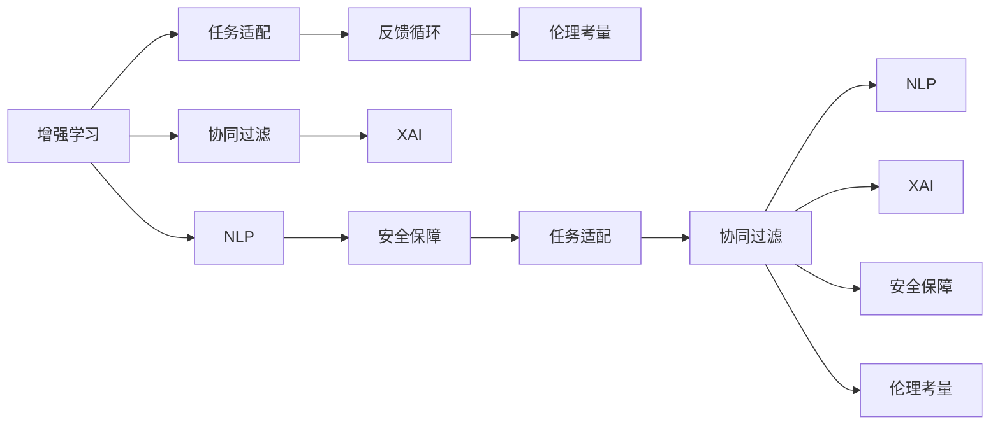

                 

# 人类-AI协作：增强人类与AI之间的合作

在人工智能(AI)的快速发展中，人类与AI的关系成为了探讨的热点。人类如何与AI协作，提升工作效能，优化决策过程，乃至共同创造新的价值，成为业界关注的核心议题。本文将从背景介绍、核心概念、算法原理、数学模型、项目实践、应用场景、工具资源、发展趋势与挑战等方面，深入探讨人类与AI协作的可能性与路径。

## 1. 背景介绍

### 1.1 问题由来
近年来，AI技术迅猛发展，各行各业纷纷引入AI，以提升效率和创新能力。然而，AI并非万能，它在处理复杂情感、提供创意、做出道德判断等方面仍存在局限。人类与AI的协作，正是通过结合AI的强大计算能力和人类的经验智慧，实现优势互补，共同应对挑战，创造价值。

### 1.2 问题核心关键点
AI与人类协作的核心在于如何实现相互理解和高效配合。这一过程涉及以下几个关键点：
1. **任务适配**：根据具体任务特点，合理分配AI和人类的职责。
2. **沟通机制**：设计有效的沟通方式，使AI和人类能够顺畅交流。
3. **反馈循环**：建立持续的反馈机制，让AI不断学习和改进。
4. **伦理考量**：在AI应用中引入伦理原则，确保人类控制权和AI的道德行为。
5. **安全保障**：确保AI系统的安全可靠，避免潜在风险。

## 2. 核心概念与联系

### 2.1 核心概念概述

在探讨AI与人类协作时，以下几个关键概念显得尤为重要：

- **增强学习(RL)**：通过试错机制，让AI在执行任务过程中学习最优策略，提升执行效率。
- **协同过滤(CF)**：利用用户行为数据，推荐个性化内容，提升用户体验。
- **自然语言处理(NLP)**：使AI具备理解和生成自然语言的能力，实现与人类更自然的交互。
- **解释性AI(Explainable AI, XAI)**：使AI模型的决策过程透明，便于理解和信任。
- **AI伦理**：在AI设计和使用中融入伦理考量，确保AI行为符合人类价值观。

这些概念通过技术手段相互连接，共同支撑AI与人类协作的实现。

### 2.2 核心概念原理和架构的 Mermaid 流程图



该图展示了AI与人类协作的核心概念和它们之间的联系。增强学习通过任务适配，协同过滤通过反馈循环，自然语言处理通过解释性AI，安全保障和伦理考量贯穿其中，共同构成一个完整的协作框架。

## 3. 核心算法原理 & 具体操作步骤

### 3.1 算法原理概述

人类与AI协作的算法原理主要基于增强学习和协同过滤。通过合理设计反馈机制，使AI系统在执行任务过程中，能够不断学习并优化其行为策略。协同过滤则通过用户行为数据的分析，推荐个性化内容，提升用户体验。

### 3.2 算法步骤详解

**增强学习算法步骤**：
1. **环境建模**：定义AI执行任务的环境，包括状态、动作、奖励等。
2. **策略选择**：设计AI的策略函数，如Q-learning、Deep Q-Network等。
3. **经验回放**：将AI在执行任务过程中的经验回传，用于更新策略参数。
4. **迭代优化**：通过不断迭代，使AI策略不断优化，直至收敛。

**协同过滤算法步骤**：
1. **用户行为数据收集**：收集用户对内容的行为数据，如观看时长、评分等。
2. **相似度计算**：计算用户之间的相似度，构建用户行为矩阵。
3. **推荐生成**：基于相似度矩阵，生成推荐结果。
4. **反馈更新**：根据用户的反馈（如点击、评分等）更新推荐模型。

### 3.3 算法优缺点

**增强学习的优点**：
1. 灵活性强：适合处理非结构化任务，适应性强。
2. 自适应性：能够根据环境变化不断优化策略。
3. 可扩展性：可以处理大规模数据集和复杂任务。

**增强学习的缺点**：
1. 收敛速度慢：特别是在高维空间中，优化过程可能较为缓慢。
2. 策略选择困难：需要大量数据进行训练，且策略函数设计复杂。
3. 鲁棒性差：对数据噪声和环境变化敏感。

**协同过滤的优点**：
1. 推荐准确性高：基于用户行为数据，能够生成较为准确的推荐结果。
2. 实时性好：推荐过程可以快速完成，提升用户体验。
3. 扩展性强：可以处理大规模用户和项目。

**协同过滤的缺点**：
1. 冷启动问题：新用户或新项目的推荐效果较差。
2. 稀疏性问题：用户行为数据稀疏，影响推荐质量。
3. 可解释性差：推荐过程较为黑盒，难以解释。

### 3.4 算法应用领域

基于增强学习和协同过滤的AI与人类协作方法，已在多个领域得到应用：

- **智能推荐系统**：电商、视频平台等推荐系统的核心，提升用户满意度。
- **自动化驾驶**：利用增强学习优化行驶策略，提升行车安全性和效率。
- **医疗诊断**：结合增强学习和医学知识，辅助医生进行疾病诊断和治疗方案制定。
- **智能客服**：通过自然语言处理和协同过滤，提升客户服务质量。
- **金融风控**：利用增强学习和协同过滤，进行风险评估和欺诈检测。

## 4. 数学模型和公式 & 详细讲解 & 举例说明

### 4.1 数学模型构建

为了更好地理解增强学习和协同过滤的数学原理，我们将从其核心模型出发，进行详细构建和讲解。

**增强学习的核心模型**：
- **Q-learning模型**：
  $$
  Q(s,a) \leftarrow Q(s,a) + \alpha(r + \gamma \max Q(s',a') - Q(s,a))
  $$
  其中 $s$ 为状态，$a$ 为动作，$r$ 为奖励，$Q(s,a)$ 为状态-动作值函数，$\alpha$ 为学习率，$\gamma$ 为折扣因子。

**协同过滤的核心模型**：
- **矩阵分解**：
  $$
  P = \min_{U,V} \|X - UV\|_F
  $$
  其中 $X$ 为用户行为矩阵，$U$ 和 $V$ 分别为用户和项目的潜在因子矩阵，$\|\cdot\|_F$ 为矩阵的Frobenius范数。

### 4.2 公式推导过程

**Q-learning的推导过程**：
- **状态-动作值函数更新**：
  $$
  Q(s,a) \leftarrow Q(s,a) + \alpha(r + \gamma \max Q(s',a') - Q(s,a))
  $$
  其中 $\alpha$ 为学习率，$\gamma$ 为折扣因子。
- **状态值函数更新**：
  $$
  Q(s) \leftarrow \max_a Q(s,a)
  $$

**协同过滤的推导过程**：
- **矩阵分解的求解**：
  $$
  \min_{U,V} \|X - UV\|_F
  $$
  通过求解该优化问题，可以得到 $U$ 和 $V$，从而得到推荐结果。

### 4.3 案例分析与讲解

**案例1：智能推荐系统**
- **背景**：亚马逊推荐系统的核心技术之一。
- **方法**：利用协同过滤算法，分析用户行为数据，生成个性化推荐。
- **效果**：显著提升用户满意度和销售额。

**案例2：自动化驾驶**
- **背景**：特斯拉Autopilot系统的关键技术。
- **方法**：利用增强学习算法，优化行驶策略。
- **效果**：提升行车安全性和效率。

## 5. 项目实践：代码实例和详细解释说明

### 5.1 开发环境搭建

为了进行AI与人类协作的实践，需要搭建相应的开发环境。以下是一个基本的Python环境搭建步骤：

1. **安装Python**：下载Python安装包并完成安装。
2. **安装NumPy、Pandas、Scikit-learn等库**：
  ```
  pip install numpy pandas scikit-learn
  ```
3. **安装TensorFlow或PyTorch**：
  ```
  pip install tensorflow==2.3
  ```

### 5.2 源代码详细实现

以下是一个使用TensorFlow实现协同过滤的Python代码示例：

```python
import tensorflow as tf
from tensorflow.keras.layers import Input, Embedding, Dot, Dense
from tensorflow.keras.models import Model

# 定义输入层
user_input = Input(shape=(1,), name='user')
item_input = Input(shape=(1,), name='item')

# 定义嵌入层
user_embed = Embedding(10000, 10, name='user_embedding')(user_input)
item_embed = Embedding(10000, 10, name='item_embedding')(item_input)

# 定义协同过滤模型
dot = Dot(axes=1)([user_embed, item_embed])
model = Dense(1, activation='sigmoid')(dot)

# 构建模型
model = Model(inputs=[user_input, item_input], outputs=model)

# 编译模型
model.compile(optimizer='adam', loss='binary_crossentropy', metrics=['accuracy'])

# 训练模型
model.fit([user_data, item_data], labels, epochs=10, batch_size=32)
```

### 5.3 代码解读与分析

**代码解读**：
- **输入层**：定义用户和物品的输入层。
- **嵌入层**：将用户和物品的ID映射到低维向量空间。
- **协同过滤**：通过点积运算，计算用户和物品之间的相似度。
- **输出层**：使用sigmoid激活函数，将相似度映射到0-1之间的概率。

**分析**：
- **模型结构**：该模型结构简洁高效，适合处理用户-物品的推荐问题。
- **损失函数**：使用二元交叉熵损失函数，适合二分类问题。
- **优化器**：使用Adam优化器，适合处理大规模数据集。

### 5.4 运行结果展示

运行上述代码，可以得到用户对物品的推荐概率，从而生成个性化推荐列表。

## 6. 实际应用场景

### 6.1 智能推荐系统

智能推荐系统是AI与人类协作的经典应用之一。通过分析用户行为数据，推荐系统可以生成个性化内容，提升用户体验。

**实际应用**：
- **电商平台**：亚马逊、淘宝等电商平台利用推荐系统，提升用户购买率和满意度。
- **视频平台**：Netflix、YouTube等视频平台通过推荐系统，提供个性化内容，增加用户粘性。

### 6.2 自动化驾驶

自动化驾驶技术结合增强学习和自然语言处理，实现车辆对环境的感知和决策。

**实际应用**：
- **特斯拉Autopilot**：特斯拉的自动驾驶系统，通过增强学习算法优化行驶策略。
- **Waymo**：谷歌旗下的自动驾驶公司，利用增强学习和计算机视觉技术，提升行车安全性。

### 6.3 医疗诊断

AI与医疗领域的结合，可以辅助医生进行疾病诊断和治疗方案制定。

**实际应用**：
- **IBM Watson Health**：通过自然语言处理和增强学习，辅助医生进行病理分析和药物推荐。
- **DeepMind**：利用增强学习算法，开发癌症诊断和治疗方案生成系统。

### 6.4 智能客服

智能客服系统结合自然语言处理和协同过滤，提升客户服务质量。

**实际应用**：
- **阿里巴巴客服**：利用自然语言处理技术，实现智能对话，提升服务效率。
- **微软小冰**：通过协同过滤算法，提供个性化回答，增强用户体验。

### 6.5 金融风控

金融风控系统利用增强学习和协同过滤，进行风险评估和欺诈检测。

**实际应用**：
- **Ally Bank**：通过增强学习算法，进行信用卡欺诈检测。
- **蚂蚁金服**：利用协同过滤算法，预测贷款违约风险。

## 7. 工具和资源推荐

### 7.1 学习资源推荐

为了帮助开发者掌握AI与人类协作的原理和实践，以下推荐一些优质的学习资源：

1. **《深度学习入门》**：李沐著，讲解深度学习的基础和进阶知识，适合初学者。
2. **《TensorFlow实战Google深度学习》**：侯文炯等著，介绍TensorFlow的实践应用。
3. **《强化学习基础》**：Sutton和Barto著，讲解增强学习的基本理论和算法。
4. **《推荐系统实战》**：张阳著，介绍推荐系统的设计和实现。
5. **《自然语言处理综论》**：Corey Sydow等著，讲解自然语言处理的基础和前沿技术。

### 7.2 开发工具推荐

以下推荐几款用于AI与人类协作开发的常用工具：

1. **TensorFlow**：由谷歌开发的深度学习框架，支持大规模分布式训练。
2. **PyTorch**：Facebook开发的深度学习框架，灵活高效，适合研究和应用。
3. **Jupyter Notebook**：支持交互式编程和数据可视化，适合数据分析和模型开发。
4. **AWS SageMaker**：亚马逊提供的云服务平台，支持AI模型的训练、部署和监控。
5. **Kubeflow**：谷歌开源的机器学习平台，支持分布式训练和模型部署。

### 7.3 相关论文推荐

AI与人类协作涉及的算法和理论研究，以下是几篇经典论文推荐：

1. **《Deep Reinforcement Learning for Autonomous Vehicle Control》**：介绍增强学习在自动驾驶中的应用。
2. **《A Neural Collaborative Filtering Approach》**：介绍协同过滤算法的基本原理和实现方法。
3. **《Explainable AI: Importance of Explainable Machine Learning for Medical Diagnosis》**：探讨可解释性AI在医疗诊断中的应用。
4. **《The AI Alignment Summit: Safety, Steering and Alignment》**：讨论AI伦理和安全性的重要问题。
5. **《Deep Collaborative Filtering》**：介绍深度协同过滤算法，提高推荐系统的效果。

## 8. 总结：未来发展趋势与挑战

### 8.1 研究成果总结

本文详细探讨了AI与人类协作的算法原理和实践方法，并列举了多个实际应用案例。AI与人类协作的协同过滤和增强学习，已经在推荐系统、自动驾驶、医疗诊断等领域得到广泛应用，并取得显著成效。

### 8.2 未来发展趋势

未来，AI与人类协作的发展趋势将呈现以下几个方向：

1. **多模态协同**：结合视觉、听觉等多模态数据，提升AI的感知和决策能力。
2. **混合智能**：结合人类专家的经验和AI的计算能力，实现混合智能系统。
3. **跨领域应用**：AI与人类协作将进一步拓展到更多领域，如教育、金融、法律等。
4. **可解释性提升**：提高AI系统的可解释性，增强用户信任和满意度。
5. **安全性和伦理保障**：确保AI系统的安全性，引入伦理考量，避免潜在风险。

### 8.3 面临的挑战

AI与人类协作的发展也面临诸多挑战：

1. **数据隐私和安全**：保护用户隐私，防止数据泄露。
2. **模型鲁棒性**：确保AI系统对异常数据的鲁棒性。
3. **算法透明度**：提高AI决策过程的透明度，便于理解和信任。
4. **人类接受度**：提升人类对AI系统的接受度和信任度。
5. **伦理道德**：在AI设计和使用中引入伦理考量，避免潜在风险。

### 8.4 研究展望

未来的研究需要进一步探索以下方向：

1. **人机交互界面**：设计更加自然和高效的人机交互界面，提升用户体验。
2. **跨领域知识融合**：结合不同领域的知识，提升AI的泛化能力和决策质量。
3. **混合智能系统**：开发混合智能系统，将人类专家的知识和AI的计算能力相结合。
4. **伦理和社会责任**：在AI设计和使用中引入伦理和社会责任，确保其可持续发展。

## 9. 附录：常见问题与解答

**Q1：AI与人类协作是否适用于所有场景？**

A: AI与人类协作的适用场景主要取决于任务的特点和数据的丰富程度。对于数据丰富、任务明确的场景，AI与人类协作能够显著提升效率和效果。但对于需要高情感、高创造力、高道德判断的场景，AI与人类协作仍需辅助人工决策。

**Q2：AI与人类协作是否会取代人类？**

A: AI与人类协作的目标是增强人类的能力，而非取代人类。AI擅长处理大量数据和复杂任务，人类则擅长处理情感、创造性和道德判断。两者相辅相成，共同提升整体性能。

**Q3：AI与人类协作是否会面临技术难题？**

A: AI与人类协作面临诸多技术难题，如数据隐私保护、模型鲁棒性、可解释性等。但这些问题并非无法解决，通过多学科的协作和持续的技术创新，AI与人类协作将不断取得突破。

**Q4：AI与人类协作是否需要伦理和法律保障？**

A: 是的，AI与人类协作需要引入伦理和法律保障，确保其行为符合人类价值观和法律法规。特别是涉及医疗、金融等高风险领域，更需要严格的监管机制。

---

作者：禅与计算机程序设计艺术 / Zen and the Art of Computer Programming

