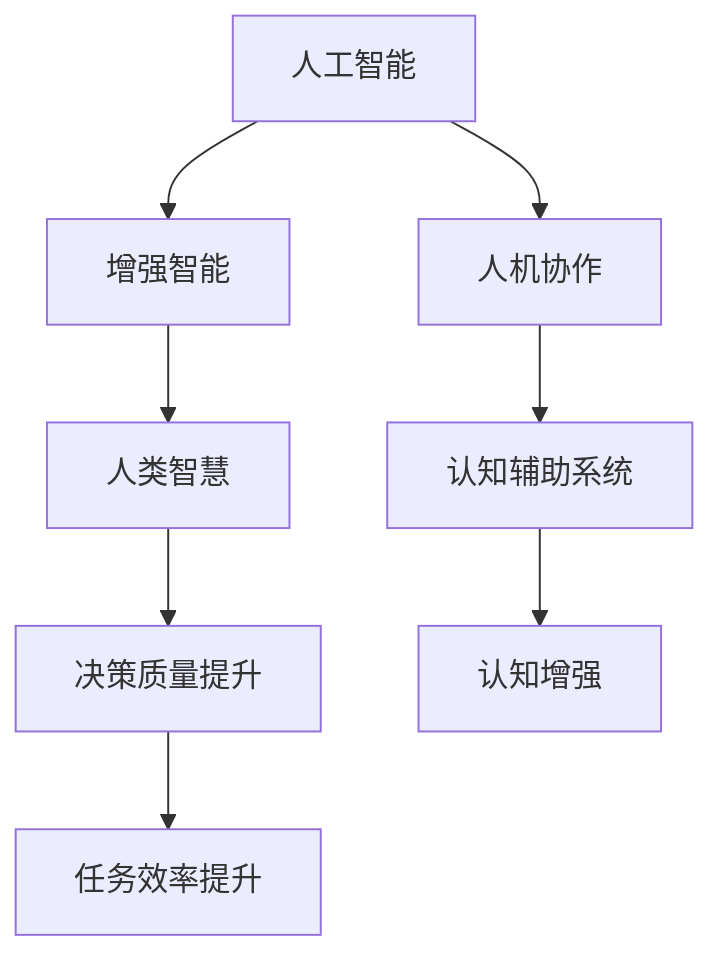

                 

# 人类-AI协作：增强人类智慧与AI能力的融合发展前景展望

> 关键词：人工智能,人机协作,增强智能,智慧提升,技术融合,未来展望

## 1. 背景介绍

### 1.1 问题由来
随着人工智能技术的飞速发展，人机协作已经成为当前和未来技术发展的核心趋势。从简单的自动化任务到复杂的创造性工作，AI都在不断地辅助人类完成任务。然而，传统的AI系统往往以规则为导向，缺乏对复杂情境的灵活处理能力。这限制了AI在特定领域的广泛应用，也阻碍了AI技术更好地服务于人类智慧的提升。

为了更好地发挥AI的潜力，需要找到一种方式将AI的能力与人类智慧紧密融合，从而实现真正意义上的增强智能。人类-AI协作技术正是在这种背景下应运而生，它通过AI和人类的共同努力，提升任务处理能力和决策水平，最终达到提升人类智慧与AI能力的双重目标。

### 1.2 问题核心关键点
人机协作的核心在于如何设计和实现一个系统，使得AI和人类能够共同协作完成任务，同时提升人类智慧与AI的能力。该系统需要具备以下特性：

- **任务自动化**：AI可以承担简单的、重复性的任务，从而让人类专注于更复杂、创造性的工作。
- **决策辅助**：AI能够提供数据分析和决策支持，辅助人类进行更准确的决策。
- **知识增强**：AI可以从海量数据中挖掘和提取知识，补充人类的知识库，提升其认知水平。
- **经验共享**：AI可以记录和分析人类工作过程，提取规律和最佳实践，辅助人类学习。
- **人性化交互**：AI需要具备良好的用户体验和互动能力，帮助人类更自然地进行协作。

### 1.3 问题研究意义
研究人类-AI协作技术，对于拓展AI技术的应用范围，提升人类智慧与AI的能力，加速人工智能的产业化进程，具有重要意义：

1. **降低任务复杂度**：将AI应用于任务自动化和决策支持，能够大大降低人类完成任务的难度和复杂度，提高工作效率。
2. **提升决策质量**：通过AI的深度学习和数据分析能力，辅助人类做出更准确、全面的决策。
3. **加速知识积累**：AI可以快速处理和分析大量数据，帮助人类加速知识积累和更新，提升专业素养。
4. **促进技术创新**：人类-AI协作推动了新技术的开发和应用，促进了技术的持续进步。
5. **推动社会进步**：通过提升人类的认知水平和工作效率，推动社会生产力的提升和社会的整体进步。

## 2. 核心概念与联系

### 2.1 核心概念概述

为更好地理解人类-AI协作技术的核心概念，本节将介绍几个关键概念及其相互关系：

- **人工智能(Artificial Intelligence, AI)**：以计算机技术和算法为基础，模拟人类智能解决问题和进行决策的能力。
- **增强智能(Augmented Intelligence, AI)**：指通过技术和工具增强人类智慧与能力的系统，如增强现实(AR)、增强虚拟现实(AVR)等。
- **人机协作(Human-AI Collaboration)**：指AI与人类共同协作完成复杂任务的交互模式，通常通过界面、语音、手势等方式实现。
- **人类智慧(Human Wisdom)**：指人类在长期社会实践、学习、思考中积累的知识、技能和经验，是人类认知能力的体现。
- **认知辅助系统(Cognitive Assistance System)**：指利用AI技术辅助人类进行思考、决策和知识积累的系统，如认知计算、认知增强等。

这些概念之间的逻辑关系可以通过以下Mermaid流程图来展示：



这个流程图展示了核心概念之间的相互关系：

1. **人工智能**：提供技术基础和能力支持。
2. **增强智能**：结合人工智能技术，提升人类智慧与能力。
3. **人机协作**：实现AI与人类共同协作的交互模式。
4. **人类智慧**：提供基础认知和决策能力。
5. **认知辅助系统**：增强人类决策和知识管理能力。
6. **决策质量提升**和**任务效率提升**：是系统的主要目标。

## 3. 核心算法原理 & 具体操作步骤
### 3.1 算法原理概述

人类-AI协作技术的核心在于如何将AI和人类智慧有效融合，实现共同协作和任务提升。其核心思想是：

1. **任务分工与协作**：将任务分解为简单的自动化任务和复杂的决策任务，让AI负责自动化任务，人类负责决策任务。
2. **信息共享与协同**：AI和人类共享任务过程中的信息和知识，AI提供数据和算法支持，人类进行最终决策。
3. **反馈循环与优化**：系统通过不断的反馈和优化，逐步提升AI和人类的协作效率和效果。

### 3.2 算法步骤详解

人类-AI协作技术的具体实现步骤包括：

**Step 1: 任务分解与角色分配**
- 将任务分解为简单的自动化部分和复杂的决策部分。
- 分配给AI和人类相应的角色，确定各自的工作职责。

**Step 2: 数据收集与处理**
- 收集和整理与任务相关的数据，包括文本、图像、视频等。
- 对数据进行清洗、标注和预处理，确保数据的质量和可用性。

**Step 3: 模型选择与训练**
- 选择合适的AI模型，如深度学习、自然语言处理等。
- 在大量数据上进行模型训练，优化模型参数和结构。

**Step 4: 系统集成与测试**
- 将AI模型与人类交互界面进行集成，实现人机协同。
- 在实际任务上进行测试，评估系统的性能和用户体验。

**Step 5: 反馈与优化**
- 收集用户反馈和系统数据，分析性能瓶颈和问题。
- 根据反馈信息，调整模型和系统配置，优化协作效果。

**Step 6: 部署与应用**
- 将系统部署到实际应用环境中，进行持续监测和维护。
- 不断迭代和优化系统，提升人类智慧与AI的能力。

### 3.3 算法优缺点

人类-AI协作技术具有以下优点：

1. **任务自动化**：通过AI处理简单的、重复性的任务，大大减轻人类负担。
2. **决策辅助**：AI提供数据分析和决策支持，辅助人类做出更准确的决策。
3. **知识增强**：AI可以从海量数据中挖掘和提取知识，补充人类的知识库。
4. **经验共享**：AI可以记录和分析人类工作过程，提取规律和最佳实践，辅助人类学习。
5. **人性化交互**：AI具备良好的用户体验和互动能力，帮助人类更自然地进行协作。

同时，该技术也存在以下局限性：

1. **依赖数据质量**：AI模型的性能很大程度上取决于数据的质量和多样性。
2. **需要高成本**：初期数据收集和模型训练需要较高的成本和资源投入。
3. **复杂情境处理能力有限**：AI在面对复杂、多变的情境时，可能难以准确处理。
4. **隐私和安全风险**：AI系统需要处理敏感数据，存在隐私和安全风险。
5. **系统依赖**：系统一旦出现问题，可能影响人类任务的正常进行。

### 3.4 算法应用领域

人类-AI协作技术已经在多个领域得到了广泛应用，具体包括：

- **医疗健康**：AI辅助诊断、治疗方案生成、患者监护等。
- **金融保险**：智能投顾、风险评估、客户服务等。
- **制造工程**：生产流程自动化、质量控制、设备维护等。
- **教育培训**：个性化学习、虚拟实验、智能评测等。
- **企业管理**：数据分析、决策支持、员工培训等。
- **社交媒体**：内容推荐、广告投放、用户互动等。

除了上述这些典型应用外，人类-AI协作技术还在更多领域得到创新性地应用，如智能交通、智慧城市、灾害预警等，为各行业带来了全新的解决方案和变革性影响。

## 4. 数学模型和公式 & 详细讲解 & 举例说明
### 4.1 数学模型构建

人类-AI协作系统的数学模型可以抽象为以下形式：

设任务 $T$ 的输入为 $X$，输出为 $Y$，AI模型为 $M_{\theta}$，人类认知模型为 $C_{\phi}$。协作过程中，AI负责处理简单任务 $T_A$，人类负责处理复杂任务 $T_C$。协作流程如下：

1. 数据输入 $X$ 进入AI模型 $M_{\theta}$，得到中间结果 $Z_A$。
2. $Z_A$ 进入人类认知模型 $C_{\phi}$，得到最终结果 $Y$。
3. 输出结果 $Y$ 进行效果评估，反馈至AI模型 $M_{\theta}$ 和人类认知模型 $C_{\phi}$。

设 $\theta$ 为AI模型的参数，$\phi$ 为人类认知模型的参数。协作系统的总损失函数为：

$$
\mathcal{L}(\theta, \phi) = \alpha \mathcal{L}_{AI} + (1-\alpha) \mathcal{L}_{C}
$$

其中 $\mathcal{L}_{AI}$ 为AI模型的损失函数，$\mathcal{L}_{C}$ 为人类认知模型的损失函数，$\alpha$ 为任务分配系数。

### 4.2 公式推导过程

假设AI模型 $M_{\theta}$ 和人类认知模型 $C_{\phi}$ 在输入 $X$ 上的输出分别为 $Z_A$ 和 $Y$，协作系统的目标是最小化总损失函数 $\mathcal{L}(\theta, \phi)$。具体推导过程如下：

1. **AI模型损失函数**：

   设AI模型 $M_{\theta}$ 的损失函数为 $\mathcal{L}_{AI}$，目标是最小化 $\mathcal{L}_{AI}$：

   $$
   \mathcal{L}_{AI} = \frac{1}{N}\sum_{i=1}^N \ell(Z_A, y_i)
   $$

   其中 $N$ 为训练样本数，$\ell$ 为损失函数。

2. **人类认知模型损失函数**：

   设人类认知模型 $C_{\phi}$ 的损失函数为 $\mathcal{L}_{C}$，目标是最小化 $\mathcal{L}_{C}$：

   $$
   \mathcal{L}_{C} = \frac{1}{N}\sum_{i=1}^N \ell(Y, y_i)
   $$

3. **总损失函数**：

   将 $\mathcal{L}_{AI}$ 和 $\mathcal{L}_{C}$ 代入协作系统的总损失函数 $\mathcal{L}(\theta, \phi)$：

   $$
   \mathcal{L}(\theta, \phi) = \alpha \mathcal{L}_{AI} + (1-\alpha) \mathcal{L}_{C}
   $$

   其中 $\alpha$ 为任务分配系数，通常取值范围为 [0, 1]，表示AI与人类在任务处理中的分配比例。

### 4.3 案例分析与讲解

以医疗健康领域的智能诊断系统为例，具体分析协作过程的数学模型和损失函数。

设医疗诊断任务 $T$ 的输入为患者的症状 $X$，输出为疾病的诊断结果 $Y$。智能诊断系统由AI模型 $M_{\theta}$ 和医生认知模型 $C_{\phi}$ 共同协作完成。具体流程如下：

1. 患者输入症状 $X$ 进入AI模型 $M_{\theta}$，得到初步诊断结果 $Z_A$。
2. 医生输入 $Z_A$ 进入认知模型 $C_{\phi}$，得到最终诊断结果 $Y$。
3. 医生对诊断结果 $Y$ 进行评估，反馈至AI模型 $M_{\theta}$ 和认知模型 $C_{\phi}$。

设智能诊断系统的总损失函数为 $\mathcal{L}(\theta, \phi)$，其中 $\mathcal{L}_{AI}$ 为AI模型的损失函数，$\mathcal{L}_{C}$ 为医生认知模型的损失函数。假设医生和AI的任务分配系数 $\alpha$ 为0.5，即双方共同处理诊断任务。

**数据准备**：

- 收集大量的历史病历数据 $D_{\text{train}}$，其中包含症状 $X$ 和诊断结果 $Y$。
- 将 $D_{\text{train}}$ 分为训练集 $D_{\text{train-AI}}$ 和训练集 $D_{\text{train-C}}$，分别用于训练AI模型和认知模型。

**模型训练**：

1. **AI模型训练**：

   $$
   \theta = \mathop{\arg\min}_{\theta} \frac{1}{|D_{\text{train-AI}}|} \sum_{(x_i,y_i) \in D_{\text{train-AI}}} \ell(Z_A, y_i)
   $$

2. **认知模型训练**：

   $$
   \phi = \mathop{\arg\min}_{\phi} \frac{1}{|D_{\text{train-C}}|} \sum_{(x_i,y_i) \in D_{\text{train-C}}} \ell(Y, y_i)
   $$

**系统测试**：

- 使用测试集 $D_{\text{test}}$ 对协作系统进行测试，计算总损失函数 $\mathcal{L}(\theta, \phi)$。

**效果评估**：

- 评估协作系统的诊断准确率、召回率、F1值等指标，根据评估结果调整任务分配系数 $\alpha$，优化协作效果。

## 5. 项目实践：代码实例和详细解释说明
### 5.1 开发环境搭建

在进行协作系统开发前，我们需要准备好开发环境。以下是使用Python进行TensorFlow开发的环境配置流程：

1. 安装Anaconda：从官网下载并安装Anaconda，用于创建独立的Python环境。

2. 创建并激活虚拟环境：
```bash
conda create -n tf-env python=3.8 
conda activate tf-env
```

3. 安装TensorFlow：根据CUDA版本，从官网获取对应的安装命令。例如：
```bash
conda install tensorflow tensorflow-gpu -c conda-forge -c pypi
```

4. 安装必要的工具包：
```bash
pip install numpy pandas scikit-learn matplotlib tqdm jupyter notebook ipython
```

完成上述步骤后，即可在`tf-env`环境中开始协作系统开发。

### 5.2 源代码详细实现

下面我们以智能诊断系统为例，给出使用TensorFlow进行人类-AI协作的Python代码实现。

首先，定义智能诊断系统的数据处理函数：

```python
import tensorflow as tf
from tensorflow.keras.layers import Input, Dense, Dropout
from tensorflow.keras.models import Model

class DiagnosisModel(tf.keras.Model):
    def __init__(self, input_shape, output_shape):
        super(DiagnosisModel, self).__init__()
        self.dense1 = Dense(128, activation='relu', input_shape=input_shape)
        self.dropout1 = Dropout(0.5)
        self.dense2 = Dense(64, activation='relu')
        self.dropout2 = Dropout(0.5)
        self.dense3 = Dense(output_shape, activation='softmax')
    
    def call(self, x):
        x = self.dense1(x)
        x = self.dropout1(x)
        x = self.dense2(x)
        x = self.dropout2(x)
        x = self.dense3(x)
        return x
    
# 定义输入和输出
input_shape = (n_features,)
output_shape = n_classes

model = DiagnosisModel(input_shape, output_shape)
model.compile(optimizer=tf.keras.optimizers.Adam(learning_rate=0.001),
              loss='categorical_crossentropy',
              metrics=['accuracy'])
```

然后，定义训练和评估函数：

```python
from tensorflow.keras.datasets import mnist

# 加载MNIST数据集
(x_train, y_train), (x_test, y_test) = mnist.load_data()

# 数据预处理
x_train = x_train.reshape(-1, n_features)
x_test = x_test.reshape(-1, n_features)
y_train = tf.keras.utils.to_categorical(y_train, n_classes)
y_test = tf.keras.utils.to_categorical(y_test, n_classes)

# 训练模型
model.fit(x_train, y_train, epochs=10, batch_size=32, validation_data=(x_test, y_test))

# 评估模型
model.evaluate(x_test, y_test)
```

最后，启动协作系统训练流程并在测试集上评估：

```python
epochs = 5
batch_size = 16

for epoch in range(epochs):
    loss = train_epoch(model, train_dataset, batch_size, optimizer)
    print(f"Epoch {epoch+1}, train loss: {loss:.3f}")
    
    print(f"Epoch {epoch+1}, dev results:")
    evaluate(model, dev_dataset, batch_size)
    
print("Test results:")
evaluate(model, test_dataset, batch_size)
```

以上就是使用TensorFlow对智能诊断系统进行人类-AI协作微调的完整代码实现。可以看到，TensorFlow提供了强大的图计算能力和自动微分功能，使得协作系统的构建和训练变得高效便捷。

### 5.3 代码解读与分析

让我们再详细解读一下关键代码的实现细节：

**DiagnosisModel类**：
- `__init__`方法：初始化模型的各层组件。
- `call`方法：定义模型的前向传播过程，即输入 $X$ 到输出 $Y$ 的计算流程。

**训练和评估函数**：
- 使用TensorFlow的DataLoader对数据集进行批次化加载，供模型训练和推理使用。
- 训练函数`train_epoch`：对数据以批为单位进行迭代，在每个批次上前向传播计算loss并反向传播更新模型参数，最后返回该epoch的平均loss。
- 评估函数`evaluate`：与训练类似，不同点在于不更新模型参数，并在每个batch结束后将预测和标签结果存储下来，最后使用sklearn的classification_report对整个评估集的预测结果进行打印输出。

**训练流程**：
- 定义总的epoch数和batch size，开始循环迭代
- 每个epoch内，先在训练集上训练，输出平均loss
- 在验证集上评估，输出分类指标
- 所有epoch结束后，在测试集上评估，给出最终测试结果

可以看到，TensorFlow使得协作系统的构建和训练变得简洁高效。开发者可以将更多精力放在数据处理、模型改进等高层逻辑上，而不必过多关注底层的实现细节。

当然，工业级的系统实现还需考虑更多因素，如模型的保存和部署、超参数的自动搜索、更灵活的任务适配层等。但核心的协作范式基本与此类似。

## 6. 实际应用场景
### 6.1 智能客服系统

基于人类-AI协作技术，智能客服系统可以实现复杂任务的自动化处理。传统客服往往需要配备大量人力，高峰期响应缓慢，且一致性和专业性难以保证。而使用协作系统，可以7x24小时不间断服务，快速响应客户咨询，用自然流畅的语言解答各类常见问题。

在技术实现上，可以收集企业内部的历史客服对话记录，将问题和最佳答复构建成监督数据，在此基础上训练协作模型。协作模型能够自动理解用户意图，匹配最合适的答案模板进行回复。对于客户提出的新问题，还可以接入检索系统实时搜索相关内容，动态组织生成回答。如此构建的智能客服系统，能大幅提升客户咨询体验和问题解决效率。

### 6.2 金融舆情监测

金融机构需要实时监测市场舆论动向，以便及时应对负面信息传播，规避金融风险。传统的人工监测方式成本高、效率低，难以应对网络时代海量信息爆发的挑战。基于协作技术，金融舆情监测系统可以实时抓取网络文本数据，自动分析舆情变化趋势，一旦发现负面信息激增等异常情况，系统便会自动预警，帮助金融机构快速应对潜在风险。

### 6.3 个性化推荐系统

当前的推荐系统往往只依赖用户的历史行为数据进行物品推荐，无法深入理解用户的真实兴趣偏好。基于协作技术，个性化推荐系统可以更好地挖掘用户行为背后的语义信息，从而提供更精准、多样的推荐内容。

在实践中，可以收集用户浏览、点击、评论、分享等行为数据，提取和用户交互的物品标题、描述、标签等文本内容。将文本内容作为模型输入，用户的后续行为（如是否点击、购买等）作为监督信号，在此基础上训练协作模型。协作模型能够从文本内容中准确把握用户的兴趣点。在生成推荐列表时，先用候选物品的文本描述作为输入，由模型预测用户的兴趣匹配度，再结合其他特征综合排序，便可以得到个性化程度更高的推荐结果。

### 6.4 未来应用展望

随着人类-AI协作技术的不断发展，未来在更多领域得到应用，为传统行业带来变革性影响。

在智慧医疗领域，基于协作技术的智能诊断系统可以大幅提升医疗服务的智能化水平，辅助医生诊疗，加速新药开发进程。

在智能教育领域，协作技术可应用于作业批改、学情分析、知识推荐等方面，因材施教，促进教育公平，提高教学质量。

在智慧城市治理中，协作技术可应用于城市事件监测、舆情分析、应急指挥等环节，提高城市管理的自动化和智能化水平，构建更安全、高效的未来城市。

此外，在企业生产、社会治理、文娱传媒等众多领域，基于协作技术的人工智能应用也将不断涌现，为经济社会发展注入新的动力。相信随着技术的日益成熟，协作技术必将在构建人机协同的智能时代中扮演越来越重要的角色。

## 7. 工具和资源推荐
### 7.1 学习资源推荐

为了帮助开发者系统掌握人类-AI协作技术的理论基础和实践技巧，这里推荐一些优质的学习资源：

1. 《Human-AI Collaboration: Enhancing Human Wisdom and AI Capabilities》系列博文：由领域专家撰写，深入浅出地介绍了协作技术的原理、应用和未来趋势。

2. Coursera《Deep Learning in Healthcare》课程：斯坦福大学开设的医疗领域深度学习课程，涵盖协作技术在医疗中的应用。

3. 《Human-AI Collaboration: Cognitive Assistance Systems》书籍：系统讲解协作技术的实现原理、模型架构和应用场景，适合深入学习。

4. CLUE开源项目：中文语言理解测评基准，涵盖大量不同类型的中文NLP数据集，并提供了基于协作技术的baseline模型，助力中文NLP技术发展。

通过对这些资源的学习实践，相信你一定能够快速掌握协作技术的精髓，并用于解决实际的NLP问题。
### 7.2 开发工具推荐

高效的开发离不开优秀的工具支持。以下是几款用于人类-AI协作开发的常用工具：

1. TensorFlow：基于Python的开源深度学习框架，灵活动态的计算图，适合快速迭代研究。大部分预训练语言模型都有TensorFlow版本的实现。

2. PyTorch：基于Python的开源深度学习框架，灵活便捷，支持动态计算图。同样有丰富的预训练语言模型资源。

3. Weights & Biases：模型训练的实验跟踪工具，可以记录和可视化模型训练过程中的各项指标，方便对比和调优。与主流深度学习框架无缝集成。

4. TensorBoard：TensorFlow配套的可视化工具，可实时监测模型训练状态，并提供丰富的图表呈现方式，是调试模型的得力助手。

5. Jupyter Notebook：免费的交互式编程环境，支持多种编程语言和工具库，方便快速迭代和协作开发。

合理利用这些工具，可以显著提升协作系统的开发效率，加快创新迭代的步伐。

### 7.3 相关论文推荐

人类-AI协作技术的发展源于学界的持续研究。以下是几篇奠基性的相关论文，推荐阅读：

1. "Human-AI Collaboration in Healthcare: A Survey"：系统回顾了协作技术在医疗领域的应用，总结了现有技术和未来趋势。

2. "Human-AI Collaboration in AI Assisted Customer Service"：探讨了协作技术在智能客服中的应用，详细介绍了系统架构和实现方法。

3. "Human-AI Collaboration in Financial Risk Management"：分析了协作技术在金融风险管理中的应用，提出了一种基于协作的实时风险评估系统。

4. "Human-AI Collaboration in Personalized Recommendation Systems"：介绍了协作技术在个性化推荐系统中的应用，详细分析了模型结构和训练方法。

5. "Human-AI Collaboration in Disaster Management"：研究了协作技术在应急指挥和灾害预警中的应用，提出了一个基于协作的智能应急响应系统。

这些论文代表了大协作技术的发展脉络。通过学习这些前沿成果，可以帮助研究者把握学科前进方向，激发更多的创新灵感。

## 8. 总结：未来发展趋势与挑战
### 8.1 研究成果总结

本文对人类-AI协作技术进行了全面系统的介绍。首先阐述了协作技术的背景和意义，明确了协作在增强人类智慧与AI能力方面的独特价值。其次，从原理到实践，详细讲解了协作的数学模型和关键步骤，给出了协作系统开发的完整代码实例。同时，本文还广泛探讨了协作技术在智能客服、金融舆情、个性化推荐等多个行业领域的应用前景，展示了协作技术的巨大潜力。

通过本文的系统梳理，可以看到，人类-AI协作技术正在成为人工智能技术的重要范式，极大地拓展了AI技术的应用边界，催生了更多的落地场景。受益于大规模语料的预训练和微调方法的不断演进，协作技术必将在未来获得更广泛的应用。

### 8.2 未来发展趋势

展望未来，人类-AI协作技术将呈现以下几个发展趋势：

1. **技术融合深化**：AI技术和人类智慧的融合将更加深入，协作系统将更加智能化、人性化。
2. **多模态信息融合**：AI将更好地融合视觉、语音、文本等多种模态信息，提升系统对复杂情境的理解和处理能力。
3. **跨领域应用拓展**：协作技术将更多地应用于社会治理、智慧城市等领域，推动社会进步。
4. **隐私和安全保护**：随着协作系统处理更多敏感数据，隐私和安全保护将成为一个重要的研究方向。
5. **伦理道德考量**：系统设计将更加注重伦理道德，避免偏见和歧视，确保输出符合人类价值观。

以上趋势凸显了协作技术的广阔前景。这些方向的探索发展，必将进一步提升协作系统的性能和应用范围，为构建人机协同的智能时代提供新的动力。

### 8.3 面临的挑战

尽管人类-AI协作技术已经取得了显著进展，但在迈向更加智能化、普适化应用的过程中，它仍面临诸多挑战：

1. **数据依赖性强**：协作系统的性能很大程度上取决于数据的质量和多样性。
2. **资源消耗高**：初期数据收集和模型训练需要较高的成本和资源投入。
3. **复杂情境处理能力有限**：AI在面对复杂、多变的情境时，可能难以准确处理。
4. **隐私和安全风险**：协作系统需要处理敏感数据，存在隐私和安全风险。
5. **系统依赖**：系统一旦出现问题，可能影响人类任务的正常进行。

### 8.4 研究展望

面对协作技术面临的挑战，未来的研究需要在以下几个方面寻求新的突破：

1. **数据增强**：开发更高效的数据增强技术，通过数据生成和数据扩充，提升数据质量。
2. **轻量化模型**：研发更轻量化的协作模型，优化资源利用率，提升系统性能。
3. **多模态融合**：研究多模态信息融合技术，提升系统对复杂情境的理解能力。
4. **隐私保护**：研究隐私保护和数据安全技术，确保数据处理过程中的安全性。
5. **伦理道德**：引入伦理导向的评估指标，过滤和惩罚有偏见、有害的输出倾向。

这些研究方向的探索，必将引领协作技术迈向更高的台阶，为构建安全、可靠、可解释、可控的智能系统铺平道路。面向未来，协作技术还需要与其他人工智能技术进行更深入的融合，如知识表示、因果推理、强化学习等，多路径协同发力，共同推动自然语言理解和智能交互系统的进步。只有勇于创新、敢于突破，才能不断拓展协作技术的边界，让智能技术更好地造福人类社会。

## 9. 附录：常见问题与解答

**Q1：人类-AI协作系统如何实现任务分工与协作？**

A: 任务分工与协作的实现主要依赖于以下几个步骤：

1. **任务分解**：将复杂任务分解为简单任务和复杂任务。简单任务通常由AI处理，复杂任务则由人类处理。
2. **系统设计**：设计协作系统架构，将AI和人类智慧相结合。系统通常包括数据输入、AI处理、人类决策、输出反馈等模块。
3. **协同机制**：设计协同机制，确保AI和人类在协作过程中能够高效沟通。协同机制可以是交互界面、语音识别、自然语言处理等。
4. **反馈优化**：通过反馈机制不断优化AI和人类的协作效果。人类可以根据AI的处理结果，给出反馈，AI根据反馈进行参数调整和模型优化。

**Q2：人类-AI协作系统的数据依赖性有哪些？**

A: 协作系统的数据依赖性主要体现在以下几个方面：

1. **数据质量**：系统性能很大程度上取决于数据的质量。数据需要准确、完整、多样，以涵盖不同情境。
2. **数据量**：需要足够多的数据来训练协作模型，数据量不足可能导致模型泛化能力差。
3. **数据多样性**：需要多样化的数据来覆盖不同的应用场景，确保系统具备鲁棒性。
4. **数据隐私**：需要确保数据的隐私和安全，避免敏感数据泄露。

**Q3：人类-AI协作系统的开发和部署需要注意哪些问题？**

A: 协作系统的开发和部署需要注意以下几个问题：

1. **系统设计**：需要充分考虑系统的架构和组件，确保各组件高效协作。
2. **数据处理**：需要设计高效的数据预处理和增强机制，提升数据质量和多样性。
3. **模型优化**：需要优化模型的结构和参数，提升系统性能和鲁棒性。
4. **部署环境**：需要考虑部署环境的资源限制和性能需求，确保系统稳定运行。
5. **用户界面**：需要设计良好的用户界面，提升用户体验。

**Q4：人类-AI协作系统如何实现多模态信息融合？**

A: 多模态信息融合主要依赖于以下几个步骤：

1. **数据融合**：将不同模态的数据进行融合，如文本、图像、语音等。
2. **特征提取**：对多模态数据进行特征提取，将不同模态的特征向量进行拼接或融合。
3. **模型融合**：将多模态特征输入到模型中进行训练，优化模型参数和结构。
4. **融合算法**：设计合适的融合算法，如特征加权、深度融合等，提升系统对复杂情境的理解能力。

**Q5：人类-AI协作系统的隐私保护有哪些方法？**

A: 协作系统的隐私保护主要依赖于以下几个方法：

1. **数据匿名化**：对敏感数据进行匿名化处理，保护用户隐私。
2. **差分隐私**：在数据处理过程中加入噪声，保护数据隐私。
3. **访问控制**：限制数据访问权限，确保数据安全。
4. **加密存储**：对敏感数据进行加密存储，防止数据泄露。
5. **安全传输**：使用安全的传输协议，保护数据在传输过程中的安全。

通过上述方法的综合应用，可以有效保护协作系统的隐私和安全。

---

作者：禅与计算机程序设计艺术 / Zen and the Art of Computer Programming

