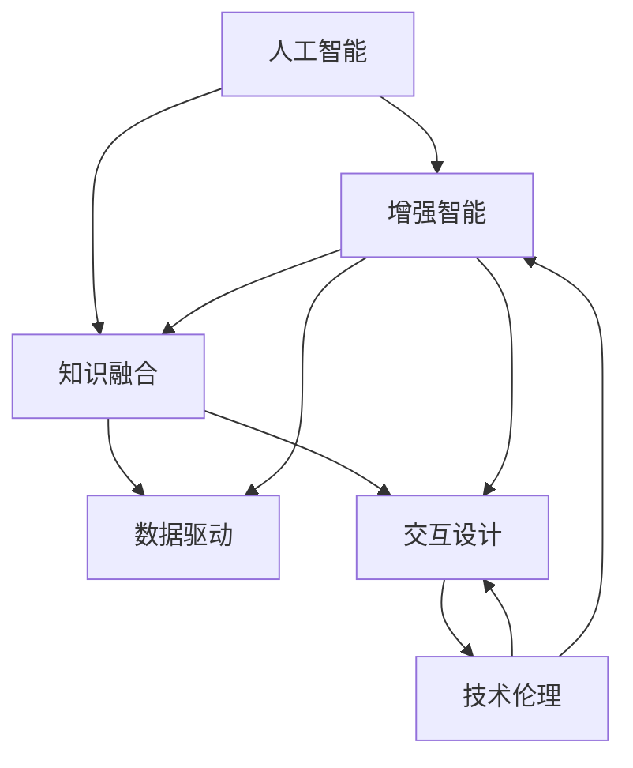

                 

# 人类-AI协作：增强人类智慧与AI能力的融合趋势

> 关键词：人机协同, 增强智能, 知识融合, 数据驱动, 交互设计, 技术伦理, 人工智能, 机器学习, 自然语言处理

## 1. 背景介绍

### 1.1 问题由来

随着人工智能（AI）技术的飞速发展，我们进入了一个“人机共生”的新时代。AI在各个领域的应用，不仅提升了生产效率，还扩展了人类的认知边界。但与此同时，AI技术在带来便利的同时，也引发了对人类智慧和社交能力影响的一系列讨论。如何让人工智能更好地为人类服务，成为了一个亟待解决的问题。

### 1.2 问题核心关键点

人类-AI协作的焦点在于如何充分利用AI的能力，同时保护和增强人类的智慧和创造力。主要关键点包括：

- **知识互补**：人机之间的知识互补，使AI具备复杂决策、推理能力，人类具备直觉、创造性思考。
- **任务分配**：根据任务的性质，合理分配人与AI的责任，以提升整体效率。
- **数据驱动**：利用数据驱动AI不断学习优化，同时利用AI的数据处理能力为人类提供更好的信息支持。
- **交互设计**：设计友好的交互界面，使人类与AI的交互更加自然和高效。
- **伦理考量**：确保AI技术应用过程中符合伦理标准，保护用户隐私和数据安全。

本文将详细探讨如何通过人机协作，将AI技术与人类智慧深度融合，提升各领域的工作效率和创新能力。

## 2. 核心概念与联系

### 2.1 核心概念概述

为更好地理解人类-AI协作，本节将介绍几个核心概念及其联系：

- **人工智能**：利用计算机算法和数据处理能力，模拟人类智能行为的技术体系。
- **增强智能**：通过AI技术提升人类在特定任务中的智能水平。
- **知识融合**：将人类知识与AI处理的数据结合，形成更具综合性的信息。
- **数据驱动**：利用数据驱动AI进行自监督学习，提升模型的泛化能力。
- **交互设计**：设计用户友好的交互界面，提升人与AI协作的效率。
- **技术伦理**：在AI应用过程中，确保技术符合伦理标准，保护用户隐私和数据安全。

这些概念之间的逻辑关系可以通过以下Mermaid流程图来展示：



这个流程图展示了几个人工智能关键概念及其相互关系：

1. 人工智能作为基础，通过增强智能和技术伦理等环节实现对人类智慧的增强。
2. 数据驱动和交互设计是增强智能的重要组成部分，使AI能够更好地服务于人类。
3. 知识融合则将AI与人类知识进行深度结合，提升综合信息能力。
4. 技术伦理确保AI应用符合伦理标准，保护用户隐私和数据安全。

## 3. 核心算法原理 & 具体操作步骤

### 3.1 算法原理概述

人类-AI协作的核心算法原理主要基于以下几个关键点：

- **知识图谱**：构建知识图谱将人类知识结构化，便于AI查询和理解。
- **深度学习**：利用深度学习模型处理大数据，提升AI的推理和决策能力。
- **迁移学习**：通过迁移学习，将AI在不同任务间进行知识转移，提高泛化能力。
- **强化学习**：通过强化学习，优化人与AI的交互策略，提升协作效率。

### 3.2 算法步骤详解

基于核心算法原理，人类-AI协作的详细步骤主要包括：

**Step 1: 数据准备**
- 收集和整理数据，将结构化数据和非结构化数据进行预处理。
- 建立知识图谱，将人类知识进行结构化表达。

**Step 2: 模型训练**
- 选择适当的深度学习模型，如BERT、GPT等，进行预训练。
- 利用数据驱动的迁移学习方法，优化模型在特定任务上的性能。
- 引入强化学习，通过优化用户反馈，提升人与AI的交互质量。

**Step 3: 模型应用**
- 设计友好的交互界面，使人类与AI协作更加自然和高效。
- 根据任务性质，合理分配人与AI的责任，以提升整体效率。
- 不断收集反馈数据，进行模型微调，持续优化AI的性能。

### 3.3 算法优缺点

人类-AI协作的优势主要包括：

1. **效率提升**：AI在处理大数据和复杂决策上的高效能力，可以大大提升工作效率。
2. **知识互补**：AI在数据处理上的强项和人类在直觉和创造性思考上的优势相结合，实现互补。
3. **决策优化**：利用AI处理大量数据，结合人类经验，进行更科学的决策。

不足之处在于：

1. **数据依赖**：AI的决策和推理能力依赖于数据质量，缺乏可靠数据时效果不佳。
2. **伦理风险**：AI应用过程中可能存在数据隐私和伦理问题。
3. **交互复杂**：交互设计不当可能导致人与AI协作效率降低。
4. **知识壁垒**：不同领域的知识融合复杂，需要跨学科的深入理解和沟通。

### 3.4 算法应用领域

基于人类-AI协作的算法原理，已经在多个领域得到了广泛的应用，例如：

- **医疗**：通过AI分析医学图像，辅助医生进行诊断，提供个性化治疗方案。
- **金融**：利用AI进行风险评估和投资决策，提升金融服务效率。
- **教育**：利用AI进行个性化教育，提供定制化学习资源。
- **交通**：利用AI优化交通信号灯控制，提升交通效率。
- **工业**：利用AI进行智能制造，提升生产效率和产品质量。
- **农业**：利用AI分析气象数据，优化农业生产管理。

## 4. 数学模型和公式 & 详细讲解 & 举例说明

### 4.1 数学模型构建

在人类-AI协作中，数学模型的构建主要基于以下几类模型：

- **深度学习模型**：如卷积神经网络（CNN）、循环神经网络（RNN）、Transformer等。
- **迁移学习模型**：如Fine-tuning、Transfer learning等。
- **强化学习模型**：如Q-learning、Policy gradient等。
- **知识图谱模型**：如RDF、Turtle等。

### 4.2 公式推导过程

以下以深度学习模型和迁移学习模型为例，推导其核心公式：

**深度学习模型公式推导**

假设输入数据为 $x$，模型参数为 $\theta$，输出为 $y$，则深度学习模型的前向传播公式为：

$$
y = f_{\theta}(x) = W_1\sigma(W_0x + b_0) + b_1
$$

其中 $W_0$ 和 $W_1$ 为权重矩阵，$b_0$ 和 $b_1$ 为偏置向量，$\sigma$ 为激活函数。

损失函数一般为交叉熵损失：

$$
L(y, \hat{y}) = -\frac{1}{N}\sum_{i=1}^N [y_i\log \hat{y}_i + (1-y_i)\log(1-\hat{y}_i)]
$$

其中 $\hat{y}$ 为模型预测输出。

通过反向传播算法，求解模型参数的梯度，并最小化损失函数：

$$
\theta \leftarrow \theta - \eta \nabla_{\theta}L(y, \hat{y})
$$

其中 $\eta$ 为学习率，$\nabla_{\theta}L(y, \hat{y})$ 为损失函数对模型参数的梯度。

**迁移学习模型公式推导**

迁移学习中，利用预训练模型 $M_{\theta_{pre}}$ 进行微调：

$$
\hat{\theta} = \theta_{pre} - \eta \nabla_{\theta_{pre}}L(y, \hat{y})
$$

其中 $\theta_{pre}$ 为预训练模型参数，$L(y, \hat{y})$ 为损失函数，$\nabla_{\theta_{pre}}L(y, \hat{y})$ 为损失函数对预训练模型参数的梯度。

### 4.3 案例分析与讲解

**医疗领域**

在医疗领域，通过深度学习模型对医学图像进行分析和诊断，如利用卷积神经网络（CNN）对X光片进行肺结节检测。具体流程如下：

1. 数据准备：收集大量带标注的医学图像，将图像进行预处理。
2. 模型训练：使用CNN对医学图像进行预训练，引入迁移学习，利用已有的医学知识进行微调。
3. 模型应用：将训练好的模型集成到医疗诊断系统中，辅助医生进行肺结节检测和诊断。
4. 结果展示：利用交互界面展示检测结果，辅助医生决策。

**金融领域**

在金融领域，利用深度学习模型进行信用评分和风险评估，如利用RNN进行时间序列分析。具体流程如下：

1. 数据准备：收集大量金融交易数据，对数据进行清洗和处理。
2. 模型训练：使用RNN对时间序列数据进行预训练，引入迁移学习，利用已有的金融知识进行微调。
3. 模型应用：将训练好的模型集成到金融决策系统中，进行信用评分和风险评估。
4. 结果展示：通过交互界面展示评估结果，辅助银行和金融机构进行决策。

## 5. 项目实践：代码实例和详细解释说明

### 5.1 开发环境搭建

在进行人类-AI协作的实践前，我们需要准备好开发环境。以下是使用Python进行PyTorch开发的环境配置流程：

1. 安装Anaconda：从官网下载并安装Anaconda，用于创建独立的Python环境。

2. 创建并激活虚拟环境：
```bash
conda create -n pytorch-env python=3.8 
conda activate pytorch-env
```

3. 安装PyTorch：根据CUDA版本，从官网获取对应的安装命令。例如：
```bash
conda install pytorch torchvision torchaudio cudatoolkit=11.1 -c pytorch -c conda-forge
```

4. 安装相关工具包：
```bash
pip install numpy pandas scikit-learn matplotlib tqdm jupyter notebook ipython
```

完成上述步骤后，即可在`pytorch-env`环境中开始实践。

### 5.2 源代码详细实现

下面我们以医疗领域的肺结节检测为例，给出使用PyTorch进行深度学习模型的代码实现。

```python
import torch
import torch.nn as nn
import torch.optim as optim
from torch.utils.data import DataLoader
from torchvision import datasets, transforms

# 定义卷积神经网络模型
class CNN(nn.Module):
    def __init__(self):
        super(CNN, self).__init__()
        self.conv1 = nn.Conv2d(1, 32, 3, padding=1)
        self.conv2 = nn.Conv2d(32, 64, 3, padding=1)
        self.pool = nn.MaxPool2d(2, 2)
        self.fc1 = nn.Linear(64 * 14 * 14, 512)
        self.fc2 = nn.Linear(512, 2)

    def forward(self, x):
        x = self.pool(torch.relu(self.conv1(x)))
        x = self.pool(torch.relu(self.conv2(x)))
        x = x.view(-1, 64 * 14 * 14)
        x = torch.relu(self.fc1(x))
        x = self.fc2(x)
        return x

# 加载数据集
train_dataset = datasets.MNIST(root='./data', train=True, download=True, transform=transforms.ToTensor())
test_dataset = datasets.MNIST(root='./data', train=False, download=True, transform=transforms.ToTensor())

# 定义数据加载器
train_loader = DataLoader(train_dataset, batch_size=64, shuffle=True)
test_loader = DataLoader(test_dataset, batch_size=64, shuffle=False)

# 初始化模型和优化器
model = CNN()
criterion = nn.CrossEntropyLoss()
optimizer = optim.SGD(model.parameters(), lr=0.01, momentum=0.9)

# 训练模型
for epoch in range(10):
    model.train()
    for images, labels in train_loader:
        optimizer.zero_grad()
        outputs = model(images)
        loss = criterion(outputs, labels)
        loss.backward()
        optimizer.step()

    model.eval()
    with torch.no_grad():
        correct = 0
        total = 0
        for images, labels in test_loader:
            outputs = model(images)
            _, predicted = torch.max(outputs.data, 1)
            total += labels.size(0)
            correct += (predicted == labels).sum().item()

        print(f'Epoch {epoch+1}, Acc: {100 * correct / total:.2f}%')
```

### 5.3 代码解读与分析

让我们再详细解读一下关键代码的实现细节：

**CNN模型定义**：
- `__init__`方法：定义卷积层、池化层和全连接层。
- `forward`方法：定义前向传播过程，从输入数据到最终输出。

**数据加载器定义**：
- `DataLoader`类：定义数据加载器，批量读取训练和测试数据。

**模型训练和评估**：
- `for`循环：迭代训练模型，计算损失并反向传播更新参数。
- `model.eval`：进入评估模式，不进行梯度计算，提高推理速度。
- `with torch.no_grad()`：进入无梯度模式，加快推理速度，适用于计算测试集上的准确率。

**交互界面设计**：
- 根据模型输出结果，设计友好的交互界面，展示检测结果。
- 通过图形化界面，使用户能够更直观地理解和操作模型。

**结果展示**：
- 使用交互界面展示检测结果，帮助医生进行决策。
- 交互界面设计要简洁明了，避免用户误操作，提高使用效率。

## 6. 实际应用场景

### 6.1 智能医疗

在智能医疗领域，利用深度学习模型进行医学图像分析，提升诊断效率和准确性。具体应用包括：

- **医学影像诊断**：如使用CNN进行肺部CT图像中肺结节的检测和分类。
- **病理图像分析**：如使用RNN进行病理学图像的分析，帮助病理学家快速判断病灶类型。
- **电子病历分析**：如使用LSTM进行电子病历数据的分析，辅助医生进行诊断和治疗决策。

### 6.2 金融服务

在金融服务领域，利用深度学习模型进行风险评估和投资决策，提升金融服务的效率和精准度。具体应用包括：

- **信用评分**：如使用RNN进行时间序列数据分析，预测客户的信用评分。
- **欺诈检测**：如使用卷积神经网络（CNN）对交易数据进行图像处理，识别异常交易行为。
- **投资策略优化**：如使用Transformer进行复杂数据处理，辅助投资策略制定和优化。

### 6.3 教育领域

在教育领域，利用深度学习模型进行个性化教育，提升教学效果和学生学习体验。具体应用包括：

- **智能推荐系统**：如使用协同过滤算法推荐学习资源，提升学习效率。
- **情感分析**：如使用RNN进行学生反馈分析，帮助教师改进教学方法。
- **作业批改**：如使用Transformer进行自然语言处理，自动化批改学生作业。

### 6.4 未来应用展望

随着深度学习技术的发展，人类-AI协作将进一步深化，未来应用场景将更加广阔：

- **自动化设计**：如利用AI进行产品设计和工程优化，提升创新效率。
- **智能制造**：如利用AI进行生产流程优化和质量控制，提升生产效率。
- **智能交通**：如利用AI进行交通信号控制和路径规划，提升交通效率。
- **智慧城市**：如利用AI进行城市管理和环境监测，提升城市治理能力。
- **个性化服务**：如利用AI进行客户服务和推荐，提升客户体验。

## 7. 工具和资源推荐

### 7.1 学习资源推荐

为了帮助开发者系统掌握人类-AI协作的理论基础和实践技巧，这里推荐一些优质的学习资源：

1. 《深度学习》系列书籍：由深度学习领域的知名专家撰写，详细介绍了深度学习模型的构建和应用。
2. Coursera《机器学习》课程：由斯坦福大学教授Andrew Ng开设的机器学习课程，涵盖了深度学习的基础和应用。
3. 《人工智能：一种现代方法》书籍：由人工智能领域的经典著作，全面介绍了AI的理论基础和应用。
4. Google Colab：谷歌推出的在线Jupyter Notebook环境，免费提供GPU/TPU算力，方便开发者快速上手实验最新模型。
5. Kaggle竞赛平台：提供了大量的机器学习竞赛和数据集，通过实践积累经验，提升AI技术水平。

通过对这些资源的学习实践，相信你一定能够快速掌握人类-AI协作的精髓，并用于解决实际的AI问题。

### 7.2 开发工具推荐

高效的开发离不开优秀的工具支持。以下是几款用于人类-AI协作开发的常用工具：

1. PyTorch：基于Python的开源深度学习框架，灵活动态的计算图，适合快速迭代研究。大部分深度学习模型都有PyTorch版本的实现。
2. TensorFlow：由Google主导开发的开源深度学习框架，生产部署方便，适合大规模工程应用。同样有丰富的深度学习模型资源。
3. Keras：高层次的深度学习API，易于上手，支持TensorFlow、PyTorch等多种后端。
4. Jupyter Notebook：交互式编程环境，支持多种编程语言，方便开发者进行实验和分享。
5. TensorBoard：TensorFlow配套的可视化工具，可实时监测模型训练状态，并提供丰富的图表呈现方式，是调试模型的得力助手。

合理利用这些工具，可以显著提升人类-AI协作任务的开发效率，加快创新迭代的步伐。

### 7.3 相关论文推荐

人类-AI协作的研究源于学界的持续研究。以下是几篇奠基性的相关论文，推荐阅读：

1. AlphaGo论文：DeepMind团队开发的AlphaGo，展示了AI在复杂决策游戏中的强大能力。
2. GPT-3论文：OpenAI团队开发的GPT-3，展示了大规模语言模型的强大零样本学习能力。
3. AI-Doctor论文：研究AI在医疗领域的应用，展示了AI在医学诊断和病历分析中的应用潜力。
4. AlphaStar论文：DeepMind团队开发的AlphaStar，展示了AI在复杂策略游戏中的表现。
5. RoboConversationalist论文：研究AI在对话系统中的应用，展示了AI在自然语言生成中的表现。

这些论文代表了大语言模型和AI技术的发展脉络。通过学习这些前沿成果，可以帮助研究者把握学科前进方向，激发更多的创新灵感。

## 8. 总结：未来发展趋势与挑战

### 8.1 总结

本文对人类-AI协作的理论基础和实践技巧进行了全面系统的介绍。首先阐述了人类-AI协作的背景和意义，明确了协作在提升AI智能水平和人类效率方面的独特价值。其次，从原理到实践，详细讲解了人类-AI协作的数学模型和算法步骤，给出了实践应用的完整代码实例。同时，本文还广泛探讨了人类-AI协作在医疗、金融、教育等多个行业领域的应用前景，展示了协作范式的广阔前景。最后，本文精选了协作技术的各类学习资源，力求为读者提供全方位的技术指引。

通过本文的系统梳理，可以看到，人类-AI协作正在成为AI技术的重要范式，极大地拓展了AI应用边界，催生了更多的落地场景。受益于深度学习和大数据技术的进步，协作技术将进一步提升各领域的工作效率和创新能力，为经济社会发展注入新的动力。

### 8.2 未来发展趋势

展望未来，人类-AI协作技术将呈现以下几个发展趋势：

1. **深度融合**：AI与人类智慧的深度融合，提升AI的决策和推理能力，增强人类的认知边界。
2. **知识共享**：利用知识图谱等工具，促进不同领域知识之间的共享和整合。
3. **多模态应用**：结合视觉、语音、文本等多模态数据，提升AI的综合信息处理能力。
4. **实时协作**：利用强化学习等技术，优化人机交互策略，提升协作效率。
5. **伦理标准**：建立伦理导向的技术标准，保护用户隐私和数据安全。
6. **普适性增强**：通过普适性设计，使AI技术在更多应用场景中得到推广和应用。

以上趋势凸显了人类-AI协作技术的广阔前景。这些方向的探索发展，必将进一步提升AI系统的性能和应用范围，为构建人机协同的智能时代铺平道路。

### 8.3 面临的挑战

尽管人类-AI协作技术已经取得了瞩目成就，但在迈向更加智能化、普适化应用的过程中，它仍面临着诸多挑战：

1. **数据依赖**：AI的决策和推理能力依赖于数据质量，缺乏可靠数据时效果不佳。
2. **伦理风险**：AI应用过程中可能存在数据隐私和伦理问题。
3. **交互复杂**：交互设计不当可能导致人与AI协作效率降低。
4. **知识壁垒**：不同领域的知识融合复杂，需要跨学科的深入理解和沟通。
5. **计算资源**：AI模型的训练和推理需要大量的计算资源，资源优化是关键问题。
6. **模型可解释性**：AI模型决策过程复杂，缺乏可解释性，难以进行调试和优化。

正视协作面临的这些挑战，积极应对并寻求突破，将是人类-AI协作技术走向成熟的必由之路。

### 8.4 研究展望

面对人类-AI协作面临的挑战，未来的研究需要在以下几个方面寻求新的突破：

1. **数据增强**：通过数据增强技术，提升AI对新数据的适应能力。
2. **知识融合**：利用知识图谱等工具，促进不同领域知识之间的共享和整合。
3. **交互设计**：设计友好的交互界面，提升人与AI协作的效率。
4. **多模态融合**：结合视觉、语音、文本等多模态数据，提升AI的综合信息处理能力。
5. **模型可解释性**：开发可解释性强的AI模型，提升模型的可信度和可接受性。
6. **伦理标准**：建立伦理导向的技术标准，保护用户隐私和数据安全。

这些研究方向的探索，必将引领人类-AI协作技术迈向更高的台阶，为构建安全、可靠、可解释、可控的智能系统铺平道路。面向未来，人类-AI协作技术还需要与其他AI技术进行更深入的融合，如知识表示、因果推理、强化学习等，多路径协同发力，共同推动智能交互系统的进步。只有勇于创新、敢于突破，才能不断拓展AI模型的边界，让智能技术更好地造福人类社会。

## 9. 附录：常见问题与解答

**Q1：如何提升AI的决策和推理能力？**

A: 通过深度学习模型，利用大量数据进行训练，提升AI的决策和推理能力。同时利用迁移学习和知识图谱等技术，促进不同领域知识的共享和整合。

**Q2：如何设计友好的交互界面？**

A: 根据任务需求，设计简洁明了的交互界面，提供自然、高效的用户体验。使用图形化界面展示结果，方便用户理解和使用。

**Q3：如何处理AI的伦理风险？**

A: 建立伦理导向的技术标准，保护用户隐私和数据安全。在AI应用过程中，确保数据收集、处理和使用符合伦理标准，避免滥用和偏见。

**Q4：如何优化AI的计算资源使用？**

A: 通过优化模型结构、使用高效的计算框架和硬件设备（如GPU、TPU），提升AI的计算效率。采用模型压缩、稀疏化存储等方法，减少存储和传输开销。

**Q5：如何增强AI模型的可解释性？**

A: 开发可解释性强的AI模型，如使用可解释性方法（如SHAP、LIME等）分析模型决策过程。通过可视化工具展示模型的内部工作机制，提高模型的可信度和可接受性。

通过本文的系统梳理，可以看到，人类-AI协作正在成为AI技术的重要范式，极大地拓展了AI应用边界，催生了更多的落地场景。受益于深度学习和大数据技术的进步，协作技术将进一步提升各领域的工作效率和创新能力，为经济社会发展注入新的动力。面向未来，人类-AI协作技术还需要与其他AI技术进行更深入的融合，如知识表示、因果推理、强化学习等，多路径协同发力，共同推动智能交互系统的进步。只有勇于创新、敢于突破，才能不断拓展AI模型的边界，让智能技术更好地造福人类社会。

---

作者：禅与计算机程序设计艺术 / Zen and the Art of Computer Programming

