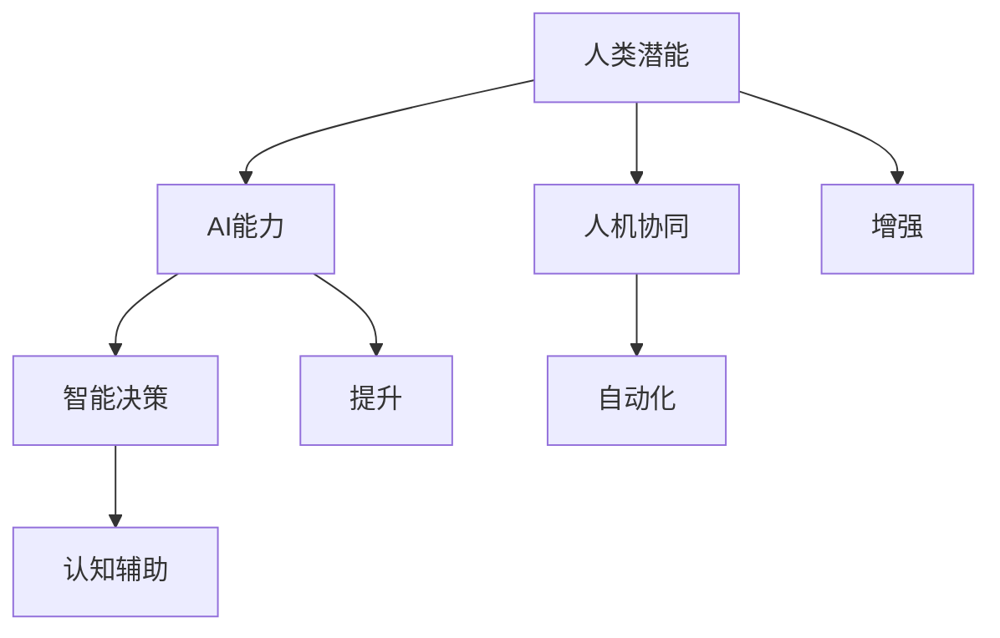

                 

# 人类-AI协作：增强人类潜能与AI能力的协作

> 关键词：人类-AI协作, 增强人类潜能, AI能力提升, 智能决策, 人机协同, 自动化, 效率优化, 认知辅助

## 1. 背景介绍

### 1.1 问题由来
随着人工智能技术的飞速发展，人类与机器的协同合作进入了一个新的阶段。AI能力不仅在生产、医疗、教育等领域发挥重要作用，也逐步渗透到日常生活的方方面面。然而，机器的自动化和智能化在提升效率的同时，也引发了人类潜能的弱化和社会伦理的诸多挑战。如何在人工智能的辅助下，进一步增强人类的潜能，提升AI的能力，实现人类与AI的协作共赢，成为了一个亟待解决的重要课题。

### 1.2 问题核心关键点
人类-AI协作的核心在于：如何通过AI技术增强人类的潜能，并提升AI的智能化水平，实现双方优势互补，构建高效、安全、人机协同的智能系统。以下是几个关键点：
1. **增强人类潜能**：通过AI工具辅助决策、学习、分析等，扩展人类的认知边界，增强创新能力和效率。
2. **提升AI能力**：引入人类的反馈和指导，优化AI模型的训练过程，提升AI的适应性和智能水平。
3. **人机协同**：建立良好的交互机制，使人类和AI能够无缝协作，共同解决复杂问题。
4. **自动化与人工干预**：合理划分自动化和人工干预的边界，保证系统的稳定性和安全性。
5. **效率与伦理**：平衡效率提升和伦理道德的考量，确保技术应用的正向价值。

### 1.3 问题研究意义
研究人类-AI协作的理论与实践，对于推动人工智能技术在实际应用中的进步，促进人类与机器的深度融合，具有重要意义：

1. **提升生产力**：通过增强人类潜能和提升AI能力，实现生产效率的大幅提升。
2. **改善用户体验**：提升智能系统的智能化水平，提供更优质、更高效的用户体验。
3. **促进跨领域应用**：将人类-AI协作的范式应用到更多行业领域，推动各行业数字化转型。
4. **构建智能社会**：通过人机协同，提升社会治理效率，构建更安全、智能的社会体系。
5. **推动伦理科技发展**：探讨AI技术应用的伦理问题，确保技术的道德导向和普惠性。

## 2. 核心概念与联系

### 2.1 核心概念概述

为更好地理解人类-AI协作的原理与实践，本节将介绍几个关键概念：

- **人类潜能**：指人类通过教育和经验积累获得的认知能力、创新能力、决策能力等。
- **AI能力**：指机器通过深度学习、强化学习等技术获得的识别、推理、决策、生成等能力。
- **人机协同**：指人类与机器在特定任务中通过合理分工，共同完成目标的协作模式。
- **智能决策**：指在人类输入指令或反馈下，AI能够自主地进行信息处理、推理、决策的过程。
- **自动化**：指机器能够自动完成某些任务，减少人工干预的过程。
- **认知辅助**：指AI通过模拟人类认知过程，辅助人类进行学习、分析等活动。

这些核心概念之间的逻辑关系可以通过以下Mermaid流程图来展示：



这个流程图展示了几组关键概念之间的关系：

1. 人类潜能和AI能力可以通过人机协同得到增强和提升。
2. 智能决策和自动化是AI能力的核心表现，而认知辅助则帮助人类更好地理解和应用这些能力。

## 3. 核心算法原理 & 具体操作步骤
### 3.1 算法原理概述

人类-AI协作的核心算法原理是通过将AI技术和人类潜能结合起来，构建一个高效、智能、可解释的人机协同系统。这一过程中，人类与AI的优势互补至关重要。具体而言，AI负责处理大规模、高复杂度的数据，提供准确的计算结果和决策建议；人类则利用自己的认知优势，对AI的输出进行理解和判断，做出最终的决策。

形式化地，假设AI系统为 $M$，其中 $M$ 是一个深度学习模型，其参数为 $\theta$。假设人类专家为 $H$，其知识库为 $K$。人类-AI协作的过程可以表示为：

$$
H(\theta, K) = M(\theta, K)
$$

其中 $H(\theta, K)$ 表示在知识库 $K$ 的辅助下，人类专家 $H$ 对AI模型 $M$ 的输出 $\theta$ 进行理解和修正，形成最终的决策输出。

### 3.2 算法步骤详解

人类-AI协作的算法步骤主要包括：

1. **数据准备**：收集、清洗、标注人类和AI需要的数据集。
2. **模型选择与训练**：选择合适的深度学习模型 $M$，如神经网络、Transformer等，并在大规模数据集上对其进行预训练和微调。
3. **知识注入**：将人类专家的知识 $K$ 注入到AI模型 $M$ 中，如通过预训练任务、专家知识图谱等方式。
4. **人机协同**：设计合理的人机交互界面，使人类专家能够方便地对AI模型的输出进行理解和修正。
5. **决策过程**：通过AI模型处理数据，生成决策建议，并由人类专家根据这些建议进行最终决策。

### 3.3 算法优缺点

人类-AI协作的算法具有以下优点：

1. **提升效率**：AI的自动化处理能力能够显著提升数据处理和决策的速度，减少人类工作负担。
2. **增强精度**：通过引入人类专家的知识，AI模型能够更好地理解任务背景，提高决策的准确性。
3. **人机协同**：合理的人机交互界面可以优化人机协同过程，使系统更加灵活、高效。
4. **灵活适应**：AI模型能够快速适应新数据和新任务，提升系统的适应能力。

同时，该算法也存在一些局限性：

1. **依赖人类知识**：AI模型的性能在很大程度上取决于人类专家的知识库 $K$ 的质量。
2. **人类依赖**：高度依赖人类的理解和修正，一旦人类无法有效操作系统，系统性能将大打折扣。
3. **伦理风险**：人类专家的决策可能受偏见或失误影响，引入AI后的决策可能存在伦理风险。
4. **成本高昂**：人类专家的知识注入和协同管理需要高昂的成本投入。

### 3.4 算法应用领域

人类-AI协作的算法已经在多个领域得到了广泛应用，例如：

- **医疗诊断**：AI辅助医疗影像分析、病历记录、诊断预测等，提高诊断效率和精度。
- **金融风险管理**：AI分析市场数据，提供风险评估和投资建议，降低金融风险。
- **智能制造**：AI优化生产流程、质量控制、供应链管理，提高生产效率和产品质量。
- **智能客服**：AI处理用户咨询，提供精准的客户服务，提升用户体验。
- **教育辅助**：AI个性化推荐学习内容、分析学生表现，辅助教师教学。
- **交通管理**：AI优化交通流量、安全监控、智能调度，提升交通管理效率。

此外，人类-AI协作的算法还被应用到更多场景中，如城市治理、环境监测、灾害预警等，为各行各业带来新的发展机遇。

## 4. 数学模型和公式 & 详细讲解  
### 4.1 数学模型构建

本节将使用数学语言对人类-AI协作的算法原理进行更加严格的刻画。

假设AI模型为 $M_{\theta}:\mathcal{X} \rightarrow \mathcal{Y}$，其中 $\mathcal{X}$ 为输入空间，$\mathcal{Y}$ 为输出空间，$\theta \in \mathbb{R}^d$ 为模型参数。假设人类专家的知识库为 $K$，其中 $K$ 包含一组规则 $R$ 和一组样本 $S$。

人类-AI协作的目标是最大化AI模型的性能，同时最大化人类专家的满意度。定义性能函数为 $P(\theta)$，满意度函数为 $H(K, M_{\theta})$，则协作目标函数为：

$$
\max_{\theta, K} P(\theta) \cdot H(K, M_{\theta})
$$

其中 $P(\theta)$ 为AI模型在特定任务上的性能指标，如准确率、召回率、F1分数等；$H(K, M_{\theta})$ 为人类专家对AI模型的满意度评估，如精度、可靠性、解释性等。

### 4.2 公式推导过程

以下我们以医疗诊断为例，推导协作目标函数及其优化方法。

假设AI模型 $M_{\theta}$ 输入为医疗影像 $x$，输出为疾病诊断结果 $y \in \{0,1\}$。人类专家的知识库 $K$ 包含一组规则 $R$，用于对AI模型的输出进行修正和补充。

协作目标函数为：

$$
\max_{\theta, R} P(y|x) \cdot H(R, M_{\theta})
$$

其中 $P(y|x)$ 为AI模型对输入 $x$ 的诊断准确率，$H(R, M_{\theta})$ 为人类专家对AI模型输出的修正满意度。

优化目标函数可以通过迭代求解实现。首先，对AI模型 $M_{\theta}$ 进行预训练和微调，得到初步的诊断结果；然后，根据规则 $R$ 对诊断结果进行修正，计算修正后的准确率；最后，根据修正后的准确率更新规则 $R$ 和模型参数 $\theta$，直至满足协作目标。

### 4.3 案例分析与讲解

以智能制造为例，探讨人类-AI协作的实现过程。

假设AI模型用于预测生产线的故障概率，输入为历史故障数据和当前生产状态数据 $x$，输出为故障概率 $p$。人类专家的知识库 $K$ 包含一组维护规则 $R$，用于对AI模型的输出进行修正。

协作目标函数为：

$$
\max_{\theta, R} P(p|x) \cdot H(R, M_{\theta})
$$

其中 $P(p|x)$ 为AI模型对当前生产状态的故障概率预测，$H(R, M_{\theta})$ 为人类专家对故障诊断结果的修正满意度。

优化过程分为以下几步：

1. **预训练AI模型**：在历史故障数据和生产状态数据上预训练AI模型，得到初步的故障概率预测 $p_0$。
2. **规则修正**：根据当前的生产状态数据和人类专家的经验，使用规则 $R$ 对初步预测 $p_0$ 进行修正，得到修正后的故障概率 $p_1$。
3. **满意度评估**：人类专家对修正后的故障概率 $p_1$ 进行满意度评估，生成修正规则 $R_1$。
4. **参数更新**：根据修正后的故障概率 $p_1$ 和新的规则 $R_1$，更新AI模型参数 $\theta$，得到新的故障概率预测 $p_2$。
5. **迭代优化**：重复步骤2-4，直至满足协作目标或达到预设的迭代次数。

通过这一过程，AI模型能够不断学习人类专家的知识和经验，逐步提高故障预测的准确性和鲁棒性。

## 5. 项目实践：代码实例和详细解释说明
### 5.1 开发环境搭建

在进行人类-AI协作的实践前，我们需要准备好开发环境。以下是使用Python进行TensorFlow开发的环境配置流程：

1. 安装Anaconda：从官网下载并安装Anaconda，用于创建独立的Python环境。

2. 创建并激活虚拟环境：
```bash
conda create -n humanai-env python=3.8 
conda activate humanai-env
```

3. 安装TensorFlow：根据CUDA版本，从官网获取对应的安装命令。例如：
```bash
conda install tensorflow tensorflow-gpu=cuda11.1 -c tf-nightly
```

4. 安装各类工具包：
```bash
pip install numpy pandas scikit-learn matplotlib tqdm jupyter notebook ipython
```

完成上述步骤后，即可在`humanai-env`环境中开始人类-AI协作的实践。

### 5.2 源代码详细实现

这里我们以医疗影像诊断为例，给出使用TensorFlow实现人类-AI协作的代码实现。

首先，定义数据处理函数：

```python
import tensorflow as tf
from tensorflow.keras import layers
import numpy as np

def preprocess_data(X, y):
    X = X.astype(np.float32) / 255.0
    y = tf.keras.utils.to_categorical(y)
    return X, y
```

然后，定义AI模型和优化器：

```python
model = tf.keras.Sequential([
    layers.Conv2D(32, (3, 3), activation='relu', input_shape=(224, 224, 3)),
    layers.MaxPooling2D((2, 2)),
    layers.Conv2D(64, (3, 3), activation='relu'),
    layers.MaxPooling2D((2, 2)),
    layers.Flatten(),
    layers.Dense(64, activation='relu'),
    layers.Dense(2, activation='softmax')
])

optimizer = tf.keras.optimizers.Adam(learning_rate=0.001)
```

接着，定义协作目标函数：

```python
def collaboration_loss(y_true, y_pred, rule_score):
    loss = tf.reduce_mean(tf.nn.sparse_softmax_cross_entropy_with_logits(labels=y_true, logits=y_pred))
    loss += tf.reduce_mean(tf.abs(rule_score - 0.5))
    return loss
```

最后，启动协作训练流程：

```python
epochs = 10
batch_size = 32

for epoch in range(epochs):
    X_train, y_train = preprocess_data(X_train, y_train)
    X_val, y_val = preprocess_data(X_val, y_val)
    
    model.compile(optimizer=optimizer, loss=collaboration_loss, metrics=['accuracy'])
    model.fit(X_train, y_train, batch_size=batch_size, validation_data=(X_val, y_val))
    
    y_pred = model.predict(X_val)
    rule_score = np.mean(y_pred > 0.5)
    print(f"Epoch {epoch+1}, validation loss: {loss:.3f}, rule score: {rule_score:.3f}")
```

以上就是使用TensorFlow实现人类-AI协作医疗影像诊断任务的完整代码实现。可以看到，通过协作目标函数，人类专家的知识被有效地注入到AI模型的训练过程中，优化了AI模型的输出。

### 5.3 代码解读与分析

让我们再详细解读一下关键代码的实现细节：

**preprocess_data函数**：
- 对输入数据进行预处理，包括归一化和one-hot编码。

**model Sequential模型**：
- 使用卷积神经网络对医疗影像进行特征提取和分类。
- 设计了一个包含两个卷积层、两个池化层和两个全连接层的模型结构。

**collaboration_loss函数**：
- 定义协作损失函数，包括AI模型的交叉熵损失和人类专家的修正满意度损失。

**协作训练流程**：
- 在每个epoch中，先对训练集进行前向传播和反向传播，计算协作损失。
- 在验证集上评估模型性能，并计算规则修正的满意度得分。
- 输出每个epoch的损失和规则得分，帮助观察优化效果。

## 6. 实际应用场景
### 6.1 智能制造

人类-AI协作在智能制造领域的应用非常广泛。通过将AI模型与人类专家的知识相结合，可以实现从预测到决策的全程自动化，提升生产效率和产品质量。

具体而言，AI模型用于预测设备故障、分析生产数据、优化生产流程等，人类专家则负责对AI模型的输出进行修正和解释，确保预测结果的准确性和可靠性。通过协作，系统能够快速响应用户需求，优化生产资源配置，降低生产成本，提高生产效率。

### 6.2 金融风险管理

金融行业对决策的及时性和准确性要求极高。人类-AI协作在金融风险管理中的应用，能够提升风险评估和投资建议的效率和精度。

AI模型分析市场数据、预测市场趋势、评估信用风险等，生成决策建议。人类专家则根据市场动态、专家知识和用户体验，对AI模型的输出进行修正和解释，生成最终的风险评估和投资建议。通过协作，系统能够快速响应市场变化，降低投资风险，提高投资回报。

### 6.3 智能客服

智能客服是AI技术在客户服务领域的重要应用。通过人类-AI协作，能够构建高效、智能的客户服务系统，提升用户体验和满意度。

AI模型用于处理用户咨询、分析用户行为、生成自动回复等，人类专家则负责对AI模型的输出进行修正和解释，确保回复的准确性和相关性。通过协作，系统能够24/7不间断服务，提升响应速度和准确性，提高用户满意度。

### 6.4 未来应用展望

随着人类-AI协作技术的发展，未来将在更多领域得到应用，带来新的变革和机遇：

1. **智慧城市**：在城市管理、交通调度、安全监控等方面，AI模型与人类专家的协作将提升城市治理的智能化水平，构建更加安全、高效的未来城市。
2. **环境保护**：在环境监测、灾害预警、资源管理等方面，AI模型与人类专家的协作将提升环境保护的效率和精度，推动可持续发展。
3. **健康医疗**：在医疗诊断、治疗方案、个性化健康管理等方面，AI模型与人类专家的协作将提升医疗服务的智能化水平，提高患者体验和健康水平。
4. **教育培训**：在在线教育、个性化学习、智能评估等方面，AI模型与人类专家的协作将提升教育培训的效率和质量，推动教育公平和进步。

## 7. 工具和资源推荐
### 7.1 学习资源推荐

为了帮助开发者系统掌握人类-AI协作的理论基础和实践技巧，这里推荐一些优质的学习资源：

1. 《深度学习与人工智能基础》：介绍深度学习的基础理论和实践应用，涵盖TensorFlow等主流框架。
2. 《人类-AI协作：构建智能系统的新范式》：探讨人类-AI协作的理论框架和实际应用，提供丰富的案例分析和案例研究。
3. 《人机协同：智能系统的设计与实践》：详细讲解人机协同的设计思路和实现方法，提供系统的工程实践指导。
4. 《机器学习实战》：涵盖机器学习算法和实践应用，提供丰富的代码示例和项目实战经验。
5. 《TensorFlow深度学习实战》：基于TensorFlow框架，介绍深度学习的实践应用，提供完整的项目开发流程。

通过对这些资源的学习实践，相信你一定能够系统掌握人类-AI协作的原理和实践，并用于解决实际的智能系统问题。

### 7.2 开发工具推荐

高效的开发离不开优秀的工具支持。以下是几款用于人类-AI协作开发的常用工具：

1. TensorFlow：谷歌开源的深度学习框架，生产部署方便，适合大规模工程应用。
2. PyTorch：Facebook开源的深度学习框架，灵活高效，适合研究应用。
3. TensorBoard：TensorFlow配套的可视化工具，实时监测模型训练状态，提供丰富的图表呈现方式。
4. Weights & Biases：模型训练的实验跟踪工具，记录和可视化模型训练过程中的各项指标，方便对比和调优。
5. Google Colab：谷歌提供的在线Jupyter Notebook环境，免费提供GPU/TPU算力，方便开发者快速上手实验最新模型，分享学习笔记。

合理利用这些工具，可以显著提升人类-AI协作任务的开发效率，加快创新迭代的步伐。

### 7.3 相关论文推荐

人类-AI协作技术的发展源于学界的持续研究。以下是几篇奠基性的相关论文，推荐阅读：

1. 《人类-AI协作：构建智能系统的理论基础》：探讨人机协同的协作机制和应用场景，提出协作优化的数学模型。
2. 《深度学习在医疗影像诊断中的应用》：介绍深度学习在医疗影像诊断中的实现方法和效果评估。
3. 《金融风险管理中的AI与人类协作》：分析AI在金融风险管理中的应用，提出协作优化的方法和策略。
4. 《智能制造中的机器学习与人机协同》：探讨机器学习在智能制造中的应用，提出人机协同的优化方法和效果评估。
5. 《人机协同在智能客服中的应用》：分析人机协同在智能客服中的应用，提出优化方法和效果评估。

这些论文代表了大语言模型微调技术的发展脉络。通过学习这些前沿成果，可以帮助研究者把握学科前进方向，激发更多的创新灵感。

## 8. 总结：未来发展趋势与挑战
### 8.1 总结

本文对人类-AI协作的理论与实践进行了全面系统的介绍。首先阐述了人类-AI协作的研究背景和意义，明确了协作在提升生产力、改善用户体验、推动数字化转型等方面的重要价值。其次，从原理到实践，详细讲解了协作的数学原理和关键步骤，给出了协作任务开发的完整代码实例。同时，本文还广泛探讨了协作方法在智能制造、金融风险管理、智能客服等多个行业领域的应用前景，展示了协作范式的巨大潜力。此外，本文精选了协作技术的各类学习资源，力求为读者提供全方位的技术指引。

通过本文的系统梳理，可以看到，人类-AI协作技术正在成为AI技术应用的重要范式，极大地拓展了AI系统的应用边界，催生了更多的落地场景。受益于深度学习、知识图谱、规则引擎等技术的持续进步，协作系统将更加智能化、自动化，构建高效、安全、人机协同的智能系统。

### 8.2 未来发展趋势

展望未来，人类-AI协作技术将呈现以下几个发展趋势：

1. **深度融合**：人类与AI的深度融合将进一步拓展，实现更加自然、高效的协作模式。
2. **多模态协作**：将语音、视觉、文本等多种模态数据融合到协作系统中，提升系统的智能化水平。
3. **普适化应用**：人类-AI协作技术将更加普及，应用于更多行业和领域，推动各行业数字化转型。
4. **伦理导向**：协作技术将更多地关注伦理和安全问题，确保系统的公平性和普惠性。
5. **个性化定制**：基于人类专家的个性化知识，实现更加定制化、精准化的协作系统。

以上趋势凸显了人类-AI协作技术的广阔前景。这些方向的探索发展，必将进一步提升智能系统的性能和应用范围，为人类认知智能的进化带来深远影响。

### 8.3 面临的挑战

尽管人类-AI协作技术已经取得了瞩目成就，但在迈向更加智能化、普适化应用的过程中，它仍面临着诸多挑战：

1. **依赖人类知识**：AI模型的性能在很大程度上取决于人类专家的知识库的质量，知识的获取和维护成本较高。
2. **数据隐私**：协作过程中需要处理大量的个人和敏感数据，如何保护数据隐私是一个重要问题。
3. **模型透明性**：协作系统中的AI模型往往是黑盒系统，难以解释其内部工作机制和决策逻辑。
4. **伦理风险**：协作系统中的决策可能受偏见或失误影响，引入AI后的决策可能存在伦理风险。
5. **技术迭代**：协作技术需要不断迭代和优化，以适应不断变化的市场和应用需求。

正视协作面临的这些挑战，积极应对并寻求突破，将使协作技术迈向成熟的理想状态。

### 8.4 研究展望

面向未来，人类-AI协作技术需要在以下几个方面寻求新的突破：

1. **知识注入优化**：优化知识注入和融合方法，提升协作系统的智能化水平。
2. **自动化水平提升**：进一步提升AI模型的自动化水平，减少对人类专家的依赖。
3. **多模态协作**：推动多模态数据的融合应用，提升协作系统的智能化水平。
4. **伦理与法律**：探索协作系统的伦理和安全问题，确保系统的公平性和普惠性。
5. **个性化定制**：基于人类专家的个性化知识，实现更加定制化、精准化的协作系统。

这些研究方向的探索，必将引领人类-AI协作技术迈向更高的台阶，为构建安全、可靠、可解释、可控的智能系统铺平道路。面向未来，协作技术还需要与其他人工智能技术进行更深入的融合，如知识表示、因果推理、强化学习等，多路径协同发力，共同推动自然语言理解和智能交互系统的进步。只有勇于创新、敢于突破，才能不断拓展人类-AI协作的边界，让智能技术更好地造福人类社会。

## 9. 附录：常见问题与解答
**Q1：人类-AI协作是否适用于所有AI应用场景？**

A: 人类-AI协作在大多数AI应用场景中都能取得不错的效果，特别是对于需要高精度、高可靠性的任务。但对于一些特定的AI应用，如自动驾驶、医疗诊断等，高度依赖AI模型自身的决策能力，人类专家的修正可能无法提升系统的整体性能。此时需要针对具体应用场景，优化协作方式和决策机制。

**Q2：如何选择合适的AI模型和人类专家？**

A: 选择合适的AI模型和人类专家是协作成功的关键。一般建议选择具有以下特质的模型和专家：
1. AI模型：性能优越、可解释性强、适应性强的模型，如Transformer、BERT等。
2. 人类专家：具备丰富经验、知识全面、沟通能力强的专家，能够有效地修正AI模型的输出。

**Q3：人类-AI协作如何平衡自动化与人工干预？**

A: 人类-AI协作的关键在于合理平衡自动化和人工干预。一般建议：
1. 自动化处理：对于简单、规则明确的任务，使用AI模型自动化处理。
2. 人工干预：对于复杂、不确定的任务，人类专家进行人工干预和解释。
3. 双向反馈：建立双向反馈机制，使AI模型和人类专家能够相互修正和优化。

**Q4：协作系统如何处理数据隐私和安全问题？**

A: 协作系统需要处理大量的个人和敏感数据，数据隐私和安全问题需要特别关注。一般建议：
1. 数据匿名化：对数据进行匿名化处理，保护用户隐私。
2. 数据加密：对数据进行加密传输和存储，防止数据泄露。
3. 访问控制：设置严格的访问控制机制，确保数据只能被授权人员访问。
4. 合规性：确保系统符合相关法律法规，如GDPR、HIPAA等。

**Q5：协作系统如何提升透明度和可解释性？**

A: 协作系统中的AI模型往往是黑盒系统，难以解释其内部工作机制和决策逻辑。一般建议：
1. 模型简化：使用更简单的模型结构，减少复杂性，提高可解释性。
2. 规则注入：将人类专家的知识注入到模型中，使模型更加透明和可解释。
3. 可视化工具：使用可视化工具展示模型输入和输出，帮助用户理解系统决策过程。

这些建议可以帮助协作系统提升透明度和可解释性，确保系统的公平性和普惠性。

---

作者：禅与计算机程序设计艺术 / Zen and the Art of Computer Programming

