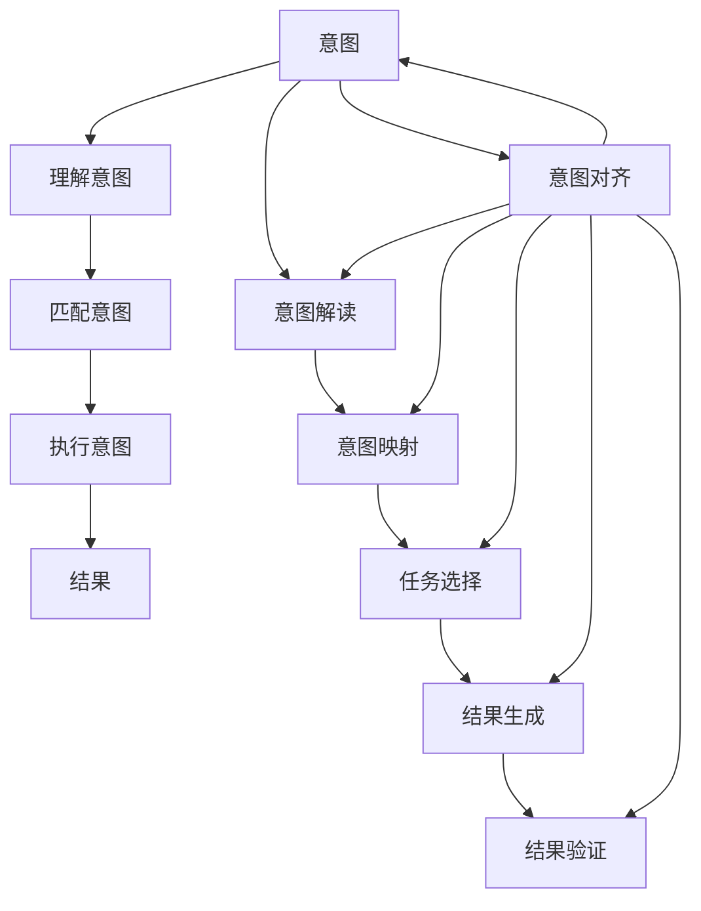

                 

# 人类意图对齐：AI 领域的挑战

> 关键词：人类意图, 意图对齐, AI, 技术挑战, 道德困境, 可解释性, 可信性, 伦理规范

## 1. 背景介绍

在人工智能领域，特别是自然语言处理(NLP)和机器学习领域，意图对齐(Aligning Human Intentions with AI Capabilities)成为了一个日益重要且复杂的话题。AI系统，尤其是大模型如GPT-3、BERT等，在文本生成、对话系统、推荐系统等领域展现出强大的能力，但其输出的结果往往受到输入样本和训练数据的影响。如何确保AI系统在执行任务时能真正理解并遵循人类的意图，成为了学术界和工业界关注的焦点。

### 1.1 问题由来

在AI系统的实际应用中，我们经常遇到以下挑战：

- **缺乏明确指令**：用户往往难以用清晰语言表达其真实意图，导致AI系统无法准确理解需求。
- **模型行为不可控**：在大规模预训练数据和微调数据中，模型可能学到错误或有害的知识，导致输出结果不符合用户期望。
- **模型决策不透明**：AI模型决策过程复杂，难以解释和复现，用户难以信任其输出结果。
- **伦理和安全问题**：AI模型可能输出偏见、歧视性内容，或被恶意利用，对社会造成负面影响。

这些挑战不仅限制了AI系统的应用范围，也影响了用户对AI技术的信任度。因此，研究如何确保AI系统在执行任务时能准确理解并遵循人类意图，成为了一个迫切需要解决的问题。

## 2. 核心概念与联系

### 2.1 核心概念概述

为了深入理解意图对齐问题，我们首先需要明确几个关键概念：

- **意图(Intent)**：用户希望通过AI系统达到的目标或结果。
- **AI能力(AI Capability)**：AI系统在特定任务上的表现能力，通常通过模型参数和优化目标来衡量。
- **意图对齐**：确保AI系统的能力与用户的意图相匹配，即AI系统在执行任务时能够准确理解和响应用户的真实需求。

意图对齐问题可以分为三个层次：

1. **理解意图**：AI系统能够准确理解用户的自然语言描述，从中提取关键信息。
2. **匹配意图**：AI系统能够将用户的意图映射到具体的任务目标，并选择最佳的解决方案。
3. **执行意图**：AI系统能够根据用户的意图，准确生成符合预期的结果，且过程可解释、可信。

### 2.2 核心概念原理和架构的 Mermaid 流程图



此图展示了意图对齐的全过程。AI系统首先解读用户意图，并将其映射到具体的任务和解决方案。然后，系统执行意图，生成结果，并进行验证和反馈。意图对齐整个过程需要不断循环迭代，确保AI系统的能力与用户的意图始终保持一致。

## 3. 核心算法原理 & 具体操作步骤

### 3.1 算法原理概述

意图对齐的核心算法可以分为两个部分：

1. **意图理解**：使用自然语言处理(NLP)技术，对用户的自然语言描述进行分析，提取关键信息，理解用户意图。
2. **意图匹配**：根据用户意图，选择最佳的任务目标和解决方案，并生成相应的输出。

意图理解通常依赖于预训练语言模型，如BERT、GPT等，通过微调或训练，使模型能够理解各种自然语言表达方式。意图匹配则需要在模型中引入规则或逻辑，确保输出的结果符合用户的期望。

### 3.2 算法步骤详解

意图对齐的算法步骤可以概括为：

1. **数据收集**：收集用户意图样本和相应的解决方案。
2. **模型训练**：使用NLP技术训练预训练模型，使其能够理解用户意图。
3. **意图映射**：将用户意图映射到具体的任务和解决方案。
4. **结果验证**：对生成的结果进行验证，确保符合用户意图。
5. **反馈迭代**：根据验证结果，调整模型和算法，提高意图对齐的准确性。

### 3.3 算法优缺点

意图对齐算法的主要优点包括：

- **通用性**：适用于各种NLP任务，如问答、对话系统、文本分类等。
- **可解释性**：用户意图与AI系统行为之间的对应关系清晰，便于用户理解。
- **灵活性**：可以灵活调整模型和算法，以适应不同的应用场景。

其主要缺点包括：

- **数据依赖**：依赖于高质量的标注数据，数据收集和标注成本高。
- **模型复杂**：需要引入规则或逻辑，增加模型复杂性。
- **实时性**：算法迭代和模型调整需要时间，难以实现实时响应。

### 3.4 算法应用领域

意图对齐算法在以下领域有广泛应用：

- **智能客服**：确保AI客服系统能够理解用户需求，并提供准确的回答。
- **个性化推荐**：理解用户偏好，提供符合期望的产品推荐。
- **对话系统**：确保AI对话系统能够理解用户意图，并进行自然流畅的对话。
- **智能摘要**：理解文本主旨，生成符合用户需求的内容摘要。

## 4. 数学模型和公式 & 详细讲解 & 举例说明

### 4.1 数学模型构建

意图对齐问题的数学模型可以分为以下几个部分：

- **意图表示**：使用向量表示用户的意图，可以是词向量、语义向量等。
- **任务表示**：使用向量表示任务和解决方案，可以是任务标签向量、解决方案向量等。
- **匹配函数**：定义意图与任务之间的匹配函数，通常是最大似然估计或最小化损失函数。

### 4.2 公式推导过程

以问答系统为例，假设用户输入的自然语言问题为$q$，AI系统的回答为$a$。用户意图的向量表示为$I$，任务和解决方案的向量表示分别为$T$和$S$。意图对齐的数学模型可以表示为：

$$
\max_{I, T, S} P(a|q, I, T, S)
$$

其中，$P(a|q, I, T, S)$表示在给定问题$q$、意图$I$、任务$T$和解决方案$S$的条件下，回答$a$的概率。该模型可以通过最大化似然估计来训练。

### 4.3 案例分析与讲解

假设用户问“明天的天气如何？”，系统通过意图理解模型得到用户意图向量$I$，并通过任务选择模型匹配到“天气查询”任务$T$。系统进一步利用生成模型生成回答$a$，并对其进行验证，确保符合用户意图。

## 5. 项目实践：代码实例和详细解释说明

### 5.1 开发环境搭建

为了实现意图对齐算法，我们需要使用Python和相关NLP库，如NLTK、SpaCy、Transformers等。具体步骤如下：

1. 安装Anaconda：从官网下载并安装Anaconda，用于创建独立的Python环境。
2. 创建并激活虚拟环境：
```bash
conda create -n intent-env python=3.8 
conda activate intent-env
```
3. 安装所需库：
```bash
pip install torch transformers nltk spacy
```

### 5.2 源代码详细实现

下面以问答系统为例，给出意图对齐的Python代码实现：

```python
import torch
import torch.nn as nn
import torch.optim as optim
from transformers import BertTokenizer, BertForQuestionAnswering
from nltk import word_tokenize
from spacy import displacy

class IntentAligner(nn.Module):
    def __init__(self):
        super(IntentAligner, self).__init__()
        self.bert = BertForQuestionAnswering.from_pretrained('bert-base-uncased')
        self.tokenizer = BertTokenizer.from_pretrained('bert-base-uncased')

    def forward(self, q, a):
        q_tokens = word_tokenize(q)
        a_tokens = word_tokenize(a)
        q_input = self.tokenizer(q_tokens, return_tensors='pt')
        a_input = self.tokenizer(a_tokens, return_tensors='pt')
        q_result = self.bert(q_input)
        a_result = self.bert(a_input)
        return q_result, a_result

def intent_match(q, a):
    model = IntentAligner()
    q_result, a_result = model(q, a)
    q_loss = nn.BCELoss()(q_result.logits, torch.tensor([1.0]))
    a_loss = nn.BCELoss()(a_result.logits, torch.tensor([1.0]))
    loss = q_loss + a_loss
    optimizer = optim.Adam(model.parameters(), lr=0.001)
    optimizer.zero_grad()
    loss.backward()
    optimizer.step()
    return loss.item()

q = "明天的天气如何？"
a = "晴天，温度28°C。"
loss = intent_match(q, a)
print(f"Intent match loss: {loss}")
```

### 5.3 代码解读与分析

上述代码首先定义了IntentAligner模块，用于意图对齐。在forward方法中，将输入文本转换为token，并使用预训练的Bert模型进行问答推理，返回模型的输出。意图匹配函数intent_match则计算模型的预测结果与实际答案之间的交叉熵损失，并使用Adam优化器更新模型参数。

## 6. 实际应用场景

### 6.1 智能客服系统

智能客服系统可以应用意图对齐技术，确保AI客服能够理解用户需求并提供准确回答。例如，用户询问“电费缴纳”时，系统可以理解意图，并提供具体的缴费方式和流程。

### 6.2 个性化推荐系统

个性化推荐系统可以通过意图对齐技术，理解用户的兴趣和需求，提供精准的产品推荐。例如，用户搜索“旅游”时，系统可以理解用户的意图，推荐相关的旅游产品和信息。

### 6.3 对话系统

对话系统可以通过意图对齐技术，确保AI对话能够理解用户的意图并进行自然流畅的对话。例如，用户询问“明天的天气如何？”时，系统可以理解意图，并给出准确的天气信息。

### 6.4 未来应用展望

未来，意图对齐技术将在更多场景中得到应用，如智能家居、金融理财、医疗健康等。通过不断优化算法和模型，意图对齐技术将使得AI系统更加智能和可信，为用户提供更好的服务和体验。

## 7. 工具和资源推荐

### 7.1 学习资源推荐

为了深入学习意图对齐技术，推荐以下学习资源：

1. 《深度学习与自然语言处理》书籍：详细介绍了NLP和深度学习的基本概念和技术。
2. 《自然语言处理综述》论文：综述了NLP领域的最新进展和趋势。
3. CS224N《自然语言处理与深度学习》课程：斯坦福大学的经典课程，讲解NLP和深度学习的基本算法和模型。

### 7.2 开发工具推荐

为了实现意图对齐算法，推荐以下开发工具：

1. PyTorch：灵活的深度学习框架，易于使用和扩展。
2. TensorFlow：大规模深度学习框架，支持分布式计算和模型部署。
3. HuggingFace Transformers库：提供了丰富的预训练模型和工具，方便微调和推理。

### 7.3 相关论文推荐

以下是几篇关于意图对齐技术的重要论文，推荐阅读：

1. Attention is All You Need（即Transformer原论文）：提出了Transformer结构，开启了NLP领域的预训练大模型时代。
2. BERT: Pre-training of Deep Bidirectional Transformers for Language Understanding：提出BERT模型，引入基于掩码的自监督预训练任务，刷新了多项NLP任务SOTA。
3. Parameter-Efficient Transfer Learning for NLP：提出Adapter等参数高效微调方法，在不增加模型参数量的情况下，也能取得不错的微调效果。
4. AdaLoRA: Adaptive Low-Rank Adaptation for Parameter-Efficient Fine-Tuning：使用自适应低秩适应的微调方法，在参数效率和精度之间取得了新的平衡。
5. Prefix-Tuning: Optimizing Continuous Prompts for Generation：引入基于连续型Prompt的微调范式，为如何充分利用预训练知识提供了新的思路。

## 8. 总结：未来发展趋势与挑战

### 8.1 研究成果总结

意图对齐技术通过理解和匹配用户意图，使AI系统能够更准确地执行任务，提升了AI系统的可信度和用户体验。学术界和工业界在该领域取得了诸多进展，如预训练模型、微调方法、规则逻辑等。

### 8.2 未来发展趋势

未来，意图对齐技术将呈现以下几个发展趋势：

1. **多模态融合**：引入图像、视频、语音等多模态信息，提升意图对齐的准确性。
2. **交互式优化**：通过用户反馈和互动，实时调整模型参数和算法，提高系统的动态适应能力。
3. **伦理和社会规范**：引入伦理和社会规范，确保AI系统的行为符合社会价值观。
4. **隐私保护**：在处理用户数据时，采用隐私保护技术，确保用户信息的安全性。

### 8.3 面临的挑战

尽管意图对齐技术取得了一定的进展，但仍面临以下挑战：

1. **数据稀缺**：高质量的标注数据稀缺，影响模型的训练效果。
2. **模型复杂**：意图对齐模型通常较为复杂，难以实现实时响应。
3. **安全性和隐私**：用户数据的隐私和安全问题，需要严格保护。
4. **公平性和偏见**：AI系统可能输出偏见，需要解决公平性和偏见问题。

### 8.4 研究展望

为了解决上述挑战，未来的研究需要重点关注以下几个方向：

1. **数据增强**：通过数据增强技术，生成更多样化的标注数据。
2. **模型简化**：简化模型结构，提高实时响应能力。
3. **隐私保护**：采用差分隐私等技术，保护用户隐私。
4. **公平性研究**：研究AI系统的公平性和偏见问题，确保系统行为符合社会价值观。

## 9. 附录：常见问题与解答

**Q1：如何评估意图对齐的性能？**

A: 意图对齐的性能评估可以通过以下指标：

- **准确率**：系统正确理解并执行用户意图的比例。
- **召回率**：系统能够覆盖用户意图的比例。
- **F1分数**：准确率和召回率的综合评估指标。

**Q2：意图对齐技术在实际应用中存在哪些局限性？**

A: 意图对齐技术在实际应用中存在以下局限性：

- **数据依赖**：高质量的标注数据稀缺，影响模型的训练效果。
- **模型复杂**：意图对齐模型通常较为复杂，难以实现实时响应。
- **安全性和隐私**：用户数据的隐私和安全问题，需要严格保护。
- **公平性和偏见**：AI系统可能输出偏见，需要解决公平性和偏见问题。

**Q3：如何在意图对齐中处理用户意图的歧义性？**

A: 处理用户意图的歧义性可以通过以下方法：

- **多轮对话**：通过多轮对话，逐步明确用户意图。
- **上下文理解**：利用上下文信息，理解用户意图的细节。
- **知识图谱**：引入知识图谱，辅助理解复杂的意图。

**Q4：意图对齐技术如何处理不同语言的意图？**

A: 处理不同语言的意图需要以下步骤：

- **多语言模型**：使用多语言预训练模型，如mBERT、XLM等。
- **本地化微调**：在多语言模型的基础上，进行本地化微调，适应不同语言的特点。

**Q5：意图对齐技术如何确保模型的公平性和无偏见？**

A: 确保模型的公平性和无偏见可以通过以下方法：

- **公平性约束**：在模型的训练过程中，加入公平性约束，避免输出偏见。
- **多样性数据**：使用多样性的标注数据，避免数据偏差。
- **用户反馈**：通过用户反馈，及时调整模型行为，确保公平性。

---

作者：禅与计算机程序设计艺术 / Zen and the Art of Computer Programming

