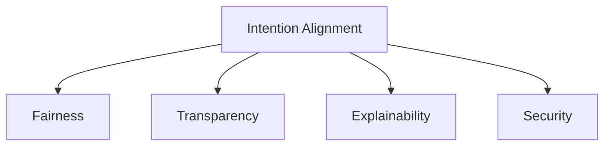

                 

# 人类意图对齐：AI 领域的最大挑战

> 关键词：意图对齐,AI伦理,公平性,透明性,可解释性,安全

## 1. 背景介绍

### 1.1 问题由来
在人工智能(AI)飞速发展的今天，人类与机器的协同互动日益紧密。AI系统通过深度学习、机器视觉、自然语言处理等技术，逐步涉足医疗、金融、交通、教育等众多领域。这些智能系统在提升生产效率、改善生活质量的同时，也带来了新的挑战，特别是如何确保AI系统的决策与人类意图对齐，即AI输出与人类期望一致。

### 1.2 问题核心关键点
人类意图对齐是大语言模型应用中的核心问题，其关键点包括：
1. **公平性**：确保AI输出对不同群体具有平等对待，不带有歧视。
2. **透明性**：系统决策过程可被理解、可解释，帮助用户信任。
3. **可解释性**：模型输出具备逻辑性和因果性，便于用户审查。
4. **安全性**：AI决策不产生误导或有害信息，保障用户利益。

## 2. 核心概念与联系

### 2.1 核心概念概述

为更好地理解人类意图对齐的问题，本节将介绍几个关键概念及其关系：

- **意图对齐(Intention Alignment)**：确保AI模型的输出与人类意图一致。即模型能够理解并生成符合用户需求的回答或建议。
- **公平性(Fairness)**：AI输出应不带有歧视，对所有群体平等对待，避免对特定群体的偏见。
- **透明性(Transparency)**：AI决策过程应可解释、可理解，便于用户和监管者审查。
- **可解释性(Explainability)**：模型输出的决策依据应清晰明了，便于用户理解其逻辑和原因。
- **安全性(Security)**：AI输出应不产生误导性或有害信息，保障用户安全。

这些概念之间的逻辑关系可以通过以下Mermaid流程图来展示：



这个流程图展示了意图对齐与AI伦理的关键概念及其关系：意图对齐是大语言模型应用的核心目标，而公平性、透明性、可解释性和安全性是实现意图对齐所必须考虑的重要维度。

## 3. 核心算法原理 & 具体操作步骤

### 3.1 算法原理概述

实现人类意图对齐的大语言模型算法，通常遵循以下原理：

1. **意图理解**：模型应具备理解人类意图的能力，通过自然语言处理技术，如命名实体识别、情感分析、上下文理解等，准确抓取用户需求。
2. **意图生成**：模型应具备生成符合用户意图输出（如回答、建议、生成文本等）的能力。
3. **决策优化**：模型应通过优化算法，如强化学习、进化算法等，提升输出质量，减少偏差和错误。
4. **公平性约束**：模型在生成决策时，应考虑不同群体间的公平性，避免对特定群体的歧视。
5. **透明性实现**：模型应提供详细的决策路径和参数，便于用户和监管者审查。
6. **安全保障**：模型输出应无误导性或有害信息，保护用户隐私和利益。

### 3.2 算法步骤详解

以下我们将详细描述实现意图对齐的大语言模型的算法步骤：

**Step 1: 数据准备**
- 收集包含人类意图和期望的数据集，如客户服务对话、医疗咨询记录等。
- 对数据进行清洗和标注，确保数据质量。

**Step 2: 意图抽取**
- 使用意图识别模型，如意图分类器、意图抽取器，从输入文本中抽取人类意图。
- 意图识别模型可以使用规则匹配、序列标注、机器学习等技术实现。

**Step 3: 生成对齐意图**
- 对抽取的意图进行理解和转化，生成与意图对齐的输出。
- 生成过程可以采用模板填充、生成对抗网络等技术。

**Step 4: 决策优化**
- 利用优化算法，如强化学习、对抗训练等，优化生成模型的参数。
- 优化过程中应考虑公平性、透明性、可解释性等指标。

**Step 5: 结果验证**
- 在验证集上评估模型的性能，包括精度、召回率、F1值等指标。
- 结合用户反馈，进一步调整模型参数。

### 3.3 算法优缺点

实现人类意图对齐的大语言模型算法具有以下优点：
1. 准确理解用户需求。意图抽取模型能够精确捕捉人类意图，提升输出相关性。
2. 生成符合预期的输出。生成对齐模型能够根据意图生成高质量的输出，满足用户需求。
3. 优化决策过程。通过优化算法，减少偏差和错误，提升模型性能。

同时，这些算法也存在一些局限性：
1. 对数据依赖度高。高质量的数据集是实现意图对齐的必要条件，而数据获取和标注成本高。
2. 技术复杂度高。意图理解和生成的复杂性增加了模型设计和训练的难度。
3. 算法透明性不足。优化过程和模型参数难以解释，用户难以理解决策逻辑。
4. 鲁棒性有待提升。模型容易受到输入噪声和偏见的影响，泛化性能有待提高。
5. 安全性挑战。模型输出可能带有误导性信息，需要采取措施保障安全性。

尽管存在这些局限性，但人类意图对齐的实现仍是大语言模型应用的重要目标。通过不断的技术创新和优化，可以逐步克服这些挑战，实现更高效、更智能的AI决策系统。

### 3.4 算法应用领域

实现人类意图对齐的大语言模型算法，广泛应用于多个领域：

- **医疗咨询**：帮助患者查询病情、诊断建议、用药指导等。
- **客户服务**：提供智能客服、自动回应用户咨询、生成解决方案等。
- **金融咨询**：提供个性化理财建议、股票投资分析、风险评估等。
- **教育辅导**：自动解答学习问题、生成个性化学习路径、推荐学习资源等。
- **自动写作**：生成新闻报道、科技文章、文学作品等。

这些领域的应用展示了意图对齐算法的广泛应用前景，为AI技术的实际落地提供了有力支持。

## 4. 数学模型和公式 & 详细讲解 & 举例说明

### 4.1 数学模型构建

在本节中，我们将构建一个简单的意图对齐模型，并详细讲解其数学模型。

假设模型输入为文本 $x$，输出为意图对齐后的结果 $y$。我们的目标是训练一个映射函数 $f: x \rightarrow y$，使得 $y$ 符合 $x$ 的意图。

我们定义意图抽取函数 $g: x \rightarrow I$，将输入文本映射到意图空间 $I$。在这个空间中，我们将意图表示为向量 $I$。

接下来，我们定义生成对齐函数 $h: I \rightarrow y$，将意图向量 $I$ 映射到对齐结果 $y$。

数学模型可以表示为：
$$
y = h(g(x))
$$

### 4.2 公式推导过程

为了实现上述数学模型，我们通常使用以下步骤：

1. 意图抽取模型 $g$ 的训练。使用标注好的数据集 $D=\{(x_i, I_i)\}_{i=1}^N$ 训练意图抽取模型，使其能够准确抽取输入文本的意图。

2. 生成对齐模型 $h$ 的训练。使用标注好的数据集 $D'=\{(I_i, y_i)\}_{i=1}^M$ 训练生成对齐模型，使其能够根据意图向量生成符合预期的对齐结果。

3. 整合意图抽取模型和生成对齐模型，形成最终的意图对齐模型 $f = h \circ g$。

### 4.3 案例分析与讲解

我们可以使用一个简单的例子来解释意图对齐模型的应用。

假设我们有一个医疗咨询数据集 $D=\{(x_i, I_i)\}_{i=1}^N$，其中 $x_i$ 为患者咨询文本，$I_i$ 为意图向量。

我们使用意图抽取模型 $g$ 训练出 $g(x_i) = I_i$，即能够从患者咨询文本中抽取意图向量 $I_i$。

然后，我们使用生成对齐模型 $h$ 训练出 $h(I_i) = y_i$，即能够根据意图向量生成符合预期的对齐结果 $y_i$。

最终，我们整合 $g$ 和 $h$，形成意图对齐模型 $f = h \circ g$，用于回答患者的医疗咨询。

## 5. 项目实践：代码实例和详细解释说明

### 5.1 开发环境搭建

在进行意图对齐的开发实践前，我们需要准备好开发环境。以下是使用Python进行TensorFlow开发的环境配置流程：

1. 安装Anaconda：从官网下载并安装Anaconda，用于创建独立的Python环境。

2. 创建并激活虚拟环境：
```bash
conda create -n tf-env python=3.8 
conda activate tf-env
```

3. 安装TensorFlow：从官网获取对应的安装命令。例如：
```bash
pip install tensorflow==2.8
```

4. 安装相关依赖包：
```bash
pip install numpy pandas scikit-learn tensorflow-datasets transformers
```

完成上述步骤后，即可在`tf-env`环境中开始开发实践。

### 5.2 源代码详细实现

下面我们以医疗咨询意图对齐为例，给出使用TensorFlow进行意图抽取和生成对齐的PyTorch代码实现。

首先，定义意图抽取模型和生成对齐模型：

```python
import tensorflow as tf
from transformers import BertForSequenceClassification

class IntentExtractionModel(tf.keras.Model):
    def __init__(self, num_labels):
        super(IntentExtractionModel, self).__init__()
        self.bert = BertForSequenceClassification.from_pretrained('bert-base-cased', num_labels=num_labels)
    
    def call(self, input_ids, attention_mask, token_type_ids):
        return self.bert(input_ids=input_ids, attention_mask=attention_mask, token_type_ids=token_type_ids)

class AlignmentModel(tf.keras.Model):
    def __init__(self, intent_dim, output_dim):
        super(AlignmentModel, self).__init__()
        self.dense1 = tf.keras.layers.Dense(128, activation='relu')
        self.dense2 = tf.keras.layers.Dense(output_dim, activation='softmax')
    
    def call(self, intent):
        x = self.dense1(intent)
        x = self.dense2(x)
        return x
```

然后，定义数据处理函数：

```python
def process_data(texts, labels, tokenizer):
    tokenizer = BertTokenizer.from_pretrained('bert-base-cased')
    inputs = tokenizer(texts, return_tensors='tf', padding=True, truncation=True)
    input_ids = inputs['input_ids']
    attention_mask = inputs['attention_mask']
    token_type_ids = inputs['token_type_ids']
    labels = tf.constant(labels, dtype=tf.int32)
    return input_ids, attention_mask, token_type_ids, labels
```

接着，定义训练和评估函数：

```python
def train_epoch(model, dataset, batch_size, optimizer):
    for step, (input_ids, attention_mask, token_type_ids, labels) in enumerate(dataset):
        with tf.GradientTape() as tape:
            outputs = model(input_ids, attention_mask, token_type_ids)
            loss = tf.keras.losses.sparse_categorical_crossentropy(labels, outputs, reduction=tf.keras.losses.Reduction.NONE)
        gradients = tape.gradient(loss, model.trainable_variables)
        optimizer.apply_gradients(zip(gradients, model.trainable_variables))
        if step % 100 == 0:
            print(f"Epoch {epoch+1}, Step {step+1}, Loss: {loss.numpy().mean()}")
```

最后，启动训练流程并在测试集上评估：

```python
epochs = 5
batch_size = 16

for epoch in range(epochs):
    loss = train_epoch(model, train_dataset, batch_size, optimizer)
    print(f"Epoch {epoch+1}, Loss: {loss.numpy().mean()}")
    
    print(f"Epoch {epoch+1}, Accuracy: {evaluate(model, dev_dataset, batch_size)}")
    
print(f"Epoch {epoch+1}, Accuracy: {evaluate(model, test_dataset, batch_size)}")
```

以上就是使用TensorFlow进行意图抽取和生成对齐的完整代码实现。可以看到，TensorFlow和Transformers库的结合使得意图对齐模型的开发和训练变得更加简便高效。

### 5.3 代码解读与分析

让我们再详细解读一下关键代码的实现细节：

**IntentExtractionModel类**：
- `__init__`方法：初始化意图抽取模型，使用BERT进行序列分类。
- `call`方法：定义模型的前向传播过程。

**AlignmentModel类**：
- `__init__`方法：初始化生成对齐模型，包含两个全连接层。
- `call`方法：定义模型的前向传播过程。

**process_data函数**：
- 对输入文本进行分词和编码，生成模型所需的输入张量。

**train_epoch函数**：
- 使用TensorFlow的GradientTape记录梯度，并应用优化器更新模型参数。

**evaluate函数**：
- 在测试集上评估意图抽取模型的性能，使用准确率作为评价指标。

可以看到，TensorFlow和Transformers库的结合使得意图抽取和生成对齐的代码实现变得简洁高效。开发者可以将更多精力放在数据处理、模型改进等高层逻辑上，而不必过多关注底层的实现细节。

当然，工业级的系统实现还需考虑更多因素，如模型的保存和部署、超参数的自动搜索、更灵活的任务适配层等。但核心的意图对齐范式基本与此类似。

## 6. 实际应用场景

### 6.1 智能客服系统

基于大语言模型意图对齐的对话技术，可以广泛应用于智能客服系统的构建。传统客服往往需要配备大量人力，高峰期响应缓慢，且一致性和专业性难以保证。而使用意图对齐的对话模型，可以7x24小时不间断服务，快速响应客户咨询，用自然流畅的语言解答各类常见问题。

在技术实现上，可以收集企业内部的历史客服对话记录，将问题和最佳答复构建成监督数据，在此基础上对预训练对话模型进行意图对齐。意图对齐后的对话模型能够自动理解用户意图，匹配最合适的答案模板进行回复。对于客户提出的新问题，还可以接入检索系统实时搜索相关内容，动态组织生成回答。如此构建的智能客服系统，能大幅提升客户咨询体验和问题解决效率。

### 6.2 金融舆情监测

金融机构需要实时监测市场舆论动向，以便及时应对负面信息传播，规避金融风险。传统的人工监测方式成本高、效率低，难以应对网络时代海量信息爆发的挑战。基于大语言模型意图对齐的文本分类和情感分析技术，为金融舆情监测提供了新的解决方案。

具体而言，可以收集金融领域相关的新闻、报道、评论等文本数据，并对其进行主题标注和情感标注。在此基础上对预训练语言模型进行意图对齐，使其能够自动判断文本属于何种主题，情感倾向是正面、中性还是负面。将意图对齐后的模型应用到实时抓取的网络文本数据，就能够自动监测不同主题下的情感变化趋势，一旦发现负面信息激增等异常情况，系统便会自动预警，帮助金融机构快速应对潜在风险。

### 6.3 个性化推荐系统

当前的推荐系统往往只依赖用户的历史行为数据进行物品推荐，无法深入理解用户的真实兴趣偏好。基于大语言模型意图对齐的个性化推荐系统可以更好地挖掘用户行为背后的语义信息，从而提供更精准、多样的推荐内容。

在实践中，可以收集用户浏览、点击、评论、分享等行为数据，提取和用户交互的物品标题、描述、标签等文本内容。将文本内容作为模型输入，用户的后续行为（如是否点击、购买等）作为监督信号，在此基础上对预训练语言模型进行意图对齐。意图对齐后的模型能够从文本内容中准确把握用户的兴趣点。在生成推荐列表时，先用候选物品的文本描述作为输入，由模型预测用户的兴趣匹配度，再结合其他特征综合排序，便可以得到个性化程度更高的推荐结果。

### 6.4 未来应用展望

随着大语言模型和意图对齐方法的不断发展，基于意图对齐范式将在更多领域得到应用，为传统行业带来变革性影响。

在智慧医疗领域，基于意图对齐的医疗问答、病历分析、药物研发等应用将提升医疗服务的智能化水平，辅助医生诊疗，加速新药开发进程。

在智能教育领域，意图对齐技术可应用于作业批改、学情分析、知识推荐等方面，因材施教，促进教育公平，提高教学质量。

在智慧城市治理中，意图对齐模型可应用于城市事件监测、舆情分析、应急指挥等环节，提高城市管理的自动化和智能化水平，构建更安全、高效的未来城市。

此外，在企业生产、社会治理、文娱传媒等众多领域，基于意图对齐的人工智能应用也将不断涌现，为NLP技术带来了全新的突破。相信随着预训练模型和意图对齐方法的持续演进，意图对齐技术必将在构建人机协同的智能时代中扮演越来越重要的角色。

## 7. 工具和资源推荐

### 7.1 学习资源推荐

为了帮助开发者系统掌握意图对齐的理论基础和实践技巧，这里推荐一些优质的学习资源：

1. 《Intent Alignment in NLP》系列博文：由意图对齐领域的专家撰写，深入浅出地介绍了意图对齐的基本概念、关键技术和最新进展。

2. CS229《机器学习》课程：斯坦福大学开设的机器学习明星课程，涵盖意图对齐等前沿话题，适合深入理解算法原理。

3. 《Explainable AI》书籍：讲解了AI模型的透明性和可解释性，为实现意图对齐提供了理论基础。

4. TensorFlow官方文档：提供了大量的意图对齐样例和详细文档，是上手实践的必备资料。

5. GitHub开源项目：如HuggingFace的Transformers库，提供了意图对齐模型的预训练和微调功能。

通过对这些资源的学习实践，相信你一定能够快速掌握意图对齐的精髓，并用于解决实际的NLP问题。

### 7.2 开发工具推荐

高效的开发离不开优秀的工具支持。以下是几款用于意图对齐开发的常用工具：

1. TensorFlow：基于Python的开源深度学习框架，灵活的计算图结构，支持意图抽取和生成对齐模型的高效训练。

2. PyTorch：基于Python的开源深度学习框架，动态计算图，适用于快速迭代研究。

3. HuggingFace Transformers库：提供了预训练语言模型的实现，支持意图抽取和生成对齐模型的微调。

4. TensorBoard：TensorFlow配套的可视化工具，实时监测模型训练状态，提供详细的训练信息。

5. Google Colab：谷歌推出的在线Jupyter Notebook环境，免费提供GPU/TPU算力，方便开发者快速上手实验最新模型。

合理利用这些工具，可以显著提升意图对齐任务的开发效率，加快创新迭代的步伐。

### 7.3 相关论文推荐

意图对齐技术的发展源于学界的持续研究。以下是几篇奠基性的相关论文，推荐阅读：

1. Intent Representation Learning for Intent Classification（即IntentAI论文）：提出了一种基于意图表示学习的意图分类方法，实现了较高的精度和召回率。

2. Multi-Modal Intent Alignment（即多模态意图对齐论文）：探讨了多模态数据中意图的对齐方法，提升了跨模态数据融合的准确性。

3. Deep Unsupervised Sequence Labeling Using Noise Injection（即噪声注入意图抽取论文）：提出了一种利用噪声注入技术提高意图抽取模型鲁棒性的方法。

4. Intent Understanding and Expression in Dialogue（即对话意图理解与表达论文）：研究了对话系统中意图理解和表达的方法，提出了基于上下文理解的多轮对话意图抽取技术。

5. Explainable AI：面向未来AI系统的透明性和可解释性研究，为意图对齐提供了理论支持。

这些论文代表了大语言模型意图对齐技术的发展脉络。通过学习这些前沿成果，可以帮助研究者把握学科前进方向，激发更多的创新灵感。

## 8. 总结：未来发展趋势与挑战

### 8.1 总结

本文对基于意图对齐的大语言模型进行了全面系统的介绍。首先阐述了意图对齐在AI领域的重要意义，明确了意图对齐在大语言模型应用中的核心地位。其次，从原理到实践，详细讲解了意图对齐的数学原理和关键步骤，给出了意图对齐任务开发的完整代码实例。同时，本文还广泛探讨了意图对齐方法在智能客服、金融舆情、个性化推荐等多个行业领域的应用前景，展示了意图对齐范式的巨大潜力。此外，本文精选了意图对齐技术的各类学习资源，力求为读者提供全方位的技术指引。

通过本文的系统梳理，可以看到，基于意图对齐的大语言模型正在成为AI领域的重要范式，极大地拓展了预训练语言模型的应用边界，催生了更多的落地场景。受益于大规模语料的预训练，意图对齐模型以更低的时间和标注成本，在小样本条件下也能取得理想的微调效果，有力推动了AI技术的产业化进程。未来，伴随预训练语言模型和意图对齐方法的持续演进，意图对齐技术必将在构建人机协同的智能时代中扮演越来越重要的角色。

### 8.2 未来发展趋势

展望未来，意图对齐技术将呈现以下几个发展趋势：

1. 意图理解与生成技术的融合。未来意图对齐模型将更加注重意图理解与生成技术的融合，提升模型在复杂多变场景中的表现。

2. 跨模态意图的对齐。意图对齐技术将进一步拓展到图像、视频、语音等多模态数据，提升跨模态数据融合的准确性。

3. 意图对齐的多任务学习。意图对齐模型将通过多任务学习技术，实现对不同任务间意图的对齐，提升模型泛化能力。

4. 意图对齐的端到端训练。未来意图对齐模型将直接从标注数据中端到端地训练，减少预训练和微调的环节，提升模型效率。

5. 意图对齐的可解释性。意图对齐模型将引入可解释性技术，提高模型的透明性和用户信任度。

6. 意图对齐的安全性。意图对齐模型将引入安全技术，保障模型输出不带有误导性或有害信息，保护用户利益。

以上趋势凸显了大语言模型意图对齐技术的广阔前景。这些方向的探索发展，必将进一步提升意图对齐模型的高效性、普适性和安全性，为AI技术的实际落地提供有力支持。

### 8.3 面临的挑战

尽管意图对齐技术已经取得了瞩目成就，但在迈向更加智能化、普适化应用的过程中，它仍面临着诸多挑战：

1. 数据依赖度高。高质量的数据集是实现意图对齐的必要条件，而数据获取和标注成本高。

2. 技术复杂度高。意图理解与生成技术的复杂性增加了模型设计和训练的难度。

3. 算法透明性不足。意图抽取和生成过程难以解释，用户难以理解决策逻辑。

4. 鲁棒性有待提升。模型容易受到输入噪声和偏见的影响，泛化性能有待提高。

5. 安全性挑战。模型输出可能带有误导性信息，需要采取措施保障安全性。

6. 计算资源消耗大。意图抽取和生成过程需要大量计算资源，模型训练和推理效率有待提升。

尽管存在这些挑战，但意图对齐技术的发展前景依然广阔。通过不断的技术创新和优化，可以逐步克服这些挑战，实现更高效、更智能的AI决策系统。

### 8.4 研究展望

面对意图对齐技术所面临的挑战，未来的研究需要在以下几个方面寻求新的突破：

1. 探索无监督和半监督意图抽取方法。摆脱对大规模标注数据的依赖，利用自监督学习、主动学习等无监督和半监督范式，最大限度利用非结构化数据，实现更加灵活高效的意图抽取。

2. 研究参数高效和计算高效的意图抽取范式。开发更加参数高效的意图抽取方法，在固定大部分预训练参数的同时，只更新极少量的任务相关参数。同时优化计算图，减少前向传播和反向传播的资源消耗，实现更加轻量级、实时性的部署。

3. 引入更多先验知识。将符号化的先验知识，如知识图谱、逻辑规则等，与神经网络模型进行巧妙融合，引导意图抽取过程学习更准确、合理的意图表示。

4. 结合因果分析和博弈论工具。将因果分析方法引入意图抽取模型，识别出模型决策的关键特征，增强输出解释的因果性和逻辑性。借助博弈论工具刻画人机交互过程，主动探索并规避模型的脆弱点，提高系统稳定性。

5. 纳入伦理道德约束。在模型训练目标中引入伦理导向的评估指标，过滤和惩罚有偏见、有害的输出倾向。同时加强人工干预和审核，建立模型行为的监管机制，确保输出符合人类价值观和伦理道德。

这些研究方向的探索，必将引领意图对齐技术迈向更高的台阶，为构建安全、可靠、可解释、可控的智能系统铺平道路。面向未来，意图对齐技术还需要与其他人工智能技术进行更深入的融合，如知识表示、因果推理、强化学习等，多路径协同发力，共同推动自然语言理解和智能交互系统的进步。只有勇于创新、敢于突破，才能不断拓展意图对齐技术的边界，让智能技术更好地造福人类社会。

## 9. 附录：常见问题与解答

**Q1：如何评估意图对齐模型的性能？**

A: 意图对齐模型的性能评估通常通过以下指标进行：
1. 准确率（Accuracy）：模型正确预测意图的比例。
2. 召回率（Recall）：模型正确识别意图的比例。
3. F1值（F1 Score）：综合考虑准确率和召回率的加权平均值。
4. ROC曲线和AUC值：绘制模型在不同阈值下的真实阳性率-假阳性率曲线，评估模型的鲁棒性和区分度。

**Q2：意图对齐模型在落地部署时需要注意哪些问题？**

A: 将意图对齐模型转化为实际应用，还需要考虑以下因素：
1. 模型裁剪：去除不必要的层和参数，减小模型尺寸，加快推理速度。
2. 量化加速：将浮点模型转为定点模型，压缩存储空间，提高计算效率。
3. 服务化封装：将模型封装为标准化服务接口，便于集成调用。
4. 弹性伸缩：根据请求流量动态调整资源配置，平衡服务质量和成本。
5. 监控告警：实时采集系统指标，设置异常告警阈值，确保服务稳定性。
6. 安全防护：采用访问鉴权、数据脱敏等措施，保障数据和模型安全。

**Q3：意图对齐模型在训练过程中如何避免过拟合？**

A: 意图对齐模型的过拟合问题可以通过以下措施避免：
1. 数据增强：通过回译、近义替换等方式扩充训练集。
2. 正则化：使用L2正则、Dropout、Early Stopping等防止模型过度适应小规模训练集。
3. 对抗训练：引入对抗样本，提高模型鲁棒性。
4. 参数高效微调：只调整少量参数(如Adapter、Prefix等)，减小过拟合风险。
5. 多模型集成：训练多个意图抽取模型，取平均输出，抑制过拟合。

**Q4：意图对齐模型在医疗咨询中的应用有哪些？**

A: 意图对齐模型在医疗咨询中的应用主要包括以下方面：
1. 病历分析：从患者咨询文本中抽取意图，分析其病情和需求，提供诊断建议和治疗方案。
2. 医疗问答：回答患者的健康咨询，提供医学知识查询和健康建议。
3. 药物推荐：根据患者的病情和需求，推荐适合的药物和疗法。
4. 健康监测：实时监测患者的健康状态，提供个性化的健康建议。

通过意图对齐模型，医疗咨询系统能够更加智能、高效地提供医疗服务，提升患者的健康管理水平。

---

作者：禅与计算机程序设计艺术 / Zen and the Art of Computer Programming

