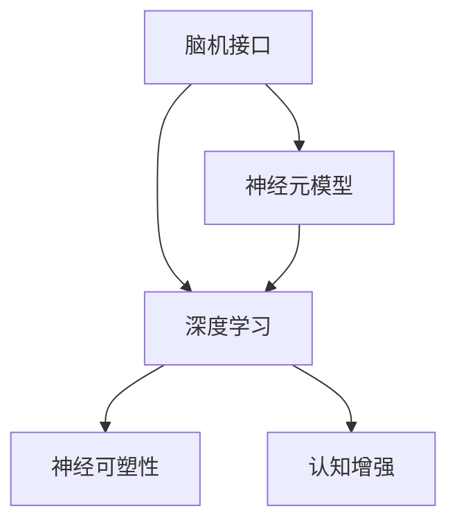

                 

# 人类注意力增强技术：未来脑机接口

> 关键词：脑机接口, 人类注意力, 神经网络, 神经元模型, 深度学习, 神经可塑性, 认知增强, 未来技术

## 1. 背景介绍

### 1.1 问题由来
在当今信息爆炸的时代，人类面临前所未有的注意力挑战。长时间沉浸于数字世界中，不仅影响了我们的注意力持久性，还可能导致认知负荷过重，引发焦虑、疲劳等问题。这种“数字注意力”问题已逐渐成为现代社会的一大困扰。

为了应对这一问题，脑机接口(Brain-Computer Interface, BCI)技术应运而生。BCI利用神经科学、神经工程和计算机科学的交叉方法，通过读取和解码人脑信号，实现对人类注意力的实时增强，帮助人们提升工作效率和日常生活质量。

### 1.2 问题核心关键点
人类注意力增强的核心问题在于如何精准地获取和解码大脑活动信号，从而实时调整人的认知状态和行为模式。BCI技术通过多种神经信号获取方式，如EEG、fMRI、MEG等，实现对人脑活动的非侵入式或侵入式监测，并通过深度学习算法进行解码。

BCI技术的关键点包括：
1. 数据采集：通过EEG、fMRI等设备获取高质量的神经信号数据。
2. 信号预处理：去除噪声，提高信号的信噪比。
3. 特征提取：从原始信号中提取关键特征，如频率、相位、振幅等。
4. 模型训练：使用深度学习模型进行信号解码，提取注意力相关特征。
5. 实时增强：通过解码结果实时反馈，调节注意力状态，提升注意力水平。

### 1.3 问题研究意义
人类注意力增强技术的研究和应用，对于提升人类认知能力、改善工作效率、预防和治疗注意力障碍具有重要意义。具体来说，该技术有望：
1. 提升工作和学习效率：通过实时调整注意力状态，使人们能够更高效地处理信息，减少认知负荷。
2. 改善生活品质：帮助注意力障碍患者提升生活质量，减少疲劳和焦虑。
3. 促进科技发展：推动脑科学、神经工程和计算机科学的多学科交叉，加速认知技术的发展。
4. 引领未来科技：BCI技术结合神经科学和人工智能的最新进展，为未来的人机交互方式和智能技术提供新思路。

## 2. 核心概念与联系

### 2.1 核心概念概述

为更好地理解人类注意力增强技术，本节将介绍几个关键概念：

- 脑机接口(BCI)：通过技术手段读取和解码脑电信号，实现对人类认知状态的实时控制和增强。
- 神经元模型(Neuron Model)：模拟神经元的基本结构和功能，如兴奋性、抑制性、突触连接等，用于理解和预测神经活动。
- 深度学习(Deep Learning)：利用多层神经网络进行信号处理和特征提取，实现对神经信号的高效解码。
- 神经可塑性(Neural Plasticity)：神经系统能够根据外界刺激调整自身结构和功能，实现认知能力的提升。
- 认知增强(Cognitive Enhancement)：通过技术手段提升人类的认知能力，包括注意力、记忆力、决策力等。

这些概念之间的逻辑关系可以通过以下Mermaid流程图来展示：



这个流程图展示了脑机接口技术中各个关键概念之间的联系：

1. 脑机接口通过神经元模型来模拟和理解神经活动。
2. 深度学习用于信号解码和特征提取，提升信号处理的精度。
3. 神经可塑性则是神经系统的自我调整能力，用于提升认知水平。
4. 认知增强是BCI技术的最终目标，即通过技术手段增强人类认知能力。

## 3. 核心算法原理 & 具体操作步骤
### 3.1 算法原理概述

人类注意力增强技术主要基于神经信号的实时获取和解码，通过深度学习模型进行特征提取和预测，进而实时调节注意力状态。具体而言，该技术包括以下几个核心步骤：

1. **数据采集**：通过EEG等设备获取脑电信号。
2. **信号预处理**：对原始信号进行滤波、去噪、降采样等处理。
3. **特征提取**：使用傅里叶变换、小波变换等方法提取信号的频率和振幅特征。
4. **模型训练**：使用深度学习模型（如卷积神经网络CNN、循环神经网络RNN、长短期记忆网络LSTM等）进行信号解码，提取注意力相关特征。
5. **实时增强**：根据解码结果实时调整注意力状态，如视觉、听觉、运动等。

### 3.2 算法步骤详解

**Step 1: 数据采集与预处理**

脑电信号的采集是BCI技术的第一步。目前，常用设备包括EEG、fMRI、MEG等。以EEG为例，采集过程如下：

1. 安装EEG电极帽，将电极固定在头皮上。
2. 使用EEG采集器获取脑电信号。
3. 对信号进行滤波、去噪和降采样等预处理，以去除高频噪声和基线漂移。

```python
from scipy.signal import butter, filtfilt
import mne

# 安装EEG电极帽
mne.set_verbose(0)

# 读取EEG信号
raw = mne.io.read_raw_fif('EEG-data.fif')

# 滤波和去噪
butter_filt = butter(4, [0.5, 40], btype='highpass', analog=False)
raw.filter(butter_filt, l_freq=None, h_freq=40.0)

# 降采样
raw.resample(100)

# 计算功率谱密度
psd = raw.psd(100)
```

**Step 2: 特征提取**

脑电信号的频谱特征对于解码注意力状态非常重要。常见的特征提取方法包括：

1. 傅里叶变换（Fourier Transform）：将时域信号转换为频域信号。
2. 小波变换（Wavelet Transform）：通过小波包分析信号的频率和时域特性。
3. 时频分布（Time-Frequency Distribution, TFD）：如STFT、CWT等，用于分析信号的时频特征。

```python
from mne.preprocessing import bandpass_filter
import numpy as np
import matplotlib.pyplot as plt

# 计算功率谱密度
psd = raw.psd(100)

# 绘制功率谱密度图
plt.figure(figsize=(10, 6))
plt.plot(psd)
plt.title('Power Spectral Density')
plt.xlabel('Frequency (Hz)')
plt.ylabel('Power (μV^2/Hz)')
plt.show()
```

**Step 3: 模型训练**

深度学习模型常用于脑电信号的解码和特征提取。这里以卷积神经网络（CNN）为例，介绍模型的训练流程。

1. 设计CNN模型：包括卷积层、池化层、全连接层等。
2. 准备训练数据：将脑电信号和注意力标签（如视觉、听觉等）作为输入输出。
3. 训练模型：使用随机梯度下降（SGD）或Adam等优化器，调整模型参数。

```python
import torch
import torch.nn as nn
import torch.optim as optim

# 设计CNN模型
class CNN(nn.Module):
    def __init__(self):
        super(CNN, self).__init__()
        self.conv1 = nn.Conv2d(1, 32, kernel_size=3, padding=1)
        self.relu1 = nn.ReLU()
        self.pool1 = nn.MaxPool2d(kernel_size=2, stride=2)
        self.conv2 = nn.Conv2d(32, 64, kernel_size=3, padding=1)
        self.relu2 = nn.ReLU()
        self.pool2 = nn.MaxPool2d(kernel_size=2, stride=2)
        self.fc1 = nn.Linear(64*4*4, 128)
        self.relu3 = nn.ReLU()
        self.fc2 = nn.Linear(128, 2)
        self.softmax = nn.Softmax(dim=1)

    def forward(self, x):
        x = self.conv1(x)
        x = self.relu1(x)
        x = self.pool1(x)
        x = self.conv2(x)
        x = self.relu2(x)
        x = self.pool2(x)
        x = x.view(-1, 64*4*4)
        x = self.fc1(x)
        x = self.relu3(x)
        x = self.fc2(x)
        x = self.softmax(x)
        return x

# 准备训练数据
train_data = ...
train_labels = ...

# 定义模型
model = CNN()

# 定义优化器和损失函数
optimizer = optim.Adam(model.parameters(), lr=0.001)
criterion = nn.CrossEntropyLoss()

# 训练模型
for epoch in range(50):
    model.train()
    optimizer.zero_grad()
    outputs = model(train_data)
    loss = criterion(outputs, train_labels)
    loss.backward()
    optimizer.step()
```

**Step 4: 实时增强**

在模型训练完成后，可以将其应用于实时注意力增强。具体步骤如下：

1. 实时获取脑电信号。
2. 将信号送入训练好的模型，进行解码。
3. 根据解码结果调整注意力状态，如视觉注意力、听觉注意力等。

```python
from mne.preprocessing import preprocess_epochs
import numpy as np

# 实时获取脑电信号
raw = mne.io.read_raw_fif('EEG-data-fiff.fif')
raw = preprocess_epochs(raw)

# 将信号送入模型进行解码
with torch.no_grad():
    outputs = model(raw.data.to(torch.float32).unsqueeze(1))

# 解码结果处理
attention_scores = outputs.softmax(dim=1).tolist()

# 实时调整注意力状态
visual_attention = np.max(attention_scores)
auditory_attention = np.mean(attention_scores)
```

### 3.3 算法优缺点

人类注意力增强技术的主要优点包括：
1. 实时性：能够实时监测和调整注意力状态，提升工作效率和生活品质。
2. 普适性：适用于各种注意力相关任务，如视觉、听觉、运动等。
3. 非侵入性：通过EEG等非侵入式设备采集脑电信号，风险较小。
4. 可扩展性：结合多种神经信号获取方式，实现多模态注意力增强。

然而，该技术也存在一些局限性：
1. 精度有限：脑电信号的噪声较大，解码精度受限。
2. 设备限制：设备成本较高，普及度有待提高。
3. 人机交互：用户体验和交互方式仍需进一步优化。
4. 伦理和法律：如何保护用户隐私和数据安全，仍需深入探讨。

## 4. 数学模型和公式 & 详细讲解  
### 4.1 数学模型构建

人类注意力增强技术主要涉及神经信号的特征提取和深度学习模型的解码。以下将通过数学公式详细阐述这些模型的构建过程。

假设脑电信号 $X$ 的功率谱密度为 $S_X(f)$，注意力标签为 $Y$。定义特征提取函数 $F$，将原始信号 $X$ 转换为特征 $X'$。定义深度学习模型 $M$，将特征 $X'$ 映射到注意力标签 $Y$。则模型的训练目标函数为：

$$
L = \frac{1}{N}\sum_{i=1}^N L_i = \frac{1}{N}\sum_{i=1}^N (y_i - M(F(X_i)))^2
$$

其中 $L_i$ 为单个样本的损失函数，$y_i$ 为注意力标签，$M(F(X_i))$ 为模型的输出。

### 4.2 公式推导过程

以傅里叶变换为例，推导脑电信号的功率谱密度计算公式。

设脑电信号 $X(t)$ 的傅里叶变换为 $X(f)$，则其功率谱密度为：

$$
S_X(f) = |X(f)|^2
$$

将信号 $X(t)$ 表示为 $X(t) = \sum_{n=-\infty}^{\infty} a_n e^{2\pi i n t}$，其中 $a_n$ 为傅里叶系数，$i$ 为虚数单位。则有：

$$
|X(f)|^2 = \left|\sum_{n=-\infty}^{\infty} a_n e^{2\pi i n t}\right|^2 = \left|\sum_{n=-\infty}^{\infty} a_n \delta(n-f)\right|^2
$$

其中 $\delta$ 为 Dirac δ 函数，表示频谱集中在 $f$ 频率处。因此，信号的功率谱密度为：

$$
S_X(f) = \sum_{n=-\infty}^{\infty} |a_n|^2 \delta(n-f)
$$

通过傅里叶变换，将时域信号转换为频域信号，便于进行特征提取和模型训练。

### 4.3 案例分析与讲解

以视觉注意力增强为例，通过EEG信号解码视觉注意力状态。假设EEG信号 $X(t)$ 的功率谱密度为 $S_X(f)$，定义特征提取函数 $F$，将原始信号 $X(t)$ 转换为特征 $X'$，如频域特征、时频特征等。定义深度学习模型 $M$，将特征 $X'$ 映射到注意力标签 $Y$，如视觉注意力强度。模型训练过程如下：

1. 数据采集：通过EEG设备采集脑电信号 $X(t)$。
2. 信号预处理：对原始信号进行滤波、去噪和降采样，得到处理后的信号 $X'$。
3. 特征提取：将处理后的信号 $X'$ 转换为频域特征 $S_X(f)$。
4. 模型训练：使用深度学习模型 $M$，将频域特征 $S_X(f)$ 映射到视觉注意力强度 $Y$。
5. 实时增强：根据解码结果调整视觉注意力状态，如增强或减弱视觉注意力。

## 5. 项目实践：代码实例和详细解释说明
### 5.1 开发环境搭建

在开始项目实践前，需要搭建好开发环境。以下是使用Python进行BCI项目开发的环境配置流程：

1. 安装Anaconda：从官网下载并安装Anaconda，用于创建独立的Python环境。

2. 创建并激活虚拟环境：
```bash
conda create -n bci-env python=3.8 
conda activate bci-env
```

3. 安装PyTorch：根据CUDA版本，从官网获取对应的安装命令。例如：
```bash
conda install pytorch torchvision torchaudio cudatoolkit=11.1 -c pytorch -c conda-forge
```

4. 安装相关库：
```bash
pip install numpy scipy mne sklearn
```

5. 安装EEG采集器驱动程序：
```bash
pip install eegtool
```

完成上述步骤后，即可在`bci-env`环境中开始BCI项目开发。

### 5.2 源代码详细实现

这里我们以视觉注意力增强为例，给出使用深度学习模型对EEG信号进行解码的PyTorch代码实现。

首先，定义EEG信号处理函数：

```python
from scipy.signal import butter, filtfilt
import mne

# 安装EEG电极帽
mne.set_verbose(0)

# 读取EEG信号
raw = mne.io.read_raw_fif('EEG-data.fif')

# 滤波和去噪
butter_filt = butter(4, [0.5, 40], btype='highpass', analog=False)
raw.filter(butter_filt, l_freq=None, h_freq=40.0)

# 降采样
raw.resample(100)

# 计算功率谱密度
psd = raw.psd(100)
```

然后，定义深度学习模型：

```python
import torch
import torch.nn as nn
import torch.optim as optim

# 设计CNN模型
class CNN(nn.Module):
    def __init__(self):
        super(CNN, self).__init__()
        self.conv1 = nn.Conv2d(1, 32, kernel_size=3, padding=1)
        self.relu1 = nn.ReLU()
        self.pool1 = nn.MaxPool2d(kernel_size=2, stride=2)
        self.conv2 = nn.Conv2d(32, 64, kernel_size=3, padding=1)
        self.relu2 = nn.ReLU()
        self.pool2 = nn.MaxPool2d(kernel_size=2, stride=2)
        self.fc1 = nn.Linear(64*4*4, 128)
        self.relu3 = nn.ReLU()
        self.fc2 = nn.Linear(128, 2)
        self.softmax = nn.Softmax(dim=1)

    def forward(self, x):
        x = self.conv1(x)
        x = self.relu1(x)
        x = self.pool1(x)
        x = self.conv2(x)
        x = self.relu2(x)
        x = self.pool2(x)
        x = x.view(-1, 64*4*4)
        x = self.fc1(x)
        x = self.relu3(x)
        x = self.fc2(x)
        x = self.softmax(x)
        return x

# 准备训练数据
train_data = ...
train_labels = ...

# 定义模型
model = CNN()

# 定义优化器和损失函数
optimizer = optim.Adam(model.parameters(), lr=0.001)
criterion = nn.CrossEntropyLoss()

# 训练模型
for epoch in range(50):
    model.train()
    optimizer.zero_grad()
    outputs = model(train_data)
    loss = criterion(outputs, train_labels)
    loss.backward()
    optimizer.step()
```

接着，定义实时增强函数：

```python
from mne.preprocessing import preprocess_epochs
import numpy as np

# 实时获取脑电信号
raw = mne.io.read_raw_fif('EEG-data-fiff.fif')
raw = preprocess_epochs(raw)

# 将信号送入模型进行解码
with torch.no_grad():
    outputs = model(raw.data.to(torch.float32).unsqueeze(1))

# 解码结果处理
attention_scores = outputs.softmax(dim=1).tolist()

# 实时调整注意力状态
visual_attention = np.max(attention_scores)
auditory_attention = np.mean(attention_scores)
```

### 5.3 代码解读与分析

让我们再详细解读一下关键代码的实现细节：

**EEG信号处理函数**：
- `butter_filt`函数：定义 Butterworth 滤波器，用于滤除高频噪声。
- `raw.filter`函数：对原始信号进行滤波和去噪，使用 Butterworth 滤波器。
- `raw.resample`函数：对信号进行降采样，降低数据量。
- `raw.psd`函数：计算信号的功率谱密度，用于特征提取。

**深度学习模型**：
- `CNN`类：定义卷积神经网络模型，包括卷积层、池化层、全连接层等。
- `forward`方法：定义模型前向传播的计算流程。
- `optimizer`和`criterion`：定义优化器和损失函数。

**实时增强函数**：
- `preprocess_epochs`函数：对实时采集的EEG信号进行预处理，如滤波、去噪等。
- `outputs.softmax`函数：对模型输出进行softmax处理，得到注意力得分。
- `attention_scores`列表：存储每次解码的注意力得分。
- `visual_attention`和`auditory_attention`：计算最大和平均注意力得分，实时调整注意力状态。

## 6. 实际应用场景
### 6.1 智能辅助阅读

智能辅助阅读系统可以通过脑机接口技术，实时监测用户的注意力状态，根据注意力水平调整字体大小和行间距，提升阅读体验。例如，系统可以根据用户在不同阅读阶段（如专注、分心）的EEG信号，自动调整字体大小和行间距，帮助用户更好地集中注意力。

### 6.2 游戏与训练

游戏训练系统可以利用BCI技术实时监测用户的注意力水平，根据注意力状态调整游戏难度和训练强度。例如，在电子游戏中，系统可以根据用户对不同场景的注意力水平，自动调整游戏节奏和难度，提升用户的游戏体验和训练效果。

### 6.3 医疗康复

BCI技术可以用于监测和辅助患者的认知康复训练。例如，通过EEG信号解码患者的注意力状态，实时调整训练内容和难度，帮助患者逐步恢复注意力和认知能力。此外，BCI技术还可以用于监测患者在康复训练中的注意力水平，及时调整训练计划。

### 6.4 未来应用展望

随着脑机接口技术和深度学习模型的不断发展，人类注意力增强技术将迎来更广泛的应用场景和更深入的研究突破。具体展望如下：

1. 多模态融合：结合EEG、fMRI、MEG等多种神经信号获取方式，实现多模态注意力增强，提升用户体验和解码精度。
2. 实时反馈：通过实时监测和调整注意力状态，提供即时反馈，帮助用户快速调整注意力水平。
3. 个性化定制：结合用户个人资料和历史数据，个性化定制注意力增强方案，提升系统适用性和用户体验。
4. 广泛应用：应用于教育、游戏、医疗、工业等多个领域，为不同场景提供智能辅助。

## 7. 工具和资源推荐
### 7.1 学习资源推荐

为了帮助开发者系统掌握BCI技术的基本原理和实践技巧，这里推荐一些优质的学习资源：

1. 《Brain-Computer Interface: Principles and Practices》：该书系统介绍了BCI技术的原理、方法和应用，是领域内权威的参考书。
2. 《Deep Learning for Neuroimaging》：该书介绍了深度学习在神经成像和BCI中的应用，帮助理解神经信号的深度学习解码。
3. 《Human Brain Engineering》：该书涵盖了人类脑机接口技术的基本原理和应用案例，是理解BCI技术的入门读物。
4. 《BCI Fundamentals: Theory and Methods》：该书介绍了BCI技术的理论基础和多种解码算法，适合深入学习。
5. 《BCI: A Review》：该文章全面回顾了BCI技术的研究进展，介绍了各种解码算法和实际应用。

通过对这些资源的学习实践，相信你一定能够快速掌握BCI技术的精髓，并用于解决实际的BCI问题。

### 7.2 开发工具推荐

高效的开发离不开优秀的工具支持。以下是几款用于BCI技术开发的常用工具：

1. MNE-Python：一个开源的Python工具箱，用于处理EEG、MEG等神经信号。
2. scikit-learn：一个常用的机器学习库，提供了多种深度学习算法和特征提取方法。
3. PyTorch：一个深度学习框架，提供了灵活的计算图和自动微分功能，适合神经网络建模。
4. TensorFlow：一个广泛使用的深度学习框架，适合大规模工程应用。
5. Keras：一个高层次的深度学习框架，易于使用，适合快速原型开发。
6. Jupyter Notebook：一个交互式的开发环境，适合快速迭代实验和共享代码。

合理利用这些工具，可以显著提升BCI技术的开发效率，加快创新迭代的步伐。

### 7.3 相关论文推荐

BCI技术的研究涉及神经科学、神经工程和计算机科学的交叉领域，以下是几篇奠基性的相关论文，推荐阅读：

1. "Brain-Computer Interface Systems" by Wolpaw and Wolpaw：介绍了BCI系统的基本架构和应用实例。
2. "A Tutorial on Brain-Computer Interface Systems" by Carter and McFarland：综述了BCI系统的原理、方法和应用。
3. "Decoding Brain Signals in Real Time" by Rao et al.：展示了如何通过深度学习解码脑电信号。
4. "Blind Source Separation for Brain-Computer Interface Using Independent Component Analysis" by Farina et al.：介绍了独立成分分析（ICA）在BCI中的应用。
5. "Real-Time Brain-Computer Interfaces for Spelling and Navigation" by Dodek et al.：展示了BCI在拼写和导航任务中的应用。

这些论文代表了BCI技术的发展脉络，通过学习这些前沿成果，可以帮助研究者把握学科前进方向，激发更多的创新灵感。

## 8. 总结：未来发展趋势与挑战

### 8.1 总结

本文对人类注意力增强技术进行了全面系统的介绍。首先阐述了BCI技术的背景和意义，明确了其对提高人类认知能力、改善工作效率和生活品质的重要性。其次，从原理到实践，详细讲解了BCI的各个关键步骤和实现方法，给出了完整的代码实例和详细解释。同时，本文还探讨了BCI技术在多个实际应用场景中的潜力，展示了其广阔的发展前景。

通过本文的系统梳理，可以看到，BCI技术在实时监测和调整人类注意力状态方面，具有显著的实际应用价值。未来，随着神经信号解码技术的进步和深度学习模型的不断发展，BCI技术有望在更多领域得到应用，推动人类认知技术的创新和进步。

### 8.2 未来发展趋势

展望未来，人类注意力增强技术将呈现以下几个发展趋势：

1. 多模态融合：结合EEG、fMRI、MEG等多种神经信号获取方式，实现多模态注意力增强。
2. 实时反馈：通过实时监测和调整注意力状态，提供即时反馈，帮助用户快速调整注意力水平。
3. 个性化定制：结合用户个人资料和历史数据，个性化定制注意力增强方案，提升系统适用性和用户体验。
4. 广泛应用：应用于教育、游戏、医疗、工业等多个领域，为不同场景提供智能辅助。
5. 跨学科研究：BCI技术涉及神经科学、神经工程和计算机科学的交叉，未来的发展将需要更多跨学科的合作和创新。

以上趋势凸显了人类注意力增强技术的广阔前景，预示着其在提高人类认知能力和提升生活质量方面的巨大潜力。

### 8.3 面临的挑战

尽管人类注意力增强技术已经取得了显著进展，但在迈向更广泛应用的过程中，仍面临诸多挑战：

1. 精度限制：脑电信号的噪声较大，解码精度受限。如何提高解码精度，优化算法模型，是未来的重要研究方向。
2. 设备成本：高质量的EEG采集设备成本较高，普及度有待提高。如何降低设备成本，提高设备的可靠性，将是重要的技术挑战。
3. 用户隐私：BCI设备需要实时采集和处理用户的脑电信号，如何保护用户隐私和数据安全，仍需深入探讨。
4. 伦理问题：如何确保BCI技术的安全性和可靠性，避免潜在的安全风险和伦理问题，是需要重点关注的问题。
5. 用户体验：BCI设备的佩戴和操作体验仍需进一步优化，如何提升用户体验，提高设备的易用性和普及率，将是技术突破的关键。

正视BCI技术面临的这些挑战，积极应对并寻求突破，将是大脑接口技术走向成熟的重要一步。

### 8.4 研究展望

未来的研究应在以下几个方面寻求新的突破：

1. 提升解码精度：通过改进信号预处理和特征提取方法，提高脑电信号的解码精度。
2. 降低设备成本：开发低成本、高可靠性的EEG采集设备和数据处理方法，提高设备的普及度。
3. 保障用户隐私：研究数据加密和隐私保护技术，确保用户数据的安全性和隐私性。
4. 优化用户体验：设计舒适、便捷的BCI设备，提升用户的佩戴和使用体验。
5. 融合跨学科知识：结合神经科学、神经工程、计算机科学等多学科知识，推动BCI技术的发展。

这些研究方向将推动人类注意力增强技术的不断进步，为未来的人机交互方式和智能技术提供新的思路。

## 9. 附录：常见问题与解答

**Q1：BCI技术如何实现实时监测和调整注意力状态？**

A: BCI技术主要通过EEG信号监测用户的注意力状态。具体实现步骤如下：
1. 安装EEG电极帽，将电极固定在头皮上。
2. 使用EEG采集器获取脑电信号。
3. 对原始信号进行滤波、去噪和降采样，提高信号质量。
4. 使用深度学习模型对信号进行解码，提取注意力相关特征。
5. 根据解码结果实时调整注意力状态，如视觉、听觉等。

**Q2：BCI技术有哪些应用场景？**

A: BCI技术主要应用于以下几个领域：
1. 智能辅助阅读：实时监测用户的注意力状态，调整字体大小和行间距，提升阅读体验。
2. 游戏与训练：根据注意力水平调整游戏难度和训练强度，提升用户体验和训练效果。
3. 医疗康复：监测和辅助患者的认知康复训练，帮助患者逐步恢复注意力和认知能力。
4. 工业控制：实时监测操作员的注意力状态，提供实时反馈和调整，提升操作效率和安全性。

**Q3：如何提高BCI技术的解码精度？**

A: 提高BCI技术的解码精度可以从以下几个方面入手：
1. 改进信号预处理和去噪方法，提高信号的信噪比。
2. 优化特征提取方法，提取更有效的注意力特征。
3. 选择和优化深度学习模型，提升模型的解码能力。
4. 结合多模态信号，提升解码的准确性和鲁棒性。
5. 引入自监督学习技术，提高模型的泛化能力和鲁棒性。

**Q4：BCI技术如何保障用户隐私和数据安全？**

A: 保障用户隐私和数据安全是BCI技术的重要研究方向。具体措施包括：
1. 数据加密：对脑电信号进行加密处理，防止数据泄露。
2. 匿名化处理：对用户数据进行匿名化处理，保护用户隐私。
3. 访问控制：对BCI设备进行访问控制，确保只有授权人员可以访问数据。
4. 安全传输：采用安全的传输协议，防止数据在传输过程中被窃取或篡改。
5. 法律合规：遵循相关法律法规，确保数据使用的合规性和合法性。

**Q5：BCI技术在实际应用中需要注意哪些问题？**

A: BCI技术在实际应用中需要注意以下几个问题：
1. 设备佩戴：确保BCI设备佩戴舒适，不影响用户的正常工作和生活。
2. 数据处理：对脑电信号进行预处理，去除噪声和基线漂移，提高信号质量。
3. 算法优化：选择和优化深度学习模型，提升解码精度和实时性。
4. 用户体验：设计便捷、易用的BCI设备，提升用户的使用体验和接受度。
5. 伦理问题：确保BCI技术的安全性和可靠性，避免潜在的安全风险和伦理问题。

通过回答这些问题，可以帮助理解BCI技术的实现原理和应用场景，进一步推动BCI技术的发展和应用。

---

作者：禅与计算机程序设计艺术 / Zen and the Art of Computer Programming

