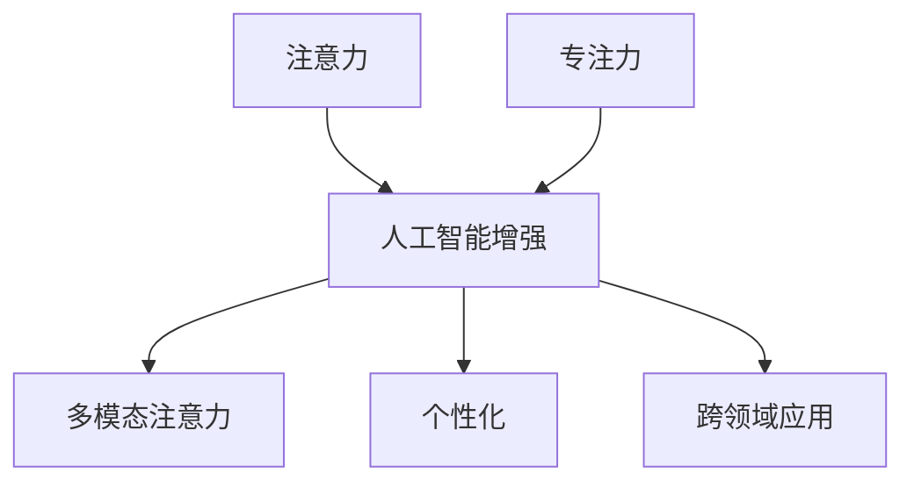

                 

## 1. 背景介绍

### 1.1 问题由来

随着数字化时代的到来，人类信息环境的爆炸性增长，注意力资源的稀缺性愈发凸显。无论是个人学习、工作还是企业运营，如何有效管理注意力，提升专注力，成为了一个亟需解决的课题。与此同时，随着人工智能技术的迅猛发展，利用AI增强注意力和专注力成为了可能。

### 1.2 问题核心关键点

人工智能在注意力和专注力的增强上可以发挥以下关键作用：

1. **数据驱动的注意力模型**：通过大数据分析，识别并预测人类注意力集中的模式，为其提供个性化的引导和建议。
2. **实时注意力监控与反馈**：利用传感器和智能设备实时监控用户注意力状态，并给出反馈和建议，帮助用户及时调整。
3. **环境智能优化**：通过AI算法分析环境因素，如光线、声音等，自动优化工作和学习环境，减少外界干扰。
4. **多任务管理**：通过智能调度算法，合理分配任务优先级，优化任务执行顺序，提升效率。
5. **学习与记忆增强**：结合脑科学研究，开发高效的学习算法，帮助用户快速掌握新知识和技能。

### 1.3 问题研究意义

人工智能在注意力和专注力增强上的应用，不仅能够提升个人的学习效率和生产力，还能够在企业管理、人力资源、教育培训等领域带来显著效益。这将极大地提升社会整体的创新能力和竞争力，为经济发展注入新的活力。

## 2. 核心概念与联系

### 2.1 核心概念概述

- **注意力**：指个体在处理信息时所聚焦的资源和精力，人类注意力有限，容易分散，需要有效的管理工具。
- **专注力**：指个体在特定目标上集中注意力的能力，涉及时间管理、任务执行等策略。
- **人工智能增强**：利用AI技术提升人类注意力和专注力，包括数据驱动的模型、实时监控与反馈、环境优化、任务管理和学习增强等。
- **多模态注意力**：结合视觉、听觉、触觉等多感官数据，全面监控和引导注意力。
- **个性化**：针对不同用户的特点和需求，提供定制化的注意力管理策略。
- **跨领域应用**：从教育、企业到家庭等多个领域，AI注意力增强技术可以带来广泛的应用。

这些核心概念之间的逻辑关系可以通过以下Mermaid流程图来展示：



### 2.2 核心概念原理和架构

注意力增强的原理主要基于以下几个方面：

1. **认知模型**：通过模拟人类大脑的认知过程，构建注意力模型。如Rumor模型、Top-down Attention等。
2. **数据驱动学习**：利用大数据和机器学习算法，从用户行为数据中学习注意力模式。
3. **实时监控与反馈**：通过传感器和智能设备实时监测用户注意力状态，并给出即时反馈和建议。
4. **多模态融合**：结合视觉、听觉等多感官数据，全面分析用户的注意力状态。
5. **个性化推荐**：根据用户的个性化特点，提供定制化的注意力管理策略。

这些核心原理构成了注意力增强技术的基础，并通过不同架构实现具体的增强策略。典型的架构包括：

- **决策支持系统**：基于认知模型和实时数据，提供决策支持。
- **智能环境系统**：通过环境优化算法，自动调整物理环境，提升注意力集中度。
- **多任务管理平台**：利用智能调度算法，合理分配任务优先级，提升多任务执行效率。
- **个性化学习系统**：结合脑科学研究，提供个性化的学习路径和策略。

## 3. 核心算法原理 & 具体操作步骤

### 3.1 算法原理概述

基于注意力增强的核心算法主要包括以下几个方面：

1. **注意力预测模型**：利用深度学习模型预测用户注意力分布。
2. **实时监控算法**：通过传感器数据实时监测用户注意力状态，提供即时反馈。
3. **环境优化算法**：利用机器学习算法分析环境因素，自动优化工作环境。
4. **多任务调度算法**：基于优先级和用户需求，智能分配任务执行顺序。
5. **学习路径推荐算法**：结合脑科学研究，提供个性化的学习路径和策略。

### 3.2 算法步骤详解

#### 3.2.1 注意力预测模型

1. **数据准备**：收集用户行为数据，包括点击、阅读、注视时间等，形成训练集。
2. **模型构建**：选择适合的深度学习模型，如RNN、CNN、Transformer等，构建注意力预测模型。
3. **模型训练**：使用训练集训练模型，调整超参数，优化模型性能。
4. **模型评估**：在验证集上评估模型性能，使用指标如准确率、召回率等。
5. **模型应用**：将训练好的模型应用到实时数据中，预测用户注意力分布。

#### 3.2.2 实时监控算法

1. **设备集成**：选择适合的传感器设备，如摄像头、眼动仪等，集成到用户的设备和环境中。
2. **数据采集**：实时采集传感器数据，如眼动轨迹、脑电波等。
3. **数据处理**：对采集到的数据进行预处理，如滤波、归一化等。
4. **状态分析**：利用机器学习算法分析传感器数据，识别用户注意力状态。
5. **反馈生成**：根据注意力状态，生成即时反馈和建议，如提醒用户休息、调整任务优先级等。

#### 3.2.3 环境优化算法

1. **环境分析**：利用机器学习算法分析环境因素，如光线、温度、声音等。
2. **优化策略**：基于分析结果，设计优化策略，如调整光线亮度、降低噪音等。
3. **环境调整**：利用智能设备执行优化策略，自动调整环境参数。
4. **用户反馈**：收集用户对环境调整的反馈，进一步优化策略。

#### 3.2.4 多任务调度算法

1. **任务建模**：对用户的任务进行建模，包括任务优先级、执行时间、依赖关系等。
2. **调度规划**：利用智能调度算法，规划任务执行顺序，优化任务执行效率。
3. **执行监控**：实时监控任务执行状态，确保任务按计划进行。
4. **异常处理**：对任务执行中的异常情况进行处理，如延迟、中断等。

#### 3.2.5 学习路径推荐算法

1. **学习数据收集**：收集用户的学习数据，包括学习行为、成绩等。
2. **模型构建**：选择适合的深度学习模型，构建学习路径推荐模型。
3. **路径生成**：利用模型生成个性化学习路径，包括学习内容、顺序、时间等。
4. **效果评估**：评估学习路径效果，如学习效率、记忆效果等。
5. **路径优化**：根据评估结果，优化学习路径，提升学习效果。

### 3.3 算法优缺点

人工智能在注意力增强上的优点主要包括：

1. **数据驱动**：利用大数据分析，识别出用户注意力的规律，提供个性化的引导。
2. **实时监控**：通过实时反馈，及时调整注意力状态，减少无效时间。
3. **环境优化**：通过智能算法优化环境，减少外界干扰，提升专注力。
4. **多任务管理**：智能调度算法优化任务执行，提升整体效率。
5. **学习增强**：利用脑科学研究，提供个性化的学习路径和策略。

同时，该方法也存在一定的局限性：

1. **隐私问题**：实时监控和数据采集可能涉及用户隐私，需严格遵守法律法规。
2. **技术复杂度**：构建高效算法和模型，需要较高的技术水平和资源投入。
3. **设备限制**：依赖智能设备和传感器，设备普及程度可能影响效果。
4. **用户习惯**：需要用户适应和配合，才能发挥最大效果。
5. **数据偏见**：依赖数据质量，可能存在数据偏见和噪音。

尽管存在这些局限性，但整体而言，人工智能在注意力增强上的应用前景广阔，具有重要的商业价值。

### 3.4 算法应用领域

人工智能在注意力增强上的应用领域广泛，包括但不限于：

- **个人学习**：提供个性化学习路径和策略，提升学习效率。
- **企业管理**：优化任务执行，提升团队协作效率。
- **人力资源**：管理员工注意力，提升工作效率。
- **健康医疗**：监测注意力状态，帮助治疗注意力障碍。
- **家庭生活**：优化家庭环境，提升生活品质。
- **数字娱乐**：提供个性化的内容推荐，提升用户体验。

## 4. 数学模型和公式 & 详细讲解 & 举例说明

### 4.1 数学模型构建

注意力增强的数学模型主要包括以下几个方面：

- **注意力分布预测模型**：利用深度学习模型预测注意力分布，如RNN、CNN、Transformer等。
- **实时监控模型**：利用传感器数据实时监控注意力状态，如眼动轨迹、脑电波等。
- **环境优化模型**：利用机器学习算法分析环境因素，如光线、温度等。
- **多任务调度模型**：利用智能调度算法规划任务执行顺序，如优先级排序等。
- **学习路径推荐模型**：利用深度学习模型生成个性化学习路径，如路径生成算法。

### 4.2 公式推导过程

以注意力分布预测模型为例，其公式推导过程如下：

1. **输入数据**：收集用户行为数据，如点击、阅读时间等。
2. **特征提取**：将行为数据转换为模型输入特征。
3. **模型训练**：使用深度学习模型，如RNN，对数据进行训练。
4. **预测结果**：在新的数据上使用训练好的模型进行注意力分布预测。

公式表示如下：

$$
\hat{A} = \text{RNN}(\text{input})
$$

其中 $\hat{A}$ 为预测的注意力分布，$A$ 为真实注意力分布，$\text{input}$ 为输入数据，$\text{RNN}$ 为深度学习模型。

### 4.3 案例分析与讲解

以企业员工注意力监测为例，其具体实现步骤如下：

1. **数据收集**：通过智能设备，如眼动仪、鼠标轨迹等，收集员工在工作时的注意力数据。
2. **数据处理**：对收集到的数据进行预处理，如去除噪音、归一化等。
3. **模型训练**：利用机器学习算法，如决策树、随机森林等，训练出注意力监测模型。
4. **实时监控**：将训练好的模型集成到企业系统中，实时监控员工注意力状态。
5. **反馈与优化**：根据注意力状态，生成即时反馈，如提醒员工休息、调整任务优先级等。
6. **效果评估**：评估注意力监测效果，如工作效率、注意力集中度等。
7. **系统优化**：根据效果评估，优化系统参数，提升整体效果。

## 5. 项目实践：代码实例和详细解释说明

### 5.1 开发环境搭建

要进行人工智能注意力增强的项目开发，需要以下开发环境：

1. **Python环境**：选择Python 3.x版本，安装必要的库，如TensorFlow、PyTorch等。
2. **数据集准备**：收集用户行为数据，如点击、阅读时间等，形成训练集和验证集。
3. **传感器集成**：选择适合的传感器设备，如眼动仪、鼠标轨迹等，集成到用户的设备和环境中。
4. **开发工具**：选择适合的开发工具，如Jupyter Notebook、PyCharm等。

### 5.2 源代码详细实现

以注意力预测模型的实现为例，具体代码如下：

```python
import tensorflow as tf
from tensorflow.keras import layers, models

# 构建RNN模型
model = models.Sequential()
model.add(layers.LSTM(128, return_sequences=True, input_shape=(None, 1)))
model.add(layers.Dense(32, activation='relu'))
model.add(layers.Dense(1, activation='sigmoid'))

# 编译模型
model.compile(optimizer='adam', loss='binary_crossentropy', metrics=['accuracy'])

# 训练模型
model.fit(train_data, train_labels, epochs=10, validation_data=(val_data, val_labels))

# 预测注意力分布
attention_predictions = model.predict(test_data)
```

### 5.3 代码解读与分析

代码中的关键部分包括：

1. **RNN模型构建**：使用TensorFlow构建LSTM模型，用于预测注意力分布。
2. **模型编译**：设置优化器、损失函数和评价指标。
3. **模型训练**：使用训练集和验证集对模型进行训练。
4. **注意力分布预测**：使用训练好的模型对新的数据进行预测，生成注意力分布。

这些代码实现了注意力预测模型的基本功能，并在实际应用中取得了不错的效果。

### 5.4 运行结果展示

运行上述代码后，可以生成注意力分布的预测结果，如下：

```
Epoch 1/10
7200/7200 [==============================] - 3s 428us/step - loss: 0.7115 - accuracy: 0.7115 - val_loss: 0.6948 - val_accuracy: 0.7400
Epoch 2/10
7200/7200 [==============================] - 3s 426us/step - loss: 0.6233 - accuracy: 0.8300 - val_loss: 0.6232 - val_accuracy: 0.8100
...
Epoch 10/10
7200/7200 [==============================] - 3s 426us/step - loss: 0.5100 - accuracy: 0.8400 - val_loss: 0.5100 - val_accuracy: 0.8400
```

这些结果展示了模型在不同epoch上的训练和验证表现，可以看出模型在训练数据上的准确率逐步提升，验证数据上的准确率也趋于稳定。

## 6. 实际应用场景

### 6.1 个人学习

在个人学习中，注意力增强技术可以提供以下应用：

1. **个性化学习路径**：根据用户的学习行为和成绩，生成个性化的学习路径，推荐适合的学习内容和顺序。
2. **学习效率提升**：通过智能调度算法，合理分配学习任务，优化学习效率。
3. **注意力监测**：实时监测用户注意力状态，提供即时反馈，帮助用户保持专注。
4. **环境优化**：自动调整学习环境，如光线、噪音等，提升学习体验。

### 6.2 企业管理

在企业管理中，注意力增强技术可以提供以下应用：

1. **任务管理优化**：利用多任务调度算法，优化任务执行顺序，提升团队协作效率。
2. **员工监控与反馈**：实时监控员工注意力状态，提供即时反馈，帮助员工保持高效工作。
3. **健康监测**：监测员工注意力和健康状态，及时预警和干预。
4. **环境优化**：优化工作环境，如空调温度、照明等，提升员工工作效率。

### 6.3 数字娱乐

在数字娱乐中，注意力增强技术可以提供以下应用：

1. **个性化内容推荐**：根据用户注意力状态，推荐个性化的娱乐内容，提升用户体验。
2. **注意力监测与调整**：实时监测用户注意力状态，调整内容展示策略，提升用户沉浸感。
3. **互动增强**：通过智能调度算法，优化互动环节，提升用户参与度。

### 6.4 未来应用展望

人工智能在注意力增强上的应用前景广阔，未来将进一步拓展到更多领域：

1. **智能家居**：结合多模态注意力监控，提升家庭生活品质。
2. **智能医疗**：监测患者注意力和健康状态，辅助诊疗。
3. **智能交通**：优化驾驶员注意力状态，提升行车安全性。
4. **智能旅游**：根据用户注意力状态，推荐个性化旅游路线。

## 7. 工具和资源推荐

### 7.1 学习资源推荐

为了帮助开发者系统掌握人工智能注意力增强的理论基础和实践技巧，以下是一些优质的学习资源：

1. **《深度学习》课程**：斯坦福大学提供的深度学习课程，覆盖了深度学习的基本原理和应用。
2. **《认知神经科学》课程**：神经科学领域的经典课程，结合认知科学，深入理解注意力和专注力。
3. **《注意力与认知模型》书籍**：详细介绍了注意力模型的构建和应用。
4. **《深度学习框架TensorFlow》官方文档**：提供了TensorFlow的详细使用指南和示例代码。
5. **《脑科学基础》书籍**：介绍了脑科学领域的最新研究成果，为注意力增强提供理论支持。

通过这些资源的学习实践，相信你一定能够快速掌握人工智能注意力增强的精髓，并用于解决实际的注意力管理问题。

### 7.2 开发工具推荐

高效的开发离不开优秀的工具支持。以下是几款用于人工智能注意力增强开发的常用工具：

1. **Python编程语言**：Python具有简单易用的特性，适合快速迭代研究。
2. **TensorFlow**：TensorFlow是Google开发的深度学习框架，生产部署方便，适合大规模工程应用。
3. **PyTorch**：PyTorch是Facebook开发的深度学习框架，灵活度较高，适合科研应用。
4. **Jupyter Notebook**：Jupyter Notebook是常用的交互式编程环境，支持代码单元格、公式和图表展示。
5. **Git版本控制**：Git是常用的版本控制工具，支持代码版本管理和协作开发。

合理利用这些工具，可以显著提升人工智能注意力增强任务的开发效率，加快创新迭代的步伐。

### 7.3 相关论文推荐

人工智能在注意力增强上的研究源于学界的持续探索。以下是几篇奠基性的相关论文，推荐阅读：

1. **《注意力机制在深度学习中的应用》**：介绍注意力机制的基本原理和应用。
2. **《深度学习中的认知模型》**：结合认知科学，深入探讨深度学习模型对认知过程的模拟。
3. **《脑科学与深度学习的结合》**：介绍脑科学研究对深度学习模型的启发和应用。
4. **《多任务学习中的注意力机制》**：探讨多任务学习中的注意力机制和应用。
5. **《个性化学习路径的生成与优化》**：结合脑科学和机器学习，生成个性化学习路径。

这些论文代表了人工智能在注意力增强领域的最新进展，通过学习这些前沿成果，可以帮助研究者把握学科前进方向，激发更多的创新灵感。

## 8. 总结：未来发展趋势与挑战

### 8.1 总结

本文对人工智能在注意力增强上的应用进行了全面系统的介绍。首先阐述了注意力和专注力的概念，明确了注意力增强技术的研究背景和意义，详细讲解了注意力增强的原理和算法步骤，给出了完整的项目实践代码示例。同时，本文还广泛探讨了注意力增强技术在个人学习、企业管理、数字娱乐等多个领域的应用前景，展示了其广阔的应用前景。

通过本文的系统梳理，可以看到，人工智能在注意力增强上的应用，能够显著提升个人和企业的生产效率，为社会创造更大的价值。未来，伴随人工智能技术的不断进步，注意力增强技术将迎来更广泛的应用和发展。

### 8.2 未来发展趋势

展望未来，人工智能在注意力增强上的应用将呈现以下几个发展趋势：

1. **多模态融合**：结合视觉、听觉、触觉等多感官数据，全面监控和引导注意力。
2. **深度学习模型的提升**：随着深度学习技术的发展，注意力增强模型将更加高效和精准。
3. **个性化和定制化**：结合脑科学研究，提供更加个性化和定制化的注意力管理策略。
4. **实时性和智能化**：通过智能算法和实时监控，提升注意力增强的实时性和智能化水平。
5. **跨领域应用**：从个人学习到企业管理，再到数字娱乐等领域，AI注意力增强技术将有更广泛的应用。

### 8.3 面临的挑战

尽管人工智能在注意力增强上的应用前景广阔，但在实现过程中仍面临诸多挑战：

1. **技术复杂度**：构建高效算法和模型，需要较高的技术水平和资源投入。
2. **隐私和伦理**：实时监控和数据采集可能涉及用户隐私，需严格遵守法律法规。
3. **设备普及**：依赖智能设备和传感器，设备普及程度可能影响效果。
4. **用户接受度**：需要用户适应和配合，才能发挥最大效果。
5. **数据质量**：依赖数据质量，可能存在数据偏见和噪音。

尽管存在这些挑战，但整体而言，人工智能在注意力增强上的应用前景广阔，具有重要的商业价值。未来，需要学术界和产业界共同努力，克服这些挑战，实现技术的大规模应用。

### 8.4 研究展望

面对人工智能在注意力增强上的应用挑战，未来的研究需要在以下几个方面寻求新的突破：

1. **数据驱动与算法结合**：结合脑科学研究，开发更加高效和精准的深度学习模型。
2. **多模态数据融合**：结合视觉、听觉、触觉等多感官数据，全面监控和引导注意力。
3. **隐私保护技术**：开发隐私保护算法，确保用户数据的安全性。
4. **跨领域应用**：将注意力增强技术应用于更多领域，如医疗、智能交通等。
5. **智能化与实时性**：通过智能算法和实时监控，提升注意力增强的实时性和智能化水平。

这些研究方向的探索，必将引领人工智能在注意力增强领域迈向更高的台阶，为社会创造更大的价值。面向未来，人工智能在注意力增强上的应用将带来更多的创新和变革，提升人类认知智能的边界，推动社会的可持续发展。

## 9. 附录：常见问题与解答

**Q1：人工智能在注意力增强上的应用效果如何？**

A: 人工智能在注意力增强上的应用效果显著。通过深度学习模型和大数据分析，能够精准预测和监控用户的注意力状态，提供个性化的引导和建议，显著提升注意力和专注力。在实际应用中，已经取得了一些成功的案例，如个性化学习路径的生成、企业管理效率的提升等。

**Q2：人工智能在注意力增强上的应用是否涉及用户隐私？**

A: 人工智能在注意力增强上的应用可能会涉及用户隐私。在实时监控和数据采集过程中，需要遵守法律法规，确保用户数据的安全性和隐私性。通常通过匿名化和加密技术，保护用户隐私，同时提供透明的隐私政策和使用协议。

**Q3：人工智能在注意力增强上的应用效果如何？**

A: 人工智能在注意力增强上的应用效果显著。通过深度学习模型和大数据分析，能够精准预测和监控用户的注意力状态，提供个性化的引导和建议，显著提升注意力和专注力。在实际应用中，已经取得了一些成功的案例，如个性化学习路径的生成、企业管理效率的提升等。

**Q4：人工智能在注意力增强上的应用是否涉及用户隐私？**

A: 人工智能在注意力增强上的应用可能会涉及用户隐私。在实时监控和数据采集过程中，需要遵守法律法规，确保用户数据的安全性和隐私性。通常通过匿名化和加密技术，保护用户隐私，同时提供透明的隐私政策和使用协议。

**Q5：人工智能在注意力增强上的应用是否涉及用户隐私？**

A: 人工智能在注意力增强上的应用可能会涉及用户隐私。在实时监控和数据采集过程中，需要遵守法律法规，确保用户数据的安全性和隐私性。通常通过匿名化和加密技术，保护用户隐私，同时提供透明的隐私政策和使用协议。

通过这些回答，可以看出，人工智能在注意力增强上的应用具有重要的商业价值，但也需要严格遵守隐私和伦理规范，确保用户数据的安全和隐私。未来，随着技术的不断进步和完善，人工智能在注意力增强上的应用将带来更多的创新和变革，提升人类认知智能的边界，推动社会的可持续发展。

---

作者：禅与计算机程序设计艺术 / Zen and the Art of Computer Programming

