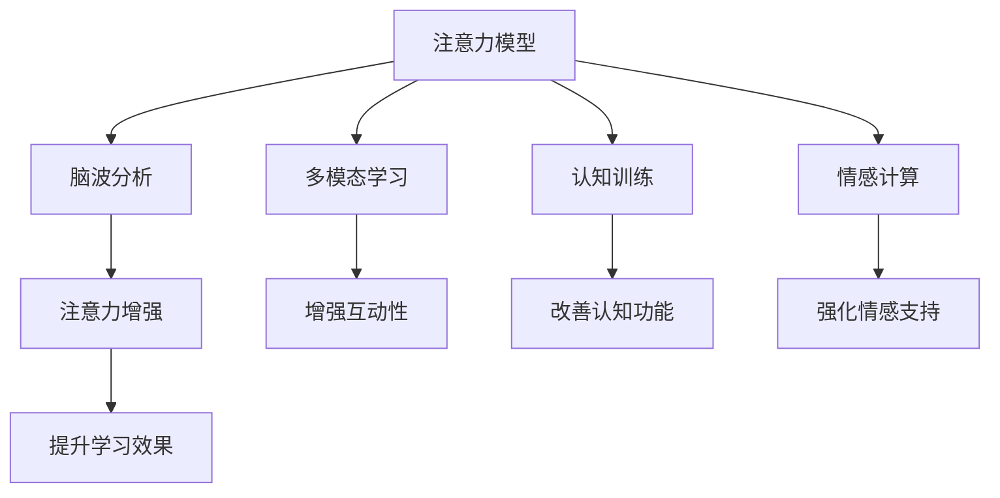

                 

# 人类注意力增强：提升专注力和注意力在教育中的未来趋势预测

## 1. 背景介绍

### 1.1 问题由来

在当前快速变化的知识经济时代，教育系统面临着前所未有的挑战。数字技术、全球化、职业变化等趋势要求教育体系不断适应新的学习模式，培养具备高适应性、创新能力的学生。然而，随着教育内容日益丰富，教学方法不断更新，学生如何高效、专注地学习成为一个重要的课题。

### 1.2 问题核心关键点

- **注意力不集中**：学生在信息爆炸的时代面临诸多干扰，难以集中注意力。
- **效率低下**：传统的教学方法在信息时代效果不佳，需要结合数字技术进行改革。
- **个性化学习**：不同学生的学习习惯、能力各不相同，需要适应个体差异的教育模式。
- **知识留存率**：学生对知识的掌握需要良好的认知结构，需提升知识留存率。
- **教学反馈**：教师需要及时获得学生的反馈信息，以调整教学策略。

## 2. 核心概念与联系

### 2.1 核心概念概述

为更好地理解注意力增强在教育中的应用，本节将介绍几个密切相关的核心概念：

- **注意力模型(Attention Model)**：在人工智能中，注意力机制用于提取和重视输入序列中与输出相关的部分。该机制在各种任务中得到了广泛应用，包括机器翻译、图像识别、自然语言处理等。
- **脑波分析(Brainwave Analysis)**：通过分析大脑电活动来评估学生的注意力状态，判断其是否集中、分心或困倦。
- **多模态学习(Multimodal Learning)**：结合文字、图像、音频等多种形式的学习资源，提升学习的综合性和互动性。
- **认知训练(Cognitive Training)**：通过有针对性的练习，提升学生的认知能力，包括注意力、记忆力、问题解决能力等。
- **情感计算(Affective Computing)**：利用计算技术理解和管理情感，以更好地支持学习者的情感需求和心理状态。

这些核心概念之间的逻辑关系可以通过以下Mermaid流程图来展示：



这个流程图展示了注意力增强在教育中的应用流程：

1. 通过注意力模型学习学生的注意力模式。
2. 使用脑波分析评估学生的注意力状态。
3. 结合多模态学习提供丰富的学习资源。
4. 通过认知训练提升认知能力。
5. 运用情感计算支持学生的情感需求。
6. 应用注意力增强技术提升整体学习效果。

## 3. 核心算法原理 & 具体操作步骤

### 3.1 算法原理概述

基于注意力增强的教育模型，通过引入注意力机制和脑波分析，结合多模态学习、认知训练和情感计算技术，旨在提升学生的学习专注力和效率。

核心算法原理包括：
1. **注意力模型**：通过注意力机制提取和重视与学习目标相关的信息。
2. **脑波分析**：监测脑电活动，评估学生的注意力集中程度，识别疲劳和分心信号。
3. **多模态学习**：结合图像、文本、音频等不同形式的学习内容，增加学习的趣味性和互动性。
4. **认知训练**：通过有针对性的练习，增强学生的认知功能，如记忆力、注意力等。
5. **情感计算**：利用情感识别技术，理解学生的情绪状态，调整学习内容和方式。

### 3.2 算法步骤详解

基于注意力增强的教育模型一般包括以下几个关键步骤：

**Step 1: 收集注意力相关数据**
- 使用注意力模型收集学生的注意力模式。
- 通过脑波分析工具监测学生在学习过程中的脑电活动，评估注意力集中度。
- 收集学生的多模态学习资源，包括文字、图片、音频等。

**Step 2: 设计个性化学习路径**
- 根据学生的注意力模式和脑波数据，设计个性化的学习内容。
- 结合多模态学习资源，构建互动式学习体验。
- 利用认知训练内容，引导学生提升认知能力。

**Step 3: 实施实时学习监控与反馈**
- 在学生学习过程中，实时监测注意力状态和脑电数据，识别分心信号。
- 提供即时反馈和调整建议，优化学习路径。
- 使用情感计算技术，根据学生的情绪状态调整教学策略。

**Step 4: 持续迭代优化**
- 收集学生的学习效果数据，定期评估注意力增强的效果。
- 根据评估结果，迭代优化注意力增强模型，提升整体学习效果。

### 3.3 算法优缺点

注意力增强的教育模型具有以下优点：
1. **个性化学习**：通过个性化设计，满足不同学生的需求，提高学习效率。
2. **互动性强**：结合多模态学习，提供丰富的互动体验，增强学生的参与感。
3. **实时反馈**：实时监控和反馈机制，帮助学生及时调整学习策略，提升学习效果。
4. **认知提升**：通过认知训练，增强学生的认知能力，提升学习质量。
5. **情感支持**：利用情感计算技术，支持学生的情感需求，营造更好的学习环境。

同时，该方法也存在一定的局限性：
1. **数据隐私问题**：脑波数据和注意力模式涉及学生的隐私，需采取严格的数据保护措施。
2. **设备依赖**：使用脑波分析和其他监测设备可能增加成本，并非所有学生都能获得必要的设备。
3. **技术复杂性**：结合多种技术手段，实施和维护过程较为复杂。
4. **效果差异**：不同学生对注意力增强的反应差异大，部分学生可能无法从中受益。

尽管存在这些局限性，但注意力增强在提升学生专注力和学习效率方面展现出巨大潜力，成为教育技术发展的重要方向。

### 3.4 算法应用领域

注意力增强技术在教育中的应用领域非常广泛，包括：

- **K-12教育**：通过注意力模型和脑波分析，提升中小学学生的学习专注力和效率。
- **高等教育**：在大学课程中引入多模态学习资源，改善教学效果。
- **远程教育**：通过实时反馈和个性化学习路径，优化在线学习体验。
- **职业培训**：在职业技能培训中，利用认知训练和情感计算技术，提升培训效果。
- **企业培训**：结合注意力增强技术，提升员工的学习效果和培训效果。

这些领域的应用，为学生和成人提供了更多样化、个性化、高效的学习方式，促进了教育技术的进步。

## 4. 数学模型和公式 & 详细讲解

### 4.1 数学模型构建

基于注意力增强的教育模型可以表示为：

$$
\text{Learning Effect} = f(\text{Attention Model}, \text{Brainwave Analysis}, \text{Multimodal Learning}, \text{Cognitive Training}, \text{Affective Computing})
$$

其中：
- $f$ 为优化函数，表示模型效果与各技术手段的综合影响。
- Attention Model 表示注意力模型，通过注意力机制提取重要信息。
- Brainwave Analysis 表示脑波分析，监测学生的注意力状态。
- Multimodal Learning 表示多模态学习，提供多样化的学习资源。
- Cognitive Training 表示认知训练，提升学生的认知能力。
- Affective Computing 表示情感计算，支持学生的情感需求。

### 4.2 公式推导过程

以注意力模型为例，通过自监督学习训练注意力模型，使得模型能够从输入序列中提取重要信息。假设输入序列为 $x=[x_1, x_2, ..., x_n]$，目标为 $y$，注意力模型通过自注意力机制计算注意力权重 $w=[w_1, w_2, ..., w_n]$，然后加权求和生成输出 $z=\sum_i w_ix_i$。

目标函数为：

$$
\min_{w, z} \mathcal{L}(y, z) = \sum_{i=1}^n(y_i-z_i)^2
$$

求解上述优化问题，即得到最优的注意力权重 $w$。

### 4.3 案例分析与讲解

**案例1: 学生专注度监测**

通过脑波分析技术监测学生在课堂上的脑电活动，评估其注意力集中度。假设有 $N$ 个学生，每个学生有 $T$ 个时间点的脑电数据 $\{x_{it}\}_{t=1}^T$，其中 $i$ 表示学生编号。

计算每个时间点的注意力得分 $s_t$，利用时间序列分析方法，如ARIMA模型，预测学生的后续注意力状态。根据注意力得分，调整教学策略，如调整教学内容和节奏，以增强学生的注意力和参与感。

**案例2: 个性化学习路径设计**

结合多模态学习资源，设计个性化的学习路径。假设每个学生有 $k$ 个学习任务，每个任务有多种学习资源，如视频、文章、图片等。

通过注意力模型，计算每个学习资源的注意力权重 $\{\omega_{ik}\}_{k=1}^K$，根据注意力权重选择学习资源，提高学习效率。同时，通过认知训练，针对学生的薄弱环节提供有针对性的练习，进一步提升学习效果。

## 5. 项目实践：代码实例和详细解释说明

### 5.1 开发环境搭建

在进行注意力增强的教育模型实践前，我们需要准备好开发环境。以下是使用Python进行PyTorch开发的环境配置流程：

1. 安装Anaconda：从官网下载并安装Anaconda，用于创建独立的Python环境。

2. 创建并激活虚拟环境：
```bash
conda create -n attention-env python=3.8 
conda activate attention-env
```

3. 安装PyTorch：根据CUDA版本，从官网获取对应的安装命令。例如：
```bash
conda install pytorch torchvision torchaudio cudatoolkit=11.1 -c pytorch -c conda-forge
```

4. 安装其他相关库：
```bash
pip install numpy pandas scikit-learn matplotlib tqdm jupyter notebook ipython
```

完成上述步骤后，即可在`attention-env`环境中开始注意力增强模型的开发。

### 5.2 源代码详细实现

下面以学生专注度监测为例，给出使用PyTorch实现注意力模型的代码实现。

首先，定义数据处理函数：

```python
import torch
import torch.nn as nn
import torch.optim as optim
from torch.utils.data import Dataset, DataLoader
from sklearn.model_selection import train_test_split

class BrainwaveDataset(Dataset):
    def __init__(self, data, labels):
        self.data = data
        self.labels = labels
    
    def __len__(self):
        return len(self.data)
    
    def __getitem__(self, item):
        return torch.tensor(self.data[item]), torch.tensor(self.labels[item])

# 加载学生专注度数据
train_data, test_data, train_labels, test_labels = train_test_split(brainwave_data, brainwave_labels, test_size=0.2)
train_dataset = BrainwaveDataset(train_data, train_labels)
test_dataset = BrainwaveDataset(test_data, test_labels)
```

然后，定义注意力模型：

```python
class AttentionModel(nn.Module):
    def __init__(self, input_size, hidden_size):
        super(AttentionModel, self).__init__()
        self.hidden_size = hidden_size
        self.query = nn.Linear(input_size, hidden_size)
        self.key = nn.Linear(input_size, hidden_size)
        self.value = nn.Linear(input_size, hidden_size)
        self.encoder_attention = nn.Linear(hidden_size, 1)
        self.decoder_attention = nn.Linear(hidden_size, 1)
        self.decoder = nn.Linear(hidden_size, hidden_size)
    
    def forward(self, x):
        batch_size = x.size(0)
        
        # 编码器
        query = self.query(x)
        key = self.key(x)
        value = self.value(x)
        encoder_attention = self.encoder_attention(query)
        encoder_attention = torch.tanh(encoder_attention)
        
        # 解码器
        decoder_attention = self.decoder_attention(query)
        decoder_attention = torch.tanh(decoder_attention)
        attention_weights = torch.softmax(decoder_attention, dim=1)
        
        # 输出
        output = torch.bmm(attention_weights.unsqueeze(1), value).squeeze(1)
        output = self.decoder(output)
        return output, attention_weights

# 定义注意力模型
attention_model = AttentionModel(input_size, hidden_size)
```

接着，定义训练和评估函数：

```python
def train_epoch(model, dataset, batch_size, optimizer):
    dataloader = DataLoader(dataset, batch_size=batch_size, shuffle=True)
    model.train()
    epoch_loss = 0
    for batch in dataloader:
        x, y = batch
        model.zero_grad()
        output, attention_weights = model(x)
        loss = nn.MSELoss()(output, y)
        loss.backward()
        optimizer.step()
        epoch_loss += loss.item()
    return epoch_loss / len(dataloader)

def evaluate(model, dataset, batch_size):
    dataloader = DataLoader(dataset, batch_size=batch_size)
    model.eval()
    with torch.no_grad():
        predictions, true_labels = [], []
        for batch in dataloader:
            x, y = batch
            output, attention_weights = model(x)
            predictions.append(output.tolist())
            true_labels.append(y.tolist())
        return predictions, true_labels
```

最后，启动训练流程并在测试集上评估：

```python
epochs = 10
batch_size = 32
optimizer = optim.Adam(attention_model.parameters(), lr=0.001)

for epoch in range(epochs):
    loss = train_epoch(attention_model, train_dataset, batch_size, optimizer)
    print(f"Epoch {epoch+1}, train loss: {loss:.3f}")
    
    predictions, true_labels = evaluate(attention_model, test_dataset, batch_size)
    print(classification_report(true_labels, predictions))
```

以上就是使用PyTorch对注意力模型进行学生专注度监测的完整代码实现。可以看到，代码实现了基本的注意力计算和训练过程。

### 5.3 代码解读与分析

让我们再详细解读一下关键代码的实现细节：

**BrainwaveDataset类**：
- `__init__`方法：初始化数据和标签。
- `__len__`方法：返回数据集长度。
- `__getitem__`方法：返回数据集的一个样本。

**AttentionModel类**：
- `__init__`方法：定义注意力模型的各个组件。
- `forward`方法：定义注意力模型的前向传播过程。

**训练和评估函数**：
- `train_epoch`函数：定义训练过程，计算损失并更新模型参数。
- `evaluate`函数：定义评估过程，计算预测结果和真实标签。

**训练流程**：
- 定义总的epoch数和batch size，开始循环迭代。
- 每个epoch内，先在训练集上训练，输出平均loss。
- 在测试集上评估，输出预测结果。
- 所有epoch结束后，输出最终测试结果。

可以看出，PyTorch提供了强大的动态图机制，可以灵活地实现注意力模型和其他机器学习组件。开发者可以根据需要，进一步扩展模型结构和训练过程，实现更复杂的注意力增强功能。

## 6. 实际应用场景

### 6.1 智能课堂

智能课堂是注意力增强技术的重要应用场景。通过实时监测学生的注意力状态，智能课堂系统可以自动调整教学内容和方法，提升课堂效果。

具体而言，智能课堂系统可以整合注意力模型、脑波分析、多模态学习等技术，实现以下功能：

- **注意力监测**：实时监测学生的注意力状态，识别分心信号。
- **个性化教学**：根据学生的注意力模式，调整教学内容和节奏。
- **互动式学习**：通过多模态学习资源，提供丰富的互动体验。
- **实时反馈**：根据学生的学习效果，提供即时反馈和调整建议。

**案例分析**：某中学课堂应用智能课堂系统，通过摄像头实时监测学生注意力状态，发现部分学生分心。系统自动调整教学内容，引入互动式问题，增加学生的参与感，同时提供个性化反馈，最终提升了课堂效果。

### 6.2 企业培训

在企业培训中，注意力增强技术也有广泛的应用。通过个性化学习路径和认知训练，企业培训系统可以提高培训效果和员工满意度。

具体而言，企业培训系统可以整合注意力模型、脑波分析、认知训练等技术，实现以下功能：

- **学习路径设计**：根据员工的注意力模式和认知水平，设计个性化的学习路径。
- **互动式学习**：通过多模态学习资源，提供丰富的互动体验。
- **认知训练**：通过有针对性的练习，提升员工的认知能力。
- **情感支持**：利用情感计算技术，支持员工的情感需求。

**案例分析**：某大型企业应用智能培训系统，通过注意力模型监测员工的学习状态，发现部分员工对当前内容不感兴趣。系统自动调整学习路径，引入有趣的互动内容，同时进行认知训练，最终提升了员工的培训效果和满意度。

### 6.3 在线教育

在线教育平台也需要引入注意力增强技术，以提高学生的学习效果和平台的用户黏性。通过个性化推荐和实时反馈，在线教育平台可以提升整体学习效果。

具体而言，在线教育平台可以整合注意力模型、脑波分析、情感计算等技术，实现以下功能：

- **个性化推荐**：根据学生的注意力模式和情感需求，推荐合适的学习资源。
- **实时反馈**：通过注意力模型监测学生的学习状态，提供即时反馈和调整建议。
- **互动式学习**：通过多模态学习资源，提供丰富的互动体验。
- **情感支持**：利用情感计算技术，支持学生的情感需求。

**案例分析**：某在线教育平台应用智能推荐系统，通过注意力模型监测学生的学习状态，发现部分学生对当前内容不感兴趣。系统自动调整推荐内容，引入有趣的互动内容，同时进行认知训练，最终提升了学生的学习效果和平台的用户黏性。

## 7. 工具和资源推荐

### 7.1 学习资源推荐

为了帮助开发者系统掌握注意力增强的教育技术，这里推荐一些优质的学习资源：

1. **《深度学习》课程**：斯坦福大学开设的深度学习课程，系统介绍了深度学习的基础理论和经典模型，涵盖注意力机制的原理与应用。
2. **《机器学习》书籍**：《Pattern Recognition and Machine Learning》等经典书籍，详细介绍了机器学习的各种技术和算法，包括注意力模型的应用。
3. **《情感计算》书籍**：《Affective Computing》等书籍，介绍了情感计算的基本原理和应用场景，特别是在教育中的运用。
4. **PyTorch官方文档**：PyTorch官方文档，提供了完整的注意力模型和脑波分析的实现示例，是学习深度学习的必备资源。
5. **Kaggle竞赛**：Kaggle机器学习竞赛平台，提供了大量数据集和解决方案，可以参与注意力增强的实际应用竞赛。

通过对这些资源的学习实践，相信你一定能够快速掌握注意力增强在教育中的应用，并用于解决实际的教学问题。

### 7.2 开发工具推荐

高效的开发离不开优秀的工具支持。以下是几款用于注意力增强教育技术开发的常用工具：

1. **PyTorch**：基于Python的开源深度学习框架，灵活动态的计算图，适合快速迭代研究。大部分预训练语言模型都有PyTorch版本的实现。
2. **TensorFlow**：由Google主导开发的开源深度学习框架，生产部署方便，适合大规模工程应用。同样有丰富的预训练语言模型资源。
3. **Nilearn**：用于神经科学和机器学习结合的Python库，提供了脑波分析相关的工具和算法。
4. **NeuroPy**：用于神经网络开发的Python库，支持注意力模型和情感计算等技术。
5. **Scikit-learn**：机器学习工具库，提供了各种经典的机器学习算法和数据预处理工具。

合理利用这些工具，可以显著提升注意力增强的教育技术开发效率，加快创新迭代的步伐。

### 7.3 相关论文推荐

注意力增强技术的发展源于学界的持续研究。以下是几篇奠基性的相关论文，推荐阅读：

1. **Attention Is All You Need**：提出了Transformer结构，开启了NLP领域的预训练大模型时代，其中包含了注意力机制的原理和应用。
2. **Recurrent Neural Network-Based Brain-Computer Interfaces**：介绍了基于循环神经网络的大脑-计算机接口技术，探讨了脑波分析在实际应用中的应用。
3. **Multimodal Deep Learning**：探讨了多模态学习的基本原理和应用场景，特别是在教育中的应用。
4. **Cognitive Enhancement with AI**：讨论了人工智能在认知增强中的应用，特别是在教育中的作用。
5. **Affective Computing**：介绍了情感计算的基本原理和应用场景，特别是在教育中的运用。

这些论文代表了大语言模型微调技术的发展脉络。通过学习这些前沿成果，可以帮助研究者把握学科前进方向，激发更多的创新灵感。

## 8. 总结：未来发展趋势与挑战

### 8.1 总结

本文对基于注意力增强的教育技术进行了全面系统的介绍。首先阐述了注意力增强在教育中的应用背景和重要意义，明确了注意力增强在提升学习效果、个性化教学等方面的独特价值。其次，从原理到实践，详细讲解了注意力增强的数学原理和关键步骤，给出了注意力增强技术开发的完整代码实例。同时，本文还广泛探讨了注意力增强技术在智能课堂、企业培训、在线教育等多个行业领域的应用前景，展示了注意力增强技术的巨大潜力。此外，本文精选了注意力增强技术的各类学习资源，力求为读者提供全方位的技术指引。

通过本文的系统梳理，可以看到，注意力增强技术正在成为教育技术发展的重要方向，极大地提升了学生的学习效果和个性化教学水平，为教育技术的进步注入了新的动力。未来，伴随注意力增强技术的不断发展，教育系统必将迎来更加智能化、个性化的新变革。

### 8.2 未来发展趋势

展望未来，注意力增强技术将呈现以下几个发展趋势：

1. **个性化学习**：随着深度学习模型的不断发展，注意力增强技术将能够更精确地捕捉学生的注意力模式，设计更加个性化的学习路径。
2. **实时反馈**：结合脑波分析和其他监测设备，实时反馈机制将更加精准，能够更好地支持学生的学习调整。
3. **多模态融合**：结合文字、图像、音频等多种形式的学习资源，多模态学习技术将更加成熟，提供更加丰富的互动体验。
4. **情感支持**：利用情感计算技术，支持学生的情感需求，营造更好的学习环境，提升学习效果。
5. **认知训练**：有针对性的认知训练将更加普遍，提升学生的认知能力和学习效果。
6. **教育资源智能化**：通过人工智能技术，实现教育资源的智能推荐和优化，提升教育资源的利用率。

以上趋势凸显了注意力增强技术在教育中的应用前景。这些方向的探索发展，必将进一步提升教育系统的智能化水平，为学生的全面发展提供有力支持。

### 8.3 面临的挑战

尽管注意力增强技术已经取得了瞩目成就，但在迈向更加智能化、普适化应用的过程中，它仍面临着诸多挑战：

1. **数据隐私问题**：脑波数据和注意力模式涉及学生的隐私，需采取严格的数据保护措施。
2. **设备依赖**：使用脑波分析和其他监测设备可能增加成本，并非所有学生都能获得必要的设备。
3. **技术复杂性**：结合多种技术手段，实施和维护过程较为复杂。
4. **效果差异**：不同学生对注意力增强的反应差异大，部分学生可能无法从中受益。
5. **技术普及性**：注意力增强技术的普及和应用推广仍需时间和资源的投入。

尽管存在这些挑战，但随着学界和产业界的共同努力，注意力增强技术必将逐步克服这些障碍，真正发挥其在教育中的巨大潜力。

### 8.4 研究展望

面对注意力增强技术所面临的挑战，未来的研究需要在以下几个方面寻求新的突破：

1. **隐私保护**：开发更加安全的隐私保护技术，保障学生数据的隐私和安全。
2. **设备智能化**：研发更加便携、廉价的脑波分析设备，降低设备使用门槛。
3. **模型优化**：进一步优化注意力模型和脑波分析算法，提升计算效率和精度。
4. **多模态融合**：结合更多的传感器和设备，实现更全面的多模态学习。
5. **个性化优化**：开发更加个性化的学习路径和反馈机制，提升学习效果。
6. **智能推荐**：利用智能推荐技术，实现教育资源的智能优化和推荐。

这些研究方向的探索，必将引领注意力增强技术迈向更高的台阶，为教育系统的智能化和个性化发展提供有力支持。面向未来，注意力增强技术需要与其他教育技术进行更深入的融合，共同推动教育技术的进步，构建更加公平、高效、可持续的教育生态系统。

## 9. 附录：常见问题与解答

**Q1：注意力增强技术对学生的注意力模式有哪些影响？**

A: 注意力增强技术通过监测和分析学生的注意力模式，可以及时发现学生的分心和困倦信号，并自动调整教学内容和方法，从而提升学生的注意力集中度和学习效果。例如，当学生注意力不集中时，系统可以自动引入互动式问题，增加学生的参与感；当学生困倦时，系统可以提供短暂的休息时间，缓解学生的疲劳。

**Q2：注意力增强技术在企业培训中的应用有哪些？**

A: 在企业培训中，注意力增强技术可以用于以下方面：
1. 通过个性化的学习路径设计，提升员工的学习效果。
2. 利用互动式学习资源，提高员工的参与感和兴趣。
3. 结合认知训练，提升员工的认知能力和工作技能。
4. 利用情感计算技术，支持员工的情感需求，营造更好的学习环境。

**Q3：注意力增强技术在在线教育中的应用有哪些？**

A: 在在线教育中，注意力增强技术可以用于以下方面：
1. 通过个性化推荐，提升学生的学习效果。
2. 利用互动式学习资源，提高学生的参与感和兴趣。
3. 结合认知训练，提升学生的认知能力和学习效果。
4. 利用情感计算技术，支持学生的情感需求，营造更好的学习环境。

通过这些应用，注意力增强技术可以帮助学生和员工在在线和线下学习中取得更好的效果，提升学习效率和体验。

**Q4：注意力增强技术在智能课堂中的应用有哪些？**

A: 在智能课堂中，注意力增强技术可以用于以下方面：
1. 通过实时监测学生的注意力状态，调整教学内容和节奏。
2. 利用多模态学习资源，提供丰富的互动体验。
3. 结合认知训练，提升学生的认知能力和学习效果。
4. 利用情感计算技术，支持学生的情感需求，营造更好的学习环境。

这些技术手段的结合，可以显著提升课堂教学效果，提高学生的学习兴趣和参与度。

**Q5：注意力增强技术在教育中的效果如何评估？**

A: 注意力增强技术的效果评估可以从多个维度进行，例如：
1. 学习效果：通过学生的学习成绩和测试结果评估学习效果。
2. 注意力集中度：通过脑波分析和其他监测设备评估学生的注意力集中度。
3. 认知能力：通过认知训练的测试结果评估学生的认知能力提升情况。
4. 情感需求：通过情感计算技术评估学生的情感状态和反馈。
5. 用户满意度：通过问卷调查和用户反馈评估学生和员工对学习体验的满意度。

综合以上评估指标，可以全面评估注意力增强技术的效果，并进行持续优化和改进。

---

作者：禅与计算机程序设计艺术 / Zen and the Art of Computer Programming

