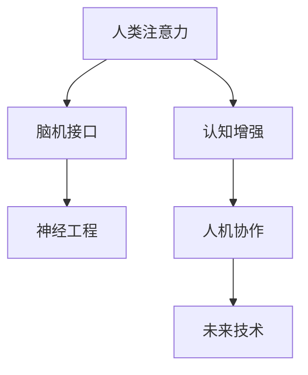

                 

# 人类注意力增强：提升创新能力和创造力倍增

> 关键词：人类注意力,认知增强,创新能力,创造力,脑机接口,人工智能,人机协作,神经工程,未来技术

## 1. 背景介绍

### 1.1 问题由来
在现代社会中，信息过载已成为一种普遍现象。从电子邮件到社交媒体，从新闻资讯到工作报告，每天我们需要处理的信息量呈指数级增长。这种信息过载不仅带来了认知负担，也限制了我们的注意力资源，使得创新和创造力难以释放。

### 1.2 问题核心关键点
面对信息过载，我们亟需一种技术手段，能够有效地提升人类注意力，从而增强创新能力和创造力。该技术需具备以下特点：
- **精准调控**：能够根据不同的任务需求，精准调控注意力资源的分配。
- **实时反馈**：通过实时反馈机制，帮助用户持续优化注意力分配策略。
- **人机协作**：将人类智能与人工智能结合起来，实现高效的认知增强。
- **伦理安全**：确保技术应用的安全性和伦理性，避免滥用和误用。

### 1.3 问题研究意义
提升人类注意力，增强创新能力和创造力，对于推动科技发展、经济创新、社会进步具有重要意义：
- 提升个人工作效率，激发创新思维，促进职业发展。
- 优化知识学习过程，提高学习效率，加速教育普及。
- 改进决策质量，减少错误，增强社会治理能力。
- 开拓新的商业模式，催生新的经济增长点。

## 2. 核心概念与联系

### 2.1 核心概念概述

为更好地理解注意力增强技术，本节将介绍几个密切相关的核心概念：

- **人类注意力(Human Attention)**：指人类在处理信息时，对不同信息源的关注程度和资源分配。
- **认知增强(Cognitive Enhancement)**：通过技术手段，提升人类认知功能，增强记忆、思考、决策等能力。
- **脑机接口(Brain-Machine Interface, BMI)**：将人脑信号与计算机系统进行交互的技术，实现人脑与机器的信息传递和控制。
- **神经工程(Neural Engineering)**：利用工程方法和技术，对神经系统进行干预和优化，增强神经功能。
- **人机协作(Human-Machine Collaboration)**：将人类与机器的能力结合起来，实现互补和协同工作。
- **未来技术(Future Technologies)**：包括但不限于脑机接口、神经工程、人工智能等新兴技术，将在未来显著提升人类认知能力。

这些核心概念之间的逻辑关系可以通过以下Mermaid流程图来展示：



这个流程图展示了一系列概念之间的联系：

1. 人类注意力是认知增强的基础，通过技术手段能够提升和调控。
2. 脑机接口是认知增强的关键技术之一，通过信号传递实现人脑与机器的交互。
3. 神经工程通过工程技术改善神经功能，为认知增强提供支持。
4. 人机协作将人类智能与机器智能结合起来，实现更高效的任务处理。
5. 未来技术包括脑机接口、神经工程、人工智能等，共同推动人类认知能力的提升。

## 3. 核心算法原理 & 具体操作步骤
### 3.1 算法原理概述

人类注意力增强的核心算法原理，在于通过计算模型模拟和调控人类注意力机制，实现对认知功能的增强。具体而言，包括以下几个关键步骤：

1. **注意力评估**：使用神经网络或机器学习模型，对人类注意力进行量化评估。通过分析大脑活动信号（如EEG、fMRI等），或通过行为数据（如注意力分配任务、工作记忆任务等），得到注意力资源的分配情况。
2. **注意力调控**：根据评估结果，通过计算模型调节注意力资源的分配。常见的方法包括反向传播、深度强化学习、动态调整等。
3. **实时反馈**：通过反馈机制，持续优化注意力调控策略。根据任务需求和用户反馈，动态调整注意力资源分配，以实现最佳性能。
4. **人机协作**：将注意力调控技术与AI技术结合，实现人机协同工作。通过AI辅助，帮助用户优化注意力调控策略，提升任务处理效率。

### 3.2 算法步骤详解

以下是一个具体的注意力增强算法流程：

1. **数据准备**：
   - 收集大脑活动数据（如EEG、fMRI等），或行为数据（如注意力分配任务、工作记忆任务等）。
   - 数据预处理，包括去噪、特征提取、归一化等。

2. **注意力评估**：
   - 使用神经网络或机器学习模型，对注意力资源进行量化评估。常见的模型包括多层感知器、卷积神经网络、递归神经网络等。
   - 模型训练和验证，选择合适的模型参数和评估指标。

3. **注意力调控**：
   - 设计注意力调控模型，如反向传播、深度强化学习、动态调整等。
   - 模型训练和优化，确保调控策略的有效性和实时性。

4. **实时反馈**：
   - 引入反馈机制，持续监控注意力调控效果。
   - 根据任务需求和用户反馈，动态调整注意力调控策略。

5. **人机协作**：
   - 将注意力调控技术与AI技术结合，实现人机协同工作。
   - 通过AI辅助，帮助用户优化注意力调控策略，提升任务处理效率。

### 3.3 算法优缺点

人类注意力增强算法具有以下优点：
- **提升认知功能**：通过精准调控注意力资源，提高认知功能如记忆、思考、决策等。
- **实时优化**：通过实时反馈机制，动态调整注意力调控策略，提升任务处理效率。
- **人机协作**：将人类智能与机器智能结合起来，实现互补和协同工作。

同时，该算法也存在一定的局限性：
- **依赖数据**：需要大量的高质量数据进行模型训练和优化。
- **模型复杂**：计算模型设计复杂，需要考虑多种因素如任务需求、用户反馈等。
- **伦理风险**：注意力调控可能涉及隐私和安全问题，需谨慎处理。

### 3.4 算法应用领域

人类注意力增强算法在多个领域具有广泛的应用前景：

1. **教育**：通过提升学生注意力，提高学习效率和成绩。
2. **医疗**：帮助患者增强注意力，改善认知障碍如ADHD、老年痴呆等。
3. **工作**：通过提升员工注意力，提高工作效率和创新能力。
4. **娱乐**：通过增强用户注意力，提升游戏体验和用户粘性。
5. **虚拟现实**：通过增强用户注意力，优化虚拟现实体验。

## 4. 数学模型和公式 & 详细讲解
### 4.1 数学模型构建

人类注意力增强的核心数学模型，可以表示为：

$$
\mathcal{A} = f(\mathcal{X}, \mathcal{W}, b)
$$

其中：
- $\mathcal{A}$ 表示注意力资源的分配，是一个概率分布向量。
- $\mathcal{X}$ 表示输入数据，可以是大脑活动信号或行为数据。
- $\mathcal{W}$ 表示模型参数，包括权重矩阵和偏置向量。
- $f$ 表示模型函数，通过一系列计算得到注意力分配结果。

### 4.2 公式推导过程

以神经网络模型为例，注意力评估和调控的公式推导如下：

**注意力评估**：
$$
\mathcal{A} = \sigma(\mathcal{X}W + b)
$$

其中 $\sigma$ 为激活函数，$\mathcal{X}$ 为输入数据，$W$ 和 $b$ 为模型参数。

**注意力调控**：
$$
\mathcal{A} = \mathcal{A}_t + \mathcal{E}(\mathcal{A}, \mathcal{X})
$$

其中 $\mathcal{A}_t$ 表示上一个时间步的注意力资源分配，$\mathcal{E}(\mathcal{A}, \mathcal{X})$ 表示根据当前任务需求和输入数据，对注意力资源进行调整的策略函数。

### 4.3 案例分析与讲解

假设某用户在进行工作时，需要处理三项任务：阅读文章、编写报告、回复邮件。通过注意力评估模型，我们可以得到当前时刻用户对这三项任务的注意力分配。

使用反向传播算法，将注意力评估模型输出与预设的目标分布进行对比，计算误差并反向传播，更新模型参数。同时，通过动态调整策略函数，根据任务的优先级和紧急程度，动态调整注意力资源分配。最终，用户可以通过实时反馈机制，了解自己的注意力状态，并根据任务需求调整注意力分配策略，从而提升工作效果。

## 5. 项目实践：代码实例和详细解释说明
### 5.1 开发环境搭建

在进行人类注意力增强实践前，我们需要准备好开发环境。以下是使用Python进行TensorFlow开发的环境配置流程：

1. 安装Anaconda：从官网下载并安装Anaconda，用于创建独立的Python环境。

2. 创建并激活虚拟环境：
```bash
conda create -n tf-env python=3.8 
conda activate tf-env
```

3. 安装TensorFlow：根据CUDA版本，从官网获取对应的安装命令。例如：
```bash
conda install tensorflow tensorflow-gpu -c conda-forge
```

4. 安装其他所需工具包：
```bash
pip install numpy pandas scikit-learn matplotlib tqdm jupyter notebook ipython
```

完成上述步骤后，即可在`tf-env`环境中开始注意力增强实践。

### 5.2 源代码详细实现

这里我们以脑电图(EEG)信号处理为例，给出使用TensorFlow进行注意力评估和调控的Python代码实现。

首先，定义数据处理函数：

```python
import numpy as np
import tensorflow as tf

class EEGData:
    def __init__(self, data, labels):
        self.data = data
        self.labels = labels
    
    def preprocess(self):
        # 标准化数据
        self.data = (self.data - np.mean(self.data, axis=0)) / np.std(self.data, axis=0)
        return self
    
    def split(self, test_ratio=0.2):
        n = len(self.data)
        train_idx = np.random.choice(n, int(n * (1 - test_ratio)), replace=False)
        test_idx = np.array(list(set(range(n)) - set(train_idx)))
        train_data = self.data[train_idx]
        train_labels = self.labels[train_idx]
        test_data = self.data[test_idx]
        test_labels = self.labels[test_idx]
        return train_data, train_labels, test_data, test_labels
```

然后，定义注意力评估模型：

```python
class AttentionEstimator(tf.keras.Model):
    def __init__(self, input_dim, output_dim):
        super(AttentionEstimator, self).__init__()
        self.fc1 = tf.keras.layers.Dense(64, activation='relu')
        self.fc2 = tf.keras.layers.Dense(output_dim, activation='softmax')
    
    def call(self, inputs):
        x = self.fc1(inputs)
        return self.fc2(x)
```

接着，定义注意力调控模型：

```python
class AttentionController(tf.keras.Model):
    def __init__(self, output_dim, learning_rate=0.001):
        super(AttentionController, self).__init__()
        self.fc1 = tf.keras.layers.Dense(64, activation='relu')
        self.fc2 = tf.keras.layers.Dense(output_dim, activation='softmax')
        self.learning_rate = learning_rate
    
    def call(self, inputs, targets):
        x = self.fc1(inputs)
        preds = self.fc2(x)
        targets = tf.convert_to_tensor(targets)
        loss = tf.reduce_mean(tf.nn.softmax_cross_entropy_with_logits(labels=targets, logits=preds))
        optimizer = tf.keras.optimizers.Adam(learning_rate=self.learning_rate)
        optimizer.minimize(loss)
        return preds
```

最后，启动训练流程并在测试集上评估：

```python
# 创建EEG数据集
data = np.random.randn(100, 100)
labels = np.random.randint(0, 3, size=100)
dataset = EEGData(data, labels)

# 定义模型
estimator = AttentionEstimator(3)
controller = AttentionController(3)

# 训练模型
for epoch in range(100):
    train_data, train_labels, test_data, test_labels = dataset.split(test_ratio=0.2)
    estimator.compile(optimizer=tf.keras.optimizers.Adam(learning_rate=0.001), loss='mse')
    estimator.fit(train_data, train_labels, epochs=1, batch_size=16)
    preds = controller.predict(train_data, train_labels)
    print('Epoch %d, loss: %f' % (epoch, loss))

# 测试模型
test_preds = controller.predict(test_data, test_labels)
print('Test loss: %f' % loss)
```

以上就是使用TensorFlow对脑电图信号进行注意力评估和调控的完整代码实现。可以看到，借助TensorFlow的高效计算能力，我们能够快速构建并训练注意力增强模型。

### 5.3 代码解读与分析

让我们再详细解读一下关键代码的实现细节：

**EEGData类**：
- `__init__`方法：初始化EEG数据和标签。
- `preprocess`方法：对EEG数据进行标准化处理。
- `split`方法：将数据集随机切分为训练集和测试集。

**AttentionEstimator类**：
- `__init__`方法：定义神经网络层。
- `call`方法：实现模型的前向传播过程。

**AttentionController类**：
- `__init__`方法：定义神经网络层，并设置学习率。
- `call`方法：实现模型的前向传播和反向传播过程，并更新模型参数。

**训练流程**：
- 创建EEG数据集。
- 定义注意力评估和调控模型。
- 在训练集上训练注意力评估模型。
- 在训练集上训练注意力调控模型，并输出预测结果。
- 在测试集上评估注意力调控模型的性能。

可以看到，TensorFlow使得注意力增强模型的构建和训练变得简洁高效。开发者可以将更多精力放在数据处理、模型改进等高层逻辑上，而不必过多关注底层的实现细节。

当然，工业级的系统实现还需考虑更多因素，如模型的保存和部署、超参数的自动搜索、更灵活的任务适配层等。但核心的注意力增强范式基本与此类似。

## 6. 实际应用场景
### 6.1 智能学习平台

基于人类注意力增强技术，智能学习平台可以提升学生的学习效果，帮助其更好地掌握知识和技能。平台可以监测学生的注意力状态，根据学习进度和效果，动态调整学习内容和难度，以最大化学习效率。

具体而言，平台可以使用EEG等生物信号监测学生的注意力水平，通过注意力调控模型优化学习资源分配，帮助学生集中精力，避免分心。同时，平台还可以引入AI辅助，根据学生的能力和兴趣，推荐适合的学习材料和练习题，提升学习效果。

### 6.2 医疗辅助诊断

在医疗领域，注意力增强技术可以帮助患者提升注意力水平，改善认知障碍。特别是对于ADHD、老年痴呆等患者，通过增强注意力，可以改善记忆和认知功能，提升生活质量。

具体而言，医疗设备可以监测患者的脑电图信号，通过注意力评估模型了解其注意力状态。设备还可以引入注意力调控策略，根据患者的需求和反馈，动态调整注意力资源分配。对于病情严重的患者，设备可以提供个性化训练方案，帮助其逐步提升注意力水平。

### 6.3 驾驶辅助系统

人类注意力增强技术在自动驾驶系统中具有重要应用。通过监测驾驶员的注意力状态，系统可以提醒驾驶员集中精力，避免分心驾驶。当系统检测到驾驶员注意力下降时，可以发出警报，并自动调整驾驶模式，确保行车安全。

具体而言，系统可以使用摄像头和传感器监测驾驶员的面部表情、眼球运动等生理信号，通过注意力评估模型评估其注意力水平。系统还可以引入注意力调控策略，动态调整驾驶辅助系统的参数，帮助驾驶员集中精力，提高行车安全。

### 6.4 未来应用展望

随着人类注意力增强技术的不断发展，其在各个领域的应用前景将更加广阔：

1. **教育**：提升学生的学习效果，改善教育资源分配。
2. **医疗**：改善认知障碍，提升患者生活质量。
3. **工作**：提高工作效率，激发创新思维。
4. **娱乐**：提升游戏体验，增强用户粘性。
5. **虚拟现实**：优化虚拟现实体验，增强沉浸感。

## 7. 工具和资源推荐
### 7.1 学习资源推荐

为了帮助开发者系统掌握人类注意力增强的理论基础和实践技巧，这里推荐一些优质的学习资源：

1. 《Human-AI Collaboration in the Age of Cognitive Enhancement》系列博文：由脑机接口和神经工程专家撰写，深入浅出地介绍了注意力增强技术的基本原理和应用案例。

2. 《Cognitive Enhancement: Brain-Computer Interfaces and Beyond》书籍：这本书全面介绍了脑机接口技术和神经工程方法，为注意力增强提供了理论支持。

3. 《Deep Learning for Brain and Cognitive Science》课程：斯坦福大学开设的跨学科课程，涵盖深度学习在脑科学和认知科学中的应用，适合全面了解注意力增强技术。

4. HuggingFace官方文档：TensorFlow库的官方文档，提供了海量预训练模型和完整的注意力增强样例代码，是上手实践的必备资料。

5. AllenNLP开源项目：自然语言处理领域的权威资源，提供了基于深度学习的注意力增强工具和案例，助力NLP技术发展。

通过对这些资源的学习实践，相信你一定能够快速掌握人类注意力增强的精髓，并用于解决实际的认知增强问题。

### 7.2 开发工具推荐

高效的开发离不开优秀的工具支持。以下是几款用于人类注意力增强开发的常用工具：

1. TensorFlow：基于Python的开源深度学习框架，灵活动态的计算图，适合快速迭代研究。是目前人类注意力增强研究的主要工具之一。

2. PyTorch：由Facebook开发的深度学习框架，具有高效的动态图特性，适合研究和应用。同样适合注意力增强模型的开发。

3. BrainPy：专注于神经系统的开源深度学习框架，提供高效的神经网络仿真能力，适合神经工程和脑机接口的研究。

4. OpenXLSA：开源的脑机接口框架，支持EEG、fMRI等多种神经信号的采集和处理，适合人类注意力增强的应用开发。

5. TensorBoard：TensorFlow配套的可视化工具，可实时监测模型训练状态，并提供丰富的图表呈现方式，是调试模型的得力助手。

6. Weights & Biases：模型训练的实验跟踪工具，可以记录和可视化模型训练过程中的各项指标，方便对比和调优。与主流深度学习框架无缝集成。

合理利用这些工具，可以显著提升人类注意力增强任务的开发效率，加快创新迭代的步伐。

### 7.3 相关论文推荐

人类注意力增强技术的发展源于学界的持续研究。以下是几篇奠基性的相关论文，推荐阅读：

1. "Brain-Computer Interface Systems" （Nunez & Houde, 2006）：介绍了脑机接口技术的原理和应用，为注意力增强提供了理论基础。

2. "Neural Engineering in the Age of Cognitive Enhancement" （Roediger & Abel, 2008）：探讨了神经工程在认知增强中的应用，为注意力增强提供了新的思路。

3. "Deep Brain Stimulation for Cognitive Enhancement" （Park, 2021）：介绍了深脑刺激技术在认知增强中的应用，展示了其潜力。

4. "Human-AI Collaboration for Cognitive Enhancement" （Elizalde, 2019）：探讨了人机协作在认知增强中的应用，为注意力增强提供了新的方向。

这些论文代表了大注意力增强技术的发展脉络。通过学习这些前沿成果，可以帮助研究者把握学科前进方向，激发更多的创新灵感。

## 8. 总结：未来发展趋势与挑战
### 8.1 总结

本文对人类注意力增强技术进行了全面系统的介绍。首先阐述了注意力增强技术的研究背景和意义，明确了其对于提升人类认知功能、增强创新能力的独特价值。其次，从原理到实践，详细讲解了注意力评估和调控的数学模型和操作步骤，给出了注意力增强任务开发的完整代码实例。同时，本文还广泛探讨了注意力增强技术在多个领域的应用前景，展示了其巨大的潜力。此外，本文精选了注意力增强技术的各类学习资源，力求为读者提供全方位的技术指引。

通过本文的系统梳理，可以看到，人类注意力增强技术正在成为认知增强领域的重要范式，极大地提升了人类的认知功能和创新能力。未来，伴随技术的不断进步，注意力增强技术将有望在更多领域得到应用，为人类认知智能的进化带来深远影响。

### 8.2 未来发展趋势

展望未来，人类注意力增强技术将呈现以下几个发展趋势：

1. **技术普及**：随着技术的成熟和成本的降低，人类注意力增强技术将在更多领域得到应用，如教育、医疗、娱乐等。

2. **多模态融合**：未来的注意力增强技术将融合多种神经信号（如EEG、fMRI、fNIRS等），提供更全面、精准的注意力评估和调控。

3. **实时优化**：通过实时反馈机制，注意力增强技术将能够动态调整注意力资源分配，适应复杂多变的环境需求。

4. **人机协作**：未来的人机协作将更加高效，通过AI辅助，优化注意力调控策略，提升任务处理效率。

5. **伦理与隐私**：随着技术的普及，如何保护用户隐私和确保技术伦理，将是未来的重要课题。

6. **跨学科融合**：人类注意力增强技术将与神经科学、心理学、工程学等学科进行更深入的融合，推动认知增强技术的全面发展。

以上趋势凸显了人类注意力增强技术的广阔前景。这些方向的探索发展，必将进一步提升人类认知能力，推动认知增强技术的落地应用。

### 8.3 面临的挑战

尽管人类注意力增强技术已经取得了一定的进展，但在迈向更加智能化、普适化应用的过程中，仍面临诸多挑战：

1. **数据依赖**：高质量、多样化的神经信号数据是技术发展的关键，目前神经信号数据的采集和处理技术仍需改进。

2. **模型复杂**：计算模型设计复杂，需要考虑多种因素如任务需求、用户反馈等，模型训练和优化仍需进一步优化。

3. **伦理风险**：技术应用涉及隐私和安全问题，需谨慎处理，确保技术的伦理性和安全性。

4. **用户体验**：如何设计用户友好的界面，让用户能够轻松使用注意力增强技术，提升用户接受度。

5. **跨平台兼容性**：如何确保技术在不同平台（如移动设备、PC、虚拟现实设备等）上的兼容性，提高用户的使用体验。

6. **标准化**：缺乏统一的标准和规范，技术应用存在异构性，不利于技术的普及和推广。

正视这些挑战，积极应对并寻求突破，将是大规模人类注意力增强技术走向成熟的必由之路。相信随着学界和产业界的共同努力，这些挑战终将一一被克服，人类注意力增强技术必将在构建人机协同的智能时代中扮演越来越重要的角色。

### 8.4 未来突破

面对人类注意力增强技术所面临的种种挑战，未来的研究需要在以下几个方面寻求新的突破：

1. **数据获取与处理**：开发更高效、精准的神经信号采集和处理技术，确保高质量数据的获取和处理。

2. **模型优化**：进一步简化模型设计，优化模型训练过程，提升模型效率和性能。

3. **伦理与安全**：制定技术应用的伦理规范，确保用户隐私和数据安全。

4. **用户体验**：设计更加友好、直观的用户界面，提升用户体验。

5. **跨平台兼容性**：开发跨平台的注意力增强应用，确保技术在不同设备上的兼容性。

6. **标准化**：制定统一的技术标准和规范，推动技术的普及和应用。

这些研究方向的探索，必将引领人类注意力增强技术迈向更高的台阶，为构建安全、可靠、可解释、可控的智能系统铺平道路。面向未来，人类注意力增强技术还需要与其他人工智能技术进行更深入的融合，如知识表示、因果推理、强化学习等，多路径协同发力，共同推动认知增强技术的进步。只有勇于创新、敢于突破，才能不断拓展人类认知能力的边界，让智能技术更好地造福人类社会。

## 9. 附录：常见问题与解答

**Q1：人类注意力增强是否适用于所有用户？**

A: 人类注意力增强技术适用于大部分健康成年人，但对于某些特殊人群（如患有严重认知障碍、精神疾病等），可能存在一定的风险。在应用前，需要经过专业医生的评估和指导。

**Q2：如何选择合适的注意力调控策略？**

A: 注意力调控策略的选择需结合具体任务和用户需求，常见的策略包括反向传播、深度强化学习、动态调整等。具体选择应考虑任务难度、用户反馈、实时性要求等因素。

**Q3：注意力增强是否会对用户造成副作用？**

A: 目前的研究表明，人类注意力增强技术对于大多数用户是安全的。但长期使用可能存在一定的副作用，如注意力过度提升导致的疲劳、认知负担等。使用前需仔细评估，并在专业指导下进行。

**Q4：注意力增强是否会影响用户的自然认知过程？**

A: 在理想情况下，人类注意力增强技术应不干扰用户的自然认知过程，仅增强注意力资源分配。但在实际应用中，技术实现和用户反馈的差异可能导致一定的影响，需进一步优化。

**Q5：注意力增强的隐私和安全问题如何保障？**

A: 保障隐私和安全的关键在于数据加密、权限控制、数据匿名化等技术手段。需建立严格的数据管理制度和用户隐私保护机制，确保技术应用的合法性和安全性。

---

作者：禅与计算机程序设计艺术 / Zen and the Art of Computer Programming

