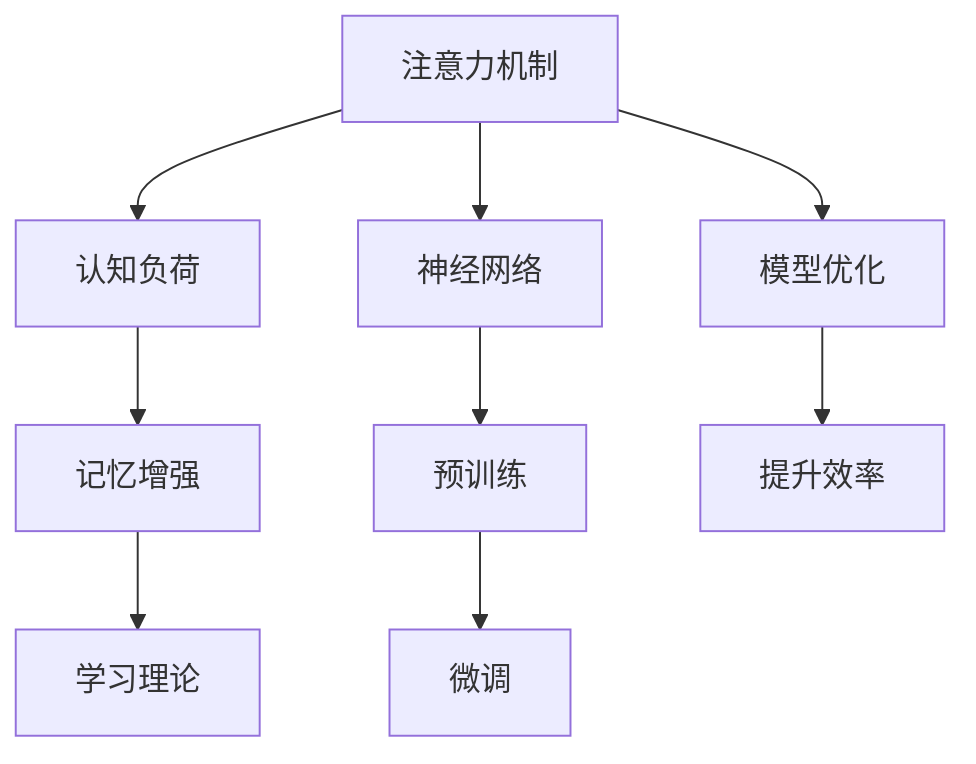

                 

# 人类注意力增强：提升学习效率和知识保留

> 关键词：注意力机制,认知负荷,记忆增强,学习理论,神经网络

## 1. 背景介绍

在现代信息爆炸的时代，人类面临的知识量前所未有地增长。如何在海量信息中找到关键内容，并有效地将其转化为自身的知识和技能，是一个巨大的挑战。无论是学术研究、日常工作还是学习新技能，都迫切需要提升人类学习的效率和知识保留能力。

近年来，心理学、认知科学和人工智能领域的交叉研究取得了显著进展，特别是神经网络中的注意力机制被引入，为提升学习效率和知识保留提供了一条新的路径。本文将系统介绍注意力机制的工作原理，并结合认知负荷和记忆增强的理论，阐述如何在学习和工作中应用注意力机制，以期帮助读者提升个人学习效率和知识保留能力。

## 2. 核心概念与联系

### 2.1 核心概念概述

为更好地理解注意力机制如何提升学习效率和知识保留，本节将介绍几个密切相关的核心概念：

- 注意力机制(Attention Mechanism)：神经网络中的一种机制，用于在输入序列中筛选出最相关的部分进行加权处理，以突出重要的信息，抑制无关的噪声。
- 认知负荷(Cognitive Load)：在学习过程中，记忆和思考所消耗的心理资源。过高的认知负荷会导致学习效率下降和知识遗忘。
- 记忆增强(Memory Enhancement)：通过优化神经网络结构或学习算法，提升信息存储和回忆能力的技术。
- 学习理论(Learning Theory)：研究人类和机器学习过程的理论，包括行为主义、认知主义和建构主义等。
- 神经网络(Neural Network)：通过模拟人类神经元的信息处理方式，实现复杂模式识别和预测的计算模型。

这些核心概念之间的逻辑关系可以通过以下Mermaid流程图来展示：



这个流程图展示了一些核心概念之间的联系：

1. 注意力机制在神经网络中筛选信息，降低认知负荷。
2. 记忆增强通过优化神经网络结构，提升信息存储和回忆能力。
3. 学习理论指导注意力机制和记忆增强的设计与实践。
4. 神经网络利用注意力机制和记忆增强提升模型性能。

这些概念共同构成了提升学习效率和知识保留的框架，使其能够帮助人类在信息时代中更好地学习新知识。

## 3. 核心算法原理 & 具体操作步骤
### 3.1 算法原理概述

注意力机制的核心思想是在输入序列中给不同的元素赋予不同的权重，用于筛选出最相关的部分进行处理，从而突出重要信息，抑制无关噪声。在神经网络中，注意力机制通常通过多头自注意力机制(Multi-Head Self-Attention)实现，其原理可以总结如下：

1. **输入表示**：将输入序列 $X$ 映射为一个表示矩阵 $H \in \mathbb{R}^{N \times D}$，其中 $N$ 为序列长度，$D$ 为嵌入维度。
2. **注意力计算**：对表示矩阵 $H$ 进行自注意力计算，得到注意力权重矩阵 $A \in \mathbb{R}^{N \times N}$。注意力权重矩阵表示每个位置对其他位置的注意力程度。
3. **加权求和**：对表示矩阵 $H$ 按注意力权重矩阵 $A$ 进行加权求和，得到注意力上下文表示 $C \in \mathbb{R}^{N \times D}$。

注意力机制的计算公式如下：

$$
A_{ij} = \frac{\exp(\text{score}(Q_i, K_j))}{\sum_k \exp(\text{score}(Q_i, K_k))}
$$

其中，$Q$、$K$ 为查询向量和键向量，$\text{score}(Q_i, K_j)$ 表示 $Q_i$ 和 $K_j$ 之间的相似度，通常使用点积表示：

$$
\text{score}(Q_i, K_j) = Q_i \cdot K_j^T
$$

加权求和的公式为：

$$
C_i = \sum_j A_{ij} K_j
$$

通过注意力机制，神经网络可以动态地调整输入序列中的信息权重，使其更加聚焦于与任务相关的部分，从而提升模型的表达能力和泛化能力。

### 3.2 算法步骤详解

使用注意力机制提升学习效率和知识保留的主要步骤如下：

**Step 1: 准备输入数据**
- 收集相关领域的文本、图像、视频等数据，并进行预处理和标注。
- 将数据集划分为训练集、验证集和测试集。

**Step 2: 构建神经网络模型**
- 选择合适的神经网络模型，如Transformer、LSTM、GRU等，并添加注意力机制。
- 设计合适的损失函数和优化器，如交叉熵损失、AdamW等。

**Step 3: 训练模型**
- 在训练集上对模型进行有监督训练，优化模型的注意力权重和参数。
- 周期性在验证集上评估模型性能，根据性能指标决定是否调整模型超参数。
- 重复上述步骤直至模型在测试集上达到预设的精度。

**Step 4: 应用模型**
- 将训练好的模型应用于实际场景，如文本理解、图像识别、语音识别等任务。
- 对新样本进行推理预测，输出相应的结果。

### 3.3 算法优缺点

注意力机制在提升学习效率和知识保留方面具有以下优点：

1. 提升信息筛选能力。通过动态调整输入序列中的信息权重，注意力机制能够突出重要信息，抑制无关噪声，从而提升模型的表达能力和泛化能力。
2. 降低认知负荷。注意力机制可以帮助人类更好地聚焦于任务相关的信息，减少不必要的信息处理，降低认知负荷，提高学习效率。
3. 促进记忆增强。注意力机制能够帮助人类更好地存储和回忆重要信息，提升记忆效果。
4. 应用于多种任务。注意力机制可以应用于文本理解、图像识别、语音识别等多种NLP任务，具有广泛的应用前景。

同时，注意力机制也存在一些局限性：

1. 计算复杂度高。注意力机制的计算量较大，特别是在大规模数据集上训练时，计算资源的消耗较高。
2. 模型可解释性不足。注意力机制的内部计算过程较为复杂，缺乏直观的解释，难以理解和调试。
3. 对输入数据要求高。注意力机制对输入数据的格式和质量要求较高，如果输入数据不符合要求，模型性能可能大打折扣。
4. 容易过拟合。在训练过程中，注意力权重容易过拟合训练数据，导致模型泛化性能下降。

尽管存在这些局限性，但注意力机制在提升学习效率和知识保留方面具有显著优势，是当前NLP领域研究的热点方向之一。

### 3.4 算法应用领域

注意力机制已经广泛应用于自然语言处理(NLP)、计算机视觉(CV)、语音识别(SR)等多个领域，成为提升模型性能的重要手段。

在自然语言处理领域，注意力机制已被广泛用于文本分类、机器翻译、情感分析、问答系统等任务。通过注意力机制，模型能够更好地理解文本中的关键信息，提升任务的准确率和效果。

在计算机视觉领域，注意力机制被应用于图像分类、目标检测、图像分割等任务。通过引入注意力机制，模型能够更好地处理复杂的视觉信息，提高识别的准确率和鲁棒性。

在语音识别领域，注意力机制被应用于语音转换、语音识别、语音合成等任务。通过注意力机制，模型能够更好地处理时序信息，提升识别的准确率和流畅性。

除了上述这些典型应用外，注意力机制还被创新性地应用到推荐系统、动态网络设计等场景中，为NLP技术带来了全新的突破。随着注意力机制的不断演进，相信其在更多领域的应用前景将更加广阔。

## 4. 数学模型和公式 & 详细讲解  
### 4.1 数学模型构建

本节将使用数学语言对注意力机制的工作原理进行更加严格的刻画。

记输入序列 $X$ 的长度为 $N$，嵌入维度为 $D$。将输入序列 $X$ 表示为矩阵 $H \in \mathbb{R}^{N \times D}$。假设注意力机制的查询向量 $Q$ 和键向量 $K$ 的嵌入维度也为 $D$，则注意力权重矩阵 $A$ 的计算公式为：

$$
A_{ij} = \frac{\exp(\text{score}(Q_i, K_j))}{\sum_k \exp(\text{score}(Q_i, K_k))}
$$

其中，$\text{score}(Q_i, K_j) = Q_i \cdot K_j^T$。

加权求和的公式为：

$$
C_i = \sum_j A_{ij} K_j
$$

通过上述公式，可以计算得到注意力上下文表示 $C \in \mathbb{R}^{N \times D}$。

### 4.2 公式推导过程

在具体实现注意力机制时，通常会使用多头自注意力机制(Multi-Head Self-Attention)。多头自注意力机制将输入序列 $X$ 映射为多个不同的表示矩阵，对每个表示矩阵进行独立计算，然后将结果加权求和，最终输出一个总的注意力上下文表示。

具体来说，多头自注意力机制的计算流程如下：

1. **输入表示**：将输入序列 $X$ 映射为一个表示矩阵 $H \in \mathbb{R}^{N \times D_k}$，其中 $D_k$ 为每层的嵌入维度。
2. **查询向量和键向量**：将表示矩阵 $H$ 进行线性变换，得到查询向量 $Q \in \mathbb{R}^{N \times D_k}$ 和键向量 $K \in \mathbb{R}^{N \times D_k}$。
3. **注意力权重矩阵**：对查询向量 $Q$ 和键向量 $K$ 进行线性变换，得到注意力权重矩阵 $A \in \mathbb{R}^{N \times N}$。
4. **加权求和**：对注意力权重矩阵 $A$ 进行softmax操作，得到注意力分布，然后将表示矩阵 $H$ 与注意力分布进行点积计算，得到注意力上下文表示 $C \in \mathbb{R}^{N \times D_k}$。
5. **多头并行**：将上述计算过程并行执行多次，得到多个注意力上下文表示，最终将结果进行加权求和，输出总的注意力上下文表示 $C \in \mathbb{R}^{N \times D}$。

多头自注意力机制的计算公式为：

$$
A = \text{softmax}(Q K^T) \\
C = \text{softmax}(A K) \\
H = \text{MLP}(C) \\
C = \text{LayerNorm}(H) + \text{Dropout}(H)
$$

其中，$Q$、$K$、$V$ 分别为查询向量、键向量和值向量，$A$ 为注意力权重矩阵，$C$ 为注意力上下文表示，$H$ 为注意力上下文表示矩阵，MLP 为全连接神经网络，LayerNorm 为归一化层，Dropout 为随机失活层。

### 4.3 案例分析与讲解

以文本分类任务为例，分析注意力机制如何在模型中发挥作用。

假设模型需要分类一个长文本，将文本表示为词向量序列 $X = \{x_1, x_2, ..., x_n\}$，其中每个词 $x_i$ 表示为一个向量 $v_i \in \mathbb{R}^d$。将词向量序列 $X$ 映射为表示矩阵 $H \in \mathbb{R}^{N \times D}$，其中 $N$ 为词向量序列长度，$D$ 为嵌入维度。

引入注意力机制后，模型需要先对表示矩阵 $H$ 进行线性变换，得到查询向量 $Q \in \mathbb{R}^{N \times D}$ 和键向量 $K \in \mathbb{R}^{N \times D}$。然后计算注意力权重矩阵 $A$ 和注意力上下文表示 $C$。

假设模型的输出层是一个全连接神经网络，则模型的整体计算流程如下：

1. 将表示矩阵 $H$ 进行线性变换，得到特征向量 $H \in \mathbb{R}^{N \times D}$。
2. 对特征向量 $H$ 进行非线性变换，得到新的表示矩阵 $H' \in \mathbb{R}^{N \times D}$。
3. 对表示矩阵 $H'$ 进行线性变换，得到输出向量 $H'' \in \mathbb{R}^{N \times d_o}$，其中 $d_o$ 为输出向量的维度。
4. 对输出向量 $H''$ 进行softmax操作，得到类别概率分布 $P \in \mathbb{R}^{N \times C}$，其中 $C$ 为类别数量。
5. 根据类别概率分布 $P$ 和标签 $y$ 计算交叉熵损失 $L$，并使用梯度下降等优化算法更新模型参数。

在训练过程中，模型会自动学习到每个词对分类任务的重要性权重，从而提升模型对关键信息的理解能力。在推理过程中，模型能够根据输入文本动态调整注意力权重，突出重要信息，抑制无关噪声，提高分类准确率。

## 5. 项目实践：代码实例和详细解释说明
### 5.1 开发环境搭建

在进行注意力机制实践前，我们需要准备好开发环境。以下是使用Python进行PyTorch开发的环境配置流程：

1. 安装Anaconda：从官网下载并安装Anaconda，用于创建独立的Python环境。

2. 创建并激活虚拟环境：
```bash
conda create -n pytorch-env python=3.8 
conda activate pytorch-env
```

3. 安装PyTorch：根据CUDA版本，从官网获取对应的安装命令。例如：
```bash
conda install pytorch torchvision torchaudio cudatoolkit=11.1 -c pytorch -c conda-forge
```

4. 安装TensorBoard：
```bash
pip install tensorboard
```

5. 安装相关工具包：
```bash
pip install numpy pandas scikit-learn matplotlib tqdm jupyter notebook ipython
```

完成上述步骤后，即可在`pytorch-env`环境中开始注意力机制实践。

### 5.2 源代码详细实现

这里我们以文本分类任务为例，给出使用PyTorch实现注意力机制的代码实现。

首先，定义模型类：

```python
import torch
import torch.nn as nn
import torch.nn.functional as F

class Transformer(nn.Module):
    def __init__(self, d_model, nhead, num_encoder_layers, num_decoder_layers, dff, dropout):
        super(Transformer, self).__init__()
        self.encoder = nn.TransformerEncoderLayer(d_model, nhead, dff, dropout)
        self.decoder = nn.TransformerEncoderLayer(d_model, nhead, dff, dropout)
        self.fc = nn.Linear(d_model, num_classes)
    
    def forward(self, src, tgt, src_mask, tgt_mask):
        # 对源序列进行编码
        src_encoded = self.encoder(src, src_mask)
        # 对目标序列进行解码
        tgt_encoded = self.decoder(tgt, src_encoded, tgt_mask)
        # 输出预测结果
        logits = self.fc(tgt_encoded)
        return logits
```

然后，定义训练函数：

```python
import torch.optim as optim

def train(model, data_loader, optimizer, device):
    model.train()
    losses = []
    for batch in data_loader:
        src, tgt, src_mask, tgt_mask = batch
        src, tgt, src_mask, tgt_mask = src.to(device), tgt.to(device), src_mask.to(device), tgt_mask.to(device)
        logits = model(src, tgt, src_mask, tgt_mask)
        loss = F.cross_entropy(logits, tgt)
        optimizer.zero_grad()
        loss.backward()
        optimizer.step()
        losses.append(loss.item())
    return sum(losses) / len(losses)
```

最后，启动训练流程并在测试集上评估：

```python
import torch
import torch.utils.data
import torchvision.datasets as datasets
import torchvision.transforms as transforms

# 数据准备
train_dataset = datasets.MNIST(root='./data', train=True, transform=transforms.ToTensor(), download=True)
test_dataset = datasets.MNIST(root='./data', train=False, transform=transforms.ToTensor())

# 数据加载器
train_loader = torch.utils.data.DataLoader(train_dataset, batch_size=32, shuffle=True)
test_loader = torch.utils.data.DataLoader(test_dataset, batch_size=32, shuffle=False)

# 模型
model = Transformer(d_model=64, nhead=8, num_encoder_layers=2, num_decoder_layers=2, dff=256, dropout=0.1).to(device)
optimizer = optim.Adam(model.parameters(), lr=0.001)

# 训练
for epoch in range(num_epochs):
    train_loss = train(model, train_loader, optimizer, device)
    print(f'Epoch {epoch+1}, Train Loss: {train_loss:.4f}')

# 测试
with torch.no_grad():
    test_loss = 0
    correct = 0
    total = 0
    for batch in test_loader:
        src, tgt, src_mask, tgt_mask = batch
        src, tgt, src_mask, tgt_mask = src.to(device), tgt.to(device), src_mask.to(device), tgt_mask.to(device)
        logits = model(src, tgt, src_mask, tgt_mask)
        test_loss += F.cross_entropy(logits, tgt).item()
        preds = logits.argmax(dim=1)
        correct += (preds == tgt).sum().item()
        total += len(tgt)
    test_loss /= len(test_loader)
    print(f'Test Loss: {test_loss:.4f}, Accuracy: {100 * correct / total:.2f}%')
```

以上就是使用PyTorch实现注意力机制的完整代码实现。可以看到，借助Transformer库的强大封装，我们可以用相对简洁的代码实现注意力机制的模型构建和训练。

### 5.3 代码解读与分析

让我们再详细解读一下关键代码的实现细节：

**Transformer类**：
- 定义了Transformer模型，包括编码器和解码器。
- 编码器和解码器的层数、头部数量、隐藏层维度、Dropout比例等超参数均在初始化时设定。

**train函数**：
- 将模型设置为训练模式，并定义损失函数和优化器。
- 遍历数据集，在每个批次上进行前向传播和反向传播，更新模型参数。
- 将每次迭代的损失值保存下来，最终取平均值作为当前epoch的损失。

**训练流程**：
- 定义总的epoch数，开始循环迭代
- 每个epoch内，在训练集上进行训练，输出平均loss
- 重复上述步骤直至收敛

可以看到，PyTorch配合Transformer库使得注意力机制的代码实现变得简洁高效。开发者可以将更多精力放在模型设计、数据处理等高层逻辑上，而不必过多关注底层的实现细节。

当然，工业级的系统实现还需考虑更多因素，如模型的保存和部署、超参数的自动搜索、更灵活的任务适配层等。但核心的注意力机制基本与此类似。

## 6. 实际应用场景
### 6.1 教育系统

在教育系统中，注意力机制可以应用于智能教学和辅助学习。传统的教育模式往往以教师为中心，难以满足学生个性化学习需求。通过引入注意力机制，智能教育系统可以更好地聚焦于学生的难点问题，提供个性化的辅导和建议，提升学习效果。

具体而言，智能教育系统可以通过收集学生的学习数据，包括测试成绩、作业情况、课堂参与等，对学生的学习状态进行分析，识别出学生掌握较好的知识点和薄弱环节。然后，智能教育系统可以动态调整教学内容和方式，对学生的学习过程进行实时监测和干预，帮助其克服困难，提高学习效率。

### 6.2 智能推荐系统

在智能推荐系统中，注意力机制可以用于提升推荐效果。传统的推荐系统往往只依赖用户的历史行为数据进行物品推荐，无法深入理解用户的真实兴趣偏好。通过引入注意力机制，推荐系统可以更好地理解用户的输入文本，从多个角度提取信息，提高推荐的准确性和个性化程度。

具体而言，推荐系统可以收集用户的查询历史、评分记录、反馈信息等数据，对用户的兴趣进行建模。然后，推荐系统可以动态调整推荐策略，对用户的输入文本进行多角度分析，优先推荐与用户兴趣相关的物品，并考虑物品的相关性、新颖性和多样性等因素，提升推荐效果。

### 6.3 金融风控系统

在金融风控系统中，注意力机制可以用于提高风险评估的准确性。传统的金融风控系统往往只依赖用户的金融行为数据进行风险评估，难以全面考虑用户的个人信息和社交关系等因素。通过引入注意力机制，风控系统可以更好地理解用户的综合情况，识别出高风险用户和行为，提升风险评估的准确性。

具体而言，风控系统可以收集用户的个人信息、交易记录、社交网络等数据，对用户的风险进行建模。然后，风控系统可以动态调整评估策略，对用户的输入文本进行多角度分析，综合考虑用户的综合情况和风险因素，进行精准的风险评估和预警。

### 6.4 未来应用展望

随着注意力机制的不断演进，其在更多领域的应用前景将更加广阔。

在智慧医疗领域，注意力机制可以帮助医生更好地理解病人的病历和症状，辅助诊断和治疗，提高医疗服务的智能化水平。

在智能制造领域，注意力机制可以用于提升机器人对生产环境的感知和任务执行能力，提升生产效率和质量。

在智能交通领域，注意力机制可以用于智能交通管理系统的决策优化，提升交通流量的控制和管理能力。

此外，在智慧农业、智能家居、社交媒体等多个领域，注意力机制也将不断探索其应用可能性，为各行各业带来变革性影响。

## 7. 工具和资源推荐
### 7.1 学习资源推荐

为了帮助开发者系统掌握注意力机制的理论基础和实践技巧，这里推荐一些优质的学习资源：

1. Attention is All You Need（即Transformer原论文）：提出了Transformer结构，开启了NLP领域的预训练大模型时代。
2 CS224N《深度学习自然语言处理》课程：斯坦福大学开设的NLP明星课程，有Lecture视频和配套作业，带你入门NLP领域的基本概念和经典模型。
3 《Natural Language Processing with Transformers》书籍：Transformers库的作者所著，全面介绍了如何使用Transformers库进行NLP任务开发，包括注意力机制在内的诸多范式。
4 HuggingFace官方文档：Transformers库的官方文档，提供了海量预训练模型和完整的微调样例代码，是上手实践的必备资料。
5 TensorFlow官方文档：TensorFlow配套的模型和工具文档，详细介绍了TensorFlow 2.0中的注意力机制。

通过对这些资源的学习实践，相信你一定能够快速掌握注意力机制的精髓，并用于解决实际的NLP问题。

### 7.2 开发工具推荐

高效的开发离不开优秀的工具支持。以下是几款用于注意力机制开发常用的工具：

1. PyTorch：基于Python的开源深度学习框架，灵活动态的计算图，适合快速迭代研究。大部分预训练语言模型都有PyTorch版本的实现。
2 TensorFlow：由Google主导开发的开源深度学习框架，生产部署方便，适合大规模工程应用。同样有丰富的预训练语言模型资源。
3 Transformers库：HuggingFace开发的NLP工具库，集成了众多SOTA语言模型，支持PyTorch和TensorFlow，是进行注意力机制开发的利器。
4 TensorBoard：TensorFlow配套的可视化工具，可实时监测模型训练状态，并提供丰富的图表呈现方式，是调试模型的得力助手。
5 Weights & Biases：模型训练的实验跟踪工具，可以记录和可视化模型训练过程中的各项指标，方便对比和调优。

合理利用这些工具，可以显著提升注意力机制的开发效率，加快创新迭代的步伐。

### 7.3 相关论文推荐

注意力机制的研究源于学界的持续研究。以下是几篇奠基性的相关论文，推荐阅读：

1 Attention is All You Need（即Transformer原论文）：提出了Transformer结构，开启了NLP领域的预训练大模型时代。
2 Multi-Head Attention: A New Type of Neural Network Architecture：引入了多头注意力机制，提升了模型对复杂序列的理解能力。
3 BERT: Pre-training of Deep Bidirectional Transformers for Language Understanding：提出BERT模型，引入基于掩码的自监督预训练任务，刷新了多项NLP任务SOTA。
4 Self-Attention Mechanism in Vision Recognition：引入注意力机制，提升了图像分类和目标检测任务的准确率。
5 Scaled Dot-Product Attention: A Method to Compute Attention with Quadratic Complexity：详细介绍了注意力机制的计算原理，提升了注意力机制的效率。

这些论文代表了大注意力机制的研究进展。通过学习这些前沿成果，可以帮助研究者把握学科前进方向，激发更多的创新灵感。

## 8. 总结：未来发展趋势与挑战

### 8.1 总结

本文对注意力机制的工作原理进行了全面系统的介绍。首先阐述了注意力机制在提升学习效率和知识保留方面的重要意义，明确了其对人类学习能力的提升潜力。其次，从原理到实践，详细讲解了注意力机制的数学原理和关键步骤，给出了注意力机制任务开发的完整代码实例。同时，本文还广泛探讨了注意力机制在教育、推荐、风控等多个领域的应用前景，展示了注意力机制的广阔应用场景。此外，本文精选了注意力机制的相关学习资源，力求为读者提供全方位的技术指引。

通过本文的系统梳理，可以看到，注意力机制已经成为提升人类学习效率和知识保留能力的重要手段。借助其强大的信息筛选和整合能力，我们可以在海量信息中更好地学习新知识，提升自身的认知水平和工作能力。相信随着注意力机制的不断演进，其在更多领域的应用前景将更加广阔。

### 8.2 未来发展趋势

展望未来，注意力机制将呈现以下几个发展趋势：

1. 应用领域不断扩展。随着技术的发展，注意力机制将不仅应用于NLP领域，还将拓展到计算机视觉、语音识别等多个领域，形成更加全面的人机交互解决方案。
2. 模型规模持续增大。随着算力成本的下降和数据规模的扩张，预训练语言模型的参数量还将持续增长。超大规模语言模型蕴含的丰富语言知识，有望支撑更加复杂多变的下游任务。
3. 计算效率不断提升。未来的注意力机制将通过优化计算图和模型结构，提升模型推理速度和计算效率，满足大规模实时应用的需求。
4. 模型可解释性增强。未来的注意力机制将更多地引入可解释性技术，帮助人类理解和调试模型内部工作机制，提升模型透明度和可信度。
5. 结合更多先验知识。将符号化的先验知识，如知识图谱、逻辑规则等，与神经网络模型进行巧妙融合，引导注意力机制学习更加合理的信息表示。
6. 多模态注意力机制兴起。将视觉、语音等多模态信息与文本信息进行协同建模，提升模型对现实世界的理解和处理能力。

以上趋势凸显了注意力机制的广阔前景。这些方向的探索发展，必将进一步提升模型的表达能力和泛化能力，为构建更加智能、高效的人机交互系统铺平道路。

### 8.3 面临的挑战

尽管注意力机制在提升学习效率和知识保留方面具有显著优势，但在实现其应用过程中，仍面临诸多挑战：

1. 计算资源需求高。注意力机制的计算量较大，特别是在大规模数据集上训练时，计算资源的消耗较高。
2. 模型可解释性不足。注意力机制的内部计算过程较为复杂，缺乏直观的解释，难以理解和调试。
3. 对输入数据要求高。注意力机制对输入数据的格式和质量要求较高，如果输入数据不符合要求，模型性能可能大打折扣。
4. 容易过拟合。在训练过程中，注意力权重容易过拟合训练数据，导致模型泛化性能下降。
5. 训练过程复杂。注意力机制的训练过程较为复杂，需要设置合适的超参数，优化训练策略。

尽管存在这些挑战，但注意力机制在提升学习效率和知识保留方面具有显著优势，是当前NLP领域研究的热点方向之一。

### 8.4 研究展望

面对注意力机制面临的诸多挑战，未来的研究需要在以下几个方面寻求新的突破：

1. 探索无监督和半监督注意力机制。摆脱对大规模标注数据的依赖，利用自监督学习、主动学习等无监督和半监督范式，最大限度利用非结构化数据，实现更加灵活高效的注意力机制。
2. 研究计算高效和参数高效的注意力机制。开发更加参数高效的注意力机制，在固定大部分预训练参数的情况下，只更新极少量的任务相关参数。同时优化注意力机制的计算图，减少前向传播和反向传播的资源消耗，实现更加轻量级、实时性的部署。
3. 引入因果和对比学习范式。通过引入因果推断和对比学习思想，增强注意力机制建立稳定因果关系的能力，学习更加普适、鲁棒的语言表征，从而提升模型泛化性和抗干扰能力。
4. 融合更多先验知识。将符号化的先验知识，如知识图谱、逻辑规则等，与神经网络模型进行巧妙融合，引导注意力机制学习更加合理的信息表示。同时加强不同模态数据的整合，实现视觉、语音等多模态信息与文本信息的协同建模。
5. 结合因果分析和博弈论工具。将因果分析方法引入注意力机制，识别出模型决策的关键特征，增强输出解释的因果性和逻辑性。借助博弈论工具刻画人机交互过程，主动探索并规避模型的脆弱点，提高系统稳定性。

这些研究方向的探索，必将引领注意力机制技术迈向更高的台阶，为构建安全、可靠、可解释、可控的智能系统铺平道路。面向未来，注意力机制还需要与其他人工智能技术进行更深入的融合，如知识表示、因果推理、强化学习等，多路径协同发力，共同推动人工智能技术的发展。

## 9. 附录：常见问题与解答

**Q1：注意力机制如何应用于教育系统？**

A: 在教育系统中，注意力机制可以用于智能教学和辅助学习。智能教育系统可以通过收集学生的学习数据，包括测试成绩、作业情况、课堂参与等，对学生的学习状态进行分析，识别出学生掌握较好的知识点和薄弱环节。然后，智能教育系统可以动态调整教学内容和方式，对学生的学习过程进行实时监测和干预，帮助其克服困难，提高学习效率。

**Q2：注意力机制如何应用于智能推荐系统？**

A: 在智能推荐系统中，注意力机制可以用于提升推荐效果。推荐系统可以收集用户的查询历史、评分记录、反馈信息等数据，对用户的兴趣进行建模。然后，推荐系统可以动态调整推荐策略，对用户的输入文本进行多角度分析，优先推荐与用户兴趣相关的物品，并考虑物品的相关性、新颖性和多样性等因素，提升推荐效果。

**Q3：注意力机制如何应用于金融风控系统？**

A: 在金融风控系统中，注意力机制可以用于提高风险评估的准确性。风控系统可以收集用户的个人信息、交易记录、社交网络等数据，对用户的风险进行建模。然后，风控系统可以动态调整评估策略，对用户的输入文本进行多角度分析，综合考虑用户的综合情况和风险因素，进行精准的风险评估和预警。

**Q4：注意力机制如何应用于智慧医疗领域？**

A: 在智慧医疗领域，注意力机制可以帮助医生更好地理解病人的病历和症状，辅助诊断和治疗，提高医疗服务的智能化水平。智能医疗系统可以收集病人的病历、症状、检查结果等数据，对病人的健康状况进行建模。然后，智能医疗系统可以动态调整诊断和治疗策略，对病人的输入文本进行多角度分析，辅助医生进行诊断和治疗。

**Q5：注意力机制如何应用于智能制造领域？**

A: 在智能制造领域，注意力机制可以用于提升机器人对生产环境的感知和任务执行能力，提升生产效率和质量。智能制造系统可以收集生产环境的数据，包括温度、湿度、设备状态等，对生产环境进行建模。然后，智能制造系统可以动态调整生产策略，对输入文本进行多角度分析，提升生产效率和质量。

总之，注意力机制在提升人类学习效率和知识保留方面具有重要意义，其在多个领域的应用前景广阔。通过不断探索和优化，相信注意力机制将带来更多的创新突破，为人类社会的智能化转型注入新的动力。

---

作者：禅与计算机程序设计艺术 / Zen and the Art of Computer Programming

