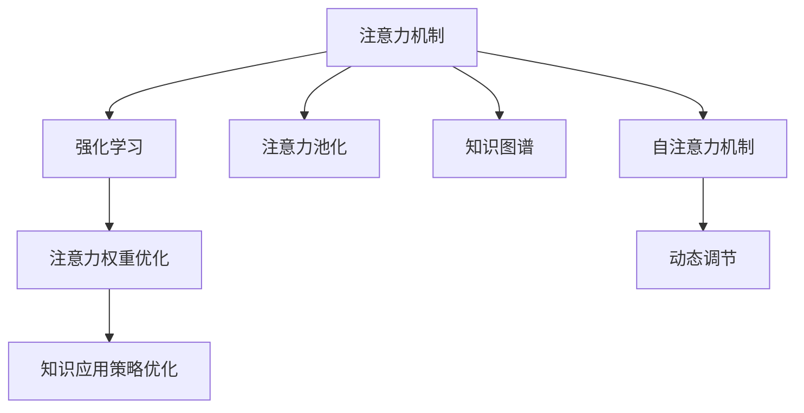

                 

# 人类注意力增强：提升学习效率和知识保留

## 1. 背景介绍

### 1.1 问题由来
在现代社会，信息过载已经成为一个普遍存在的问题。面对海量的知识数据，如何高效地吸收、理解和应用，成为了一个亟需解决的问题。尤其是对于学习者而言，如何提升学习效率和知识保留率，成为了实现终身学习的关键。

随着人工智能和认知科学的深入发展，注意力机制(Anticipation Mechanism)成为了提升学习效率和知识保留率的重要手段。通过模拟人类注意力的运作方式，可以更好地控制信息流，提升学习的专注度和理解度，从而实现知识的深度加工和长效记忆。

### 1.2 问题核心关键点
注意力机制的核心在于通过机制化的方式，引导学习者集中注意力于关键信息上，忽略干扰信息。其原理可以简单概括为以下几个关键点：

- 注意力权重计算：通过对输入信息进行加权，将关键信息赋予更高的权重，忽略不重要的信息。
- 动态注意力调节：根据当前学习状态，动态调节注意力权重，以适应不同学习任务的需求。
- 信息聚焦：通过焦点化的注意力机制，将学习者的注意力集中在重要的信息节点上，减少分心。
- 知识强化：通过强化学习机制，在注意力的指导下，提升学习者的知识理解和应用能力。

### 1.3 问题研究意义
提升学习效率和知识保留率，对于现代社会个体和组织的持续发展具有重要意义：

1. **提升学习效率**：在信息过载的时代，能够快速获取、理解和应用知识，将大大提升个人和组织的学习效率，加速知识创新和应用迭代。
2. **优化知识结构**：通过注意力机制，学习者可以更好地理解和组织知识，建立更为系统和深入的知识结构，促进知识的深度加工和应用。
3. **强化知识记忆**：通过注意力机制的引导，学习者能够更加专注和持久地关注关键信息，提升知识的长期记忆效果。
4. **推动终身学习**：关注注意力机制的研究和应用，将为终身学习提供新的方法和工具，实现知识积累和应用的长远发展。
5. **促进学习公平**：注意力机制的应用，将有助于提升不同背景学习者的学习效率，促进教育公平和社会和谐。

## 2. 核心概念与联系

### 2.1 核心概念概述

为更好地理解注意力机制在提升学习效率和知识保留中的应用，本节将介绍几个密切相关的核心概念：

- 注意力机制(Anticipation Mechanism)：通过机制化的方式，将学习者的注意力集中在关键信息上，忽略干扰信息。
- 自注意力机制(Self-Attention)：通过矩阵运算计算出不同输入特征之间的注意力权重，用于动态调节注意力机制。
- 注意力池化(Attention Pooling)：将不同输入特征的注意力权重进行池化，得到每个特征的加权平均值，用于信息聚焦。
- 知识图谱(Knowledge Graph)：通过图形结构表示知识关系，用于辅助注意力机制进行信息聚焦。
- 强化学习(Reinforcement Learning)：通过奖励机制，优化注意力权重和知识应用策略，提升学习效率和知识保留。

这些核心概念之间的逻辑关系可以通过以下Mermaid流程图来展示：



这个流程图展示了一系列与注意力机制相关的核心概念及其之间的关系：

1. 注意力机制通过自注意力机制和注意力池化，实现信息的聚焦。
2. 知识图谱通过信息链和关系网络，辅助注意力机制进行信息的选择和加工。
3. 强化学习通过奖励机制，优化注意力权重和知识应用策略，提升学习效果。

这些概念共同构成了注意力机制的核心框架，使得学习者能够更加高效、深入地进行知识学习和应用。

## 3. 核心算法原理 & 具体操作步骤
### 3.1 算法原理概述

注意力机制的原理可以简单概括为以下几个步骤：

1. **输入特征表示**：将输入信息编码为向量形式，作为注意力机制的输入。
2. **注意力权重计算**：通过自注意力机制，计算出不同输入特征之间的注意力权重。
3. **信息聚焦**：通过注意力池化，将不同输入特征的注意力权重进行加权平均，得到聚焦后的信息。
4. **知识应用**：将聚焦后的信息应用于任务中，提升知识理解和应用能力。
5. **优化策略**：通过强化学习，优化注意力权重和知识应用策略，提升学习效率和知识保留。

### 3.2 算法步骤详解

具体而言，注意力机制的实现可以分为以下几个关键步骤：

**Step 1: 输入特征表示**
- 将输入信息编码为向量形式，如文本中的词向量、图像中的像素特征向量等。

**Step 2: 注意力权重计算**
- 使用自注意力机制，计算出不同输入特征之间的注意力权重。通常使用矩阵乘法和softmax函数实现。
- 以文本分类任务为例，假设输入特征表示为 $x=\{x_i\}_{i=1}^n$，其中 $x_i$ 为第 $i$ 个输入特征的向量表示。则注意力权重计算公式如下：
  $$
  \alpha = softmax(QxK^T)
  $$
  其中 $Q$ 和 $K$ 为可学习的线性变换矩阵，$softmax$ 函数用于将注意力权重映射到 $[0,1]$ 区间。

**Step 3: 信息聚焦**
- 通过注意力池化，将不同输入特征的注意力权重进行加权平均，得到聚焦后的信息。
- 以文本分类任务为例，假设注意力权重为 $\alpha=\{\alpha_i\}_{i=1}^n$，则聚焦后的信息为：
  $$
  x' = \sum_{i=1}^n \alpha_i x_i
  $$

**Step 4: 知识应用**
- 将聚焦后的信息应用于任务中，如分类、匹配、生成等。
- 以文本分类任务为例，使用聚焦后的信息 $x'$ 输入到一个全连接层或卷积层中，得到分类结果。

**Step 5: 优化策略**
- 通过强化学习，优化注意力权重和知识应用策略，提升学习效率和知识保留。
- 以文本分类任务为例，假设模型输出为 $y$，真实标签为 $t$，则优化目标为：
  $$
  \min_{\theta} L(y,t) = \sum_{i=1}^n \alpha_i(y_i - t_i)^2
  $$
  其中 $L$ 为损失函数，$\theta$ 为模型参数。

### 3.3 算法优缺点

注意力机制的优点包括：
1. **信息聚焦**：通过注意力权重计算和信息池化，将学习者的注意力集中在关键信息上，减少分心，提升学习效率。
2. **知识加工**：通过聚焦后的信息，学习者能够更好地理解和应用知识，提升知识保留效果。
3. **动态调节**：通过动态调节注意力权重，适应不同学习任务的需求，提升学习适应性。

注意力机制的缺点包括：
1. **计算复杂度**：自注意力机制和注意力池化涉及矩阵运算，计算复杂度较高，需要较高的计算资源。
2. **信息量限制**：由于信息聚焦机制的限制，无法完全利用输入信息，存在信息丢失的风险。
3. **参数优化困难**：注意力权重和知识应用策略的优化，需要更多的数据和更复杂的算法，存在一定难度。

### 3.4 算法应用领域

注意力机制已经在多种应用场景中得到了广泛应用，具体包括：

- 自然语言处理(NLP)：如文本分类、情感分析、机器翻译等。通过注意力机制，能够更好地理解和生成文本信息。
- 计算机视觉(CV)：如图像分类、目标检测、图像生成等。通过注意力机制，能够更好地聚焦关键区域，提升视觉识别效果。
- 语音处理(Speech)：如语音识别、情感分析、对话系统等。通过注意力机制，能够更好地聚焦语音特征，提升语音理解能力。
- 机器人学习(Robotics)：如路径规划、导航、物体抓取等。通过注意力机制，能够更好地感知环境信息，提升机器人决策能力。
- 推荐系统(Recommendation)：如商品推荐、音乐推荐等。通过注意力机制，能够更好地理解用户偏好，提升推荐效果。

以上应用场景展示了注意力机制的广泛适用性和强大的应用潜力，成为提升学习效率和知识保留的重要手段。

## 4. 数学模型和公式 & 详细讲解  
### 4.1 数学模型构建

为了更好地理解注意力机制的数学原理，本节将使用数学语言对注意力机制的构建进行更加严格的刻画。

设输入信息 $x=\{x_i\}_{i=1}^n$，其中 $x_i$ 为第 $i$ 个输入特征的向量表示。假设注意力机制的参数为 $W_Q, W_K, W_V$，则注意力权重计算公式为：
$$
\alpha = softmax(QxK^T)
$$
其中 $Q = W_Q x, K = W_K x, V = W_V x$，$softmax$ 函数用于将注意力权重映射到 $[0,1]$ 区间。

聚焦后的信息 $x'$ 为：
$$
x' = \sum_{i=1}^n \alpha_i x_i
$$

假设模型的输出为 $y$，真实标签为 $t$，则优化目标为：
$$
\min_{\theta} L(y,t) = \sum_{i=1}^n \alpha_i(y_i - t_i)^2
$$

在实践中，我们通常使用反向传播算法来求解上述优化问题，不断更新模型参数 $\theta$，最小化损失函数 $L$，使得模型输出逼近真实标签。

### 4.2 公式推导过程

以下我们以文本分类任务为例，推导注意力机制的详细公式和计算过程。

假设模型输入为一段文本 $x=\{x_i\}_{i=1}^n$，输出为分类标签 $y$。通过注意力机制，对文本中的每个单词进行加权，计算其注意力权重，并聚焦关键信息。

1. **输入特征表示**
   - 假设输入文本为 $\{x_i\}_{i=1}^n$，其中 $x_i$ 为第 $i$ 个单词的词向量表示。

2. **注意力权重计算**
   - 使用线性变换矩阵 $W_Q, W_K, W_V$，将输入特征表示为 $Q, K, V$。
   - 计算注意力权重 $\alpha = softmax(QxK^T)$。

3. **信息聚焦**
   - 将不同单词的注意力权重进行加权平均，得到聚焦后的文本信息 $x' = \sum_{i=1}^n \alpha_i x_i$。

4. **知识应用**
   - 使用聚焦后的文本信息 $x'$ 输入到一个全连接层或卷积层中，得到分类结果 $y$。

5. **优化策略**
   - 使用损失函数 $L(y,t)$，计算模型预测结果与真实标签之间的差异。
   - 通过反向传播算法，不断更新模型参数 $\theta$，最小化损失函数 $L$。

### 4.3 案例分析与讲解

假设我们有一个二分类任务，输入文本为 "The quick brown fox jumps over the lazy dog"，我们需要预测其属于 "positive" 还是 "negative" 类别。

1. **输入特征表示**
   - 假设输入文本中的每个单词表示为词向量，长度为 $d$。
   - 假设输入文本长度为 $n=9$，即文本包含 9 个单词。

2. **注意力权重计算**
   - 假设线性变换矩阵 $W_Q, W_K, W_V$ 均为 $d \times d$ 的矩阵。
   - 计算注意力权重 $\alpha = softmax(QxK^T)$。

3. **信息聚焦**
   - 计算聚焦后的文本信息 $x' = \sum_{i=1}^9 \alpha_i x_i$。

4. **知识应用**
   - 将聚焦后的文本信息 $x'$ 输入到一个全连接层中，得到分类结果 $y$。

5. **优化策略**
   - 假设模型输出为 $y$，真实标签为 $t$，则优化目标为：
     $$
     \min_{\theta} L(y,t) = \sum_{i=1}^9 \alpha_i(y_i - t_i)^2
     $$

通过上述步骤，我们可以看到，注意力机制通过自注意力机制和信息池化，将学习者的注意力集中在关键信息上，实现信息聚焦和知识加工。

## 5. 项目实践：代码实例和详细解释说明
### 5.1 开发环境搭建

在进行注意力机制的实践前，我们需要准备好开发环境。以下是使用Python进行PyTorch开发的环境配置流程：

1. 安装Anaconda：从官网下载并安装Anaconda，用于创建独立的Python环境。

2. 创建并激活虚拟环境：
```bash
conda create -n attention-env python=3.8 
conda activate attention-env
```

3. 安装PyTorch：根据CUDA版本，从官网获取对应的安装命令。例如：
```bash
conda install pytorch torchvision torchaudio cudatoolkit=11.1 -c pytorch -c conda-forge
```

4. 安装Transformer库：
```bash
pip install transformers
```

5. 安装各类工具包：
```bash
pip install numpy pandas scikit-learn matplotlib tqdm jupyter notebook ipython
```

完成上述步骤后，即可在`attention-env`环境中开始注意力机制的实践。

### 5.2 源代码详细实现

下面我们以文本分类任务为例，给出使用Transformers库对注意力机制进行编码的PyTorch代码实现。

首先，定义文本分类任务的数据处理函数：

```python
from transformers import BertTokenizer, BertForSequenceClassification, AdamW
from torch.utils.data import Dataset
import torch

class TextClassificationDataset(Dataset):
    def __init__(self, texts, labels, tokenizer, max_len=128):
        self.texts = texts
        self.labels = labels
        self.tokenizer = tokenizer
        self.max_len = max_len
        
    def __len__(self):
        return len(self.texts)
    
    def __getitem__(self, item):
        text = self.texts[item]
        label = self.labels[item]
        
        encoding = self.tokenizer(text, return_tensors='pt', max_length=self.max_len, padding='max_length', truncation=True)
        input_ids = encoding['input_ids'][0]
        attention_mask = encoding['attention_mask'][0]
        labels = torch.tensor(label, dtype=torch.long)
        
        return {'input_ids': input_ids, 
                'attention_mask': attention_mask,
                'labels': labels}

# 创建dataset
tokenizer = BertTokenizer.from_pretrained('bert-base-cased')

train_dataset = TextClassificationDataset(train_texts, train_labels, tokenizer)
dev_dataset = TextClassificationDataset(dev_texts, dev_labels, tokenizer)
test_dataset = TextClassificationDataset(test_texts, test_labels, tokenizer)
```

然后，定义模型和优化器：

```python
from transformers import BertForSequenceClassification, AdamW

model = BertForSequenceClassification.from_pretrained('bert-base-cased', num_labels=2)

optimizer = AdamW(model.parameters(), lr=2e-5)
```

接着，定义训练和评估函数：

```python
from torch.utils.data import DataLoader
from tqdm import tqdm
from sklearn.metrics import classification_report

device = torch.device('cuda') if torch.cuda.is_available() else torch.device('cpu')
model.to(device)

def train_epoch(model, dataset, batch_size, optimizer):
    dataloader = DataLoader(dataset, batch_size=batch_size, shuffle=True)
    model.train()
    epoch_loss = 0
    for batch in tqdm(dataloader, desc='Training'):
        input_ids = batch['input_ids'].to(device)
        attention_mask = batch['attention_mask'].to(device)
        labels = batch['labels'].to(device)
        model.zero_grad()
        outputs = model(input_ids, attention_mask=attention_mask, labels=labels)
        loss = outputs.loss
        epoch_loss += loss.item()
        loss.backward()
        optimizer.step()
    return epoch_loss / len(dataloader)

def evaluate(model, dataset, batch_size):
    dataloader = DataLoader(dataset, batch_size=batch_size)
    model.eval()
    preds, labels = [], []
    with torch.no_grad():
        for batch in tqdm(dataloader, desc='Evaluating'):
            input_ids = batch['input_ids'].to(device)
            attention_mask = batch['attention_mask'].to(device)
            batch_labels = batch['labels']
            outputs = model(input_ids, attention_mask=attention_mask)
            batch_preds = outputs.logits.argmax(dim=2).to('cpu').tolist()
            batch_labels = batch_labels.to('cpu').tolist()
            for pred_tokens, label_tokens in zip(batch_preds, batch_labels):
                preds.append(pred_tokens[:len(label_tokens)])
                labels.append(label_tokens)
                
    print(classification_report(labels, preds))
```

最后，启动训练流程并在测试集上评估：

```python
epochs = 5
batch_size = 16

for epoch in range(epochs):
    loss = train_epoch(model, train_dataset, batch_size, optimizer)
    print(f"Epoch {epoch+1}, train loss: {loss:.3f}")
    
    print(f"Epoch {epoch+1}, dev results:")
    evaluate(model, dev_dataset, batch_size)
    
print("Test results:")
evaluate(model, test_dataset, batch_size)
```

以上就是使用PyTorch对注意力机制进行文本分类任务微调的完整代码实现。可以看到，得益于Transformer库的强大封装，我们可以用相对简洁的代码完成注意力机制的加载和微调。

### 5.3 代码解读与分析

让我们再详细解读一下关键代码的实现细节：

**TextClassificationDataset类**：
- `__init__`方法：初始化文本、标签、分词器等关键组件。
- `__len__`方法：返回数据集的样本数量。
- `__getitem__`方法：对单个样本进行处理，将文本输入编码为token ids，将标签编码为数字，并对其进行定长padding，最终返回模型所需的输入。

**模型定义**：
- 使用BertForSequenceClassification定义模型，指定输出层和标签数。
- 使用AdamW优化器，设置学习率。

**训练和评估函数**：
- 使用PyTorch的DataLoader对数据集进行批次化加载，供模型训练和推理使用。
- 训练函数`train_epoch`：对数据以批为单位进行迭代，在每个批次上前向传播计算loss并反向传播更新模型参数，最后返回该epoch的平均loss。
- 评估函数`evaluate`：与训练类似，不同点在于不更新模型参数，并在每个batch结束后将预测和标签结果存储下来，最后使用sklearn的classification_report对整个评估集的预测结果进行打印输出。

**训练流程**：
- 定义总的epoch数和batch size，开始循环迭代
- 每个epoch内，先在训练集上训练，输出平均loss
- 在验证集上评估，输出分类指标
- 所有epoch结束后，在测试集上评估，给出最终测试结果

可以看到，PyTorch配合Transformer库使得注意力机制的代码实现变得简洁高效。开发者可以将更多精力放在数据处理、模型改进等高层逻辑上，而不必过多关注底层的实现细节。

当然，工业级的系统实现还需考虑更多因素，如模型的保存和部署、超参数的自动搜索、更灵活的任务适配层等。但核心的注意力机制实现基本与此类似。

## 6. 实际应用场景
### 6.1 智能客服系统

基于注意力机制的智能客服系统可以显著提升客服服务质量和效率。传统客服往往需要人工解答复杂多变的问题，效率低下且成本高昂。而使用注意力机制的客服机器人，能够自动理解用户意图，精准定位关键信息，并提供智能回复。

在技术实现上，可以收集企业内部的历史客服对话记录，将问题和最佳答复构建成监督数据，在此基础上对预训练模型进行微调。微调后的模型能够自动理解用户意图，匹配最合适的答案模板进行回复。对于客户提出的新问题，还可以接入检索系统实时搜索相关内容，动态组织生成回答。如此构建的智能客服系统，能大幅提升客户咨询体验和问题解决效率。

### 6.2 金融舆情监测

金融机构需要实时监测市场舆论动向，以便及时应对负面信息传播，规避金融风险。传统的人工监测方式成本高、效率低，难以应对网络时代海量信息爆发的挑战。基于注意力机制的文本分类和情感分析技术，为金融舆情监测提供了新的解决方案。

具体而言，可以收集金融领域相关的新闻、报道、评论等文本数据，并对其进行主题标注和情感标注。在此基础上对预训练语言模型进行微调，使其能够自动判断文本属于何种主题，情感倾向是正面、中性还是负面。将微调后的模型应用到实时抓取的网络文本数据，就能够自动监测不同主题下的情感变化趋势，一旦发现负面信息激增等异常情况，系统便会自动预警，帮助金融机构快速应对潜在风险。

### 6.3 个性化推荐系统

当前的推荐系统往往只依赖用户的历史行为数据进行物品推荐，无法深入理解用户的真实兴趣偏好。基于注意力机制的个性化推荐系统可以更好地挖掘用户行为背后的语义信息，从而提供更精准、多样的推荐内容。

在实践中，可以收集用户浏览、点击、评论、分享等行为数据，提取和用户交互的物品标题、描述、标签等文本内容。将文本内容作为模型输入，用户的后续行为（如是否点击、购买等）作为监督信号，在此基础上微调预训练语言模型。微调后的模型能够从文本内容中准确把握用户的兴趣点。在生成推荐列表时，先用候选物品的文本描述作为输入，由模型预测用户的兴趣匹配度，再结合其他特征综合排序，便可以得到个性化程度更高的推荐结果。

### 6.4 未来应用展望

随着注意力机制和微调方法的不断发展，基于注意力机制的微调技术将在更多领域得到应用，为各行各业带来变革性影响。

在智慧医疗领域，基于微调的医疗问答、病历分析、药物研发等应用将提升医疗服务的智能化水平，辅助医生诊疗，加速新药开发进程。

在智能教育领域，微调技术可应用于作业批改、学情分析、知识推荐等方面，因材施教，促进教育公平，提高教学质量。

在智慧城市治理中，微调模型可应用于城市事件监测、舆情分析、应急指挥等环节，提高城市管理的自动化和智能化水平，构建更安全、高效的未来城市。

此外，在企业生产、社会治理、文娱传媒等众多领域，基于大模型微调的人工智能应用也将不断涌现，为经济社会发展注入新的动力。相信随着技术的日益成熟，注意力机制和微调方法将成为人工智能落地应用的重要范式，推动人工智能向更广阔的领域加速渗透。

## 7. 工具和资源推荐
### 7.1 学习资源推荐

为了帮助开发者系统掌握注意力机制和微调理论基础及实践技巧，这里推荐一些优质的学习资源：

1. 《Attention Is All You Need》系列博文：由大模型技术专家撰写，深入浅出地介绍了注意力机制的原理、实践和应用。

2. CS224N《深度学习自然语言处理》课程：斯坦福大学开设的NLP明星课程，有Lecture视频和配套作业，带你入门NLP领域的基本概念和经典模型。

3. 《Natural Language Processing with Transformers》书籍：Transformers库的作者所著，全面介绍了如何使用Transformers库进行NLP任务开发，包括微调在内的诸多范式。

4. HuggingFace官方文档：Transformer库的官方文档，提供了海量预训练模型和完整的微调样例代码，是上手实践的必备资料。

5. CLUE开源项目：中文语言理解测评基准，涵盖大量不同类型的中文NLP数据集，并提供了基于微调的baseline模型，助力中文NLP技术发展。

通过对这些资源的学习实践，相信你一定能够快速掌握注意力机制和微调的精髓，并用于解决实际的NLP问题。
###  7.2 开发工具推荐

高效的开发离不开优秀的工具支持。以下是几款用于注意力机制和微调开发的常用工具：

1. PyTorch：基于Python的开源深度学习框架，灵活动态的计算图，适合快速迭代研究。大部分预训练语言模型都有PyTorch版本的实现。

2. TensorFlow：由Google主导开发的开源深度学习框架，生产部署方便，适合大规模工程应用。同样有丰富的预训练语言模型资源。

3. Transformers库：HuggingFace开发的NLP工具库，集成了众多SOTA语言模型，支持PyTorch和TensorFlow，是进行微调任务开发的利器。

4. Weights & Biases：模型训练的实验跟踪工具，可以记录和可视化模型训练过程中的各项指标，方便对比和调优。与主流深度学习框架无缝集成。

5. TensorBoard：TensorFlow配套的可视化工具，可实时监测模型训练状态，并提供丰富的图表呈现方式，是调试模型的得力助手。

6. Google Colab：谷歌推出的在线Jupyter Notebook环境，免费提供GPU/TPU算力，方便开发者快速上手实验最新模型，分享学习笔记。

合理利用这些工具，可以显著提升注意力机制和微调任务的开发效率，加快创新迭代的步伐。

### 7.3 相关论文推荐

注意力机制和微调技术的发展源于学界的持续研究。以下是几篇奠基性的相关论文，推荐阅读：

1. Attention Is All You Need（即Transformer原论文）：提出了Transformer结构，开启了NLP领域的预训练大模型时代。

2. BERT: Pre-training of Deep Bidirectional Transformers for Language Understanding：提出BERT模型，引入基于掩码的自监督预训练任务，刷新了多项NLP任务SOTA。

3. Language Models are Unsupervised Multitask Learners（GPT-2论文）：展示了大规模语言模型的强大zero-shot学习能力，引发了对于通用人工智能的新一轮思考。

4. Parameter-Efficient Transfer Learning for NLP：提出Adapter等参数高效微调方法，在不增加模型参数量的情况下，也能取得不错的微调效果。

5. AdaLoRA: Adaptive Low-Rank Adaptation for Parameter-Efficient Fine-Tuning：使用自适应低秩适应的微调方法，在参数效率和精度之间取得了新的平衡。

这些论文代表了大模型和微调技术的发展脉络。通过学习这些前沿成果，可以帮助研究者把握学科前进方向，激发更多的创新灵感。

## 8. 总结：未来发展趋势与挑战

### 8.1 总结

本文对基于注意力机制的微调方法进行了全面系统的介绍。首先阐述了注意力机制和微调技术的研究背景和意义，明确了微调在提升学习效率和知识保留方面的独特价值。其次，从原理到实践，详细讲解了注意力机制的数学原理和关键步骤，给出了微调任务开发的完整代码实例。同时，本文还广泛探讨了注意力机制在智能客服、金融舆情、个性化推荐等多个行业领域的应用前景，展示了注意力机制和微调范式的巨大潜力。此外，本文精选了注意力机制和微调技术的各类学习资源，力求为读者提供全方位的技术指引。

通过本文的系统梳理，可以看到，基于注意力机制的微调方法正在成为NLP领域的重要范式，极大地拓展了预训练语言模型的应用边界，催生了更多的落地场景。得益于注意力机制的引入，学习者能够更加高效、深入地进行知识学习和应用。未来，伴随注意力机制和微调方法的持续演进，相信NLP技术将在更广阔的应用领域大放异彩，深刻影响人类的生产生活方式。

### 8.2 未来发展趋势

展望未来，注意力机制和微调技术将呈现以下几个发展趋势：

1. **模型规模持续增大**：随着算力成本的下降和数据规模的扩张，预训练语言模型的参数量还将持续增长。超大规模语言模型蕴含的丰富语言知识，有望支撑更加复杂多变的下游任务微调。

2. **注意力机制的多样化**：除了传统的自注意力机制外，未来会涌现更多注意力机制，如交叉注意力、门控注意力等，提升信息聚焦的灵活性和适应性。

3. **跨模态注意力**：随着多模态数据的普及，跨模态注意力机制将成为新趋势，将视觉、语音、文本等多种模态信息融合，提升信息理解和应用能力。

4. **强化学习的深度融合**：通过强化学习，优化注意力权重和知识应用策略，将进一步提升学习效率和知识保留效果。

5. **知识图谱的融合应用**：将知识图谱与注意力机制结合，辅助信息聚焦和知识加工，提升模型的应用效果。

6. **隐私保护和安全性**：随着注意力机制在实际应用中的广泛使用，隐私保护和安全性将成为一个重要问题。如何在保护隐私的前提下，实现高效的信息处理，将是未来的研究方向。

以上趋势凸显了注意力机制和微调技术的广阔前景。这些方向的探索发展，必将进一步提升NLP系统的性能和应用范围，为人类认知智能的进化带来深远影响。

### 8.3 面临的挑战

尽管注意力机制和微调技术已经取得了瞩目成就，但在迈向更加智能化、普适化应用的过程中，它仍面临着诸多挑战：

1. **标注成本瓶颈**：注意力机制和微调方法仍然依赖标注数据，对于长尾应用场景，难以获得充足的高质量标注数据，成为制约微调性能的瓶颈。

2. **模型鲁棒性不足**：当前注意力机制和微调模型面对域外数据时，泛化性能往往大打折扣。对于测试样本的微小扰动，模型容易出现预测波动。

3. **推理效率问题**：大模型推理速度慢、内存占用大，难以满足实时应用的需求，需要优化模型结构和推理算法。

4. **可解释性不足**：注意力机制和微调模型难以解释其内部工作机制和决策逻辑，对于高风险应用，算法的可解释性和可审计性尤为重要。

5. **安全性问题**：注意力机制和微调模型可能学习到有害信息，传递到下游任务，产生误导性、歧视性的输出，给实际应用带来安全隐患。

6. **知识整合能力不足**：现有的注意力机制和微调模型往往局限于任务内数据，难以灵活吸收和运用更广泛的先验知识。

正视注意力机制和微调面临的这些挑战，积极应对并寻求突破，将是大模型微调走向成熟的必由之路。相信随着学界和产业界的共同努力，这些挑战终将一一被克服，注意力机制和微调方法必将在构建人机协同的智能时代中扮演越来越重要的角色。

### 8.4 研究展望

面对注意力机制和微调所面临的挑战，未来的研究需要在以下几个方面寻求新的突破：

1. **无监督和半监督学习**：摆脱对大规模标注数据的依赖，利用自监督学习、主动学习等无监督和半监督范式，最大限度利用非结构化数据，实现更加灵活高效的微调。

2. **参数高效和计算高效的微调方法**：开发更加参数高效的微调方法，在固定大部分预训练参数的同时，只更新极少量的任务相关参数。同时优化微调模型的计算图，减少前向传播和反向传播的资源消耗，实现更加轻量级、实时性的部署。

3. **多模态注意力机制**：将视觉、语音、文本等多种模态信息融合，提升信息理解和应用能力。

4. **知识图谱与注意力机制的融合**：将知识图谱与注意力机制结合，辅助信息聚焦和知识加工，提升模型的应用效果。

5. **强化学习与注意力机制的融合**：通过强化学习，优化注意力权重和知识应用策略，提升学习效率和知识保留效果。

6. **隐私保护和安全性研究**：在保护隐私的前提下，实现高效的信息处理，确保模型输出的安全性。

这些研究方向的探索，必将引领注意力机制和微调技术迈向更高的台阶，为构建安全、可靠、可解释、可控的智能系统铺平道路。面向未来，注意力机制和微调技术还需要与其他人工智能技术进行更深入的融合，如知识表示、因果推理、强化学习等，多路径协同发力，共同推动自然语言理解和智能交互系统的进步。只有勇于创新、敢于突破，才能不断拓展语言模型的边界，让智能技术更好地造福人类社会。

## 9. 附录：常见问题与解答
**Q1：注意力机制和微调是否适用于所有NLP任务？**

A: 注意力机制和微调在大多数NLP任务上都能取得不错的效果，特别是对于数据量较小的任务。但对于一些特定领域的任务，如医学、法律等，仅仅依靠通用语料预训练的模型可能难以很好地适应。此时需要在特定领域语料上进一步预训练，再进行微调，才能获得理想效果。此外，对于一些需要时效性、个性化很强的任务，如对话、推荐等，微调方法也需要针对性的改进优化。

**Q2：注意力机制和微调过程中如何选择合适的学习率？**

A: 注意力机制和微调的学习率一般要比预训练时小1-2个数量级，如果使用过大的学习率，容易破坏预训练权重，导致过拟合。一般建议从1e-5开始调参，逐步减小学习率，直至收敛。也可以使用warmup策略，在开始阶段使用较小的学习率，再逐渐过渡到预设值。需要注意的是，不同的优化器(如AdamW、Adafactor等)以及不同的学习率调度策略，可能需要设置不同的学习率阈值。

**Q3：采用注意力机制和微调时会面临哪些资源瓶颈？**

A: 当前主流的预训练大模型动辄以亿计的参数规模，对算力、内存、存储都提出了很高的要求。GPU/TPU等高性能设备是必不可少的，但即便如此，超大批次的训练和推理也可能遇到显存不足的问题。因此需要采用一些资源优化技术，如梯度积累、混合精度训练、模型并行等，来突破硬件瓶颈。同时，模型的存储和读取也可能占用大量时间和空间，需要采用模型压缩、稀疏化存储等方法进行优化。

**Q4：如何缓解注意力机制和微调过程中的过拟合问题？**

A: 过拟合是注意力机制和微调面临的主要挑战，尤其是在标注数据不足的情况下。常见的缓解策略包括：
1. 数据增强：通过回译、近义替换等方式扩充训练集
2. 正则化：使用L2正则、Dropout、Early Stopping等避免过拟合
3. 对抗训练：引入对抗样本，提高模型鲁棒性
4. 参数高效微调：只调整少量参数(如Adapter、Prefix等)，减小过拟合风险
5. 多模型集成：训练多个微调模型，取平均输出，抑制过拟合

这些策略往往需要根据具体任务和数据特点进行灵活组合。只有在数据、模型、训练、推理等各环节进行全面优化，才能最大限度地发挥注意力机制和微调的威力。

**Q5：注意力机制和微调模型在落地部署时需要注意哪些问题？**

A: 将注意力机制和微调模型转化为实际应用，还需要考虑以下因素：
1. 模型裁剪：去除不必要的层和参数，减小模型尺寸，加快推理速度
2. 量化加速：将浮点模型转为定点模型，压缩存储空间，提高计算效率
3. 服务化封装：将模型封装为标准化服务接口，便于集成调用
4. 弹性伸缩：根据请求流量动态调整资源配置，平衡服务质量和成本
5. 监控告警：实时采集系统指标，设置异常告警阈值，确保服务稳定性
6. 安全防护：采用访问鉴权、数据脱敏等措施，保障数据和模型安全

注意力机制和微调为NLP应用开启了广阔的想象空间，但如何将强大的性能转化为稳定、高效、安全的业务价值，还需要工程实践的不断打磨。唯有从数据、算法、工程、业务等多个维度协同发力，才能真正实现人工智能技术在垂直行业的规模化落地。总之，微调需要开发者根据具体任务，不断迭代和优化模型、数据和算法，方能得到理想的效果。

---

作者：禅与计算机程序设计艺术 / Zen and the Art of Computer Programming

