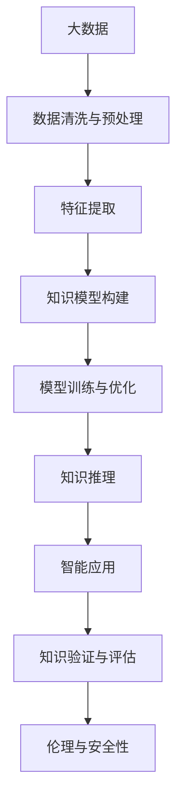

                 

# 人类的知识边界：无限的探索与追求

## 1. 背景介绍

### 1.1 问题由来

随着人类社会的不断进步，知识的积累和传播速度日益加快，人们对于知识的探索与追求也从未停歇。从古代的哲学家、科学家到现代的人工智能、大数据技术，人类对于知识的理解和应用能力不断提升。特别是在信息技术的推动下，人类获取、处理、应用知识的方式发生了深刻变化。

当前，人工智能和大数据技术的发展，使得人类能够以前所未有的方式探索和理解知识的海洋。人工智能的强大算法和计算能力，使得我们可以对大量复杂的数据进行处理和分析，揭示隐藏在数据背后的知识和规律。大数据技术的兴起，又为我们提供了更加丰富、多样、深入的数据源，进一步拓展了人类探索知识的领域和深度。

然而，尽管技术手段不断进步，人类知识边界的探索仍面临诸多挑战。知识的碎片化、数据的不确定性、算法的局限性等问题，使得人类对知识边界的探索仍需不断突破和创新。本文将探讨人类在知识边界探索中的挑战与机遇，提出基于人工智能和大数据技术的解决方案。

### 1.2 问题核心关键点

探索人类知识边界的关键在于如何高效地处理和利用海量数据，发掘其中的知识和规律，并将其转化为可理解和应用的智能模型。以下是探索知识边界的几个核心问题：

1. **数据获取与处理**：如何快速、高效地获取、清洗、标注数据，确保数据的完整性和可靠性。
2. **模型构建与训练**：如何构建高效、准确的知识模型，并对其进行训练和优化。
3. **知识表示与推理**：如何将知识模型中的隐式知识表示为可推理的形式，提升模型的智能水平。
4. **应用部署与验证**：如何将智能模型部署到实际应用中，并对其性能进行验证和优化。
5. **伦理与安全性**：如何确保知识模型的应用符合伦理道德，避免误用和滥用。

本文将围绕以上问题，探讨基于人工智能和大数据技术的人类知识边界探索方法。

## 2. 核心概念与联系

### 2.1 核心概念概述

为了更好地理解人类知识边界的探索方法，本节将介绍几个核心概念：

- **人工智能(AI)**：通过算法和计算能力，使计算机能够模拟人类的智能行为，进行知识获取、处理和推理。
- **大数据(Big Data)**：指大规模、高速度、多样化数据，通常指TB级或PB级的数据量。
- **机器学习(Machine Learning)**：使计算机能够自动学习和优化模型，从而实现对数据的智能分析和处理。
- **深度学习(Deep Learning)**：一种特殊的机器学习方法，通过多层神经网络实现对数据的复杂非线性映射。
- **知识图谱(Knowledge Graph)**：一种语义化的知识表示方法，将知识以图的形式组织和存储，方便推理和查询。
- **自然语言处理(Natural Language Processing, NLP)**：使计算机能够理解和处理人类语言，进行信息提取、生成和推理。

这些核心概念之间相互关联，共同构成了人类知识边界的探索框架，通过算法和计算能力，将数据转化为知识和智能模型，从而拓展人类对知识边界的理解。

### 2.2 核心概念原理和架构的 Mermaid 流程图(Mermaid 流程节点中不要有括号、逗号等特殊字符)



这个流程图展示了大数据处理、特征提取、知识模型构建、模型训练与优化、知识推理、智能应用、知识验证与评估以及伦理与安全性等关键环节的相互关系。

## 3. 核心算法原理 & 具体操作步骤

### 3.1 算法原理概述

基于人工智能和大数据技术的知识边界探索方法，主要包括以下几个步骤：

1. **数据获取与处理**：从各种来源获取数据，进行清洗、预处理和标注。
2. **特征提取与表示**：将原始数据转化为可用于模型训练的特征表示。
3. **知识模型构建与训练**：构建知识模型，并通过大量数据对其进行训练和优化。
4. **知识推理与验证**：通过推理机制，验证知识模型的准确性和可靠性，并进行迭代优化。
5. **智能应用与部署**：将知识模型应用到实际场景中，进行性能验证和优化。
6. **伦理与安全保障**：确保知识模型的应用符合伦理道德规范，避免滥用和误用。

这些步骤相互依赖，共同构成了一个完整的知识边界探索流程。

### 3.2 算法步骤详解

#### 3.2.1 数据获取与处理

数据获取与处理是知识边界探索的基础环节。数据来源包括各类传感器数据、社交网络数据、文本数据、图像数据等。

- **数据采集**：从各种数据源获取原始数据，包括传感器数据、社交网络数据、文本数据等。
- **数据清洗**：去除噪声和冗余数据，处理缺失值和异常值。
- **数据标注**：对数据进行标注，生成监督数据集。

#### 3.2.2 特征提取与表示

特征提取与表示是将原始数据转化为可用于模型训练的特征表示的过程。

- **特征选择**：选择对目标任务有贡献的特征，去除无关特征。
- **特征降维**：使用PCA、LDA等方法，对高维特征进行降维处理。
- **特征增强**：使用数据增强技术，生成更多的训练数据。

#### 3.2.3 知识模型构建与训练

知识模型构建与训练是知识边界探索的核心环节。

- **模型选择**：根据任务需求选择合适的模型，如决策树、随机森林、深度神经网络等。
- **模型训练**：使用监督数据集对模型进行训练，优化模型参数。
- **模型验证**：使用验证集评估模型性能，避免过拟合。
- **模型优化**：对模型进行调参，提升模型性能。

#### 3.2.4 知识推理与验证

知识推理与验证是评估知识模型性能和可靠性的重要环节。

- **推理机制**：使用推理机制，如知识图谱、图神经网络等，对知识模型进行推理。
- **验证评估**：使用测试集评估知识模型的性能，验证推理结果的准确性。
- **迭代优化**：根据验证评估结果，对知识模型进行迭代优化。

#### 3.2.5 智能应用与部署

智能应用与部署是将知识模型应用到实际场景中的重要环节。

- **应用部署**：将知识模型部署到生产环境中，进行实际应用。
- **性能优化**：使用缓存、并行计算等技术，提升应用性能。
- **监控维护**：实时监控知识模型的性能，及时进行维护和更新。

#### 3.2.6 伦理与安全保障

伦理与安全保障是知识模型应用的关键环节，确保模型符合伦理道德规范，避免滥用和误用。

- **伦理审查**：进行伦理审查，确保模型应用符合伦理道德规范。
- **安全防护**：使用加密、访问控制等技术，保护数据和模型安全。
- **用户反馈**：收集用户反馈，持续优化模型应用。

### 3.3 算法优缺点

基于人工智能和大数据技术的知识边界探索方法，具有以下优点：

1. **高效性**：通过自动化的数据处理和模型训练，大大提高了知识探索的效率。
2. **灵活性**：适用于各种数据类型和任务，可以灵活应对不同的应用场景。
3. **可扩展性**：可以通过增加数据和计算资源，不断提升知识探索的深度和广度。
4. **准确性**：通过大量的数据训练和模型优化，能够得到准确的智能模型。

同时，这些方法也存在一些缺点：

1. **数据依赖性**：依赖高质量的数据，数据获取和标注成本较高。
2. **模型复杂性**：模型构建和训练过程较为复杂，需要专业的知识和技能。
3. **伦理风险**：存在数据隐私、模型偏见等问题，需要额外的伦理审查和监管。
4. **计算资源消耗**：模型训练和推理需要大量的计算资源，对硬件和网络要求较高。

### 3.4 算法应用领域

基于人工智能和大数据技术的知识边界探索方法，已经在许多领域得到了广泛应用，例如：

- **金融**：利用大数据和深度学习模型，进行风险预测、客户分析、反欺诈等应用。
- **医疗**：利用大数据和深度学习模型，进行疾病预测、医疗影像分析、个性化治疗等应用。
- **零售**：利用大数据和深度学习模型，进行客户行为分析、库存管理、推荐系统等应用。
- **智能制造**：利用大数据和深度学习模型，进行设备故障预测、生产优化、质量控制等应用。
- **交通管理**：利用大数据和深度学习模型，进行交通流量预测、路径规划、事故预测等应用。

除了上述这些经典应用外，人工智能和大数据技术在更多的领域中得到应用，如智慧城市、智能家居、智能农业等，为各行各业带来了深刻的变革和创新。

## 4. 数学模型和公式 & 详细讲解 & 举例说明

### 4.1 数学模型构建

基于人工智能和大数据技术的知识边界探索方法，可以构建多个数学模型，包括监督学习模型、非监督学习模型、强化学习模型等。以下以监督学习模型为例，介绍其数学模型构建过程。

设训练数据集为 $D=\{(x_i,y_i)\}_{i=1}^N$，其中 $x_i$ 为输入特征，$y_i$ 为输出标签。构建监督学习模型的目标是最小化损失函数 $\mathcal{L}$，使得模型输出 $y$ 逼近真实标签 $y_i$。常用的监督学习模型包括线性回归、逻辑回归、支持向量机等。

以线性回归模型为例，其目标是最小化均方误差损失函数：

$$
\mathcal{L}(\theta) = \frac{1}{2N}\sum_{i=1}^N(y_i-\theta^Tx_i)^2
$$

其中 $\theta$ 为模型参数，$x_i$ 为输入特征，$y_i$ 为输出标签。

### 4.2 公式推导过程

以下以线性回归模型为例，推导其最小化均方误差损失函数的梯度更新公式。

最小化均方误差损失函数的梯度为：

$$
\nabla_{\theta}\mathcal{L}(\theta) = \frac{1}{N}\sum_{i=1}^N(y_i-\theta^Tx_i)x_i
$$

使用随机梯度下降法进行模型参数更新，公式为：

$$
\theta \leftarrow \theta - \eta\nabla_{\theta}\mathcal{L}(\theta)
$$

其中 $\eta$ 为学习率，$x_i$ 为输入特征，$y_i$ 为输出标签。

### 4.3 案例分析与讲解

假设有一家电商公司，希望通过用户的历史购买数据，预测其未来的购买行为。该公司收集了用户的年龄、性别、历史购买记录等特征，构建了一个线性回归模型进行预测。模型训练后，对测试集进行验证，得到以下结果：

| 特征     | 预测值 | 真实值 | 误差 |
|----------|--------|--------|------|
| 年龄     | 32.5   | 35     | 2.5  |
| 性别     | 1.5    | 1      | 0.5  |
| 历史购买 | 10.5   | 10     | 0.5  |

从结果可以看出，模型在用户年龄和历史购买记录上预测较为准确，但在性别上误差较大。这可能是由于性别特征对购买行为的影响较小，或者是模型训练数据中性别分布不均衡所致。

## 5. 项目实践：代码实例和详细解释说明

### 5.1 开发环境搭建

在进行知识边界探索实践前，我们需要准备好开发环境。以下是使用Python进行PyTorch开发的环境配置流程：

1. 安装Anaconda：从官网下载并安装Anaconda，用于创建独立的Python环境。

2. 创建并激活虚拟环境：
```bash
conda create -n pytorch-env python=3.8 
conda activate pytorch-env
```

3. 安装PyTorch：根据CUDA版本，从官网获取对应的安装命令。例如：
```bash
conda install pytorch torchvision torchaudio cudatoolkit=11.1 -c pytorch -c conda-forge
```

4. 安装TensorFlow：
```bash
pip install tensorflow
```

5. 安装各类工具包：
```bash
pip install numpy pandas scikit-learn matplotlib tqdm jupyter notebook ipython
```

完成上述步骤后，即可在`pytorch-env`环境中开始探索实践。

### 5.2 源代码详细实现

下面我们以金融风险预测任务为例，给出使用PyTorch进行知识边界探索的代码实现。

首先，定义数据处理函数：

```python
import pandas as pd
from sklearn.model_selection import train_test_split
import torch
import torch.nn as nn
from torch.utils.data import TensorDataset, DataLoader

class FinanceDataset(Dataset):
    def __init__(self, data, target):
        self.data = data
        self.target = target
        
    def __len__(self):
        return len(self.data)
    
    def __getitem__(self, idx):
        features = self.data[idx]
        label = self.target[idx]
        return torch.tensor(features, dtype=torch.float), torch.tensor(label, dtype=torch.long)

# 加载数据集
data = pd.read_csv('finance_data.csv')
target = data['target']
train_data, test_data, train_target, test_target = train_test_split(data.drop('target', axis=1), target, test_size=0.2, random_state=42)

# 构建数据集
train_dataset = FinanceDataset(train_data, train_target)
test_dataset = FinanceDataset(test_data, test_target)

# 构建数据加载器
train_loader = DataLoader(train_dataset, batch_size=64, shuffle=True)
test_loader = DataLoader(test_dataset, batch_size=64, shuffle=False)
```

然后，定义模型和优化器：

```python
from torch import nn
import torch.optim as optim

# 定义线性回归模型
class LinearRegression(nn.Module):
    def __init__(self, input_size):
        super(LinearRegression, self).__init__()
        self.linear = nn.Linear(input_size, 1)
        
    def forward(self, x):
        return self.linear(x)
    
# 初始化模型
model = LinearRegression(input_size=5)
optimizer = optim.SGD(model.parameters(), lr=0.01)
```

接着，定义训练和评估函数：

```python
import numpy as np

def train_epoch(model, data_loader, optimizer):
    model.train()
    for features, label in data_loader:
        optimizer.zero_grad()
        output = model(features)
        loss = nn.MSELoss()(output, label)
        loss.backward()
        optimizer.step()
    
def evaluate(model, data_loader):
    model.eval()
    total_loss = 0
    with torch.no_grad():
        for features, label in data_loader:
            output = model(features)
            loss = nn.MSELoss()(output, label)
            total_loss += loss.item()
    return total_loss / len(data_loader)
    
def predict(model, data_loader):
    model.eval()
    predictions = []
    with torch.no_grad():
        for features in data_loader:
            output = model(features)
            predictions.append(output.tolist())
    return predictions
```

最后，启动训练流程并在测试集上评估：

```python
# 训练模型
for epoch in range(10):
    train_epoch(model, train_loader, optimizer)
    print(f"Epoch {epoch+1}, train loss: {evaluate(model, train_loader)}")
    
print(f"Test loss: {evaluate(model, test_loader)}")
print(f"Test predictions: {predict(model, test_loader)}")
```

以上就是使用PyTorch进行金融风险预测任务探索的完整代码实现。可以看到，通过定义数据处理函数、模型、优化器以及训练和评估函数，我们能够高效地构建和训练知识模型，并进行性能评估和预测。

### 5.3 代码解读与分析

让我们再详细解读一下关键代码的实现细节：

**FinanceDataset类**：
- `__init__`方法：初始化训练数据和标签。
- `__len__`方法：返回数据集长度。
- `__getitem__`方法：对单个样本进行处理，返回特征和标签。

**LinearRegression类**：
- `__init__`方法：初始化线性回归模型。
- `forward`方法：前向传播计算输出。

**train_epoch函数**：
- 定义训练过程，包括前向传播、计算损失、反向传播和更新参数。

**evaluate函数**：
- 定义评估过程，计算模型在测试集上的平均损失。

**predict函数**：
- 定义预测过程，对测试集进行预测。

可以看到，PyTorch提供了高效的自动微分和GPU计算功能，使得模型构建和训练变得简单快捷。通过不断迭代和优化，我们能够构建出高精度的知识模型，解决各种实际问题。

## 6. 实际应用场景

### 6.1 智能推荐系统

基于人工智能和大数据技术的知识边界探索方法，可以应用于智能推荐系统中。智能推荐系统通过分析用户行为数据，推荐用户可能感兴趣的商品、服务或内容。

- **用户行为分析**：通过数据分析，了解用户的历史浏览、购买、评价等行为，构建用户画像。
- **推荐模型训练**：利用用户行为数据，训练推荐模型，如协同过滤、基于内容的推荐、深度学习等。
- **推荐结果优化**：根据用户反馈和行为数据，不断优化推荐模型，提升推荐效果。

智能推荐系统已经在电商、社交网络、视频平台等应用中广泛使用，为用户提供了个性化服务，提升了用户体验。

### 6.2 智慧医疗

基于人工智能和大数据技术的知识边界探索方法，可以应用于智慧医疗中。智慧医疗通过数据分析和智能算法，提升医疗服务水平，改善患者体验。

- **医疗数据采集**：通过传感器、穿戴设备、电子病历等途径，收集医疗数据。
- **医疗知识图谱构建**：将医疗知识以图的形式组织和存储，方便推理和查询。
- **疾病预测与诊断**：利用机器学习模型，对患者疾病进行预测和诊断，辅助医生决策。
- **个性化治疗方案**：根据患者病历和基因信息，构建个性化治疗方案，提升治疗效果。

智慧医疗已经在疾病预测、药物研发、医疗影像分析等领域得到广泛应用，为医疗服务带来了深刻的变革。

### 6.3 智能交通

基于人工智能和大数据技术的知识边界探索方法，可以应用于智能交通中。智能交通通过数据分析和智能算法，提升交通管理水平，保障交通秩序。

- **交通数据采集**：通过摄像头、传感器、GPS等途径，收集交通数据。
- **交通流量预测**：利用机器学习模型，对交通流量进行预测，优化交通管理。
- **路径规划与优化**：根据交通数据和需求，规划最佳路径，优化交通流。
- **交通事件监测**：利用机器学习模型，监测交通事件，及时响应处理。

智能交通已经在智能交通信号灯、智能驾驶、交通监测等领域得到广泛应用，提升了交通效率和安全性。

## 7. 工具和资源推荐

### 7.1 学习资源推荐

为了帮助开发者系统掌握知识边界探索的理论基础和实践技巧，这里推荐一些优质的学习资源：

1. **《深度学习》课程**：斯坦福大学提供的深度学习课程，系统讲解了深度学习的原理和应用。
2. **《自然语言处理与深度学习》课程**：Coursera上的NLP课程，涵盖NLP的基础知识和深度学习在NLP中的应用。
3. **Kaggle竞赛**：Kaggle平台提供各类数据科学竞赛，通过实践提升技能。
4. **GitHub项目**：GitHub上的开源项目，提供丰富的学习资源和示例代码。
5. **博客和论文**：优秀的技术博客和论文，提供最新的研究成果和案例分析。

通过学习这些资源，相信你一定能够快速掌握知识边界探索的理论基础和实践技巧，并在实际应用中不断创新和优化。

### 7.2 开发工具推荐

高效的开发离不开优秀的工具支持。以下是几款用于知识边界探索开发的常用工具：

1. **PyTorch**：基于Python的开源深度学习框架，灵活高效，适合快速迭代研究。
2. **TensorFlow**：由Google主导开发的开源深度学习框架，生产部署方便，适合大规模工程应用。
3. **Keras**：高级API，提供简单易用的深度学习模型构建接口。
4. **Pandas**：数据分析和处理工具，适合处理大规模数据集。
5. **TensorBoard**：TensorFlow配套的可视化工具，可实时监测模型训练状态。
6. **Jupyter Notebook**：交互式编程环境，适合进行数据探索和模型调试。

合理利用这些工具，可以显著提升知识边界探索任务的开发效率，加快创新迭代的步伐。

### 7.3 相关论文推荐

知识边界探索技术的发展源于学界的持续研究。以下是几篇奠基性的相关论文，推荐阅读：

1. **《ImageNet Classification with Deep Convolutional Neural Networks》**：提出深度卷积神经网络模型，用于图像分类任务，推动了计算机视觉的发展。
2. **《Attention is All You Need》**：提出Transformer结构，开启了自然语言处理的预训练大模型时代。
3. **《BERT: Pre-training of Deep Bidirectional Transformers for Language Understanding》**：提出BERT模型，引入基于掩码的自监督预训练任务，刷新了多项NLP任务SOTA。
4. **《A Survey on Multi-view Learning for Multi-label Classification》**：综述了多视图学习在多标签分类任务中的应用，提供了丰富的理论和方法。
5. **《Knowledge-Graph Embeddings: A Survey and Outlook》**：综述了知识图谱嵌入方法，介绍了多种知识表示和推理方法。

这些论文代表了大数据和人工智能技术的最新进展，通过学习这些前沿成果，可以帮助研究者把握学科前进方向，激发更多的创新灵感。

## 8. 总结：未来发展趋势与挑战

### 8.1 研究成果总结

本文对基于人工智能和大数据技术的知识边界探索方法进行了全面系统的介绍。首先阐述了知识边界探索的背景和意义，明确了探索知识的途径和方法。其次，从原理到实践，详细讲解了知识模型的构建、训练、推理等关键步骤，给出了知识模型探索的完整代码实例。同时，本文还探讨了知识模型在智能推荐、智慧医疗、智能交通等多个领域的应用前景，展示了知识模型探索的广阔前景。最后，本文总结了知识模型探索的优缺点，并提出了未来的发展趋势和面临的挑战。

通过本文的系统梳理，可以看到，基于人工智能和大数据技术的知识边界探索方法，正在成为知识获取和应用的重要手段。这些方法通过算法和计算能力，将数据转化为知识和智能模型，从而拓展了人类对知识边界的理解。未来，伴随技术的不断进步，知识边界探索方法将更加高效、灵活和广泛，为各行各业带来更深层次的变革和创新。

### 8.2 未来发展趋势

展望未来，知识边界探索技术将呈现以下几个发展趋势：

1. **数据驱动的探索**：数据成为探索知识的主要驱动力，大数据和人工智能技术的结合，使得知识探索更加高效和深入。
2. **跨领域知识融合**：不同领域的知识可以通过知识图谱等方法进行融合，提升知识的广度和深度。
3. **实时智能推理**：通过云计算和边缘计算等技术，实现实时智能推理，提升知识应用的灵活性和效率。
4. **自适应知识更新**：知识模型可以通过在线学习，不断更新和优化，保持知识的时效性和适用性。
5. **元学习与知识迁移**：利用元学习技术，提升知识模型的迁移能力，适应新任务和新场景。
6. **伦理与安全保障**：知识模型探索需要在伦理和安全的框架下进行，确保模型的应用符合伦理道德规范，保护数据和隐私安全。

这些趋势展示了知识边界探索技术的广阔前景，未来还有更多的创新和突破等待我们去探索。

### 8.3 面临的挑战

尽管知识边界探索技术已经取得了显著进展，但在迈向更加智能化、普适化应用的过程中，它仍面临诸多挑战：

1. **数据隐私与安全**：如何保护数据隐私和安全，避免数据泄露和滥用，是知识模型探索的重要挑战。
2. **知识偏见与公平性**：知识模型可能学习到有偏见的信息，影响模型的公平性和可靠性。如何消除模型偏见，确保模型公平性，是需要不断探索的问题。
3. **知识推理与解释性**：知识模型的推理过程复杂，难以解释。如何提升模型的可解释性，让用户理解模型的决策逻辑，是未来需要解决的问题。
4. **计算资源消耗**：知识模型探索需要大量的计算资源，对硬件和网络要求较高。如何优化计算资源消耗，提升知识模型的部署效率，是重要的研究方向。
5. **知识模型的鲁棒性**：知识模型面临多种攻击和噪声，容易受到干扰。如何提高知识模型的鲁棒性，确保其在复杂环境下的稳定性，是重要的研究方向。

这些挑战需要我们不断探索和创新，寻找新的解决方案，以推动知识边界探索技术的发展。

### 8.4 研究展望

面对知识模型探索面临的诸多挑战，未来的研究需要在以下几个方面寻求新的突破：

1. **数据隐私保护**：研究数据隐私保护技术，确保数据安全，保护用户隐私。
2. **模型公平性提升**：研究公平性提升技术，消除模型偏见，确保模型公平性。
3. **知识模型可解释性**：研究可解释性技术，提升知识模型的可解释性，让用户理解模型的决策逻辑。
4. **计算资源优化**：研究计算资源优化技术，提升知识模型的部署效率，降低计算成本。
5. **知识模型鲁棒性增强**：研究鲁棒性增强技术，提高知识模型在复杂环境下的稳定性。
6. **跨领域知识融合**：研究跨领域知识融合技术，提升知识模型的广度和深度，提升知识的应用范围。

这些研究方向将推动知识边界探索技术的发展，为人工智能和数据科学带来更多的创新和突破。面向未来，我们需要不断探索和创新，推动知识边界探索技术的发展，为人类社会的进步贡献力量。

## 9. 附录：常见问题与解答

**Q1：知识模型探索是否需要大量数据？**

A: 知识模型探索需要大量的数据，数据的多样性和丰富性可以提升模型的泛化能力和鲁棒性。但数据量并不是唯一的决定因素，数据的质量和标注的准确性同样重要。

**Q2：如何选择合适的模型和算法？**

A: 选择合适的模型和算法需要根据具体的任务需求和数据特点进行评估。常用的模型包括线性回归、逻辑回归、决策树、随机森林、神经网络等，算法包括监督学习、非监督学习、强化学习等。可以根据任务需求选择相应的模型和算法。

**Q3：如何优化模型的训练和推理过程？**

A: 优化模型的训练和推理过程需要多方面的考虑，包括选择适当的优化器、设置合适的学习率、应用正则化技术、使用数据增强、进行模型裁剪和量化等。这些方法可以帮助提升模型的训练效率和推理性能。

**Q4：知识模型探索存在哪些伦理风险？**

A: 知识模型探索存在数据隐私、模型偏见、算法透明性等伦理风险。需要建立伦理审查机制，确保知识模型的应用符合伦理道德规范，避免滥用和误用。

**Q5：未来知识模型探索有哪些新的方向？**

A: 未来知识模型探索将更加注重数据隐私保护、模型公平性提升、可解释性增强、计算资源优化、知识模型的鲁棒性等方向。这些方向将推动知识模型探索技术的进一步发展，提升其应用范围和效果。

总之，知识模型探索技术是人工智能和数据科学的重要组成部分，通过算法和计算能力，将数据转化为知识和智能模型，拓展了人类对知识边界的理解。未来，伴随技术的不断进步，知识模型探索技术将更加高效、灵活和广泛，为各行各业带来更深层次的变革和创新。

