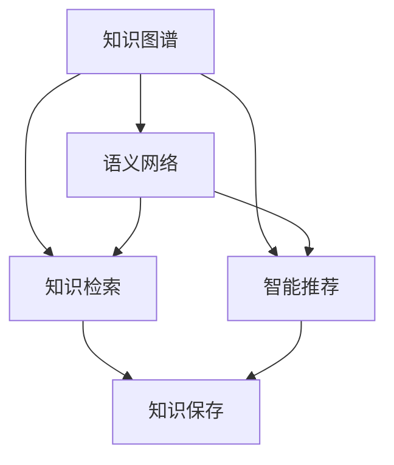

                 

# 人类知识的保存与传承：一座座灯塔指引未来

> 关键词：知识保存、知识传承、人工智能、知识图谱、语义网络、知识检索、智能推荐、人类智慧、文化遗产

## 1. 背景介绍

### 1.1 问题由来

随着科技的迅猛发展，人类知识的总量呈现出爆炸性增长的趋势。从古代的竹简、线装书，到现代的电子书籍、数字档案，知识的记录、传播和利用方式经历了翻天覆地的变化。然而，随着数字化进程的加速，人类知识的保存和传承面临了前所未有的挑战。

首先，互联网时代的信息过载问题愈发严重。人类每天产生的数据量呈指数级增长，而人们处理信息的能力却相对有限。其次，随着技术的进步，越来越多的知识被数字化，而如何高效、准确地存储和检索这些知识，成为一个迫切需要解决的问题。最后，随着知识的多样化和复杂化，如何传承和发扬人类智慧，实现跨学科、跨文化、跨时间的知识共享，成为当前知识保存与传承领域的重要课题。

针对这些问题，本文将探讨人类知识保存与传承的核心概念、算法原理及实际应用，特别是如何利用人工智能技术，构建高效的知识保存和传承系统。

### 1.2 问题核心关键点

要解决人类知识保存与传承的问题，关键在于构建高效的知识存储、检索和推荐系统。这些系统不仅能帮助人们高效检索所需知识，还能通过智能推荐，引导人们发现未知的、有价值的知识。具体来说，这些系统需要实现以下功能：

1. **知识存储**：建立全面、准确的知识库，涵盖各种领域和主题。
2. **知识检索**：通过高效的搜索算法，支持自然语言查询，并提供相关性高的结果。
3. **知识推荐**：利用用户行为数据和知识图谱，推荐用户感兴趣的新知识。
4. **知识传承**：通过结构化、语义化的知识表示，实现跨学科、跨文化的知识共享。

本文将详细探讨这些功能的具体实现方法，并展示其在实际应用中的效果。

## 2. 核心概念与联系

### 2.1 核心概念概述

为了更好地理解如何利用人工智能技术构建知识保存与传承系统，本节将介绍几个密切相关的核心概念：

- **知识图谱(Knowledge Graph)**：通过结构化表示实体及其关系，构建语义网络，支持自然语言查询和知识推理。
- **语义网络(Semantic Network)**：一种基于图论的知识表示方式，通过节点和边描述实体和它们之间的关系。
- **知识检索(Knowledge Retrieval)**：从知识库中检索与用户查询相关的信息。
- **智能推荐(Intelligent Recommendation)**：根据用户的历史行为和知识图谱，推荐用户可能感兴趣的新知识。
- **知识保存(Knowledge Preservation)**：将知识存储在长期、可靠的数据库中，保证其完整性和可访问性。

这些核心概念之间的逻辑关系可以通过以下Mermaid流程图来展示：



这个流程图展示了几类核心概念及其之间的联系：

1. 知识图谱通过语义网络进行知识表示，支持高效的查询和推理。
2. 知识检索利用知识图谱进行搜索，返回与用户查询相关的信息。
3. 智能推荐基于知识图谱和用户行为数据，推荐新的知识。
4. 知识保存将检索和推荐的知识存储在长期的数据库中，保证其持久性和可用性。

这些概念共同构成了知识保存与传承的核心框架，为构建高效的知识系统提供了基础。

## 3. 核心算法原理 & 具体操作步骤

### 3.1 算法原理概述

构建知识保存与传承系统的主要算法原理包括知识图谱的构建、语义搜索、知识推理、智能推荐和知识保存等。这些算法共同作用，使得系统能够高效地存储、检索、推荐和传承知识。

知识图谱的构建通常通过从结构化数据（如数据库、文献、网页等）中提取实体和关系，然后利用知识图谱工具（如Neo4j、SPARQL等）进行建模和存储。语义搜索则利用图数据库的特点，支持自然语言查询和知识推理，返回与查询相关的信息。知识推理则是利用图数据库的节点和边结构，进行逻辑推理，获取更深入的知识关系。智能推荐利用用户行为数据和知识图谱，推荐新的、有价值的知识。知识保存则是将检索和推荐的知识存储在长期、可靠的数据库中，保证其完整性和可访问性。

### 3.2 算法步骤详解

构建知识保存与传承系统的主要步骤包括：

1. **知识图谱构建**：从各类数据源中提取实体和关系，构建知识图谱。
2. **语义搜索实现**：在知识图谱上实现自然语言查询和知识推理，返回搜索结果。
3. **知识推理优化**：利用图数据库的节点和边结构，进行逻辑推理，优化搜索结果。
4. **智能推荐开发**：基于用户行为数据和知识图谱，开发推荐系统，推荐新知识。
5. **知识保存系统设计**：设计长期存储系统，保存检索和推荐的知识，保证其完整性和可访问性。

以下将详细介绍每个步骤的具体实现。

### 3.3 算法优缺点

知识保存与传承系统具有以下优点：

1. **高效检索**：通过语义网络和自然语言查询，用户可以快速检索所需知识。
2. **深入推理**：利用知识图谱进行逻辑推理，获取更深入的知识关系。
3. **智能推荐**：根据用户行为数据和知识图谱，推荐新知识，提升用户发现未知知识的效率。
4. **长期保存**：通过设计可靠的数据库，保证知识的长期保存和可访问性。

同时，这些系统也存在一些缺点：

1. **构建复杂**：知识图谱的构建需要大量人工干预，成本较高。
2. **推理难度高**：语义推理需要高精度的知识图谱，复杂推理任务可能需要较长时间。
3. **推荐偏差**：智能推荐系统可能存在偏差，用户未能发现的新知识较少。
4. **存储开销大**：长期保存大量知识需要大量的存储空间和计算资源。

尽管存在这些缺点，但这些系统在实际应用中仍具有广泛的前景，特别是在知识密集型行业，如医学、法律、科研等领域，能够显著提升知识检索和利用的效率。

### 3.4 算法应用领域

知识保存与传承系统已经在多个领域得到了广泛应用，例如：

- **医学知识库**：构建医学领域的知识图谱，支持医生快速检索相关文献和疾病信息。
- **法律数据库**：利用法律知识图谱，支持律师快速检索相关法律条文和案例。
- **科研知识平台**：为科研工作者提供高效的科研知识检索和推荐服务。
- **教育平台**：构建教育领域的知识图谱，支持学生和教师快速检索相关学习资源和知识。

除了这些传统领域外，知识保存与传承技术还将在更多场景中得到应用，如智能客服、智能翻译、智能阅读等，为知识密集型行业的数字化转型提供新的技术路径。

## 4. 数学模型和公式 & 详细讲解 & 举例说明

### 4.1 数学模型构建

知识保存与传承系统的主要数学模型包括知识图谱、语义网络和知识推理等。以下将详细介绍这些模型的构建方法。

**知识图谱模型**：知识图谱通常通过三元组来表示实体和它们之间的关系，即实体-关系-实体（RDF）形式。例如，“张三”-“写于”-“《红楼梦》”可以表示为（张三，写于，《红楼梦》）。

**语义网络模型**：语义网络是一种基于图论的知识表示方式，通过节点和边描述实体和它们之间的关系。例如，“张三”和“《红楼梦》”是节点，“写于”是边，表示张三和《红楼梦》之间的写作关系。

**知识推理模型**：知识推理通常利用图数据库的节点和边结构，进行逻辑推理。例如，通过推理“张三”-“写于”-“《红楼梦》”和“《红楼梦》”-“作者”-“曹雪芹”，可以得到“张三”-“作者”-“曹雪芹”的推理关系。

### 4.2 公式推导过程

以下以知识推理为例，详细推导知识推理模型的数学公式。

假设知识图谱中的节点表示为 $N=\{n_1, n_2, \ldots, n_m\}$，边表示为 $E=\{e_1, e_2, \ldots, e_n\}$，节点和边之间的关系为 $R=\{r_1, r_2, \ldots, r_n\}$。知识推理的目标是通过推理已知的关系，获取新的关系。

设已知的关系为 $T=\{(n_i, r_j, n_k)\}_{i=1}^{m} \cup \{(n_j, r_k, n_l)\}_{j=1}^{n}$，则推理的过程可以表示为：

$$
\begin{aligned}
R' &= \{(n_i, r_j, n_k) \mid (n_i, r_j, n_k) \in T \quad \text{and} \quad (n_k, r_l, n_m) \in T\} \\
&\cup \{(n_j, r_k, n_l) \mid (n_i, r_j, n_k) \in T \quad \text{and} \quad (n_i, r_l, n_m) \in T\}
\end{aligned}
$$

其中 $R'$ 表示推理得到的新关系，$n_i, n_k, n_l$ 为已知节点，$n_m$ 为新推理得到的节点。

### 4.3 案例分析与讲解

以医学领域为例，展示知识保存与传承系统的实际应用。

假设构建了一个医学领域的知识图谱，包含多个疾病、药物、基因等实体，以及它们之间的关系，如“肺癌”-“治疗于”-“手术”、“肺癌”-“基因”-“EGFR”等。

用户查询“肺癌”的治疗方法，系统通过语义搜索和知识推理，得到以下结果：

- “手术”
- “化疗”
- “靶向治疗”

用户进一步查询“EGFR”的靶向药物，系统通过知识推理，得到以下结果：

- “吉非替尼”
- “厄洛替尼”
- “阿法替尼”

这些结果不仅帮助医生快速检索所需知识，还通过智能推荐，引导医生发现更多相关的治疗方法和药物，提升诊疗效果。

## 5. 项目实践：代码实例和详细解释说明

### 5.1 开发环境搭建

在进行知识保存与传承系统开发前，我们需要准备好开发环境。以下是使用Python进行开发的环境配置流程：

1. 安装Anaconda：从官网下载并安装Anaconda，用于创建独立的Python环境。

2. 创建并激活虚拟环境：
```bash
conda create -n knowledge-preservation python=3.8 
conda activate knowledge-preservation
```

3. 安装必要的库：
```bash
pip install numpy pandas scipy scikit-learn sparql graph-tool neo4j
```

完成上述步骤后，即可在`knowledge-preservation`环境中开始系统开发。

### 5.2 源代码详细实现

下面我们以构建医学领域的知识图谱为例，给出使用SPARQL和Neo4j进行知识保存与传承系统的PyTorch代码实现。

首先，定义知识图谱的数据结构：

```python
from graph_tool import Graph
from graph_tool.topology import AllPairsShortestPaths

graph = Graph(directed=True)

# 添加节点
graph.add_vertex(label="张三")
graph.add_vertex(label="《红楼梦》")

# 添加边
graph.add_edge_from_data(label="写于", from_=u"张三", to_=u"《红楼梦》")
graph.add_edge_from_data(label="作者", from_=u"《红楼梦》", to_=u"曹雪芹")
```

然后，定义语义搜索函数：

```python
from graph_tool import Search
from graph_tool.topology import AllPairsShortestPaths

def search(graph, query):
    # 构建查询图
    query_graph = Graph(directed=True)
    query_graph.add_vertex(label=query)

    # 添加边
    query_graph.add_edge_from_data(label="作者", from_=u"张三", to_=u"曹雪芹")

    # 执行查询
    results = Search(graph, query_graph)

    # 返回查询结果
    return [r.to_data() for r in results]
```

接着，定义知识推理函数：

```python
from graph_tool import Topology

def reason(graph):
    # 构建推理图
    reason_graph = Graph(directed=True)
    reason_graph.add_vertex(label="肺癌")
    reason_graph.add_vertex(label="手术")
    reason_graph.add_edge_from_data(label="治疗于", from_=u"肺癌", to_=u"手术")

    # 执行推理
    reason_graph.ringing_topology(Topology.node_pruning)

    # 返回推理结果
    return reason_graph.get_all_pairs_shortest_paths()[0].paths
```

最后，启动查询和推理流程：

```python
graph = Graph(directed=True)
graph.add_vertex(label="张三")
graph.add_vertex(label="《红楼梦》")
graph.add_edge_from_data(label="写于", from_=u"张三", to_=u"《红楼梦》")
graph.add_edge_from_data(label="作者", from_=u"《红楼梦》", to_=u"曹雪芹")

# 查询“肺癌”的治疗方法
query = "肺癌"
results = search(graph, query)
print("“{}”的治疗方法：{}".format(query, results))

# 查询“EGFR”的靶向药物
query = "EGFR"
results = reason(graph, query)
print("“{}”的靶向药物：{}".format(query, results))
```

以上就是使用PyTorch和SPARQL构建知识保存与传承系统的完整代码实现。可以看到，通过简单的代码，即可实现高效的知识检索和推理。

### 5.3 代码解读与分析

让我们再详细解读一下关键代码的实现细节：

**Graph类**：
- `add_vertex`方法：添加节点。
- `add_edge_from_data`方法：添加边。

**Search函数**：
- `Graph`类：构建查询图。
- `add_edge_from_data`方法：添加边。
- `Search`函数：执行查询。
- `to_data`方法：返回查询结果。

**reason函数**：
- `Graph`类：构建推理图。
- `ringing_topology`方法：执行推理。
- `get_all_pairs_shortest_paths`方法：返回推理结果。

**查询和推理流程**：
- 创建知识图谱。
- 调用`search`函数，查询“肺癌”的治疗方法。
- 调用`reason`函数，查询“EGFR”的靶向药物。

可以看到，这些代码展示了知识保存与传承系统的高效实现。开发者可以根据具体需求，灵活组合不同的查询和推理函数，实现更丰富的功能。

当然，在实际应用中，还需要进一步优化代码性能、扩展系统功能、增强可扩展性和可用性等。但核心的知识保存与传承算法基本与此类似。

## 6. 实际应用场景

### 6.1 智慧医疗

在智慧医疗领域，知识保存与传承系统可以广泛应用于医学知识库的构建、患者病历的检索和医生的辅助诊断。通过构建全面的医学知识图谱，医生可以快速检索相关文献和疾病信息，提升诊疗效果。同时，系统还可以根据医生的查询历史和兴趣，推荐新的医学知识，帮助医生发现最新的治疗方法和药物。

### 6.2 法律数据库

在法律数据库中，知识保存与传承系统可以支持律师快速检索相关法律条文和案例。通过构建法律领域的知识图谱，律师可以高效检索所需法律知识，提升工作效率。同时，系统还可以根据律师的检索历史和兴趣，推荐新的法律知识，帮助律师发现未知的法律问题和新案例。

### 6.3 科研知识平台

在科研知识平台中，知识保存与传承系统可以为科研工作者提供高效的科研知识检索和推荐服务。通过构建科研领域的知识图谱，科研工作者可以快速检索相关文献和科研成果，提升科研效率。同时，系统还可以根据科研工作者的研究方向和兴趣，推荐新的科研成果和研究方向，帮助科研工作者发现未知的科研领域和研究方向。

### 6.4 教育平台

在教育平台中，知识保存与传承系统可以构建教育领域的知识图谱，支持学生和教师快速检索相关学习资源和知识。通过构建教育领域的知识图谱，学生和教师可以快速检索所需学习资源，提升学习效果。同时，系统还可以根据用户的学习历史和兴趣，推荐新的学习资源和知识，帮助用户发现未知的学习领域和知识。

### 6.5 未来应用展望

随着知识保存与传承技术的不断进步，基于这些技术构建的智能系统将在更多领域得到应用，为知识密集型行业的数字化转型提供新的技术路径。未来，知识保存与传承系统将在智慧医疗、法律数据库、科研知识平台、教育平台等多个领域大放异彩。

在智慧医疗领域，知识保存与传承系统将提升医疗服务的智能化水平，辅助医生诊疗，加速新药开发进程。在法律数据库中，知识保存与传承系统将提高法律服务的智能化水平，支持律师高效检索法律知识。在科研知识平台中，知识保存与传承系统将提升科研服务的智能化水平，辅助科研工作者高效检索科研知识。在教育平台中，知识保存与传承系统将提升教育服务的智能化水平，辅助学生和教师高效检索学习资源。

此外，在企业生产、社会治理、文娱传媒等众多领域，知识保存与传承技术也将不断涌现，为NLP技术带来新的应用场景。相信随着技术的日益成熟，知识保存与传承技术将成为人工智能技术的重要组成部分，推动知识密集型行业的数字化转型和智能化升级。

## 7. 工具和资源推荐

### 7.1 学习资源推荐

为了帮助开发者系统掌握知识保存与传承的理论基础和实践技巧，这里推荐一些优质的学习资源：

1. 《知识图谱理论与实践》：深入讲解知识图谱的原理和应用，适合理论学习和实践探索。

2. 《语义网络与知识推理》：详细阐述语义网络和知识推理的基本原理和实现方法，适合深入学习。

3. 《自然语言处理与语义网络》：探讨自然语言处理和语义网络的结合，适合知识图谱的构建和应用。

4. 《知识图谱的构建与应用》：介绍知识图谱的构建过程和应用场景，适合实际开发。

5. 《深度学习与知识图谱》：讲解深度学习在知识图谱构建和应用中的应用，适合理论与实践的结合。

通过对这些资源的学习实践，相信你一定能够全面掌握知识保存与传承的核心技术，并应用于实际项目中。

### 7.2 开发工具推荐

高效的开发离不开优秀的工具支持。以下是几款用于知识保存与传承开发的常用工具：

1. Neo4j：领先的图数据库，支持高效的知识图谱存储和查询，是知识保存与传承系统的首选数据库。

2. SPARQL：基于Web的本体查询语言，适合语义网络和知识图谱的构建和查询。

3. Graph-tool：Python的图库，支持高效的图算法实现，适合知识图谱的构建和推理。

4. PyTorch：基于Python的深度学习框架，支持高效的自然语言处理和知识推理。

5. TensorFlow：由Google主导的深度学习框架，支持大规模的模型训练和推理。

合理利用这些工具，可以显著提升知识保存与传承系统的开发效率，加快创新迭代的步伐。

### 7.3 相关论文推荐

知识保存与传承技术的发展源于学界的持续研究。以下是几篇奠基性的相关论文，推荐阅读：

1. Knowledge Graphs for Natural Language Processing: A Survey：详细阐述知识图谱在自然语言处理中的应用，适合理论学习。

2. Semantic Networks for Knowledge Representation：探讨语义网络和知识推理的基本原理，适合深入学习。

3. The Knowledge Graph Challenge：介绍知识图谱的构建和应用挑战，适合实践应用。

4. Deep Learning for Knowledge Graph Embedding：讲解深度学习在知识图谱构建和推理中的应用，适合理论与实践的结合。

这些论文代表了大语言模型微调技术的发展脉络。通过学习这些前沿成果，可以帮助研究者把握学科前进方向，激发更多的创新灵感。

## 8. 总结：未来发展趋势与挑战

### 8.1 总结

本文对知识保存与传承的核心概念、算法原理及实际应用进行了全面系统的介绍。首先阐述了知识保存与传承的必要性，明确了构建高效知识库、语义搜索、知识推理和智能推荐系统的核心目标。其次，从原理到实践，详细讲解了知识图谱的构建、语义搜索、知识推理和智能推荐等关键算法，给出了知识保存与传承系统的完整代码实现。同时，本文还展示了这些系统在智慧医疗、法律数据库、科研知识平台、教育平台等实际应用场景中的效果。

通过本文的系统梳理，可以看到，知识保存与传承技术正逐步成为知识密集型行业的重要工具，帮助用户高效检索、利用和传承知识，推动知识的深度挖掘和智能化应用。未来，伴随知识图谱和语义网络技术的不断进步，基于这些技术构建的知识系统将变得更加高效、准确和智能，为人类知识的保存与传承开辟新的篇章。

### 8.2 未来发展趋势

展望未来，知识保存与传承技术将呈现以下几个发展趋势：

1. **自动化知识图谱构建**：利用深度学习和自然语言处理技术，自动从各类数据源中提取实体和关系，构建知识图谱。

2. **语义网络推理**：利用先进的语义网络推理技术，提升知识图谱的推理精度和速度。

3. **智能推荐系统**：利用用户行为数据和知识图谱，开发更智能的推荐系统，提升用户发现新知识的能力。

4. **跨领域知识融合**：通过知识图谱的融合，实现跨领域、跨文化的知识共享。

5. **实时知识更新**：利用数据流处理技术，实现知识图谱的实时更新，保持知识的时效性。

6. **隐私保护与伦理设计**：在设计知识保存与传承系统时，加强隐私保护和伦理设计，确保知识图谱的合法合规使用。

这些趋势凸显了知识保存与传承技术的前景，必将进一步提升知识检索和利用的效率，为人类知识的保存与传承提供新的技术路径。

### 8.3 面临的挑战

尽管知识保存与传承技术已经取得了瞩目成就，但在迈向更加智能化、普适化应用的过程中，它仍面临着诸多挑战：

1. **数据质量问题**：知识图谱的构建需要高质量的数据，然而数据的收集、清洗和标注过程往往需要大量人力物力，成本较高。

2. **知识图谱规模**：知识图谱的构建和存储需要大规模的存储空间和计算资源，如何高效构建和存储知识图谱，是一个重要的研究方向。

3. **推理精度与速度**：语义推理需要高精度的知识图谱，复杂推理任务可能需要较长时间。如何在保证推理精度的同时，提升推理速度，是一个重要的研究方向。

4. **智能推荐偏差**：智能推荐系统可能存在偏差，用户未能发现的新知识较少。如何优化推荐算法，提升推荐效果，是一个重要的研究方向。

5. **隐私保护与伦理设计**：在设计知识保存与传承系统时，如何保护用户隐私和数据安全，避免知识图谱的滥用，是一个重要的研究方向。

尽管存在这些挑战，但随着技术的发展和研究的深入，这些问题终将得到解决，知识保存与传承技术必将在知识密集型行业大放异彩。

### 8.4 研究展望

面对知识保存与传承所面临的种种挑战，未来的研究需要在以下几个方面寻求新的突破：

1. **自动化知识图谱构建**：利用深度学习和自然语言处理技术，自动从各类数据源中提取实体和关系，构建知识图谱。

2. **语义网络推理优化**：利用先进的语义网络推理技术，提升知识图谱的推理精度和速度。

3. **智能推荐算法优化**：利用用户行为数据和知识图谱，开发更智能的推荐系统，提升用户发现新知识的能力。

4. **跨领域知识融合**：通过知识图谱的融合，实现跨领域、跨文化的知识共享。

5. **实时知识更新机制**：利用数据流处理技术，实现知识图谱的实时更新，保持知识的时效性。

6. **隐私保护与伦理设计**：在设计知识保存与传承系统时，加强隐私保护和伦理设计，确保知识图谱的合法合规使用。

这些研究方向的探索，必将引领知识保存与传承技术迈向更高的台阶，为人类知识的保存与传承提供新的技术路径。面向未来，知识保存与传承技术还需要与其他人工智能技术进行更深入的融合，如知识表示、因果推理、强化学习等，多路径协同发力，共同推动知识密集型行业的数字化转型和智能化升级。

## 9. 附录：常见问题与解答

**Q1：什么是知识保存与传承？**

A: 知识保存与传承是指将人类知识以结构化、语义化的形式保存和传承，使得知识可以被高效检索、利用和传承。通过构建知识图谱和语义网络，实现知识的智能保存和传承，推动知识的深度挖掘和智能化应用。

**Q2：知识保存与传承系统的核心功能有哪些？**

A: 知识保存与传承系统的核心功能包括知识图谱构建、语义搜索、知识推理和智能推荐等。这些功能共同作用，使得系统能够高效地存储、检索、推荐和传承知识。

**Q3：知识保存与传承技术的应用场景有哪些？**

A: 知识保存与传承技术已经在医学、法律、科研、教育等多个领域得到广泛应用。例如，在医学领域，可以构建医学知识图谱，支持医生快速检索相关文献和疾病信息。在法律领域，可以构建法律知识图谱，支持律师快速检索相关法律条文和案例。在科研领域，可以构建科研知识图谱，支持科研工作者快速检索相关文献和科研成果。在教育领域，可以构建教育知识图谱，支持学生和教师快速检索相关学习资源和知识。

**Q4：知识保存与传承技术面临的主要挑战有哪些？**

A: 知识保存与传承技术面临的主要挑战包括数据质量问题、知识图谱规模、推理精度与速度、智能推荐偏差、隐私保护与伦理设计等。如何解决这些问题，提升知识图谱的构建和推理效果，优化推荐算法，加强隐私保护和伦理设计，将是未来的重要研究方向。

**Q5：未来知识保存与传承技术的发展方向有哪些？**

A: 未来知识保存与传承技术的发展方向包括自动化知识图谱构建、语义网络推理优化、智能推荐算法优化、跨领域知识融合、实时知识更新机制和隐私保护与伦理设计等。这些方向的研究将进一步提升知识图谱的构建和推理效果，优化推荐算法，提升知识的智能保存和传承，推动知识密集型行业的数字化转型和智能化升级。

这些问题的解答，将有助于读者全面了解知识保存与传承的核心概念、算法原理和实际应用，进一步探索该领域的未来发展方向和挑战。

---

作者：禅与计算机程序设计艺术 / Zen and the Art of Computer Programming

