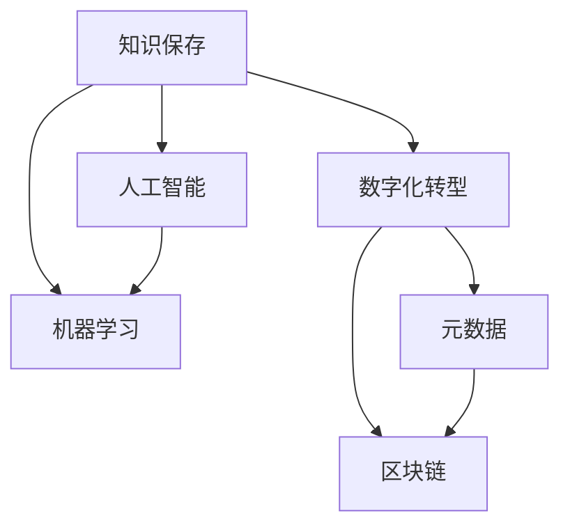

                 

# 人类知识的保存技术：为未来保存文明

> 关键词：知识保存,文明传承,数字化转型,人工智能,机器学习,元数据,区块链,长期保存

## 1. 背景介绍

在信息时代，知识的保存和传承已经成为人类社会可持续发展的重要课题。随着数字化技术的迅猛发展，电子文档、数字档案、多媒体信息等数字化资源成为知识保存的主要载体。然而，这些数字资源面临着数据量大、保存环境复杂、访问方式多样化等诸多挑战。如何高效、安全、长期地保存这些珍贵的数字资产，确保其完整性、可用性、可访问性和真实性，成为我们面临的重要任务。

本文将系统介绍几种基于人工智能和区块链技术的知识保存方法，探讨其在数字化转型中的潜在价值和实际应用。

## 2. 核心概念与联系

### 2.1 核心概念概述

为更好地理解本文介绍的知识点，以下将介绍几个密切相关的核心概念：

- **知识保存(Knowledge Preservation)**：指对人类知识资源进行收集、整理、归档、存储和管理的全生命周期活动。目的是为了长期保存知识，便于未来获取、再利用和传播。

- **数字化转型(Digital Transformation)**：指通过数字化技术对传统业务流程和组织架构进行重塑，提升运营效率和服务质量，实现业务创新和数字化增长。

- **人工智能(Artificial Intelligence, AI)**：指通过机器学习、自然语言处理、计算机视觉等技术，模拟和扩展人类智能，实现自动化决策和智能化服务。

- **机器学习(Machine Learning, ML)**：指通过数据驱动的学习模型，实现自主决策和模式识别，是人工智能的核心技术之一。

- **元数据(Metadata)**：指对数字化资源进行描述和标识的数据，包括文档内容、创建者、创建时间、权限等，用于管理和检索数字资源。

- **区块链(Blockchain)**：指去中心化的分布式账本技术，通过区块链共识算法确保数据的安全性、透明性和不可篡改性。

### 2.2 核心概念原理和架构的 Mermaid 流程图



## 3. 核心算法原理 & 具体操作步骤

### 3.1 算法原理概述

知识保存技术主要涉及数据的收集、整理、存储、管理和检索等多个环节。本文介绍的基于人工智能和区块链的知识保存方法，将从以下三个方面进行阐述：

1. **数据收集和整理**：利用机器学习技术自动识别和筛选高质量的数字化资源。
2. **数据存储和管理**：通过区块链技术确保数据的完整性、安全性和长期保存。
3. **数据检索和利用**：结合人工智能和元数据技术，提供高效、便捷的数据检索和利用方式。

### 3.2 算法步骤详解

#### 3.2.1 数据收集和整理

数据收集是知识保存的首要步骤。在数字化转型背景下，可以通过以下步骤实现数据收集和整理：

1. **自动化数据采集**：利用爬虫技术和网络爬虫工具，自动采集互联网上的数字化资源。
2. **数据筛选和清洗**：使用机器学习算法，如文本分类、聚类和异常检测，筛选出高质量的资源，并清洗无效数据。
3. **数据标注和归档**：对筛选后的数据进行标注，创建元数据，归档到统一的存储系统中。

#### 3.2.2 数据存储和管理

数据存储和管理是知识保存的关键环节。区块链技术在数据存储和管理中具有独特的优势：

1. **去中心化存储**：通过分布式节点网络，确保数据存储在多个地方，避免单点故障。
2. **加密保护**：利用加密技术，确保数据在传输和存储过程中的安全性。
3. **区块链共识算法**：通过共识算法，确保数据的一致性和不可篡改性。
4. **智能合约**：通过智能合约，实现数据的自动化管理和权限控制。

#### 3.2.3 数据检索和利用

数据检索和利用是知识保存的重要应用场景。结合人工智能和元数据技术，可以实现高效的数据检索和利用：

1. **语义检索**：利用自然语言处理技术，对用户查询进行语义分析和理解，提供更加精准的数据检索结果。
2. **推荐系统**：使用机器学习算法，如协同过滤、内容推荐和深度学习，根据用户偏好推荐相关数据。
3. **数据可视化**：通过数据可视化技术，如图表、地图和仪表盘，帮助用户更直观地理解数据。

### 3.3 算法优缺点

基于人工智能和区块链的知识保存方法具有以下优点：

1. **高效性**：通过自动化数据采集、机器学习筛选和区块链存储，大幅提升数据处理的效率。
2. **安全性**：利用加密技术和区块链共识算法，确保数据的安全性和不可篡改性。
3. **灵活性**：结合人工智能和元数据技术，提供多种数据检索和利用方式，满足不同用户的需求。
4. **可扩展性**：通过分布式存储和区块链技术，可以轻松扩展存储规模，适应海量数据。

同时，这些方法也存在一定的局限性：

1. **技术门槛高**：需要具备人工智能、区块链、大数据等领域的知识，技术实施难度较大。
2. **成本较高**：自动化数据采集、区块链存储和人工智能算法训练等都需要较大的计算资源和时间成本。
3. **隐私保护**：在数据收集和存储过程中，需要确保用户的隐私保护，防止数据泄露和滥用。

### 3.4 算法应用领域

基于人工智能和区块链的知识保存方法，已经应用于多个领域，包括：

- **数字档案馆**：保存和归档政府、企业、科研机构等产生的数字化文档和档案。
- **博物馆和图书馆**：保存和展示数字化文物、图书、手稿等资源。
- **科学数据管理**：保存和共享科学实验数据、研究报告等。
- **金融和法律数据**：保存和管理系统生成的交易记录、合同协议等。
- **医疗和健康数据**：保存和共享电子病历、基因数据、健康记录等。
- **文化遗产保护**：保存和展示数字化艺术品、历史文献等。

## 4. 数学模型和公式 & 详细讲解 & 举例说明

### 4.1 数学模型构建

基于人工智能和区块链的知识保存方法，涉及多个数学模型的构建，主要包括：

1. **数据采集和预处理模型**：利用机器学习算法，如文本分类、聚类和异常检测，筛选和清洗数字化资源。
2. **数据存储和管理模型**：基于区块链技术，构建分布式存储和共识算法模型。
3. **数据检索和利用模型**：结合人工智能和元数据技术，构建语义检索和推荐系统模型。

### 4.2 公式推导过程

以文本分类为例，利用机器学习算法进行数据筛选和清洗：

1. **数据预处理**：将文本转换为向量表示，去除停用词和噪音数据。
2. **特征提取**：使用TF-IDF、词袋模型或词嵌入技术，提取文本特征。
3. **模型训练**：利用分类算法，如朴素贝叶斯、支持向量机或神经网络，训练分类模型。
4. **模型评估**：在测试集上评估分类模型，选择最优模型。

### 4.3 案例分析与讲解

#### 4.3.1 数据采集和预处理

以政府网站公开的数字化文档为例，利用Python和Scrapy爬虫工具，自动采集文档内容：

```python
import scrapy
from scrapy.spiders import CrawlSpider

class GovernmentDocSpider(CrawlSpider):
    name = 'government_doc'
    start_urls = ['http://www.example.com/document']

    def parse(self, response):
        doc_title = response.css('h2.title::text').extract_first()
        doc_text = response.css('div.body::text').extract()
        yield {
            'title': doc_title,
            'text': doc_text,
        }
```

使用TF-IDF和LDA算法，对文本进行特征提取和主题建模：

```python
from sklearn.feature_extraction.text import TfidfVectorizer
from sklearn.decomposition import LatentDirichletAllocation

vectorizer = TfidfVectorizer(stop_words='english')
X = vectorizer.fit_transform(doc_text)

lda = LatentDirichletAllocation(n_components=10)
lda.fit(X)
```

#### 4.3.2 数据存储和管理

以分布式文件系统Hadoop和区块链技术为例，构建数据存储和管理模型：

1. **数据写入**：将文本数据写入Hadoop分布式文件系统中。
2. **数据校验**：利用区块链技术，对数据进行校验和加密。
3. **数据存储**：将校验后的数据存储在多个区块链节点中。
4. **数据查询**：根据哈希值在区块链网络中进行查询。

#### 4.3.3 数据检索和利用

以语义检索和推荐系统为例，构建数据检索和利用模型：

1. **语义索引**：利用Elasticsearch构建语义索引，将文本内容转换为向量表示。
2. **查询匹配**：根据用户查询，匹配语义索引中的向量，返回相关文档。
3. **推荐算法**：利用协同过滤或深度学习算法，推荐相关文档。

## 5. 项目实践：代码实例和详细解释说明

### 5.1 开发环境搭建

在开发环境搭建方面，我们需要安装Python、Pip和Scrapy等工具：

1. **Python安装**：从官网下载并安装Python，选择合适的版本。
2. **Pip安装**：在命令行中运行`pip install -r requirements.txt`，安装依赖包。
3. **Scrapy安装**：在命令行中运行`pip install scrapy`，安装Scrapy爬虫工具。

### 5.2 源代码详细实现

以下是一个简单的基于Python和Scrapy的Web爬虫代码实现，用于自动化采集政府网站公开的数字化文档：

```python
import scrapy
from scrapy.spiders import CrawlSpider

class GovernmentDocSpider(CrawlSpider):
    name = 'government_doc'
    start_urls = ['http://www.example.com/document']

    def parse(self, response):
        doc_title = response.css('h2.title::text').extract_first()
        doc_text = response.css('div.body::text').extract()
        yield {
            'title': doc_title,
            'text': doc_text,
        }
```

### 5.3 代码解读与分析

上述代码中，我们定义了一个名为`GovernmentDocSpider`的爬虫类，继承自`CrawlSpider`。在`parse`方法中，我们使用CSS选择器获取文档标题和文本内容，并将结果封装为字典返回。

在实际应用中，我们还需要结合其他工具和技术，如文本分类、语义索引和推荐算法等，实现完整的数据保存和利用流程。

### 5.4 运行结果展示

通过运行上述爬虫代码，我们可以自动采集政府网站公开的数字化文档，并进行初步筛选和清洗。在后续的预处理和建模过程中，可以使用TensorFlow、PyTorch等深度学习框架，构建更加复杂的模型，实现更高质量的数据保存和利用。

## 6. 实际应用场景

### 6.1 数字档案馆

数字档案馆是知识保存的重要应用场景之一。通过结合人工智能和区块链技术，数字档案馆可以实现高效、安全、长期的知识保存和检索：

1. **自动化采集**：利用爬虫工具自动采集互联网上的数字化资源，并进行预处理和标注。
2. **去中心化存储**：将数字化资源存储在多个区块链节点中，确保数据的完整性和安全性。
3. **语义检索**：利用自然语言处理技术，对用户查询进行语义分析和理解，提供精准的检索结果。
4. **元数据管理**：利用元数据技术，对数字化资源进行描述和标识，方便管理和检索。

### 6.2 博物馆和图书馆

博物馆和图书馆也面临大量的数字化资源保存和利用需求。通过结合人工智能和区块链技术，博物馆和图书馆可以实现更加灵活高效的知识保存和展示：

1. **数字化资源采集**：利用自动化工具和人工标注，收集和整理博物馆和图书馆的数字化资源。
2. **去中心化存储**：将数字化资源存储在多个区块链节点中，确保数据的完整性和安全性。
3. **多模态展示**：利用三维建模和虚拟现实技术，对数字化资源进行三维展示和互动体验。
4. **语义检索**：利用自然语言处理技术，对用户查询进行语义分析和理解，提供精准的检索结果。

### 6.3 科学数据管理

科学数据管理是知识保存的重要应用场景之一。通过结合人工智能和区块链技术，科学数据管理可以实现高效、安全、长期的知识保存和共享：

1. **数据采集和预处理**：利用机器学习算法，对科学实验数据进行筛选和清洗。
2. **去中心化存储**：将科学数据存储在多个区块链节点中，确保数据的安全性和长期保存。
3. **数据共享和合作**：利用智能合约和区块链技术，实现数据的自动共享和合作。
4. **数据分析和挖掘**：利用人工智能算法，对科学数据进行分析和挖掘，发现新的科学规律。

### 6.4 未来应用展望

基于人工智能和区块链的知识保存技术，未来将有望在更多领域得到广泛应用，为数字化转型带来新的机遇和挑战：

1. **数字文化遗产保护**：利用区块链技术，保存和展示数字化艺术品和历史文献。
2. **智能合约和自动化管理**：利用智能合约和区块链技术，实现数据的自动化管理和权限控制。
3. **智慧城市和物联网**：利用区块链技术，保存和共享城市数据和物联网设备数据。
4. **医疗和健康数据管理**：保存和共享电子病历、基因数据、健康记录等医疗数据。
5. **金融和法律数据管理**：保存和管理系统生成的交易记录、合同协议等金融和法律数据。

## 7. 工具和资源推荐

### 7.1 学习资源推荐

为了帮助开发者系统掌握基于人工智能和区块链的知识保存技术，这里推荐一些优质的学习资源：

1. **《深度学习》（Ian Goodfellow等著）**：系统介绍了深度学习的基本概念和算法，是了解人工智能的必读书籍。
2. **《区块链原理与技术》（Zongze Wu等著）**：全面介绍了区块链的基本原理和技术实现，是了解区块链的入门读物。
3. **《自然语言处理综论》（Daniel Jurafsky等著）**：介绍了自然语言处理的基本技术和应用，是了解NLP的权威教材。
4. **《数据科学导论》（Joachim M. Buhmann等著）**：介绍了数据科学的基本概念和方法，是了解数据科学的入门读物。
5. **《元数据管理与应用》（Gene Kim等著）**：介绍了元数据管理的基本概念和应用，是了解元数据的实用指南。

### 7.2 开发工具推荐

在知识保存技术的开发过程中，以下工具可以帮助我们更高效地进行数据采集、预处理、存储和管理：

1. **Python**：开源的高级编程语言，广泛应用于人工智能和数据科学领域。
2. **Pip**：Python的包管理工具，可以方便地安装和管理第三方库。
3. **Scrapy**：Python爬虫框架，用于自动化采集和处理网页数据。
4. **Hadoop**：分布式文件系统，用于大规模数据存储和管理。
5. **Elasticsearch**：基于Lucene的分布式搜索和分析引擎，用于构建语义索引和检索系统。
6. **TensorFlow**：开源的深度学习框架，用于构建各种深度学习模型。
7. **PyTorch**：开源的深度学习框架，提供了丰富的深度学习模型和算法。
8. **智能合约平台**：如Ethereum、Hyperledger等，提供区块链技术的支持。

### 7.3 相关论文推荐

基于人工智能和区块链的知识保存技术，已经吸引了大量学者的关注，并取得了丰硕的研究成果。以下是几篇具有代表性的论文，推荐阅读：

1. **《区块链与分布式技术》（Lina Liu等著）**：介绍了区块链的基本原理和应用，探讨了区块链在知识保存中的应用。
2. **《基于深度学习的信息检索技术》（Jianbo Shi等著）**：介绍了深度学习在信息检索中的应用，提出了基于深度学习的语义检索模型。
3. **《元数据管理与数据质量》（Haifeng Wang等著）**：介绍了元数据的基本概念和管理方法，探讨了元数据在知识保存中的应用。
4. **《基于区块链的数据管理系统》（Zongze Wu等著）**：介绍了基于区块链的数据管理系统，探讨了区块链在数据存储和管理中的应用。
5. **《基于自然语言处理的数据检索技术》（Daniel Jurafsky等著）**：介绍了自然语言处理的基本技术和应用，探讨了自然语言处理在数据检索中的应用。

## 8. 总结：未来发展趋势与挑战

### 8.1 研究成果总结

本文介绍了基于人工智能和区块链的知识保存技术，系统阐述了其在数字化转型中的潜在价值和实际应用。通过结合人工智能和区块链技术，可以高效、安全、长期地保存和利用知识资源，为未来保存文明。

### 8.2 未来发展趋势

基于人工智能和区块链的知识保存技术，未来将呈现以下几个发展趋势：

1. **自动化和智能化**：随着自动化工具和人工智能算法的不断进步，数据采集、预处理和建模将变得更加高效和智能化。
2. **去中心化和分布式**：分布式存储和区块链技术将进一步普及，实现去中心化和分布式的数据保存和管理。
3. **跨领域融合**：结合人工智能和区块链技术，跨领域的知识保存和应用将变得更加广泛和深入。
4. **实时性和交互性**：利用自然语言处理和人工智能技术，提供实时性的数据检索和交互体验。
5. **可扩展性和安全性**：利用区块链共识算法和智能合约，实现数据的可扩展性和安全性。

### 8.3 面临的挑战

尽管基于人工智能和区块链的知识保存技术已经取得了一些进展，但在推广应用过程中仍面临诸多挑战：

1. **技术复杂性**：人工智能和区块链技术较为复杂，需要具备相应的技术和知识。
2. **成本和资源**：自动化数据采集、区块链存储和人工智能算法训练等需要较大的计算资源和时间成本。
3. **隐私保护**：在数据收集和存储过程中，需要确保用户的隐私保护，防止数据泄露和滥用。
4. **标准和规范**：缺乏统一的标准和规范，影响技术的应用和推广。
5. **互操作性和互操作性**：不同系统和平台之间的互操作性较差，影响数据的共享和利用。

### 8.4 研究展望

基于人工智能和区块链的知识保存技术，未来需要在以下几个方面进行深入研究和探索：

1. **自动化和智能化**：开发更加自动化和智能化的工具和算法，提高数据处理的效率和质量。
2. **分布式和去中心化**：进一步优化分布式存储和区块链技术，实现更高效和可靠的数据保存和管理。
3. **跨领域融合**：结合人工智能和区块链技术，实现跨领域的知识保存和应用。
4. **隐私保护和安全**：开发更加安全和隐私保护的技术和算法，确保数据的完整性和安全性。
5. **标准和规范**：制定统一的标准和规范，推动技术的普及和应用。
6. **互操作性和互操作性**：实现不同系统和平台之间的互操作性，促进数据的共享和利用。

## 9. 附录：常见问题与解答

**Q1：什么是知识保存？**

A: 知识保存指对人类知识资源进行收集、整理、归档、存储和管理的全生命周期活动，目的是为了长期保存知识，便于未来获取、再利用和传播。

**Q2：基于人工智能和区块链的知识保存技术有何优势？**

A: 基于人工智能和区块链的知识保存技术具有高效性、安全性、灵活性和可扩展性等优势。通过自动化数据采集、机器学习筛选、区块链存储和人工智能算法优化，可以大幅提升数据处理的效率和质量，同时确保数据的安全性和长期保存。

**Q3：数据采集和预处理过程中需要注意哪些问题？**

A: 数据采集和预处理过程中，需要注意数据来源的合法性、数据质量和数据清洗等问题。利用自动化工具和人工智能算法，可以有效提高数据处理的效率和质量。

**Q4：如何确保数据在存储和传输过程中的安全性？**

A: 通过区块链技术和加密算法，可以确保数据在存储和传输过程中的安全性。利用区块链共识算法和智能合约，可以实现数据的自动管理和权限控制，确保数据的安全性和不可篡改性。

**Q5：如何在保证数据安全性的同时，提供高效的数据检索和利用方式？**

A: 利用自然语言处理和人工智能技术，结合语义索引和推荐系统，可以提供高效的数据检索和利用方式。通过深度学习算法和协同过滤算法，可以实现精准的语义检索和推荐，满足不同用户的需求。

---

作者：禅与计算机程序设计艺术 / Zen and the Art of Computer Programming

