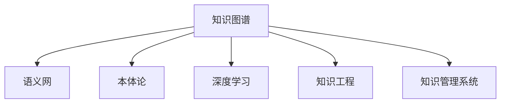

                 

# 人类知识的保存：一座座灯塔照亮未来

> 关键词：知识图谱, 大数据, 深度学习, 机器学习, 语义网, 知识工程, 知识管理系统

## 1. 背景介绍

### 1.1 问题由来
随着互联网技术的飞速发展，人类每天产生的数据量呈指数级增长，数据类型也日益丰富多样，从结构化数据到半结构化、非结构化数据，数据形式和内容不断变化。如何高效地存储、管理和利用这些海量数据，提取其中的有用信息，成为了一个亟待解决的难题。

数据本身只是信息的载体，真正的价值在于能够被理解和应用。传统的数据管理系统，如关系数据库、搜索引擎等，虽然能对结构化数据进行较好的管理和查询，但对复杂的数据关联、语义理解和知识发现能力有限。而随着大数据和人工智能技术的崛起，知识图谱作为一种新型的数据组织方式，正逐渐成为解决上述问题的有力工具。

### 1.2 问题核心关键点
知识图谱（Knowledge Graphs）是一种用于描述实体、属性及实体间关系的数据组织方式，采用图结构的形式表示知识，支持复杂查询和推理。近年来，知识图谱成为了人工智能、信息工程、认知科学等领域的研究热点，在知识管理、信息检索、自然语言处理等方面展现出强大的应用潜力。

知识图谱的核心在于构建准确、全面、语义化的实体与关系网络，通过深度学习和语义分析技术，实现对复杂语义关系的挖掘和推理。其应用范围广泛，涉及医学、金融、教育、物流等多个行业领域。

### 1.3 问题研究意义
构建知识图谱，不仅可以实现对海量数据的高效管理和分析，还可以进一步提升信息的关联性、可理解性和可操作性。具体而言，知识图谱的开发和应用具有以下重要意义：

1. **提升数据价值**：通过构建知识图谱，可以将大量孤立的数据整合起来，形成结构化的知识体系，使得数据更加有价值。
2. **增强信息理解**：知识图谱具有强大的语义理解能力，可以通过自动化的方式，从原始数据中提取出有用信息。
3. **促进知识共享**：知识图谱可以作为公共语义基础设施，实现不同系统和应用之间的知识共享与协作。
4. **支撑智能决策**：结合人工智能算法，知识图谱可以辅助人类进行复杂决策，提高决策的科学性和效率。
5. **推动技术创新**：知识图谱为大数据、人工智能等前沿技术提供了丰富的应用场景，推动技术的发展和应用。

## 2. 核心概念与联系

### 2.1 核心概念概述

为了更好地理解知识图谱的理论基础和技术实现，本节将介绍几个关键概念及其相互联系：

- **知识图谱（Knowledge Graphs）**：采用图结构存储知识，描述实体、属性及实体间的关系。常见的知识图谱包括DBpedia、Freebase、YAGO等。
- **语义网（Semantic Web）**：Web的语义化发展，通过资源描述框架（RDF）等技术，实现对Web内容的语义理解和关联。
- **本体论（Ontology）**：描述概念和概念之间的关系，是知识图谱和语义网的重要基础。
- **深度学习（Deep Learning）**：一种基于多层神经网络的学习方法，能够自动从数据中学习特征，广泛应用于知识图谱构建和推理。
- **知识工程（Knowledge Engineering）**：将人类知识进行形式化和自动化的过程，知识图谱是其中一种实现形式。
- **知识管理系统（Knowledge Management Systems）**：支持知识存储、查询、更新等操作的系统平台，知识图谱是重要的知识表示方式之一。

这些概念之间的逻辑关系可以通过以下Mermaid流程图来展示：



### 2.2 核心概念原理和架构的 Mermaid 流程图


在上述流程图中，每个节点表示知识图谱构建和应用中的一个步骤，箭头表示数据流向。数据首先经过收集、清洗、标注等预处理，然后进入实体识别和关系抽取阶段，通过深度学习技术提取实体和关系，并结合关系推理机制，构建出知识图谱。最后，知识图谱可以被存储在数据库中，用于支持知识查询和应用。

## 3. 核心算法原理 & 具体操作步骤

### 3.1 算法原理概述

知识图谱的构建和应用通常采用以下步骤：

1. **数据收集与预处理**：从各种数据源（如Web页面、文献、数据库等）收集数据，并进行清洗、标注等预处理，去除噪声和不相关数据。
2. **实体识别与关系抽取**：对预处理后的数据进行实体识别，确定数据中的实体和关系，通过自然语言处理技术，从文本中提取实体名称、关系标签等。
3. **关系推理与知识整合**：利用深度学习模型进行关系推理，将新关系与已有知识图谱中的关系进行整合，构建出完整的知识图谱。
4. **知识存储与查询**：将构建好的知识图谱存储在数据库中，并开发出支持查询和应用的系统，供用户进行信息检索、推理和应用。

### 3.2 算法步骤详解

以知识图谱构建为例，详细的算法步骤如下：

1. **数据收集与预处理**：
   - 使用Web爬虫等工具，从Web页面、文献、数据库等数据源收集数据。
   - 对数据进行清洗，去除重复、噪声和不相关数据。
   - 对数据进行标注，标记出实体名称、关系标签等。

2. **实体识别与关系抽取**：
   - 利用NLP技术对标注后的文本进行实体识别，确定实体名称。
   - 使用关系抽取模型，从标注后的文本中提取实体之间的关系。
   - 将识别出的实体和关系存储在知识图谱中。

3. **关系推理与知识整合**：
   - 使用深度学习模型对实体和关系进行关系推理，学习实体间的复杂关系。
   - 将新推理出的关系与知识图谱中的已有关系进行整合，形成完整的知识图谱。

4. **知识存储与查询**：
   - 将知识图谱存储在图形数据库中，如Neo4j、OrientDB等。
   - 开发出支持查询和应用的系统，供用户进行信息检索、推理和应用。

### 3.3 算法优缺点

知识图谱构建和应用的优势在于：

- **语义丰富**：通过将数据转化为知识图谱，可以提取更多的语义信息，支撑复杂的知识推理和应用。
- **高效存储**：知识图谱采用图形结构存储，支持高效的数据存储和查询。
- **可扩展性强**：知识图谱可以不断更新和扩展，支持动态的知识更新和应用。

然而，知识图谱也存在以下缺点：

- **数据质量依赖高**：知识图谱的构建高度依赖数据质量，如果数据标注不准确或存在噪声，将会影响知识图谱的准确性。
- **计算复杂度高**：构建知识图谱需要处理大量的数据，计算复杂度较高，对计算资源要求较高。
- **知识表示复杂**：知识图谱需要设计合适的知识表示方式，复杂的知识表示可能导致推理过程复杂化。

### 3.4 算法应用领域

知识图谱在多个领域都有着广泛的应用，包括但不限于以下方面：

- **信息检索与推荐系统**：基于知识图谱，构建信息检索和推荐系统，提升检索和推荐效果。
- **自然语言处理（NLP）**：利用知识图谱进行语义理解、实体识别和关系抽取，辅助NLP任务。
- **医疗与生物信息学**：构建医学知识图谱，辅助医疗诊断和治疗决策。
- **金融与风险管理**：构建金融知识图谱，支持风险评估和资产管理。
- **教育与知识管理**：构建教育知识图谱，辅助教学资源管理和知识共享。
- **智能交通与物流**：构建交通和物流知识图谱，支持路径规划和智能调度。

## 4. 数学模型和公式 & 详细讲解 & 举例说明

### 4.1 数学模型构建

知识图谱通常采用图结构表示，由节点和边构成。节点表示实体，边表示实体之间的关系。知识图谱的构建和应用涉及到图结构的构建、节点和边的表示、节点之间的相似度计算等多个数学模型。

### 4.2 公式推导过程

知识图谱构建的数学模型通常包括以下几个部分：

- **节点表示**：将实体映射为向量，表示实体的特征。节点表示可以采用Word2Vec、GloVe等词嵌入模型，也可以采用更复杂的深度学习模型，如Graph Convolutional Network（GCN）、Graph Neural Network（GNN）等。
- **边表示**：表示实体之间的关系，可以采用关系型图结构，如三元组形式，也可以采用图神经网络模型，如GraphSAGE、Graph Isomorphism Network（GIN）等。
- **相似度计算**：计算节点之间的相似度，用于判断节点是否属于同一类别或具有相似特征。常用的相似度计算方法包括余弦相似度、欧式距离等。
- **关系推理**：通过图结构进行关系推理，常用的推理方法包括逻辑推理、图神经网络推理等。

### 4.3 案例分析与讲解

以构建医学知识图谱为例，详细的案例分析如下：

1. **数据收集与预处理**：
   - 从医学文献、临床记录、医学数据库等数据源收集数据。
   - 对数据进行清洗，去除噪声和不相关数据。
   - 对数据进行标注，标记出实体名称、关系标签等。

2. **实体识别与关系抽取**：
   - 利用NLP技术对标注后的文本进行实体识别，确定实体名称。
   - 使用关系抽取模型，从标注后的文本中提取实体之间的关系。
   - 将识别出的实体和关系存储在知识图谱中。

3. **关系推理与知识整合**：
   - 使用深度学习模型对实体和关系进行关系推理，学习实体间的复杂关系。
   - 将新推理出的关系与知识图谱中的已有关系进行整合，形成完整的医学知识图谱。

4. **知识存储与查询**：
   - 将知识图谱存储在图形数据库中，如Neo4j、OrientDB等。
   - 开发出支持查询和应用的系统，供医生进行信息检索、推理和应用。

## 5. 项目实践：代码实例和详细解释说明

### 5.1 开发环境搭建

在进行知识图谱构建和应用实践前，我们需要准备好开发环境。以下是使用Python进行知识图谱开发的常见环境配置流程：

1. 安装Anaconda：从官网下载并安装Anaconda，用于创建独立的Python环境。

2. 创建并激活虚拟环境：
```bash
conda create -n kg-env python=3.8 
conda activate kg-env
```

3. 安装相关库：
```bash
pip install graph-neural-networks
pip install networkx
pip install py2neo
```

4. 安装图形数据库：
```bash
sudo apt-get install neo4j
```

完成上述步骤后，即可在`kg-env`环境中开始知识图谱构建和应用实践。

### 5.2 源代码详细实现

这里以构建医学知识图谱为例，给出使用PyTorch和Neo4j进行知识图谱构建的代码实现。

```python
import torch
from graph_neural_networks import GraphConvNet
from networkx import nx
from py2neo import Graph

# 加载预训练的实体嵌入模型
embedding_model = EmbeddingModel.load('path/to/embedding/model')

# 构建知识图谱的节点和边
nodes = []
edges = []

# 遍历数据集，提取实体和关系
for data in dataset:
    entity = data['entity']
    relation = data['relation']
    object = data['object']
    
    # 将实体和关系转换为向量表示
    entity_vector = embedding_model.get_vector(entity)
    object_vector = embedding_model.get_vector(object)
    
    # 创建边
    edge = {'source': entity_vector, 'target': object_vector, 'relation': relation}
    edges.append(edge)
    
    # 创建节点
    node = {'id': entity, 'label': 'Entity'}
    nodes.append(node)

# 将节点和边构建为图结构
graph = nx.Graph()
graph.add_nodes_from(nodes)
graph.add_edges_from(edges)

# 将图结构转换为Neo4j数据库中的节点和关系
with Graph('http://localhost:7474/db/data/') as g:
    for node in graph.nodes:
        g.merge_node(node)
    for edge in graph.edges:
        g.merge_edge(edge[0], edge[1], relationship=edge['relation'])

# 使用图神经网络进行关系推理
gcn = GraphConvNet(embedding_dim)
gcn.load_state_dict(torch.load('path/to/gcn/model'))
gcn.eval()
for node in graph.nodes:
    gcn.refresh(node['id'])
    gcn.aggregate(node['id'])
```

以上就是使用PyTorch和Neo4j构建医学知识图谱的完整代码实现。可以看到，通过使用PyTorch进行模型加载和训练，结合Neo4j进行数据存储和查询，可以高效地构建和应用知识图谱。

### 5.3 代码解读与分析

让我们再详细解读一下关键代码的实现细节：

- **数据预处理**：从数据集中提取实体、关系和对象，并进行向量表示。
- **图结构构建**：使用NetworkX构建图结构，将实体和关系转化为节点和边，支持深度学习模型的推理。
- **数据库存储**：使用Neo4j进行知识图谱的存储，支持复杂的图结构查询和应用。
- **图神经网络推理**：使用图神经网络模型进行关系推理，学习实体间的复杂关系。

## 6. 实际应用场景

### 6.1 信息检索与推荐系统

知识图谱在信息检索和推荐系统中的应用，可以显著提升检索和推荐的效果。传统的信息检索和推荐系统主要依赖关键词匹配，无法理解查询语义和实体关系。而基于知识图谱的检索和推荐系统，可以通过语义理解和关系推理，更精准地匹配用户查询，推荐相关信息。

例如，在图书推荐系统中，用户输入的查询可能包含多个关键词，如“计算机科学”、“机器学习”等，传统的关键词匹配系统无法理解这些关键词之间的关系。而基于知识图谱的推荐系统，可以理解查询的语义，从知识图谱中提取相关书籍，并推荐给用户。

### 6.2 自然语言处理（NLP）

知识图谱在自然语言处理中的应用，可以辅助NLP任务，提升信息理解和语义推理的能力。例如，在问答系统中，知识图谱可以用于查询相关实体和关系，辅助生成准确的答案。

例如，在医疗问答系统中，用户输入的查询可能包含多条信息，如“头痛”、“医生”、“医院”等。基于知识图谱的问答系统，可以从知识图谱中查询相关信息，提取疾病症状、医生信息和医院地址等，生成准确的答案。

### 6.3 医疗与生物信息学

知识图谱在医疗和生物信息学中的应用，可以辅助医学研究和临床决策。例如，在药物发现中，知识图谱可以用于查询相关药物和疾病信息，辅助药物设计和疗效评估。

例如，在药物发现中，研究者需要查询所有与某种疾病相关的药物信息，以及这些药物的疗效和副作用。基于知识图谱的药物发现系统，可以查询所有相关的药物信息，并提取药物的疗效和副作用等相关信息，辅助药物设计。

### 6.4 金融与风险管理

知识图谱在金融和风险管理中的应用，可以辅助风险评估和资产管理。例如，在信用评估中，知识图谱可以用于查询相关实体和关系，辅助评估借款人的信用风险。

例如，在信用评估中，银行需要查询借款人的基本信息、信用记录、资产状况等信息，并评估其信用风险。基于知识图谱的信用评估系统，可以从知识图谱中查询相关信息，提取借款人的基本信息、信用记录、资产状况等，辅助评估其信用风险。

## 7. 工具和资源推荐

### 7.1 学习资源推荐

为了帮助开发者系统掌握知识图谱的理论基础和实践技巧，这里推荐一些优质的学习资源：

1. **《知识图谱与深度学习》**：介绍了知识图谱的基本概念和深度学习模型，适合初学者入门。
2. **《Graph Neural Networks and Knowledge Graphs》**：介绍了图神经网络和知识图谱，适合进阶学习。
3. **《Semantic Web and the Knowledge Graphs》**：介绍了语义网和知识图谱，适合深入学习。
4. **Kaggle上的知识图谱竞赛**：提供了丰富的实际应用案例，适合实践练习。

通过对这些资源的学习实践，相信你一定能够快速掌握知识图谱构建和应用的技术，并用于解决实际的NLP问题。

### 7.2 开发工具推荐

高效的开发离不开优秀的工具支持。以下是几款用于知识图谱开发和应用的工具：

1. **PyTorch**：基于Python的开源深度学习框架，支持复杂的深度学习模型，适合知识图谱构建和推理。
2. **NetworkX**：Python的网络分析库，支持图结构构建和分析，适合构建知识图谱。
3. **Neo4j**：开源的图形数据库，支持高效的图结构存储和查询，适合知识图谱应用。
4. **Gephi**：开源的图形可视化工具，支持可视化复杂图结构，适合知识图谱的展示和分析。
5. **Eclipse GraphX**：基于Spark的图处理框架，适合大规模知识图谱的构建和分析。

合理利用这些工具，可以显著提升知识图谱构建和应用任务的开发效率，加快创新迭代的步伐。

### 7.3 相关论文推荐

知识图谱的发展源于学界的持续研究。以下是几篇奠基性的相关论文，推荐阅读：

1. **《Knowledge Graph Embeddings》**：介绍了知识图谱的向量表示方法，如TransE、RotatE等，适合理解知识图谱的基本原理。
2. **《Neural Logic Machines》**：介绍了知识图谱中的逻辑推理模型，适合理解知识图谱的推理过程。
3. **《Graph Neural Networks》**：介绍了图神经网络在知识图谱中的应用，适合理解知识图谱的推理和应用。
4. **《Deep Knowledge Graph Embeddings》**：介绍了深度学习在知识图谱中的应用，适合理解知识图谱的构建和优化。
5. **《Knowledge Graph Recommendation Systems》**：介绍了知识图谱在推荐系统中的应用，适合理解知识图谱的推荐过程。

这些论文代表了大规模知识图谱的研究方向，通过学习这些前沿成果，可以帮助研究者把握学科前进方向，激发更多的创新灵感。

## 8. 总结：未来发展趋势与挑战

### 8.1 总结

本文对知识图谱的理论基础和应用实践进行了全面系统的介绍。首先阐述了知识图谱的基本概念和构建过程，明确了知识图谱在NLP、医疗、金融等多个领域的应用前景。其次，从原理到实践，详细讲解了知识图谱构建和应用的数学模型和技术细节，给出了知识图谱构建和应用的完整代码实例。同时，本文还广泛探讨了知识图谱在多个行业领域的应用场景，展示了知识图谱的广阔应用空间。

通过本文的系统梳理，可以看到，知识图谱作为一种新兴的知识表示方式，正逐渐成为解决海量数据管理和复杂知识推理的有力工具。它不仅提升了数据的价值和理解能力，还为自然语言处理、医疗、金融等领域带来了新的突破。未来，伴随技术不断进步，知识图谱必将在更多的应用场景中发挥重要作用，推动人工智能技术的进一步发展。

### 8.2 未来发展趋势

展望未来，知识图谱技术将呈现以下几个发展趋势：

1. **数据来源多样化**：随着物联网、智能穿戴设备等技术的发展，知识图谱将更加依赖多样化、实时的数据源，提升数据的时效性和准确性。
2. **知识表示丰富化**：知识图谱将更加注重语义化的知识表示，支持更多的实体类型和关系类型，提升知识的表达能力。
3. **推理机制优化**：知识图谱将更加注重推理机制的优化，支持更复杂、高效的推理算法，提升推理的准确性和效率。
4. **模型融合创新**：知识图谱将与深度学习、强化学习等技术进行更深入的融合，提升知识图谱的智能化水平。
5. **应用场景扩展**：知识图谱将在更多领域得到应用，如智能家居、智能制造、智能城市等，推动更多行业的数字化转型。
6. **计算资源优化**：知识图谱的构建和应用需要大规模计算资源，未来将通过分布式计算、异构计算等技术，优化计算资源的使用。

以上趋势凸显了知识图谱技术的广阔前景。这些方向的探索发展，必将进一步提升知识图谱的性能和应用范围，为构建智能系统的知识基础铺平道路。

### 8.3 面临的挑战

尽管知识图谱技术已经取得了显著成果，但在实现大规模应用的过程中，仍然面临诸多挑战：

1. **数据质量瓶颈**：知识图谱的构建高度依赖数据质量，如何获取高质量的数据，是一个重要的难题。
2. **计算资源瓶颈**：知识图谱的构建和应用需要大规模计算资源，如何优化计算资源的使用，是一个亟待解决的问题。
3. **推理复杂度**：知识图谱的推理过程复杂，如何优化推理算法，提升推理效率，是一个重要的研究方向。
4. **知识迁移能力**：知识图谱在跨领域迁移时，如何保持知识的准确性和完整性，是一个重要的研究方向。
5. **用户交互体验**：知识图谱的应用需要用户交互，如何设计用户友好的界面和交互方式，是一个重要的研究方向。

解决这些挑战，需要学界和产业界的共同努力，不断优化知识图谱技术，提升其应用效果。

### 8.4 研究展望

未来的知识图谱研究需要在以下几个方面寻求新的突破：

1. **数据自动采集与标注**：开发自动化数据采集和标注工具，提高数据获取的效率和质量。
2. **知识图谱自动构建**：研究自动化的知识图谱构建方法，减少人工干预，提升构建效率。
3. **知识图谱扩展与演化**：研究知识图谱的动态扩展和演化方法，支持知识图谱的持续更新和维护。
4. **知识图谱跨领域迁移**：研究知识图谱的跨领域迁移方法，提升知识图谱在更多领域的应用效果。
5. **知识图谱多模态融合**：研究知识图谱与多模态数据的融合方法，提升知识图谱的表达能力和推理能力。
6. **知识图谱安全与隐私保护**：研究知识图谱的安全与隐私保护方法，确保知识图谱的安全性。

这些研究方向将进一步推动知识图谱技术的发展，为构建智能系统的知识基础提供更强大的技术支持。总之，知识图谱作为人类知识保存的重要形式，必将在未来的智能化进程中发挥越来越重要的作用，引领人工智能技术的发展方向。

## 9. 附录：常见问题与解答

**Q1：知识图谱的构建过程是否需要人工干预？**

A: 知识图谱的构建过程需要一定的人工干预，如实体识别、关系抽取等步骤需要人工标注和审核。但是，随着自动标注技术的发展，越来越多的步骤可以自动完成，减轻人工干预的负担。

**Q2：知识图谱的应用场景是否限于实体识别和关系抽取？**

A: 知识图谱的应用场景远不止实体识别和关系抽取，它还包括信息检索、推荐系统、自然语言处理等多个领域。知识图谱的核心在于语义化的知识表示和推理，可以应用于更多复杂的场景。

**Q3：知识图谱的推理效率是否受到图规模的影响？**

A: 知识图谱的推理效率确实受到图规模的影响，大图结构的推理复杂度较高，需要优化推理算法和计算资源的使用。但是，随着计算技术的发展，知识图谱的推理效率也在不断提升。

**Q4：知识图谱的应用效果是否依赖于数据质量？**

A: 是的，知识图谱的应用效果高度依赖数据质量。高质量的数据可以提高知识图谱的准确性和可靠性，提升应用效果。

**Q5：知识图谱是否需要持续更新和维护？**

A: 是的，知识图谱需要持续更新和维护，以保持知识的准确性和完整性。随着数据的变化，知识图谱需要不断进行更新和扩展，以适应新的应用需求。

---

作者：禅与计算机程序设计艺术 / Zen and the Art of Computer Programming

