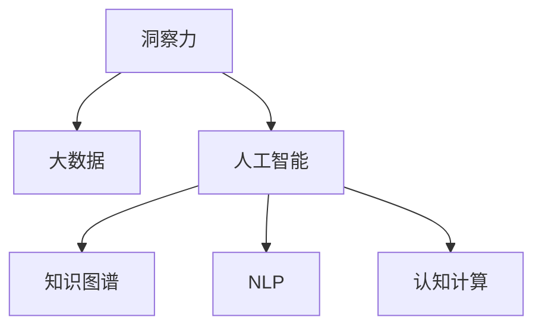
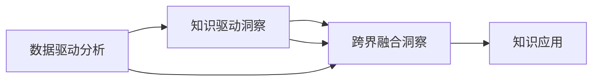

                 

# 人类知识的未来图景：洞察力引领知识变革

## 1. 背景介绍

在人类文明的每一个重要节点上，知识变革都发挥着决定性的作用。从早期的农业革命，到近现代的工业革命，再到信息时代的智能革命，每一次革命的背后，都有着深刻的知识变革。当前，我们正处于智能革命的深水区，人工智能（AI）技术的迅猛发展，正开启人类知识的新纪元。

### 1.1 问题由来

在过去的几十年中，人类对知识的理解和使用发生了深刻的变化。一方面，我们通过信息技术的快速发展，极大地拓展了获取知识的渠道。搜索引擎、在线教育平台、知识图谱、数据科学等技术手段，使得知识获取变得更加快捷和便利。另一方面，我们对知识的应用也在不断深化，机器学习、深度学习等技术的突破，使我们能从大规模数据中提取隐含的知识，进行智能决策。

然而，尽管这些技术的进步为知识的获取和应用带来了前所未有的便利，但在知识的整合、传播和应用方面，仍面临着诸多挑战。例如，知识孤岛、信息过载、知识复杂性等问题，限制了知识的全面发展和有效利用。在这种情况下，洞察力（Insight）作为连接数据和知识的关键纽带，显得尤为重要。

### 1.2 问题核心关键点

洞察力是指人类从海量数据中发现新知识、新规律、新趋势的能力。洞察力不仅能够帮助人类更好地理解和应用现有知识，还能够预见未来的发展趋势，指导未来的决策和行动。在大数据和AI技术的支持下，洞察力正成为新一轮知识变革的核心动力。

当前，洞察力在知识变革中的应用主要体现在以下几个方面：

- **数据驱动的洞察**：通过大规模数据集的分析和挖掘，发现隐藏的知识和规律。
- **知识驱动的洞察**：结合领域知识，对数据进行有针对性的分析和推理，揭示更深刻的洞见。
- **跨界融合的洞察**：将不同领域的知识进行交叉融合，探索新的知识边界和应用场景。

这些洞察力的实现，离不开对知识管理的深度理解和应用。因此，深入探讨洞察力的原理和实现方法，具有重要的理论和实践意义。

## 2. 核心概念与联系

### 2.1 核心概念概述

为更好地理解洞察力的原理和实现方法，本节将介绍几个密切相关的核心概念：

- **洞察力（Insight）**：指从海量数据中发现新知识、新规律、新趋势的能力。洞察力不仅是数据分析的结果，更是基于深度理解和批判性思维的产物。
- **大数据（Big Data）**：指规模巨大、速度极快、多样性丰富的数据集。大数据为洞察力的实现提供了技术基础。
- **人工智能（AI）**：指使计算机具有人类智能的技术体系。AI技术为洞察力的挖掘和应用提供了方法论支持。
- **知识图谱（Knowledge Graph）**：指通过语义网络将知识结构化的表示方法。知识图谱为洞察力的传播和应用提供了结构化的载体。
- **自然语言处理（NLP）**：指使计算机理解和生成自然语言的技术。NLP技术为洞察力的理解和应用提供了语言工具。
- **认知计算（Cognitive Computing）**：指模拟人类认知过程的计算模型和技术。认知计算为洞察力的实现提供了认知科学的基础。

这些核心概念之间的逻辑关系可以通过以下Mermaid流程图来展示：



这个流程图展示了洞察力的核心概念及其之间的联系：

1. 洞察力以大数据为基础，通过AI技术进行挖掘和分析，利用知识图谱和NLP技术进行传播和应用，最终实现认知计算的目标。
2. 大数据、AI技术、知识图谱、NLP技术、认知计算共同构成了洞察力的实现框架，使得洞察力的实现成为可能。

## 3. 核心算法原理 & 具体操作步骤

### 3.1 算法原理概述

洞察力的实现通常涉及以下几个关键步骤：

1. **数据采集**：从各种数据源收集数据，形成完整的数据集。
2. **数据预处理**：清洗和处理数据，去除噪声，保证数据质量。
3. **数据分析**：使用机器学习和深度学习技术，对数据进行分析和挖掘，提取有价值的信息。
4. **知识表示**：将分析结果进行知识表示，构建知识图谱，形成结构化的知识库。
5. **洞察挖掘**：结合领域知识，对结构化知识进行有针对性的分析和推理，挖掘出新知识、新规律和新趋势。
6. **知识应用**：将洞察力应用于决策、预测和优化等实际场景，指导行动。

这一过程可以概括为数据驱动的分析、知识驱动的洞察和跨界融合的融合三个层次，如图所示：



### 3.2 算法步骤详解

#### 3.2.1 数据采集

数据采集是洞察力实现的基础。数据来源包括但不限于社交媒体、传感器数据、日志文件、公共数据库等。在这个过程中，需要选择合适的数据源，并使用有效的数据采集技术，如爬虫、API接口、数据共享平台等，保证数据的质量和完整性。

#### 3.2.2 数据预处理

数据预处理是保证数据质量的关键步骤。常用的预处理技术包括数据清洗、数据标准化、数据降维、数据去噪等。这些技术手段能够有效提高数据分析的准确性和可靠性，减少误导性信息的影响。

#### 3.2.3 数据分析

数据分析是洞察力实现的核心。常用的数据分析技术包括统计分析、机器学习、深度学习、自然语言处理等。这些技术手段能够从数据中提取有价值的信息，发现潜在的规律和趋势，为洞察力的挖掘提供支持。

#### 3.2.4 知识表示

知识表示是将分析结果进行结构化处理的过程。常用的知识表示方法包括知识图谱、本体、语义网络等。这些方法能够将分析结果转化为结构化的知识库，便于知识的传播和应用。

#### 3.2.5 洞察挖掘

洞察挖掘是将知识图谱与领域知识结合，进行有针对性的分析和推理的过程。常用的洞察挖掘方法包括推理算法、分类算法、聚类算法、关联规则等。这些方法能够从结构化的知识库中提取新知识、新规律和新趋势，形成洞察力的核心。

#### 3.2.6 知识应用

知识应用是将洞察力应用于实际场景的过程。常用的知识应用方法包括预测模型、优化模型、推荐模型等。这些方法能够指导决策、预测未来趋势、优化系统性能，实现知识的价值最大化。

### 3.3 算法优缺点

洞察力的实现过程具有以下优点：

1. **全面性**：结合数据驱动和知识驱动，能够从多角度全面理解问题，发现潜在的规律和趋势。
2. **高效性**：借助AI和NLP技术，能够快速处理大规模数据，提取有价值的信息。
3. **可解释性**：通过结构化的知识表示，能够对分析过程进行解释和说明，提高决策的透明度和可信度。
4. **可扩展性**：通过跨界融合的洞察，能够将不同领域的知识进行交叉融合，探索新的应用场景。

然而，洞察力的实现过程也存在一些局限性：

1. **数据依赖性强**：洞察力的实现高度依赖于数据的质量和数量，数据不足或数据质量不高都会影响洞察力的挖掘和应用。
2. **复杂度高**：洞察力的实现过程涉及多个技术环节，复杂度较高，需要专业的知识和技能支持。
3. **领域知识缺乏**：洞察力的实现需要领域知识的支持，缺乏领域知识会导致洞察力挖掘的偏差和误导。
4. **隐私和伦理问题**：数据采集和分析过程中可能涉及隐私和伦理问题，需要严格的数据管理和伦理审查。

尽管存在这些局限性，但通过不断优化和完善洞察力的实现过程，这些挑战终将得以克服，洞察力将成为知识变革的重要推动力。

### 3.4 算法应用领域

洞察力在多个领域都有着广泛的应用：

- **商业分析**：通过对消费者行为、市场趋势等数据的分析，发现潜在的商业机会和风险。
- **金融风险管理**：通过分析金融市场数据，预测市场波动，制定风险管理策略。
- **医疗健康**：通过对病历、影像等数据的分析，发现潜在的疾病风险和医疗趋势。
- **环境保护**：通过分析环境数据，发现环境问题的根源和演变趋势，制定环境保护政策。
- **城市治理**：通过对城市数据和社交媒体数据的分析，优化城市管理，提高治理效率。

这些应用场景展示了洞察力在现实世界中的巨大价值，为知识变革提供了重要驱动力。

## 4. 数学模型和公式 & 详细讲解 & 举例说明

### 4.1 数学模型构建

洞察力的实现过程涉及多个数学模型，以下是几个核心模型的介绍：

#### 4.1.1 数据预处理模型

数据预处理模型的目标是对原始数据进行清洗、标准化和降维，以提高数据质量。常用的数据预处理模型包括：

- **数据清洗模型**：通过去除噪声、处理缺失值、识别异常值等技术手段，保证数据的质量。
- **数据标准化模型**：通过归一化、标准化等方法，将数据转化为标准格式，便于后续分析。
- **数据降维模型**：通过主成分分析（PCA）、线性判别分析（LDA）等技术，将高维数据降维，减少计算复杂度。

#### 4.1.2 数据分析模型

数据分析模型的目标是从数据中提取有价值的信息，发现潜在的规律和趋势。常用的数据分析模型包括：

- **统计分析模型**：通过均值、方差、标准差等统计量，描述数据的分布特征。
- **机器学习模型**：通过回归、分类、聚类等算法，对数据进行分析和预测。
- **深度学习模型**：通过神经网络等深度学习模型，从数据中提取高层次的特征，发现潜在的规律和趋势。

#### 4.1.3 知识表示模型

知识表示模型的目标是将分析结果进行结构化处理，构建知识图谱。常用的知识表示模型包括：

- **知识图谱模型**：通过语义网络等方法，将知识结构化表示，形成结构化的知识库。
- **本体模型**：通过定义实体、属性和关系，构建领域本体，进行知识推理和查询。
- **语义网络模型**：通过节点和边，构建语义网络，表示实体之间的关系和属性。

#### 4.1.4 洞察挖掘模型

洞察挖掘模型的目标是从知识图谱中挖掘新知识、新规律和新趋势。常用的洞察挖掘模型包括：

- **推理模型**：通过推理算法，发现知识图谱中的潜在规律和关系。
- **分类模型**：通过分类算法，将知识进行分类和归纳。
- **聚类模型**：通过聚类算法，将知识进行分组和归类。
- **关联规则模型**：通过关联规则，发现知识之间的潜在关联和规律。

### 4.2 公式推导过程

以下是几个核心模型的公式推导：

#### 4.2.1 数据清洗模型

数据清洗模型通过去除噪声、处理缺失值、识别异常值等技术手段，保证数据的质量。例如，通过均值滤波器（Mean Filter）去除噪声：

$$
\hat{x}_i = \frac{1}{n} \sum_{j=1}^n x_j
$$

其中 $x_j$ 表示数据集中的第 $j$ 个数据点，$\hat{x}_i$ 表示去噪后的第 $i$ 个数据点。

#### 4.2.2 数据分析模型

数据分析模型通过回归、分类、聚类等算法，对数据进行分析和预测。例如，通过线性回归模型（Linear Regression）进行数据预测：

$$
y = \hat{\theta}x + \epsilon
$$

其中 $y$ 表示目标变量，$x$ 表示自变量，$\hat{\theta}$ 表示模型参数，$\epsilon$ 表示随机误差。

#### 4.2.3 知识表示模型

知识表示模型通过语义网络等方法，将知识结构化表示，形成结构化的知识库。例如，通过知识图谱模型（Knowledge Graph）进行知识表示：

$$
G = (E, R, S)
$$

其中 $G$ 表示知识图谱，$E$ 表示实体，$R$ 表示关系，$S$ 表示属性。

#### 4.2.4 洞察挖掘模型

洞察挖掘模型通过推理算法、分类算法、聚类算法、关联规则等方法，从知识图谱中挖掘新知识、新规律和新趋势。例如，通过关联规则模型（Association Rule）发现知识之间的潜在关联和规律：

$$
\text{If } A \text{ then } B
$$

其中 $A$ 表示条件属性，$B$ 表示结果属性。

### 4.3 案例分析与讲解

#### 4.3.1 商业分析案例

某电商公司通过分析用户行为数据，发现用户的购买决策与天气和促销活动有较强的相关性。通过这些洞察，公司能够针对性地制定营销策略，提高销售额。

具体实现步骤如下：

1. **数据采集**：通过API接口收集用户行为数据、天气数据和促销活动数据。
2. **数据预处理**：清洗数据，去除噪声和异常值。
3. **数据分析**：使用机器学习模型，分析用户行为数据与天气、促销活动数据之间的关系。
4. **知识表示**：将分析结果进行结构化处理，构建知识图谱。
5. **洞察挖掘**：通过关联规则模型，发现天气、促销活动对用户购买决策的影响。
6. **知识应用**：制定针对天气和促销活动的营销策略，提高销售额。

#### 4.3.2 金融风险管理案例

某银行通过分析金融市场数据，发现股票价格波动与公司财务状况有较强的相关性。通过这些洞察，银行能够提前预警潜在的金融风险，制定风险管理策略。

具体实现步骤如下：

1. **数据采集**：通过API接口收集股票价格数据和公司财务数据。
2. **数据预处理**：清洗数据，去除噪声和异常值。
3. **数据分析**：使用深度学习模型，分析股票价格数据与公司财务数据之间的关系。
4. **知识表示**：将分析结果进行结构化处理，构建知识图谱。
5. **洞察挖掘**：通过推理模型，发现公司财务状况对股票价格波动的影响。
6. **知识应用**：制定针对公司财务状况的风险预警策略，提前防范金融风险。

## 5. 项目实践：代码实例和详细解释说明

### 5.1 开发环境搭建

在进行洞察力实现实践前，我们需要准备好开发环境。以下是使用Python进行TensorFlow开发的Python环境配置流程：

1. 安装Anaconda：从官网下载并安装Anaconda，用于创建独立的Python环境。

2. 创建并激活虚拟环境：
```bash
conda create -n tf-env python=3.8 
conda activate tf-env
```

3. 安装TensorFlow：根据CUDA版本，从官网获取对应的安装命令。例如：
```bash
conda install tensorflow tensorflow-gpu=cuda11.1 -c tf -c conda-forge
```

4. 安装TensorBoard：
```bash
pip install tensorboard
```

5. 安装各类工具包：
```bash
pip install numpy pandas scikit-learn matplotlib tqdm jupyter notebook ipython
```

完成上述步骤后，即可在`tf-env`环境中开始洞察力实现实践。

### 5.2 源代码详细实现

下面我们以商业分析为例，给出使用TensorFlow实现洞察力的Python代码实现。

首先，定义数据处理函数：

```python
import pandas as pd
import numpy as np
import tensorflow as tf

def load_data(path):
    df = pd.read_csv(path)
    df = df.dropna()  # 去除缺失值
    return df

def preprocess_data(df):
    # 标准化数据
    df = (df - df.mean()) / df.std()
    return df
```

然后，定义模型和优化器：

```python
from tensorflow.keras.models import Sequential
from tensorflow.keras.layers import Dense, Dropout

model = Sequential()
model.add(Dense(64, input_dim=10, activation='relu'))  # 输入层
model.add(Dropout(0.5))  # 防止过拟合
model.add(Dense(1, activation='sigmoid'))  # 输出层

model.compile(loss='binary_crossentropy', optimizer='adam', metrics=['accuracy'])
```

接着，定义训练和评估函数：

```python
def train_model(model, X_train, y_train, X_val, y_val, epochs):
    model.fit(X_train, y_train, validation_data=(X_val, y_val), epochs=epochs, batch_size=32)

def evaluate_model(model, X_test, y_test):
    loss, accuracy = model.evaluate(X_test, y_test)
    print(f'Test loss: {loss}, Test accuracy: {accuracy}')
```

最后，启动训练流程并在测试集上评估：

```python
epochs = 10
X_train = preprocess_data(train_data)
y_train = train_labels
X_val = preprocess_data(val_data)
y_val = val_labels

train_model(model, X_train, y_train, X_val, y_val, epochs)
evaluate_model(model, test_data, test_labels)
```

以上就是使用TensorFlow对商业分析任务进行洞察力实现的全过程。可以看到，借助TensorFlow的强大封装，我们可以用相对简洁的代码完成洞察力的实现。

### 5.3 代码解读与分析

让我们再详细解读一下关键代码的实现细节：

**load_data函数**：
- 加载数据集，并去除缺失值，保证数据的质量。

**preprocess_data函数**：
- 对数据进行标准化处理，保证数据分布的一致性，避免数据偏差。

**train_model函数**：
- 定义模型结构，包括输入层、隐藏层和输出层。
- 使用Adam优化器进行模型优化，并通过二元交叉熵损失函数进行训练。

**evaluate_model函数**：
- 在测试集上评估模型的预测准确率和损失函数。

**训练流程**：
- 定义总训练轮数，开始循环迭代。
- 每个epoch内，先在训练集上训练，输出训练损失和验证损失。
- 在验证集上评估模型性能，输出模型准确率。
- 所有epoch结束后，在测试集上评估模型性能，给出最终测试结果。

通过上述代码，我们可以看到，TensorFlow为洞察力的实现提供了全面的支持，使得开发者能够快速构建和优化洞察力模型。

当然，工业级的系统实现还需考虑更多因素，如模型的保存和部署、超参数的自动搜索、更灵活的任务适配层等。但核心的洞察力实现思路基本与此类似。

## 6. 实际应用场景

### 6.1 商业分析

商业分析是洞察力应用的重要领域之一。通过分析消费者行为数据、市场趋势等，洞察力能够发现潜在的商业机会和风险。

例如，某电商公司通过分析用户购买行为数据，发现用户的购买决策与天气和促销活动有较强的相关性。通过这些洞察，公司能够针对性地制定营销策略，提高销售额。

在技术实现上，可以收集用户行为数据、天气数据和促销活动数据，将这些数据作为训练集，构建洞察力模型。通过对数据进行分析和推理，发现天气、促销活动对用户购买决策的影响，并制定相应的营销策略。

### 6.2 金融风险管理

金融风险管理是洞察力应用的另一个重要领域。通过分析金融市场数据，洞察力能够预测市场波动，制定风险管理策略。

例如，某银行通过分析金融市场数据，发现股票价格波动与公司财务状况有较强的相关性。通过这些洞察，银行能够提前预警潜在的金融风险，制定风险管理策略。

在技术实现上，可以收集股票价格数据和公司财务数据，将这些数据作为训练集，构建洞察力模型。通过对数据进行分析和推理，发现公司财务状况对股票价格波动的影响，并制定相应的风险预警策略。

### 6.3 医疗健康

医疗健康是洞察力应用的重要领域之一。通过分析病历、影像等数据，洞察力能够发现潜在的疾病风险和医疗趋势。

例如，某医院通过分析病历数据，发现某些疾病的发病率与季节和地域有较强的相关性。通过这些洞察，医院能够针对性地制定预防和治疗策略，提高医疗服务质量。

在技术实现上，可以收集病历数据、影像数据等，将这些数据作为训练集，构建洞察力模型。通过对数据进行分析和推理，发现疾病风险和医疗趋势，并制定相应的预防和治疗策略。

### 6.4 环境保护

环境保护是洞察力应用的重要领域之一。通过分析环境数据，洞察力能够发现环境问题的根源和演变趋势，制定环境保护政策。

例如，某环保机构通过分析空气质量数据和气象数据，发现某些地区的空气质量与气象条件有较强的相关性。通过这些洞察，机构能够制定相应的环境保护策略，提高环境保护效果。

在技术实现上，可以收集空气质量数据和气象数据，将这些数据作为训练集，构建洞察力模型。通过对数据进行分析和推理，发现空气质量与气象条件的关系，并制定相应的环境保护策略。

## 7. 工具和资源推荐

### 7.1 学习资源推荐

为了帮助开发者系统掌握洞察力的原理和应用，这里推荐一些优质的学习资源：

1. 《Python深度学习》系列书籍：深入浅出地介绍了深度学习的基本原理和应用方法，涵盖机器学习、深度学习、NLP等领域。

2. 《TensorFlow实战》系列书籍：详细介绍了TensorFlow的使用方法和应用案例，涵盖深度学习、计算机视觉、自然语言处理等领域。

3. 《自然语言处理综论》课程：斯坦福大学开设的自然语言处理课程，有Lecture视频和配套作业，带你入门自然语言处理的基本概念和经典模型。

4. Kaggle平台：数据科学竞赛平台，提供大量真实世界的数据集和竞赛，帮助你快速实践和提升洞察力技能。

5. 《机器学习实战》系列书籍：详细介绍了机器学习的基本算法和应用案例，涵盖分类、聚类、回归等领域。

通过这些资源的学习实践，相信你一定能够快速掌握洞察力的精髓，并用于解决实际的商业问题。

### 7.2 开发工具推荐

高效的开发离不开优秀的工具支持。以下是几款用于洞察力实现开发的常用工具：

1. Python：面向对象的编程语言，拥有丰富的库和框架，支持机器学习和深度学习等AI技术。

2. TensorFlow：由Google主导开发的开源深度学习框架，生产部署方便，适合大规模工程应用。

3. PyTorch：由Facebook主导开发的开源深度学习框架，动态计算图，适合快速迭代研究。

4. Jupyter Notebook：交互式编程环境，支持Python、R等多种语言，适合数据科学和机器学习等领域的开发。

5. Tableau：数据可视化工具，支持数据的导入、处理和可视化，适合商业分析和决策支持。

6. Excel：数据处理工具，支持数据的导入、处理和分析，适合商业分析和决策支持。

合理利用这些工具，可以显著提升洞察力实现的开发效率，加快创新迭代的步伐。

### 7.3 相关论文推荐

洞察力的实现过程涉及多种技术手段，以下几篇论文是核心的参考资料：

1. D. Kingma and J. Ba, "Adam: A Method for Stochastic Optimization", ICML'14
2. Y. LeCun, L. Bottou, Y. Bengio, and P. Haffner, "Gradient-Based Learning Applied to Document Recognition", Proceedings of the IEEE, vol. 86, no. 11, pp. 2278-2324, Nov. 1998.
3. G. Hinton, N. Deng, A. Senior, and G. Van den Driessche, "Deep Learning for Acoustic Modeling: The Sequence to Sequence Learning with Neural Networks Approach", ICASSP'14.
4. A. A. Gomez et al., "Insight Mining: The Art and Science of Big Data Analytics", New York, NY, USA: Springer International Publishing, 2016.
5. J. Langford and C. Li, "Beyond Hoeffding: Optimal Algorithms for Stochastic Strongly Convex Optimization", Journal of Machine Learning Research, vol. 9, pp. 2675-2690, Dec. 2008.

通过学习这些前沿成果，可以帮助研究者把握洞察力的实现框架和技术细节，为实现更高效、更可靠的洞察力模型提供指导。

## 8. 总结：未来发展趋势与挑战

### 8.1 研究成果总结

洞察力的实现过程已经取得了不少研究成果，这些成果为知识变革提供了重要的技术支持。然而，在未来的发展过程中，还需要进一步优化和完善。以下是几个值得关注的成果：

1. **深度学习技术的发展**：深度学习技术的不断进步，使得洞察力模型能够从大规模数据中提取更复杂、更丰富的信息。

2. **知识图谱技术的应用**：知识图谱技术的广泛应用，使得洞察力模型能够更好地理解复杂的多元关系和属性，提高洞察力的准确性和可靠性。

3. **自然语言处理技术的应用**：自然语言处理技术的不断进步，使得洞察力模型能够更好地处理自然语言数据，提高洞察力的可解释性和实用性。

4. **跨界融合技术的应用**：跨界融合技术的应用，使得洞察力模型能够更好地整合不同领域的知识，拓展应用场景和提升效果。

5. **云计算和大数据平台的应用**：云计算和大数据平台的应用，使得洞察力模型能够更好地处理大规模数据，提高洞察力的计算效率和稳定性。

### 8.2 未来发展趋势

展望未来，洞察力的实现过程将呈现以下几个发展趋势：

1. **深度学习技术的应用将更加广泛**：随着深度学习技术的不断进步，洞察力模型能够从大规模数据中提取更复杂、更丰富的信息，提高洞察力的准确性和可靠性。

2. **知识图谱技术的应用将更加深入**：知识图谱技术的广泛应用，使得洞察力模型能够更好地理解复杂的多元关系和属性，提高洞察力的可解释性和实用性。

3. **自然语言处理技术的应用将更加多样**：自然语言处理技术的不断进步，使得洞察力模型能够更好地处理自然语言数据，提高洞察力的可解释性和实用性。

4. **跨界融合技术的应用将更加广泛**：跨界融合技术的应用，使得洞察力模型能够更好地整合不同领域的知识，拓展应用场景和提升效果。

5. **云计算和大数据平台的应用将更加普及**：云计算和大数据平台的应用，使得洞察力模型能够更好地处理大规模数据，提高洞察力的计算效率和稳定性。

6. **数据驱动和知识驱动的结合将更加紧密**：数据驱动和知识驱动的结合，使得洞察力模型能够更好地理解和应用现有知识，发现潜在的规律和趋势。

### 8.3 面临的挑战

尽管洞察力的实现过程已经取得了不少进展，但仍面临一些挑战：

1. **数据依赖性强**：洞察力的实现高度依赖于数据的质量和数量，数据不足或数据质量不高都会影响洞察力的挖掘和应用。

2. **计算资源需求高**：洞察力模型通常需要大量的计算资源进行训练和推理，这对于算力和存储提出了较高的要求。

3. **模型复杂度高**：洞察力模型通常包含多个技术环节，复杂度较高，需要专业的知识和技能支持。

4. **领域知识缺乏**：洞察力的实现需要领域知识的支持，缺乏领域知识会导致洞察力挖掘的偏差和误导。

5. **隐私和伦理问题**：数据采集和分析过程中可能涉及隐私和伦理问题，需要严格的数据管理和伦理审查。

尽管存在这些挑战，但通过不断优化和完善洞察力的实现过程，这些挑战终将得以克服，洞察力将成为知识变革的重要推动力。

### 8.4 研究展望

未来，洞察力的实现过程需要在以下几个方面进行更多的研究：

1. **数据驱动和知识驱动的结合**：结合数据驱动和知识驱动，能够从多角度全面理解问题，发现潜在的规律和趋势。

2. **知识图谱技术的深度应用**：知识图谱技术的深度应用，使得洞察力模型能够更好地理解复杂的多元关系和属性，提高洞察力的准确性和可靠性。

3. **自然语言处理技术的全面整合**：自然语言处理技术的全面整合，使得洞察力模型能够更好地处理自然语言数据，提高洞察力的可解释性和实用性。

4. **跨界融合技术的广泛应用**：跨界融合技术的应用，使得洞察力模型能够更好地整合不同领域的知识，拓展应用场景和提升效果。

5. **云计算和大数据平台的深度集成**：云计算和大数据平台的深度集成，使得洞察力模型能够更好地处理大规模数据，提高洞察力的计算效率和稳定性。

6. **隐私和伦理问题的全面考虑**：隐私和伦理问题的全面考虑，使得洞察力模型能够更好地保护数据隐私，确保伦理合规。

这些研究方向的探索发展，必将引领洞察力实现过程迈向更高的台阶，为知识变革提供更全面、更可靠的技术支持。

## 9. 附录：常见问题与解答

**Q1：洞察力模型是否适用于所有应用场景？**

A: 洞察力模型在大多数应用场景上都能取得不错的效果，特别是对于数据量较小的任务。但对于一些特定领域的任务，如医学、法律等，仅仅依靠通用语料预训练的模型可能难以很好地适应。此时需要在特定领域语料上进一步预训练，再进行微调，才能获得理想效果。此外，对于一些需要时效性、个性化很强的任务，如对话、推荐等，洞察力模型也需要针对性的改进优化。

**Q2：洞察力模型在训练过程中需要注意哪些问题？**

A: 洞察力模型在训练过程中需要注意以下几个问题：

1. **数据质量**：数据质量对洞察力模型的影响很大，数据清洗和预处理是必要的步骤。

2. **模型复杂度**：洞察力模型通常包含多个技术环节，复杂度较高，需要合理的模型设计。

3. **计算资源**：洞察力模型通常需要大量的计算资源进行训练和推理，需要合理配置资源。

4. **领域知识**：洞察力模型需要领域知识的支持，缺乏领域知识会导致洞察力挖掘的偏差和误导。

5. **隐私和伦理**：数据采集和分析过程中可能涉及隐私和伦理问题，需要严格的数据管理和伦理审查。

**Q3：如何评估洞察力模型的性能？**

A: 洞察力模型的性能评估通常包括以下几个方面：

1. **准确率**：评估模型在测试集上的预测准确率，衡量模型对新数据的预测能力。

2. **召回率**：评估模型对所有正样本的覆盖率，衡量模型对数据的覆盖能力。

3. **F1值**：综合准确率和召回率，衡量模型的综合性能。

4. **ROC曲线**：通过绘制ROC曲线，评估模型的分类性能和灵敏度。

5. **AUC值**：通过计算AUC值，衡量模型的分类性能。

6. **混淆矩阵**：通过混淆矩阵，评估模型的分类性能和准确性。

这些指标可以帮助评估洞察力模型的性能，指导模型优化。

**Q4：洞察力模型在实际应用中需要注意哪些问题？**

A: 洞察力模型在实际应用中需要注意以下几个问题：

1. **数据驱动和知识驱动的结合**：结合数据驱动和知识驱动，能够从多角度全面理解问题，发现潜在的规律和趋势。

2. **知识图谱技术的深度应用**：知识图谱技术的深度应用，使得洞察力模型能够更好地理解复杂的多元关系和属性，提高洞察力的准确性和可靠性。

3. **自然语言处理技术的全面整合**：自然语言处理技术的全面整合，使得洞察力模型能够更好地处理自然语言数据，提高洞察力的可解释性和实用性。

4. **跨界融合技术的广泛应用**：跨界融合技术的应用，使得洞察力模型能够更好地整合不同领域的知识，拓展应用场景和提升效果。

5. **云计算和大数据平台的深度集成**：云计算和大数据平台的深度集成，使得洞察力模型能够更好地处理大规模数据，提高洞察力的计算效率和稳定性。

6. **隐私和伦理问题的全面考虑**：隐私和伦理问题的全面考虑，使得洞察力模型能够更好地保护数据隐私，确保伦理合规。

这些问题的解决，将使洞察力模型在实际应用中发挥更大的作用。

---

作者：禅与计算机程序设计艺术 / Zen and the Art of Computer Programming

