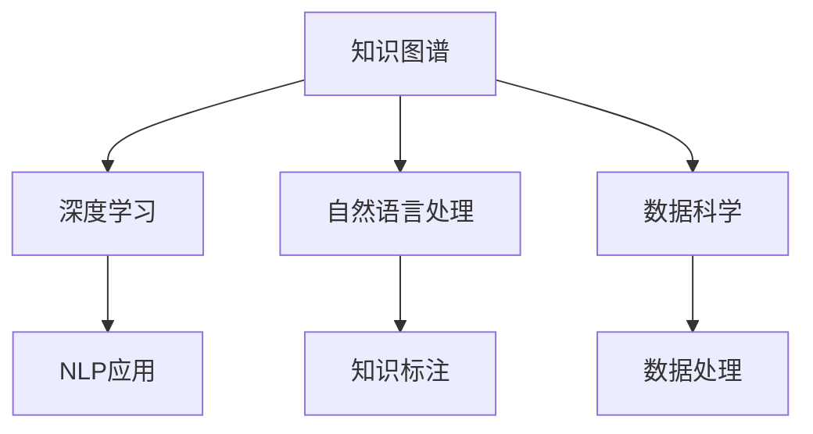

                 

# 人类知识的民主化：知识为人民服务

> 关键词：人工智能, 知识民主化, 知识图谱, 自然语言处理, 深度学习, 数据科学

## 1. 背景介绍

### 1.1 问题由来

知识是人类社会发展的基石。知识的获取、存储、传播和应用，一直是人类追求智慧、推动文明进步的重要手段。然而，传统知识体系存在诸多问题：知识碎片化、传播效率低、使用门槛高、难以形成系统性关联。这些问题在信息爆炸的现代社会中尤为凸显，知识获取和应用成本不断增加，使得更多人难以获得高质量的知识资源。

人工智能（AI）技术的兴起，为知识民主化提供了新的契机。通过利用大数据、深度学习和自然语言处理等技术，AI可以帮助人类高效、全面地获取、存储和应用知识，使得知识民主化成为可能。本文将从人工智能在知识获取、存储和应用中的应用出发，探讨知识民主化的实现路径。

### 1.2 问题核心关键点

知识民主化的关键在于如何通过AI技术，使得知识获取和应用更加普惠、高效、系统。这一过程涉及以下几个核心问题：

- 如何构建全面的知识图谱，形成系统的知识体系？
- 如何利用AI技术高效获取和标注知识，减少人工标注成本？
- 如何利用自然语言处理技术，实现知识检索、推荐、理解与生成？
- 如何实现知识的可视化，增强知识的可理解性和可应用性？

## 2. 核心概念与联系

### 2.1 核心概念概述

为更好地理解知识民主化的实现路径，本节将介绍几个密切相关的核心概念：

- **知识图谱（Knowledge Graph,KG）**：一种图形化表示知识的方式，通过实体、关系和属性来描述和组织知识。
- **自然语言处理（Natural Language Processing, NLP）**：涉及计算机如何理解、处理和生成人类语言的技术，包括分词、句法分析、语义理解、文本生成等。
- **深度学习（Deep Learning）**：一类基于神经网络的学习方法，通过多层次特征提取，自动学习数据的高层次抽象表示。
- **数据科学（Data Science）**：涉及数据收集、处理、分析和应用的知识领域，是知识民主化的重要支撑。

这些概念之间的逻辑关系可以通过以下Mermaid流程图来展示：



这个流程图展示了几大核心概念的相互关系：

1. 知识图谱通过深度学习和自然语言处理技术，从海量数据中提取、标注和组织知识。
2. 深度学习从数据科学中获取数据，通过多层次特征提取，实现知识的高效表示和处理。
3. 自然语言处理通过理解和生成人类语言，使得知识获取和应用更加便捷和直观。
4. 数据科学为知识获取和处理提供数据资源和技术手段，保障知识的准确性和全面性。

## 3. 核心算法原理 & 具体操作步骤

### 3.1 算法原理概述

知识民主化的核心在于构建一个全面、高效的知识图谱，并通过自然语言处理技术，使得知识获取和应用更加普惠。这一过程涉及以下关键步骤：

1. **数据获取与标注**：从各类公开数据源和专业领域知识库中获取数据，并通过自然语言处理技术进行实体识别、关系抽取和属性标注，构建初步的知识图谱。
2. **知识关联与融合**：利用深度学习技术，自动发现和关联知识图谱中的实体和关系，形成更全面的知识体系。
3. **知识应用与生成**：通过自然语言处理技术，实现知识检索、推荐、理解和生成，使得知识更加易于获取和应用。

### 3.2 算法步骤详解

#### 3.2.1 数据获取与标注

数据获取和标注是知识图谱构建的基础。以下是具体的步骤：

1. **数据收集**：从各类公开数据源（如政府公开数据、开源数据集、社交媒体等）收集数据。同时，针对特定领域，从专业领域知识库（如Medline、Google Scholar等）获取专业知识。
2. **预处理**：对收集到的数据进行清洗、去重和格式转换，确保数据质量和一致性。
3. **实体识别**：使用分词、命名实体识别等自然语言处理技术，从文本中识别出实体（如人名、地名、机构名等）和关系（如父子关系、合作关系等）。
4. **关系抽取**：使用句法分析和语义理解技术，从文本中抽取实体之间的关系，形成知识图谱的基本结构。
5. **属性标注**：通过人工标注或自动标注，为知识图谱中的实体和关系添加属性，使得知识更丰富和具体。

#### 3.2.2 知识关联与融合

知识关联和融合是构建全面知识图谱的关键步骤。以下是具体的步骤：

1. **实体链接**：使用实体对齐技术，将不同数据源中相同或相似的实体链接起来，形成统一的知识图谱。
2. **关系对齐**：通过跨数据源的关系对齐，将不同数据源中相同或相似的关系链接起来，消除数据冗余和歧义。
3. **属性对齐**：利用属性对齐技术，将不同数据源中的相同属性对齐，形成更一致的知识体系。
4. **融合优化**：利用深度学习技术，对知识图谱进行融合优化，自动发现和修复知识图谱中的不一致性和错误。

#### 3.2.3 知识应用与生成

知识应用和生成是知识民主化的重要目标。以下是具体的步骤：

1. **知识检索**：利用知识图谱和自然语言处理技术，实现用户输入的自然语言查询，自动匹配相关知识和信息。
2. **知识推荐**：基于用户行为和偏好，利用知识图谱和自然语言处理技术，推荐相关知识和信息。
3. **知识理解**：利用自然语言处理技术，理解用户输入的自然语言问题，自动抽取关键信息，生成结构化的回答。
4. **知识生成**：基于用户输入的自然语言描述，利用深度学习技术，生成新的知识和信息。

### 3.3 算法优缺点

知识民主化基于知识图谱和自然语言处理技术，具有以下优点：

1. **全面性**：通过深度学习和自然语言处理技术，可以高效地从海量数据中提取和标注知识，构建全面、系统化的知识体系。
2. **普惠性**：利用自然语言处理技术，使得知识获取和应用更加便捷和直观，降低知识获取和使用门槛。
3. **高效性**：利用深度学习技术，自动发现和关联知识，减少人工标注和处理成本，提高知识获取和应用效率。

同时，该方法也存在以下局限性：

1. **数据依赖**：知识图谱的构建高度依赖于数据质量和标注质量，数据获取和标注成本较高。
2. **复杂性**：知识图谱的构建和优化过程复杂，需要结合深度学习和自然语言处理技术，技术难度较高。
3. **应用场景限制**：知识图谱的应用场景有限，主要适用于领域知识较为明确的专业领域。

## 4. 数学模型和公式 & 详细讲解 & 举例说明

### 4.1 数学模型构建

知识图谱的构建涉及知识表示、实体关系表示和知识推理等多个数学模型。以下是几个常用的数学模型：

1. **实体-关系-属性（Entity-Relation-Attribute, ERA）模型**：将知识表示为实体、关系和属性的三元组形式，用于描述和组织知识。
2. **知识图谱嵌入模型**：利用深度学习技术，将知识图谱中的实体和关系映射到低维向量空间中，用于知识推理和检索。
3. **图神经网络（Graph Neural Network, GNN）模型**：利用图结构和深度学习技术，对知识图谱进行编码和推理，实现知识关联和融合。

### 4.2 公式推导过程

以知识图谱嵌入模型为例，推导知识图谱嵌入的数学公式：

1. **知识图谱嵌入矩阵**：将知识图谱中的实体和关系表示为向量，构建知识图谱嵌入矩阵 $H$。
2. **实体向量表示**：利用TransE等方法，将实体和关系映射到低维向量空间中，形成实体向量 $E$。
3. **关系向量表示**：通过关系映射，将实体之间的关系映射到向量空间中，形成关系向量 $R$。
4. **知识图谱嵌入优化目标**：利用深度学习技术，最小化知识图谱嵌入矩阵和实体、关系向量表示之间的差异，优化知识图谱嵌入模型。

### 4.3 案例分析与讲解

以知识图谱嵌入模型为例，分析其实际应用：

1. **知识图谱构建**：从政府公开数据和专业领域知识库中，收集和标注数据，构建初步知识图谱。
2. **知识图谱嵌入**：利用深度学习技术，将知识图谱中的实体和关系映射到低维向量空间中，形成知识图谱嵌入矩阵 $H$。
3. **知识推理和检索**：利用知识图谱嵌入矩阵 $H$，通过向量余弦相似度等方法，实现知识检索和推理。
4. **知识推荐和理解**：基于用户行为和偏好，利用知识图谱嵌入矩阵 $H$ 和自然语言处理技术，推荐相关知识和信息，理解用户输入的自然语言问题，自动生成回答。

## 5. 项目实践：代码实例和详细解释说明

### 5.1 开发环境搭建

在进行知识民主化实践前，我们需要准备好开发环境。以下是使用Python进行知识图谱构建和应用的开发环境配置流程：

1. 安装Anaconda：从官网下载并安装Anaconda，用于创建独立的Python环境。
2. 创建并激活虚拟环境：
```bash
conda create -n kg-env python=3.8 
conda activate kg-env
```

3. 安装相关库：
```bash
conda install torch torchvision torchaudio cudatoolkit=11.1 -c pytorch -c conda-forge
pip install py2neo pytesseract gensim networkx
```

4. 安装Web框架：
```bash
pip install flask
```

完成上述步骤后，即可在`kg-env`环境中开始知识图谱构建和应用的开发。

### 5.2 源代码详细实现

这里我们以知识图谱嵌入模型为例，给出使用PyTorch和Py2neo进行知识图谱构建和应用的PyTorch代码实现。

首先，定义知识图谱的实体和关系类：

```python
from py2neo import Graph, Node, Relationship

class KnowledgeGraph:
    def __init__(self, graph_url='bolt://localhost:7474'):
        self.graph = Graph(auth=("neo4j", "password"))
    
    def add_entity(self, name):
        entity = Node("Entity", name=name)
        self.graph.create(entity)
        return entity
    
    def add_relation(self, subject, object, relation):
        subject_entity = self.get_entity_by_name(subject)
        object_entity = self.get_entity_by_name(object)
        relation_entity = Node("Relation", name=relation)
        self.graph.create(Relationship(subject_entity, relation, object_entity, relprops={'label': relation_entity}))
    
    def get_entity_by_name(self, name):
        query = 'MATCH (n) RETURN n WHERE n.name = "{name}"'.format(name=name)
        entity = self.graph.run(query).data()[0]
        return entity
```

然后，定义知识图谱嵌入模型的训练和推理函数：

```python
import torch
from torch.nn import Embedding, TransformerEncoder, TransformerDecoder, TransformerModel

class KnowledgeGraphEmbeddingModel:
    def __init__(self, graph, entity_dim=64, relation_dim=64, hidden_dim=64):
        self.graph = graph
        self.entity_dim = entity_dim
        self.relation_dim = relation_dim
        self.hidden_dim = hidden_dim
        self.entity_embedding = Embedding(num_entities, entity_dim)
        self.relation_embedding = Embedding(num_relations, relation_dim)
        self.encoder = TransformerEncoder(hidden_dim, num_layers=2)
        self.decoder = TransformerDecoder(hidden_dim, num_layers=2)
        self.model = TransformerModel(self.entity_embedding, self.relation_embedding, self.encoder, self.decoder)
    
    def train(self, epochs, batch_size=16):
        for epoch in range(epochs):
            for batch in self.graph.nodes.match('Entity').skip(limit=0).order('name') slideside(batch_size):
                entity_ids = [node['name'] for node in batch]
                entity_vectors = self.entity_embedding(torch.tensor(entity_ids))
                relation_vectors = self.relation_embedding(torch.tensor([e['name'] for e in batch[0]['relationships']]))
                output_vectors = self.model(entity_vectors, relation_vectors)
                self.model.zero_grad()
                loss = F.mse_loss(output_vectors, torch.tensor(batch[0]['position']))
                loss.backward()
                optimizer.step()
    
    def predict(self, name):
        entity = self.graph.match_one('Entity', {'name': name})
        return self.entity_embedding(torch.tensor([entity['name']])).data[0].item()
```

最后，启动知识图谱嵌入模型的训练和推理流程：

```python
kg = KnowledgeGraph()
kg.add_entity('Alice')
kg.add_relation('Alice', 'Wrote', 'Pride and Prejudice')
kg.add_entity('Pride and Prejudice')
kg.add_relation('Pride and Prejudice', 'Author', 'Jane Austen')

model = KnowledgeGraphEmbeddingModel(kg)
model.train(epochs=10, batch_size=16)

name = 'Pride and Prejudice'
entity_vector = model.predict(name)
print(f'{name} in knowledge graph space: {entity_vector}')
```

以上代码展示了如何使用PyTorch和Py2neo进行知识图谱嵌入模型的构建和应用。通过将知识图谱中的实体和关系映射到向量空间中，可以高效地进行知识检索和推理。

### 5.3 代码解读与分析

让我们再详细解读一下关键代码的实现细节：

**KnowledgeGraph类**：
- `__init__`方法：初始化知识图谱的连接图和操作接口。
- `add_entity`方法：在知识图谱中添加实体节点，并返回实体节点对象。
- `add_relation`方法：在知识图谱中添加关系节点，并创建实体之间的关系。
- `get_entity_by_name`方法：根据实体名称，获取实体节点对象。

**KnowledgeGraphEmbeddingModel类**：
- `__init__`方法：初始化知识图谱嵌入模型，包含实体嵌入、关系嵌入、编码器和解码器。
- `train`方法：通过知识图谱中的实体和关系，训练知识图谱嵌入模型。
- `predict`方法：根据实体名称，获取实体在知识图谱嵌入空间中的向量表示。

**训练流程**：
- 创建知识图谱和嵌入模型对象。
- 在知识图谱中添加实体和关系节点，构建知识图谱。
- 训练知识图谱嵌入模型，最小化实体位置预测的均方误差。
- 通过预测函数，获取特定实体在知识图谱嵌入空间中的向量表示。

可以看到，PyTorch和Py2neo的结合，使得知识图谱嵌入模型的构建和应用变得相对简单高效。开发者可以根据具体需求，进一步优化模型结构和训练过程，提升知识图谱的质量和应用效果。

## 6. 实际应用场景

### 6.1 智慧医疗

在智慧医疗领域，知识民主化可以帮助医疗从业人员快速获取最新的医学知识和研究成果，提高诊疗效率和质量。通过构建全面的医学知识图谱，结合自然语言处理技术，实现医学知识的检索、推荐和理解。

具体而言，可以收集医学文献、临床指南、药品说明书等文本数据，通过实体识别、关系抽取和属性标注，构建医学知识图谱。利用知识图谱嵌入模型，将医学实体和关系映射到向量空间中，实现医学知识的自动检索和推荐。医生在诊断和治疗过程中，可以通过自然语言查询，自动获取相关医学知识和信息，辅助诊疗决策。

### 6.2 智能客服

在智能客服领域，知识民主化可以帮助企业构建智能客服系统，提高客服效率和客户满意度。通过构建全面的服务知识图谱，结合自然语言处理技术，实现用户问题的自动理解和回答。

具体而言，可以收集客户咨询记录、常见问题解答、产品使用手册等文本数据，通过实体识别、关系抽取和属性标注，构建服务知识图谱。利用知识图谱嵌入模型，将服务实体和关系映射到向量空间中，实现用户问题的自动理解和回答。智能客服系统可以根据用户输入的自然语言问题，自动匹配相关知识图谱中的信息和答案，生成结构化的回答。

### 6.3 教育培训

在教育培训领域，知识民主化可以帮助教师和学生高效获取和应用各类教学资源，提高教学质量和效果。通过构建全面的教学知识图谱，结合自然语言处理技术，实现教学资源的检索、推荐和理解。

具体而言，可以收集各类教学资源（如课程大纲、教学视频、实验报告等），通过实体识别、关系抽取和属性标注，构建教学知识图谱。利用知识图谱嵌入模型，将教学实体和关系映射到向量空间中，实现教学资源的自动检索和推荐。教师可以根据学生的需求和偏好，自动推荐相关教学资源，提高教学效果。

### 6.4 未来应用展望

随着知识图谱和自然语言处理技术的不断进步，知识民主化将在更多领域得到应用，为各行各业带来变革性影响。

在智慧城市治理中，知识民主化可以帮助政府机构高效获取和应用各类公共数据，提高城市管理水平。在农业生产中，知识民主化可以帮助农民获取最新的农业技术和管理知识，提高生产效率。在金融行业，知识民主化可以帮助投资者快速获取和理解各类金融信息，提高投资决策的准确性和效率。

未来，伴随知识图谱和自然语言处理技术的持续演进，知识民主化必将成为推动各行各业智能化、数字化发展的重要工具，为人类认知智能的进化带来深远影响。

## 7. 工具和资源推荐

### 7.1 学习资源推荐

为了帮助开发者系统掌握知识民主化的理论基础和实践技巧，这里推荐一些优质的学习资源：

1. 《深度学习与自然语言处理》系列博文：由大模型技术专家撰写，深入浅出地介绍了深度学习、自然语言处理和知识图谱的基本概念和经典模型。
2. Coursera《深度学习专项课程》：由斯坦福大学和深度学习领域的顶尖专家合作开设的系列课程，涵盖深度学习的基本理论和实践技能。
3. 《知识图谱：构建与应用》书籍：全面介绍了知识图谱的构建、表示和应用方法，是知识图谱领域的重要参考书籍。
4. GraphAware网站：提供大量知识图谱构建、嵌入和应用的实践案例和工具，是知识图谱学习的绝佳资源。
5. 《NLP in Action》书籍：深入讲解了自然语言处理技术的实现细节和应用场景，是NLP领域的学习必备。

通过对这些资源的学习实践，相信你一定能够快速掌握知识民主化的精髓，并用于解决实际的NLP问题。

### 7.2 开发工具推荐

高效的开发离不开优秀的工具支持。以下是几款用于知识图谱构建和应用的常用工具：

1. PyTorch：基于Python的开源深度学习框架，灵活动态的计算图，适合快速迭代研究。大部分预训练语言模型都有PyTorch版本的实现。
2. Py2neo：Python的Neo4j客户端，支持构建和操作Neo4j图数据库，方便知识图谱的存储和查询。
3. Gensim：用于主题建模和相似性计算的库，支持Word2Vec等知识图谱嵌入模型。
4. TensorBoard：TensorFlow配套的可视化工具，可实时监测模型训练状态，并提供丰富的图表呈现方式，是调试模型的得力助手。
5. Flask：Python的Web框架，方便知识图谱应用的部署和接口调用。

合理利用这些工具，可以显著提升知识图谱构建和应用的开发效率，加快创新迭代的步伐。

### 7.3 相关论文推荐

知识图谱和自然语言处理领域的不断创新，源于学界的持续研究。以下是几篇奠基性的相关论文，推荐阅读：

1. "Knowledge Graphs: What, Why and How?" 论文：由知识图谱领域的顶尖专家撰写，全面介绍了知识图谱的定义、应用和构建方法。
2. "Evolving Knowledge Graphs: Representations and Models" 论文：深入探讨了知识图谱的动态演变过程，提出了多种知识图谱表示和模型。
3. "Semantic Representations from Tree-Structured Long Short-Term Memory Networks" 论文：提出了一种基于Tree-LSTM的知识图谱嵌入方法，适用于大规模知识图谱的表示和推理。
4. "A Survey on Neural Modeling of Answer Generation" 论文：综述了自然语言生成模型在问答系统中的应用，探讨了各种自然语言生成技术。
5. "Deep Learning for Natural Language Processing: A Survey" 论文：综述了深度学习在自然语言处理领域的应用，涵盖语音识别、机器翻译、文本分类等多个方向。

这些论文代表了大规模知识图谱和自然语言处理技术的发展脉络。通过学习这些前沿成果，可以帮助研究者把握学科前进方向，激发更多的创新灵感。

## 8. 总结：未来发展趋势与挑战

### 8.1 总结

本文对知识民主化的实现路径进行了全面系统的介绍。首先阐述了知识民主化的重要意义，明确了通过知识图谱和自然语言处理技术，使得知识获取和应用更加普惠、高效、系统。其次，从原理到实践，详细讲解了知识图谱的构建、嵌入和应用，给出了知识图谱构建和应用的完整代码实例。同时，本文还广泛探讨了知识图谱在智慧医疗、智能客服、教育培训等多个行业领域的应用前景，展示了知识图谱范式的巨大潜力。此外，本文精选了知识图谱构建和应用的相关资源，力求为读者提供全方位的技术指引。

通过本文的系统梳理，可以看到，知识图谱和自然语言处理技术，正在为知识民主化提供重要支持。这些技术的融合发展，将使得知识获取和应用更加全面、高效和普惠，为人类智慧的普及和传播注入新的活力。

### 8.2 未来发展趋势

展望未来，知识图谱和自然语言处理技术将呈现以下几个发展趋势：

1. **规模化扩展**：知识图谱和自然语言处理技术将继续扩展到更多的领域和应用场景，形成更全面的知识体系和应用体系。
2. **深度融合**：知识图谱和自然语言处理技术的深度融合将更加紧密，形成更加智能、协同的认知系统。
3. **实时化应用**：通过实时知识图谱和自然语言处理技术，使得知识获取和应用更加动态和即时。
4. **可解释性增强**：知识图谱和自然语言处理技术将进一步增强模型的可解释性，使得知识获取和应用更加透明和可信。
5. **跨领域协同**：知识图谱和自然语言处理技术将与更多领域的技术进行协同，形成更加全面、准确的知识体系。

这些趋势凸显了知识图谱和自然语言处理技术在知识民主化中的重要地位，将进一步推动人类知识的普及和应用。

### 8.3 面临的挑战

尽管知识图谱和自然语言处理技术已经取得了显著进展，但在迈向更加智能化、普惠化应用的过程中，它们仍面临诸多挑战：

1. **数据质量和标注成本**：知识图谱的构建高度依赖于数据质量和标注质量，数据获取和标注成本较高。
2. **模型复杂性和效率**：知识图谱和自然语言处理模型的复杂性和推理效率仍然是一个挑战，需要进一步优化和简化。
3. **领域应用局限性**：知识图谱和自然语言处理技术在某些领域的应用效果和泛化能力仍需提升。
4. **跨领域协同难度**：知识图谱和自然语言处理技术与更多领域的技术进行协同，需要解决技术融合和数据共享等问题。

正视这些挑战，积极应对并寻求突破，将使知识图谱和自然语言处理技术迈向更高的台阶，为知识民主化提供更坚实的基础。相信随着学界和产业界的共同努力，这些挑战终将一一被克服，知识图谱和自然语言处理技术必将在知识民主化中发挥更大作用。

### 8.4 研究展望

面向未来，知识图谱和自然语言处理技术的进一步研究将主要集中在以下几个方向：

1. **知识图谱自动构建**：利用深度学习技术，自动发现和标注知识图谱中的实体、关系和属性，减少人工标注成本，提升知识图谱的构建效率和准确性。
2. **知识图谱实时更新**：通过动态知识图谱和自然语言处理技术，实现知识图谱的实时更新和维护，保持知识的时效性和准确性。
3. **知识图谱嵌入优化**：利用深度学习技术，进一步优化知识图谱嵌入模型，提高知识图谱的表示能力和推理能力。
4. **知识图谱和自然语言处理的跨领域应用**：探索知识图谱和自然语言处理技术与其他领域的协同应用，形成更加全面、智能的认知系统。

这些研究方向将进一步推动知识图谱和自然语言处理技术的深度发展和应用落地，为知识民主化提供更强大的技术支持。面向未来，知识图谱和自然语言处理技术必将在构建全面、智能、普惠的知识体系中发挥更大的作用，为人类智慧的普及和传播注入新的动力。

## 9. 附录：常见问题与解答

**Q1：知识图谱和自然语言处理技术的主要区别是什么？**

A: 知识图谱和自然语言处理技术虽然都涉及知识表示和处理，但主要区别在于处理对象和应用目标：
1. **处理对象**：知识图谱处理的是结构化的知识，通过实体、关系和属性进行组织和表示；自然语言处理处理的是非结构化的文本信息，通过分词、句法分析和语义理解进行信息提取和处理。
2. **应用目标**：知识图谱的应用目标是构建和维护知识库，提供知识检索和推理功能；自然语言处理的应用目标是理解、生成和处理自然语言文本，实现机器翻译、信息抽取、文本生成等功能。

**Q2：知识图谱和自然语言处理技术的融合是如何实现的？**

A: 知识图谱和自然语言处理技术的融合主要通过以下几种方式实现：
1. **实体识别和关系抽取**：自然语言处理技术通过实体识别和关系抽取，将非结构化的文本信息转化为结构化的知识图谱信息。
2. **知识融合和优化**：知识图谱和自然语言处理技术通过深度学习模型，自动发现和融合知识图谱中的不一致性和错误，提升知识图谱的准确性和完整性。
3. **知识推理和检索**：知识图谱和自然语言处理技术通过向量余弦相似度等方法，实现知识的自动推理和检索，提升知识获取和应用效率。
4. **知识生成和理解**：自然语言处理技术通过语言模型，实现知识图谱中知识的自动生成和理解，增强知识的应用价值。

**Q3：知识图谱和自然语言处理技术在实际应用中需要注意哪些问题？**

A: 知识图谱和自然语言处理技术在实际应用中需要注意以下问题：
1. **数据质量**：知识图谱的构建高度依赖于数据质量和标注质量，需要确保数据的全面性和准确性。
2. **模型复杂性**：知识图谱和自然语言处理模型的复杂性较高，需要优化模型结构和计算效率，确保应用效果的实际可操作性。
3. **跨领域应用**：知识图谱和自然语言处理技术在不同的领域中应用效果差异较大，需要针对具体领域进行优化和改进。
4. **隐私和安全**：知识图谱和自然语言处理技术涉及大量敏感数据，需要确保数据隐私和安全，防止数据泄露和滥用。

这些问题的解决需要技术创新、数据管理和用户信任的共同努力，才能实现知识图谱和自然语言处理技术的全面应用和落地。

---

作者：禅与计算机程序设计艺术 / Zen and the Art of Computer Programming

